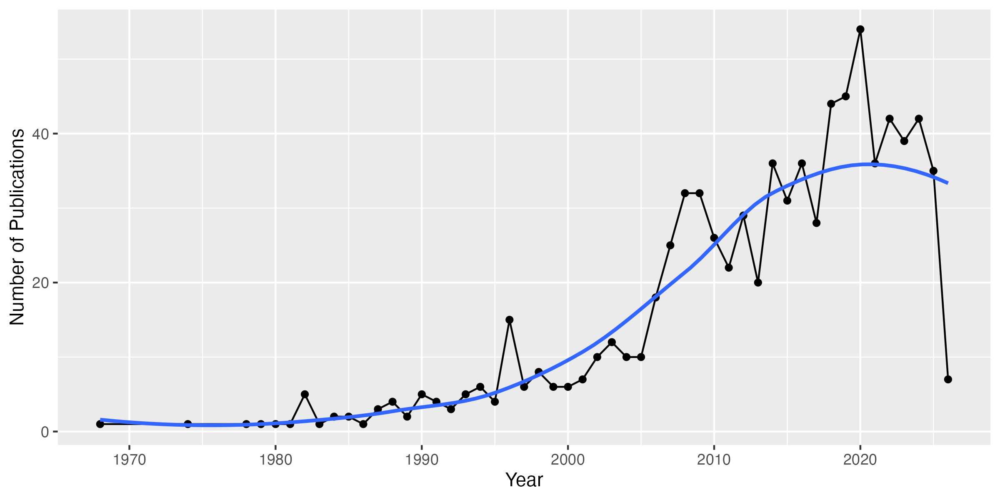

Peter F. Cowman et al. (2026). Modern Coral Taxonomy Requires Reproducible Data Alongside Field Observations—Comments on Veron et al. (2025). Unknown Venue. [https://doi.org/10.3390/d18020060](https://doi.org/https://doi.org/10.3390/d18020060) (article)

C. Mark Eakin et al. (2026). Severe and widespread coral reef damage during the 2014-2017 Global Coral Bleaching Event. Unknown Venue. [https://doi.org/10.1038/s41467-025-67506-w](https://doi.org/https://doi.org/10.1038/s41467-025-67506-w) (article)

Hanalei Hoʻopai‐Sylva et al. (2026). Proactive Coral Reef Restoration Using Thermally Tolerant Corals in Hawaiʻi. Unknown Venue. [https://doi.org/10.1111/con4.70004](https://doi.org/https://doi.org/10.1111/con4.70004) (article)

Anne A. Innes-Gold et al. (2026). Evaluating rabbitfish restocking potential in support of Guam’s coastal fisheries. Unknown Venue. [https://doi.org/10.1016/j.ecolmodel.2025.111460](https://doi.org/https://doi.org/10.1016/j.ecolmodel.2025.111460) (article)

Carl G. Meyer (2026). ‘Sharktober’: tiger shark parturition drives seasonality in shark bite incidents in Hawaiian waters. Unknown Venue. [https://doi.org/10.3389/fmars.2025.1587902](https://doi.org/https://doi.org/10.3389/fmars.2025.1587902) (article)

Cameron L. Nemeth et al. (2026). Nares Modulation in Breathing Cetaceans Reflects Respiratory Mechanics. Unknown Venue. [https://doi.org/10.1111/mms.70115](https://doi.org/https://doi.org/10.1111/mms.70115) (article)

Kristen Harmon, Melissa R. Price, Kāwika B. Winter (2026). The “regime shift extinctions” hypothesis and mass extinction of waterbirds in Hawaiʻi. Unknown Venue. [https://doi.org/10.1002/ecs2.70445](https://doi.org/https://doi.org/10.1002/ecs2.70445) (article)

Brijonnay C. Madrigal et al. (2026). Acoustic behaviour of endangered Hawaiian false killer whales. Unknown Venue. [https://doi.org/10.1098/rsos.250918](https://doi.org/https://doi.org/10.1098/rsos.250918) (article)

Olatubosun Fisayo Ojo, Kay Lynch, Jane Marian Luis (2026). First Report of Anthracnose Caused by <i>Colletotrichum tropicale</i> on Ferns <i>Reholttumia hudsoniana, Ctenitis latifrons, Cibotium menziesii,</i> and <i>Cibotium chamissoi</i> in Hawaii. Unknown Venue. [https://doi.org/10.1094/pdis-12-25-2464-pdn](https://doi.org/https://doi.org/10.1094/pdis-12-25-2464-pdn) (article)

Kenneth B. Raposa et al. (2026). The Secret Life of Tidal Marshes and Mangroves: Camera Trapping as a Window Into Wildlife Using North American Coastal Wetlands. Unknown Venue. [https://doi.org/10.1002/ece3.72872](https://doi.org/https://doi.org/10.1002/ece3.72872) (article)

Noam T. Altman-Kurosaki et al. (2026). Estimating sea urchin bioerosion: global synthesis and a case study inside and outside of no-take MPAs around O‘ahu, Hawai‘i. Unknown Venue. [https://doi.org/10.1007/s00227-025-04768-4](https://doi.org/https://doi.org/10.1007/s00227-025-04768-4) (article)

Sabrina L Rosset et al. (2026). From SCUBA to spectra: Broadly applicable methods for coral metabolomics research. Unknown Venue. [https://doi.org/10.64898/2026.01.19.700417](https://doi.org/https://doi.org/10.64898/2026.01.19.700417) (article)

Maria E. A. Santos et al. (2026). Global biogeography of zoantharians indicates a weak genetic differentiation between the Atlantic and Indo-Pacific oceans, and distinct communities in tropical and temperate provinces. Unknown Venue. [https://doi.org/10.21425/fob.19.174247](https://doi.org/https://doi.org/10.21425/fob.19.174247) (article)

Jan Vicente et al. (2026). Indo-Pacific coral reef sponge diversity declines under predicted future ocean conditions. Unknown Venue. [https://doi.org/10.21203/rs.3.rs-8664280/v1](https://doi.org/https://doi.org/10.21203/rs.3.rs-8664280/v1) (preprint)

Jack H. Buckner et al. (2026). Recovering complex ecological dynamics from time series using state-space universal dynamic equations. Unknown Venue. [https://doi.org/10.1038/s43247-025-03130-2](https://doi.org/https://doi.org/10.1038/s43247-025-03130-2) (article)

Jessica Reichert et al. (2026). Cylindrical, pylon-like structures with helix recesses enhance coral larval recruitment. Unknown Venue. [https://doi.org/10.1016/j.ecoleng.2026.107912](https://doi.org/https://doi.org/10.1016/j.ecoleng.2026.107912) (article)

Lauren Nerfa et al. (2026). Influence of land-use history and ENSO on the flora of the Southern Line Islands. Unknown Venue. [https://doi.org/10.1371/journal.pone.0341582](https://doi.org/https://doi.org/10.1371/journal.pone.0341582) (article)

Manichanh Satdichanh et al. (2026). Plant Litter Trait Variation Between Native and Invasive Species Across Steep Climate Gradients in the Hawaiian Islands. Unknown Venue. [https://doi.org/10.1002/ece3.73030](https://doi.org/https://doi.org/10.1002/ece3.73030) (article)

Alan M. Friedlander et al. (2026). Applying a seascape ecology approach enables biophysical and eco-cultural evaluation of marine protected areas. Unknown Venue. [https://doi.org/10.1007/s10980-026-02310-5](https://doi.org/https://doi.org/10.1007/s10980-026-02310-5) (article)

Jan Vicente et al. (2026). Specimen vouchers of sponges collected in a study of hidden sponge biodiversity within the Hawaiian reef cryptofauna conducted on Oahu, Hawaii from 2016 to 2018. Unknown Venue. [https://doi.org/10.26008/1912/bco-dmo.986892.1](https://doi.org/https://doi.org/10.26008/1912/bco-dmo.986892.1) (dataset)

Anna Halàsz et al. (2026). A revision of the octocoral genus Ovabunda Alderslade, 2001 (Anthozoa, Octocorallia, Xeniidae). Unknown Venue. [https://doi.org/10.48580/d3hkz](https://doi.org/https://doi.org/10.48580/d3hkz) (dataset)

Margaret J. Sporck-Koehler et al. (2026). A new species of Cyanea (Campanulaceae, Lobelioideae), from the Ko'olau Mountains of O'ahu, Hawaiian Islands. Unknown Venue. [https://doi.org/10.48580/d3g4x](https://doi.org/https://doi.org/10.48580/d3g4x) (dataset)

Juan R. Esquivel‐Muelbert et al. (2026). The natural architecture of oyster reefs maximizes recruit survival. Unknown Venue. [https://doi.org/10.1038/s41586-026-10103-8](https://doi.org/https://doi.org/10.1038/s41586-026-10103-8) (article)

Hjalmar S. Kühl et al. (2026). Collaborative surveying of intraspecific variation - new horizons for research and conservation. Unknown Venue. [https://doi.org/10.22541/au.177148833.37610113/v1](https://doi.org/https://doi.org/10.22541/au.177148833.37610113/v1) (article)

Frank E. Fish et al. (2026). Delta Wing‐Shaped Upper Jaw as a Control Surface to Stabilize Rorqual Whales During Lunge‐Feeding. Unknown Venue. [https://doi.org/10.1111/mms.70139](https://doi.org/https://doi.org/10.1111/mms.70139) (article)

Stephanie H. Stack et al. (2026). Why Warmer Oceans are a Problem for Humpback Whales. Unknown Venue. [https://doi.org/10.3389/frym.2026.1581310](https://doi.org/https://doi.org/10.3389/frym.2026.1581310) (article)

Hawaii Institute of Marine Biology et al. (2026). Hawai`i Cnidarian Reference Library 20260301. Unknown Venue. [https://doi.org/10.5281/zenodo.18749337](https://doi.org/https://doi.org/10.5281/zenodo.18749337) (dataset)

Hawaii Institute of Marine Biology et al. (2026). Hawai`i Cnidarian Reference Library 20260301. Unknown Venue. [https://doi.org/10.5281/zenodo.18749338](https://doi.org/https://doi.org/10.5281/zenodo.18749338) (dataset)

Carl Meyer (2026). Analysis of tiger and white shark bycatch in the Hawaii longline fishery. Unknown Venue. [https://doi.org/10.1016/j.fishres.2026.107687](https://doi.org/https://doi.org/10.1016/j.fishres.2026.107687) (article)

Garrett J. Fundakowski et al. (2026). Tracking morphological development in stony corals. Unknown Venue. [https://doi.org/10.1007/s00338-026-02815-0](https://doi.org/https://doi.org/10.1007/s00338-026-02815-0) (article)

Francesco de Bello et al. (2025). Raunkiæran shortfalls: Challenges and perspectives in trait‐based ecology. Unknown Venue. [https://doi.org/10.1002/ecm.70018](https://doi.org/https://doi.org/10.1002/ecm.70018) (article)

Jérémy Carlot et al. (2025). Vulnerability of benthic trait diversity across the Mediterranean Sea following mass mortality events. Unknown Venue. [https://doi.org/10.1038/s41467-025-55949-0](https://doi.org/https://doi.org/10.1038/s41467-025-55949-0) (article)

Harrison J. Ostridge et al. (2025). Local genetic adaptation to habitat in wild chimpanzees. Unknown Venue. [https://doi.org/10.1126/science.adn7954](https://doi.org/https://doi.org/10.1126/science.adn7954) (article)

Nina M. D. Schiettekatte et al. (2025). <i>habtools</i> : An R package to calculate <scp>3D</scp> metrics for surfaces and objects. Unknown Venue. [https://doi.org/10.1111/2041-210x.70027](https://doi.org/https://doi.org/10.1111/2041-210x.70027) (article)

Giada Tortorelli et al. (2025). Heat-induced stress modulates cell surface glycans and membrane lipids of coral symbionts. Unknown Venue. [https://doi.org/10.1093/ismejo/wraf073](https://doi.org/https://doi.org/10.1093/ismejo/wraf073) (article)

Daniel Gómez‐Gras et al. (2025). The Octocoral Trait Database: a global database of trait information for octocoral species. Unknown Venue. [https://doi.org/10.1038/s41597-024-04307-8](https://doi.org/https://doi.org/10.1038/s41597-024-04307-8) (article)

Robert F. Semmler et al. (2025). Marine heatwaves imperil emblematic reef fishes by altering the energetic landscape of coral reefs. Unknown Venue. [https://doi.org/10.1111/1365-2656.14238](https://doi.org/https://doi.org/10.1111/1365-2656.14238) (article)

I. C. Tiddy et al. (2025). Effects of social environment and energy efficiency on preferred swim speed in a marine generalist fish, pile perch (<i>Phanerodon vacca</i>). Unknown Venue. [https://doi.org/10.1242/jeb.249546](https://doi.org/https://doi.org/10.1242/jeb.249546) (article)

Michaela A. Kratofil et al. (2025). Deriving Probabilistic Age Estimates Using Common Photo‐Identification Catalog Information: An Application to Endangered Hawaiian False Killer Whales ( <scp> <i>Pseudorca crassidens</i> </scp> ). Unknown Venue. [https://doi.org/10.1111/mms.70080](https://doi.org/https://doi.org/10.1111/mms.70080) (article)

Kelle C. Freel et al. (2025). New SAR11 isolate genomes and global marine metagenomes resolve ecologically relevant units within the Pelagibacterales. Unknown Venue. [https://doi.org/10.1038/s41467-025-67043-6](https://doi.org/https://doi.org/10.1038/s41467-025-67043-6) (article)

Andréa G. Grottoli et al. (2025). Underwater Zooplankton Enhancement Light Array (UZELA): A technology solution to enhance zooplankton abundance and coral feeding in bleached and non‐bleached corals. Unknown Venue. [https://doi.org/10.1002/lom3.10669](https://doi.org/https://doi.org/10.1002/lom3.10669) (article)

Simon J. Brandl et al. (2025). A seascape dichotomy in the role of small consumers for coral reef energy fluxes. Unknown Venue. [https://doi.org/10.1002/ecy.70065](https://doi.org/https://doi.org/10.1002/ecy.70065) (article)

Danielle M. Barnas, Maya Zeff, Nyssa J. Silbiger (2025). Submarine groundwater discharge drives both direct and indirect effects on organismal and community metabolism on coral reefs. Unknown Venue. [https://doi.org/10.1098/rspb.2024.1554](https://doi.org/https://doi.org/10.1098/rspb.2024.1554) (article)

Carlo Caruso et al. (2025). Short-term stress testing predicts subsequent natural bleaching variation. Unknown Venue. [https://doi.org/10.1007/s00338-024-02608-3](https://doi.org/https://doi.org/10.1007/s00338-024-02608-3) (article)

Beatriz P. Pereira et al. (2025). Alteration of cleaner wrasse cognition and brain morphology under marine heatwaves. Unknown Venue. [https://doi.org/10.1111/1365-2435.70014](https://doi.org/https://doi.org/10.1111/1365-2435.70014) (article)

Rachel Dacks, Shreya Yadav, Alexander Mawyer (2025). Emerging human dimensions research in coastal and nearshore Oceania. Unknown Venue. [https://doi.org/10.1111/cobi.14455](https://doi.org/https://doi.org/10.1111/cobi.14455) (review)

Vanessa Tirpitz et al. (2025). Increasing microplastic concentrations have nonlinear impacts on the physiology of reef-building corals. Unknown Venue. [https://doi.org/10.1016/j.scitotenv.2024.178318](https://doi.org/https://doi.org/10.1016/j.scitotenv.2024.178318) (article)

María López-Hernández et al. (2025). Heterotrophic feeding modulates the effects of microplastic on corals, but not when combined with heat stress. Unknown Venue. [https://doi.org/10.1016/j.scitotenv.2025.179026](https://doi.org/https://doi.org/10.1016/j.scitotenv.2025.179026) (article)

Yanis Zentner et al. (2025). Active restoration of a long-lived octocoral drives rapid functional recovery in a temperate reef. Unknown Venue. [https://doi.org/10.1126/sciadv.ado5249](https://doi.org/https://doi.org/10.1126/sciadv.ado5249) (article)

José Amorim Reis‐Filho et al. (2025). Fisherwomen’s activities are as complex, salient, and profitable as those performed by fishermen: A study from vulnerable traditional fishery communities. Unknown Venue. [https://doi.org/10.1016/j.fishres.2025.107380](https://doi.org/https://doi.org/10.1016/j.fishres.2025.107380) (article)

Mary I. O’Connor et al. (2025). Scaling Temperature Effects on Metabolism from Individuals to Ecosystems. Unknown Venue. [https://doi.org/10.1146/annurev-ecolsys-102622-032335](https://doi.org/https://doi.org/10.1146/annurev-ecolsys-102622-032335) (article)

Zoé Delecambre et al. (2025). Ecological Specialisation of Reef Fishes Peaks in Global Biodiversity Hotspots. Unknown Venue. [https://doi.org/10.1111/geb.70050](https://doi.org/https://doi.org/10.1111/geb.70050) (article)

Camille Vizon et al. (2025). The metabolome of crustose coralline algae is driven by phylogeny and environmental conditions. Unknown Venue. [https://doi.org/10.1016/j.algal.2025.104146](https://doi.org/https://doi.org/10.1016/j.algal.2025.104146) (article)

Jessica Reichert et al. (2025). Helix recesses boost coral larvae settlement and survival. Unknown Venue. [https://doi.org/10.1016/j.biocon.2025.111407](https://doi.org/https://doi.org/10.1016/j.biocon.2025.111407) (article)

Jessica Reichert et al. (2025). Colony complexity affects microplastic loads in Pocillopora corals. Unknown Venue. [https://doi.org/10.1016/j.envpol.2025.126480](https://doi.org/https://doi.org/10.1016/j.envpol.2025.126480) (article)

Claire Lacey et al. (2025). Circum‐Island Line‐Transect Abundance Estimates of Spinner Dolphins Around Oʻahu, Hawaiʻi. Unknown Venue. [https://doi.org/10.1111/mms.70055](https://doi.org/https://doi.org/10.1111/mms.70055) (article)

Savio L.C. Woo et al. (2025). Building an Education Program to Support Positive Relationships Between Visitors, kamaʻāina, and the Environment in Hawaiʻi. Unknown Venue. [https://doi.org/10.15695/jstem/v8i1.03](https://doi.org/https://doi.org/10.15695/jstem/v8i1.03) (article)

Kelly E. Speare et al. (2025). Nitrogen enrichment determines coral mortality during a marine heatwave. Unknown Venue. [https://doi.org/10.1016/j.marpolbul.2025.118758](https://doi.org/https://doi.org/10.1016/j.marpolbul.2025.118758) (article)

Christian John et al. (2025). Terrigenous inputs link nutrient dynamics to microbial communities in a tropical lagoon. Unknown Venue. [https://doi.org/10.1002/lno.70240](https://doi.org/https://doi.org/10.1002/lno.70240) (article)

Sarah Tucker et al. (2025). A high-resolution diel survey of surface ocean metagenomes, metatranscriptomes, and transfer RNA transcripts. Unknown Venue. [https://doi.org/10.1038/s41597-025-06166-3](https://doi.org/https://doi.org/10.1038/s41597-025-06166-3) (article)

Grace O. Vaughan et al. (2025). Narrow Margins: Aerobic Performance and Temperature Tolerance of Coral Reef Fishes Facing Extreme Thermal Variability. Unknown Venue. [https://doi.org/10.1111/gcb.70100](https://doi.org/https://doi.org/10.1111/gcb.70100) (article)

Nyssa J. Silbiger et al. (2025). Terrestrial nutrient inputs restructure coral reef dissolved carbon fluxes via direct and indirect effects. Unknown Venue. [https://doi.org/10.1002/ecm.70020](https://doi.org/https://doi.org/10.1002/ecm.70020) (article)

Leah L. Bremer et al. (2025). Carbon benefits through agroforestry transitions on unmanaged fallow agricultural land in Hawaiʻi. Unknown Venue. [https://doi.org/10.1038/s41598-025-87891-y](https://doi.org/https://doi.org/10.1038/s41598-025-87891-y) (article)

Zahra Karimi et al. (2025). Mitigating Algal Competition with Fouling-Prevention Coatings for Coral Restoration and Reef Engineering. Unknown Venue. [https://doi.org/10.1021/acssuschemeng.4c07508](https://doi.org/https://doi.org/10.1021/acssuschemeng.4c07508) (article)

Amelia Meier et al. (2025). Network indicators of cultural resilience to anthropogenic removals in animal societies. Unknown Venue. [https://doi.org/10.1098/rstb.2024.0144](https://doi.org/https://doi.org/10.1098/rstb.2024.0144) (article)

Sarah Tucker et al. (2025). Seasonal and spatial transitions in phytoplankton assemblages spanning estuarine to open ocean waters of the tropical Pacific. Unknown Venue. [https://doi.org/10.1002/lno.70075](https://doi.org/https://doi.org/10.1002/lno.70075) (article)

Wen-Chien Yang et al. (2025). Antenatal corticosteroids for pregnant women at risk of preterm labour in low- and middle-income countries: utilisation and facility readiness. Unknown Venue. [https://doi.org/10.7189/jogh.15.04149](https://doi.org/https://doi.org/10.7189/jogh.15.04149) (article)

Elizabeth A. Lenz et al. (2025). Parental effects provide an opportunity for coral resilience following major bleaching events. Unknown Venue. [https://doi.org/10.1371/journal.pone.0290479](https://doi.org/https://doi.org/10.1371/journal.pone.0290479) (article)

Philip T. Patton et al. (2025). Optimizing automated photo identification for population assessments. Unknown Venue. [https://doi.org/10.1111/cobi.14436](https://doi.org/https://doi.org/10.1111/cobi.14436) (article)

Dennis V. Lavrov, Thomas L. Turner, Jan Vicente (2025). Pervasive Mitochondrial tRNA Gene Loss in Clade B of Haplosclerid Sponges (Porifera, Demospongiae). Unknown Venue. [https://doi.org/10.1093/gbe/evaf020](https://doi.org/https://doi.org/10.1093/gbe/evaf020) (article)

Koumudhi Deshpande et al. (2025). Direct observation and quantitative characterization of chemotactic behaviors in Caribbean coral larvae exposed to organic and inorganic settlement cues. Unknown Venue. [https://doi.org/10.1038/s41598-025-93194-z](https://doi.org/https://doi.org/10.1038/s41598-025-93194-z) (article)

C. Németh et al. (2025). The key to bubble-net feeding: how humpback whale morphology functionally differs from other baleen whales. Unknown Venue. [https://doi.org/10.1242/jeb.249607](https://doi.org/https://doi.org/10.1242/jeb.249607) (article)

Jeroen Brijs et al. (2025). Outlasting the Heat: Collapse of Herbivorous Fish Control of Invasive Algae During Marine Heatwaves. Unknown Venue. [https://doi.org/10.1111/gcb.70438](https://doi.org/https://doi.org/10.1111/gcb.70438) (article)

Rajan Sawhney et al. (2025). Fine-tuning protein language models unlocks the potential of underrepresented viral proteomes. Unknown Venue. [https://doi.org/10.7717/peerj.19919](https://doi.org/https://doi.org/10.7717/peerj.19919) (article)

Jan Vicente et al. (2025). Integrative taxonomy of introduced Haplosclerida and four new species from Hawaiʻi. Unknown Venue. [https://doi.org/10.11646/zootaxa.5566.2.2](https://doi.org/https://doi.org/10.11646/zootaxa.5566.2.2) (article)

Taylor Souza et al. (2025). Herbivore functions in the hot-seat: Resilience of Acanthurus triostegus to marine heatwaves. Unknown Venue. [https://doi.org/10.1371/journal.pone.0318410](https://doi.org/https://doi.org/10.1371/journal.pone.0318410) (article)

Danielle M. Barnas, Maya Zeff, Nyssa J. Silbiger (2025). Submarine Groundwater Discharge Alters Benthic Community Composition and Functional Diversity on Coral Reefs. Unknown Venue. [https://doi.org/10.3390/d17030161](https://doi.org/https://doi.org/10.3390/d17030161) (article)

Theresa W. Ong et al. (2025). Seeing Halos: Spatial and Consumer-Resource Constraints to Landscapes of Fear. Unknown Venue. [https://doi.org/10.1086/735688](https://doi.org/https://doi.org/10.1086/735688) (article)

Paul Kaseya Kazaba et al. (2025). Chimpanzees (<i>Pan troglodytes</i>) Indicate Mammalian Abundance Across Broad Spatial Scales. Unknown Venue. [https://doi.org/10.1002/ece3.71000](https://doi.org/https://doi.org/10.1002/ece3.71000) (article)

Judith Z. Drexler et al. (2025). The Scientific Benefits of a Statewide, Standardized, Coastal Wetland Monitoring Program in Hawaiʻi. Unknown Venue. [https://doi.org/10.1002/ece3.71293](https://doi.org/https://doi.org/10.1002/ece3.71293) (article)

Anne A. Innes‐Gold, Sophia A. Rahnke, Lisa C. McManus (2025). Land-sea interactions: Nutrient inputs, fishing effort, and predation shape estuarine fisheries harvest. Unknown Venue. [https://doi.org/10.1016/j.ecss.2025.109377](https://doi.org/https://doi.org/10.1016/j.ecss.2025.109377) (article)

Miguel Gandra et al. (2025). Long-term multitracking reveals contrasting yet highly resident movement ecologies of two sympatric and endangered deep-sea sharks. Unknown Venue. [https://doi.org/10.1016/j.ocecoaman.2025.107782](https://doi.org/https://doi.org/10.1016/j.ocecoaman.2025.107782) (article)

E. A. Lee, Lisa C. McManus (2025). Rate of Temperature Increase and Genetic Diversity Drives Marine Metapopulation Persistence under Climate Change. Unknown Venue. [https://doi.org/10.1086/737022](https://doi.org/https://doi.org/10.1086/737022) (article)

Pamela Ferretti et al. (2025). Theory of host-microbe symbioses: Challenges and opportunities. Unknown Venue. [https://doi.org/10.1016/j.chom.2025.05.001](https://doi.org/https://doi.org/10.1016/j.chom.2025.05.001) (article)

Emily Lester et al. (2025). Deciphering the footprints of predator–prey interactions on coral reefs: seasonal dynamics and environmental drivers of reef halos. Unknown Venue. [https://doi.org/10.1007/s00338-025-02701-1](https://doi.org/https://doi.org/10.1007/s00338-025-02701-1) (article)

Shannon M. Hennessey, Jamison M. Gove, Mary K. Donovan (2025). Utility of indicator thresholds across spatial gradients for applications to ecosystem‐based fisheries management. Unknown Venue. [https://doi.org/10.1002/ecs2.70307](https://doi.org/https://doi.org/10.1002/ecs2.70307) (article)

Juliana Ramos de Andrade et al. (2025). Iron pollution has minor impacts on the behavioral ecology of the Brazilian endemic reef damselfish Stegastes fuscus. Unknown Venue. [https://doi.org/10.1016/j.marenvres.2025.107435](https://doi.org/https://doi.org/10.1016/j.marenvres.2025.107435) (article)

Kyle A. Emery et al. (2025). Spatial patterns of sandy beach habitat use by mobile invertebrates vary with wrack type and tide phase. Unknown Venue. [https://doi.org/10.1016/j.ecss.2025.109510](https://doi.org/https://doi.org/10.1016/j.ecss.2025.109510) (article)

Anne A. Innes‐Gold et al. (2025). Restoration and management of an Indigenous aquaculture system helps mitigate climate change impacts to estuarine fisheries. Unknown Venue. [https://doi.org/10.1038/s44183-025-00152-3](https://doi.org/https://doi.org/10.1038/s44183-025-00152-3) (article)

Sarah Tucker et al. (2025). Habitat-specificity in SAR11 is associated with a few genes under high selection. Unknown Venue. [https://doi.org/10.1093/ismejo/wraf216](https://doi.org/https://doi.org/10.1093/ismejo/wraf216) (article)

Rajan Sawhney et al. (2025). Fine-Tuning Protein Language Models Unlocks the Potential of Underrepresented Viral Proteomes. Unknown Venue. [https://doi.org/10.1101/2025.04.17.649224](https://doi.org/https://doi.org/10.1101/2025.04.17.649224) (preprint)

Katherine D. Millage et al. (2025). The value of bottom trawling in Europe. Unknown Venue. [https://doi.org/10.21203/rs.3.rs-6298588/v1](https://doi.org/https://doi.org/10.21203/rs.3.rs-6298588/v1) (preprint)

Oscar Ramfelt et al. (2025). <i>Magnimaribacterales</i> marine bacteria genetically partition across the nearshore to open-ocean in the tropical Pacific Ocean. Unknown Venue. [https://doi.org/10.1101/2025.06.17.660167](https://doi.org/https://doi.org/10.1101/2025.06.17.660167) (preprint)

Sarah Tucker et al. (2025). A high-resolution diel survey of surface ocean metagenomes, metatranscriptomes, and transfer RNA transcripts. Unknown Venue. [https://doi.org/10.1101/2025.09.15.676277](https://doi.org/https://doi.org/10.1101/2025.09.15.676277) (preprint)

Joshua S. Madin et al. (2025). Demographic insights for coral restoration. Unknown Venue. [https://doi.org/10.1101/2025.10.21.683544](https://doi.org/https://doi.org/10.1101/2025.10.21.683544) (preprint)

Jamie R. Kerlin, Danielle M. Barnas, Nyssa J. Silbiger (2025). Conspecific interactions between corals mediate the effect of submarine groundwater discharge on coral physiology. Unknown Venue. [https://doi.org/10.1007/s00442-024-05660-6](https://doi.org/https://doi.org/10.1007/s00442-024-05660-6) (article)

Robert Daniel Rubin et al. (2025). Correction to: Insular and mainland interconnectivity in the movements of oceanic manta rays (Mobula birostris) off Mexico in the Eastern Tropical Pacific. Unknown Venue. [https://doi.org/10.1007/s10641-025-01676-w](https://doi.org/https://doi.org/10.1007/s10641-025-01676-w) (article)

Paolo Marra‐Biggs et al. (2025). Status of Giant Clam Populations in American Samoa. Unknown Venue. [https://doi.org/10.22541/au.173991280.04359600/v1](https://doi.org/https://doi.org/10.22541/au.173991280.04359600/v1) (preprint)

Kathryn Rose et al. (2025). CORRECTION: Advancing bioenergetics-based modeling to improve climate change projections of marine ecosystems. Unknown Venue. [https://doi.org/10.3354/meps14535_c](https://doi.org/https://doi.org/10.3354/meps14535_c) (article)

Manichanh Satdichanh et al. (2025). Plant litter trait variation between native and nonnative species across steep climate gradient in Hawaiian Islands. Unknown Venue. [https://doi.org/10.5194/egusphere-egu25-14991](https://doi.org/https://doi.org/10.5194/egusphere-egu25-14991) (preprint)

Lucinda Bryce et al. (2025). Water Isotopologue Time Series across Tropical Sites during ENSO extremes. Unknown Venue. [https://doi.org/10.5194/egusphere-egu25-12738](https://doi.org/https://doi.org/10.5194/egusphere-egu25-12738) (preprint)

Katherine Viehl et al. (2025). An Optimized Probe‐Based <scp>qPCR</scp> Assay for the Detection and Monitoring of the Invasive Lionfish ( <i>Pterois volitans</i> ) in the Atlantic. Unknown Venue. [https://doi.org/10.1002/edn3.70078](https://doi.org/https://doi.org/10.1002/edn3.70078) (article)

Jeroen Brijs et al. (2025). Eat more, often: The capacity of piscivores to meet increased energy demands in warming oceans. Unknown Venue. [https://doi.org/10.1016/j.scitotenv.2025.179105](https://doi.org/https://doi.org/10.1016/j.scitotenv.2025.179105) (article)

Anne A. Innes‐Gold et al. (2025). Indigenous aquaculture system responses to climate change, nutrient enrichment, and hatchery-based restocking. Unknown Venue. [https://doi.org/10.5194/oos2025-143](https://doi.org/https://doi.org/10.5194/oos2025-143) (preprint)

Jaelyn T. Bos, Malin L. Pinsky, Lisa McManus (2025). Acropora tenuis shows complex population genetic structure across a reefscape in the Coral Triangel.. Unknown Venue. [https://doi.org/10.5194/oos2025-689](https://doi.org/https://doi.org/10.5194/oos2025-689) (preprint)

Shannon Dixon et al. (2025). Coral recruit survivorship and growth increases with Underwater Zooplankton Light Enhancement Array (UZELA) enhanced feeding coupled with dome-shaped settlement modules. Unknown Venue. [https://doi.org/10.5194/oos2025-695](https://doi.org/https://doi.org/10.5194/oos2025-695) (preprint)

Jacob T. Snyder et al. (2025). A Mechanistic Model to Predict Reef Outcomes Using Land-based Pollutant and Fish Herbivory Data. Unknown Venue. [https://doi.org/10.5194/oos2025-433](https://doi.org/https://doi.org/10.5194/oos2025-433) (preprint)

Mollie Asbury et al. (2025). Fish community composition and functional diversity is determined by biophysical factors and habitat structure. . Unknown Venue. [https://doi.org/10.5194/oos2025-768](https://doi.org/https://doi.org/10.5194/oos2025-768) (preprint)

Kenneth M. Kim et al. (2025). Genomic Divergence of Sympatric Lineages Within <i>Stichopus</i> cf. <i>horrens</i> (Echinodermata: Stichopodidae): Insights on Reproductive Isolation Inferred From <scp>SNP</scp> Markers. Unknown Venue. [https://doi.org/10.1002/ece3.71283](https://doi.org/https://doi.org/10.1002/ece3.71283) (article)

David A. Armstrong, Conall McNicholl, Keisha D. Bahr (2025). Species-specific proton and oxygen flux in Hawaiian corals under ocean acidification—a microsensor analysis of the concentration boundary layer. Unknown Venue. [https://doi.org/10.21203/rs.3.rs-6149474/v1](https://doi.org/https://doi.org/10.21203/rs.3.rs-6149474/v1) (preprint)

Edward E. DeMartini et al. (2025). Leveraging positive interactions in nature to enhance the shared goals and success of One Health. Unknown Venue. [https://doi.org/10.1093/biosci/biaf067](https://doi.org/https://doi.org/10.1093/biosci/biaf067) (article)

Keith Kamikawa, Kimberly A. Peyton, Kirsten L.L. Oleson (2025). Angler Motivations and Preferences When Targeting Bonefishes in Hawai‘i. Unknown Venue. [https://doi.org/10.2984/78.3.2](https://doi.org/https://doi.org/10.2984/78.3.2) (article)

Molly Scott et al. (2025). Novel observations of an oceanic whitetip (Carcharhinus longimanus) and tiger shark (Galeocerdo cuvier) scavenging event. Unknown Venue. [https://doi.org/10.3389/frish.2025.1520995](https://doi.org/https://doi.org/10.3389/frish.2025.1520995) (article)

Van Wishingrad et al. (2025). Hawaiian black coral (Antipatharia) complete mitochondrial genomes have limited phylogenetic signal for taxonomic resolution of species. Unknown Venue. [https://doi.org/10.7717/peerj.18731](https://doi.org/https://doi.org/10.7717/peerj.18731) (article)

Robert J. Toonen, Matthew Iacchei, Brian W. Bowen (2025). Marine Biogeography. Unknown Venue. [https://doi.org/10.1016/b978-0-443-15750-9.00120-8](https://doi.org/https://doi.org/10.1016/b978-0-443-15750-9.00120-8) (book-chapter)

Verena Schoepf et al. (2025). Coral calcification mechanisms across a natural environmental mosaic in Hawai'i. Unknown Venue. [https://doi.org/10.1002/lno.70118](https://doi.org/https://doi.org/10.1002/lno.70118) (article)

Jessica Reichert, Jovanka Tepavčević (2025). Growing Apart: Global Warming Severely Impacts the Symbiosis of the Hawaiian Bobtail Squid and Bioluminescent Bacteria. Unknown Venue. [https://doi.org/10.1111/gcb.70308](https://doi.org/https://doi.org/10.1111/gcb.70308) (article)

Fiona M. Asigbee et al. (2025). Qualitative Study Examining the Effects of the COVID-19 Pandemic on the Homelessness Community Using PhotoVoice: Methodology and Lessons Learned. Unknown Venue. [https://doi.org/10.1177/16094069251353434](https://doi.org/https://doi.org/10.1177/16094069251353434) (article)

Brijonnay Madrigal et al. (2025). Acoustic behavior of endangered false killer whales (<i>Pseudorca crassidens</i>) using biologging devices in Hawaiʻi. Unknown Venue. [https://doi.org/10.1121/10.0038276](https://doi.org/https://doi.org/10.1121/10.0038276) (article)

Océane Boulais et al. (2025). Field demonstration of enhanced coral larvae settlement using acoustic enrichment, mesoscale artificial structures, and engineered biofilms. Unknown Venue. [https://doi.org/10.1121/10.0037991](https://doi.org/https://doi.org/10.1121/10.0037991) (article)

M. Rangel et al. (2025). Impact of anthropogenic sounds on coral reef health and sessile invertebrates. Unknown Venue. [https://doi.org/10.1121/10.0037352](https://doi.org/https://doi.org/10.1121/10.0037352) (article)

Eva Majerová, Camryn Steinle, Crawford Drury (2025). BAK knockdown delays bleaching and alleviates oxidative DNA damage in a reef-building coral. Unknown Venue. [https://doi.org/10.1038/s42003-025-08671-y](https://doi.org/https://doi.org/10.1038/s42003-025-08671-y) (article)

Eva Llabrés et al. (2025). A spatial numerical model for seagrass–herbivore interactions and the formation of reef halos. Unknown Venue. [https://doi.org/10.1007/s00338-025-02729-3](https://doi.org/https://doi.org/10.1007/s00338-025-02729-3) (article)

Elizabeth M. P. Madin et al. (2025). COVID-19 anthropause affects coral reef ecosystems through biophysical changes. Unknown Venue. [https://doi.org/10.1038/s44183-025-00144-3](https://doi.org/https://doi.org/10.1038/s44183-025-00144-3) (article)

Lewis Evans et al. (2025). Elevating Photo‐Identification: Aerial‐Identification Improves Re‐Sight Rates and Supports Long‐Term Monitoring of Humpback Whales. Unknown Venue. [https://doi.org/10.1111/mms.70078](https://doi.org/https://doi.org/10.1111/mms.70078) (article)

Jana Vetter et al. (2025). Species identity and composition affect the productivity of stony corals. Unknown Venue. [https://doi.org/10.1007/s00338-025-02748-0](https://doi.org/https://doi.org/10.1007/s00338-025-02748-0) (article)

Suzanne Redelinghuys et al. (2025). Gut Microbial Diversity and Genome‐Wide Variation of the Cape Sea Urchin ( <i>Parechinus angulosus</i> ) Across a Thermal Gradient. Unknown Venue. [https://doi.org/10.1111/aec.70118](https://doi.org/https://doi.org/10.1111/aec.70118) (article)

Jessica Reichert et al. (2025). Cylindrical, pylon-like structures with helix recesses enhance coral larval recruitment. Unknown Venue. [https://doi.org/10.1101/2025.10.06.680805](https://doi.org/https://doi.org/10.1101/2025.10.06.680805) (preprint)

Jason Baer et al. (2025). Microbiome spatial scaling varies among members, hosts, and environments across model island ecosystems. Unknown Venue. [https://doi.org/10.1093/ismejo/wraf228](https://doi.org/https://doi.org/10.1093/ismejo/wraf228) (article)

Vera M. Titze et al. (2025). Monitoring microplastics in live reef-building corals with microscopic laser particles. Unknown Venue. [https://doi.org/10.48550/arxiv.2502.20014](https://doi.org/https://doi.org/10.48550/arxiv.2502.20014) (preprint)

Van Wishingrad et al. (2025). Metabarcoding Primers for Indo‐Pacific Fishes. Unknown Venue. [https://doi.org/10.1002/edn3.70205](https://doi.org/https://doi.org/10.1002/edn3.70205) (article)

Pilar Castro‐Díez et al. (2025). How does the enhancement of carbon sequestration by non-native forests affect other ecosystem services?. Unknown Venue. [https://doi.org/10.1007/s11056-025-10138-1](https://doi.org/https://doi.org/10.1007/s11056-025-10138-1) (article)

Megan K. Sullivan et al. (2025). Context‐dependent forest elephant seed dispersal: implications for pathways of elephant‐driven patterns of biodiversity and carbon storage. Unknown Venue. [https://doi.org/10.1002/oik.11507](https://doi.org/https://doi.org/10.1002/oik.11507) (article)

Hugo Ducret et al. (2025). Shading does not lower thermal tolerance in the coral Montipora capitata. Unknown Venue. [https://doi.org/10.1007/s00338-025-02753-3](https://doi.org/https://doi.org/10.1007/s00338-025-02753-3) (article)

Crow White et al. (2025). Cohort tracking using size‐frequency population survey data to estimate individual growth. Unknown Venue. [https://doi.org/10.1002/ecs2.70436](https://doi.org/https://doi.org/10.1002/ecs2.70436) (article)

Jose F. Grillo et al. (2025). Coral Skeletal Cores as Windows Into Past Symbiodiniaceae Community Dynamics. Unknown Venue. [https://doi.org/10.1111/gcb.70575](https://doi.org/https://doi.org/10.1111/gcb.70575) (article)

Kirby Parnell et al. (2025). Underwater sound production of free-ranging Hawaiian monk seals. Unknown Venue. [https://doi.org/10.1098/rsos.250987](https://doi.org/https://doi.org/10.1098/rsos.250987) (article)

Michelle VanCompernolle et al. (2025). Vulnerability of marine megafauna to global at‐sea anthropogenic threats. Unknown Venue. [https://doi.org/10.1111/cobi.70147](https://doi.org/https://doi.org/10.1111/cobi.70147) (article)

Paolo Marra‐Biggs et al. (2025). Status and trends of giant clam populations demonstrate the effectiveness of village-based protection in American Sāmoa. Unknown Venue. [https://doi.org/10.7717/peerj.20290](https://doi.org/https://doi.org/10.7717/peerj.20290) (article)

Garrett J. Fundakowski et al. (2025). Tracking morphological development in stony corals. Unknown Venue. [https://doi.org/10.1101/2025.11.20.689442](https://doi.org/https://doi.org/10.1101/2025.11.20.689442) (preprint)

Chloé A. Blandino et al. (2025). Seabirds mediate intraguild and competitive interactions in a shark community. Unknown Venue. [https://doi.org/10.1002/ecs2.70486](https://doi.org/https://doi.org/10.1002/ecs2.70486) (article)

Evan B. Freel et al. (2025). Population Genetics to Population Genomics: Revisiting Multispecies Connectivity of the Hawaiian Archipelago. Unknown Venue. [https://doi.org/10.3390/fishes10120623](https://doi.org/https://doi.org/10.3390/fishes10120623) (article)

Lauren Arnold, Jonathan J. Dale (2025). Improving accuracy of stingray size estimations in video surveys. Unknown Venue. [https://doi.org/10.1007/s10641-025-01786-5](https://doi.org/https://doi.org/10.1007/s10641-025-01786-5) (article)

Tristan Permentier et al. (2025). Proteomic insights into the photobiology of the Hawaiian rice coral <i>Montipora capitata</i> in response to decreased light intensity. Unknown Venue. [https://doi.org/10.64898/2025.12.02.691798](https://doi.org/https://doi.org/10.64898/2025.12.02.691798) (article)

Sophia A. Rahnke et al. (2025). Interaction strength and harvest intensity mediate predator–prey dynamics on coral reefs. Unknown Venue. [https://doi.org/10.1002/ecs2.70449](https://doi.org/https://doi.org/10.1002/ecs2.70449) (article)

David A. Armstrong, Conall McNicholl, Keisha D. Bahr (2025). Ocean acidification modulates material flux linked with coral calcification and photosynthesis. Unknown Venue. [https://doi.org/10.1038/s41598-025-30818-4](https://doi.org/https://doi.org/10.1038/s41598-025-30818-4) (article)

Cher F. Y. Chow et al. (2025). Random encounter modelling as a viable method to estimate absolute abundance of reef fish. Unknown Venue. [https://doi.org/10.1111/2041-210x.70215](https://doi.org/https://doi.org/10.1111/2041-210x.70215) (article)

Paige Wernli et al. (2025). Telemetry reveals potential mating aggregation behavior of tiger sharks (Galeocerdo cuvier) in Hawaiʻi. Unknown Venue. [https://doi.org/10.1038/s41598-025-27742-y](https://doi.org/https://doi.org/10.1038/s41598-025-27742-y) (article)

Zeff, Maya, Barnas, Danielle, Silbiger, Nyssa (2025). Terrigenous nutrient pulses facilitate shifts in reef fish community structure and feeding through trophic plasticity. Unknown Venue. [https://doi.org/10.5281/zenodo.17611972](https://doi.org/https://doi.org/10.5281/zenodo.17611972) (other)

Zeff, Maya, Barnas, Danielle, Silbiger, Nyssa (2025). Terrigenous nutrient pulses facilitate shifts in reef fish community structure and feeding through trophic plasticity. Unknown Venue. [https://doi.org/10.5281/zenodo.17611973](https://doi.org/https://doi.org/10.5281/zenodo.17611973) (other)

Ahmed, Momin, Vicente, Jan, Lavrov, Dennis (2025). Metilla boricua Project. Unknown Venue. [https://doi.org/10.5281/zenodo.17715249](https://doi.org/https://doi.org/10.5281/zenodo.17715249) (dataset)

Ahmed, Momin, Vicente, Jan, Lavrov, Dennis (2025). Metilla boricua Project. Unknown Venue. [https://doi.org/10.5281/zenodo.17715250](https://doi.org/https://doi.org/10.5281/zenodo.17715250) (dataset)

Shannon L. Dixon et al. (2025). Effects of very short‐term formalin fixation on coral carbon and nitrogen stable isotopes, total lipids, and chlorophyll <scp> <i>a</i> </scp> and <scp> <i>c2</i> </scp> concentrations. Unknown Venue. [https://doi.org/10.1002/lom3.70027](https://doi.org/https://doi.org/10.1002/lom3.70027) (article)

Jan Vicente et al. (2025). Integrative taxonomy of introduced Haplosclerida and three new species of Haliclona sponges from Hawai'i based on samples collected from a variety of habitats on O'ahu from 2016 to 2022. Unknown Venue. [https://doi.org/10.26008/1912/bco-dmo.986889.1](https://doi.org/https://doi.org/10.26008/1912/bco-dmo.986889.1) (dataset)

Rachel M Nunley et al. (2025). Morphological and genetic data of tetractinellid sponges from Kāne'ohe Bay, Hawai'i based on specimens collected between 2016 and 2023. Unknown Venue. [https://doi.org/10.26008/1912/bco-dmo.986886.1](https://doi.org/https://doi.org/10.26008/1912/bco-dmo.986886.1) (dataset)

Simon Dedman et al. (2024). Ecological roles and importance of sharks in the Anthropocene Ocean. Unknown Venue. [https://doi.org/10.1126/science.adl2362](https://doi.org/https://doi.org/10.1126/science.adl2362) (review)

Iain R. Caldwell et al. (2024). Global trends and biases in biodiversity conservation research. Unknown Venue. [https://doi.org/10.1016/j.crsus.2024.100082](https://doi.org/https://doi.org/10.1016/j.crsus.2024.100082) (article)

Ted Cheeseman et al. (2024). Bellwethers of change: population modelling of North Pacific humpback whales from 2002 through 2021 reveals shift from recovery to climate response. Unknown Venue. [https://doi.org/10.1098/rsos.231462](https://doi.org/https://doi.org/10.1098/rsos.231462) (article)

Guillem Chust et al. (2024). Cross-basin and cross-taxa patterns of marine community tropicalization and deborealization in warming European seas. Unknown Venue. [https://doi.org/10.1038/s41467-024-46526-y](https://doi.org/https://doi.org/10.1038/s41467-024-46526-y) (article)

Linda Eggertsen et al. (2024). Complexities of reef fisheries in Brazil: a retrospective and functional approach. Unknown Venue. [https://doi.org/10.1007/s11160-023-09826-y](https://doi.org/https://doi.org/10.1007/s11160-023-09826-y) (article)

Kathryn Rose et al. (2024). Advancing bioenergetics-based modeling to improve climate change projections of marine ecosystems. Unknown Venue. [https://doi.org/10.3354/meps14535](https://doi.org/https://doi.org/10.3354/meps14535) (article)

Jacob L. Johansen et al. (2024). Impacts of ocean warming on fish size reductions on the world’s hottest coral reefs. Unknown Venue. [https://doi.org/10.1038/s41467-024-49459-8](https://doi.org/https://doi.org/10.1038/s41467-024-49459-8) (article)

Xueye Wang et al. (2024). Strontium isoscape of sub-Saharan Africa allows tracing origins of victims of the transatlantic slave trade. Unknown Venue. [https://doi.org/10.1038/s41467-024-55256-0](https://doi.org/https://doi.org/10.1038/s41467-024-55256-0) (article)

Martin van Aswegen et al. (2024). Energetic cost of gestation and prenatal growth in humpback whales. Unknown Venue. [https://doi.org/10.1113/jp287304](https://doi.org/https://doi.org/10.1113/jp287304) (article)

Amaël Dupaix et al. (2024). The challenge of assessing the effects of drifting fish aggregating devices on the behaviour and biology of tropical tuna. Unknown Venue. [https://doi.org/10.1111/faf.12813](https://doi.org/https://doi.org/10.1111/faf.12813) (article)

Evelyn Abbott, Coral Loockerman, Mikhail V. Matz (2024). Modifications to gene body methylation do not alter gene expression plasticity in a reef‐building coral. Unknown Venue. [https://doi.org/10.1111/eva.13662](https://doi.org/https://doi.org/10.1111/eva.13662) (article)

Martin van Aswegen et al. (2024). Maternal investment, body condition and calf growth in humpback whales. Unknown Venue. [https://doi.org/10.1113/jp287379](https://doi.org/https://doi.org/10.1113/jp287379) (article)

Marvin Rades et al. (2024). Chronic effects of exposure to polyethylene microplastics may be mitigated at the expense of growth and photosynthesis in reef-building corals. Unknown Venue. [https://doi.org/10.1016/j.marpolbul.2024.116631](https://doi.org/https://doi.org/10.1016/j.marpolbul.2024.116631) (article)

Eva Llabrés et al. (2024). A generalized numerical model for clonal growth in scleractinian coral colonies. Unknown Venue. [https://doi.org/10.1098/rspb.2024.1327](https://doi.org/https://doi.org/10.1098/rspb.2024.1327) (article)

Robin W. Baird et al. (2024). Long-term strategies for studying rare species: results and lessons from a multi-species study of odontocetes around the main Hawaiian Islands. Unknown Venue. [https://doi.org/10.1071/pc23027](https://doi.org/https://doi.org/10.1071/pc23027) (article)

Darren L C Y Li Shing Hiung et al. (2024). Ocean weather, biological rates, and unexplained global ecological patterns. Unknown Venue. [https://doi.org/10.1093/pnasnexus/pgae260](https://doi.org/https://doi.org/10.1093/pnasnexus/pgae260) (article)

Konstantina Agiadi et al. (2024). Geohistorical insights into marine functional connectivity. Unknown Venue. [https://doi.org/10.1093/icesjms/fsae117](https://doi.org/https://doi.org/10.1093/icesjms/fsae117) (article)

Zhengwei Luo et al. (2024). TRPM7 in neurodevelopment and therapeutic prospects for neurodegenerative disease. Unknown Venue. [https://doi.org/10.1016/j.ceca.2024.102886](https://doi.org/https://doi.org/10.1016/j.ceca.2024.102886) (review)

Ruth Y. Oliver et al. (2024). Opening a conversation on responsible environmental data science in the age of large language models. Unknown Venue. [https://doi.org/10.1017/eds.2024.12](https://doi.org/https://doi.org/10.1017/eds.2024.12) (article)

Christopher P. Jury et al. (2024). Experimental coral reef communities transform yet persist under mitigated future ocean warming and acidification. Unknown Venue. [https://doi.org/10.1073/pnas.2407112121](https://doi.org/https://doi.org/10.1073/pnas.2407112121) (article)

Simone Franceschini, John Lynham, Elizabeth M. P. Madin (2024). A global test of MPA spillover benefits to recreational fisheries. Unknown Venue. [https://doi.org/10.1126/sciadv.ado9783](https://doi.org/https://doi.org/10.1126/sciadv.ado9783) (article)

Megan F. McKenna et al. (2024). Understanding vessel noise across a network of marine protected areas. Unknown Venue. [https://doi.org/10.1007/s10661-024-12497-2](https://doi.org/https://doi.org/10.1007/s10661-024-12497-2) (article)

Keno Ferter et al. (2024). Atlantic bluefin tuna tagged off Norway show extensive annual migrations, high site-fidelity and dynamic behaviour in the Atlantic Ocean and Mediterranean Sea. Unknown Venue. [https://doi.org/10.1098/rspb.2024.1501](https://doi.org/https://doi.org/10.1098/rspb.2024.1501) (article)

Martin C. Arostegui et al. (2024). Advancing the frontier of fish geolocation into the ocean’s midwaters. Unknown Venue. [https://doi.org/10.1016/j.dsr.2024.104386](https://doi.org/https://doi.org/10.1016/j.dsr.2024.104386) (article)

Adrián Lázaro‐Lobo et al. (2024). Worldwide comparison of carbon stocks and fluxes between native and non‐native forests. Unknown Venue. [https://doi.org/10.1111/brv.13176](https://doi.org/https://doi.org/10.1111/brv.13176) (review)

William Harrigan et al. (2024). Improvements in viral gene annotation using large language models and soft alignments. Unknown Venue. [https://doi.org/10.1186/s12859-024-05779-6](https://doi.org/https://doi.org/10.1186/s12859-024-05779-6) (article)

Christopher P. Jury, Robert J. Toonen (2024). Widespread scope for coral adaptation under combined ocean warming and acidification. Unknown Venue. [https://doi.org/10.1098/rspb.2024.1161](https://doi.org/https://doi.org/10.1098/rspb.2024.1161) (article)

Anne A. Innes‐Gold et al. (2024). Restoration of an Indigenous aquaculture system can increase reef fish density and fisheries harvest in Hawai<b>‘</b>i. Unknown Venue. [https://doi.org/10.1002/ecs2.4797](https://doi.org/https://doi.org/10.1002/ecs2.4797) (article)

Andrew R. Tilman et al. (2024). Maintaining human wellbeing as socio-environmental systems undergo regime shifts. Unknown Venue. [https://doi.org/10.1016/j.ecolecon.2024.108194](https://doi.org/https://doi.org/10.1016/j.ecolecon.2024.108194) (article)

Cataixa López, Fernando Tuya, Sabrina Clemente (2024). Understanding Balanophyllia regia Distribution in the Canary Islands: Effects of Environmental Factors and Methodologies for Future Monitoring. Unknown Venue. [https://doi.org/10.3390/d16080475](https://doi.org/https://doi.org/10.3390/d16080475) (article)

Fabien Vivier et al. (2024). Inferring dolphin population status: using unoccupied aerial systems to quantify age‐structure. Unknown Venue. [https://doi.org/10.1111/acv.12978](https://doi.org/https://doi.org/10.1111/acv.12978) (article)

Kerri L. Dobson et al. (2024). Ocean acidification does not prolong recovery of coral holobionts from natural thermal stress in two consecutive years. Unknown Venue. [https://doi.org/10.1038/s43247-024-01672-5](https://doi.org/https://doi.org/10.1038/s43247-024-01672-5) (article)

Benjamin Hagedorn et al. (2024). Refining submarine groundwater discharge analysis through nonlinear quantile regression of geochemical time series. Unknown Venue. [https://doi.org/10.1016/j.jhydrol.2024.132145](https://doi.org/https://doi.org/10.1016/j.jhydrol.2024.132145) (article)

Simon J. Brandl et al. (2024). Unifying Coral Reef States Through Space and Time Reveals a Changing Ecosystem. Unknown Venue. [https://doi.org/10.1111/geb.13926](https://doi.org/https://doi.org/10.1111/geb.13926) (article)

Samantha Andrzejaczek et al. (2024). Lunar cycle effects on pelagic predators and fisheries: insights into tuna, billfish, sharks, and rays. Unknown Venue. [https://doi.org/10.1007/s11160-024-09914-7](https://doi.org/https://doi.org/10.1007/s11160-024-09914-7) (article)

Liah McPherson et al. (2024). Quantifying the abundance and survival rates of island-associated spinner dolphins using a multi-state open robust design model. Unknown Venue. [https://doi.org/10.1038/s41598-024-64220-3](https://doi.org/https://doi.org/10.1038/s41598-024-64220-3) (article)

Miranda E. Lentz et al. (2024). Flow rates alter the outcome of coral bleaching and growth experiments. Unknown Venue. [https://doi.org/10.1007/s44289-024-00034-5](https://doi.org/https://doi.org/10.1007/s44289-024-00034-5) (article)

Spencer Miller, Carlo Caruso, Crawford Drury (2024). Validating the Precision and Accuracy of Coral Fragment Photogrammetry. Unknown Venue. [https://doi.org/10.3390/rs16224274](https://doi.org/https://doi.org/10.3390/rs16224274) (article)

Walter I. Torres et al. (2024). Post-disturbance recovery dynamics of connected coral subpopulations. Unknown Venue. [https://doi.org/10.1007/s12080-024-00598-0](https://doi.org/https://doi.org/10.1007/s12080-024-00598-0) (article)

LeeAnn Frank et al. (2024). The effect of progressive hypoxia on swimming mode and oxygen consumption in the pile perch, Phanerodon vacca. Unknown Venue. [https://doi.org/10.3389/frish.2024.1289848](https://doi.org/https://doi.org/10.3389/frish.2024.1289848) (article)

Eileen M. Nalley et al. (2024). Examining variations in functional homogeneity in herbivorous coral reef fishes in Pacific Islands experiencing a range of human impacts. Unknown Venue. [https://doi.org/10.1016/j.ecolind.2024.111622](https://doi.org/https://doi.org/10.1016/j.ecolind.2024.111622) (article)

Conor Ryan et al. (2024). Morphology of nares associated with stereo-olfaction in baleen whales. Unknown Venue. [https://doi.org/10.1098/rsbl.2023.0479](https://doi.org/https://doi.org/10.1098/rsbl.2023.0479) (article)

A. Szabó et al. (2024). Solitary humpback whales manufacture bubble-nets as tools to increase prey intake. Unknown Venue. [https://doi.org/10.1098/rsos.240328](https://doi.org/https://doi.org/10.1098/rsos.240328) (article)

Molly A. Timmers et al. (2024). Proteinase K is not essential for marine <scp>eDNA</scp> metabarcoding. Unknown Venue. [https://doi.org/10.1002/edn3.523](https://doi.org/https://doi.org/10.1002/edn3.523) (article)

Jeneen Hadj‐Hammou et al. (2024). Global patterns and drivers of fish reproductive potential on coral reefs. Unknown Venue. [https://doi.org/10.1038/s41467-024-50367-0](https://doi.org/https://doi.org/10.1038/s41467-024-50367-0) (article)

Andy Lee et al. (2024). Genetic adaptation despite high gene flow in a range‐expanding population. Unknown Venue. [https://doi.org/10.1111/mec.17511](https://doi.org/https://doi.org/10.1111/mec.17511) (article)

Nuba Zamora-Jordán et al. (2024). Responses of Palythoa caribaeorum and its associated endosymbionts to thermal stress. Unknown Venue. [https://doi.org/10.1007/s00338-024-02549-x](https://doi.org/https://doi.org/10.1007/s00338-024-02549-x) (article)

Oscar Ramfelt et al. (2024). Isolate-anchored comparisons reveal evolutionary and functional differentiation across SAR86 marine bacteria. Unknown Venue. [https://doi.org/10.1093/ismejo/wrae227](https://doi.org/https://doi.org/10.1093/ismejo/wrae227) (article)

Aviv Suan et al. (2024). Quantifying 3D coral reef structural complexity from 2D drone imagery using artificial intelligence. Unknown Venue. [https://doi.org/10.1016/j.ecoinf.2024.102958](https://doi.org/https://doi.org/10.1016/j.ecoinf.2024.102958) (article)

Jamie M. Caldwell et al. (2024). Multi‐<scp>F</scp>actor <scp>C</scp>oral <scp>D</scp>isease <scp>R</scp>isk: A new product for early warning and management. Unknown Venue. [https://doi.org/10.1002/eap.2961](https://doi.org/https://doi.org/10.1002/eap.2961) (article)

Larissa Bettcher Brito et al. (2024). Intraoceanic and interoceanic dispersal of a marine invader: revealing an invasion in two ocean basins. Unknown Venue. [https://doi.org/10.1007/s10530-024-03385-4](https://doi.org/https://doi.org/10.1007/s10530-024-03385-4) (article)

Éric Clua et al. (2024). Increase of coastal shark bite frequency linked to the COVID-19 lockdown reveals a territoriality-dominance behaviour toward humans. Unknown Venue. [https://doi.org/10.1163/1568539x-bja10279](https://doi.org/https://doi.org/10.1163/1568539x-bja10279) (article)

Kurt Schmid et al. (2024). Use of long-term underwater camera surveillance to assess the effects of the largest Amazonian hydroelectric dam on fish communities. Unknown Venue. [https://doi.org/10.1038/s41598-024-70636-8](https://doi.org/https://doi.org/10.1038/s41598-024-70636-8) (article)

Leah E. K. Shizuru et al. (2024). The complete mitochondrial genome of a species of <i>Cirrhipathes</i> de Blainville, 1830 from Kauaʻi, Hawaiʻi (Hexacorallia: Antipatharia). Unknown Venue. [https://doi.org/10.1080/23802359.2024.2310130](https://doi.org/https://doi.org/10.1080/23802359.2024.2310130) (article)

Kirby Parnell et al. (2024). Underwater soundscapes within critical habitats of the endangered Hawaiian monk seal: implications for conservation. Unknown Venue. [https://doi.org/10.3354/esr01336](https://doi.org/https://doi.org/10.3354/esr01336) (article)

Mollie Asbury et al. (2024). Recovery potential of fish and coral populations following ecological disturbance. Unknown Venue. [https://doi.org/10.1002/ecs2.4915](https://doi.org/https://doi.org/10.1002/ecs2.4915) (article)

Kyle F. Edwards et al. (2024). Trophic strategies of picoeukaryotic phytoplankton vary over time and with depth in the North Pacific Subtropical Gyre. Unknown Venue. [https://doi.org/10.1111/1462-2920.16689](https://doi.org/https://doi.org/10.1111/1462-2920.16689) (article)

Courtney S. Couch et al. (2024). Coral reef community recovery trajectories vary by depth following a moderate heat stress event at Swains Island, American Samoa. Unknown Venue. [https://doi.org/10.1007/s00227-024-04533-z](https://doi.org/https://doi.org/10.1007/s00227-024-04533-z) (article)

Robert Daniel Rubin et al. (2024). Insular and mainland interconnectivity in the movements of oceanic manta rays (Mobula birostris) off Mexico in the Eastern Tropical Pacific. Unknown Venue. [https://doi.org/10.1007/s10641-024-01622-2](https://doi.org/https://doi.org/10.1007/s10641-024-01622-2) (article)

Camille Pagniello et al. (2024). Novel CTD tag establishes shark fins as ocean observing platforms. Unknown Venue. [https://doi.org/10.1038/s41598-024-63543-5](https://doi.org/https://doi.org/10.1038/s41598-024-63543-5) (article)

Brijonnay C. Madrigal et al. (2024). Comparing the underwater soundscape of the Hawaiian Islands Humpback Whale National Marine Sanctuary and potential influences of the COVID-19 pandemic. Unknown Venue. [https://doi.org/10.3389/fmars.2024.1342454](https://doi.org/https://doi.org/10.3389/fmars.2024.1342454) (article)

Maddalena Ranucci et al. (2024). Cleaner gobies can solve a biological market task when the correct cue is larger. Unknown Venue. [https://doi.org/10.3389/fevo.2024.1375835](https://doi.org/https://doi.org/10.3389/fevo.2024.1375835) (article)

Ken Longenecker et al. (2024). Errors in estimating reproductive parameters with macroscopic methods: a case study on the protogynous blacktip grouper <i>Epinephelus fasciatus</i> (Forsskål 1775). Unknown Venue. [https://doi.org/10.1111/jfb.15893](https://doi.org/https://doi.org/10.1111/jfb.15893) (article)

Sonia Fernández-Martín et al. (2024). Habitat characteristics shaping zoantharians’ distribution at intertidal habitats of the Canary Islands. Unknown Venue. [https://doi.org/10.1016/j.rsma.2024.103755](https://doi.org/https://doi.org/10.1016/j.rsma.2024.103755) (article)

Anne A. Innes‐Gold et al. (2024). Modeling the interactive effects of sea surface temperature, fishing effort, and spatial closures on reef fish populations. Unknown Venue. [https://doi.org/10.1007/s12080-024-00591-7](https://doi.org/https://doi.org/10.1007/s12080-024-00591-7) (article)

Marcos B. Lucena et al. (2024). When the Light Goes Out: Distribution and Sleeping Habitat Use of Parrotfishes at Night. Unknown Venue. [https://doi.org/10.3390/fishes9100370](https://doi.org/https://doi.org/10.3390/fishes9100370) (article)

Christine M. Ambrosino et al. (2024). Exploring Science Identity and Latent Factors of Student Gains in a Place-based Marine Science CURE Designed to Provide Access to Hawaiʻi Students from Historically Marginalized Ethnicities. Unknown Venue. [https://doi.org/10.1187/cbe.24-02-0038](https://doi.org/https://doi.org/10.1187/cbe.24-02-0038) (article)

Veronica Gibson et al. (2024). Integrated physiological response by four species of Rhodophyta to submarine groundwater discharge reveals complex patterns among closely-related species. Unknown Venue. [https://doi.org/10.1038/s41598-024-74555-6](https://doi.org/https://doi.org/10.1038/s41598-024-74555-6) (article)

Douglas Francisco Marcolino Gherardi et al. (2024). Genetic and Demographic Connectivity in Brazilian Reef Environments. Unknown Venue. [https://doi.org/10.1007/978-3-031-59152-5_7](https://doi.org/https://doi.org/10.1007/978-3-031-59152-5_7) (book-chapter)

Lintao Huang et al. (2024). Loss of Coral Trait Diversity and Impacts on Reef Fish Assemblages on Recovering Reefs. Unknown Venue. [https://doi.org/10.1002/ece3.70510](https://doi.org/https://doi.org/10.1002/ece3.70510) (article)

Éric Clua et al. (2024). First Evidence of Individual Sharks Involved in Multiple Predatory Bites on People. Unknown Venue. [https://doi.org/10.1111/conl.13067](https://doi.org/https://doi.org/10.1111/conl.13067) (article)

M Royer et al. (2024). Aerobic and anaerobic poise of white swimming muscles of the deep-diving scalloped hammerhead shark: comparison to sympatric coastal and deep-water species. Unknown Venue. [https://doi.org/10.3389/fmars.2024.1477553](https://doi.org/https://doi.org/10.3389/fmars.2024.1477553) (article)

Cataixa López et al. (2024). Climate-driven range expansion via long-distance larval dispersal. Unknown Venue. [https://doi.org/10.3354/meps14776](https://doi.org/https://doi.org/10.3354/meps14776) (article)

Brandi Ruscher et al. (2024). Hawaiian monk seal terrestrial communication range estimates. Unknown Venue. [https://doi.org/10.1121/10.0035192](https://doi.org/https://doi.org/10.1121/10.0035192) (article)

Nia Walker et al. (2024). The Young and the Resilient: Investigating Coral Thermal Resilience in Early Life Stages. Unknown Venue. [https://doi.org/10.1093/icb/icae122](https://doi.org/https://doi.org/10.1093/icb/icae122) (review)

Kelle C. Freel et al. (2024). New SAR11 isolate genomes and global marine metagenomes resolve ecologically relevant units within the <i>Pelagibacterales</i>. Unknown Venue. [https://doi.org/10.1101/2024.12.24.630191](https://doi.org/https://doi.org/10.1101/2024.12.24.630191) (preprint)

Maria E. A. Santos et al. (2024). Coral microbiomes from the Atlantic and Indo-Pacific oceans have the same alpha diversity but different composition. Unknown Venue. [https://doi.org/10.1101/2024.08.16.608269](https://doi.org/https://doi.org/10.1101/2024.08.16.608269) (preprint)

Nina M. D. Schiettekatte et al. (2024). habtools: an R package to calculate 3D metrics for surfaces and objects. Unknown Venue. [https://doi.org/10.1101/2024.09.19.613985](https://doi.org/https://doi.org/10.1101/2024.09.19.613985) (preprint)

Jessica Reichert et al. (2024). Helix recesses boost coral larvae settlement and survival. Unknown Venue. [https://doi.org/10.1101/2024.11.14.623685](https://doi.org/https://doi.org/10.1101/2024.11.14.623685) (preprint)

Dennis V. Lavrov, Thomas L. Turner, Jan Vicente (2024). Pervasive mitochondrial tRNA gene loss in the clade B of haplosclerid sponges (Porifera, Demospongiae). Unknown Venue. [https://doi.org/10.1101/2024.03.04.583380](https://doi.org/https://doi.org/10.1101/2024.03.04.583380) (preprint)

Cataixa López et al. (2024). Climate-driven range expansion via long-distance larval dispersal. Unknown Venue. [https://doi.org/10.21203/rs.3.rs-4670567/v1](https://doi.org/https://doi.org/10.21203/rs.3.rs-4670567/v1) (preprint)

Harrison J. Ostridge et al. (2024). Local genetic adaptation to habitat in wild chimpanzees. Unknown Venue. [https://doi.org/10.1101/2024.07.09.601734](https://doi.org/https://doi.org/10.1101/2024.07.09.601734) (preprint)

Eve Otjacques et al. (2024). Developmental and transcriptomic responses of Hawaiian bobtail squid early stages to ocean warming and acidification. Unknown Venue. [https://doi.org/10.1101/2024.10.31.621237](https://doi.org/https://doi.org/10.1101/2024.10.31.621237) (preprint)

Oscar Ramfelt et al. (2024). Isolate-anchored comparisons reveal evolutionary and functional differentiation across SAR86 marine bacteria. Unknown Venue. [https://doi.org/10.1101/2024.03.17.584874](https://doi.org/https://doi.org/10.1101/2024.03.17.584874) (preprint)

Theresa W. Ong et al. (2024). Seeing halos: Spatial and consumer-resource constraints to landscape of fear patterns. Unknown Venue. [https://doi.org/10.1101/2024.04.15.587800](https://doi.org/https://doi.org/10.1101/2024.04.15.587800) (preprint)

Sarah Tucker et al. (2024). Seasonal and spatial transitions in phytoplankton assemblages spanning estuarine to open ocean waters of the tropical Pacific. Unknown Venue. [https://doi.org/10.1101/2024.05.23.595464](https://doi.org/https://doi.org/10.1101/2024.05.23.595464) (preprint)

Wen-Chien Yang et al. (2024). Antenatal corticosteroids for pregnant women at risk of preterm labor in low- and middle-income countries: utilization and facility readiness. Unknown Venue. [https://doi.org/10.1101/2024.07.31.24310863](https://doi.org/https://doi.org/10.1101/2024.07.31.24310863) (preprint)

Daniel L. Forrest et al. (2024). Marine spatial planning to enhance coral adaptive potential. Unknown Venue. [https://doi.org/10.1101/2024.08.27.609972](https://doi.org/https://doi.org/10.1101/2024.08.27.609972) (preprint)

Theo Gibbs et al. (2024). Coexistence of bacteria with a competition-colonization tradeoff on a dynamic coral host. Unknown Venue. [https://doi.org/10.1101/2024.09.15.612558](https://doi.org/https://doi.org/10.1101/2024.09.15.612558) (preprint)

Evan B. Freel et al. (2024). assessPool: a flexible pipeline for population genomic analyses of pooled sequencing data. Unknown Venue. [https://doi.org/10.1101/2024.10.09.617480](https://doi.org/https://doi.org/10.1101/2024.10.09.617480) (preprint)

Eva Majerová, Camryn Steinle, Crawford Drury (2024). BAK knockdown delays bleaching and alleviates oxidative DNA damage in a reef-building coral. Unknown Venue. [https://doi.org/10.1101/2024.03.14.585106](https://doi.org/https://doi.org/10.1101/2024.03.14.585106) (preprint)

Maddalena Ranucci et al. (2024). Cleaner gobies can solve a biological market task when the correct cue is larger. Unknown Venue. [https://doi.org/10.1101/2024.04.17.589842](https://doi.org/https://doi.org/10.1101/2024.04.17.589842) (preprint)

Tânia Marquês et al. (2024). Sickness behaviour within cleaning interactions. Unknown Venue. [https://doi.org/10.1101/2024.04.17.589989](https://doi.org/https://doi.org/10.1101/2024.04.17.589989) (preprint)

Paula Moehlenkamp, Erik C. Franklin, Margaret A. McManus (2024). Nuʻupia Ponds' Water Circulation Characteristics: Exploring Water Exchange and Residence Time for Marine Ecosystem Management. Unknown Venue. [https://doi.org/10.20944/preprints202406.0989.v1](https://doi.org/https://doi.org/10.20944/preprints202406.0989.v1) (preprint)

RB Layko, MK Donovan (2024). Anthropogenic and environmental drivers of Acanthurus achilles presence in Hawai‘i. Unknown Venue. [https://doi.org/10.3354/meps14643](https://doi.org/https://doi.org/10.3354/meps14643) (article)

Noam Vogt-Vincent et al. (2024). Anthropogenic climate change will likely outpace coral range expansion. Unknown Venue. [https://doi.org/10.1101/2024.07.23.604846](https://doi.org/https://doi.org/10.1101/2024.07.23.604846) (preprint)

Paula Möhlenkamp, Erik C. Franklin, Margaret A. McManus (2024). Nuʻupia Ponds’ Water Circulation Characteristics: Exploring Water Exchange and Residence Time for Marine Ecosystem Management. Unknown Venue. [https://doi.org/10.3390/su16167159](https://doi.org/https://doi.org/10.3390/su16167159) (article)

Gabrielle Martineau et al. (2024). Introducing a novel 28S rRNA marker for improved assessment of coral reef biodiversity. Unknown Venue. [https://doi.org/10.22541/au.172529899.94609833/v1](https://doi.org/https://doi.org/10.22541/au.172529899.94609833/v1) (preprint)

Robert A. Quinn et al. (2024). Transgenerational metabolomic signatures of bleaching resistance in corals. Unknown Venue. [https://doi.org/10.21203/rs.3.rs-4926721/v1](https://doi.org/https://doi.org/10.21203/rs.3.rs-4926721/v1) (preprint)

Keith Kamikawa et al. (2024). Presence of bonefish leptocephali in estuarine habitats on Oʻahu. Unknown Venue. [https://doi.org/10.1007/s10641-024-01601-7](https://doi.org/https://doi.org/10.1007/s10641-024-01601-7) (article)

Shuonan He et al. (2024). An evolutionarily conserved Hox-Gbx segmentation code in the rice coral <i>Montipora capitata</i>. Unknown Venue. [https://doi.org/10.1101/2024.09.29.615694](https://doi.org/https://doi.org/10.1101/2024.09.29.615694) (preprint)

Jin Zhou, Michael S. Rappé (2024). Editorial: Insights in aquatic microbiology: 2023. Unknown Venue. [https://doi.org/10.3389/fmicb.2024.1496983](https://doi.org/https://doi.org/10.3389/fmicb.2024.1496983) (editorial)

Ursula K. Verfuß et al. (2024). Eliciting the magnitude of auditory threshold shift considered injury in Antarctic marine mammals. Unknown Venue. [https://doi.org/10.1016/j.marpol.2023.105919](https://doi.org/https://doi.org/10.1016/j.marpol.2023.105919) (article)

Kenneth M. Kim et al. (2024). Genomic divergence of sympatric lineages within <i>Stichopus</i> cf. <i>horrens</i> (Echinodermata: Stichopodidae): Insights on reproductive isolation inferred from SNP markers. Unknown Venue. [https://doi.org/10.1101/2024.10.29.620868](https://doi.org/https://doi.org/10.1101/2024.10.29.620868) (preprint)

RuthEllen Klinger‐Bowen et al. (2024). <i>Francisella orientalis</i> DNA detected in feral tilapia populations in Hawai'i. Unknown Venue. [https://doi.org/10.1002/aah.10233](https://doi.org/https://doi.org/10.1002/aah.10233) (article)

Shuonan He et al. (2024). An evolutionarily conserved Hox-Gbx segmentation code in the rice coral Montipora capitata. Unknown Venue. [https://doi.org/10.7554/elife.104085.1](https://doi.org/https://doi.org/10.7554/elife.104085.1) (preprint)

Shuonan He et al. (2024). An evolutionarily conserved Hox-Gbx segmentation code in the rice coral Montipora capitata. Unknown Venue. [https://doi.org/10.7554/elife.104085](https://doi.org/https://doi.org/10.7554/elife.104085) (preprint)

Aspen A. Ellis et al. (2024). Coalition-building for labor actions in life sciences departments: lessons from the largest academic strike in history. Unknown Venue. [https://doi.org/10.1093/biosci/biae123](https://doi.org/https://doi.org/10.1093/biosci/biae123) (article)

James Cant et al. (2024). Structural complexity shapes the global distribution of ecosystems and people. Unknown Venue. [https://doi.org/10.1101/2024.12.28.630608](https://doi.org/https://doi.org/10.1101/2024.12.28.630608) (preprint)

Joshua S. Madin et al. (2023). Selecting coral species for reef restoration. Unknown Venue. [https://doi.org/10.1111/1365-2664.14447](https://doi.org/https://doi.org/10.1111/1365-2664.14447) (article)

Eric D. Crandall et al. (2023). Importance of timely metadata curation to the global surveillance of genetic diversity. Unknown Venue. [https://doi.org/10.1111/cobi.14061](https://doi.org/https://doi.org/10.1111/cobi.14061) (article)

Matthew J. Powell‐Palm et al. (2023). Cryopreservation and revival of Hawaiian stony corals using isochoric vitrification. Unknown Venue. [https://doi.org/10.1038/s41467-023-40500-w](https://doi.org/https://doi.org/10.1038/s41467-023-40500-w) (article)

Tim R. McClanahan et al. (2023). Diversification of refugia types needed to secure the future of coral reefs subject to climate change. Unknown Venue. [https://doi.org/10.1111/cobi.14108](https://doi.org/https://doi.org/10.1111/cobi.14108) (review)

Kristen T. Brown et al. (2023). Divergent bleaching and recovery trajectories in reef-building corals following a decade of successive marine heatwaves. Unknown Venue. [https://doi.org/10.1073/pnas.2312104120](https://doi.org/https://doi.org/10.1073/pnas.2312104120) (article)

Kāwika B. Winter et al. (2023). Indigenous stewardship through novel approaches to collaborative management in Hawaiʻi. Unknown Venue. [https://doi.org/10.5751/es-13662-280126](https://doi.org/https://doi.org/10.5751/es-13662-280126) (article)

Tamyris Pegado et al. (2023). Meso- and microplastic composition, distribution patterns and drivers: A snapshot of plastic pollution on Brazilian beaches. Unknown Venue. [https://doi.org/10.1016/j.scitotenv.2023.167769](https://doi.org/https://doi.org/10.1016/j.scitotenv.2023.167769) (article)

Shreya Yadav et al. (2023). Fine-scale variability in coral bleaching and mortality during a marine heatwave. Unknown Venue. [https://doi.org/10.3389/fmars.2023.1108365](https://doi.org/https://doi.org/10.3389/fmars.2023.1108365) (article)

Rebecca Chaplin‐Kramer et al. (2023). Transformation for inclusive conservation: evidence on values, decisions, and impacts in protected areas. Unknown Venue. [https://doi.org/10.1016/j.cosust.2023.101347](https://doi.org/https://doi.org/10.1016/j.cosust.2023.101347) (article)

Kamanamaikalani Beamer et al. (2023). Island and Indigenous systems of circularity: how Hawaiʻi can inform the development of universal circular economy policy goals. Unknown Venue. [https://doi.org/10.5751/es-13656-280109](https://doi.org/https://doi.org/10.5751/es-13656-280109) (article)

Leon L. Tran, Jacob L. Johansen (2023). Seasonal variability in resilience of a coral reef fish to marine heatwaves and hypoxia. Unknown Venue. [https://doi.org/10.1111/gcb.16624](https://doi.org/https://doi.org/10.1111/gcb.16624) (article)

James P. W. Robinson et al. (2023). Quantifying energy and nutrient fluxes in coral reef food webs. Unknown Venue. [https://doi.org/10.1016/j.tree.2023.11.013](https://doi.org/https://doi.org/10.1016/j.tree.2023.11.013) (article)

Philip T. Patton et al. (2023). A deep learning approach to photo–identification demonstrates high performance on two dozen cetacean species. Unknown Venue. [https://doi.org/10.1111/2041-210x.14167](https://doi.org/https://doi.org/10.1111/2041-210x.14167) (article)

Sudha Kottillil et al. (2023). Phylogeography of sharks and rays: a global review based on life history traits and biogeographic partitions. Unknown Venue. [https://doi.org/10.7717/peerj.15396](https://doi.org/https://doi.org/10.7717/peerj.15396) (review)

Nina M. D. Schiettekatte et al. (2023). The role of fish feces for nutrient cycling on coral reefs. Unknown Venue. [https://doi.org/10.1111/oik.09914](https://doi.org/https://doi.org/10.1111/oik.09914) (article)

Eric D. Stein et al. (2023). Critical considerations for communicating environmental <scp>DNA</scp> science. Unknown Venue. [https://doi.org/10.1002/edn3.472](https://doi.org/https://doi.org/10.1002/edn3.472) (article)

Rachel Carmenta et al. (2023). Exploring the relationship between plural values of nature, human well‐being, and conservation and development intervention: Why it matters and how to do it?. Unknown Venue. [https://doi.org/10.1002/pan3.10562](https://doi.org/https://doi.org/10.1002/pan3.10562) (article)

Mathias Schakmann, Keith E. Korsmeyer (2023). Fish swimming mode and body morphology affect the energetics of swimming in a wave-surge water flow. Unknown Venue. [https://doi.org/10.1242/jeb.244739](https://doi.org/https://doi.org/10.1242/jeb.244739) (article)

Cynthia B. Silveira et al. (2023). Viral predation pressure on coral reefs. Unknown Venue. [https://doi.org/10.1186/s12915-023-01571-9](https://doi.org/https://doi.org/10.1186/s12915-023-01571-9) (article)

Clémentine Séguigne et al. (2023). Provisioning ecotourism does not increase tiger shark site fidelity. Unknown Venue. [https://doi.org/10.1038/s41598-023-34446-8](https://doi.org/https://doi.org/10.1038/s41598-023-34446-8) (article)

Fredrik Christiansen et al. (2023). Energy expenditure of southern right whales varies with body size, reproductive state and activity level. Unknown Venue. [https://doi.org/10.1242/jeb.245137](https://doi.org/https://doi.org/10.1242/jeb.245137) (article)

Fabien Vivier et al. (2023). Quantifying the age structure of free‐ranging delphinid populations: Testing the accuracy of Unoccupied Aerial System photogrammetry. Unknown Venue. [https://doi.org/10.1002/ece3.10082](https://doi.org/https://doi.org/10.1002/ece3.10082) (article)

Anthony M Bonacolta et al. (2023). Differential apicomplexan presence predicts thermal stress mortality in the Mediterranean coral <i>Paramuricea clavata</i>. Unknown Venue. [https://doi.org/10.1111/1462-2920.16548](https://doi.org/https://doi.org/10.1111/1462-2920.16548) (article)

W. Ross Winans et al. (2023). Large-area automatic detection of shoreline stranded marine debris using deep learning. Unknown Venue. [https://doi.org/10.1016/j.jag.2023.103515](https://doi.org/https://doi.org/10.1016/j.jag.2023.103515) (article)

Shayle B. Matsuda et al. (2023). Symbiont-mediated tradeoffs between growth and heat tolerance are modulated by light and temperature in the coral Montipora capitata. Unknown Venue. [https://doi.org/10.1007/s00338-023-02441-0](https://doi.org/https://doi.org/10.1007/s00338-023-02441-0) (article)

Luiza Waechter et al. (2023). The aesthetic value of Brazilian reefs: from species to seascape. Unknown Venue. [https://doi.org/10.1016/j.ocecoaman.2023.106882](https://doi.org/https://doi.org/10.1016/j.ocecoaman.2023.106882) (article)

Mark Royer et al. (2023). “Breath holding” as a thermoregulation strategy in the deep-diving scalloped hammerhead shark. Unknown Venue. [https://doi.org/10.1126/science.add4445](https://doi.org/https://doi.org/10.1126/science.add4445) (article)

Simone Franceschini et al. (2023). A deep learning model for measuring coral reef halos globally from multispectral satellite imagery. Unknown Venue. [https://doi.org/10.1016/j.rse.2023.113584](https://doi.org/https://doi.org/10.1016/j.rse.2023.113584) (article)

Ted Cheeseman et al. (2023). A collaborative and near-comprehensive North Pacific humpback whale photo-ID dataset. Unknown Venue. [https://doi.org/10.1038/s41598-023-36928-1](https://doi.org/https://doi.org/10.1038/s41598-023-36928-1) (article)

Jessica Reichert et al. (2023). Common types of microdebris affect the physiology of reef-building corals. Unknown Venue. [https://doi.org/10.1016/j.scitotenv.2023.169276](https://doi.org/https://doi.org/10.1016/j.scitotenv.2023.169276) (article)

Alessandro Cau et al. (2023). What, where, and when: Spatial-temporal distribution of macro-litter on the seafloor of the western and central Mediterranean sea. Unknown Venue. [https://doi.org/10.1016/j.envpol.2023.123028](https://doi.org/https://doi.org/10.1016/j.envpol.2023.123028) (article)

Vinícius J. Giglio et al. (2023). A Global Systematic Literature Review of Ecosystem Services in Reef Environments. Unknown Venue. [https://doi.org/10.1007/s00267-023-01912-y](https://doi.org/https://doi.org/10.1007/s00267-023-01912-y) (review)

Jacey C. Van Wert et al. (2023). Fish feces reveal diverse nutrient sources for coral reefs. Unknown Venue. [https://doi.org/10.1002/ecy.4119](https://doi.org/https://doi.org/10.1002/ecy.4119) (article)

Cale A. C. Gushulak et al. (2023). The Silent Mental Health and Well‐Being Crisis of Early Career Researchers in Aquatic Sciences. Unknown Venue. [https://doi.org/10.1002/lob.10539](https://doi.org/https://doi.org/10.1002/lob.10539) (article)

Joshua S. Madin et al. (2023). A word on habitat complexity. Unknown Venue. [https://doi.org/10.1111/ele.14208](https://doi.org/https://doi.org/10.1111/ele.14208) (article)

Mary K. Donovan et al. (2023). Evidence for managing herbivores for reef resilience. Unknown Venue. [https://doi.org/10.1098/rspb.2023.2101](https://doi.org/https://doi.org/10.1098/rspb.2023.2101) (article)

Jessica Reichert et al. (2023). Feeding responses of reef-building corals provide species- and concentration-dependent risk assessment of microplastic. Unknown Venue. [https://doi.org/10.1016/j.scitotenv.2023.169485](https://doi.org/https://doi.org/10.1016/j.scitotenv.2023.169485) (article)

Mariana Rocha de Souza et al. (2023). Importance of depth and temperature variability as drivers of coral symbiont composition despite a mass bleaching event. Unknown Venue. [https://doi.org/10.1038/s41598-023-35425-9](https://doi.org/https://doi.org/10.1038/s41598-023-35425-9) (article)

Alan M. Friedlander et al. (2023). Patterns and drivers of benthic macroinvertebrate assemblages in the kelp forests of southern Patagonia. Unknown Venue. [https://doi.org/10.1371/journal.pone.0279200](https://doi.org/https://doi.org/10.1371/journal.pone.0279200) (article)

Laura Núñez‐Pons et al. (2023). Hawaiian coral holobionts reveal algal and prokaryotic host specificity, intraspecific variability in bleaching resistance, and common interspecific microbial consortia modulating thermal stress responses. Unknown Venue. [https://doi.org/10.1016/j.scitotenv.2023.164040](https://doi.org/https://doi.org/10.1016/j.scitotenv.2023.164040) (article)

Aytakin Khalil et al. (2023). Drugs acting at <scp>TRPM7</scp> channels inhibit seizure‐like activity. Unknown Venue. [https://doi.org/10.1002/epi4.12773](https://doi.org/https://doi.org/10.1002/epi4.12773) (article)

Anne Booker et al. (2023). Life strategies for <i>Aminicenantia</i> in subseafloor oceanic crust. Unknown Venue. [https://doi.org/10.1038/s41396-023-01454-5](https://doi.org/https://doi.org/10.1038/s41396-023-01454-5) (article)

Léa Cabrol et al. (2023). Redox gradient shapes the abundance and diversity of mercury-methylating microorganisms along the water column of the Black Sea. Unknown Venue. [https://doi.org/10.1128/msystems.00537-23](https://doi.org/https://doi.org/10.1128/msystems.00537-23) (article)

Carlos Navarro‐Barranco et al. (2023). Conservation of dark habitats. Unknown Venue. [https://doi.org/10.1016/b978-0-323-85613-3.00005-0](https://doi.org/https://doi.org/10.1016/b978-0-323-85613-3.00005-0) (book-chapter)

Kristen D. Anderson et al. (2023). Branching coral growth and visual health during bleaching and recovery on the central Great Barrier Reef. Unknown Venue. [https://doi.org/10.1007/s00338-023-02403-6](https://doi.org/https://doi.org/10.1007/s00338-023-02403-6) (article)

Mariana Álvarez‐Noriega et al. (2023). Disturbance-Induced Changes in Population Size Structure Promote Coral Biodiversity. Unknown Venue. [https://doi.org/10.1086/726738](https://doi.org/https://doi.org/10.1086/726738) (article)

Ty N. F. Roach et al. (2023). Single-polyp metabolomics reveals biochemical structuring of the coral holobiont at multiple scales. Unknown Venue. [https://doi.org/10.1038/s42003-023-05342-8](https://doi.org/https://doi.org/10.1038/s42003-023-05342-8) (article)

Óscar Serrano et al. (2023). Seagrass <i>Posidonia</i> escarpments support high diversity and biomass of rocky reef fishes. Unknown Venue. [https://doi.org/10.1002/ecs2.4599](https://doi.org/https://doi.org/10.1002/ecs2.4599) (article)

Austin Greene et al. (2023). Spatial extent of dysbiosis in the branching coral Pocillopora damicornis during an acute disease outbreak. Unknown Venue. [https://doi.org/10.1038/s41598-023-43490-3](https://doi.org/https://doi.org/10.1038/s41598-023-43490-3) (article)

Márcio A. G. Coelho et al. (2023). Not out of the Mediterranean: Atlantic populations of the gorgonian <i>Paramuricea clavata</i> are a separate sister species under further lineage diversification. Unknown Venue. [https://doi.org/10.1002/ece3.9740](https://doi.org/https://doi.org/10.1002/ece3.9740) (article)

Benjamin N. Daniels et al. (2023). Genomic DNA extraction optimization and validation for genome sequencing using the marine gastropod Kellet’s whelk. Unknown Venue. [https://doi.org/10.7717/peerj.16510](https://doi.org/https://doi.org/10.7717/peerj.16510) (article)

Deborah M. Gordon et al. (2023). Harvester ant colonies differ in collective behavioural plasticity to regulate water loss. Unknown Venue. [https://doi.org/10.1098/rsos.230726](https://doi.org/https://doi.org/10.1098/rsos.230726) (article)

Samantha H. Cheng et al. (2023). Assessing evidence on the impacts of nature-based interventions for climate change mitigation: a systematic map of primary and secondary research from subtropical and tropical terrestrial regions. Unknown Venue. [https://doi.org/10.1186/s13750-023-00312-3](https://doi.org/https://doi.org/10.1186/s13750-023-00312-3) (article)

Joshua S. Madin et al. (2023). Six years of demography data for 11 reef coral species. Unknown Venue. [https://doi.org/10.1002/ecy.4017](https://doi.org/https://doi.org/10.1002/ecy.4017) (article)

Thomas Vignaud et al. (2023). Examining individual behavioural variation in wild adult bull sharks (Carcharhinus leucas) suggests divergent personalities. Unknown Venue. [https://doi.org/10.1163/1568539x-bja10244](https://doi.org/https://doi.org/10.1163/1568539x-bja10244) (article)

Florybeth Flores La Valle et al. (2023). Nutrient-rich submarine groundwater discharge increases algal carbon uptake in a tropical reef ecosystem. Unknown Venue. [https://doi.org/10.3389/fmars.2023.1178550](https://doi.org/https://doi.org/10.3389/fmars.2023.1178550) (article)

David W. Johnston et al. (2023). Diversity, habitat associations and stock structure of odontocete cetaceans in the waters of American Samoa, 2003-06. Unknown Venue. [https://doi.org/10.47536/jcrm.v10i1.660](https://doi.org/https://doi.org/10.47536/jcrm.v10i1.660) (article)

Purwanto Purwanto et al. (2023). Multiple-goal bioeconomic programming to address conflicting management objectives in Indonesian small pelagic fisheries. Unknown Venue. [https://doi.org/10.1016/j.marpol.2023.105519](https://doi.org/https://doi.org/10.1016/j.marpol.2023.105519) (article)

D. M. Buonaiuto, Megan J. Donahue, E. M. Wolkovich (2023). Experimental designs for testing the interactive effects of temperature and light in ecology: The problem of periodicity. Unknown Venue. [https://doi.org/10.1111/1365-2435.14329](https://doi.org/https://doi.org/10.1111/1365-2435.14329) (article)

Clémentine Séguigne et al. (2023). Evidence of long-lasting memory of a free-ranging top marine predator, the bull shark Carcharhinus leucas. Unknown Venue. [https://doi.org/10.1163/1568539x-bja10240](https://doi.org/https://doi.org/10.1163/1568539x-bja10240) (article)

Mollie Asbury et al. (2023). Geological age and environments shape reef habitat structure. Unknown Venue. [https://doi.org/10.1111/geb.13691](https://doi.org/https://doi.org/10.1111/geb.13691) (article)

Mina Bižić et al. (2023). New Webinar Series: Voices in Mental Health and <scp>Well‐Being</scp> in Aquatic Sciences. Unknown Venue. [https://doi.org/10.1002/lob.10543](https://doi.org/https://doi.org/10.1002/lob.10543) (article)

James Price et al. (2023). Long-term coral microbial community acclimatization is associated with coral survival in a changing climate. Unknown Venue. [https://doi.org/10.1371/journal.pone.0291503](https://doi.org/https://doi.org/10.1371/journal.pone.0291503) (article)

Jo‐Ann C. Leong, Øystein Evensen, Patrick T. K. Woo (2023). Infectious Diseases of Coldwater Fish in Marine and Brackish Waters. Unknown Venue. [https://doi.org/10.1079/9781800621640.0002](https://doi.org/https://doi.org/10.1079/9781800621640.0002) (book-chapter)

Carolin Nieder et al. (2023). Operant conditioning as a tool to assess hearing abilities in sharks. Unknown Venue. [https://doi.org/10.1111/jfb.15432](https://doi.org/https://doi.org/10.1111/jfb.15432) (article)

Mathias Schakmann et al. (2023). The Influence of Body Size on Behavioral Thermal Preference in Atlantic Cod (Gadus morhua): Larger Fish Favor Colder Waters. Unknown Venue. [https://doi.org/10.3390/fishes8120596](https://doi.org/https://doi.org/10.3390/fishes8120596) (article)

Cody W. Clifton et al. (2023). Targeted surveillance detected novel beaked whale circovirus in ten new host cetacean species across the Pacific basin. Unknown Venue. [https://doi.org/10.3389/fmars.2022.945289](https://doi.org/https://doi.org/10.3389/fmars.2022.945289) (article)

Éric Clua et al. (2023). First tiger shark <i>Galeocerdo cuvier</i> bite in 75 years in French Polynesia (Eastern Central Pacific). Unknown Venue. [https://doi.org/10.1002/ccr3.6830](https://doi.org/https://doi.org/10.1002/ccr3.6830) (article)

Éric Clua, Carl G. Meyer (2023). The ‘Mistaken Identity Hypothesis’ for shark bites on humans is an anthropomorphic fallacy. Unknown Venue. [https://doi.org/10.1163/1568539x-bja10196](https://doi.org/https://doi.org/10.1163/1568539x-bja10196) (article)

Van Wishingrad, Robert C. Thomson (2023). Biogeographic inferences across spatial and evolutionary scales. Unknown Venue. [https://doi.org/10.1111/mec.16861](https://doi.org/https://doi.org/10.1111/mec.16861) (article)

Amelia Meier et al. (2023). Fruit availability and human disturbance influence forest elephant group size. Unknown Venue. [https://doi.org/10.1016/j.anbehav.2023.07.002](https://doi.org/https://doi.org/10.1016/j.anbehav.2023.07.002) (article)

Cher F. Y. Chow et al. (2023). Coral settlement and recruitment are negatively related to reef fish trait diversity. Unknown Venue. [https://doi.org/10.1007/s00338-023-02359-7](https://doi.org/https://doi.org/10.1007/s00338-023-02359-7) (article)

Joe McCarter et al. (2023). Exploring Changes in Foodscapes in Western Province, Solomon Islands. Unknown Venue. [https://doi.org/10.1007/s10745-023-00419-8](https://doi.org/https://doi.org/10.1007/s10745-023-00419-8) (article)

Chao‐Yang Kuo et al. (2023). A test of adaptive strategy theory using fifteen years of change in coral abundance. Unknown Venue. [https://doi.org/10.1007/s00338-023-02399-z](https://doi.org/https://doi.org/10.1007/s00338-023-02399-z) (article)

O. Selma Klanten et al. (2023). Population connectivity across east Australia's bioregions and larval duration of the range‐extending sea star<scp><i>Meridiastra calcar</i></scp>. Unknown Venue. [https://doi.org/10.1002/aqc.3973](https://doi.org/https://doi.org/10.1002/aqc.3973) (article)

Veronica Gibson, Angela Richards Donà, Charles M. Smith (2023). Measuring tissue water potential in marine macroalgae via an updated Chardakov method. Unknown Venue. [https://doi.org/10.1093/aobpla/plad055](https://doi.org/https://doi.org/10.1093/aobpla/plad055) (review)

Kristi L. West et al. (2023). Detection of cetacean morbillivirus in dolphin feces and the potential application for live cetacean health monitoring. Unknown Venue. [https://doi.org/10.1111/mms.13064](https://doi.org/https://doi.org/10.1111/mms.13064) (article)

Katherine R. Shaw et al. (2023). Microplastics absent from reef fish in the Marshall Islands: Multistage screening methods reduced false positives. Unknown Venue. [https://doi.org/10.1016/j.marpolbul.2023.115820](https://doi.org/https://doi.org/10.1016/j.marpolbul.2023.115820) (article)

Benjamin N. Daniels et al. (2023). De novo genome and transcriptome assembly of Kelletia kelletii, a coastal gastropod and fisheries species exhibiting a northern range expansion. Unknown Venue. [https://doi.org/10.3389/fmars.2023.1278131](https://doi.org/https://doi.org/10.3389/fmars.2023.1278131) (article)

Ron Vave, Kimberly Burnett, Alan M. Friedlander (2023). Balancing culture and survival: An urban-rural socioeconomic assessment of indigenous Fijian funerals in Fiji. Unknown Venue. [https://doi.org/10.1016/j.wds.2023.100063](https://doi.org/https://doi.org/10.1016/j.wds.2023.100063) (article)

Paula M. de Coito et al. (2023). A critically endangered estuarine limpet’s only two populations are genomically and morphologically distinct. Unknown Venue. [https://doi.org/10.1002/aqc.3993](https://doi.org/https://doi.org/10.1002/aqc.3993) (article)

Simon J. Brandl et al. (2023). Using standardized fish‐specific autonomous reef monitoring structures ( <scp>FARMS</scp> ) to quantify cryptobenthic fish communities. Unknown Venue. [https://doi.org/10.1111/2041-210x.14085](https://doi.org/https://doi.org/10.1111/2041-210x.14085) (article)

Jana E. Phipps et al. (2023). Variation in blubber thickness and histology metrics across the body topography of a false killer whale (Pseudorca crassidens). Unknown Venue. [https://doi.org/10.3389/fphys.2023.1001734](https://doi.org/https://doi.org/10.3389/fphys.2023.1001734) (article)

Jonathan Daly et al. (2023). The First Proof of Concept Demonstration of Nanowarming in Coral Tissues. Unknown Venue. [https://doi.org/10.1002/adsu.202300303](https://doi.org/https://doi.org/10.1002/adsu.202300303) (article)

Molly Scott, Mark Royer, Melanie Hutchinson (2023). Time of death: behavioral responses of an oceanic whitetip shark, Carcharhinus longimanus, to capture by a longline fishing vessel. Unknown Venue. [https://doi.org/10.1186/s40317-023-00346-x](https://doi.org/https://doi.org/10.1186/s40317-023-00346-x) (article)

Alan M. Friedlander et al. (2023). Shallow subtidal marine benthic communities of Nachvak Fjord, Nunatsiavut, Labrador: A glimpse into species composition and drivers of their distribution. Unknown Venue. [https://doi.org/10.1371/journal.pone.0293702](https://doi.org/https://doi.org/10.1371/journal.pone.0293702) (article)

Eileen M. Nalley (2023). Highlighting the impacts of ciguatera poisoning on fishers and fish consumers in Hawaiʻi to inform future management strategies. Unknown Venue. [https://doi.org/10.1016/j.marpol.2023.105875](https://doi.org/https://doi.org/10.1016/j.marpol.2023.105875) (article)

Paul E. Nachtigall (2023). High Frequency hearing in echolocating dolphins. Unknown Venue. [https://doi.org/10.1121/10.0017419](https://doi.org/https://doi.org/10.1121/10.0017419) (article)

Jorge Fontes et al. (2023). Correction: The advantages and challenges of non-invasive towed PILOT tags for free-ranging deep-diving megafauna. Unknown Venue. [https://doi.org/10.1186/s40317-023-00321-6](https://doi.org/https://doi.org/10.1186/s40317-023-00321-6) (article)

Beatriz P. Pereira et al. (2023). Transgenerational exposure to deoxygenation and warming disrupts mate detection in <i>Gammarus locusta</i>. Unknown Venue. [https://doi.org/10.1093/beheco/arad102](https://doi.org/https://doi.org/10.1093/beheco/arad102) (article)

Christine M. Ambrosino, Malia Ana J. Rivera (2023). Relevance of Science, Conceptualization of Scientists, and Contextualized “Failure” as Mediators in the Development of Student Science Identity. Unknown Venue. [https://doi.org/10.1187/cbe.22-04-0074](https://doi.org/https://doi.org/10.1187/cbe.22-04-0074) (article)

Motoko Iwashita et al. (2023). Metabolic shift toward ketosis in asocial cavefish increases social-like affinity. Unknown Venue. [https://doi.org/10.1186/s12915-023-01725-9](https://doi.org/https://doi.org/10.1186/s12915-023-01725-9) (article)

Nyssa J. Silbiger et al. (2023). Nutrient subsidies restructure coral reef dissolved carbon fluxes via biogeochemical cascades. Unknown Venue. [https://doi.org/10.21203/rs.3.rs-3094340/v1](https://doi.org/https://doi.org/10.21203/rs.3.rs-3094340/v1) (preprint)

Ted Cheeseman et al. (2023). A collaborative and near-comprehensive North Pacific humpback whale photo-ID dataset. Unknown Venue. [https://doi.org/10.21203/rs.3.rs-2294878/v2](https://doi.org/https://doi.org/10.21203/rs.3.rs-2294878/v2) (preprint)

Austin Greene et al. (2023). Spatial extent of dysbiosis in the branching coral Pocillopora damicornis during an acute disease outbreak. Unknown Venue. [https://doi.org/10.21203/rs.3.rs-3064933/v1](https://doi.org/https://doi.org/10.21203/rs.3.rs-3064933/v1) (preprint)

Inês S. Martins et al. (2023). Widespread reductions in body size are paired with stable assemblage biomass. Unknown Venue. [https://doi.org/10.1101/2023.02.03.526822](https://doi.org/https://doi.org/10.1101/2023.02.03.526822) (preprint)

Kristen T. Brown et al. (2023). Divergent recovery trajectories in reef-building corals following a decade of successive marine heatwaves. Unknown Venue. [https://doi.org/10.1101/2023.07.16.549193](https://doi.org/https://doi.org/10.1101/2023.07.16.549193) (preprint)

Mary K. Donovan et al. (2023). Evidence for managing herbivores for reef resilience. Unknown Venue. [https://doi.org/10.1101/2023.09.19.557828](https://doi.org/https://doi.org/10.1101/2023.09.19.557828) (preprint)

Jamie M. Caldwell et al. (2023). Multi-Factor Coral Disease Risk Forecasting for Early Warning and Management. Unknown Venue. [https://doi.org/10.1101/2023.10.23.563632](https://doi.org/https://doi.org/10.1101/2023.10.23.563632) (preprint)

Molly Scott et al. (2023). Corrigendum to “What’s the catch? Examining optimal longline fishing gear configurations to minimize negative impacts on non-target species” [Mar. Policy 143 (2022) 105186]. Unknown Venue. [https://doi.org/10.1016/j.marpol.2022.105465](https://doi.org/https://doi.org/10.1016/j.marpol.2022.105465) (erratum)

Ryan M. Smith, Giselle A. Baquero (2023). Current Indications for Percutaneous Left Atrial Appendage Occlusion. Unknown Venue. [https://doi.org/10.1002/9781119807841.ch51](https://doi.org/https://doi.org/10.1002/9781119807841.ch51) (other)

Beatriz P. Pereira et al. (2023). Transgenerational exposure to deoxygenation and warming disrupts mate-detection in <i>Gammarus locusta</i>. Unknown Venue. [https://doi.org/10.1101/2023.02.21.529266](https://doi.org/https://doi.org/10.1101/2023.02.21.529266) (preprint)

Jonathan Daly et al. (2023). The first proof of concept demonstration of nanowarming in coral tissue. Unknown Venue. [https://doi.org/10.1101/2023.03.16.533048](https://doi.org/https://doi.org/10.1101/2023.03.16.533048) (preprint)

B. Rodriguez-Cardona et al. (2023). Early Career Committee to Host a Suite of Activities for Early Career Researchers at <scp>ASLO</scp> 2023 Aquatic Sciences Meeting in Palma de Mallorca!. Unknown Venue. [https://doi.org/10.1002/lob.10562](https://doi.org/https://doi.org/10.1002/lob.10562) (article)

Kirby Parnell et al. (2023). The huaka‘i of Hawaiian monk seal <i>Kekoa</i>: Conservation through sound science. Unknown Venue. [https://doi.org/10.1121/10.0018962](https://doi.org/https://doi.org/10.1121/10.0018962) (article)

José Ricardo Paula et al. (2023). Editorial: The defense responses of aquatic animals to the environment. Unknown Venue. [https://doi.org/10.3389/fphys.2023.1231014](https://doi.org/https://doi.org/10.3389/fphys.2023.1231014) (editorial)

Benjamin N. Daniels et al. (2023). Genomic DNA extraction optimization and validation for genome sequencing using the marine gastropod Kellet’s whelk. Unknown Venue. [https://doi.org/10.1101/2023.07.31.551321](https://doi.org/https://doi.org/10.1101/2023.07.31.551321) (preprint)

Elizabeth A. Lenz et al. (2023). Parental effects provide an opportunity for coral resilience following major bleaching events. Unknown Venue. [https://doi.org/10.1101/2023.08.09.552721](https://doi.org/https://doi.org/10.1101/2023.08.09.552721) (preprint)

Rodrigo Silva et al. (2023). Tropicalization alert: new species of mat-forming zoantharian (<i>Zoanthus pulchellus</i>) arrives on Madeira Island (NE Atlantic). Unknown Venue. [https://doi.org/10.5343/bms.2023.0048](https://doi.org/https://doi.org/10.5343/bms.2023.0048) (article)

Jonathan Daly et al. (2023). The First Proof of Concept Demonstration of Nanowarming in Coral Tissues (Adv. Sustainable Syst. 10/2023). Unknown Venue. [https://doi.org/10.1002/adsu.202370030](https://doi.org/https://doi.org/10.1002/adsu.202370030) (article)

Gerald L. Crow et al. (2023). Integrative Systematics and Biogeography of the Hydrozoans (Leptothecata: Eirenidae) <i>Eirene menoni</i> Kramp, 1953 and <i>Eirene lacteoides</i> Kubota and Horita, 1992 from Japan and China with Comments on Pacific Ocean Distributions.. Unknown Venue. [https://doi.org/10.6620/zs.2023.62-49](https://doi.org/https://doi.org/10.6620/zs.2023.62-49) (article)

Brijonnay Madrigal et al. (2023). An automated approach for detection and classification of toothed whales in Hawai'i marine protected areas. Unknown Venue. [https://doi.org/10.1121/10.0023742](https://doi.org/https://doi.org/10.1121/10.0023742) (article)

Jessica Reichert et al. (2023). Common types of microdebris affect the physiology of reef-building corals. Unknown Venue. [https://doi.org/10.1101/2023.12.04.569976](https://doi.org/https://doi.org/10.1101/2023.12.04.569976) (preprint)

E. Michael Henley et al. (2023). Cryopreservation of coral microfragments. Unknown Venue. [https://doi.org/10.1016/j.cryobiol.2023.104671](https://doi.org/https://doi.org/10.1016/j.cryobiol.2023.104671) (article)

Erik C. Franklin, May Platt, Pelika Andrade (2023). Increased occurrence of the rare golden color morph of Pacific chub <i>Kyphosus sandwicensis</i> in a no‐take marine reserve. Unknown Venue. [https://doi.org/10.1111/jfb.15644](https://doi.org/https://doi.org/10.1111/jfb.15644) (article)

Camilo Mora et al. (2022). Over half of known human pathogenic diseases can be aggravated by climate change. Unknown Venue. [https://doi.org/10.1038/s41558-022-01426-1](https://doi.org/https://doi.org/10.1038/s41558-022-01426-1) (article)

Robert van Woesik et al. (2022). Coral‐bleaching responses to climate change across biological scales. Unknown Venue. [https://doi.org/10.1111/gcb.16192](https://doi.org/https://doi.org/10.1111/gcb.16192) (review)

Luisa Fontoura et al. (2022). Protecting connectivity promotes successful biodiversity and fisheries conservation. Unknown Venue. [https://doi.org/10.1126/science.abg4351](https://doi.org/https://doi.org/10.1126/science.abg4351) (article)

Lillian J. Tuttle, Megan J. Donahue (2022). Effects of sediment exposure on corals: a systematic review of experimental studies. Unknown Venue. [https://doi.org/10.1186/s13750-022-00256-0](https://doi.org/https://doi.org/10.1186/s13750-022-00256-0) (review)

Michael Appleton et al. (2022). Protected area personnel and ranger numbers are insufficient to deliver global expectations. Unknown Venue. [https://doi.org/10.1038/s41893-022-00970-0](https://doi.org/https://doi.org/10.1038/s41893-022-00970-0) (article)

Samantha Andrzejaczek et al. (2022). Diving into the vertical dimension of elasmobranch movement ecology. Unknown Venue. [https://doi.org/10.1126/sciadv.abo1754](https://doi.org/https://doi.org/10.1126/sciadv.abo1754) (article)

Marie E. Herberstein et al. (2022). AnimalTraits - a curated animal trait database for body mass, metabolic rate and brain size. Unknown Venue. [https://doi.org/10.1038/s41597-022-01364-9](https://doi.org/https://doi.org/10.1038/s41597-022-01364-9) (article)

Giulia Maiello et al. (2022). Little samplers, big fleet: eDNA metabarcoding from commercial trawlers enhances ocean monitoring. Unknown Venue. [https://doi.org/10.1016/j.fishres.2022.106259](https://doi.org/https://doi.org/10.1016/j.fishres.2022.106259) (article)

Indra Jaya et al. (2022). "Are the working principles of fisheries management at work in Indonesia?". Unknown Venue. [https://doi.org/10.1016/j.marpol.2022.105047](https://doi.org/https://doi.org/10.1016/j.marpol.2022.105047) (article)

Renee O. Setter, Erik C. Franklin, Camilo Mora (2022). Co-occurring anthropogenic stressors reduce the timeframe of environmental viability for the world’s coral reefs. Unknown Venue. [https://doi.org/10.1371/journal.pbio.3001821](https://doi.org/https://doi.org/10.1371/journal.pbio.3001821) (article)

Leigh G. Torres et al. (2022). Range-Wide Comparison of Gray Whale Body Condition Reveals Contrasting Sub-Population Health Characteristics and Vulnerability to Environmental Change. Unknown Venue. [https://doi.org/10.3389/fmars.2022.867258](https://doi.org/https://doi.org/10.3389/fmars.2022.867258) (article)

Taylor A. Hersh et al. (2022). Evidence from sperm whale clans of symbolic marking in non-human cultures. Unknown Venue. [https://doi.org/10.1073/pnas.2201692119](https://doi.org/https://doi.org/10.1073/pnas.2201692119) (article)

Alexander Keller et al. (2022). Ten (mostly) simple rules to future‐proof trait data in ecological and evolutionary sciences. Unknown Venue. [https://doi.org/10.1111/2041-210x.14033](https://doi.org/https://doi.org/10.1111/2041-210x.14033) (article)

Mykle Hoban et al. (2022). Skimming for barcodes: rapid production of mitochondrial genome and nuclear ribosomal repeat reference markers through shallow shotgun sequencing. Unknown Venue. [https://doi.org/10.7717/peerj.13790](https://doi.org/https://doi.org/10.7717/peerj.13790) (article)

Fredrik Christiansen et al. (2022). Fetal growth, birth size and energetic cost of gestation in southern right whales. Unknown Venue. [https://doi.org/10.1113/jp282351](https://doi.org/https://doi.org/10.1113/jp282351) (article)

Fredrik Christiansen et al. (2022). Estimating the cost of growth in southern right whales from drone photogrammetry data and long-term sighting histories. Unknown Venue. [https://doi.org/10.3354/meps14009](https://doi.org/https://doi.org/10.3354/meps14009) (article)

Eileen M. Nalley et al. (2022). A systematic review and meta-analysis of the direct effects of nutrients on corals. Unknown Venue. [https://doi.org/10.1016/j.scitotenv.2022.159093](https://doi.org/https://doi.org/10.1016/j.scitotenv.2022.159093) (review)

Morgan Winston et al. (2022). Coral taxonomy and local stressors drive bleaching prevalence across the Hawaiian Archipelago in 2019. Unknown Venue. [https://doi.org/10.1371/journal.pone.0269068](https://doi.org/https://doi.org/10.1371/journal.pone.0269068) (article)

Mariana Rocha de Souza et al. (2022). Community composition of coral-associated Symbiodiniaceae differs across fine-scale environmental gradients in Kāne‘ohe Bay. Unknown Venue. [https://doi.org/10.1098/rsos.212042](https://doi.org/https://doi.org/10.1098/rsos.212042) (article)

Madhavi A. Colton et al. (2022). Coral conservation in a warming world must harness evolutionary adaptation. Unknown Venue. [https://doi.org/10.1038/s41559-022-01854-4](https://doi.org/https://doi.org/10.1038/s41559-022-01854-4) (article)

Lukas B. DeFilippo et al. (2022). Assessing the potential for demographic restoration and assisted evolution to build climate resilience in coral reefs. Unknown Venue. [https://doi.org/10.1002/eap.2650](https://doi.org/https://doi.org/10.1002/eap.2650) (article)

Ingrid S. Knapp et al. (2022). Coral micro-fragmentation assays for optimizing active reef restoration efforts. Unknown Venue. [https://doi.org/10.7717/peerj.13653](https://doi.org/https://doi.org/10.7717/peerj.13653) (article)

Nia Walker et al. (2022). Coral bleaching resistance variation is linked to differential mortality and skeletal growth during recovery. Unknown Venue. [https://doi.org/10.1111/eva.13500](https://doi.org/https://doi.org/10.1111/eva.13500) (article)

Maria Glarou et al. (2022). Estimating body mass of sperm whales from aerial photographs. Unknown Venue. [https://doi.org/10.1111/mms.12982](https://doi.org/https://doi.org/10.1111/mms.12982) (article)

Hannah von Hammerstein et al. (2022). High-Resolution Projections of Global Sea Surface Temperatures Reveal Critical Warming in Humpback Whale Breeding Grounds. Unknown Venue. [https://doi.org/10.3389/fmars.2022.837772](https://doi.org/https://doi.org/10.3389/fmars.2022.837772) (article)

Elitza S. Germanov et al. (2022). Residency, movement patterns, behavior and demographics of reef manta rays in Komodo National Park. Unknown Venue. [https://doi.org/10.7717/peerj.13302](https://doi.org/https://doi.org/10.7717/peerj.13302) (article)

Mary K. Donovan et al. (2022). From polyps to pixels: understanding coral reef resilience to local and global change across scales. Unknown Venue. [https://doi.org/10.1007/s10980-022-01463-3](https://doi.org/https://doi.org/10.1007/s10980-022-01463-3) (article)

Jorge Fontes et al. (2022). The advantages and challenges of non-invasive towed PILOT tags for free-ranging deep-diving megafauna. Unknown Venue. [https://doi.org/10.1186/s40317-022-00310-1](https://doi.org/https://doi.org/10.1186/s40317-022-00310-1) (article)

Molly Scott et al. (2022). What’s the catch? Examining optimal longline fishing gear configurations to minimize negative impacts on non-target species. Unknown Venue. [https://doi.org/10.1016/j.marpol.2022.105186](https://doi.org/https://doi.org/10.1016/j.marpol.2022.105186) (article)

Tom C. L. Bridge et al. (2022). Functional consequences of Palaeozoic reef collapse. Unknown Venue. [https://doi.org/10.1038/s41598-022-05154-6](https://doi.org/https://doi.org/10.1038/s41598-022-05154-6) (article)

Rowan H. McLachlan et al. (2022). Physiological acclimatization in Hawaiian corals following a 22-month shift in baseline seawater temperature and pH. Unknown Venue. [https://doi.org/10.1038/s41598-022-06896-z](https://doi.org/https://doi.org/10.1038/s41598-022-06896-z) (article)

Paolo S. Segre et al. (2022). Scaling of maneuvering performance in baleen whales: larger whales outperform expectations. Unknown Venue. [https://doi.org/10.1242/jeb.243224](https://doi.org/https://doi.org/10.1242/jeb.243224) (article)

E. Michael Henley et al. (2022). Growth and survival among Hawaiian corals outplanted from tanks to an ocean nursery are driven by individual genotype and species differences rather than preconditioning to thermal stress. Unknown Venue. [https://doi.org/10.7717/peerj.13112](https://doi.org/https://doi.org/10.7717/peerj.13112) (article)

Per Hjelmstedt et al. (2022). Assessing the effectiveness of percussive and electrical stunning in rainbow trout: Does an epileptic-like seizure imply brain failure?. Unknown Venue. [https://doi.org/10.1016/j.aquaculture.2022.738012](https://doi.org/https://doi.org/10.1016/j.aquaculture.2022.738012) (article)

Crawford Drury et al. (2022). Ecosystem‐scale mapping of coral species and thermal tolerance. Unknown Venue. [https://doi.org/10.1002/fee.2483](https://doi.org/https://doi.org/10.1002/fee.2483) (review)

Carlo Caruso et al. (2022). Genetic patterns in <i>Montipora capitata</i> across an environmental mosaic in Kāne'ohe Bay, O'ahu, Hawai'i. Unknown Venue. [https://doi.org/10.1111/mec.16655](https://doi.org/https://doi.org/10.1111/mec.16655) (article)

Stuart A. Sandin et al. (2022). Benthic assemblages are more predictable than fish assemblages at an island scale. Unknown Venue. [https://doi.org/10.1007/s00338-022-02272-5](https://doi.org/https://doi.org/10.1007/s00338-022-02272-5) (article)

Jonatha Giddens et al. (2022). Assessing the vulnerability of marine life to climate change in the Pacific Islands region. Unknown Venue. [https://doi.org/10.1371/journal.pone.0270930](https://doi.org/https://doi.org/10.1371/journal.pone.0270930) (article)

William T. Gough et al. (2022). Fast and Furious: Energetic Tradeoffs and Scaling of High-Speed Foraging in Rorqual Whales. Unknown Venue. [https://doi.org/10.1093/iob/obac038](https://doi.org/https://doi.org/10.1093/iob/obac038) (article)

Anthony S. Amend et al. (2022). A ridge-to-reef ecosystem microbial census reveals environmental reservoirs for animal and plant microbiomes. Unknown Venue. [https://doi.org/10.1073/pnas.2204146119](https://doi.org/https://doi.org/10.1073/pnas.2204146119) (article)

Zhuolun Meng et al. (2022). Development of a portable toolkit to diagnose coral thermal stress. Unknown Venue. [https://doi.org/10.1038/s41598-022-18653-3](https://doi.org/https://doi.org/10.1038/s41598-022-18653-3) (article)

Mick Baines et al. (2022). Ecological interactions between Antarctic krill (Euphausia superba) and baleen whales in the South Sandwich Islands region – Exploring predator-prey biomass ratios. Unknown Venue. [https://doi.org/10.1016/j.dsr.2022.103867](https://doi.org/https://doi.org/10.1016/j.dsr.2022.103867) (article)

Rebecca Vega Thurber et al. (2022). Unified methods in collecting, preserving, and archiving coral bleaching and restoration specimens to increase sample utility and interdisciplinary collaboration. Unknown Venue. [https://doi.org/10.7717/peerj.14176](https://doi.org/https://doi.org/10.7717/peerj.14176) (article)

Crawford Drury, Carlo Caruso, Kate M. Quigley (2022). Selective Breeding to Enhance the Adaptive Potential of Corals. Unknown Venue. [https://doi.org/10.1007/978-3-031-07055-6_5](https://doi.org/https://doi.org/10.1007/978-3-031-07055-6_5) (book-chapter)

Raqueline Cristina Pereira Monteiro et al. (2022). GLOVE: The Global Plastic Ingestion Initiative for a cleaner world. Unknown Venue. [https://doi.org/10.1016/j.marpolbul.2022.114244](https://doi.org/https://doi.org/10.1016/j.marpolbul.2022.114244) (article)

Robin Elahi et al. (2022). Scale dependence of coral reef oases and their environmental correlates. Unknown Venue. [https://doi.org/10.1002/eap.2651](https://doi.org/https://doi.org/10.1002/eap.2651) (article)

Eva Majerová, Crawford Drury (2022). Thermal preconditioning in a reef-building coral alleviates oxidative damage through a BI-1-mediated antioxidant response. Unknown Venue. [https://doi.org/10.3389/fmars.2022.971332](https://doi.org/https://doi.org/10.3389/fmars.2022.971332) (article)

Mike McWilliam et al. (2022). Intraspecific variation reshapes coral assemblages under elevated temperature and acidity. Unknown Venue. [https://doi.org/10.1111/ele.14114](https://doi.org/https://doi.org/10.1111/ele.14114) (letter)

SA Rahnke et al. (2022). Optimizing sexual reproduction of Montipora capitata for restoration: effects of abiotic conditions and light acclimation on juvenile survival and growth. Unknown Venue. [https://doi.org/10.3354/meps14064](https://doi.org/https://doi.org/10.3354/meps14064) (article)

Jan Vicente et al. (2022). Ecological succession of the sponge cryptofauna in Hawaiian reefs add new insights to detritus production by pioneering species. Unknown Venue. [https://doi.org/10.1038/s41598-022-18856-8](https://doi.org/https://doi.org/10.1038/s41598-022-18856-8) (article)

Ariana S. Huffmyer, Tara O’Neill, Judith D. Lemus (2022). Evidence for Professional Conceptualization in Science as an Important Component of Science Identity. Unknown Venue. [https://doi.org/10.1187/cbe.20-12-0280](https://doi.org/https://doi.org/10.1187/cbe.20-12-0280) (article)

Christine M. Ambrosino, Malia Ana J. Rivera (2022). A longitudinal analysis of developing marine science identity in a place-based, undergraduate research experience. Unknown Venue. [https://doi.org/10.1186/s40594-022-00386-4](https://doi.org/https://doi.org/10.1186/s40594-022-00386-4) (article)

León Green et al. (2022). Invader at the edge — Genomic origins and physiological differences of round gobies across a steep urban salinity gradient. Unknown Venue. [https://doi.org/10.1111/eva.13437](https://doi.org/https://doi.org/10.1111/eva.13437) (article)

Jonathan D. Cybulski et al. (2022). Improving stable isotope assessments of inter‐ and intra‐species variation in coral reef fish trophic strategies. Unknown Venue. [https://doi.org/10.1002/ece3.9221](https://doi.org/https://doi.org/10.1002/ece3.9221) (article)

Eric Chiles et al. (2022). Stable isotope tracing reveals compartmentalized nitrogen assimilation in scleractinian corals. Unknown Venue. [https://doi.org/10.3389/fmars.2022.1035523](https://doi.org/https://doi.org/10.3389/fmars.2022.1035523) (article)

Kimberly M. Carlson et al. (2022). Global rainbow distribution under current and future climates. Unknown Venue. [https://doi.org/10.1016/j.gloenvcha.2022.102604](https://doi.org/https://doi.org/10.1016/j.gloenvcha.2022.102604) (article)

Elizabeth M. P. Madin et al. (2022). Global Conservation Potential in Coral Reef Halos: Consistency over Space, Time, and Ecosystems Worldwide. Unknown Venue. [https://doi.org/10.1086/721436](https://doi.org/https://doi.org/10.1086/721436) (article)

Alan M. Friedlander et al. (2022). Nearshore marine biodiversity of Osa Peninsula, Costa Rica: Where the ocean meets the rainforest. Unknown Venue. [https://doi.org/10.1371/journal.pone.0271731](https://doi.org/https://doi.org/10.1371/journal.pone.0271731) (article)

Ekaterina Turlova et al. (2022). Hypoxia-Induced Neurite Outgrowth Involves Regulation Through TRPM7. Unknown Venue. [https://doi.org/10.1007/s12035-022-03114-9](https://doi.org/https://doi.org/10.1007/s12035-022-03114-9) (article)

Daniella Hanf et al. (2022). Dolphin Distribution and Habitat Suitability in North Western Australia: Applications and Implications of a Broad-Scale, Non-targeted Dataset. Unknown Venue. [https://doi.org/10.3389/fmars.2021.733841](https://doi.org/https://doi.org/10.3389/fmars.2021.733841) (article)

Aubrie B. Onoufriou et al. (2022). Biogeography in the deep: Hierarchical population genomic structure of two beaked whale species. Unknown Venue. [https://doi.org/10.1016/j.gecco.2022.e02308](https://doi.org/https://doi.org/10.1016/j.gecco.2022.e02308) (article)

Ji Hoon J. Han, Matthew P. Stefanak, Kuʻulei S. Rodgers (2022). Low-level nutrient enrichment during thermal stress delays bleaching and ameliorates calcification in three Hawaiian reef coral species. Unknown Venue. [https://doi.org/10.7717/peerj.13707](https://doi.org/https://doi.org/10.7717/peerj.13707) (article)

Nina M. D. Schiettekatte et al. (2022). Combining stereo‐video monitoring and physiological trials to estimate reef fish metabolic demands in the wild. Unknown Venue. [https://doi.org/10.1002/ece3.9084](https://doi.org/https://doi.org/10.1002/ece3.9084) (article)

Mike McWilliam et al. (2022). Net effects of life‐history traits explain persistent differences in abundance among similar species. Unknown Venue. [https://doi.org/10.1002/ecy.3863](https://doi.org/https://doi.org/10.1002/ecy.3863) (article)

Gintarė Huckeba, Bjarne Andresen, Ty N. F. Roach (2022). Multi-scale spatial ecology analyses: a Kullback information approach. Unknown Venue. [https://doi.org/10.1007/s10980-022-01514-9](https://doi.org/https://doi.org/10.1007/s10980-022-01514-9) (article)

Eileen M. Nalley et al. (2022). Trophic and spatial patterns of contaminants in fishes from the Republic of the Marshall Islands in the equatorial Pacific. Unknown Venue. [https://doi.org/10.1016/j.chemosphere.2022.137593](https://doi.org/https://doi.org/10.1016/j.chemosphere.2022.137593) (article)

Paolo Marra‐Biggs et al. (2022). Range expansion and first observation of <i>Tridacna noae</i> (Cardiidae: Tridacninae) in American Sāmoa. Unknown Venue. [https://doi.org/10.1002/ece3.9635](https://doi.org/https://doi.org/10.1002/ece3.9635) (article)

Sean J Canfield, Felipe Galván‐Magaña, Brian W. Bowen (2022). Little Sharks in a Big World: Mitochondrial DNA Reveals Small-scale Population Structure in the California Horn Shark (<i>Heterodontus francisci</i>). Unknown Venue. [https://doi.org/10.1093/jhered/esac008](https://doi.org/https://doi.org/10.1093/jhered/esac008) (article)

Nelmarie Landrau‐Giovannetti et al. (2022). Prevalence and genotype of Toxoplasma gondii in stranded Hawaiian cetaceans. Unknown Venue. [https://doi.org/10.3354/dao03699](https://doi.org/https://doi.org/10.3354/dao03699) (article)

E. Michael Henley et al. (2022). Contrasting reproductive strategies of two Hawaiian Montipora corals. Unknown Venue. [https://doi.org/10.1038/s41598-022-16032-6](https://doi.org/https://doi.org/10.1038/s41598-022-16032-6) (article)

Ariana S. Huffmyer et al. (2022). Variable intraspecific genetic diversity effects impact thermal tolerance in a reef-building coral. Unknown Venue. [https://doi.org/10.1007/s00338-022-02320-0](https://doi.org/https://doi.org/10.1007/s00338-022-02320-0) (article)

Angela Richards Donà, Jussi Evertsen, Geir Johnsen (2022). The role of parapodia and lack of photoacclimation in kleptoplasts of the sacoglossan sea slug Plakobranchus ocellatus. Unknown Venue. [https://doi.org/10.1007/s00338-022-02224-z](https://doi.org/https://doi.org/10.1007/s00338-022-02224-z) (article)

Nina Yasuda et al. (2022). Two Hidden mtDNA-Clades of Crown-of-Thorns Starfish in the Pacific Ocean. Unknown Venue. [https://doi.org/10.3389/fmars.2022.831240](https://doi.org/https://doi.org/10.3389/fmars.2022.831240) (article)

Gyasi Alexander et al. (2022). Larval thermal conditioning does not improve post-settlement thermal tolerance in the dominant reef-building coral, Montipora capitata. Unknown Venue. [https://doi.org/10.1007/s00338-022-02234-x](https://doi.org/https://doi.org/10.1007/s00338-022-02234-x) (article)

Christine A. Ward‐Paige et al. (2022). A framework for mapping and monitoring human-ocean interactions in near real-time during COVID-19 and beyond. Unknown Venue. [https://doi.org/10.1016/j.marpol.2022.105054](https://doi.org/https://doi.org/10.1016/j.marpol.2022.105054) (article)

Lars Bejder, James Higham, David Lusseau (2022). Tourism and Research Impacts on Marine Mammals: A Bold Future Informed by Research and Technology. Unknown Venue. [https://doi.org/10.1007/978-3-030-98100-6_8](https://doi.org/https://doi.org/10.1007/978-3-030-98100-6_8) (book-chapter)

Kim N. Holland et al. (2022). Ocean depth–temperature profiles for operational oceanography from a shark-borne transmitter. Unknown Venue. [https://doi.org/10.1186/s40317-022-00306-x](https://doi.org/https://doi.org/10.1186/s40317-022-00306-x) (article)

Aline Tribollet, Anne Chauvin, Pascale Cuet (2022). Natural photosynthetic microboring communities produce alkalinity in seawater whereas aragonite saturation state rises up to five. Unknown Venue. [https://doi.org/10.3389/feart.2022.894501](https://doi.org/https://doi.org/10.3389/feart.2022.894501) (article)

Viviana Brambilla et al. (2022). Shaping coral traits: plasticity more than filtering. Unknown Venue. [https://doi.org/10.3354/meps14080](https://doi.org/https://doi.org/10.3354/meps14080) (article)

J. L. Matthews et al. (2022). The metabolic significance of symbiont community composition in the coral-algal symbiosis. Unknown Venue. [https://doi.org/10.1016/b978-0-12-816460-0.00016-2](https://doi.org/https://doi.org/10.1016/b978-0-12-816460-0.00016-2) (book-chapter)

Yvonne Barkley et al. (2022). Examining distribution patterns of foraging and non-foraging sperm whales in Hawaiian waters using visual and passive acoustic data. Unknown Venue. [https://doi.org/10.3389/frsen.2022.940186](https://doi.org/https://doi.org/10.3389/frsen.2022.940186) (article)

Tommaso Russo et al. (2022). Defend as You Can, React Quickly: The Effects of the COVID-19 Shock on a Large Fishery of the Mediterranean Sea. Unknown Venue. [https://doi.org/10.3389/fmars.2022.824857](https://doi.org/https://doi.org/10.3389/fmars.2022.824857) (article)

Hibiki Kimura et al. (2022). Escaping from multiple visual threats: modulation of escape responses in Pacific staghorn sculpin ( <i>Leptocottus armatus</i> ). Unknown Venue. [https://doi.org/10.1242/jeb.243328](https://doi.org/https://doi.org/10.1242/jeb.243328) (article)

Kāwika B. Winter, Rebecca C. Young, Phil O’B. Lyver (2022). Cultural aspects of seabird conservation. Unknown Venue. [https://doi.org/10.1016/b978-0-323-88539-3.00008-x](https://doi.org/https://doi.org/10.1016/b978-0-323-88539-3.00008-x) (book-chapter)

Jeroen Brijs et al. (2022). Editorial: Animal Welfare - Volume II: Using Bio-sensing Devices to Assess Farm Animal Welfare. Unknown Venue. [https://doi.org/10.3389/fphys.2022.848955](https://doi.org/https://doi.org/10.3389/fphys.2022.848955) (editorial)

Kristen Harmon et al. (2022). Successful nesting by 2 endangered Hawaiian waterbird species in a restored Indigenous wetland agroecosystem. Unknown Venue. [https://doi.org/10.1676/20-00064](https://doi.org/https://doi.org/10.1676/20-00064) (article)

Pelika Andrade et al. (2022). Re-imagining contemporary conservation to support ‘Āina Momona: Productive and thriving communities of people, place, and natural resources. Unknown Venue. [https://doi.org/10.5070/p538257511](https://doi.org/https://doi.org/10.5070/p538257511) (article)

Casey I. Harris et al. (2022). Stable symbiont communities persist in parents, gametes, and larvae of Montipora capitata across historical bleaching phenotypes. Unknown Venue. [https://doi.org/10.1007/s00338-022-02305-z](https://doi.org/https://doi.org/10.1007/s00338-022-02305-z) (article)

Sean B. Cleveland et al. (2022). The C-MĀIKI Gateway: A Modern Science Platform for Analyzing Microbiome Data. Unknown Venue. [https://doi.org/10.1145/3491418.3530291](https://doi.org/https://doi.org/10.1145/3491418.3530291) (article)

Maryann K. Webb et al. (2022). Kit-Based Sampling by Trained Fishers Yields Successful DNA Identification of Depredating Shark Species in the Marianas. Unknown Venue. [https://doi.org/10.1002/mcf2.10204](https://doi.org/https://doi.org/10.1002/mcf2.10204) (article)

Krista Nicholson et al. (2022). Demographics and viability of an estuarine community of <scp>Indo‐Pacific</scp> bottlenose dolphins. Unknown Venue. [https://doi.org/10.1111/mms.12961](https://doi.org/https://doi.org/10.1111/mms.12961) (article)

Alexander Keller et al. (2022). Ten (mostly) simple rules to future-proof trait data in ecological and evolutionary sciences. Unknown Venue. [https://doi.org/10.22541/au.165854021.12539794/v1](https://doi.org/https://doi.org/10.22541/au.165854021.12539794/v1) (preprint)

Trevor Johannsen, Erik C. Franklin, Cynthia Hunter (2022). A Short-Term Winner? Dramatic Increases in the Population of Mushroom Coral Lobactis scutaria (Anthozoa: Fungiidae) in Kāne‘ohe Bay, Hawai‘i from 2000 to 2018. Unknown Venue. [https://doi.org/10.2984/76.1.7](https://doi.org/https://doi.org/10.2984/76.1.7) (article)

Jeff Muir et al. (2022). Estimating post-release mortality of long-line caught tropical tunas in the Pacific Ocean. Unknown Venue. [https://doi.org/10.1016/j.fishres.2021.106194](https://doi.org/https://doi.org/10.1016/j.fishres.2021.106194) (article)

Casey I. Harris et al. (2022). Stable symbiont communities persist in parents, gametes, and larvae of Montipora capitata across historical bleaching phenotypes. Unknown Venue. [https://doi.org/10.5281/zenodo.4734220](https://doi.org/https://doi.org/10.5281/zenodo.4734220) (article)

Jérémy J. Kiszka et al. (2022). Editorial: Small cetacean conservation: Current challenges and opportunities. Unknown Venue. [https://doi.org/10.3389/fmars.2022.957002](https://doi.org/https://doi.org/10.3389/fmars.2022.957002) (editorial)

Anela K. Akiona et al. (2022). Predatory fish diets shift towards an invasive mullet in a traditional Hawaiian aquaculture system. Unknown Venue. [https://doi.org/10.1002/aff2.68](https://doi.org/https://doi.org/10.1002/aff2.68) (article)

C. Mark Eakin et al. (2022). The 2014-17 Global Coral Bleaching Event: The Most Severe and Widespread Coral Reef Destruction. Unknown Venue. [https://doi.org/10.21203/rs.3.rs-1555992/v1](https://doi.org/https://doi.org/10.21203/rs.3.rs-1555992/v1) (preprint)

Evan Kiefl et al. (2022). Structure-informed microbial population genetics elucidate selective pressures that shape protein evolution. Unknown Venue. [https://doi.org/10.1101/2022.03.02.482602](https://doi.org/https://doi.org/10.1101/2022.03.02.482602) (preprint)

Alice Sbrana et al. (2022). Ask the shark: Blackmouth catshark (Galeus melastomus) as a sentinel of plastic waste on the seabed. Unknown Venue. [https://doi.org/10.21203/rs.3.rs-1458533/v1](https://doi.org/https://doi.org/10.21203/rs.3.rs-1458533/v1) (preprint)

Eric D. Crandall et al. (2022). Metadata preservation and stewardship for genomic data is possible, but must happen now. Unknown Venue. [https://doi.org/10.1101/2022.09.12.507034](https://doi.org/https://doi.org/10.1101/2022.09.12.507034) (preprint)

Shreya Yadav et al. (2022). Fine-scale variability in coral bleaching and mortality during a marine heatwave. Unknown Venue. [https://doi.org/10.1101/2022.11.01.514760](https://doi.org/https://doi.org/10.1101/2022.11.01.514760) (preprint)

Melissa Naugle et al. (2022). Corrigendum: Variation in Coral Thermotolerance Across a Pollution Gradient Erodes as Coral Symbionts Shift to More Heat-Tolerant Genera. Unknown Venue. [https://doi.org/10.3389/fmars.2021.833194](https://doi.org/https://doi.org/10.3389/fmars.2021.833194) (erratum)

Tom C. L. Bridge et al. (2022). Author Correction: Functional consequences of Palaeozoic reef collapse. Unknown Venue. [https://doi.org/10.1038/s41598-022-08420-9](https://doi.org/https://doi.org/10.1038/s41598-022-08420-9) (erratum)

Marc O. Lammers et al. (2022). Cetacean acoustic monitoring across the Hawaiian archipelago: Building on Whitlow Au’s legacy. Unknown Venue. [https://doi.org/10.1121/10.0010702](https://doi.org/https://doi.org/10.1121/10.0010702) (article)

Paolo Marra‐Biggs et al. (2022). Range Expansion and First Observation of Tridacna noae in American Sāmoa. Unknown Venue. [https://doi.org/10.22541/au.165288103.34905114/v1](https://doi.org/https://doi.org/10.22541/au.165288103.34905114/v1) (preprint)

Elitza Germanov et al. (2022). Peer Review #2 of "Residency, movement patterns, behavior and demographics of reef manta rays in Komodo National Park (v0.1)". Unknown Venue. [https://doi.org/10.7287/peerj.13302v0.1/reviews/2](https://doi.org/https://doi.org/10.7287/peerj.13302v0.1/reviews/2) (peer-review)

Mariana Rocha de Souza et al. (2022). Coral environmental history is primary driver of algal symbiont composition, despite a mass bleaching event. Unknown Venue. [https://doi.org/10.1101/2022.05.24.493152](https://doi.org/https://doi.org/10.1101/2022.05.24.493152) (preprint)

Ji Hoon et al. (2022). Peer Review #3 of "Low-level nutrient enrichment during thermal stress delays bleaching and ameliorates calcification in three Hawaiian reef coral species (v0.2)". Unknown Venue. [https://doi.org/10.7287/peerj.13707v0.2/reviews/3](https://doi.org/https://doi.org/10.7287/peerj.13707v0.2/reviews/3) (peer-review)

J.Ch. Fontes et al. (2022). PILOT tags, new non-invasive towed tags for free ranging deep-diving megafauna, advantages and challenges. Unknown Venue. [https://doi.org/10.21203/rs.3.rs-1875333/v1](https://doi.org/https://doi.org/10.21203/rs.3.rs-1875333/v1) (preprint)

Anthony M Bonacolta et al. (2022). Apicomplexans predict thermal stress mortality in the Mediterranean coral <i>Paramuricea clavata</i>. Unknown Venue. [https://doi.org/10.1101/2022.11.23.517658](https://doi.org/https://doi.org/10.1101/2022.11.23.517658) (preprint)

Paolo Marra‐Biggs et al. (2022). Range Expansion and First Observation of Tridacna noae in American Sāmoa. Unknown Venue. [https://doi.org/10.22541/au.165288103.34905114/v2](https://doi.org/https://doi.org/10.22541/au.165288103.34905114/v2) (preprint)

Evan A. Lechner et al. (2022). Assessment of CO2 and O2 spatial variability in an indigenous aquaculture system for restoration impacts. Unknown Venue. [https://doi.org/10.3389/fmars.2022.1049744](https://doi.org/https://doi.org/10.3389/fmars.2022.1049744) (article)

Kirby Parnell et al. (2022). Underwater soundscapes at critical habitats of the endangered Hawaiian monk seal. Unknown Venue. [https://doi.org/10.1121/10.0016317](https://doi.org/https://doi.org/10.1121/10.0016317) (article)

Brijonnay Madrigal et al. (2022). Determining the spatial and temporal variability of false killer whales (<i>Pseudorca crassidens</i>) and short-finned pilot whales (<i>Globicephala macrorhynchus</i>) in the Hawaiian Islands from passive acoustic monitoring. Unknown Venue. [https://doi.org/10.1121/10.0015699](https://doi.org/https://doi.org/10.1121/10.0015699) (article)

Joshua S. Madin et al. (2022). Six years of demography data for 11 reef coral species. Unknown Venue. [https://doi.org/10.5281/zenodo.6960330](https://doi.org/https://doi.org/10.5281/zenodo.6960330) (dataset)

Joshua S. Madin et al. (2022). Six years of demography data for 11 reef coral species. Unknown Venue. [https://doi.org/10.5281/zenodo.7517462](https://doi.org/https://doi.org/10.5281/zenodo.7517462) (dataset)

Robert Klaus Bauer et al. (2022). Pop-up satellite archival tagging data of Atlantic bluefin tuna in the Gulf of Lions, Northwestern Mediterranean Sea. Unknown Venue. [https://doi.org/10.5281/zenodo.6477701](https://doi.org/https://doi.org/10.5281/zenodo.6477701) (dataset)

Joshua S. Madin et al. (2022). Six years of demography data for 11 reef coral species. Unknown Venue. [https://doi.org/10.5281/zenodo.6960331](https://doi.org/https://doi.org/10.5281/zenodo.6960331) (dataset)

Robert Klaus Bauer et al. (2022). Pop-up satellite archival tagging data of Atlantic bluefin tuna in the Gulf of Lions, Northwestern Mediterranean Sea. Unknown Venue. [https://doi.org/10.5281/zenodo.6477700](https://doi.org/https://doi.org/10.5281/zenodo.6477700) (dataset)

Ty N. F. Roach et al. (2021). Metabolomic signatures of coral bleaching history. Unknown Venue. [https://doi.org/10.1038/s41559-020-01388-7](https://doi.org/https://doi.org/10.1038/s41559-020-01388-7) (article)

Molly K. Grace et al. (2021). Testing a global standard for quantifying species recovery and assessing conservation impact. Unknown Venue. [https://doi.org/10.1111/cobi.13756](https://doi.org/https://doi.org/10.1111/cobi.13756) (article)

Daniel Gómez‐Gras et al. (2021). Climate change transforms the functional identity of Mediterranean coralligenous assemblages. Unknown Venue. [https://doi.org/10.1111/ele.13718](https://doi.org/https://doi.org/10.1111/ele.13718) (letter)

Lisa C. McManus et al. (2021). Evolution and connectivity influence the persistence and recovery of coral reefs under climate change in the Caribbean, Southwest Pacific, and Coral Triangle. Unknown Venue. [https://doi.org/10.1111/gcb.15725](https://doi.org/https://doi.org/10.1111/gcb.15725) (article)

Andrew H. Baird et al. (2021). An Indo-Pacific coral spawning database. Unknown Venue. [https://doi.org/10.1038/s41597-020-00793-8](https://doi.org/https://doi.org/10.1038/s41597-020-00793-8) (article)

Carlo Caruso, Kira Hughes, Crawford Drury (2021). Selecting Heat-Tolerant Corals for Proactive Reef Restoration. Unknown Venue. [https://doi.org/10.3389/fmars.2021.632027](https://doi.org/https://doi.org/10.3389/fmars.2021.632027) (article)

David M. Karl et al. (2021). Seasonal-to-decadal scale variability in primary production and particulate matter export at Station ALOHA. Unknown Venue. [https://doi.org/10.1016/j.pocean.2021.102563](https://doi.org/https://doi.org/10.1016/j.pocean.2021.102563) (article)

Ana M. M. Sequeira et al. (2021). A standardisation framework for bio‐logging data to advance ecological research and conservation. Unknown Venue. [https://doi.org/10.1111/2041-210x.13593](https://doi.org/https://doi.org/10.1111/2041-210x.13593) (article)

Clive R. McMahon et al. (2021). Animal Borne Ocean Sensors – AniBOS – An Essential Component of the Global Ocean Observing System. Unknown Venue. [https://doi.org/10.3389/fmars.2021.751840](https://doi.org/https://doi.org/10.3389/fmars.2021.751840) (article)

Katie L. Barott et al. (2021). Coral bleaching response is unaltered following acclimatization to reefs with distinct environmental conditions. Unknown Venue. [https://doi.org/10.1073/pnas.2025435118](https://doi.org/https://doi.org/10.1073/pnas.2025435118) (article)

Eileen M. Nalley et al. (2021). Water quality thresholds for coastal contaminant impacts on corals: A systematic review and meta-analysis. Unknown Venue. [https://doi.org/10.1016/j.scitotenv.2021.148632](https://doi.org/https://doi.org/10.1016/j.scitotenv.2021.148632) (review)

Rachel H. Toczydlowski et al. (2021). Poor data stewardship will hinder global genetic diversity surveillance. Unknown Venue. [https://doi.org/10.1073/pnas.2107934118](https://doi.org/https://doi.org/10.1073/pnas.2107934118) (article)

James Price et al. (2021). Isotopic approaches to estimating the contribution of heterotrophic sources to Hawaiian corals. Unknown Venue. [https://doi.org/10.1002/lno.11760](https://doi.org/https://doi.org/10.1002/lno.11760) (article)

Christopher B. Wall et al. (2021). Shifting baselines: Physiological legacies contribute to the response of reef corals to frequent heatwaves. Unknown Venue. [https://doi.org/10.1111/1365-2435.13795](https://doi.org/https://doi.org/10.1111/1365-2435.13795) (article)

Molly A. Timmers et al. (2021). Biodiversity of coral reef cryptobiota shuffles but does not decline under the combined stressors of ocean warming and acidification. Unknown Venue. [https://doi.org/10.1073/pnas.2103275118](https://doi.org/https://doi.org/10.1073/pnas.2103275118) (article)

Jeroen Brijs et al. (2021). Bio-sensing technologies in aquaculture: how remote monitoring can bring us closer to our farm animals. Unknown Venue. [https://doi.org/10.1098/rstb.2020.0218](https://doi.org/https://doi.org/10.1098/rstb.2020.0218) (review)

Kasey E. Barton et al. (2021). Hawai‘i forest review: Synthesizing the ecology, evolution, and conservation of a model system. Unknown Venue. [https://doi.org/10.1016/j.ppees.2021.125631](https://doi.org/https://doi.org/10.1016/j.ppees.2021.125631) (article)

Eva Majerová et al. (2021). Preconditioning improves bleaching tolerance in the reef‐building coral <i>Pocillopora acuta</i> through modulations in the programmed cell death pathways. Unknown Venue. [https://doi.org/10.1111/mec.15988](https://doi.org/https://doi.org/10.1111/mec.15988) (article)

David Abrego et al. (2021). Factors Limiting the Range Extension of Corals into High-Latitude Reef Regions. Unknown Venue. [https://doi.org/10.3390/d13120632](https://doi.org/https://doi.org/10.3390/d13120632) (article)

Sean A. Dimoff et al. (2021). The utility of different acoustic indicators to describe biological sounds of a coral reef soundscape. Unknown Venue. [https://doi.org/10.1016/j.ecolind.2021.107435](https://doi.org/https://doi.org/10.1016/j.ecolind.2021.107435) (article)

Christopher B. Wall et al. (2021). Amino acid <scp>δ13C</scp> and <scp>δ15N</scp> analyses reveal distinct species‐specific patterns of trophic plasticity in a marine symbiosis. Unknown Venue. [https://doi.org/10.1002/lno.11742](https://doi.org/https://doi.org/10.1002/lno.11742) (article)

Shayle B. Matsuda et al. (2021). Temperature‐mediated acquisition of rare heterologous symbionts promotes survival of coral larvae under ocean warming. Unknown Venue. [https://doi.org/10.1111/gcb.16057](https://doi.org/https://doi.org/10.1111/gcb.16057) (article)

Kristina Remple et al. (2021). Coral reef biofilm bacterial diversity and successional trajectories are structured by reef benthic organisms and shift under chronic nutrient enrichment. Unknown Venue. [https://doi.org/10.1038/s41522-021-00252-1](https://doi.org/https://doi.org/10.1038/s41522-021-00252-1) (article)

Ariana S. Huffmyer et al. (2021). Feeding and thermal conditioning enhance coral temperature tolerance in juvenile<i>Pocillopora acuta</i>. Unknown Venue. [https://doi.org/10.1098/rsos.210644](https://doi.org/https://doi.org/10.1098/rsos.210644) (article)

Mayu Inokuchi et al. (2021). Age-Dependent Decline in Salinity Tolerance in a Euryhaline Fish. Unknown Venue. [https://doi.org/10.3389/fragi.2021.675395](https://doi.org/https://doi.org/10.3389/fragi.2021.675395) (article)

Shang‐Yin Vanson Liu et al. (2021). Dongsha Atoll is an important stepping-stone that promotes regional genetic connectivity in the South China Sea. Unknown Venue. [https://doi.org/10.7717/peerj.12063](https://doi.org/https://doi.org/10.7717/peerj.12063) (article)

Noam T. Altman-Kurosaki, Celia M. Smith, Erik C. Franklin (2021). O‘ahu’s marine protected areas have limited success in protecting coral reef herbivores. Unknown Venue. [https://doi.org/10.1007/s00338-021-02054-5](https://doi.org/https://doi.org/10.1007/s00338-021-02054-5) (article)

Gabby N. Ahmadia et al. (2021). Limited Progress in Improving Gender and Geographic Representation in Coral Reef Science. Unknown Venue. [https://doi.org/10.3389/fmars.2021.731037](https://doi.org/https://doi.org/10.3389/fmars.2021.731037) (article)

Megan F. McKenna et al. (2021). Advancing the Interpretation of Shallow Water Marine Soundscapes. Unknown Venue. [https://doi.org/10.3389/fmars.2021.719258](https://doi.org/https://doi.org/10.3389/fmars.2021.719258) (article)

Lora A. Harris et al. (2021). Equitable Exchange: A Framework for Diversity and Inclusion in the Geosciences. Unknown Venue. [https://doi.org/10.1029/2020av000359](https://doi.org/https://doi.org/10.1029/2020av000359) (article)

Mick Baines et al. (2021). Population abundance of recovering humpback whales Megaptera novaeangliae and other baleen whales in the Scotia Arc, South Atlantic. Unknown Venue. [https://doi.org/10.3354/meps13849](https://doi.org/https://doi.org/10.3354/meps13849) (article)

Chi Ma et al. (2021). Upregulated ethanolamine phospholipid synthesis via selenoprotein I is required for effective metabolic reprogramming during T cell activation. Unknown Venue. [https://doi.org/10.1016/j.molmet.2021.101170](https://doi.org/https://doi.org/10.1016/j.molmet.2021.101170) (article)

Jan Reubens et al. (2021). Compatibility in acoustic telemetry. Unknown Venue. [https://doi.org/10.1186/s40317-021-00253-z](https://doi.org/https://doi.org/10.1186/s40317-021-00253-z) (article)

Jan Vicente et al. (2021). Unveiling hidden sponge biodiversity within the Hawaiian reef cryptofauna. Unknown Venue. [https://doi.org/10.1007/s00338-021-02109-7](https://doi.org/https://doi.org/10.1007/s00338-021-02109-7) (article)

Kāwika B. Winter et al. (2021). Empowering Indigenous agency through community-driven collaborative management to achieve effective conservation: Hawai‘i as an example. Unknown Venue. [https://doi.org/10.1071/pc20009](https://doi.org/https://doi.org/10.1071/pc20009) (article)

Toni Mizerek et al. (2021). No evidence for tropicalization of coral assemblages in a subtropical climate change hot spot. Unknown Venue. [https://doi.org/10.1007/s00338-021-02167-x](https://doi.org/https://doi.org/10.1007/s00338-021-02167-x) (article)

E. Michael Henley et al. (2021). Reproductive plasticity of Hawaiian Montipora corals following thermal stress. Unknown Venue. [https://doi.org/10.1038/s41598-021-91030-8](https://doi.org/https://doi.org/10.1038/s41598-021-91030-8) (article)

Lisa C. McManus et al. (2021). Evolution reverses the effect of network structure on metapopulation persistence. Unknown Venue. [https://doi.org/10.1002/ecy.3381](https://doi.org/https://doi.org/10.1002/ecy.3381) (article)

Cédric Arisdakessian et al. (2021). CoCoNet: an efficient deep learning tool for viral metagenome binning. Unknown Venue. [https://doi.org/10.1093/bioinformatics/btab213](https://doi.org/https://doi.org/10.1093/bioinformatics/btab213) (article)

TR Azizeh et al. (2021). Acute and chronic behavioral effects of kelp gull micropredation on southern right whale mother-calf pairs off Península Valdés, Argentina. Unknown Venue. [https://doi.org/10.3354/meps13716](https://doi.org/https://doi.org/10.3354/meps13716) (article)

Eileen M. Nalley et al. (2021). Quantifying the diet diversity of herbivorous coral reef fishes using systematic review and DNA metabarcoding. Unknown Venue. [https://doi.org/10.1002/edn3.247](https://doi.org/https://doi.org/10.1002/edn3.247) (article)

Andreas Fahlman et al. (2021). The New Era of Physio-Logging and Their Grand Challenges. Unknown Venue. [https://doi.org/10.3389/fphys.2021.669158](https://doi.org/https://doi.org/10.3389/fphys.2021.669158) (editorial)

K. Diraviya Raj et al. (2021). Coral reef resilience differs among islands within the Gulf of Mannar, southeast India, following successive coral bleaching events. Unknown Venue. [https://doi.org/10.1007/s00338-021-02102-0](https://doi.org/https://doi.org/10.1007/s00338-021-02102-0) (article)

Jens J. Currie et al. (2021). Rapid weight loss in free ranging pygmy killer whales (Feresa attenuata) and the implications for anthropogenic disturbance of odontocetes. Unknown Venue. [https://doi.org/10.1038/s41598-021-87514-2](https://doi.org/https://doi.org/10.1038/s41598-021-87514-2) (article)

Kristen Harmon et al. (2021). The role of indigenous practices in expanding waterbird habitat in the face of rising seas. Unknown Venue. [https://doi.org/10.1016/j.ancene.2021.100293](https://doi.org/https://doi.org/10.1016/j.ancene.2021.100293) (article)

Lauren E. Nadler et al. (2021). Social familiarity improves fast-start escape performance in schooling fish. Unknown Venue. [https://doi.org/10.1038/s42003-021-02407-4](https://doi.org/https://doi.org/10.1038/s42003-021-02407-4) (article)

Yoshimi M. Rii et al. (2021). Seasonality and episodic variation in picoeukaryote diversity and structure reveal community resilience to disturbances in the North Pacific Subtropical Gyre. Unknown Venue. [https://doi.org/10.1002/lno.11916](https://doi.org/https://doi.org/10.1002/lno.11916) (article)

Nicola Ransome et al. (2021). Observations of parturition in humpback whales (<scp><i>Megaptera novaeangliae</i></scp>) and occurrence of escorting and competitive behavior around birthing females. Unknown Venue. [https://doi.org/10.1111/mms.12864](https://doi.org/https://doi.org/10.1111/mms.12864) (article)

Alessandro Cau et al. (2021). Scattered accumulation hotspots of macro-litter on the seafloor: Insights for mitigation actions. Unknown Venue. [https://doi.org/10.1016/j.envpol.2021.118338](https://doi.org/https://doi.org/10.1016/j.envpol.2021.118338) (article)

Hideaki Yuasa et al. (2021). Elucidation of the speciation history of three sister species of crown-of-thorns starfish (<i>Acanthaster</i> spp.) based on genomic analysis. Unknown Venue. [https://doi.org/10.1093/dnares/dsab012](https://doi.org/https://doi.org/10.1093/dnares/dsab012) (article)

Sarah Tucker et al. (2021). Spatial and temporal dynamics of SAR11 marine bacteria across a nearshore to offshore transect in the tropical Pacific Ocean. Unknown Venue. [https://doi.org/10.7717/peerj.12274](https://doi.org/https://doi.org/10.7717/peerj.12274) (article)

Mark Little et al. (2021). Three-Dimensional Molecular Cartography of the Caribbean Reef-Building Coral Orbicella faveolata. Unknown Venue. [https://doi.org/10.3389/fmars.2021.627724](https://doi.org/https://doi.org/10.3389/fmars.2021.627724) (article)

Yvonne Barkley, Eva‐Marie Nosal, Erin M. Oleson (2021). Model-based localization of deep-diving cetaceans using towed line array acoustic data. Unknown Venue. [https://doi.org/10.1121/10.0005847](https://doi.org/https://doi.org/10.1121/10.0005847) (article)

Kristi L. West et al. (2021). Novel cetacean morbillivirus in a rare Fraser’s dolphin (Lagenodelphis hosei) stranding from Maui, Hawai‘i. Unknown Venue. [https://doi.org/10.1038/s41598-021-94460-6](https://doi.org/https://doi.org/10.1038/s41598-021-94460-6) (article)

Spencer Miller, Shreya Yadav, Joshua S. Madin (2021). The contribution of corals to reef structural complexity in Kāne‘ohe Bay. Unknown Venue. [https://doi.org/10.1007/s00338-021-02190-y](https://doi.org/https://doi.org/10.1007/s00338-021-02190-y) (article)

Elizabeth A. Lenz et al. (2021). Physiological Differences in Bleaching Response of the Coral Porites astreoides Along the Florida Keys Reef Tract During High-Temperature Stress. Unknown Venue. [https://doi.org/10.3389/fmars.2021.615795](https://doi.org/https://doi.org/10.3389/fmars.2021.615795) (article)

Mathias Hüne et al. (2021). Assemblage structure and spatial diversity patterns of kelp forest-associated fishes in Southern Patagonia. Unknown Venue. [https://doi.org/10.1371/journal.pone.0257662](https://doi.org/https://doi.org/10.1371/journal.pone.0257662) (article)

Melissa Naugle et al. (2021). Variation in Coral Thermotolerance Across a Pollution Gradient Erodes as Coral Symbionts Shift to More Heat-Tolerant Genera. Unknown Venue. [https://doi.org/10.3389/fmars.2021.760891](https://doi.org/https://doi.org/10.3389/fmars.2021.760891) (article)

Kaitlyn P. Jacobs et al. (2021). A phylogenomic examination of Palmyra Atoll’s corallimorpharian invader. Unknown Venue. [https://doi.org/10.1007/s00338-021-02143-5](https://doi.org/https://doi.org/10.1007/s00338-021-02143-5) (article)

Megan M. McElligott, Marc O. Lammers (2021). Investigating Spinner Dolphin (Stenella longirostris) Occurrence and Acoustic Activity in the Maui Nui Region. Unknown Venue. [https://doi.org/10.3389/fmars.2021.703818](https://doi.org/https://doi.org/10.3389/fmars.2021.703818) (article)

‘Ale’alani Dudoit et al. (2021). Phylogenomics of Palythoa (Hexacorallia: Zoantharia): probing species boundaries in a globally distributed genus. Unknown Venue. [https://doi.org/10.1007/s00338-021-02128-4](https://doi.org/https://doi.org/10.1007/s00338-021-02128-4) (article)

Yuko O. Stender et al. (2021). Evaluating the feasibility and advantage of a multi-purpose submerged breakwater for harbor protection and benthic habitat enhancement at Kahului Commercial Harbor, Hawai‘i: case study. Unknown Venue. [https://doi.org/10.1007/s42452-020-04072-4](https://doi.org/https://doi.org/10.1007/s42452-020-04072-4) (article)

Arsalan Emami‐Khoyi et al. (2021). Genomic divergence and differential gene expression between crustacean ecotypes across a marine thermal gradient. Unknown Venue. [https://doi.org/10.1016/j.margen.2021.100847](https://doi.org/https://doi.org/10.1016/j.margen.2021.100847) (article)

Rebecca M. Weible et al. (2021). Assessing Assemblage Composition of Reproductively Mature Resource Fishes at a Community Based Subsistence Fishing Area (CBSFA). Unknown Venue. [https://doi.org/10.3390/d13030114](https://doi.org/https://doi.org/10.3390/d13030114) (article)

Beverly Carlson et al. (2021). Nautilus belauensis population demographics and trap yields in Palau were similar between surveys in 1982 and 2015. Unknown Venue. [https://doi.org/10.3354/meps13773](https://doi.org/https://doi.org/10.3354/meps13773) (article)

Alan M. Friedlander et al. (2021). Marine communities of the newly created Kawésqar National Reserve, Chile: From glaciers to the Pacific Ocean. Unknown Venue. [https://doi.org/10.1371/journal.pone.0249413](https://doi.org/https://doi.org/10.1371/journal.pone.0249413) (article)

Alexis J. Khursigara et al. (2021). Behavioral Changes in a Coastal Marine Fish Lead to Increased Predation Risk Following Oil Exposure. Unknown Venue. [https://doi.org/10.1021/acs.est.0c07945](https://doi.org/https://doi.org/10.1021/acs.est.0c07945) (article)

Alan M. Friedlander et al. (2021). Deep-sea biodiversity at the extremes of the Salas y Gómez and Nazca ridges with implications for conservation. Unknown Venue. [https://doi.org/10.1371/journal.pone.0253213](https://doi.org/https://doi.org/10.1371/journal.pone.0253213) (article)

Tomoko Narazaki et al. (2021). Similar circling movements observed across marine megafauna taxa. Unknown Venue. [https://doi.org/10.1016/j.isci.2021.102221](https://doi.org/https://doi.org/10.1016/j.isci.2021.102221) (article)

Eileen M. Nalley, Megan J. Donahue, Robert J. Toonen (2021). Metabarcoding as a tool to examine cryptic algae in the diets of two common grazing surgeonfishes, <i>Acanthurus</i><i>triostegus</i> and <i>A</i>. <i>nigrofuscus</i>. Unknown Venue. [https://doi.org/10.1002/edn3.206](https://doi.org/https://doi.org/10.1002/edn3.206) (article)

Rowan H. McLachlan et al. (2021). Environmental gradients drive physiological variation in Hawaiian corals. Unknown Venue. [https://doi.org/10.1007/s00338-021-02140-8](https://doi.org/https://doi.org/10.1007/s00338-021-02140-8) (article)

Emma E. George et al. (2021). Space-filling and benthic competition on coral reefs. Unknown Venue. [https://doi.org/10.7717/peerj.11213](https://doi.org/https://doi.org/10.7717/peerj.11213) (article)

Emily R. Savoie et al. (2021). Ecophysiology of the Cosmopolitan OM252 Bacterioplankton ( <i>Gammaproteobacteria</i> ). Unknown Venue. [https://doi.org/10.1128/msystems.00276-21](https://doi.org/https://doi.org/10.1128/msystems.00276-21) (article)

Delphine Ji et al. (2021). Modulators of TRPM7 and its potential as a drug target for brain tumours. Unknown Venue. [https://doi.org/10.1016/j.ceca.2021.102521](https://doi.org/https://doi.org/10.1016/j.ceca.2021.102521) (review)

Anke Kügler et al. (2021). Male Humpback Whale Chorusing in Hawai‘i and Its Relationship With Whale Abundance and Density. Unknown Venue. [https://doi.org/10.3389/fmars.2021.735664](https://doi.org/https://doi.org/10.3389/fmars.2021.735664) (article)

Erick Geiger et al. (2021). Optimal Spatiotemporal Scales to Aggregate Satellite Ocean Color Data for Nearshore Reefs and Tropical Coastal Waters: Two Case Studies. Unknown Venue. [https://doi.org/10.3389/fmars.2021.643302](https://doi.org/https://doi.org/10.3389/fmars.2021.643302) (article)

Shreya Yadav et al. (2021). Shifting fish consumption preferences can impact coral reef resilience in the Maldives: a case study. Unknown Venue. [https://doi.org/10.1016/j.marpol.2021.104773](https://doi.org/https://doi.org/10.1016/j.marpol.2021.104773) (article)

Anthony D. Montgomery et al. (2021). Community similarity and species overlap between habitats provide insight into the deep reef refuge hypothesis. Unknown Venue. [https://doi.org/10.1038/s41598-021-03128-8](https://doi.org/https://doi.org/10.1038/s41598-021-03128-8) (article)

Fabien Forget, Jeff Muir (2021). The critically endangered bowmouth guitarfish (Rhina ancylostoma) in the open ocean with an associated tuna school. Unknown Venue. [https://doi.org/10.1007/s12526-021-01195-8](https://doi.org/https://doi.org/10.1007/s12526-021-01195-8) (article)

Kuʻulei S. Rodgers et al. (2021). Rebounds, regresses, and recovery: A 15-year study of the coral reef community at Pila‘a, Kaua‘i after decades of natural and anthropogenic stress events. Unknown Venue. [https://doi.org/10.1016/j.marpolbul.2021.112306](https://doi.org/https://doi.org/10.1016/j.marpolbul.2021.112306) (article)

Daniela Böttjer-Wilson et al. (2021). Effects of nutrient enrichments on oligotrophic phytoplankton communities: a mesocosm experiment near Hawai‘i, USA. Unknown Venue. [https://doi.org/10.3354/ame01977](https://doi.org/https://doi.org/10.3354/ame01977) (article)

Ty N. F. Roach et al. (2021). A Field Primer for Monitoring Benthic Ecosystems using Structure-from-Motion Photogrammetry. Unknown Venue. [https://doi.org/10.3791/61815](https://doi.org/https://doi.org/10.3791/61815) (article)

Melissa R. Price et al. (2021). Evolutionary genomics of endangered Hawaiian tree snails (Achatinellidae: Achatinellinae) for conservation of adaptive capacity. Unknown Venue. [https://doi.org/10.7717/peerj.10993](https://doi.org/https://doi.org/10.7717/peerj.10993) (article)

Dominique N. Gallery et al. (2021). Genetic structure and diversity of the mustard hill coral Porites astreoides along the Florida Keys reef tract. Unknown Venue. [https://doi.org/10.1007/s12526-021-01196-7](https://doi.org/https://doi.org/10.1007/s12526-021-01196-7) (article)

James Price et al. (2021). Effect of species, provenance, and coral physiology on the composition of Hawaiian coral-associated microbial communities. Unknown Venue. [https://doi.org/10.1007/s00338-021-02164-0](https://doi.org/https://doi.org/10.1007/s00338-021-02164-0) (article)

Chelsie W. W. Counsell et al. (2021). Interdisciplinary analysis of larval dispersal for a coral reef fish: opening the black box. Unknown Venue. [https://doi.org/10.3354/meps13971](https://doi.org/https://doi.org/10.3354/meps13971) (article)

Melissa R. Price, Kāwika B. Winter, Anne‐Marie Jackson (2021). Towards resilience in the Anthropocene: transforming conservation biology through Indigenous perspectives. Unknown Venue. [https://doi.org/10.1071/pcv27n4_fo](https://doi.org/https://doi.org/10.1071/pcv27n4_fo) (article)

Kuʻulei S. Rodgers et al. (2021). Impact to Coral Reef Populations at Hā‘ena and Pila‘a, Kaua‘i, Following a Record 2018 Freshwater Flood Event. Unknown Venue. [https://doi.org/10.3390/d13020066](https://doi.org/https://doi.org/10.3390/d13020066) (article)

Angelica Melone et al. (2021). Assessing Baseline Carbon Stocks for Forest Transitions: A Case Study of Agroforestry Restoration from Hawaiʻi. Unknown Venue. [https://doi.org/10.3390/agriculture11030189](https://doi.org/https://doi.org/10.3390/agriculture11030189) (article)

Krista Nicholson, Lars Bejder, Neil R. Loneragan (2021). Niche partitioning among social clusters of a resident estuarine apex predator. Unknown Venue. [https://doi.org/10.1007/s00265-021-03091-4](https://doi.org/https://doi.org/10.1007/s00265-021-03091-4) (article)

Éric Clua, Simon Demarchi, C.-C. Meyer (2021). Suspected predatory bites on a snorkeler by an oceanic whitetip shark <i>Carcharhinus longimanus</i> off Moorea island (French Polynesia). Unknown Venue. [https://doi.org/10.1111/1556-4029.14865](https://doi.org/https://doi.org/10.1111/1556-4029.14865) (article)

Lei S. Yamasaki et al. (2021). Identification of Nile tilapia (Oreochromis niloticus) and its hybrids in natural environments in Hawaii. Unknown Venue. [https://doi.org/10.1016/j.aquaculture.2021.737805](https://doi.org/https://doi.org/10.1016/j.aquaculture.2021.737805) (article)

Samuel M. ‘Ohukani‘ōhi‘a, Kāwika B. Winter, Michael Demotta (2021). KUA–LAKO–MO‘O: a methodology for exploring Indigenous conceptualisations of nature and conservation in Hawai‘i. Unknown Venue. [https://doi.org/10.1071/pc20020](https://doi.org/https://doi.org/10.1071/pc20020) (article)

Anthony Mau et al. (2021). Near-daily reconstruction of tropical intertidal limpet life-history using secondary-ion mass spectrometry. Unknown Venue. [https://doi.org/10.1038/s43247-021-00251-2](https://doi.org/https://doi.org/10.1038/s43247-021-00251-2) (article)

Lillian J. Tuttle, Robert W. Lamb, Allison L. Stringer (2021). Differential learning by native versus invasive predators to avoid distasteful cleaning mutualists. Unknown Venue. [https://doi.org/10.1111/1365-2435.13806](https://doi.org/https://doi.org/10.1111/1365-2435.13806) (article)

John D. Filmalter et al. (2021). Movement behaviour and fishery interaction of silky sharks (<i>Carcharhinus falciformis</i>) in the tropical tuna purse seine fishery in the Western Indian Ocean. Unknown Venue. [https://doi.org/10.1093/icesjms/fsab119](https://doi.org/https://doi.org/10.1093/icesjms/fsab119) (article)

Bryan A. Nakahara et al. (2021). Introduced Mangroves along the Coast of Moloka‘i, Hawai‘i may Represent Novel Habitats for Megafaunal Communities. Unknown Venue. [https://doi.org/10.2984/75.2.4](https://doi.org/https://doi.org/10.2984/75.2.4) (article)

Mathias Schakmann et al. (2021). Latency of mechanically stimulated escape responses in the Pacific spiny dogfish, <i>Squalus suckleyi</i>. Unknown Venue. [https://doi.org/10.1242/jeb.230698](https://doi.org/https://doi.org/10.1242/jeb.230698) (article)

Patricia H. Wepfer et al. (2021). Inclusivity is key to progressing coral biodiversity research: Reply to comment by Bonito et al. (2021). Unknown Venue. [https://doi.org/10.1016/j.ympev.2021.107135](https://doi.org/https://doi.org/10.1016/j.ympev.2021.107135) (letter)

Alisha Gill, Erik C. Franklin, Terry J. Donaldson (2021). Fore reef location influences spawning success and egg predation in lek-like mating territories of the bird wrasse, Gomphosus varius. Unknown Venue. [https://doi.org/10.1007/s10641-021-01084-w](https://doi.org/https://doi.org/10.1007/s10641-021-01084-w) (article)

Judith D. Lemus et al. (2021). The 4-Site Pacific Transect Collaborative (4-Site). Unknown Venue. [https://doi.org/10.4031/mtsj.55.3.47](https://doi.org/https://doi.org/10.4031/mtsj.55.3.47) (article)

Carlo Caruso et al. (2021). Genetic patterns in <i>Montipora capitata</i> across an environmental mosaic in Kāne’ohe Bay. Unknown Venue. [https://doi.org/10.1101/2021.10.07.463582](https://doi.org/https://doi.org/10.1101/2021.10.07.463582) (preprint)

Lisa C. McManus et al. (2021). Evolution and connectivity influence the persistence and recovery of coral reefs under climate change in the Caribbean, Southwest Pacific, and Coral Triangle. Unknown Venue. [https://doi.org/10.1101/2021.02.04.429453](https://doi.org/https://doi.org/10.1101/2021.02.04.429453) (preprint)

Mariana Rocha de Souza et al. (2021). Community composition of coral-associated Symbiodiniaceae is driven by fine-scale environmental gradients. Unknown Venue. [https://doi.org/10.1101/2021.11.10.468165](https://doi.org/https://doi.org/10.1101/2021.11.10.468165) (preprint)

Emily R. Savoie et al. (2021). Ecophysiology of the cosmopolitan OM252 bacterioplankton (Gammaproteobacteria). Unknown Venue. [https://doi.org/10.1101/2021.03.09.434695](https://doi.org/https://doi.org/10.1101/2021.03.09.434695) (preprint)

Nina Yasuda et al. (2021). A root for massive crown-of-thorns starfish outbreaks in the Pacific Ocean. Unknown Venue. [https://doi.org/10.1101/2021.09.13.460188](https://doi.org/https://doi.org/10.1101/2021.09.13.460188) (preprint)

Christopher P. Jury et al. (2021). Experimental reef communities persist under future ocean acidification and warming. Unknown Venue. [https://doi.org/10.21203/rs.3.rs-640089/v1](https://doi.org/https://doi.org/10.21203/rs.3.rs-640089/v1) (preprint)

Viviana Brambilla et al. (2021). Shaping coral traits: plasticity more than filtering. Unknown Venue. [https://doi.org/10.1101/2021.08.19.456946](https://doi.org/https://doi.org/10.1101/2021.08.19.456946) (preprint)

Cher F. Y. Chow et al. (2021). Coral settlement and recruitment are negatively related to reef fish trait diversity. Unknown Venue. [https://doi.org/10.1101/2021.10.19.464984](https://doi.org/https://doi.org/10.1101/2021.10.19.464984) (preprint)

Viviana Brambilla et al. (2021). Coral niche construction: coral recruitment increases along a coral-built structural complexity gradient. Unknown Venue. [https://doi.org/10.1101/2021.10.14.464352](https://doi.org/https://doi.org/10.1101/2021.10.14.464352) (preprint)

Sarah Tucker et al. (2021). Spatial and temporal dynamics of SAR11 marine bacteria sampled across a nearshore to offshore transect in the tropical Pacific Ocean. Unknown Venue. [https://doi.org/10.1101/2020.12.31.424995](https://doi.org/https://doi.org/10.1101/2020.12.31.424995) (preprint)

Jo‐Ann C. Leong (2021). <i>Why Study Biology by the Sea? Convening Science: Discovery at the Marine Biological Laboratory</i>. Edited by Karl S. Matlin, Jane Maienschein, and Rachel A. Ankeny. Chicago (Illinois): University of Chicago Press. $135.00 (hardcover); $45.00 (paper). x + 355 p.; ill.; index. ISBN: 978-0-226-67276-2 (hc); 978-0-226-67293-9 (pb); 978-0-226-67309-7 (eb). 2020.. Unknown Venue. [https://doi.org/10.1086/714455](https://doi.org/https://doi.org/10.1086/714455) (review)

Dominique N. Gallery et al. (2021). Correction to: Genetic structure and diversity of the mustard hill coral Porites astreoides along the Florida Keys reef tract. Unknown Venue. [https://doi.org/10.1007/s12526-021-01218-4](https://doi.org/https://doi.org/10.1007/s12526-021-01218-4) (article)

Hibiki Kimura et al. (2021). Escaping from multiple visual threats: Modulation of escape responses in Pacific staghorn sculpin ( <i>Leptocottus armatus</i> ). Unknown Venue. [https://doi.org/10.1101/2021.08.12.456046](https://doi.org/https://doi.org/10.1101/2021.08.12.456046) (preprint)

Jazmine Panelo et al. (2021). Spatial distribution and sources of nutrients at two coastal developments in South Kohala, Hawai'i. Unknown Venue. [https://doi.org/10.1016/j.marpolbul.2021.113143](https://doi.org/https://doi.org/10.1016/j.marpolbul.2021.113143) (dissertation)

Chani R. Rue et al. (2021). Genetic diversity across the mitochondrial genome of eastern oysters (<i>Crassostrea virginica</i>) in the northern Gulf of Mexico. Unknown Venue. [https://doi.org/10.7717/peerj.12205](https://doi.org/https://doi.org/10.7717/peerj.12205) (article)

Kristi L. West et al. (2021). Author Correction: Novel cetacean morbillivirus in a rare Fraser’s dolphin (Lagenodelphis hosei) stranding from Maui, Hawai‘i. Unknown Venue. [https://doi.org/10.1038/s41598-021-99650-w](https://doi.org/https://doi.org/10.1038/s41598-021-99650-w) (article)

Ulrich Stingl (2021). Peer Review #1 of "Spatial and temporal dynamics of SAR11 marine bacteria across a nearshore to offshore transect in the tropical Pacific Ocean (v0.1)". Unknown Venue. [https://doi.org/10.7287/peerj.12274v0.1/reviews/1](https://doi.org/https://doi.org/10.7287/peerj.12274v0.1/reviews/1) (peer-review)

Spencer Miller, Shreya Yadav, Joshua S. Madin (2021). Correction to: The contribution of corals to reef structural complexity in Kāne ‘ohe Bay. Unknown Venue. [https://doi.org/10.1007/s00338-021-02194-8](https://doi.org/https://doi.org/10.1007/s00338-021-02194-8) (article)

Sarah Tucker et al. (2021). Peer Review #2 of "Spatial and temporal dynamics of SAR11 marine bacteria across a nearshore to offshore transect in the tropical Pacific Ocean (v0.2)". Unknown Venue. [https://doi.org/10.7287/peerj.12274v0.2/reviews/2](https://doi.org/https://doi.org/10.7287/peerj.12274v0.2/reviews/2) (peer-review)

Shang Yin et al. (2021). Peer Review #2 of "Dongsha Atoll is an important stepping-stone that promotes regional genetic connectivity in the South China Sea (v0.1)". Unknown Venue. [https://doi.org/10.7287/peerj.12063v0.1/reviews/2](https://doi.org/https://doi.org/10.7287/peerj.12063v0.1/reviews/2) (peer-review)

Adam B. Smith, Aude Pacini, Paul E. Nachtigall (2021). Correction to: Modulation rate transfer functions from four species of stranded odontocete (Stenella longirostris, Feresa attenuata, Globicephala melas, and Mesoplodon densirostris). Unknown Venue. [https://doi.org/10.1007/s00359-021-01488-0](https://doi.org/https://doi.org/10.1007/s00359-021-01488-0) (article)

Brijonnay Madrigal et al. (2021). Call repertoire and inferred ecotype presence of killer whales (<i>Orcinus orca)</i> recorded in the southeastern Chukchi Sea. Unknown Venue. [https://doi.org/10.1121/10.0008307](https://doi.org/https://doi.org/10.1121/10.0008307) (article)

Ty N. F. Roach et al. (2021). JoVE Video Dataset. Unknown Venue. [https://doi.org/10.3791/61815-v](https://doi.org/https://doi.org/10.3791/61815-v) (article)

Rachael V. Gallagher et al. (2020). Open Science principles for accelerating trait-based science across the Tree of Life. Unknown Venue. [https://doi.org/10.1038/s41559-020-1109-6](https://doi.org/https://doi.org/10.1038/s41559-020-1109-6) (review)

Jeffrey C. Drazen et al. (2020). Midwater ecosystems must be considered when evaluating environmental risks of deep-sea mining. Unknown Venue. [https://doi.org/10.1073/pnas.2011914117](https://doi.org/https://doi.org/10.1073/pnas.2011914117) (article)

Katherine Canfield et al. (2020). Science Communication Demands a Critical Approach That Centers Inclusion, Equity, and Intersectionality. Unknown Venue. [https://doi.org/10.3389/fcomm.2020.00002](https://doi.org/https://doi.org/10.3389/fcomm.2020.00002) (article)

Joshua S. Madin et al. (2020). A synthesis of bacterial and archaeal phenotypic trait data. Unknown Venue. [https://doi.org/10.1038/s41597-020-0497-4](https://doi.org/https://doi.org/10.1038/s41597-020-0497-4) (article)

Andréa G. Grottoli et al. (2020). Increasing comparability among coral bleaching experiments. Unknown Venue. [https://doi.org/10.1002/eap.2262](https://doi.org/https://doi.org/10.1002/eap.2262) (article)

Raja K. Iyer et al. (2020). Quantifying and addressing the prevalence and bias of study designs in the environmental and social sciences. Unknown Venue. [https://doi.org/10.1038/s41467-020-20142-y](https://doi.org/https://doi.org/10.1038/s41467-020-20142-y) (article)

John A. Burt et al. (2020). Insights from extreme coral reefs in a changing world. Unknown Venue. [https://doi.org/10.1007/s00338-020-01966-y](https://doi.org/https://doi.org/10.1007/s00338-020-01966-y) (article)

Fredrik Christiansen et al. (2020). Population comparison of right whale body condition reveals poor state of the North Atlantic right whale. Unknown Venue. [https://doi.org/10.3354/meps13299](https://doi.org/https://doi.org/10.3354/meps13299) (article)

Christopher B. Wall et al. (2020). Divergent symbiont communities determine the physiology and nutrition of a reef coral across a light-availability gradient. Unknown Venue. [https://doi.org/10.1038/s41396-019-0570-1](https://doi.org/https://doi.org/10.1038/s41396-019-0570-1) (article)

Mike McWilliam et al. (2020). Deficits in functional trait diversity following recovery on coral reefs. Unknown Venue. [https://doi.org/10.1098/rspb.2019.2628](https://doi.org/https://doi.org/10.1098/rspb.2019.2628) (article)

Damaris Torres‐Pulliza et al. (2020). A geometric basis for surface habitat complexity and biodiversity. Unknown Venue. [https://doi.org/10.1038/s41559-020-1281-8](https://doi.org/https://doi.org/10.1038/s41559-020-1281-8) (article)

Erika C. Johnston et al. (2020). The legacy of stress: Coral bleaching impacts reproduction years later. Unknown Venue. [https://doi.org/10.1111/1365-2435.13653](https://doi.org/https://doi.org/10.1111/1365-2435.13653) (article)

Maeva Fincker et al. (2020). Metabolic strategies of marine subseafloor Chloroflexi inferred from genome reconstructions. Unknown Venue. [https://doi.org/10.1111/1462-2920.15061](https://doi.org/https://doi.org/10.1111/1462-2920.15061) (article)

Ty N. F. Roach et al. (2020). A multiomic analysis of in situ coral–turf algal interactions. Unknown Venue. [https://doi.org/10.1073/pnas.1915455117](https://doi.org/https://doi.org/10.1073/pnas.1915455117) (article)

Simon J. Brandl et al. (2020). Extreme environmental conditions reduce coral reef fish biodiversity and productivity. Unknown Venue. [https://doi.org/10.1038/s41467-020-17731-2](https://doi.org/https://doi.org/10.1038/s41467-020-17731-2) (article)

Fredrik Christiansen et al. (2020). Poor body condition associated with an unusual mortality event in gray whales. Unknown Venue. [https://doi.org/10.3354/meps13585](https://doi.org/https://doi.org/10.3354/meps13585) (article)

Jenna Dilworth et al. (2020). Host genotype and stable differences in algal symbiont communities explain patterns of thermal stress response of Montipora capitata following thermal pre-exposure and across multiple bleaching events. Unknown Venue. [https://doi.org/10.1007/s00338-020-02024-3](https://doi.org/https://doi.org/10.1007/s00338-020-02024-3) (article)

Raphael Ritson‐Williams, Ruth D. Gates (2020). Coral community resilience to successive years of bleaching in Kāne‘ohe Bay, Hawai‘i. Unknown Venue. [https://doi.org/10.1007/s00338-020-01944-4](https://doi.org/https://doi.org/10.1007/s00338-020-01944-4) (article)

Morgan S. Pratchett, Mike McWilliam, Bernhard Riegl (2020). Contrasting shifts in coral assemblages with increasing disturbances. Unknown Venue. [https://doi.org/10.1007/s00338-020-01936-4](https://doi.org/https://doi.org/10.1007/s00338-020-01936-4) (article)

Cynthia Riginos et al. (2020). Building a global genomics observatory: Using GEOME (the Genomic Observatories Metadatabase) to expedite and improve deposition and retrieval of genetic data and metadata for biodiversity research. Unknown Venue. [https://doi.org/10.1111/1755-0998.13269](https://doi.org/https://doi.org/10.1111/1755-0998.13269) (article)

Shayle B. Matsuda et al. (2020). Coral Bleaching Susceptibility Is Predictive of Subsequent Mortality Within but Not Between Coral Species. Unknown Venue. [https://doi.org/10.3389/fevo.2020.00178](https://doi.org/https://doi.org/10.3389/fevo.2020.00178) (article)

Christine J Nicol et al. (2020). Anthropogenic Threats to Wild Cetacean Welfare and a Tool to Inform Policy in This Area. Unknown Venue. [https://doi.org/10.3389/fvets.2020.00057](https://doi.org/https://doi.org/10.3389/fvets.2020.00057) (article)

Kāwika B. Winter et al. (2020). Ecomimicry in Indigenous resource management: optimizing ecosystem services to achieve resource abundance, with examples from Hawai&amp;#699;i. Unknown Venue. [https://doi.org/10.5751/es-11539-250226](https://doi.org/https://doi.org/10.5751/es-11539-250226) (article)

Hollie M. Putnam et al. (2020). Environmentally-induced parental or developmental conditioning influences coral offspring ecological performance. Unknown Venue. [https://doi.org/10.1038/s41598-020-70605-x](https://doi.org/https://doi.org/10.1038/s41598-020-70605-x) (article)

Ekaterina Turlova et al. (2020). TRPM7 Mediates Neuronal Cell Death Upstream of Calcium/Calmodulin-Dependent Protein Kinase II and Calcineurin Mechanism in Neonatal Hypoxic-Ischemic Brain Injury. Unknown Venue. [https://doi.org/10.1007/s12975-020-00810-3](https://doi.org/https://doi.org/10.1007/s12975-020-00810-3) (article)

Travis A. Courtney et al. (2020). Disturbances drive changes in coral community assemblages and coral calcification capacity. Unknown Venue. [https://doi.org/10.1002/ecs2.3066](https://doi.org/https://doi.org/10.1002/ecs2.3066) (article)

Erica S. Nielsen et al. (2020). Multi-model seascape genomics identifies distinct environmental drivers of selection among sympatric marine species. Unknown Venue. [https://doi.org/10.1186/s12862-020-01679-4](https://doi.org/https://doi.org/10.1186/s12862-020-01679-4) (article)

Nyssa J. Silbiger, Megan J. Donahue, Katie Lubarsky (2020). Submarine groundwater discharge alters coral reef ecosystem metabolism. Unknown Venue. [https://doi.org/10.1098/rspb.2020.2743](https://doi.org/https://doi.org/10.1098/rspb.2020.2743) (article)

J. L. Matthews et al. (2020). Metabolite pools of the reef building coral Montipora capitata are unaffected by Symbiodiniaceae community composition. Unknown Venue. [https://doi.org/10.1007/s00338-020-01999-3](https://doi.org/https://doi.org/10.1007/s00338-020-01999-3) (article)

Géraldine Pérez et al. (2020). Effects of habitat modifications on the movement behavior of animals: the case study of Fish Aggregating Devices (FADs) and tropical tunas. Unknown Venue. [https://doi.org/10.1186/s40462-020-00230-w](https://doi.org/https://doi.org/10.1186/s40462-020-00230-w) (article)

Tory J. Chase et al. (2020). Damselfishes alleviate the impacts of sediments on host corals. Unknown Venue. [https://doi.org/10.1098/rsos.192074](https://doi.org/https://doi.org/10.1098/rsos.192074) (article)

Daniel P. Zitterbart et al. (2020). Scaling the Laws of Thermal Imaging–Based Whale Detection. Unknown Venue. [https://doi.org/10.1175/jtech-d-19-0054.1](https://doi.org/https://doi.org/10.1175/jtech-d-19-0054.1) (article)

Elizabeth A. Monaghan, Kelle C. Freel, Michael S. Rappé (2020). Isolation of SAR11 Marine Bacteria from Cryopreserved Seawater. Unknown Venue. [https://doi.org/10.1128/msystems.00954-20](https://doi.org/https://doi.org/10.1128/msystems.00954-20) (article)

Carlie S. Wiener et al. (2020). Cashing in on Spinners: Revenue Estimates of Wild Dolphin-Swim Tourism in the Hawaiian Islands. Unknown Venue. [https://doi.org/10.3389/fmars.2020.00660](https://doi.org/https://doi.org/10.3389/fmars.2020.00660) (article)

Yannis P. Papastamatiou et al. (2020). Multiyear social stability and social information use in reef sharks with diel fission–fusion dynamics. Unknown Venue. [https://doi.org/10.1098/rspb.2020.1063](https://doi.org/https://doi.org/10.1098/rspb.2020.1063) (article)

Greta S. Aeby et al. (2020). Localized outbreaks of coral disease on Arabian reefs are linked to extreme temperatures and environmental stressors. Unknown Venue. [https://doi.org/10.1007/s00338-020-01928-4](https://doi.org/https://doi.org/10.1007/s00338-020-01928-4) (article)

Keisha D. Bahr et al. (2020). Abundance, size, and survival of recruits of the reef coral Pocillopora acuta under ocean warming and acidification. Unknown Venue. [https://doi.org/10.1371/journal.pone.0228168](https://doi.org/https://doi.org/10.1371/journal.pone.0228168) (article)

J. R. Hancock et al. (2020). Coral husbandry for ocean futures: leveraging abiotic factors to increase survivorship, growth, and resilience in juvenile Montipora capitata. Unknown Venue. [https://doi.org/10.3354/meps13534](https://doi.org/https://doi.org/10.3354/meps13534) (article)

Jared Bernard et al. (2020). Plant part and a steep environmental gradient predict plant microbial composition in a tropical watershed. Unknown Venue. [https://doi.org/10.1038/s41396-020-00826-5](https://doi.org/https://doi.org/10.1038/s41396-020-00826-5) (article)

Ty N. F. Roach (2020). Use and Abuse of Entropy in Biology: A Case for Caliber. Unknown Venue. [https://doi.org/10.3390/e22121335](https://doi.org/https://doi.org/10.3390/e22121335) (article)

Kaho H. Tisthammer et al. (2020). Genetic structure is stronger across human-impacted habitats than among islands in the coral <i>Porites lobata</i>. Unknown Venue. [https://doi.org/10.7717/peerj.8550](https://doi.org/https://doi.org/10.7717/peerj.8550) (article)

Kāwika B. Winter et al. (2020). Collaborative research to inform adaptive comanagement: a framework for the He&amp;#699;eia National Estuarine Research Reserve. Unknown Venue. [https://doi.org/10.5751/es-11895-250415](https://doi.org/https://doi.org/10.5751/es-11895-250415) (article)

Daniel M. Coffey et al. (2020). Diel patterns in swimming behavior of a vertically migrating deepwater shark, the bluntnose sixgill (Hexanchus griseus). Unknown Venue. [https://doi.org/10.1371/journal.pone.0228253](https://doi.org/https://doi.org/10.1371/journal.pone.0228253) (article)

Kāwika B. Winter, Tamara Ticktin, Shimona A. Quazi (2020). Biocultural restoration in Hawai&amp;#699;i also achieves core conservation goals. Unknown Venue. [https://doi.org/10.5751/es-11388-250126](https://doi.org/https://doi.org/10.5751/es-11388-250126) (article)

Tim Hunt et al. (2020). Identifying priority habitat for conservation and management of Australian humpback dolphins within a marine protected area. Unknown Venue. [https://doi.org/10.1038/s41598-020-69863-6](https://doi.org/https://doi.org/10.1038/s41598-020-69863-6) (article)

Joshua S. Madin et al. (2020). Partitioning colony size variation into growth and partial mortality. Unknown Venue. [https://doi.org/10.1098/rsbl.2019.0727](https://doi.org/https://doi.org/10.1098/rsbl.2019.0727) (article)

Mariana Travassos Tolotti et al. (2020). Association dynamics of tuna and purse seine bycatch species with drifting fish aggregating devices (FADs) in the tropical eastern Atlantic Ocean. Unknown Venue. [https://doi.org/10.1016/j.fishres.2020.105521](https://doi.org/https://doi.org/10.1016/j.fishres.2020.105521) (article)

Amy S. Li et al. (2020). Putative Mode of Action of the Monoterpenoids Linalool, Methyl Eugenol, Estragole, and Citronellal on Ligand-Gated Ion Channels. Unknown Venue. [https://doi.org/10.1016/j.eng.2019.07.027](https://doi.org/https://doi.org/10.1016/j.eng.2019.07.027) (article)

Patricia H. Wepfer et al. (2020). Evolutionary biogeography of the reef-building coral genus Galaxea across the Indo-Pacific ocean. Unknown Venue. [https://doi.org/10.1016/j.ympev.2020.106905](https://doi.org/https://doi.org/10.1016/j.ympev.2020.106905) (article)

Shashidhar Siddagangaiah et al. (2020). Automatic detection of dolphin whistles and clicks based on entropy approach. Unknown Venue. [https://doi.org/10.1016/j.ecolind.2020.106559](https://doi.org/https://doi.org/10.1016/j.ecolind.2020.106559) (article)

Sarah E. Lester et al. (2020). Caribbean reefs of the Anthropocene: Variance in ecosystem metrics indicates bright spots on coral depauperate reefs. Unknown Venue. [https://doi.org/10.1111/gcb.15253](https://doi.org/https://doi.org/10.1111/gcb.15253) (article)

Chiara Pisapia et al. (2020). Projected shifts in coral size structure in the Anthropocene. Unknown Venue. [https://doi.org/10.1016/bs.amb.2020.07.003](https://doi.org/https://doi.org/10.1016/bs.amb.2020.07.003) (book-chapter)

Molly A. Timmers et al. (2020). Sponging up diversity: Evaluating metabarcoding performance for a taxonomically challenging phylum within a complex cryptobenthic community. Unknown Venue. [https://doi.org/10.1002/edn3.163](https://doi.org/https://doi.org/10.1002/edn3.163) (article)

Anke Kügler et al. (2020). Fluctuations in Hawaii’s humpback whale Megaptera novaeangliae population inferred from male song chorusing off Maui. Unknown Venue. [https://doi.org/10.3354/esr01080](https://doi.org/https://doi.org/10.3354/esr01080) (article)

Keisha D. Bahr et al. (2020). The Hawaiian Koʻa Card: coral health and bleaching assessment color reference card for Hawaiian corals. Unknown Venue. [https://doi.org/10.1007/s42452-020-03487-3](https://doi.org/https://doi.org/10.1007/s42452-020-03487-3) (article)

Cody K. Petro-Sakuma et al. (2020). Growth hormone regulates intestinal gene expression of nutrient transporters in tilapia (Oreochromis mossambicus). Unknown Venue. [https://doi.org/10.1016/j.ygcen.2020.113464](https://doi.org/https://doi.org/10.1016/j.ygcen.2020.113464) (article)

Rebecca Kitchen et al. (2020). Symbiont transmission and reproductive mode influence responses of three Hawaiian coral larvae to elevated temperature and nutrients. Unknown Venue. [https://doi.org/10.1007/s00338-020-01905-x](https://doi.org/https://doi.org/10.1007/s00338-020-01905-x) (article)

Jacob L. Johansen, Otar Akanyeti, James C. Liao (2020). Oxygen consumption of drift-feeding rainbow trout: the energetic tradeoff between locomotion and feeding in flow. Unknown Venue. [https://doi.org/10.1242/jeb.220962](https://doi.org/https://doi.org/10.1242/jeb.220962) (article)

Alan M. Friedlander et al. (2020). Spatial patterns of continental shelf faunal community structure along the Western Antarctic Peninsula. Unknown Venue. [https://doi.org/10.1371/journal.pone.0239895](https://doi.org/https://doi.org/10.1371/journal.pone.0239895) (article)

Rachel Dacks et al. (2020). Investigating the Role of Fish and Fishing in Sharing Networks to Build Resilience in Coral Reef Social-Ecological Systems. Unknown Venue. [https://doi.org/10.1080/08920753.2020.1747911](https://doi.org/https://doi.org/10.1080/08920753.2020.1747911) (article)

Raymond Wong et al. (2020). Inhibition of TRPM7 with waixenicin A reduces glioblastoma cellular functions. Unknown Venue. [https://doi.org/10.1016/j.ceca.2020.102307](https://doi.org/https://doi.org/10.1016/j.ceca.2020.102307) (article)

Diego Cardeñosa et al. (2020). Indo‐Pacific origins of silky shark fins in major shark fin markets highlights supply chains and management bodies key for conservation. Unknown Venue. [https://doi.org/10.1111/conl.12780](https://doi.org/https://doi.org/10.1111/conl.12780) (article)

Naohisa Wada et al. (2020). A ubiquitous subcuticular bacterial symbiont of a coral predator, the crown-of-thorns starfish, in the Indo-Pacific. Unknown Venue. [https://doi.org/10.1186/s40168-020-00880-3](https://doi.org/https://doi.org/10.1186/s40168-020-00880-3) (article)

Hong‐Shuo Sun et al. (2020). Waixenicin A, a marine-derived TRPM7 inhibitor: a promising CNS drug lead. Unknown Venue. [https://doi.org/10.1038/s41401-020-00512-4](https://doi.org/https://doi.org/10.1038/s41401-020-00512-4) (review)

Austin Greene et al. (2020). Complementary sampling methods for coral histology, metabolomics and microbiome. Unknown Venue. [https://doi.org/10.1111/2041-210x.13431](https://doi.org/https://doi.org/10.1111/2041-210x.13431) (article)

Goli Ardestani et al. (2020). Divalent cation influx and calcium homeostasis in germinal vesicle mouse oocytes. Unknown Venue. [https://doi.org/10.1016/j.ceca.2020.102181](https://doi.org/https://doi.org/10.1016/j.ceca.2020.102181) (article)

Austin Greene et al. (2020). Coral Disease Time Series Highlight Size-Dependent Risk and Other Drivers of White Syndrome in a Multi-Species Model. Unknown Venue. [https://doi.org/10.3389/fmars.2020.601469](https://doi.org/https://doi.org/10.3389/fmars.2020.601469) (article)

Karina Scavo Lord et al. (2020). Multi-Year Viability of a Reef Coral Population Living on Mangrove Roots Suggests an Important Role for Mangroves in the Broader Habitat Mosaic of Corals. Unknown Venue. [https://doi.org/10.3389/fmars.2020.00377](https://doi.org/https://doi.org/10.3389/fmars.2020.00377) (article)

Jamie M. Caldwell et al. (2020). Case-control design identifies ecological drivers of endemic coral diseases. Unknown Venue. [https://doi.org/10.1038/s41598-020-59688-8](https://doi.org/https://doi.org/10.1038/s41598-020-59688-8) (article)

André P. Seale et al. (2020). Transcriptional regulation of<i>prolactin</i>in a euryhaline teleost: Characterisation of gene promoters through in silico and transcriptome analyses. Unknown Venue. [https://doi.org/10.1111/jne.12905](https://doi.org/https://doi.org/10.1111/jne.12905) (review)

Robert A. B. Mason et al. (2020). High light alongside elevated <i>P</i>CO2 alleviates thermal depression of photosynthesis in a hard coral (<i>Pocillopora acuta</i>). Unknown Venue. [https://doi.org/10.1242/jeb.223198](https://doi.org/https://doi.org/10.1242/jeb.223198) (article)

Naití Morales et al. (2020). Residential movements of top predators in Chile’s most isolated marine protected area: Implications for the conservation of the Galapagos shark, <scp><i>Carcharhinus galapagensis</i></scp>, and the yellowtail amberjack, <scp><i>Seriola lalandi</i></scp>. Unknown Venue. [https://doi.org/10.1002/aqc.3472](https://doi.org/https://doi.org/10.1002/aqc.3472) (article)

Ariana S. Huffmyer et al. (2020). Evaluation of laser scanning confocal microscopy as a method for characterizing reef-building coral tissue thickness and Symbiodiniaceae fluorescence. Unknown Venue. [https://doi.org/10.1242/jeb.220335](https://doi.org/https://doi.org/10.1242/jeb.220335) (article)

Mark Royer et al. (2020). Scalloped hammerhead sharks swim on their side with diel shifts in roll magnitude and periodicity. Unknown Venue. [https://doi.org/10.1186/s40317-020-00196-x](https://doi.org/https://doi.org/10.1186/s40317-020-00196-x) (article)

Kátia Cristina Cruz Capel et al. (2020). <i>Atlantia</i>, a new genus of Dendrophylliidae (Cnidaria, Anthozoa, Scleractinia) from the eastern Atlantic. Unknown Venue. [https://doi.org/10.7717/peerj.8633](https://doi.org/https://doi.org/10.7717/peerj.8633) (article)

Mykle Hoban, Jeffrey T. Williams (2020). <i>Cirripectes matatakaro</i> , a new species of combtooth blenny from the Central Pacific, illuminates the origins of the Hawaiian fish fauna. Unknown Venue. [https://doi.org/10.7717/peerj.8852](https://doi.org/https://doi.org/10.7717/peerj.8852) (article)

Alexis J. Khursigara, Jacob L. Johansen, Andrew J. Esbaugh (2020). The effects of acute crude oil exposure on growth and competition in red drum, Sciaenops ocellatus. Unknown Venue. [https://doi.org/10.1016/j.scitotenv.2020.141804](https://doi.org/https://doi.org/10.1016/j.scitotenv.2020.141804) (article)

Kirsten L.L. Oleson et al. (2020). Linking Land and Sea Through an Ecological-Economic Model of Coral Reef Recreation. Unknown Venue. [https://doi.org/10.1016/j.ecolecon.2020.106788](https://doi.org/https://doi.org/10.1016/j.ecolecon.2020.106788) (article)

Andrew F. Torres, Zac H. Forsman, Rachel Ravago‐Gotanco (2020). Shifts in coral clonality along a gradient of disturbance: insights on reproduction and dispersal of Pocillopora acuta. Unknown Venue. [https://doi.org/10.1007/s00227-020-03777-9](https://doi.org/https://doi.org/10.1007/s00227-020-03777-9) (article)

Narrissa P. Brown et al. (2020). A resilient brooding coral in the broadcast spawning Porites lobata species complex: a new endemic, introduced species, mutant, or new adaptive potential?. Unknown Venue. [https://doi.org/10.1007/s00338-020-01922-w](https://doi.org/https://doi.org/10.1007/s00338-020-01922-w) (article)

Rebecca L. Gruby et al. (2020). Policy interactions in large‐scale marine protected areas. Unknown Venue. [https://doi.org/10.1111/conl.12753](https://doi.org/https://doi.org/10.1111/conl.12753) (article)

Shannon M. McCluskey et al. (2020). Foraging preferences of an apex marine predator revealed through stomach content and stable isotope analyses. Unknown Venue. [https://doi.org/10.1016/j.gecco.2020.e01396](https://doi.org/https://doi.org/10.1016/j.gecco.2020.e01396) (article)

Nicole B. Alkhouri et al. (2020). The impact of COVID-19 on manuscript submissions to Pediatric Research. Unknown Venue. [https://doi.org/10.1038/s41390-020-01220-9](https://doi.org/https://doi.org/10.1038/s41390-020-01220-9) (letter)

Allen H. Andrews et al. (2020). Long-lived life history for onaga Etelis coruscans in the Hawaiian Islands. Unknown Venue. [https://doi.org/10.1071/mf20243](https://doi.org/https://doi.org/10.1071/mf20243) (article)

Tom C. L. Bridge et al. (2020). Incongruence between life-history traits and conservation status in reef corals. Unknown Venue. [https://doi.org/10.1007/s00338-019-01885-7](https://doi.org/https://doi.org/10.1007/s00338-019-01885-7) (article)

Éric Clua et al. (2020). Selective removal of problem individuals as an environmentally responsible approach for managing shark bites on humans. Unknown Venue. [https://doi.org/10.1016/j.ocecoaman.2020.105266](https://doi.org/https://doi.org/10.1016/j.ocecoaman.2020.105266) (article)

Catherine M. Foley, William F. Fagan, Heather J. Lynch (2020). Correcting for within-season demographic turnover to estimate the island-wide population of King Penguins (Aptenodytes patagonicus) on South Georgia. Unknown Venue. [https://doi.org/10.1007/s00300-020-02627-0](https://doi.org/https://doi.org/10.1007/s00300-020-02627-0) (article)

Benjamin J. Wainwright, Irma S. Arlyza, Stephen A. Karl (2020). Population genetics of the banded coral shrimp, Stenopus hispidus ( ), in the Indonesian archipelago. Unknown Venue. [https://doi.org/10.1016/j.jembe.2020.151325](https://doi.org/https://doi.org/10.1016/j.jembe.2020.151325) (article)

Justin Reinicke et al. (2020). Isolation, Structure Determination, and Synthesis of Cyclic Tetraglutamic Acids from Box Jellyfish Species Alatina alata and Chironex yamaguchii. Unknown Venue. [https://doi.org/10.3390/molecules25040883](https://doi.org/https://doi.org/10.3390/molecules25040883) (article)

Christine M. Ambrosino, Malia Ana J. Rivera (2020). Using ethological techniques and place-based pedagogy to develop science literacy in Hawaiʻi’s high school students. Unknown Venue. [https://doi.org/10.1080/00219266.2020.1739118](https://doi.org/https://doi.org/10.1080/00219266.2020.1739118) (article)

Benjamin J. Wainwright, Irma S. Arlyza, Stephen A. Karl (2020). Population genetic structure in the coral reef associated ascidian, Polycarpa aurata, throughout Wallacea, Indonesia. Unknown Venue. [https://doi.org/10.1016/j.rsma.2020.101430](https://doi.org/https://doi.org/10.1016/j.rsma.2020.101430) (article)

Joaquín Vicente et al. (2020). Influence of palatability on the feeding preferences of the endemic Hawaiian tiger cowrie for indigenous and introduced sponges. Unknown Venue. [https://doi.org/10.3354/meps13418](https://doi.org/https://doi.org/10.3354/meps13418) (article)

Thomas Götz et al. (2020). The startle reflex in echolocating odontocetes: basic physiology and practical implications. Unknown Venue. [https://doi.org/10.1242/jeb.208470](https://doi.org/https://doi.org/10.1242/jeb.208470) (article)

Annick Cros, Robert J. Toonen, Stephen A. Karl (2020). Is post-bleaching recovery of Acropora hyacinthus on Palau via spread of local kin groups?. Unknown Venue. [https://doi.org/10.1007/s00338-020-01961-3](https://doi.org/https://doi.org/10.1007/s00338-020-01961-3) (article)

Sean J Canfield, Brian W. Bowen (2020). A rapid PCR-RFLP method for species identification of the eastern Pacific horn sharks (genus Heterodontus). Unknown Venue. [https://doi.org/10.1007/s12686-020-01172-6](https://doi.org/https://doi.org/10.1007/s12686-020-01172-6) (article)

Komal Arora et al. (2020). Transcriptome Profile of Nicotinic Receptor-Linked Sensitization of Beta Amyloid Neurotoxicity. Unknown Venue. [https://doi.org/10.1038/s41598-020-62726-0](https://doi.org/https://doi.org/10.1038/s41598-020-62726-0) (article)

Carmen Antaky et al. (2020). Unexpectedly high genetic diversity in a rare and endangered seabird in the Hawaiian Archipelago. Unknown Venue. [https://doi.org/10.7717/peerj.8463](https://doi.org/https://doi.org/10.7717/peerj.8463) (article)

Sarah M. Luongo et al. (2020). Bidirectional cyclical flows increase energetic costs of station holding for a labriform swimming fish, Cymatogaster aggregata. Unknown Venue. [https://doi.org/10.1093/conphys/coaa077](https://doi.org/https://doi.org/10.1093/conphys/coaa077) (article)

Kelle C. Freel et al. (2020). Effect of arsenite and growth in biofilm conditions on the evolution of Thiomonas sp. CB2. Unknown Venue. [https://doi.org/10.1099/mgen.0.000447](https://doi.org/https://doi.org/10.1099/mgen.0.000447) (article)

Frederick Reppun et al. (2020). Soil management practices of farmers in the Kāneʻohe Bay watershed and potential for implementing algae-based soil amendments. Unknown Venue. [https://doi.org/10.1080/21683565.2020.1813233](https://doi.org/https://doi.org/10.1080/21683565.2020.1813233) (article)

Rachael V. Gallagher et al. (2020). Publisher Correction: Open Science principles for accelerating trait-based science across the Tree of Life. Unknown Venue. [https://doi.org/10.1038/s41559-020-1167-9](https://doi.org/https://doi.org/10.1038/s41559-020-1167-9) (erratum)

Tom C. L. Bridge et al. (2020). Correction to: Incongruence between life-history traits and conservation status in reef corals. Unknown Venue. [https://doi.org/10.1007/s00338-020-01897-8](https://doi.org/https://doi.org/10.1007/s00338-020-01897-8) (article)

Mariana Rocha de Souza et al. (2020). Gates lab qPCR protocol for Cladocopium and DurusdiniumSymbiodiniaceae detection v1. Unknown Venue. [https://doi.org/10.17504/protocols.io.be4wjgxe](https://doi.org/https://doi.org/10.17504/protocols.io.be4wjgxe) (preprint)

Ty N. F. Roach et al. (2020). Metabolomic signatures of coral bleaching history. Unknown Venue. [https://doi.org/10.1101/2020.05.10.087072](https://doi.org/https://doi.org/10.1101/2020.05.10.087072) (preprint)

Jared Bernard et al. (2020). Multiscale interactions between plant part and a steep environmental gradient determine plant microbial composition in a tropical watershed. Unknown Venue. [https://doi.org/10.1101/2020.07.20.212811](https://doi.org/https://doi.org/10.1101/2020.07.20.212811) (preprint)

Katie L. Barott et al. (2020). Bleaching resistant corals retain heat tolerance following acclimatization to environmentally distinct reefs. Unknown Venue. [https://doi.org/10.1101/2020.09.25.314203](https://doi.org/https://doi.org/10.1101/2020.09.25.314203) (preprint)

Mariana Álvarez‐Noriega et al. (2020). Disturbance-induced changes in size-structure promote coral biodiversity. Unknown Venue. [https://doi.org/10.1101/2020.05.21.094797](https://doi.org/https://doi.org/10.1101/2020.05.21.094797) (preprint)

Elizabeth A. Monaghan, Kelle C. Freel, Michael S. Rappé (2020). Isolation of SAR11 marine bacteria from cryopreserved seawater. Unknown Venue. [https://doi.org/10.1101/2020.09.22.309336](https://doi.org/https://doi.org/10.1101/2020.09.22.309336) (preprint)

Christopher B. Wall et al. (2020). Shifting Baselines: Physiological legacies contribute to the response of reef coral to frequent heat waves. Unknown Venue. [https://doi.org/10.1101/2020.04.23.056457](https://doi.org/https://doi.org/10.1101/2020.04.23.056457) (preprint)

Eva Majerová, Fiona C. Carey, Ruth D. Gates (2020). Preconditioning improves bleaching susceptibility in the reef-building coral Pocillopora acuta through modulations in autophagy pathway. Unknown Venue. [https://doi.org/10.22541/au.158274769.98869554](https://doi.org/https://doi.org/10.22541/au.158274769.98869554) (dataset)

Sandi K. Calhoun et al. (2020). Evidence for a biological source of widespread, reproducible nighttime oxygen spikes in tropical reef ecosystems has implications for coral health. Unknown Venue. [https://doi.org/10.1101/2020.03.08.982645](https://doi.org/https://doi.org/10.1101/2020.03.08.982645) (preprint)

Jenna Dilworth et al. (2020). Host genotype and stable differences in algal symbiont communities explain patterns of thermal stress response of <i>Montipora capitata</i> following thermal pre-exposure and across multiple bleaching events. Unknown Venue. [https://doi.org/10.1101/2020.07.24.219766](https://doi.org/https://doi.org/10.1101/2020.07.24.219766) (preprint)

Arsalan Emami‐Khoyi et al. (2020). Genomic divergence and differential gene expression between crustacean ecotypes across a marine thermal gradient. Unknown Venue. [https://doi.org/10.1101/2020.09.04.282517](https://doi.org/https://doi.org/10.1101/2020.09.04.282517) (preprint)

Naohisa Wada et al. (2020). A universal subcuticular bacterial symbiont of a coral predator, the crown-of-thorns starfish, in the Indo-Pacific. Unknown Venue. [https://doi.org/10.1101/2020.02.13.947093](https://doi.org/https://doi.org/10.1101/2020.02.13.947093) (preprint)

Luiz A. Rocha (2020). Peer Review #3 of "Cirripectes matatakaro, a new species of combtooth blenny from the Central Pacific, illuminates the origins of the Hawaiian fish fauna (v0.2)". Unknown Venue. [https://doi.org/10.7287/peerj.8852v0.2/reviews/3](https://doi.org/https://doi.org/10.7287/peerj.8852v0.2/reviews/3) (peer-review)

Luiz A. Rocha (2020). Peer Review #3 of "Cirripectes matatakaro, a new species of combtooth blenny from the Central Pacific, illuminates the origins of the Hawaiian fish fauna (v0.1)". Unknown Venue. [https://doi.org/10.7287/peerj.8852v0.1/reviews/3](https://doi.org/https://doi.org/10.7287/peerj.8852v0.1/reviews/3) (peer-review)

Valeria Senigaglia et al. (2020). Author Correction: Food-provisioning negatively affects calf survival and female reproductive success in bottlenose dolphins. Unknown Venue. [https://doi.org/10.1038/s41598-020-75955-0](https://doi.org/https://doi.org/10.1038/s41598-020-75955-0) (erratum)

Dareen Almojil (2020). Peer Review #2 of "Genomics versus mtDNA for resolving stock structure in the silky shark (Carcharhinus falciformis) (v0.2)". Unknown Venue. [https://doi.org/10.7287/peerj.10186v0.2/reviews/2](https://doi.org/https://doi.org/10.7287/peerj.10186v0.2/reviews/2) (peer-review)

C.R.L. Amaral (2020). Peer Review #1 of "Genomics versus mtDNA for resolving stock structure in the silky shark (Carcharhinus falciformis) (v0.2)". Unknown Venue. [https://doi.org/10.7287/peerj.10186v0.2/reviews/1](https://doi.org/https://doi.org/10.7287/peerj.10186v0.2/reviews/1) (peer-review)

Dareen Almojil (2020). Peer Review #2 of "Genomics versus mtDNA for resolving stock structure in the silky shark (Carcharhinus falciformis) (v0.1)". Unknown Venue. [https://doi.org/10.7287/peerj.10186v0.1/reviews/2](https://doi.org/https://doi.org/10.7287/peerj.10186v0.1/reviews/2) (peer-review)

C.R.L. Amaral (2020). Peer Review #1 of "Genomics versus mtDNA for resolving stock structure in the silky shark (Carcharhinus falciformis) (v0.1)". Unknown Venue. [https://doi.org/10.7287/peerj.10186v0.1/reviews/1](https://doi.org/https://doi.org/10.7287/peerj.10186v0.1/reviews/1) (peer-review)

Cherise Spotkaeff et al. (2020). Phylogenomic Analysis of Viral Genomes Assembled from Juan de Fuca Ridge Flank Basalt-Hosted Crustal Fluids. Unknown Venue. [https://doi.org/10.46427/gold2020.2448](https://doi.org/https://doi.org/10.46427/gold2020.2448) (article)

C. M. Foley (2020). <i>Model-Based Clustering and Classification for Data Science: With Applications in R. Cambridge Series in Statistical and Probabilistic Mathematics</i>. By Charles Bouveyron, Gilles Celeux, T. Brendan Murphy, and Adrian E. Raftery. Cambridge and New York: Cambridge University Press. $79.99. xvii + 427 p.; ill.; author and subject indexes. ISBN: 978-1-108-49420-5. 2019.. Unknown Venue. [https://doi.org/10.1086/710399](https://doi.org/https://doi.org/10.1086/710399) (review)

Claire Va et al. (2020). Peer Review #1 of "The impact of short-term exposure to near shore stressors on the early life stages of the reef building coral Montipora capitata (v0.2)". Unknown Venue. [https://doi.org/10.7287/peerj.9415v0.2/reviews/1](https://doi.org/https://doi.org/10.7287/peerj.9415v0.2/reviews/1) (peer-review)

Jenna Dilworth et al. (2020). Host genotype and stable differences in algal symbiont communities explain patterns of thermal stress response of Montipora capitata following thermal pre-exposure and across multiple bleaching events. Unknown Venue. [https://doi.org/10.5281/zenodo.3946512](https://doi.org/https://doi.org/10.5281/zenodo.3946512) (dataset)

Jenna Dilworth et al. (2020). Host genotype and stable differences in algal symbiont communities explain patterns of thermal stress response of Montipora capitata following thermal pre-exposure and across multiple bleaching events. Unknown Venue. [https://doi.org/10.5281/zenodo.3946511](https://doi.org/https://doi.org/10.5281/zenodo.3946511) (dataset)

Emily S. Darling et al. (2019). Social–environmental drivers inform strategic management of coral reefs in the Anthropocene. Unknown Venue. [https://doi.org/10.1038/s41559-019-0953-8](https://doi.org/https://doi.org/10.1038/s41559-019-0953-8) (article)

Tom O. Delmont et al. (2019). Single-amino acid variants reveal evolutionary processes that shape the biogeography of a global SAR11 subclade. Unknown Venue. [https://doi.org/10.7554/elife.46497](https://doi.org/https://doi.org/10.7554/elife.46497) (article)

Jean‐Baptiste Jouffray et al. (2019). Parsing human and biophysical drivers of coral reef regimes. Unknown Venue. [https://doi.org/10.1098/rspb.2018.2544](https://doi.org/https://doi.org/10.1098/rspb.2018.2544) (article)

Kyle Zawada et al. (2019). Morphological traits can track coral reef responses to the Anthropocene. Unknown Venue. [https://doi.org/10.1111/1365-2435.13358](https://doi.org/https://doi.org/10.1111/1365-2435.13358) (article)

Jennifer M.T. Magel et al. (2019). Effects of bleaching-associated mass coral mortality on reef structural complexity across a gradient of local disturbance. Unknown Venue. [https://doi.org/10.1038/s41598-018-37713-1](https://doi.org/https://doi.org/10.1038/s41598-018-37713-1) (article)

Eric D. Crandall et al. (2019). The molecular biogeography of the Indo‐Pacific: Testing hypotheses with multispecies genetic patterns. Unknown Venue. [https://doi.org/10.1111/geb.12905](https://doi.org/https://doi.org/10.1111/geb.12905) (article)

Kyle Zawada, María Dornelas, Joshua S. Madin (2019). Quantifying coral morphology. Unknown Venue. [https://doi.org/10.1007/s00338-019-01842-4](https://doi.org/https://doi.org/10.1007/s00338-019-01842-4) (article)

Joel A. Boyd et al. (2019). Divergent methyl-coenzyme M reductase genes in a deep-subseafloor Archaeoglobi. Unknown Venue. [https://doi.org/10.1038/s41396-018-0343-2](https://doi.org/https://doi.org/10.1038/s41396-018-0343-2) (article)

Christopher P. Jury, Robert J. Toonen (2019). Adaptive responses and local stressor mitigation drive coral resilience in warmer, more acidic oceans. Unknown Venue. [https://doi.org/10.1098/rspb.2019.0614](https://doi.org/https://doi.org/10.1098/rspb.2019.0614) (article)

Christopher B. Wall et al. (2019). Spatial variation in the biochemical and isotopic composition of corals during bleaching and recovery. Unknown Venue. [https://doi.org/10.1002/lno.11166](https://doi.org/https://doi.org/10.1002/lno.11166) (article)

Elitza S. Germanov et al. (2019). Contrasting Habitat Use and Population Dynamics of Reef Manta Rays Within the Nusa Penida Marine Protected Area, Indonesia. Unknown Venue. [https://doi.org/10.3389/fmars.2019.00215](https://doi.org/https://doi.org/10.3389/fmars.2019.00215) (article)

Cynthia B. Silveira et al. (2019). Biophysical and physiological processes causing oxygen loss from coral reefs. Unknown Venue. [https://doi.org/10.7554/elife.49114](https://doi.org/https://doi.org/10.7554/elife.49114) (article)

Zachary A. Quinlan et al. (2019). Species-Specific Differences in the Microbiomes and Organic Exudates of Crustose Coralline Algae Influence Bacterioplankton Communities. Unknown Venue. [https://doi.org/10.3389/fmicb.2019.02397](https://doi.org/https://doi.org/10.3389/fmicb.2019.02397) (article)

Anthony D. Montgomery et al. (2019). American Samoa. Unknown Venue. [https://doi.org/10.1007/978-3-319-92735-0_22](https://doi.org/https://doi.org/10.1007/978-3-319-92735-0_22) (book-chapter)

Peter H. Dutton et al. (2019). Editorial: Integrating Emerging Technologies Into Marine Megafauna Conservation Management. Unknown Venue. [https://doi.org/10.3389/fmars.2019.00693](https://doi.org/https://doi.org/10.3389/fmars.2019.00693) (editorial)

Amanda Shore, Jamie M. Caldwell (2019). Modes of coral disease transmission: how do diseases spread between individuals and among populations?. Unknown Venue. [https://doi.org/10.1007/s00227-019-3490-8](https://doi.org/https://doi.org/10.1007/s00227-019-3490-8) (article)

Kate R. Sprogis et al. (2019). Behavioural responses of migrating humpback whales to swim-with-whale activities in the Ningaloo Marine Park, Western Australia. Unknown Venue. [https://doi.org/10.1016/j.jembe.2019.151254](https://doi.org/https://doi.org/10.1016/j.jembe.2019.151254) (article)

Anthony S. Amend et al. (2019). Phytobiomes are compositionally nested from the ground up. Unknown Venue. [https://doi.org/10.7717/peerj.6609](https://doi.org/https://doi.org/10.7717/peerj.6609) (article)

Nikki Leanne Phair et al. (2019). Shared genomic outliers across two divergent population clusters of a highly threatened seagrass. Unknown Venue. [https://doi.org/10.7717/peerj.6806](https://doi.org/https://doi.org/10.7717/peerj.6806) (article)

Hudson T. Pinheiro et al. (2019). Deep reef fishes in the world’s epicenter of marine biodiversity. Unknown Venue. [https://doi.org/10.1007/s00338-019-01825-5](https://doi.org/https://doi.org/10.1007/s00338-019-01825-5) (article)

Stephanie Carr et al. (2019). Carboxydotrophy potential of uncultivated Hydrothermarchaeota from the subseafloor crustal biosphere. Unknown Venue. [https://doi.org/10.1038/s41396-019-0352-9](https://doi.org/https://doi.org/10.1038/s41396-019-0352-9) (article)

Christopher P. Jury, Mia Delano, Robert J. Toonen (2019). High heritability of coral calcification rates and evolutionary potential under ocean acidification. Unknown Venue. [https://doi.org/10.1038/s41598-019-56313-1](https://doi.org/https://doi.org/10.1038/s41598-019-56313-1) (article)

Valeria Senigaglia et al. (2019). Food-provisioning negatively affects calf survival and female reproductive success in bottlenose dolphins. Unknown Venue. [https://doi.org/10.1038/s41598-019-45395-6](https://doi.org/https://doi.org/10.1038/s41598-019-45395-6) (article)

Marzia Bo et al. (2019). Antipatharians of the Mesophotic Zone: Four Case Studies. Unknown Venue. [https://doi.org/10.1007/978-3-319-92735-0_37](https://doi.org/https://doi.org/10.1007/978-3-319-92735-0_37) (book-chapter)

Oliver Manlik et al. (2019). Is MHC diversity a better marker for conservation than neutral genetic diversity? A case study of two contrasting dolphin populations. Unknown Venue. [https://doi.org/10.1002/ece3.5265](https://doi.org/https://doi.org/10.1002/ece3.5265) (article)

Martin van Aswegen et al. (2019). Morphological differences between coastal bottlenose dolphin (Tursiops aduncus) populations identified using non-invasive stereo-laser photogrammetry. Unknown Venue. [https://doi.org/10.1038/s41598-019-48419-3](https://doi.org/https://doi.org/10.1038/s41598-019-48419-3) (article)

Nikki Leanne Phair et al. (2019). Anthropogenic pressures negatively impact genomic diversity of the vulnerable seagrass Zostera capensis. Unknown Venue. [https://doi.org/10.1016/j.jenvman.2019.109831](https://doi.org/https://doi.org/10.1016/j.jenvman.2019.109831) (article)

Kevin K. Chang, Kāwika B. Winter, Noa Kekuewa Lincoln (2019). Hawai‘i in Focus: Navigating Pathways in Global Biocultural Leadership. Unknown Venue. [https://doi.org/10.3390/su11010283](https://doi.org/https://doi.org/10.3390/su11010283) (article)

Tim Hunt et al. (2019). Assortative interactions revealed in a fission–fusion society of Australian humpback dolphins. Unknown Venue. [https://doi.org/10.1093/beheco/arz029](https://doi.org/https://doi.org/10.1093/beheco/arz029) (article)

T. Edward Roberts et al. (2019). Resolving the depth zonation paradox in reef‐building corals. Unknown Venue. [https://doi.org/10.1002/ecy.2761](https://doi.org/https://doi.org/10.1002/ecy.2761) (article)

María Dornelas et al. (2019). Towards a macroscope: Leveraging technology to transform the breadth, scale and resolution of macroecological data. Unknown Venue. [https://doi.org/10.1111/geb.13025](https://doi.org/https://doi.org/10.1111/geb.13025) (article)

Kim N. Holland et al. (2019). A Perspective on Future Tiger Shark Research. Unknown Venue. [https://doi.org/10.3389/fmars.2019.00037](https://doi.org/https://doi.org/10.3389/fmars.2019.00037) (article)

Joy L. Shih et al. (2019). Trophic Ecology of the Tropical Pacific Sponge Mycale grandis Inferred from Amino Acid Compound-Specific Isotopic Analyses. Unknown Venue. [https://doi.org/10.1007/s00248-019-01410-x](https://doi.org/https://doi.org/10.1007/s00248-019-01410-x) (article)

Jade Delevaux et al. (2019). Place‐based management can reduce human impacts on coral reefs in a changing climate. Unknown Venue. [https://doi.org/10.1002/eap.1891](https://doi.org/https://doi.org/10.1002/eap.1891) (article)

Huei-Ting Lin et al. (2019). Dissolved organic carbon in basalt-hosted deep subseafloor fluids of the Juan de Fuca Ridge flank. Unknown Venue. [https://doi.org/10.1016/j.epsl.2019.02.008](https://doi.org/https://doi.org/10.1016/j.epsl.2019.02.008) (article)

Regina L. Cunha et al. (2019). Rare coral under the genomic microscope: timing and relationships among Hawaiian Montipora. Unknown Venue. [https://doi.org/10.1186/s12862-019-1476-2](https://doi.org/https://doi.org/10.1186/s12862-019-1476-2) (article)

Michel Bègue et al. (2019). Prevalence, persistence and impacts of residual fishing hooks on tiger sharks. Unknown Venue. [https://doi.org/10.1016/j.fishres.2019.105462](https://doi.org/https://doi.org/10.1016/j.fishres.2019.105462) (article)

Ariana S. Huffmyer, Judith D. Lemus (2019). Graduate TA Teaching Behaviors Impact Student Achievement in a Research-Based Undergraduate Science Course. Unknown Venue. [https://doi.org/10.2505/4/jcst19_048_03_56](https://doi.org/https://doi.org/10.2505/4/jcst19_048_03_56) (article)

Elizabeth M. P. Madin et al. (2019). Marine reserves shape seascapes on scales visible from space. Unknown Venue. [https://doi.org/10.1098/rspb.2019.0053](https://doi.org/https://doi.org/10.1098/rspb.2019.0053) (article)

André P. Seale et al. (2019). Systemic versus tissue-level prolactin signaling in a teleost during a tidal cycle. Unknown Venue. [https://doi.org/10.1007/s00360-019-01233-9](https://doi.org/https://doi.org/10.1007/s00360-019-01233-9) (article)

Scott Grant et al. (2019). Elemental Composition, Phosphorous Uptake, and Characteristics of Growth of a SAR11 Strain in Batch and Continuous Culture. Unknown Venue. [https://doi.org/10.1128/msystems.00218-18](https://doi.org/https://doi.org/10.1128/msystems.00218-18) (article)

Nelmarie Landrau‐Giovannetti et al. (2019). Genomic characterization of a novel circovirus from a stranded Longman’s beaked whale (Indopacetus pacificus). Unknown Venue. [https://doi.org/10.1016/j.virusres.2019.197826](https://doi.org/https://doi.org/10.1016/j.virusres.2019.197826) (article)

Catherine M. Foley, Heather J. Lynch (2019). A method to estimate pre‐exploitation population size. Unknown Venue. [https://doi.org/10.1111/cobi.13416](https://doi.org/https://doi.org/10.1111/cobi.13416) (article)

Yvonne Barkley et al. (2019). Whistle Classification of Sympatric False Killer Whale Populations in Hawaiian Waters Yields Low Accuracy Rates. Unknown Venue. [https://doi.org/10.3389/fmars.2019.00645](https://doi.org/https://doi.org/10.3389/fmars.2019.00645) (article)

Anne E. Chung et al. (2019). Prioritizing reef resilience through spatial planning following a mass coral bleaching event. Unknown Venue. [https://doi.org/10.1007/s00338-019-01812-w](https://doi.org/https://doi.org/10.1007/s00338-019-01812-w) (article)

Brian W. Bowen et al. (2019). Species Radiations in the Sea: What the Flock?. Unknown Venue. [https://doi.org/10.1093/jhered/esz075](https://doi.org/https://doi.org/10.1093/jhered/esz075) (review)

Oliver Kersten et al. (2019). Larval assemblages over the abyssal plain in the Pacific are highly diverse and spatially patchy. Unknown Venue. [https://doi.org/10.7717/peerj.7691](https://doi.org/https://doi.org/10.7717/peerj.7691) (article)

Sonia J. Rowley et al. (2019). Pohnpei, Federated States of Micronesia. Unknown Venue. [https://doi.org/10.1007/978-3-319-92735-0_17](https://doi.org/https://doi.org/10.1007/978-3-319-92735-0_17) (book-chapter)

Heather L. Spalding et al. (2019). The Hawaiian Archipelago. Unknown Venue. [https://doi.org/10.1007/978-3-319-92735-0_25](https://doi.org/https://doi.org/10.1007/978-3-319-92735-0_25) (book-chapter)

Florybeth Flores La Valle, Florence I. M. Thomas, Craig E. Nelson (2019). Macroalgal biomass, growth rates, and diversity are influenced by submarine groundwater discharge and local hydrodynamics in tropical reefs. Unknown Venue. [https://doi.org/10.3354/meps12992](https://doi.org/https://doi.org/10.3354/meps12992) (article)

B. Gabriela Arango et al. (2019). Three new species of Chromis (Teleostei, Pomacentridae) from mesophotic coral ecosystems of the Philippines. Unknown Venue. [https://doi.org/10.3897/zookeys.835.27528](https://doi.org/https://doi.org/10.3897/zookeys.835.27528) (article)

Andrea K. Kealoha et al. (2019). Heterotrophy of Oceanic Particulate Organic Matter Elevates Net Ecosystem Calcification. Unknown Venue. [https://doi.org/10.1029/2019gl083726](https://doi.org/https://doi.org/10.1029/2019gl083726) (article)

Mingming Liu et al. (2019). Determining spatial use of the world's second largest humpback dolphin population: Implications for place‐based conservation and management. Unknown Venue. [https://doi.org/10.1002/aqc.3253](https://doi.org/https://doi.org/10.1002/aqc.3253) (article)

André P. Seale et al. (2019). Sex, salinity and sampling period dependent patterns of growth hormone mRNA expression in Mozambique tilapia. Unknown Venue. [https://doi.org/10.1016/j.aquaculture.2019.734766](https://doi.org/https://doi.org/10.1016/j.aquaculture.2019.734766) (article)

Kristine N. Moody et al. (2019). Evidence of local adaptation in a waterfall-climbing Hawaiian goby fish derived from coupled biophysical modeling of larval dispersal and post-settlement selection. Unknown Venue. [https://doi.org/10.1186/s12862-019-1413-4](https://doi.org/https://doi.org/10.1186/s12862-019-1413-4) (article)

Lindsay Veazey et al. (2019). Present-Day Distribution and Potential Spread of the Invasive Green Alga Avrainvillea amadelpha Around the Main Hawaiian Islands. Unknown Venue. [https://doi.org/10.3389/fmars.2019.00402](https://doi.org/https://doi.org/10.3389/fmars.2019.00402) (article)

Chelsie W. W. Counsell, Erika C. Johnston, Tayler L. Sale (2019). Colony size and depth affect wound repair in a branching coral. Unknown Venue. [https://doi.org/10.1007/s00227-019-3601-6](https://doi.org/https://doi.org/10.1007/s00227-019-3601-6) (article)

Austin Greene et al. (2019). CoralCam: A flexible, low-cost ecological monitoring platform. Unknown Venue. [https://doi.org/10.1016/j.ohx.2019.e00089](https://doi.org/https://doi.org/10.1016/j.ohx.2019.e00089) (article)

Nikki Leanne Phair et al. (2019). Shared genomic outliers across two divergent population clusters of a highly threatened seagrass. Unknown Venue. [https://doi.org/10.7287/peerj.preprints.27517](https://doi.org/https://doi.org/10.7287/peerj.preprints.27517) (preprint)

Adam B. Smith et al. (2019). Transmission beam pattern and dynamics of a spinner dolphin (<i>Stenella longirostris</i>). Unknown Venue. [https://doi.org/10.1121/1.5111347](https://doi.org/https://doi.org/10.1121/1.5111347) (article)

Thomas Sauvage et al. (2019). Molecular confirmation and morphological reassessment of <i>Udotea geppiorum</i> (Bryopsidales, Chlorophyta) with ecological observations of mesophotic meadows in the Main Hawaiian Islands. Unknown Venue. [https://doi.org/10.1080/09670262.2019.1668061](https://doi.org/https://doi.org/10.1080/09670262.2019.1668061) (article)

Jan Vicente et al. (2019). Molecular and morphological congruence of three new cryptic <i>Neopetrosia</i> spp. in the Caribbean. Unknown Venue. [https://doi.org/10.7717/peerj.6371](https://doi.org/https://doi.org/10.7717/peerj.6371) (article)

Anthony D. Montgomery, Douglas Fenner, Robert J. Toonen (2019). Annotated checklist for stony corals of American Sāmoa with reference to mesophotic depth records. Unknown Venue. [https://doi.org/10.3897/zookeys.849.34763](https://doi.org/https://doi.org/10.3897/zookeys.849.34763) (article)

Heather Ylitalo et al. (2019). A behavioral and genetic study of multiple paternity in a polygamous marine invertebrate, <i>Octopus oliveri</i>. Unknown Venue. [https://doi.org/10.7717/peerj.6927](https://doi.org/https://doi.org/10.7717/peerj.6927) (article)

Zack S. Oyafuso, PingSun Leung, Erik C. Franklin (2019). Understanding biological and socioeconomic tradeoffs of marine reserve planning via a flexible integer linear programming approach. Unknown Venue. [https://doi.org/10.1016/j.biocon.2019.108319](https://doi.org/https://doi.org/10.1016/j.biocon.2019.108319) (article)

J. Michael O’Malley et al. (2019). Effects of exploitation evident in age-based demography of 2 deepwater snappers, the goldeneye jobfish (Pristipomoides flavipinnis) in the Samoa Archipelago and the goldflag jobfish (P. auricilla) in the Mariana Archipelago. Unknown Venue. [https://doi.org/10.7755/fb.117.4.5](https://doi.org/https://doi.org/10.7755/fb.117.4.5) (article)

Carmen Antaky et al. (2019). The complete mitochondrial genome of the Band-rumped Storm Petrel ( <i>Oceanodroma castro</i> ). Unknown Venue. [https://doi.org/10.1080/23802359.2019.1591199](https://doi.org/https://doi.org/10.1080/23802359.2019.1591199) (article)

Camilo Mora et al. (2019). Mora et al. reply. Unknown Venue. [https://doi.org/10.1038/s41558-019-0538-1](https://doi.org/https://doi.org/10.1038/s41558-019-0538-1) (article)

Jan Vicente, Robert J. Toonen, Brian W. Bowen (2019). Hawaiian green turtles graze on bioeroding sponges at Maunalua Bay, O‘ahu, Hawai‘i. Unknown Venue. [https://doi.org/10.3755/galaxea.21.1_3](https://doi.org/https://doi.org/10.3755/galaxea.21.1_3) (article)

Nikki Leanne Phair et al. (2019). Shared genomic outliers across two divergent population clusters of a highly threatened seagrass. Unknown Venue. [https://doi.org/10.7287/peerj.preprints.27517v1](https://doi.org/https://doi.org/10.7287/peerj.preprints.27517v1) (preprint)

Kyle Zawada, María Dornelas, Joshua S. Madin (2019). QUANTIFYING CORAL MORPHOLOGY. Unknown Venue. [https://doi.org/10.1101/553453](https://doi.org/https://doi.org/10.1101/553453) (preprint)

Tom O. Delmont et al. (2019). Author response: Single-amino acid variants reveal evolutionary processes that shape the biogeography of a global SAR11 subclade. Unknown Venue. [https://doi.org/10.7554/elife.46497.041](https://doi.org/https://doi.org/10.7554/elife.46497.041) (peer-review)

Kaho H. Tisthammer et al. (2019). Genetic structure is stronger across human-impacted habitats than among islands in the coral <i>Porites lobata</i>. Unknown Venue. [https://doi.org/10.1101/574665](https://doi.org/https://doi.org/10.1101/574665) (preprint)

Jamie M. Caldwell et al. (2019). Case-control design identifies ecological drivers of endemic coral diseases. Unknown Venue. [https://doi.org/10.1101/662320](https://doi.org/https://doi.org/10.1101/662320) (preprint)

Cynthia B. Silveira et al. (2019). Author response: Biophysical and physiological processes causing oxygen loss from coral reefs. Unknown Venue. [https://doi.org/10.7554/elife.49114.sa2](https://doi.org/https://doi.org/10.7554/elife.49114.sa2) (peer-review)

Eduardo Hajdu (2019). Peer Review #2 of "Molecular and morphological congruence of three new cryptic Neopetrosia spp. in the Caribbean (v0.1)". Unknown Venue. [https://doi.org/10.7287/peerj.6371v0.1/reviews/2](https://doi.org/https://doi.org/10.7287/peerj.6371v0.1/reviews/2) (peer-review)

Gary A. Kendrick (2019). Peer Review #2 of "Shared genomic outliers across two divergent population clusters of a highly threatened seagrass (v0.1)". Unknown Venue. [https://doi.org/10.7287/peerj.6806v0.1/reviews/2](https://doi.org/https://doi.org/10.7287/peerj.6806v0.1/reviews/2) (peer-review)

Jacob L. Johansen, Otar Akanyeti, James C. Liao (2019). Oxygen consumption of drift-feeding rainbow trout: the energetic tradeoff between locomotion and feeding in flow. Unknown Venue. [https://doi.org/10.1101/2019.12.26.889055](https://doi.org/https://doi.org/10.1101/2019.12.26.889055) (preprint)

Jan Corresp et al. (2019). Peer Review #1 of "Molecular and morphological congruence of three new cryptic Neopetrosia spp. in the Caribbean (v0.1)". Unknown Venue. [https://doi.org/10.7287/peerj.6371v0.1/reviews/1](https://doi.org/https://doi.org/10.7287/peerj.6371v0.1/reviews/1) (peer-review)

Nikki Leanne Phair et al. (2019). Peer Review #1 of "Shared genomic outliers across two divergent population clusters of a highly threatened seagrass (v0.1)". Unknown Venue. [https://doi.org/10.7287/peerj.6806v0.1/reviews/1](https://doi.org/https://doi.org/10.7287/peerj.6806v0.1/reviews/1) (peer-review)

Heather Ylitalo et al. (2019). Peer Review #3 of "A behavioral and genetic study of multiple paternity in a polygamous marine invertebrate, Octopus oliveri (v0.1)". Unknown Venue. [https://doi.org/10.7287/peerj.6927v0.1/reviews/3](https://doi.org/https://doi.org/10.7287/peerj.6927v0.1/reviews/3) (peer-review)

Nikki Leanne Phair et al. (2019). . Unknown Venue. [https://doi.org/10.7287/peerj.preprints.27517/supp-1](https://doi.org/https://doi.org/10.7287/peerj.preprints.27517/supp-1) (dataset)

Milton S. Love, Kim N. Holland (2019). BOOK REVIEWS. Unknown Venue. [https://doi.org/10.1643/ot-19-295](https://doi.org/https://doi.org/10.1643/ot-19-295) (article)

Nikki Leanne Phair et al. (2019). . Unknown Venue. [https://doi.org/10.7287/peerj.preprints.27517v1/supp-1](https://doi.org/https://doi.org/10.7287/peerj.preprints.27517v1/supp-1) (dataset)

Anthony S. Amend et al. (2019). Peer Review #2 of "Phytobiomes are compositionally nested from the ground up (v0.1)". Unknown Venue. [https://doi.org/10.7287/peerj.6609v0.1/reviews/2](https://doi.org/https://doi.org/10.7287/peerj.6609v0.1/reviews/2) (peer-review)

Melissa R. Jung et al. (2018). Validation of ATR FT-IR to identify polymers of plastic marine debris, including those ingested by marine organisms. Unknown Venue. [https://doi.org/10.1016/j.marpolbul.2017.12.061](https://doi.org/https://doi.org/10.1016/j.marpolbul.2017.12.061) (article)

Camilo Mora et al. (2018). Broad threat to humanity from cumulative climate hazards intensified by greenhouse gas emissions. Unknown Venue. [https://doi.org/10.1038/s41558-018-0315-6](https://doi.org/https://doi.org/10.1038/s41558-018-0315-6) (article)

Tom O. Delmont et al. (2018). Nitrogen-fixing populations of Planctomycetes and Proteobacteria are abundant in surface ocean metagenomes. Unknown Venue. [https://doi.org/10.1038/s41564-018-0176-9](https://doi.org/https://doi.org/10.1038/s41564-018-0176-9) (article)

Karthik Anantharaman et al. (2018). Expanded diversity of microbial groups that shape the dissimilatory sulfur cycle. Unknown Venue. [https://doi.org/10.1038/s41396-018-0078-0](https://doi.org/https://doi.org/10.1038/s41396-018-0078-0) (article)

Jean‐Pierre Gattuso et al. (2018). Ocean Solutions to Address Climate Change and Its Effects on Marine Ecosystems. Unknown Venue. [https://doi.org/10.3389/fmars.2018.00337](https://doi.org/https://doi.org/10.3389/fmars.2018.00337) (article)

Camilo Mora et al. (2018). Bitcoin emissions alone could push global warming above 2°C. Unknown Venue. [https://doi.org/10.1038/s41558-018-0321-8](https://doi.org/https://doi.org/10.1038/s41558-018-0321-8) (article)

Scott Thomson et al. (2018). Taxonomy based on science is necessary for global conservation. Unknown Venue. [https://doi.org/10.1371/journal.pbio.2005075](https://doi.org/https://doi.org/10.1371/journal.pbio.2005075) (letter)

Hawthorne L. Beyer et al. (2018). Risk‐sensitive planning for conserving coral reefs under rapid climate change. Unknown Venue. [https://doi.org/10.1111/conl.12587](https://doi.org/https://doi.org/10.1111/conl.12587) (article)

Daniel A. Nielsen, Katherina Petrou, Ruth D. Gates (2018). Coral bleaching from a single cell perspective. Unknown Venue. [https://doi.org/10.1038/s41396-018-0080-6](https://doi.org/https://doi.org/10.1038/s41396-018-0080-6) (article)

Mike McWilliam et al. (2018). Biogeographical disparity in the functional diversity and redundancy of corals. Unknown Venue. [https://doi.org/10.1073/pnas.1716643115](https://doi.org/https://doi.org/10.1073/pnas.1716643115) (article)

Nyssa J. Silbiger et al. (2018). Nutrient pollution disrupts key ecosystem functions on coral reefs. Unknown Venue. [https://doi.org/10.1098/rspb.2017.2718](https://doi.org/https://doi.org/10.1098/rspb.2017.2718) (article)

Oscar E. Gaggiotti et al. (2018). Diversity from genes to ecosystems: A unifying framework to study variation across biological metrics and scales. Unknown Venue. [https://doi.org/10.1111/eva.12593](https://doi.org/https://doi.org/10.1111/eva.12593) (article)

Maria Chuvochina et al. (2018). The importance of designating type material for uncultured taxa. Unknown Venue. [https://doi.org/10.1016/j.syapm.2018.07.003](https://doi.org/https://doi.org/10.1016/j.syapm.2018.07.003) (article)

AH Baird et al. (2018). A decline in bleaching suggests that depth can provide a refuge from global warming in most coral taxa. Unknown Venue. [https://doi.org/10.3354/meps12732](https://doi.org/https://doi.org/10.3354/meps12732) (article)

Steve L. Coles et al. (2018). Evidence of acclimatization or adaptation in Hawaiian corals to higher ocean temperatures. Unknown Venue. [https://doi.org/10.7717/peerj.5347](https://doi.org/https://doi.org/10.7717/peerj.5347) (article)

Jenny E House et al. (2018). Moving to 3D: relationships between coral planar area, surface area and volume. Unknown Venue. [https://doi.org/10.7717/peerj.4280](https://doi.org/https://doi.org/10.7717/peerj.4280) (article)

Kāwika B. Winter et al. (2018). The Moku System: Managing Biocultural Resources for Abundance within Social-Ecological Regions in Hawaiʻi. Unknown Venue. [https://doi.org/10.3390/su10103554](https://doi.org/https://doi.org/10.3390/su10103554) (article)

David Abecasis et al. (2018). A review of acoustic telemetry in Europe and the need for a regional aquatic telemetry network. Unknown Venue. [https://doi.org/10.1186/s40317-018-0156-0](https://doi.org/https://doi.org/10.1186/s40317-018-0156-0) (review)

Jade Delevaux et al. (2018). A linked land-sea modeling framework to inform ridge-to-reef management in high oceanic islands. Unknown Venue. [https://doi.org/10.1371/journal.pone.0193230](https://doi.org/https://doi.org/10.1371/journal.pone.0193230) (article)

Teegan Innis et al. (2018). Coral color and depth drive symbiosis ecology of Montipora capitata in Kāne‘ohe Bay, O‘ahu, Hawai‘i. Unknown Venue. [https://doi.org/10.1007/s00338-018-1667-0](https://doi.org/https://doi.org/10.1007/s00338-018-1667-0) (article)

Lisa M. Wedding et al. (2018). Advancing the integration of spatial data to map human and natural drivers on coral reefs. Unknown Venue. [https://doi.org/10.1371/journal.pone.0189792](https://doi.org/https://doi.org/10.1371/journal.pone.0189792) (article)

Brian J. Neilson et al. (2018). Herbivore biocontrol and manual removal successfully reduce invasive macroalgae on coral reefs. Unknown Venue. [https://doi.org/10.7717/peerj.5332](https://doi.org/https://doi.org/10.7717/peerj.5332) (article)

Rollan C. Geronimo et al. (2018). Mapping Fishing Activities and Suitable Fishing Grounds Using Nighttime Satellite Images and Maximum Entropy Modelling. Unknown Venue. [https://doi.org/10.3390/rs10101604](https://doi.org/https://doi.org/10.3390/rs10101604) (article)

Joshua S. Madin et al. (2018). Cumulative effects of cyclones and bleaching on coral cover and species richness at Lizard Island. Unknown Venue. [https://doi.org/10.3354/meps12735](https://doi.org/https://doi.org/10.3354/meps12735) (article)

Carl G. Meyer et al. (2018). Habitat geography around Hawaii’s oceanic islands influences tiger shark (Galeocerdo cuvier) spatial behaviour and shark bite risk at ocean recreation sites. Unknown Venue. [https://doi.org/10.1038/s41598-018-23006-0](https://doi.org/https://doi.org/10.1038/s41598-018-23006-0) (article)

Daniel J. Barshis et al. (2018). High-frequency temperature variability mirrors fixed differences in thermal limits of the massive coral <i>Porites lobata</i> (Dana, 1846). Unknown Venue. [https://doi.org/10.1242/jeb.188581](https://doi.org/https://doi.org/10.1242/jeb.188581) (article)

Amanda Shore, Sean M. Callahan, Greta S. Aeby (2018). Trade-offs in disease and bleaching susceptibility among two color morphs of the Hawaiian reef coral, Montipora capitata. Unknown Venue. [https://doi.org/10.1007/s00338-018-1675-0](https://doi.org/https://doi.org/10.1007/s00338-018-1675-0) (article)

Zachary A. Quinlan et al. (2018). Fluorescent organic exudates of corals and algae in tropical reefs are compositionally distinct and increase with nutrient enrichment. Unknown Venue. [https://doi.org/10.1002/lol2.10074](https://doi.org/https://doi.org/10.1002/lol2.10074) (article)

Chelsie W. W. Counsell et al. (2018). Variation in coral-associated cryptofaunal communities across spatial scales and environmental gradients. Unknown Venue. [https://doi.org/10.1007/s00338-018-1709-7](https://doi.org/https://doi.org/10.1007/s00338-018-1709-7) (article)

Nicholas L. Payne et al. (2018). Combining abundance and performance data reveals how temperature regulates coastal occurrences and activity of a roaming apex predator. Unknown Venue. [https://doi.org/10.1111/gcb.14088](https://doi.org/https://doi.org/10.1111/gcb.14088) (article)

Erika C. Johnston, Zac H. Forsman, Robert J. Toonen (2018). A simple molecular technique for distinguishing species reveals frequent misidentification of Hawaiian corals in the genus <i>Pocillopora</i>. Unknown Venue. [https://doi.org/10.7717/peerj.4355](https://doi.org/https://doi.org/10.7717/peerj.4355) (article)

Kāwika B. Winter, Noa Kekuewa Lincoln, Fikret Berkes (2018). The Social-Ecological Keystone Concept: A Quantifiable Metaphor for Understanding the Structure, Function, and Resilience of a Biocultural System. Unknown Venue. [https://doi.org/10.3390/su10093294](https://doi.org/https://doi.org/10.3390/su10093294) (article)

Joshua Levy et al. (2018). Assessing the spatial distribution of coral bleaching using small unmanned aerial systems. Unknown Venue. [https://doi.org/10.1007/s00338-018-1662-5](https://doi.org/https://doi.org/10.1007/s00338-018-1662-5) (article)

Mary K. Donovan et al. (2018). Combining fish and benthic communities into multiple regimes reveals complex reef dynamics. Unknown Venue. [https://doi.org/10.1038/s41598-018-35057-4](https://doi.org/https://doi.org/10.1038/s41598-018-35057-4) (article)

Diana A. Pazmiño et al. (2018). Strong trans-Pacific break and local conservation units in the Galapagos shark (Carcharhinus galapagensis) revealed by genome-wide cytonuclear markers. Unknown Venue. [https://doi.org/10.1038/s41437-017-0025-2](https://doi.org/https://doi.org/10.1038/s41437-017-0025-2) (article)

Melissa R. Jung et al. (2018). Polymer Identification of Plastic Debris Ingested by Pelagic-Phase Sea Turtles in the Central Pacific. Unknown Venue. [https://doi.org/10.1021/acs.est.8b03118](https://doi.org/https://doi.org/10.1021/acs.est.8b03118) (article)

Kimberly Burnett et al. (2018). Restoring to the future: Environmental, cultural, and management trade‐offs in historical versus hybrid restoration of a highly modified ecosystem. Unknown Venue. [https://doi.org/10.1111/conl.12606](https://doi.org/https://doi.org/10.1111/conl.12606) (article)

Yan Huang et al. (2018). TRPM7 channels play a role in high glucose–induced endoplasmic reticulum stress and neuronal cell apoptosis. Unknown Venue. [https://doi.org/10.1074/jbc.ra117.001032](https://doi.org/https://doi.org/10.1074/jbc.ra117.001032) (article)

Katie Lubarsky, Nyssa J. Silbiger, Megan J. Donahue (2018). Effects of submarine groundwater discharge on coral accretion and bioerosion on two shallow reef flats. Unknown Venue. [https://doi.org/10.1002/lno.10799](https://doi.org/https://doi.org/10.1002/lno.10799) (article)

Jonathan D. Douros et al. (2018). Leptin Stimulates Cellular Glycolysis Through a STAT3 Dependent Mechanism in Tilapia. Unknown Venue. [https://doi.org/10.3389/fendo.2018.00465](https://doi.org/https://doi.org/10.3389/fendo.2018.00465) (article)

Mary Hagedorn et al. (2018). Cryopreservation of Fish Spermatogonial Cells: The Future of Natural History Collections. Unknown Venue. [https://doi.org/10.1038/s41598-018-24269-3](https://doi.org/https://doi.org/10.1038/s41598-018-24269-3) (article)

Christopher B. Wall et al. (2018). The effects of environmental history and thermal stress on coral physiology and immunity. Unknown Venue. [https://doi.org/10.1007/s00227-018-3317-z](https://doi.org/https://doi.org/10.1007/s00227-018-3317-z) (article)

Richard R. Coleman et al. (2018). Shifting reef fish assemblages along a depth gradient in Pohnpei, Micronesia. Unknown Venue. [https://doi.org/10.7717/peerj.4650](https://doi.org/https://doi.org/10.7717/peerj.4650) (article)

Peter J. Edmunds et al. (2018). Critical Information Gaps Impeding Understanding of the Role of Larval Connectivity Among Coral Reef Islands in an Era of Global Change. Unknown Venue. [https://doi.org/10.3389/fmars.2018.00290](https://doi.org/https://doi.org/10.3389/fmars.2018.00290) (article)

Erica S. Nielsen et al. (2018). Complex signatures of genomic variation of two non-model marine species in a homogeneous environment. Unknown Venue. [https://doi.org/10.1186/s12864-018-4721-y](https://doi.org/https://doi.org/10.1186/s12864-018-4721-y) (article)

Jade Delevaux et al. (2018). Linking Land and Sea through Collaborative Research to Inform Contemporary applications of Traditional Resource Management in Hawai‘i. Unknown Venue. [https://doi.org/10.3390/su10093147](https://doi.org/https://doi.org/10.3390/su10093147) (article)

Yoshimi M. Rii, Robert R. Bidigare, Matthew J. Church (2018). Differential Responses of Eukaryotic Phytoplankton to Nitrogenous Nutrients in the North Pacific Subtropical Gyre. Unknown Venue. [https://doi.org/10.3389/fmars.2018.00092](https://doi.org/https://doi.org/10.3389/fmars.2018.00092) (article)

Eric D. Crandall, Robert J. Toonen, Kimberly A. Selkoe (2018). A coalescent sampler successfully detects biologically meaningful population structure overlooked by <i>F</i>‐statistics. Unknown Venue. [https://doi.org/10.1111/eva.12712](https://doi.org/https://doi.org/10.1111/eva.12712) (article)

Kelvin D. Gorospe et al. (2018). Local Biomass Baselines and the Recovery Potential for Hawaiian Coral Reef Fish Communities. Unknown Venue. [https://doi.org/10.3389/fmars.2018.00162](https://doi.org/https://doi.org/10.3389/fmars.2018.00162) (article)

Toni Mizerek, Andrew H. Baird, Joshua S. Madin (2018). Species traits as indicators of coral bleaching. Unknown Venue. [https://doi.org/10.1007/s00338-018-1702-1](https://doi.org/https://doi.org/10.1007/s00338-018-1702-1) (article)

J. R. Symons, Kate R. Sprogis, Lars Bejder (2018). Implications of survey effort on estimating demographic parameters of a long‐lived marine top predator. Unknown Venue. [https://doi.org/10.1002/ece3.4512](https://doi.org/https://doi.org/10.1002/ece3.4512) (article)

Benjamin J. Wainwright, Irma S. Arlyza, Stephen A. Karl (2018). Population genetics of the collector urchin, <i>Tripneustes gratilla</i>, in the Indonesian archipelago. Unknown Venue. [https://doi.org/10.1111/maec.12530](https://doi.org/https://doi.org/10.1111/maec.12530) (article)

Silvia Beurmann et al. (2018). Dynamics of acute Montipora white syndrome: bacterial communities of healthy and diseased M. capitata colonies during and after a disease outbreak. Unknown Venue. [https://doi.org/10.1099/mic.0.000699](https://doi.org/https://doi.org/10.1099/mic.0.000699) (article)

Z. H. Forsman et al. (2018). The first Hawai‘i workshop for coral restoration &amp; nurseries. Unknown Venue. [https://doi.org/10.1016/j.marpol.2018.08.009](https://doi.org/https://doi.org/10.1016/j.marpol.2018.08.009) (article)

Nathaniel Evans, Julie Zill, Gustav Paulay (2018). Sixty-seven years on the lam: new records of a non-native swimming crab, Charybdis hellerii (A. Milne-Edwards, 1867) (Decapoda: Brachyura: Portunidae), in the Hawaiian Islands. Unknown Venue. [https://doi.org/10.1093/jcbiol/ruy059](https://doi.org/https://doi.org/10.1093/jcbiol/ruy059) (article)

Jonathan Whitney, Megan J. Donahue, Stephen A. Karl (2018). Niche divergence along a fine‐scale ecological gradient in sympatric color morphs of a coral reef fish. Unknown Venue. [https://doi.org/10.1002/ecs2.2015](https://doi.org/https://doi.org/10.1002/ecs2.2015) (article)

Jonathan Whitney, Brian W. Bowen, Stephen A. Karl (2018). Flickers of speciation: Sympatric colour morphs of the arc‐eye hawkfish,<i>Paracirrhites arcatus</i>, reveal key elements of divergence with gene flow. Unknown Venue. [https://doi.org/10.1111/mec.14527](https://doi.org/https://doi.org/10.1111/mec.14527) (article)

Mariana Álvarez‐Noriega et al. (2018). Negligible effect of competition on coral colony growth. Unknown Venue. [https://doi.org/10.1002/ecy.2222](https://doi.org/https://doi.org/10.1002/ecy.2222) (article)

Jamie M. Caldwell, Megan J. Donahue, C. Drew Harvell (2018). Host size and proximity to diseased neighbours drive the spread of a coral disease outbreak in Hawai‘i. Unknown Venue. [https://doi.org/10.1098/rspb.2017.2265](https://doi.org/https://doi.org/10.1098/rspb.2017.2265) (article)

Mariska Weijerman et al. (2018). Managing Local Stressors for Coral Reef Condition and Ecosystem Services Delivery Under Climate Scenarios. Unknown Venue. [https://doi.org/10.3389/fmars.2018.00425](https://doi.org/https://doi.org/10.3389/fmars.2018.00425) (article)

K. Keano Pavlosky et al. (2018). The effects of transfer from steady-state to tidally-changing salinities on plasma and branchial osmoregulatory variables in adult Mozambique tilapia. Unknown Venue. [https://doi.org/10.1016/j.cbpa.2018.10.005](https://doi.org/https://doi.org/10.1016/j.cbpa.2018.10.005) (article)

Adam B. Smith, Aude Pacini, Paul E. Nachtigall (2018). Modulation rate transfer functions from four species of stranded odontocete (Stenella longirostris, Feresa attenuata, Globicephala melas, and Mesoplodon densirostris). Unknown Venue. [https://doi.org/10.1007/s00359-018-1246-4](https://doi.org/https://doi.org/10.1007/s00359-018-1246-4) (article)

Melissa R. Price et al. (2018). A comparison of mitochondrial genomes from five species in three genera suggests polyphyly in the subfamily Achatinellinae (Gastropoda: Pulmonata: Stylommatophora: Achatinellidae). Unknown Venue. [https://doi.org/10.1080/23802359.2018.1473737](https://doi.org/https://doi.org/10.1080/23802359.2018.1473737) (article)

‘Ale’alani Dudoit et al. (2018). The little shrimp that could: phylogeography of the circumtropical <i>Stenopus hispidus</i> (Crustacea: Decapoda), reveals divergent Atlantic and Pacific lineages. Unknown Venue. [https://doi.org/10.7717/peerj.4409](https://doi.org/https://doi.org/10.7717/peerj.4409) (article)

Benjamin J. Wainwright, Irma S. Arlyza, Stephen A. Karl (2018). Population genetic subdivision of seagrasses, Syringodium isoetifolium and Thalassia hemprichii, in the Indonesian Archipelago. Unknown Venue. [https://doi.org/10.1515/bot-2017-0058](https://doi.org/https://doi.org/10.1515/bot-2017-0058) (article)

Jens J. Currie et al. (2018). Nearshore sea surface macro marine debris in Maui County, Hawaii: Distribution, drivers, and polymer composition. Unknown Venue. [https://doi.org/10.1016/j.marpolbul.2018.11.026](https://doi.org/https://doi.org/10.1016/j.marpolbul.2018.11.026) (article)

Tom O. Delmont et al. (2018). Author Correction: Nitrogen-fixing populations of Planctomycetes and Proteobacteria are abundant in surface ocean metagenomes. Unknown Venue. [https://doi.org/10.1038/s41564-018-0209-4](https://doi.org/https://doi.org/10.1038/s41564-018-0209-4) (erratum)

Joshua M. Copus et al. (2018). Geopolitical species revisited: genomic and morphological data indicate that the roundtail chub <i>Gila robusta</i> species complex (Teleostei, Cyprinidae) is a single species. Unknown Venue. [https://doi.org/10.7717/peerj.5605](https://doi.org/https://doi.org/10.7717/peerj.5605) (article)

Zack S. Oyafuso, PingSun Leung, Erik C. Franklin (2018). Evaluating bioeconomic tradeoffs of fishing reserves via spatial optimization. Unknown Venue. [https://doi.org/10.1016/j.marpol.2018.11.016](https://doi.org/https://doi.org/10.1016/j.marpol.2018.11.016) (article)

Camilo Mora et al. (2018). Publisher Correction: Bitcoin emissions alone could push global warming above 2 °C. Unknown Venue. [https://doi.org/10.1038/s41558-018-0353-0](https://doi.org/https://doi.org/10.1038/s41558-018-0353-0) (article)

Emily Conklin, Anna B. Neuheimer, Robert J. Toonen (2018). Modeled larval connectivity of a multi-species reef fish and invertebrate assemblage off the coast of Moloka‘i, Hawai‘i. Unknown Venue. [https://doi.org/10.7717/peerj.5688](https://doi.org/https://doi.org/10.7717/peerj.5688) (article)

Melissa J. Van Kleeck, Thomas Aneurin Smith, Brenden S. Holland (2018). Paedophagic cannibalism, resource partitioning, and ontogenetic habitat use in an invasive lizard. Unknown Venue. [https://doi.org/10.1080/03949370.2018.1441190](https://doi.org/https://doi.org/10.1080/03949370.2018.1441190) (article)

Brian J. Neilson et al. (2018). Herbivore biocontrol and manual removal successfully reduce invasive macroalgae on coral reefs. Unknown Venue. [https://doi.org/10.7287/peerj.preprints.26796](https://doi.org/https://doi.org/10.7287/peerj.preprints.26796) (preprint)

Anthony S. Amend et al. (2018). Phytobiomes are compositionally nested from the ground up. Unknown Venue. [https://doi.org/10.7287/peerj.preprints.27393v1](https://doi.org/https://doi.org/10.7287/peerj.preprints.27393v1) (preprint)

Whitlow W. L. Au (2018). History of bioacoustics research on aquatic and marine organisms in Hawaii. Unknown Venue. [https://doi.org/10.1121/1.5035791](https://doi.org/https://doi.org/10.1121/1.5035791) (article)

Heather Ylitalo et al. (2018). Who’s your daddy? A behavioral and genetic study of multiple paternity in a polygamous marine invertebrate, <i>Octopus oliveri</i>. Unknown Venue. [https://doi.org/10.7287/peerj.preprints.27309v1](https://doi.org/https://doi.org/10.7287/peerj.preprints.27309v1) (preprint)

Hollie M. Putnam et al. (2018). Nurtured by nature: Considering the role of environmental and parental legacies in coral ecological performance. Unknown Venue. [https://doi.org/10.1101/317453](https://doi.org/https://doi.org/10.1101/317453) (preprint)

Christopher B. Wall et al. (2018). Spatial variation in the biochemical and isotopic composition of corals during bleaching and recovery. Unknown Venue. [https://doi.org/10.1101/414086](https://doi.org/https://doi.org/10.1101/414086) (preprint)

Joel A. Boyd et al. (2018). Divergent methyl-coenzyme M reductase genes in a deep-subseafloor Archaeoglobi. Unknown Venue. [https://doi.org/10.1101/390617](https://doi.org/https://doi.org/10.1101/390617) (preprint)

DJ Barshis et al. (2018). High-frequency temperature variability mirrors fixed differences in thermal limits of the massive coral <i>Porites lobata</i> (Dana, 1846). Unknown Venue. [https://doi.org/10.1101/367763](https://doi.org/https://doi.org/10.1101/367763) (preprint)

Scott Grant et al. (2018). Characteristics of a SAR11 strain grown in batch and continuous culture. Unknown Venue. [https://doi.org/10.1101/421644](https://doi.org/https://doi.org/10.1101/421644) (preprint)

Nyssa J Silbiger et al. (2018). . Unknown Venue. [https://doi.org/10.7287/peerj.preprints.1190v1/supp-1](https://doi.org/https://doi.org/10.7287/peerj.preprints.1190v1/supp-1) (dataset)

Nyssa J Silbiger et al. (2018). . Unknown Venue. [https://doi.org/10.7287/peerj.preprints.1190/supp-1](https://doi.org/https://doi.org/10.7287/peerj.preprints.1190/supp-1) (dataset)

Zachary A. Quinlan et al. (2018). . Unknown Venue. [https://doi.org/10.7287/peerj.preprints.3372v1/supp-1](https://doi.org/https://doi.org/10.7287/peerj.preprints.3372v1/supp-1) (dataset)

Jamie M. Caldwell et al. (2018). Publisher Correction: Intra-colony disease progression induces fragmentation of coral fluorescent pigments. Unknown Venue. [https://doi.org/10.1038/s41598-018-22375-w](https://doi.org/https://doi.org/10.1038/s41598-018-22375-w) (erratum)

Judith D. Lemus (2018). Impacts of a Holistic Place-Based Community Internship on Participant Interest in Science and Conservation Pathways. Unknown Venue. [https://doi.org/10.15695/jstem/v1i1.3](https://doi.org/https://doi.org/10.15695/jstem/v1i1.3) (article)

Paul E. Nachtigall (2018). Encyclopedia of Marine Mammals. 3rd edition. B.Würsig, J. G. M.Thewissen and K. M.Kovacs, eds. ISBN 13: 978‐0‐12‐804327‐1. Academic Press, London, U.K. 2018. 1,157 pp. Cloth US$170.00.. Unknown Venue. [https://doi.org/10.1111/mms.12499](https://doi.org/https://doi.org/10.1111/mms.12499) (article)

Carly D. Kenkel (2018). Peer Review #1 of "Evidence of acclimatization or adaptation in Hawaiian corals to higher ocean temperatures (v0.1)". Unknown Venue. [https://doi.org/10.7287/peerj.5347v0.1/reviews/1](https://doi.org/https://doi.org/10.7287/peerj.5347v0.1/reviews/1) (peer-review)

Daniel J. Barshis (2018). Peer Review #2 of "Evidence of acclimatization or adaptation in Hawaiian corals to higher ocean temperatures (v0.1)". Unknown Venue. [https://doi.org/10.7287/peerj.5347v0.1/reviews/2](https://doi.org/https://doi.org/10.7287/peerj.5347v0.1/reviews/2) (peer-review)

Daniel J. Barshis (2018). Peer Review #2 of "Evidence of acclimatization or adaptation in Hawaiian corals to higher ocean temperatures (v0.2)". Unknown Venue. [https://doi.org/10.7287/peerj.5347v0.2/reviews/2](https://doi.org/https://doi.org/10.7287/peerj.5347v0.2/reviews/2) (peer-review)

Craig Nelson (2018). Concentrations of colored dissolved organic matter, dissolved organic carbon, and total phosphorous from experiments conducted at the University of Hawaii, Manoa in 2015 (Coral DOM2). Unknown Venue. [https://doi.org/10.1575/1912/bco-dmo.723868.1](https://doi.org/https://doi.org/10.1575/1912/bco-dmo.723868.1) (dataset)

Jason D Selwyn et al. (2018). . Unknown Venue. [https://doi.org/10.7287/peerj.preprints.3033v1/supp-3](https://doi.org/https://doi.org/10.7287/peerj.preprints.3033v1/supp-3) (dataset)

Sean P Jungbluth et al. (2018). . Unknown Venue. [https://doi.org/10.7287/peerj.preprints.2592v1/supp-10](https://doi.org/https://doi.org/10.7287/peerj.preprints.2592v1/supp-10) (dataset)

Sean P Jungbluth et al. (2018). . Unknown Venue. [https://doi.org/10.7287/peerj.preprints.2592/supp-8](https://doi.org/https://doi.org/10.7287/peerj.preprints.2592/supp-8) (dataset)

Brian J Neilson et al. (2018). . Unknown Venue. [https://doi.org/10.7287/peerj.preprints.26796/supp-1](https://doi.org/https://doi.org/10.7287/peerj.preprints.26796/supp-1) (dataset)

Xavier Pochon, Hollie M Putnam, Ruth D Gates (2018). . Unknown Venue. [https://doi.org/10.7287/peerj.preprints.267v1/supp-6](https://doi.org/https://doi.org/10.7287/peerj.preprints.267v1/supp-6) (dataset)

Anthony S Amend et al. (2018). . Unknown Venue. [https://doi.org/10.7287/peerj.preprints.27393v1/supp-2](https://doi.org/https://doi.org/10.7287/peerj.preprints.27393v1/supp-2) (dataset)

Sean P Jungbluth et al. (2018). . Unknown Venue. [https://doi.org/10.7287/peerj.preprints.2592v1/supp-9](https://doi.org/https://doi.org/10.7287/peerj.preprints.2592v1/supp-9) (dataset)

Heather Ylitalo et al. (2018). . Unknown Venue. [https://doi.org/10.7287/peerj.preprints.27309v1/supp-4](https://doi.org/https://doi.org/10.7287/peerj.preprints.27309v1/supp-4) (dataset)

Anthony S Amend et al. (2018). . Unknown Venue. [https://doi.org/10.7287/peerj.preprints.27393/supp-4](https://doi.org/https://doi.org/10.7287/peerj.preprints.27393/supp-4) (dataset)

Brian J Neilson et al. (2018). . Unknown Venue. [https://doi.org/10.7287/peerj.preprints.26796/supp-2](https://doi.org/https://doi.org/10.7287/peerj.preprints.26796/supp-2) (dataset)

Xavier Pochon, Hollie M Putnam, Ruth D Gates (2018). . Unknown Venue. [https://doi.org/10.7287/peerj.preprints.267v1/supp-5](https://doi.org/https://doi.org/10.7287/peerj.preprints.267v1/supp-5) (dataset)

Brian J. Neilson et al. (2018). Herbivore biocontrol and manual removal successfully reduce invasive macroalgae on coral reefs. Unknown Venue. [https://doi.org/10.7287/peerj.preprints.26796v1](https://doi.org/https://doi.org/10.7287/peerj.preprints.26796v1) (preprint)

Sean P Jungbluth et al. (2018). . Unknown Venue. [https://doi.org/10.7287/peerj.preprints.2592v1/supp-8](https://doi.org/https://doi.org/10.7287/peerj.preprints.2592v1/supp-8) (dataset)

Paolo Usseglio et al. (2018). . Unknown Venue. [https://doi.org/10.7287/peerj.preprints.1173v1/supp-3](https://doi.org/https://doi.org/10.7287/peerj.preprints.1173v1/supp-3) (dataset)

Sean P Jungbluth et al. (2018). . Unknown Venue. [https://doi.org/10.7287/peerj.preprints.2592/supp-5](https://doi.org/https://doi.org/10.7287/peerj.preprints.2592/supp-5) (dataset)

Xavier Pochon, Hollie M Putnam, Ruth D Gates (2018). . Unknown Venue. [https://doi.org/10.7287/peerj.preprints.267/supp-3](https://doi.org/https://doi.org/10.7287/peerj.preprints.267/supp-3) (dataset)

Heather Ylitalo et al. (2018). . Unknown Venue. [https://doi.org/10.7287/peerj.preprints.27309/supp-5](https://doi.org/https://doi.org/10.7287/peerj.preprints.27309/supp-5) (dataset)

Sean P Jungbluth et al. (2018). . Unknown Venue. [https://doi.org/10.7287/peerj.preprints.2592/supp-6](https://doi.org/https://doi.org/10.7287/peerj.preprints.2592/supp-6) (dataset)

Sean P Jungbluth et al. (2018). . Unknown Venue. [https://doi.org/10.7287/peerj.preprints.2592v1/supp-3](https://doi.org/https://doi.org/10.7287/peerj.preprints.2592v1/supp-3) (dataset)

Anthony S Amend et al. (2018). . Unknown Venue. [https://doi.org/10.7287/peerj.preprints.27393/supp-2](https://doi.org/https://doi.org/10.7287/peerj.preprints.27393/supp-2) (dataset)

Sean P Jungbluth et al. (2018). . Unknown Venue. [https://doi.org/10.7287/peerj.preprints.2592/supp-7](https://doi.org/https://doi.org/10.7287/peerj.preprints.2592/supp-7) (dataset)

Heather Ylitalo et al. (2018). . Unknown Venue. [https://doi.org/10.7287/peerj.preprints.27309/supp-2](https://doi.org/https://doi.org/10.7287/peerj.preprints.27309/supp-2) (dataset)

Brian J. Neilson et al. (2018). Peer Review #1 of "Herbivore biocontrol and manual removal successfully reduce invasive macroalgae on coral reefs (v0.2)". Unknown Venue. [https://doi.org/10.7287/peerj.5332v0.2/reviews/1](https://doi.org/https://doi.org/10.7287/peerj.5332v0.2/reviews/1) (peer-review)

Anthony S. Amend et al. (2018). Phytobiomes are compositionally nested from the ground up. Unknown Venue. [https://doi.org/10.7287/peerj.preprints.27393](https://doi.org/https://doi.org/10.7287/peerj.preprints.27393) (preprint)

Jason D Selwyn et al. (2018). . Unknown Venue. [https://doi.org/10.7287/peerj.preprints.3033v1/supp-1](https://doi.org/https://doi.org/10.7287/peerj.preprints.3033v1/supp-1) (dataset)

Paolo Usseglio et al. (2018). . Unknown Venue. [https://doi.org/10.7287/peerj.preprints.1173/supp-3](https://doi.org/https://doi.org/10.7287/peerj.preprints.1173/supp-3) (dataset)

Emily Conklin et al. (2018). Peer Review #3 of "Modeled larval connectivity of a multi-species reef fish and invertebrate assemblage off the coast of Moloka‘i, Hawai‘i (v0.1)". Unknown Venue. [https://doi.org/10.7287/peerj.5688v0.1/reviews/3](https://doi.org/https://doi.org/10.7287/peerj.5688v0.1/reviews/3) (peer-review)

Nyssa J Silbiger et al. (2018). . Unknown Venue. [https://doi.org/10.7287/peerj.preprints.1190v1/supp-3](https://doi.org/https://doi.org/10.7287/peerj.preprints.1190v1/supp-3) (dataset)

Xavier Pochon, Hollie M Putnam, Ruth D Gates (2018). . Unknown Venue. [https://doi.org/10.7287/peerj.preprints.267v1/supp-4](https://doi.org/https://doi.org/10.7287/peerj.preprints.267v1/supp-4) (dataset)

Sean P Jungbluth, Jan P Amend, Michael S Rappé (2018). . Unknown Venue. [https://doi.org/10.7287/peerj.preprints.2613v1/supp-1](https://doi.org/https://doi.org/10.7287/peerj.preprints.2613v1/supp-1) (dataset)

Sean P Jungbluth et al. (2018). . Unknown Venue. [https://doi.org/10.7287/peerj.preprints.2592/supp-1](https://doi.org/https://doi.org/10.7287/peerj.preprints.2592/supp-1) (dataset)

Heather Ylitalo et al. (2018). . Unknown Venue. [https://doi.org/10.7287/peerj.preprints.27309v1/supp-2](https://doi.org/https://doi.org/10.7287/peerj.preprints.27309v1/supp-2) (dataset)

Paolo Usseglio et al. (2018). . Unknown Venue. [https://doi.org/10.7287/peerj.preprints.1173/supp-2](https://doi.org/https://doi.org/10.7287/peerj.preprints.1173/supp-2) (dataset)

Sean P Jungbluth et al. (2018). . Unknown Venue. [https://doi.org/10.7287/peerj.preprints.2592v1/supp-5](https://doi.org/https://doi.org/10.7287/peerj.preprints.2592v1/supp-5) (dataset)

Paolo Usseglio et al. (2018). . Unknown Venue. [https://doi.org/10.7287/peerj.preprints.1173v1/supp-1](https://doi.org/https://doi.org/10.7287/peerj.preprints.1173v1/supp-1) (dataset)

Heather Ylitalo et al. (2018). Who’s your daddy? A behavioral and genetic study of multiple paternity in a polygamous marine invertebrate, <i>Octopus oliveri</i>. Unknown Venue. [https://doi.org/10.7287/peerj.preprints.27309](https://doi.org/https://doi.org/10.7287/peerj.preprints.27309) (preprint)

Anthony S Amend et al. (2018). . Unknown Venue. [https://doi.org/10.7287/peerj.preprints.27393v1/supp-3](https://doi.org/https://doi.org/10.7287/peerj.preprints.27393v1/supp-3) (dataset)

Paolo Usseglio et al. (2018). . Unknown Venue. [https://doi.org/10.7287/peerj.preprints.1173/supp-1](https://doi.org/https://doi.org/10.7287/peerj.preprints.1173/supp-1) (dataset)

Sean P Jungbluth, Jan P Amend, Michael S Rappé (2018). . Unknown Venue. [https://doi.org/10.7287/peerj.preprints.2613v1/supp-2](https://doi.org/https://doi.org/10.7287/peerj.preprints.2613v1/supp-2) (dataset)

Sean P Jungbluth et al. (2018). . Unknown Venue. [https://doi.org/10.7287/peerj.preprints.2592v1/supp-7](https://doi.org/https://doi.org/10.7287/peerj.preprints.2592v1/supp-7) (dataset)

Heather Ylitalo et al. (2018). . Unknown Venue. [https://doi.org/10.7287/peerj.preprints.27309v1/supp-3](https://doi.org/https://doi.org/10.7287/peerj.preprints.27309v1/supp-3) (dataset)

Sean P Jungbluth et al. (2018). . Unknown Venue. [https://doi.org/10.7287/peerj.preprints.2592v1/supp-4](https://doi.org/https://doi.org/10.7287/peerj.preprints.2592v1/supp-4) (dataset)

Brian J Neilson et al. (2018). . Unknown Venue. [https://doi.org/10.7287/peerj.preprints.26796/supp-3](https://doi.org/https://doi.org/10.7287/peerj.preprints.26796/supp-3) (dataset)

Paolo Usseglio et al. (2018). . Unknown Venue. [https://doi.org/10.7287/peerj.preprints.1173v1/supp-2](https://doi.org/https://doi.org/10.7287/peerj.preprints.1173v1/supp-2) (dataset)

Sean P Jungbluth et al. (2018). . Unknown Venue. [https://doi.org/10.7287/peerj.preprints.2592/supp-4](https://doi.org/https://doi.org/10.7287/peerj.preprints.2592/supp-4) (dataset)

Sean P Jungbluth et al. (2018). . Unknown Venue. [https://doi.org/10.7287/peerj.preprints.2592v1/supp-2](https://doi.org/https://doi.org/10.7287/peerj.preprints.2592v1/supp-2) (dataset)

Jamie M. Caldwell et al. (2018). Publisher Correction: Intra-colony disease progression induces fragmentation of coral fluorescent pigments. Unknown Venue. [https://doi.org/10.1038/s41598-017-17987-7](https://doi.org/https://doi.org/10.1038/s41598-017-17987-7) (erratum)

Jason D Selwyn et al. (2018). . Unknown Venue. [https://doi.org/10.7287/peerj.preprints.3033/supp-1](https://doi.org/https://doi.org/10.7287/peerj.preprints.3033/supp-1) (dataset)

Nyssa J Silbiger et al. (2018). . Unknown Venue. [https://doi.org/10.7287/peerj.preprints.1190/supp-2](https://doi.org/https://doi.org/10.7287/peerj.preprints.1190/supp-2) (dataset)

Xavier Pochon, Hollie M Putnam, Ruth D Gates (2018). . Unknown Venue. [https://doi.org/10.7287/peerj.preprints.267/supp-5](https://doi.org/https://doi.org/10.7287/peerj.preprints.267/supp-5) (dataset)

Xavier Pochon, Hollie M Putnam, Ruth D Gates (2018). . Unknown Venue. [https://doi.org/10.7287/peerj.preprints.267/supp-4](https://doi.org/https://doi.org/10.7287/peerj.preprints.267/supp-4) (dataset)

Brian J Neilson et al. (2018). . Unknown Venue. [https://doi.org/10.7287/peerj.preprints.26796v1/supp-2](https://doi.org/https://doi.org/10.7287/peerj.preprints.26796v1/supp-2) (dataset)

Heather Ylitalo et al. (2018). . Unknown Venue. [https://doi.org/10.7287/peerj.preprints.27309/supp-3](https://doi.org/https://doi.org/10.7287/peerj.preprints.27309/supp-3) (dataset)

Xavier Pochon, Hollie M Putnam, Ruth D Gates (2018). . Unknown Venue. [https://doi.org/10.7287/peerj.preprints.267/supp-2](https://doi.org/https://doi.org/10.7287/peerj.preprints.267/supp-2) (dataset)

Sean P Jungbluth et al. (2018). . Unknown Venue. [https://doi.org/10.7287/peerj.preprints.2592/supp-10](https://doi.org/https://doi.org/10.7287/peerj.preprints.2592/supp-10) (dataset)

Sean P Jungbluth et al. (2018). . Unknown Venue. [https://doi.org/10.7287/peerj.preprints.2592/supp-9](https://doi.org/https://doi.org/10.7287/peerj.preprints.2592/supp-9) (dataset)

Xavier Pochon, Hollie M Putnam, Ruth D Gates (2018). . Unknown Venue. [https://doi.org/10.7287/peerj.preprints.267v1/supp-1](https://doi.org/https://doi.org/10.7287/peerj.preprints.267v1/supp-1) (dataset)

Jason D Selwyn et al. (2018). . Unknown Venue. [https://doi.org/10.7287/peerj.preprints.3033/supp-2](https://doi.org/https://doi.org/10.7287/peerj.preprints.3033/supp-2) (dataset)

Sean P Jungbluth et al. (2018). . Unknown Venue. [https://doi.org/10.7287/peerj.preprints.2592v1/supp-6](https://doi.org/https://doi.org/10.7287/peerj.preprints.2592v1/supp-6) (dataset)

Sean P Jungbluth, Jan P Amend, Michael S Rappé (2018). . Unknown Venue. [https://doi.org/10.7287/peerj.preprints.2613/supp-1](https://doi.org/https://doi.org/10.7287/peerj.preprints.2613/supp-1) (dataset)

Jason D Selwyn et al. (2018). . Unknown Venue. [https://doi.org/10.7287/peerj.preprints.3033v1/supp-2](https://doi.org/https://doi.org/10.7287/peerj.preprints.3033v1/supp-2) (dataset)

Sean P Jungbluth et al. (2018). . Unknown Venue. [https://doi.org/10.7287/peerj.preprints.2592/supp-3](https://doi.org/https://doi.org/10.7287/peerj.preprints.2592/supp-3) (dataset)

Zachary A Quinlan et al. (2018). . Unknown Venue. [https://doi.org/10.7287/peerj.preprints.3372/supp-1](https://doi.org/https://doi.org/10.7287/peerj.preprints.3372/supp-1) (dataset)

Heather Ylitalo et al. (2018). . Unknown Venue. [https://doi.org/10.7287/peerj.preprints.27309/supp-1](https://doi.org/https://doi.org/10.7287/peerj.preprints.27309/supp-1) (dataset)

Heather Ylitalo et al. (2018). . Unknown Venue. [https://doi.org/10.7287/peerj.preprints.27309/supp-4](https://doi.org/https://doi.org/10.7287/peerj.preprints.27309/supp-4) (dataset)

Xavier Pochon, Hollie M Putnam, Ruth D Gates (2018). . Unknown Venue. [https://doi.org/10.7287/peerj.preprints.267/supp-1](https://doi.org/https://doi.org/10.7287/peerj.preprints.267/supp-1) (dataset)

Jason D Selwyn et al. (2018). . Unknown Venue. [https://doi.org/10.7287/peerj.preprints.3033/supp-3](https://doi.org/https://doi.org/10.7287/peerj.preprints.3033/supp-3) (dataset)

Xavier Pochon, Hollie M Putnam, Ruth D Gates (2018). . Unknown Venue. [https://doi.org/10.7287/peerj.preprints.267/supp-6](https://doi.org/https://doi.org/10.7287/peerj.preprints.267/supp-6) (dataset)

Sean P Jungbluth et al. (2018). . Unknown Venue. [https://doi.org/10.7287/peerj.preprints.2592v1/supp-1](https://doi.org/https://doi.org/10.7287/peerj.preprints.2592v1/supp-1) (dataset)

Xavier Pochon, Hollie M Putnam, Ruth D Gates (2018). . Unknown Venue. [https://doi.org/10.7287/peerj.preprints.267v1/supp-3](https://doi.org/https://doi.org/10.7287/peerj.preprints.267v1/supp-3) (dataset)

Brian J Neilson et al. (2018). . Unknown Venue. [https://doi.org/10.7287/peerj.preprints.26796v1/supp-3](https://doi.org/https://doi.org/10.7287/peerj.preprints.26796v1/supp-3) (dataset)

Brian J Neilson et al. (2018). . Unknown Venue. [https://doi.org/10.7287/peerj.preprints.26796v1/supp-1](https://doi.org/https://doi.org/10.7287/peerj.preprints.26796v1/supp-1) (dataset)

Anthony S Amend et al. (2018). . Unknown Venue. [https://doi.org/10.7287/peerj.preprints.27393v1/supp-1](https://doi.org/https://doi.org/10.7287/peerj.preprints.27393v1/supp-1) (dataset)

Sean P Jungbluth et al. (2018). . Unknown Venue. [https://doi.org/10.7287/peerj.preprints.2592/supp-2](https://doi.org/https://doi.org/10.7287/peerj.preprints.2592/supp-2) (dataset)

Nyssa J Silbiger et al. (2018). . Unknown Venue. [https://doi.org/10.7287/peerj.preprints.1190v1/supp-2](https://doi.org/https://doi.org/10.7287/peerj.preprints.1190v1/supp-2) (dataset)

Sean P Jungbluth, Jan P Amend, Michael S Rappé (2018). . Unknown Venue. [https://doi.org/10.7287/peerj.preprints.2613/supp-2](https://doi.org/https://doi.org/10.7287/peerj.preprints.2613/supp-2) (dataset)

Xavier Pochon, Hollie M Putnam, Ruth D Gates (2018). . Unknown Venue. [https://doi.org/10.7287/peerj.preprints.267v1/supp-2](https://doi.org/https://doi.org/10.7287/peerj.preprints.267v1/supp-2) (dataset)

Joshua M. Copus et al. (2018). Peer Review #2 of "Geopolitical species revisited: genomic and morphological data indicate that the roundtail chub Gila robusta species complex (Teleostei, Cyprinidae) is a single species (v0.2)". Unknown Venue. [https://doi.org/10.7287/peerj.5605v0.2/reviews/2](https://doi.org/https://doi.org/10.7287/peerj.5605v0.2/reviews/2) (peer-review)

Heather Ylitalo et al. (2018). . Unknown Venue. [https://doi.org/10.7287/peerj.preprints.27309v1/supp-5](https://doi.org/https://doi.org/10.7287/peerj.preprints.27309v1/supp-5) (dataset)

Anthony S Amend et al. (2018). . Unknown Venue. [https://doi.org/10.7287/peerj.preprints.27393/supp-3](https://doi.org/https://doi.org/10.7287/peerj.preprints.27393/supp-3) (dataset)

Anthony S Amend et al. (2018). . Unknown Venue. [https://doi.org/10.7287/peerj.preprints.27393v1/supp-4](https://doi.org/https://doi.org/10.7287/peerj.preprints.27393v1/supp-4) (dataset)

Heather Ylitalo et al. (2018). . Unknown Venue. [https://doi.org/10.7287/peerj.preprints.27309v1/supp-1](https://doi.org/https://doi.org/10.7287/peerj.preprints.27309v1/supp-1) (dataset)

Nyssa J Silbiger et al. (2018). . Unknown Venue. [https://doi.org/10.7287/peerj.preprints.1190/supp-3](https://doi.org/https://doi.org/10.7287/peerj.preprints.1190/supp-3) (dataset)

Brian J. Neilson et al. (2018). Herbivore Biocontrol And Manual Removal Successfully Reduce Invasive Macroalgae On Coral Reefs. Unknown Venue. [https://doi.org/10.5281/zenodo.1285551](https://doi.org/https://doi.org/10.5281/zenodo.1285551) (article)

Camilo Mora et al. (2017). Global risk of deadly heat. Unknown Venue. [https://doi.org/10.1038/nclimate3322](https://doi.org/https://doi.org/10.1038/nclimate3322) (article)

David Gill et al. (2017). Capacity shortfalls hinder the performance of marine protected areas globally. Unknown Venue. [https://doi.org/10.1038/nature21708](https://doi.org/https://doi.org/10.1038/nature21708) (article)

Camilo Mora et al. (2017). Twenty-Seven Ways a Heat Wave Can Kill You:. Unknown Venue. [https://doi.org/10.1161/circoutcomes.117.004233](https://doi.org/https://doi.org/10.1161/circoutcomes.117.004233) (review)

Erika C. Johnston et al. (2017). A genomic glance through the fog of plasticity and diversification in Pocillopora. Unknown Venue. [https://doi.org/10.1038/s41598-017-06085-3](https://doi.org/https://doi.org/10.1038/s41598-017-06085-3) (article)

Katharine E. Clukey et al. (2017). Investigation of plastic debris ingestion by four species of sea turtles collected as bycatch in pelagic Pacific longline fisheries. Unknown Venue. [https://doi.org/10.1016/j.marpolbul.2017.04.064](https://doi.org/https://doi.org/10.1016/j.marpolbul.2017.04.064) (article)

Malika Faouzi et al. (2017). The TRPM7 channel kinase regulates store‐operated calcium entry. Unknown Venue. [https://doi.org/10.1113/jp274006](https://doi.org/https://doi.org/10.1113/jp274006) (article)

Ross Cunning et al. (2017). A dynamic bioenergetic model for coral- Symbiodinium symbioses and coral bleaching as an alternate stable state. Unknown Venue. [https://doi.org/10.1016/j.jtbi.2017.08.003](https://doi.org/https://doi.org/10.1016/j.jtbi.2017.08.003) (article)

Verena Schoepf et al. (2017). Coral calcification mechanisms facilitate adaptive responses to ocean acidification. Unknown Venue. [https://doi.org/10.1098/rspb.2017.2117](https://doi.org/https://doi.org/10.1098/rspb.2017.2117) (article)

Xavier Sisquella et al. (2017). Plasmodium falciparum ligand binding to erythrocytes induce alterations in deformability essential for invasion. Unknown Venue. [https://doi.org/10.7554/elife.21083](https://doi.org/https://doi.org/10.7554/elife.21083) (article)

Ross Cunning, Ruth D. Gates, Peter J. Edmunds (2017). Using high-throughput sequencing of ITS2 to describe <i>Symbiodinium</i> metacommunities in St. John, US Virgin Islands. Unknown Venue. [https://doi.org/10.7717/peerj.3472](https://doi.org/https://doi.org/10.7717/peerj.3472) (article)

Katharine E. Clukey et al. (2017). Persistent organic pollutants in fat of three species of Pacific pelagic longline caught sea turtles: Accumulation in relation to ingested plastic marine debris. Unknown Venue. [https://doi.org/10.1016/j.scitotenv.2017.07.242](https://doi.org/https://doi.org/10.1016/j.scitotenv.2017.07.242) (article)

Olivia D. Nigro et al. (2017). Viruses in the Oceanic Basement. Unknown Venue. [https://doi.org/10.1128/mbio.02129-16](https://doi.org/https://doi.org/10.1128/mbio.02129-16) (article)

James M. Anderson et al. (2017). Insight into shark magnetic field perception from empirical observations. Unknown Venue. [https://doi.org/10.1038/s41598-017-11459-8](https://doi.org/https://doi.org/10.1038/s41598-017-11459-8) (article)

Christie Wilcox et al. (2017). Phylogeography of Lionfishes (Pterois) Indicate Taxonomic Over Splitting and Hybrid Origin of the Invasive Pterois volitans. Unknown Venue. [https://doi.org/10.1093/jhered/esx056](https://doi.org/https://doi.org/10.1093/jhered/esx056) (article)

Alan M. Friedlander et al. (2017). Human‐induced gradients of reef fish declines in the Hawaiian Archipelago viewed through the lens of traditional management boundaries. Unknown Venue. [https://doi.org/10.1002/aqc.2832](https://doi.org/https://doi.org/10.1002/aqc.2832) (article)

John H. R. Burns, Donna Delparte (2017). COMPARISON OF COMMERCIAL STRUCTURE-FROM-MOTIONPHOTOGRAMMETY SOFTWARE USED FOR UNDERWATER THREE-DIMENSIONALMODELING OF CORAL REEF ENVIRONMENTS. Unknown Venue. [https://doi.org/10.5194/isprs-archives-xlii-2-w3-127-2017](https://doi.org/https://doi.org/10.5194/isprs-archives-xlii-2-w3-127-2017) (article)

Catherine S. McFadden et al. (2017). Species boundaries in the absence of morphological, ecological or geographical differentiation in the Red Sea octocoral genus Ovabunda (Alcyonacea: Xeniidae). Unknown Venue. [https://doi.org/10.1016/j.ympev.2017.04.025](https://doi.org/https://doi.org/10.1016/j.ympev.2017.04.025) (article)

Emilia Sogin et al. (2017). Correspondence of coral holobiont metabolome with symbiotic bacteria, archaea and <i>Symbiodinium</i> communities. Unknown Venue. [https://doi.org/10.1111/1758-2229.12541](https://doi.org/https://doi.org/10.1111/1758-2229.12541) (article)

Kátia Cristina Cruz Capel et al. (2017). Clone wars: asexual reproduction dominates in the invasive range of <i>Tubastraea</i> spp. (Anthozoa: Scleractinia) in the South-Atlantic Ocean. Unknown Venue. [https://doi.org/10.7717/peerj.3873](https://doi.org/https://doi.org/10.7717/peerj.3873) (article)

Silvia Beurmann et al. (2017). Pseudoalteromonas piratica strain OCN003 is a coral pathogen that causes a switch from chronic to acute Montipora white syndrome in Montipora capitata. Unknown Venue. [https://doi.org/10.1371/journal.pone.0188319](https://doi.org/https://doi.org/10.1371/journal.pone.0188319) (article)

Sam Kahng, Joshua M. Copus, Daniel Wagner (2017). Mesophotic Coral Ecosystems. Unknown Venue. [https://doi.org/10.1007/978-3-319-21012-4_4](https://doi.org/https://doi.org/10.1007/978-3-319-21012-4_4) (book-chapter)

Yoko Yamaguchi et al. (2017). Acute salinity tolerance and the control of two prolactins and their receptors in the Nile tilapia (Oreochromis niloticus) and Mozambique tilapia (O. mossambicus): A comparative study. Unknown Venue. [https://doi.org/10.1016/j.ygcen.2017.06.018](https://doi.org/https://doi.org/10.1016/j.ygcen.2017.06.018) (article)

Junhao Huang et al. (2017). Inhibition of TRPM7 suppresses cell proliferation of colon adenocarcinoma in vitro and induces hypomagnesemia in vivo without affecting azoxymethane-induced early colon cancer in mice. Unknown Venue. [https://doi.org/10.1186/s12964-017-0187-9](https://doi.org/https://doi.org/10.1186/s12964-017-0187-9) (article)

Neil Hammerschlag et al. (2017). Shining a light on fish at night: an overview of fish and fisheries in the dark of night, and in deep and polar seas. Unknown Venue. [https://doi.org/10.5343/bms.2016.1082](https://doi.org/https://doi.org/10.5343/bms.2016.1082) (article)

Sean P. Jungbluth et al. (2017). Genomic comparisons of a bacterial lineage that inhabits both marine and terrestrial deep subsurface systems. Unknown Venue. [https://doi.org/10.7717/peerj.3134](https://doi.org/https://doi.org/10.7717/peerj.3134) (article)

Travis A. Courtney et al. (2017). Recovery of reef‐scale calcification following a bleaching event in Kāne'ohe Bay, Hawai'i. Unknown Venue. [https://doi.org/10.1002/lol2.10056](https://doi.org/https://doi.org/10.1002/lol2.10056) (article)

Zack S. Oyafuso et al. (2017). Habitat-based species distribution modelling of the Hawaiian deepwater snapper-grouper complex. Unknown Venue. [https://doi.org/10.1016/j.fishres.2017.06.011](https://doi.org/https://doi.org/10.1016/j.fishres.2017.06.011) (article)

Laura Núñez‐Pons, Barbara Calcinai, Ruth D. Gates (2017). Who’s there? – First morphological and DNA barcoding catalogue of the shallow Hawai’ian sponge fauna. Unknown Venue. [https://doi.org/10.1371/journal.pone.0189357](https://doi.org/https://doi.org/10.1371/journal.pone.0189357) (article)

Mark R. Christie et al. (2017). Disentangling the relative merits and disadvantages of parentage analysis and assignment tests for inferring population connectivity. Unknown Venue. [https://doi.org/10.1093/icesjms/fsx044](https://doi.org/https://doi.org/10.1093/icesjms/fsx044) (article)

Nyssa J. Silbiger, Megan J. Donahue, Russell E. Brainard (2017). Environmental drivers of coral reef carbonate production and bioerosion: a multi‐scale analysis. Unknown Venue. [https://doi.org/10.1002/ecy.1946](https://doi.org/https://doi.org/10.1002/ecy.1946) (article)

Lee-Gavin Williams et al. (2017). Molecular identification of polydorid polychaetes (Annelida: Spionidae): is there a quick way to identify pest and alien species?. Unknown Venue. [https://doi.org/10.1080/15627020.2017.1313131](https://doi.org/https://doi.org/10.1080/15627020.2017.1313131) (article)

Kostantinos A. Stamoulis et al. (2017). Coral reef grazer-benthos dynamics complicated by invasive algae in a small marine reserve. Unknown Venue. [https://doi.org/10.1038/srep43819](https://doi.org/https://doi.org/10.1038/srep43819) (article)

John G. Starkus et al. (2017). Scalaradial Is a Potent Inhibitor of Transient Receptor Potential Melastatin 2 (TRPM2) Ion Channels. Unknown Venue. [https://doi.org/10.1021/acs.jnatprod.7b00515](https://doi.org/https://doi.org/10.1021/acs.jnatprod.7b00515) (article)

Oliver Kersten, Craig R. Smith, Eric W. Vetter (2017). Abyssal near-bottom dispersal stages of benthic invertebrates in the Clarion-Clipperton polymetallic nodule province. Unknown Venue. [https://doi.org/10.1016/j.dsr.2017.07.001](https://doi.org/https://doi.org/10.1016/j.dsr.2017.07.001) (article)

Annick Cros et al. (2017). Connecting Palau’s marine protected areas: a population genetic approach to conservation. Unknown Venue. [https://doi.org/10.1007/s00338-017-1565-x](https://doi.org/https://doi.org/10.1007/s00338-017-1565-x) (article)

Jason P. Breves et al. (2017). clc-2c is regulated by salinity, prolactin and extracellular osmolality in tilapia gill. Unknown Venue. [https://doi.org/10.1530/jme-17-0144](https://doi.org/https://doi.org/10.1530/jme-17-0144) (article)

Christopher B. Wall et al. (2017). Elevated <i>p</i> CO 2 affects tissue biomass composition, but not calcification, in a reef coral under two light regimes. Unknown Venue. [https://doi.org/10.1098/rsos.170683](https://doi.org/https://doi.org/10.1098/rsos.170683) (article)

Stephen J. Newman et al. (2017). International workshop on advancing methods to overcome challenges associated with life history and stock assessments of data-poor deep-water snappers and groupers. Unknown Venue. [https://doi.org/10.1016/j.marpol.2017.02.009](https://doi.org/https://doi.org/10.1016/j.marpol.2017.02.009) (article)

Silvia Beurmann et al. (2017). Pseudoalteromonas piratica sp. nov., a budding, prosthecate bacterium from diseased Montipora capitata, and emended description of the genus Pseudoalteromonas. Unknown Venue. [https://doi.org/10.1099/ijsem.0.001995](https://doi.org/https://doi.org/10.1099/ijsem.0.001995) (article)

Ross Cunning, Ruth D. Gates, Peter J. Edmunds (2017). Using high-throughput sequencing of ITS2 to describe <i>Symbiodinium</i> metacommunities in St. John, U.S. Virgin Islands. Unknown Venue. [https://doi.org/10.7287/peerj.preprints.2925](https://doi.org/https://doi.org/10.7287/peerj.preprints.2925) (preprint)

Jonathan B. Puritz et al. (2017). Life‐history predicts past and present population connectivity in two sympatric sea stars. Unknown Venue. [https://doi.org/10.1002/ece3.2938](https://doi.org/https://doi.org/10.1002/ece3.2938) (article)

Laura Núñez‐Pons, Iacopo Bertocci, G. Baghdasarian (2017). Symbiont dynamics during thermal acclimation using cnidarian-dinoflagellate model holobionts. Unknown Venue. [https://doi.org/10.1016/j.marenvres.2017.08.005](https://doi.org/https://doi.org/10.1016/j.marenvres.2017.08.005) (article)

Kazukuni Hayashi et al. (2017). Rheinheimera salexigens sp. nov., isolated from a fishing hook, and emended description of the genus Rheinheimera. Unknown Venue. [https://doi.org/10.1099/ijsem.0.002412](https://doi.org/https://doi.org/10.1099/ijsem.0.002412) (article)

Alexander Filous et al. (2017). Displacement effects of heavy human use on coral reef predators within the Molokini Marine Life Conservation District. Unknown Venue. [https://doi.org/10.1016/j.marpolbul.2017.06.032](https://doi.org/https://doi.org/10.1016/j.marpolbul.2017.06.032) (article)

Jamie M. Caldwell et al. (2017). Intra-colony disease progression induces fragmentation of coral fluorescent pigments. Unknown Venue. [https://doi.org/10.1038/s41598-017-15084-3](https://doi.org/https://doi.org/10.1038/s41598-017-15084-3) (article)

Melissa R. Price, Robert J. Toonen (2017). Scaling Up Restoration Efforts in the Pacific Islands: A Call for Clear Management Objectives, Targeted Research to Minimize Uncertainty, and Innovative Solutions to a Wicked Problem. Unknown Venue. [https://doi.org/10.2984/71.4.1](https://doi.org/https://doi.org/10.2984/71.4.1) (article)

Jason D. Selwyn et al. (2017). Simulations indicate that scores of lionfish ( <i>Pterois volitans</i> ) colonized the Atlantic Ocean. Unknown Venue. [https://doi.org/10.7717/peerj.3996](https://doi.org/https://doi.org/10.7717/peerj.3996) (article)

Ross Cunning, Ruth D. Gates, Peter J. Edmunds (2017). Using high-throughput sequencing of ITS2 to describe <i>Symbiodinium</i> metacommunities in St. John, U.S. Virgin Islands. Unknown Venue. [https://doi.org/10.7287/peerj.preprints.2925v1](https://doi.org/https://doi.org/10.7287/peerj.preprints.2925v1) (preprint)

Maia R. Kapur, Erik C. Franklin (2017). Simulating future climate impacts on tropical fisheries: are contemporary spatial fishery management strategies sufficient?. Unknown Venue. [https://doi.org/10.1139/cjfas-2016-0200](https://doi.org/https://doi.org/10.1139/cjfas-2016-0200) (article)

Junhao Huang et al. (2017). Erratum to: Inhibition of TRPM7 suppresses cell proliferation of colon adenocarcinoma in vitro and induces hypomagnesemia in vivo without affecting azoxymethane-induced early colon cancer in mice. Unknown Venue. [https://doi.org/10.1186/s12964-017-0188-8](https://doi.org/https://doi.org/10.1186/s12964-017-0188-8) (erratum)

T. Aran Mooney et al. (2017). Variability in coral reef soundscapes, spatiotemporal differences, biophysical and behavioral drivers, and associations with local biota. Unknown Venue. [https://doi.org/10.1121/1.4988920](https://doi.org/https://doi.org/10.1121/1.4988920) (article)

J A Leong, G. Kurath (2017). Infectious haematopoietic necrosis virus.. Unknown Venue. [https://doi.org/10.1079/9781780647784.0013](https://doi.org/https://doi.org/10.1079/9781780647784.0013) (book-chapter)

Melissa Van Kleeck, Brenden S. Holland (2017). Chemical control of the invasive Jackson's chameleon (<i>Trioceros jacksonii xantholophus</i>) in Hawaii. Unknown Venue. [https://doi.org/10.1080/09670874.2017.1386334](https://doi.org/https://doi.org/10.1080/09670874.2017.1386334) (article)

Christine Ricci et al. (2017). Effects of Exyra ridingsii (Lepidoptera: Noctuidae) on Sarracenia flava (Nepenthales: Sarraceniaceae). Unknown Venue. [https://doi.org/10.1093/ee/nvx171](https://doi.org/https://doi.org/10.1093/ee/nvx171) (article)

Zachary A. Quinlan et al. (2017). Fluorescent organic exudates of corals and algae in tropical reefs are compositionally distinct and increase with nutrient enrichment. Unknown Venue. [https://doi.org/10.7287/peerj.preprints.3372](https://doi.org/https://doi.org/10.7287/peerj.preprints.3372) (preprint)

Erik C. Franklin (2017). Vagrancy in paradise: documentation of the chevron butterflyfish Chaetodon trifascialis in Kaneohe Bay, Oahu, Hawaiian islands. Unknown Venue. [https://doi.org/10.1186/s41200-017-0124-z](https://doi.org/https://doi.org/10.1186/s41200-017-0124-z) (article)

Erika C. Johnston, Zac H. Forsman, Robert J. Toonen (2017). Plasticity or chimerism? Color polymorphism in &lt;i&gt;Montipora verrilli /&lt;/i&gt; &lt;i&gt;M. patula&lt;/i&gt;. Unknown Venue. [https://doi.org/10.3755/galaxea.19.1_33](https://doi.org/https://doi.org/10.3755/galaxea.19.1_33) (article)

Jason D. Selwyn et al. (2017). Estimating the number of lionfish ( <i>Pterois volitans</i> ) that colonized the Atlantic Ocean. Unknown Venue. [https://doi.org/10.7287/peerj.preprints.3033v1](https://doi.org/https://doi.org/10.7287/peerj.preprints.3033v1) (preprint)

Karthik Anantharaman et al. (2017). Dramatic expansion of microbial groups that shape the global sulfur cycle. Unknown Venue. [https://doi.org/10.1101/166447](https://doi.org/https://doi.org/10.1101/166447) (preprint)

Ross Cunning et al. (2017). A dynamic bioenergetic model for coral- <i>Symbiodinium</i> symbioses and coral bleaching as an alternate stable state. Unknown Venue. [https://doi.org/10.1101/120733](https://doi.org/https://doi.org/10.1101/120733) (preprint)

Anke Kügler, Marc O. Lammers (2017). Micro-scale habitat use of humpback whales around Maui Nui, Hawaii. Unknown Venue. [https://doi.org/10.1121/1.4987956](https://doi.org/https://doi.org/10.1121/1.4987956) (article)

Zachary A. Quinlan et al. (2017). Fluorescent organic exudates of corals and algae in tropical reefs are compositionally distinct and increase with nutrient enrichment. Unknown Venue. [https://doi.org/10.7287/peerj.preprints.3372v1](https://doi.org/https://doi.org/10.7287/peerj.preprints.3372v1) (preprint)

Jason D. Selwyn et al. (2017). Estimating the number of lionfish (<i>Pterois volitans</i>) that colonized the Atlantic Ocean. Unknown Venue. [https://doi.org/10.7287/peerj.preprints.3033](https://doi.org/https://doi.org/10.7287/peerj.preprints.3033) (preprint)

Floyd W. McCoy (2017). Impact of Tectonic Activity on Ancient Civilizations: Recurrent Shakeups, Tenacity, Resilience, and Change. Unknown Venue. [https://doi.org/10.5325/jeasmedarcherstu.5.3-4.0456](https://doi.org/https://doi.org/10.5325/jeasmedarcherstu.5.3-4.0456) (article)

S Ku'ulei et al. (2017). Peer Review #2 of "Patterns of bleaching and mortality following widespread warming events in 2014 and 2015 at the Hanauma Bay Nature Preserve, Hawai‘i (v0.1)". Unknown Venue. [https://doi.org/10.7287/peerj.3355v0.1/reviews/2](https://doi.org/https://doi.org/10.7287/peerj.3355v0.1/reviews/2) (peer-review)

D Thornhill (2017). Peer Review #1 of "Using high-throughput sequencing of ITS2 to describe Symbiodinium metacommunities in St. John, US Virgin Islands (v0.1)". Unknown Venue. [https://doi.org/10.7287/peerj.3472v0.1/reviews/1](https://doi.org/https://doi.org/10.7287/peerj.3472v0.1/reviews/1) (peer-review)

S Wilkinson (2017). Peer Review #3 of "Using high-throughput sequencing of ITS2 to describe Symbiodinium metacommunities in St. John, US Virgin Islands (v0.1)". Unknown Venue. [https://doi.org/10.7287/peerj.3472v0.1/reviews/3](https://doi.org/https://doi.org/10.7287/peerj.3472v0.1/reviews/3) (peer-review)

Ben Knowles et al. (2016). Lytic to temperate switching of viral communities. Unknown Venue. [https://doi.org/10.1038/nature17193](https://doi.org/https://doi.org/10.1038/nature17193) (article)

Graeme C. Hays et al. (2016). Key Questions in Marine Megafauna Movement Ecology. Unknown Venue. [https://doi.org/10.1016/j.tree.2016.02.015](https://doi.org/https://doi.org/10.1016/j.tree.2016.02.015) (article)

Alejandra Hernández‐Agreda, Ruth D. Gates, Tracy D. Ainsworth (2016). Defining the Core Microbiome in Corals’ Microbial Soup. Unknown Venue. [https://doi.org/10.1016/j.tim.2016.11.003](https://doi.org/https://doi.org/10.1016/j.tim.2016.11.003) (review)

KA Selkoe et al. (2016). A decade of seascape genetics: contributions to basic and applied marine connectivity. Unknown Venue. [https://doi.org/10.3354/meps11792](https://doi.org/https://doi.org/10.3354/meps11792) (article)

Brian W. Bowen et al. (2016). Comparative phylogeography of the ocean planet. Unknown Venue. [https://doi.org/10.1073/pnas.1602404113](https://doi.org/https://doi.org/10.1073/pnas.1602404113) (article)

Debashish Bhattacharya et al. (2016). Comparative genomics explains the evolutionary success of reef-forming corals. Unknown Venue. [https://doi.org/10.7554/elife.13288](https://doi.org/https://doi.org/10.7554/elife.13288) (article)

Mary E. Hunsicker et al. (2016). Characterizing driver–response relationships in marine pelagic ecosystems for improved ocean management. Unknown Venue. [https://doi.org/10.1890/14-2200](https://doi.org/https://doi.org/10.1890/14-2200) (article)

Richard L. Pyle et al. (2016). A comprehensive investigation of mesophotic coral ecosystems in the Hawaiian Archipelago. Unknown Venue. [https://doi.org/10.7717/peerj.2475](https://doi.org/https://doi.org/10.7717/peerj.2475) (article)

Emilia Sogin et al. (2016). Metabolomic signatures of increases in temperature and ocean acidification from the reef-building coral, Pocillopora damicornis. Unknown Venue. [https://doi.org/10.1007/s11306-016-0987-8](https://doi.org/https://doi.org/10.1007/s11306-016-0987-8) (article)

John H. R. Burns et al. (2016). Assessing the impact of acute disturbances on the structure and composition of a coral community using innovative 3D reconstruction techniques. Unknown Venue. [https://doi.org/10.1016/j.mio.2016.04.001](https://doi.org/https://doi.org/10.1016/j.mio.2016.04.001) (article)

Tracy D. Ainsworth, Ruth D. Gates (2016). Corals' microbial sentinels. Unknown Venue. [https://doi.org/10.1126/science.aad9957](https://doi.org/https://doi.org/10.1126/science.aad9957) (article)

Martina Ulvrová et al. (2016). Source of the tsunami generated by the 1650 AD eruption of Kolumbo submarine volcano (Aegean Sea, Greece). Unknown Venue. [https://doi.org/10.1016/j.jvolgeores.2016.04.034](https://doi.org/https://doi.org/10.1016/j.jvolgeores.2016.04.034) (article)

Kimberly A. Selkoe et al. (2016). The DNA of coral reef biodiversity: predicting and protecting genetic diversity of reef assemblages. Unknown Venue. [https://doi.org/10.1098/rspb.2016.0354](https://doi.org/https://doi.org/10.1098/rspb.2016.0354) (article)

Michael A. Gil, Julie Zill, José Miguel Ponciano (2016). Context‐dependent landscape of fear: algal density elicits risky herbivory in a coral reef. Unknown Venue. [https://doi.org/10.1002/ecy.1668](https://doi.org/https://doi.org/10.1002/ecy.1668) (article)

Johanna L. K. Wren et al. (2016). Modeled Population Connectivity across the Hawaiian Archipelago. Unknown Venue. [https://doi.org/10.1371/journal.pone.0167626](https://doi.org/https://doi.org/10.1371/journal.pone.0167626) (article)

Yoshimi M. Rii et al. (2016). Diversity and productivity of photosynthetic picoeukaryotes in biogeochemically distinct regions of the <scp>S</scp> outh <scp>E</scp> ast <scp>P</scp> acific <scp>O</scp> cean. Unknown Venue. [https://doi.org/10.1002/lno.10255](https://doi.org/https://doi.org/10.1002/lno.10255) (article)

Tom C. L. Bridge et al. (2016). Ecological and morphological traits predict depth-generalist fishes on coral reefs. Unknown Venue. [https://doi.org/10.1098/rspb.2015.2332](https://doi.org/https://doi.org/10.1098/rspb.2015.2332) (article)

Sean P. Jungbluth et al. (2016). Novel microbial assemblages inhabiting crustal fluids within mid-ocean ridge flank subsurface basalt. Unknown Venue. [https://doi.org/10.1038/ismej.2015.248](https://doi.org/https://doi.org/10.1038/ismej.2015.248) (article)

Blake Ushijima et al. (2016). Mutation of the <i>toxR</i> or <i>mshA</i> genes from <i>Vibrio coralliilyticus</i> strain OCN014 reduces infection of the coral <i>Acropora cytherea</i>. Unknown Venue. [https://doi.org/10.1111/1462-2920.13428](https://doi.org/https://doi.org/10.1111/1462-2920.13428) (article)

Michela Lauricella et al. (2016). Culturally Grounded Prevention for Minority Youth Populations: A Systematic Review of the Literature. Unknown Venue. [https://doi.org/10.1007/s10935-015-0414-3](https://doi.org/https://doi.org/10.1007/s10935-015-0414-3) (review)

Jonathan D. Douros et al. (2016). Control of leptin by metabolic state and its regulatory interactions with pituitary growth hormone and hepatic growth hormone receptors and insulin like growth factors in the tilapia ( Oreochromis mossambicus ). Unknown Venue. [https://doi.org/10.1016/j.ygcen.2016.07.017](https://doi.org/https://doi.org/10.1016/j.ygcen.2016.07.017) (article)

Camilo Mora et al. (2016). Dredging in the Spratly Islands: Gaining Land but Losing Reefs. Unknown Venue. [https://doi.org/10.1371/journal.pbio.1002422](https://doi.org/https://doi.org/10.1371/journal.pbio.1002422) (article)

Matthew Iacchei et al. (2016). Testing dispersal limits in the sea: range‐wide phylogeography of the pronghorn spiny lobster <i>Panulirus penicillatus</i>. Unknown Venue. [https://doi.org/10.1111/jbi.12689](https://doi.org/https://doi.org/10.1111/jbi.12689) (article)

Jason P. Breves et al. (2016). Hormonal regulation of aquaporin 3: opposing actions of prolactin and cortisol in tilapia gill. Unknown Venue. [https://doi.org/10.1530/joe-16-0162](https://doi.org/https://doi.org/10.1530/joe-16-0162) (article)

Peter J. Edmunds et al. (2016). Ecological and genetic variation in reef-building corals on four Society Islands. Unknown Venue. [https://doi.org/10.1002/lno.10231](https://doi.org/https://doi.org/10.1002/lno.10231) (article)

Sam Kahng, Joshua M. Copus, Daniel Wagner (2016). Mesophotic Coral Ecosystems. Unknown Venue. [https://doi.org/10.1007/978-3-319-17001-5_4-1](https://doi.org/https://doi.org/10.1007/978-3-319-17001-5_4-1) (book-chapter)

Benjamin P. Moorman et al. (2016). Rearing Mozambique tilapia in tidally-changing salinities: Effects on growth and the growth hormone/insulin-like growth factor I axis. Unknown Venue. [https://doi.org/10.1016/j.cbpa.2016.03.014](https://doi.org/https://doi.org/10.1016/j.cbpa.2016.03.014) (article)

Richard R. Coleman et al. (2016). Regal phylogeography: Range-wide survey of the marine angelfish Pygoplites diacanthus reveals evolutionary partitions between the Red Sea, Indian Ocean, and Pacific Ocean. Unknown Venue. [https://doi.org/10.1016/j.ympev.2016.04.005](https://doi.org/https://doi.org/10.1016/j.ympev.2016.04.005) (article)

Nyssa J. Silbiger et al. (2016). A Novel μCT Analysis Reveals Different Responses of Bioerosion and Secondary Accretion to Environmental Variability. Unknown Venue. [https://doi.org/10.1371/journal.pone.0153058](https://doi.org/https://doi.org/10.1371/journal.pone.0153058) (article)

John Lynham et al. (2016). Costly stakeholder participation creates inertia in marine ecosystems. Unknown Venue. [https://doi.org/10.1016/j.marpol.2016.11.011](https://doi.org/https://doi.org/10.1016/j.marpol.2016.11.011) (article)

Alberto Robador et al. (2016). Nanocalorimetric Characterization of Microbial Activity in Deep Subsurface Oceanic Crustal Fluids. Unknown Venue. [https://doi.org/10.3389/fmicb.2016.00454](https://doi.org/https://doi.org/10.3389/fmicb.2016.00454) (article)

Chad Jansen et al. (2016). The coiled-coil domain of zebrafish TRPM7 regulates Mg·nucleotide sensitivity. Unknown Venue. [https://doi.org/10.1038/srep33459](https://doi.org/https://doi.org/10.1038/srep33459) (article)

Yoko Yamaguchi et al. (2016). Autocrine Positive Feedback Regulation of Prolactin Release From Tilapia Prolactin Cells and Its Modulation by Extracellular Osmolality. Unknown Venue. [https://doi.org/10.1210/en.2015-1969](https://doi.org/https://doi.org/10.1210/en.2015-1969) (article)

Annick Cros et al. (2016). Population genetic structure between Yap and Palau for the coral<i>Acropora hyacinthus</i>. Unknown Venue. [https://doi.org/10.7717/peerj.2330](https://doi.org/https://doi.org/10.7717/peerj.2330) (article)

Melissa R. Price et al. (2016). The complete mitochondrial genome of<i>Achatinella mustelina</i>(Gastropoda: Pulmonata: Stylommatophora). Unknown Venue. [https://doi.org/10.1080/23802359.2016.1149787](https://doi.org/https://doi.org/10.1080/23802359.2016.1149787) (article)

Kaho H. Tisthammer et al. (2016). The complete mitochondrial genome of the lobe coral <i>Porites lobata</i> (Anthozoa: Scleractinia) sequenced using ezRAD. Unknown Venue. [https://doi.org/10.1080/23802359.2016.1157770](https://doi.org/https://doi.org/10.1080/23802359.2016.1157770) (article)

Jamie M. Caldwell et al. (2016). Hawaiʻi Coral Disease database (HICORDIS): species-specific coral health data from across the Hawaiian archipelago. Unknown Venue. [https://doi.org/10.1016/j.dib.2016.07.025](https://doi.org/https://doi.org/10.1016/j.dib.2016.07.025) (article)

Neil Davies et al. (2016). Simulating social-ecological systems: the Island Digital Ecosystem Avatars (IDEA) consortium. Unknown Venue. [https://doi.org/10.1186/s13742-016-0118-5](https://doi.org/https://doi.org/10.1186/s13742-016-0118-5) (article)

Manuela Capello et al. (2016). Population assessment of tropical tuna based on their associative behavior around floating objects. Unknown Venue. [https://doi.org/10.1038/srep36415](https://doi.org/https://doi.org/10.1038/srep36415) (article)

Christian K. Tipsmark et al. (2016). Regulation of gill claudin paralogs by salinity, cortisol and prolactin in Mozambique tilapia (Oreochromis mossambicus). Unknown Venue. [https://doi.org/10.1016/j.cbpa.2016.05.014](https://doi.org/https://doi.org/10.1016/j.cbpa.2016.05.014) (article)

Nicholas M. Whitney et al. (2016). Swimming depth of dolphinfish (Coryphaena hippurus) associated and unassociated with fish aggregating devices. Unknown Venue. [https://doi.org/10.7755/fb.114.4.5](https://doi.org/https://doi.org/10.7755/fb.114.4.5) (article)

Lindsay Veazey et al. (2016). The implementation of rare events logistic regression to predict the distribution of mesophotic hard corals across the main Hawaiian Islands. Unknown Venue. [https://doi.org/10.7717/peerj.2189](https://doi.org/https://doi.org/10.7717/peerj.2189) (article)

Aude Pacini et al. (2016). Evidence of hearing loss due to dynamite fishing in two species of odontocetes. Unknown Venue. [https://doi.org/10.1121/2.0000393](https://doi.org/https://doi.org/10.1121/2.0000393) (article)

Melissa R. Price et al. (2016). The complete mitochondrial genome of<i>Achatinella sowerbyana</i>(Gastropoda: Pulmonata: Stylommatophora: Achatinellidae). Unknown Venue. [https://doi.org/10.1080/23802359.2016.1219631](https://doi.org/https://doi.org/10.1080/23802359.2016.1219631) (article)

Mary K. Donovan et al. (2016). Effects of Gear Restriction on the Abundance of Juvenile Fishes along Sandy Beaches in Hawai‘i. Unknown Venue. [https://doi.org/10.1371/journal.pone.0155221](https://doi.org/https://doi.org/10.1371/journal.pone.0155221) (article)

Adam B. Smith et al. (2016). Transmission beam characteristics of a Risso's dolphin (<i>Grampus griseus</i>). Unknown Venue. [https://doi.org/10.1121/1.4937752](https://doi.org/https://doi.org/10.1121/1.4937752) (article)

Jennifer L. Salerno, Brian W. Bowen, Michael S. Rappé (2016). Biogeography of planktonic and coral-associated microorganisms across the Hawaiian Archipelago. Unknown Venue. [https://doi.org/10.1093/femsec/fiw109](https://doi.org/https://doi.org/10.1093/femsec/fiw109) (article)

Souichirou Takabe et al. (2016). Distribution and dynamics of branchial ionocytes in houndshark reared in full-strength and diluted seawater environments. Unknown Venue. [https://doi.org/10.1016/j.cbpa.2016.03.019](https://doi.org/https://doi.org/10.1016/j.cbpa.2016.03.019) (article)

Gordon Okimoto et al. (2016). Joint analysis of multiple high-dimensional data types using sparse matrix approximations of rank-1 with applications to ovarian and liver cancer. Unknown Venue. [https://doi.org/10.1186/s13040-016-0103-7](https://doi.org/https://doi.org/10.1186/s13040-016-0103-7) (article)

Sean P. Jungbluth, Jan P. Amend, Michael S. Rappé (2016). Metagenome sequencing and 98 microbial genomes from Juan de Fuca Ridge flank subsurface fluids. Unknown Venue. [https://doi.org/10.7287/peerj.preprints.2613v1](https://doi.org/https://doi.org/10.7287/peerj.preprints.2613v1) (preprint)

Yu-ichiro Meguro et al. (2016). Assortative mating and divergent male courtship behaviours between two cryptic species of nine-spined sticklebacks (genus Pungitius). Unknown Venue. [https://doi.org/10.1163/1568539x-00003396](https://doi.org/https://doi.org/10.1163/1568539x-00003396) (article)

John H. R. Burns et al. (2016). Investigating the spatial distribution of growth anomalies affecting Montipora capitata corals in a 3-dimensional framework. Unknown Venue. [https://doi.org/10.1016/j.jip.2016.08.007](https://doi.org/https://doi.org/10.1016/j.jip.2016.08.007) (article)

Stacy L. Bierwagen et al. (2016). Bluespine unicornfish (Naso unicornis) are both natural control agents and mobile vectors for invasive algae in a Hawaiian Marine Reserve. Unknown Venue. [https://doi.org/10.1007/s00227-016-3049-x](https://doi.org/https://doi.org/10.1007/s00227-016-3049-x) (article)

GT Concepcion et al. (2016). Genetic evidence for possible coral larval dispersal from the Northern Line Islands to the Hawaiian Archipelago. Unknown Venue. [https://doi.org/10.3755/galaxea.18.1_9](https://doi.org/https://doi.org/10.3755/galaxea.18.1_9) (article)

Jessica Chen et al. (2016). Measurements of humpback whale song sound levels received by a calf in association with a singer. Unknown Venue. [https://doi.org/10.1121/1.4967444](https://doi.org/https://doi.org/10.1121/1.4967444) (article)

Frederick K. Duennebier, Daniel Alicata, Anthony P. S. Guerrero (2016). Mood Disorders and Suicide. Unknown Venue. [https://doi.org/10.1007/978-3-319-23669-8_21](https://doi.org/https://doi.org/10.1007/978-3-319-23669-8_21) (book-chapter)

Christine Ricci et al. (2016). The Effects of Fire and Other Habitat Characteristics on Habitat Selection of<i>Exyra ridingsii</i>(Riley), the Riding's Pitcherplant Looper Moth. Unknown Venue. [https://doi.org/10.2179/15-065](https://doi.org/https://doi.org/10.2179/15-065) (article)

Whitlow W. L. Au, Marc O. Lammers, Jin Ho Jung (2016). Biosonar detection range of mesopelagic patches by spinner dolphins in Hawaii. Unknown Venue. [https://doi.org/10.1121/1.4969800](https://doi.org/https://doi.org/10.1121/1.4969800) (article)

Xuehua Wan et al. (2016). Genome Sequence of <i>Rheinheimera salexigens</i> sp. nov. Isolated from a Fishing Hook off O‘ahu, Hawai‘i. Unknown Venue. [https://doi.org/10.1128/genomea.01390-16](https://doi.org/https://doi.org/10.1128/genomea.01390-16) (article)

Debashish Bhattacharya et al. (2016). Author response: Comparative genomics explains the evolutionary success of reef-forming corals. Unknown Venue. [https://doi.org/10.7554/elife.13288.066](https://doi.org/https://doi.org/10.7554/elife.13288.066) (peer-review)

Megan M. McElligott, Marc O. Lammers, Pollyanna Fisher-Pool (2016). Investigating the occurrence of spinner dolphins around Maui Nui, Hawaii. Unknown Venue. [https://doi.org/10.1121/1.4970502](https://doi.org/https://doi.org/10.1121/1.4970502) (article)

Anke Kügler et al. (2016). Did humpback whales go missing off Maui, Hawaii? A comparison of song activity between the 2014/15 and 2015/16 breeding seasons. Unknown Venue. [https://doi.org/10.1121/1.4970716](https://doi.org/https://doi.org/10.1121/1.4970716) (article)

Giacomo Giorli, Whitlow W. L. Au (2016). Studying deep diving odontocetes potential prey fields' densities and size structure in Hawaii using a DIDSON imaging sonar. Unknown Venue. [https://doi.org/10.1121/1.4970726](https://doi.org/https://doi.org/10.1121/1.4970726) (article)

Carmen Bazúa Durán, Pamela A. Azamar Reyes, Whitlow W. L. Au (2016). Snapping shrimp: Changes in environmental noise in Laguna de Términos, Campeche, México, after hurricanes. Unknown Venue. [https://doi.org/10.1121/1.4970727](https://doi.org/https://doi.org/10.1121/1.4970727) (article)

Jessica Chen et al. (2016). Acoustic characteristics of humpback whale (<i>Megaptera novaeangliae</i>) mother and calf vocalizations in the Hawaiian wintering grounds. Unknown Venue. [https://doi.org/10.1121/1.4970985](https://doi.org/https://doi.org/10.1121/1.4970985) (article)

Sean P. Jungbluth, Jan P. Amend, Michael S. Rappé (2016). Metagenome sequencing and 98 microbial genomes from Juan de Fuca Ridge flank subsurface fluids. Unknown Venue. [https://doi.org/10.7287/peerj.preprints.2613](https://doi.org/https://doi.org/10.7287/peerj.preprints.2613) (preprint)

Sean P. Jungbluth et al. (2016). Genomic comparisons of a bacterial lineage that inhabits both marine and terrestrial deep subsurface systems. Unknown Venue. [https://doi.org/10.7287/peerj.preprints.2592](https://doi.org/https://doi.org/10.7287/peerj.preprints.2592) (preprint)

Lindsay Veazey et al. (2016). Peer Review #2 of "The implementation of rare events logistic regression to predict the distribution of mesophotic hard corals across the main Hawaiian Islands (v0.1)". Unknown Venue. [https://doi.org/10.7287/peerj.2189v0.1/reviews/2](https://doi.org/https://doi.org/10.7287/peerj.2189v0.1/reviews/2) (peer-review)

Sean P. Jungbluth et al. (2016). Genomic comparisons of a bacterial lineage that inhabits both marine and terrestrial deep subsurface systems. Unknown Venue. [https://doi.org/10.7287/peerj.preprints.2592v1](https://doi.org/https://doi.org/10.7287/peerj.preprints.2592v1) (preprint)

T Smith (2016). Peer Review #3 of "The implementation of rare events logistic regression to predict the distribution of mesophotic hard corals across the main Hawaiian Islands (v0.1)". Unknown Venue. [https://doi.org/10.7287/peerj.2189v0.1/reviews/3](https://doi.org/https://doi.org/10.7287/peerj.2189v0.1/reviews/3) (peer-review)

JHR Burns et al. (2015). Integrating structure-from-motion photogrammetry with geospatial software as a novel technique for quantifying 3D ecological characteristics of coral reefs. Unknown Venue. [https://doi.org/10.7717/peerj.1077](https://doi.org/https://doi.org/10.7717/peerj.1077) (article)

Kimberly A. Selkoe et al. (2015). Principles for managing marine ecosystems prone to tipping points. Unknown Venue. [https://doi.org/10.1890/ehs14-0024.1](https://doi.org/https://doi.org/10.1890/ehs14-0024.1) (article)

Camilo Mora et al. (2015). Suitable Days for Plant Growth Disappear under Projected Climate Change: Potential Human and Biotic Vulnerability. Unknown Venue. [https://doi.org/10.1371/journal.pbio.1002167](https://doi.org/https://doi.org/10.1371/journal.pbio.1002167) (article)

Michelle R. Gaither et al. (2015). Genomic signatures of geographic isolation and natural selection in coral reef fishes. Unknown Venue. [https://doi.org/10.1111/mec.13129](https://doi.org/https://doi.org/10.1111/mec.13129) (article)

Craig E. Nelson et al. (2015). Fluorescent dissolved organic matter as a multivariate biogeochemical tracer of submarine groundwater discharge in coral reef ecosystems. Unknown Venue. [https://doi.org/10.1016/j.marchem.2015.06.026](https://doi.org/https://doi.org/10.1016/j.marchem.2015.06.026) (article)

Christopher R. Clarke et al. (2015). Global mitochondrial DNA phylogeography and population structure of the silky shark, Carcharhinus falciformis. Unknown Venue. [https://doi.org/10.1007/s00227-015-2636-6](https://doi.org/https://doi.org/10.1007/s00227-015-2636-6) (article)

Benjamin P. Moorman et al. (2015). The effects of acute salinity challenges on osmoregulation in Mozambique tilapia reared in a tidally changing salinity. Unknown Venue. [https://doi.org/10.1242/jeb.112664](https://doi.org/https://doi.org/10.1242/jeb.112664) (article)

Nyssa J. Silbiger, Megan J. Donahue (2015). Secondary calcification and dissolution respond differently to future ocean conditions. Unknown Venue. [https://doi.org/10.5194/bg-12-567-2015](https://doi.org/https://doi.org/10.5194/bg-12-567-2015) (article)

Amanda Shore et al. (2015). Differences in Bacterial Community Structure in Two Color Morphs of the Hawaiian Reef Coral Montipora capitata. Unknown Venue. [https://doi.org/10.1128/aem.01935-15](https://doi.org/https://doi.org/10.1128/aem.01935-15) (article)

Todd C. LaJeunesse, Zac H. Forsman, Drew C. Wham (2015). An Indo-West Pacific ‘zooxanthella’ invasive to the western Atlantic finds its way to the Eastern Pacific via an introduced Caribbean coral. Unknown Venue. [https://doi.org/10.1007/s00338-015-1388-6](https://doi.org/https://doi.org/10.1007/s00338-015-1388-6) (article)

Xavier Pochon et al. (2015). Depth specialization in mesophotic corals ( <i>Leptoseris</i> spp.) and associated algal symbionts in Hawai'i. Unknown Venue. [https://doi.org/10.1098/rsos.140351](https://doi.org/https://doi.org/10.1098/rsos.140351) (article)

John H. R. Burns et al. (2015). UTILIZING UNDERWATER THREE-DIMENSIONAL MODELING TO ENHANCE ECOLOGICAL AND BIOLOGICAL STUDIES OF CORAL REEFS. Unknown Venue. [https://doi.org/10.5194/isprsarchives-xl-5-w5-61-2015](https://doi.org/https://doi.org/10.5194/isprsarchives-xl-5-w5-61-2015) (article)

Mélanie Abécassis et al. (2015). Characterizing a Foraging Hotspot for Short-Finned Pilot Whales and Blainville’s Beaked Whales Located off the West Side of Hawai‘i Island by Using Tagging and Oceanographic Data. Unknown Venue. [https://doi.org/10.1371/journal.pone.0142628](https://doi.org/https://doi.org/10.1371/journal.pone.0142628) (article)

Kaleonani Hurley et al. (2015). An assessment of shallow and mesophotic reef brachyuran crab assemblages on the south shore of O‘ahu, Hawai‘i. Unknown Venue. [https://doi.org/10.1007/s00338-015-1382-z](https://doi.org/https://doi.org/10.1007/s00338-015-1382-z) (article)

Alberto Robador et al. (2015). Activity and phylogenetic diversity of sulfate-reducing microorganisms in low-temperature subsurface fluids within the upper oceanic crust. Unknown Venue. [https://doi.org/10.3389/fmicb.2014.00748](https://doi.org/https://doi.org/10.3389/fmicb.2014.00748) (article)

Megan J. Donahue et al. (2015). Location Isn’t Everything: Timing of Spawning Aggregations Optimizes Larval Replenishment. Unknown Venue. [https://doi.org/10.1371/journal.pone.0130694](https://doi.org/https://doi.org/10.1371/journal.pone.0130694) (article)

Joel Weitzman et al. (2015). The attenuation of current‐ and wave‐driven flow within submerged multispecific vegetative canopies. Unknown Venue. [https://doi.org/10.1002/lno.10121](https://doi.org/https://doi.org/10.1002/lno.10121) (article)

Jan Vicente et al. (2015). Impact of high pCO2 and warmer temperatures on the process of silica biomineralization in the sponge Mycale grandis. Unknown Venue. [https://doi.org/10.1093/icesjms/fsv235](https://doi.org/https://doi.org/10.1093/icesjms/fsv235) (article)

Charley E. Westbrook et al. (2015). Survivorship and feeding preferences among size classes of outplanted sea urchins, <i>Tripneustes gratilla</i> , and possible use as biocontrol for invasive alien algae. Unknown Venue. [https://doi.org/10.7717/peerj.1235](https://doi.org/https://doi.org/10.7717/peerj.1235) (article)

Mayu Inokuchi et al. (2015). Prolactin 177, prolactin 188, and extracellular osmolality independently regulate the gene expression of ion transport effectors in gill of Mozambique tilapia. Unknown Venue. [https://doi.org/10.1152/ajpregu.00168.2015](https://doi.org/https://doi.org/10.1152/ajpregu.00168.2015) (article)

Manuela Capello et al. (2015). A Methodological Framework to Estimate the Site Fidelity of Tagged Animals Using Passive Acoustic Telemetry. Unknown Venue. [https://doi.org/10.1371/journal.pone.0134002](https://doi.org/https://doi.org/10.1371/journal.pone.0134002) (article)

Itsumi Nakamura, Carl G. Meyer, Katsufumi Sato (2015). Unexpected Positive Buoyancy in Deep Sea Sharks, Hexanchus griseus, and a Echinorhinus cookei. Unknown Venue. [https://doi.org/10.1371/journal.pone.0127667](https://doi.org/https://doi.org/10.1371/journal.pone.0127667) (article)

Daniel M. Coffey, Kim N. Holland (2015). First autonomous recording of in situ dissolved oxygen from free-ranging fish. Unknown Venue. [https://doi.org/10.1186/s40317-015-0088-x](https://doi.org/https://doi.org/10.1186/s40317-015-0088-x) (article)

Kelvin D. Gorospe, Megan J. Donahue, Stephen A. Karl (2015). The importance of sampling design: spatial patterns and clonality in estimating the genetic diversity of coral reefs. Unknown Venue. [https://doi.org/10.1007/s00227-015-2634-8](https://doi.org/https://doi.org/10.1007/s00227-015-2634-8) (article)

Carlie S. Wiener, Genevieve Manset, Judith D. Lemus (2015). Ocean use in Hawaii as a predictor of marine conservation interests, beliefs, and willingness to participate: an exploratory study. Unknown Venue. [https://doi.org/10.1007/s13412-015-0272-6](https://doi.org/https://doi.org/10.1007/s13412-015-0272-6) (article)

Samuel T. Wilson et al. (2015). Short‐term variability in euphotic zone biogeochemistry and primary productivity at Station ALOHA: A case study of summer 2012. Unknown Venue. [https://doi.org/10.1002/2015gb005141](https://doi.org/https://doi.org/10.1002/2015gb005141) (article)

J. Antonio Baeza, Carrie A. Hemphill, Raphael Ritson‐Williams (2015). The Sexual and Mating System of the Shrimp Odontonia katoi (Palaemonidae, Pontoniinae), a Symbiotic Guest of the Ascidian Polycarpa aurata in the Coral Triangle. Unknown Venue. [https://doi.org/10.1371/journal.pone.0121120](https://doi.org/https://doi.org/10.1371/journal.pone.0121120) (article)

Kelvin D. Gorospe, Stephen A. Karl (2015). Depth as an Organizing Force in Pocillopora damicornis: Intra-Reef Genetic Architecture. Unknown Venue. [https://doi.org/10.1371/journal.pone.0122127](https://doi.org/https://doi.org/10.1371/journal.pone.0122127) (article)

Ingrid S. Knapp et al. (2015). Cryptic species obscure introduction pathway of the blue Caribbean sponge (<i>Haliclona</i>(<i>Soestella</i>)<i>caerulea</i>), (order: Haplosclerida) to Palmyra Atoll, Central Pacific. Unknown Venue. [https://doi.org/10.7717/peerj.1170](https://doi.org/https://doi.org/10.7717/peerj.1170) (article)

Joshua M. Copus, Cassie Ka'apu‐Lyons, Richard L. Pyle (2015). Luzonichthys seaver, a new species of Anthiinae (Perciformes, Serranidae) from Pohnpei, Micronesia. Unknown Venue. [https://doi.org/10.3897/bdj.3.e4902](https://doi.org/https://doi.org/10.3897/bdj.3.e4902) (article)

Paolo Usseglio et al. (2015). Improved estimates of age, growth and reproduction for the regionally endemic Galapagos sailfin grouper <i>Mycteroperca olfax</i> (Jenyns, 1840). Unknown Venue. [https://doi.org/10.7717/peerj.1270](https://doi.org/https://doi.org/10.7717/peerj.1270) (article)

Yoko Yamaguchi et al. (2015). Discovery of conventional prolactin from the holocephalan elephant fish, Callorhinchus milii. Unknown Venue. [https://doi.org/10.1016/j.ygcen.2015.08.020](https://doi.org/https://doi.org/10.1016/j.ygcen.2015.08.020) (article)

Peter R. Hoffmann et al. (2015). Preclinical development of HIvax: Human survivin highly immunogenic vaccines. Unknown Venue. [https://doi.org/10.1080/21645515.2015.1050572](https://doi.org/https://doi.org/10.1080/21645515.2015.1050572) (article)

Jennifer M. Kishimori, Akihiro Takemura, Jo‐Ann C. Leong (2015). <i>Neobenedenia melleni</i>-Specific Antibodies Are Associated with Protection after Continuous Exposure in Mozambique Tilapia. Unknown Venue. [https://doi.org/10.1155/2015/635387](https://doi.org/https://doi.org/10.1155/2015/635387) (article)

Timothy C. Tricas, Jacqueline F. Webb (2015). Acoustic Communication in Butterflyfishes: Anatomical Novelties, Physiology, Evolution, and Behavioral Ecology. Unknown Venue. [https://doi.org/10.1007/978-3-319-21059-9_5](https://doi.org/https://doi.org/10.1007/978-3-319-21059-9_5) (article)

Rubén Venegas‐Li et al. (2015). Measuring conservation success with missing Marine Protected Area boundaries: A case study in the Coral Triangle. Unknown Venue. [https://doi.org/10.1016/j.ecolind.2015.06.027](https://doi.org/https://doi.org/10.1016/j.ecolind.2015.06.027) (article)

Zack S. Oyafuso et al. (2015). Widespread detection of human- and ruminant-origin Bacteroidales markers in subtidal waters of the Salish Sea in Washington State. Unknown Venue. [https://doi.org/10.2166/wh.2015.253](https://doi.org/https://doi.org/10.2166/wh.2015.253) (article)

Alexis B. Rudd (2015). The broader impact of practicing communication through social media: From Twitter to the National Science Foundation. Unknown Venue. [https://doi.org/10.1121/1.4920601](https://doi.org/https://doi.org/10.1121/1.4920601) (article)

Nyssa J. Silbiger et al. (2015). Impacts of multiple environmental stressors on coral reef erosion and secondary accretion. Unknown Venue. [https://doi.org/10.7287/peerj.preprints.1190](https://doi.org/https://doi.org/10.7287/peerj.preprints.1190) (preprint)

Paolo Usseglio et al. (2015). Age, growth and reproduction of the Galapagos sailfin grouper <i>Mycteroperca olfax</i> (Jenyns, 1840): an overdue and needed comprehensive baseline. Unknown Venue. [https://doi.org/10.7287/peerj.preprints.1173v1](https://doi.org/https://doi.org/10.7287/peerj.preprints.1173v1) (preprint)

Jason P. Breves et al. (2015). Corrigendum to “Nutritional status and growth hormone regulate insulin-like growth factor binding protein (igfbp) transcripts in Mozambique tilapia” [Gen. Comp. Endocrinol. 207 (2014) 66–73]. Unknown Venue. [https://doi.org/10.1016/j.ygcen.2015.11.013](https://doi.org/https://doi.org/10.1016/j.ygcen.2015.11.013) (erratum)

Daniel M. Coffey, Kim N. Holland (2015). First autonomous recording of in situ dissolved oxygen from free-ranging fish. Unknown Venue. [https://doi.org/10.6084/m9.figshare.c.3629588](https://doi.org/https://doi.org/10.6084/m9.figshare.c.3629588) (book-chapter)

Charley E. Westbrook et al. (2015). Peer Review #1 of "Survivorship and feeding preferences among size classes of outplanted sea urchins, Tripneustes gratilla, and possible use as biocontrol for invasive alien algae (v0.1)". Unknown Venue. [https://doi.org/10.7287/peerj.1235v0.1/reviews/1](https://doi.org/https://doi.org/10.7287/peerj.1235v0.1/reviews/1) (peer-review)

Paolo Usseglio et al. (2015). Peer Review #2 of "Improved estimates of age, growth and reproduction for the regionally endemic Galapagos sailfin grouper Mycteroperca olfax (Jenyns, 1840) (v0.1)". Unknown Venue. [https://doi.org/10.7287/peerj.1270v0.1/reviews/2](https://doi.org/https://doi.org/10.7287/peerj.1270v0.1/reviews/2) (peer-review)

Paolo Usseglio et al. (2015). Age, growth and reproduction of the Galapagos sailfin grouper <i>Mycteroperca olfax</i> (Jenyns, 1840): an overdue and needed comprehensive baseline. Unknown Venue. [https://doi.org/10.7287/peerj.preprints.1173](https://doi.org/https://doi.org/10.7287/peerj.preprints.1173) (preprint)

Nyssa J. Silbiger et al. (2015). Impacts of multiple environmental stressors on coral reef erosion and secondary accretion. Unknown Venue. [https://doi.org/10.7287/peerj.preprints.1190v1](https://doi.org/https://doi.org/10.7287/peerj.preprints.1190v1) (preprint)

Philippe Lavoie-Mongrain et al. (2015). Reconstructing the history of a WD40 beta-propeller tandem repeat using a phylogenetically informed algorithm. Unknown Venue. [https://doi.org/10.7717/peerj-cs.6](https://doi.org/https://doi.org/10.7717/peerj-cs.6) (article)

Jonathan B. Puritz et al. (2014). Demystifying the <scp>RAD</scp> fad. Unknown Venue. [https://doi.org/10.1111/mec.12965](https://doi.org/https://doi.org/10.1111/mec.12965) (article)

Hye‐Ryeon Lee et al. (2014). Social Media Use, Body Image, and Psychological Well-Being: A Cross-Cultural Comparison of Korea and the United States. Unknown Venue. [https://doi.org/10.1080/10810730.2014.904022](https://doi.org/https://doi.org/10.1080/10810730.2014.904022) (article)

TC Tricas, Kelly S. Boyle (2014). Acoustic behaviors in Hawaiian coral reef fish communities. Unknown Venue. [https://doi.org/10.3354/meps10930](https://doi.org/https://doi.org/10.3354/meps10930) (article)

YP Papastamatiou et al. (2014). Movements and foraging of predators associated with mesophotic coral reefs and their potential for linking ecological habitats. Unknown Venue. [https://doi.org/10.3354/meps11110](https://doi.org/https://doi.org/10.3354/meps11110) (article)

Òscar Guadayol et al. (2014). Patterns in Temporal Variability of Temperature, Oxygen and pH along an Environmental Gradient in a Coral Reef. Unknown Venue. [https://doi.org/10.1371/journal.pone.0085213](https://doi.org/https://doi.org/10.1371/journal.pone.0085213) (article)

Nyssa J. Silbiger et al. (2014). Reefs shift from net accretion to net erosion along a natural environmental gradient. Unknown Venue. [https://doi.org/10.3354/meps10999](https://doi.org/https://doi.org/10.3354/meps10999) (article)

Gareth J. Williams et al. (2014). Ocean warming and acidification have complex interactive effects on the dynamics of a marine fungal disease. Unknown Venue. [https://doi.org/10.1098/rspb.2013.3069](https://doi.org/https://doi.org/10.1098/rspb.2013.3069) (article)

Benjamin P. Moorman et al. (2014). The osmoregulatory effects of rearing Mozambique tilapia in a tidally changing salinity. Unknown Venue. [https://doi.org/10.1016/j.ygcen.2014.03.013](https://doi.org/https://doi.org/10.1016/j.ygcen.2014.03.013) (article)

Carl G. Meyer et al. (2014). Growth and Maximum Size of Tiger Sharks (Galeocerdo cuvier) in Hawaii. Unknown Venue. [https://doi.org/10.1371/journal.pone.0084799](https://doi.org/https://doi.org/10.1371/journal.pone.0084799) (article)

Yvonne L. Chan, David Schanzenbach, Michael J. Hickerson (2014). Detecting Concerted Demographic Response across Community Assemblages Using Hierarchical Approximate Bayesian Computation. Unknown Venue. [https://doi.org/10.1093/molbev/msu187](https://doi.org/https://doi.org/10.1093/molbev/msu187) (article)

Ekaterina Turlova et al. (2014). TRPM7 Regulates Axonal Outgrowth and Maturation of Primary Hippocampal Neurons. Unknown Venue. [https://doi.org/10.1007/s12035-014-9032-y](https://doi.org/https://doi.org/10.1007/s12035-014-9032-y) (article)

Kimberly R. Andrews et al. (2014). Multilocus evidence for globally distributed cryptic species and distinct populations across ocean gyres in a mesopelagic copepod. Unknown Venue. [https://doi.org/10.1111/mec.12950](https://doi.org/https://doi.org/10.1111/mec.12950) (article)

Richard R. Coleman et al. (2014). Large‐scale introduction of the <scp>I</scp>ndo‐<scp>P</scp>acific damselfish <i>Abudefduf vaigiensis</i> into <scp>H</scp>awai'i promotes genetic swamping of the endemic congener <i>A. abdominalis</i>. Unknown Venue. [https://doi.org/10.1111/mec.12952](https://doi.org/https://doi.org/10.1111/mec.12952) (article)

Jude K. Apple, Judy Lemus, Steven Semken (2014). Teaching Geoscience in the Context of Culture and Place. Unknown Venue. [https://doi.org/10.5408/1089-9995-62.1.1](https://doi.org/https://doi.org/10.5408/1089-9995-62.1.1) (article)

GOs-COS et al. (2014). The founding charter of the Genomic Observatories Network. Unknown Venue. [https://doi.org/10.1186/2047-217x-3-2](https://doi.org/https://doi.org/10.1186/2047-217x-3-2) (article)

Jason P. Breves et al. (2014). Nutritional status and growth hormone regulate insulin-like growth factor binding protein (igfbp) transcripts in Mozambique tilapia. Unknown Venue. [https://doi.org/10.1016/j.ygcen.2014.04.034](https://doi.org/https://doi.org/10.1016/j.ygcen.2014.04.034) (article)

Courtney S. Couch et al. (2014). Spatial and temporal patterns of coral health and disease along leeward Hawai’i Island. Unknown Venue. [https://doi.org/10.1007/s00338-014-1174-x](https://doi.org/https://doi.org/10.1007/s00338-014-1174-x) (article)

Emilia Sogin et al. (2014). Application of 1H-NMR Metabolomic Profiling for Reef-Building Corals. Unknown Venue. [https://doi.org/10.1371/journal.pone.0111274](https://doi.org/https://doi.org/10.1371/journal.pone.0111274) (article)

André P. Seale et al. (2014). Effects of salinity and prolactin on gene transcript levels of ion transporters, ion pumps and prolactin receptors in Mozambique tilapia intestine. Unknown Venue. [https://doi.org/10.1016/j.ygcen.2014.07.020](https://doi.org/https://doi.org/10.1016/j.ygcen.2014.07.020) (article)

Kimberly R. Andrews et al. (2014). Phylogeographic Analyses of Submesophotic Snappers Etelis coruscans and Etelis “marshi” (Family Lutjanidae) Reveal Concordant Genetic Structure across the Hawaiian Archipelago. Unknown Venue. [https://doi.org/10.1371/journal.pone.0091665](https://doi.org/https://doi.org/10.1371/journal.pone.0091665) (article)

Jason P. Breves et al. (2014). Pituitary control of branchial NCC, NKCC and Na+, K+-ATPase α-subunit gene expression in Nile tilapia, Oreochromis niloticus. Unknown Venue. [https://doi.org/10.1007/s00360-014-0817-0](https://doi.org/https://doi.org/10.1007/s00360-014-0817-0) (article)

EE Downs, Brian N. Popp, CM Holl (2014). Nitrogen isotope fractionation and amino acid turnover rates in the Pacific white shrimp Litopenaeus vannamei. Unknown Venue. [https://doi.org/10.3354/meps11030](https://doi.org/https://doi.org/10.3354/meps11030) (article)

Anna Halàsz et al. (2014). A revision of the octocoral genus Ovabunda (Alderslade, 2001) (Anthozoa, Octocorallia, Xeniidae). Unknown Venue. [https://doi.org/10.3897/zookeys.373.6511](https://doi.org/https://doi.org/10.3897/zookeys.373.6511) (article)

Jamie S. Foster, Judith D. Lemus (2014). Developing the Critical Thinking Skills of Astrobiology Students through Creative and Scientific Inquiry. Unknown Venue. [https://doi.org/10.1089/ast.2014.1219](https://doi.org/https://doi.org/10.1089/ast.2014.1219) (article)

Peter J. Edmunds, Christopher B. Wall (2014). Evidence That High <i>p</i>CO2 Affects Protein Metabolism in Tropical Reef Corals. Unknown Venue. [https://doi.org/10.1086/bblv227n1p68](https://doi.org/https://doi.org/10.1086/bblv227n1p68) (article)

Jerald S. Ault et al. (2014). Indicators for assessing the ecological dynamics and sustainability of southern Florida's coral reef and coastal fisheries. Unknown Venue. [https://doi.org/10.1016/j.ecolind.2014.04.013](https://doi.org/https://doi.org/10.1016/j.ecolind.2014.04.013) (article)

Yuko O. Stender, Paul L. Jokiel, Kuʻulei S. Rodgers (2014). Thirty years of coral reef change in relation to coastal construction and increased sedimentation at Pelekane Bay, Hawaiʻi. Unknown Venue. [https://doi.org/10.7717/peerj.300](https://doi.org/https://doi.org/10.7717/peerj.300) (article)

Sean P. Jungbluth et al. (2014). Phylogenetic diversity of microorganisms in subseafloor crustal fluids from Holes 1025C and 1026B along the Juan de Fuca Ridge flank. Unknown Venue. [https://doi.org/10.3389/fmicb.2014.00119](https://doi.org/https://doi.org/10.3389/fmicb.2014.00119) (article)

Judith D. Lemus et al. (2014). Infusing Traditional Knowledge and Ways of Knowing Into Science Communication Courses at the University of Hawai‘i. Unknown Venue. [https://doi.org/10.5408/12-416.1](https://doi.org/https://doi.org/10.5408/12-416.1) (article)

Carlie S. Wiener, Karen Matsumoto (2014). Ecosystem Pen Pals: Using Place-Based Marine Science and Culture to Connect Students. Unknown Venue. [https://doi.org/10.5408/12-401.1](https://doi.org/https://doi.org/10.5408/12-401.1) (article)

Louise Kregting et al. (2014). Relative Effects of Gamete Compatibility and Hydrodynamics on Fertilization in the Green Sea Urchin <i>Strongylocentrotus droebachiensis</i>. Unknown Venue. [https://doi.org/10.1086/bblv227n1p33](https://doi.org/https://doi.org/10.1086/bblv227n1p33) (article)

Atsuko Fukunaga, Kimberly A. Peyton, Florence I. M. Thomas (2014). Epifaunal community structure and ammonium uptake compared for the invasive algae, Gracilaria salicornia and Acanthophora specifera, and the native alga, Padina thivyi. Unknown Venue. [https://doi.org/10.1016/j.jembe.2014.03.013](https://doi.org/https://doi.org/10.1016/j.jembe.2014.03.013) (article)

Anna Halàsz et al. (2014). Could polyp pulsation be the key to species boundaries in the genus Ovabunda (Octocorallia: Alcyonacea: Xeniidae)?. Unknown Venue. [https://doi.org/10.1007/s10750-014-2106-z](https://doi.org/https://doi.org/10.1007/s10750-014-2106-z) (article)

Lucia A. Seale et al. (2014). Effects of acclimation salinity on the expression of selenoproteins in the tilapia, Oreochromis mossambicus. Unknown Venue. [https://doi.org/10.1016/j.jtemb.2014.04.003](https://doi.org/https://doi.org/10.1016/j.jtemb.2014.04.003) (article)

Jude K. Apple, Judy Lemus, Steven Semken (2014). Teaching Geoscience in the Context of Culture and Place: Theme Issue Continued. Unknown Venue. [https://doi.org/10.5408/1089-9995-62.2.157](https://doi.org/https://doi.org/10.5408/1089-9995-62.2.157) (article)

Adam Dewan, Timothy C. Tricas (2014). Cytoarchitecture of the Telencephalon in the Coral Reef Multiband Butterflyfish (&lt;b&gt;&lt;i&gt;Chaetodon multicinctus&lt;/i&gt;&lt;/b&gt;: Perciformes). Unknown Venue. [https://doi.org/10.1159/000363124](https://doi.org/https://doi.org/10.1159/000363124) (article)

Ken Longenecker et al. (2014). Archaeological Evidence of Validity of Fish Populations on Unexploited Reefs as Proxy Targets for Modern Populations. Unknown Venue. [https://doi.org/10.1111/cobi.12287](https://doi.org/https://doi.org/10.1111/cobi.12287) (article)

Christie Wilcox, Mark A. Hixon (2014). False positive tests for ciguatera may derail efforts to control invasive lionfish. Unknown Venue. [https://doi.org/10.1007/s10641-014-0313-0](https://doi.org/https://doi.org/10.1007/s10641-014-0313-0) (article)

Camilo Mora et al. (2014). Mora et al. reply. Unknown Venue. [https://doi.org/10.1038/nature13524](https://doi.org/https://doi.org/10.1038/nature13524) (letter)

Michael Foley et al. (2014). ECOLOGICAL ENGINEERING CONSIDERATIONS FOR CORAL REEFS IN THE DESIGN OF MULTIFUNCTIONAL COASTAL STRUCTURES. Unknown Venue. [https://doi.org/10.9753/icce.v34.management.30](https://doi.org/https://doi.org/10.9753/icce.v34.management.30) (article)

Heather Ylitalo, Les Watling, Robert J. Toonen (2014). First description of hatchlings and eggs of<i>Octopus oliveri</i>(Berry, 1914) (Cephalopoda: Octopodidae). Unknown Venue. [https://doi.org/10.1080/13235818.2013.860871](https://doi.org/https://doi.org/10.1080/13235818.2013.860871) (article)

Xavier Pochon, Hollie M. Putnam, Ruth D. Gates (2014). Multi-gene analysis of the symbiotic and free-living dinoflagellate genus <i>Symbiodinium</i>. Unknown Venue. [https://doi.org/10.7287/peerj.preprints.267v1](https://doi.org/https://doi.org/10.7287/peerj.preprints.267v1) (preprint)

J. López et al. (2014). Geographic variation of persistent organic pollutants in Hawaiian monk seals Monachus schauinslandi in the main Hawaiian Islands. Unknown Venue. [https://doi.org/10.3354/esr00602](https://doi.org/https://doi.org/10.3354/esr00602) (article)

Iain R. Caldwell, Edmund Hart (2014). Using Encyclopedia of Life’s TraitBank to identify plant traits associated with vulnerability. Unknown Venue. [https://doi.org/10.7287/peerj.preprints.491v1](https://doi.org/https://doi.org/10.7287/peerj.preprints.491v1) (preprint)

Nyssa J. Silbiger, Megan J. Donahue (2014). Secondary calcification and dissolution respond differently to future ocean conditions. Unknown Venue. [https://doi.org/10.5194/bgd-11-12799-2014](https://doi.org/https://doi.org/10.5194/bgd-11-12799-2014) (preprint)

Kimberly A. Peyton, Lauren Valentino, Karen P. Maruska (2014). Dual Roles of an Algal Farming Damselfish as a Cultivator and Opportunistic Browser of an Invasive Seaweed. Unknown Venue. [https://doi.org/10.1371/journal.pone.0109007](https://doi.org/https://doi.org/10.1371/journal.pone.0109007) (article)

Loeta Tyree et al. (2014). 3D imaging of Skoteino Cave, Crete, Greece: Successes and difficulties. Unknown Venue. [https://doi.org/10.1179/0093469014z.00000000081](https://doi.org/https://doi.org/10.1179/0093469014z.00000000081) (article)

Giacomo Giorli et al. (2014). Deep sea organisms density estimation using a Dual Frequency Identification Sonar (DIDSON). Unknown Venue. [https://doi.org/10.1121/1.4876986](https://doi.org/https://doi.org/10.1121/1.4876986) (article)

Jessica Chen, Whitlow W. L. Au, Adam A. Pack (2014). First measurements of humpback whale song received sound levels recorded from a tagged calf. Unknown Venue. [https://doi.org/10.1121/1.4899786](https://doi.org/https://doi.org/10.1121/1.4899786) (article)

Darren T. Lerner, Berta Levavi‐Sivan (2014). Editorial for Perspectives in Cichlid Endocrinology. Unknown Venue. [https://doi.org/10.1016/j.ygcen.2014.04.023](https://doi.org/https://doi.org/10.1016/j.ygcen.2014.04.023) (editorial)

Chong Wei et al. (2014). Enhance beam formation by airsacs and skull in Chinese river dolphin (<i>Lipotes vexillifer</i>). Unknown Venue. [https://doi.org/10.1121/1.4877427](https://doi.org/https://doi.org/10.1121/1.4877427) (article)

Chong Wei et al. (2014). Numerical study of biosonar beam forming in finless porpoise (<i>Neophocaena asiaeorientalis</i>). Unknown Venue. [https://doi.org/10.1121/1.4899449](https://doi.org/https://doi.org/10.1121/1.4899449) (article)

Robert A. B. Mason (2014). Biological Oceanography, 2nd Edition by Charles B.Miller and Patricia A.Wheeler. Wiley‐Blackwell, Chichester, UK, 2012. ix + 464 pp. Price A$87.95. ISBN 978‐1‐4443‐3302‐2 (paperback, also available in hardback).. Unknown Venue. [https://doi.org/10.1111/aec.12172](https://doi.org/https://doi.org/10.1111/aec.12172) (article)

Xavier Pochon, Hollie M. Putnam, Ruth D. Gates (2014). Multi-gene analysis of the symbiotic and free-living dinoflagellate genus <i>Symbiodinium</i>. Unknown Venue. [https://doi.org/10.7287/peerj.preprints.267](https://doi.org/https://doi.org/10.7287/peerj.preprints.267) (preprint)

Iain R. Caldwell, Edmund Hart (2014). Using Encyclopedia of Life’s TraitBank to identify plant traits associated with vulnerability. Unknown Venue. [https://doi.org/10.7287/peerj.preprints.491](https://doi.org/https://doi.org/10.7287/peerj.preprints.491) (preprint)

Camilo Mora et al. (2013). The projected timing of climate departure from recent variability. Unknown Venue. [https://doi.org/10.1038/nature12540](https://doi.org/https://doi.org/10.1038/nature12540) (article)

Robert J. Toonen et al. (2013). ezRAD: a simplified method for genomic genotyping in non-model organisms. Unknown Venue. [https://doi.org/10.7717/peerj.203](https://doi.org/https://doi.org/10.7717/peerj.203) (article)

Yannis P. Papastamatiou et al. (2013). Telemetry and random‐walk models reveal complex patterns of partial migration in a large marine predator. Unknown Venue. [https://doi.org/10.1890/12-2014.1](https://doi.org/https://doi.org/10.1890/12-2014.1) (article)

Robert J. Toonen et al. (2013). One size does not fit all: The emerging frontier in large-scale marine conservation. Unknown Venue. [https://doi.org/10.1016/j.marpolbul.2013.10.039](https://doi.org/https://doi.org/10.1016/j.marpolbul.2013.10.039) (article)

Matthew Iacchei et al. (2013). Combined analyses of kinship and <i>F</i>ST suggest potential drivers of chaotic genetic patchiness in high gene‐flow populations. Unknown Venue. [https://doi.org/10.1111/mec.12341](https://doi.org/https://doi.org/10.1111/mec.12341) (article)

Øystein Evensen, Jo‐Ann C. Leong (2013). DNA vaccines against viral diseases of farmed fish. Unknown Venue. [https://doi.org/10.1016/j.fsi.2013.10.021](https://doi.org/https://doi.org/10.1016/j.fsi.2013.10.021) (review)

Fabio C. De Léo et al. (2013). Spatial scale-dependent habitat heterogeneity influences submarine canyon macrofaunal abundance and diversity off the Main and Northwest Hawaiian Islands. Unknown Venue. [https://doi.org/10.1016/j.dsr2.2013.06.015](https://doi.org/https://doi.org/10.1016/j.dsr2.2013.06.015) (article)

Iria Fernández-Silva et al. (2013). Microsatellites for Next-Generation Ecologists: A Post-Sequencing Bioinformatics Pipeline. Unknown Venue. [https://doi.org/10.1371/journal.pone.0055990](https://doi.org/https://doi.org/10.1371/journal.pone.0055990) (article)

Kelvin D. Gorospe, Stephen A. Karl (2013). Genetic relatedness does not retain spatial pattern across multiple spatial scales: dispersal and colonization in the coral, <i><scp>P</scp>ocillopora damicornis</i>. Unknown Venue. [https://doi.org/10.1111/mec.12335](https://doi.org/https://doi.org/10.1111/mec.12335) (article)

Christopher P. Jury et al. (2013). Buffer Capacity, Ecosystem Feedbacks, and Seawater Chemistry under Global Change. Unknown Venue. [https://doi.org/10.3390/w5031303](https://doi.org/https://doi.org/10.3390/w5031303) (article)

AP Nosal et al. (2013). Aggregation behavior and seasonal philopatry in male and female leopard sharks Triakis semifasciata along the open coast of southern California, USA. Unknown Venue. [https://doi.org/10.3354/meps10632](https://doi.org/https://doi.org/10.3354/meps10632) (article)

Edward E. DeMartini et al. (2013). Terrigenous sediment impact on coral recruitment and growth affects the use of coral habitat by recruit parrotfishes (F. Scaridae). Unknown Venue. [https://doi.org/10.1007/s11852-013-0247-2](https://doi.org/https://doi.org/10.1007/s11852-013-0247-2) (article)

Coulson A. Lantz et al. (2013). Dissolved inorganic carbon and total alkalinity of a Hawaiian fringing reef: chemical techniques for monitoring the effects of ocean acidification on coral reefs. Unknown Venue. [https://doi.org/10.1007/s00338-013-1082-5](https://doi.org/https://doi.org/10.1007/s00338-013-1082-5) (article)

Michelle R. Gaither et al. (2013). An Invasive Fish and the Time-Lagged Spread of Its Parasite across the Hawaiian Archipelago. Unknown Venue. [https://doi.org/10.1371/journal.pone.0056940](https://doi.org/https://doi.org/10.1371/journal.pone.0056940) (article)

Michelle R. Gaither, Brian W. Bowen, Robert J. Toonen (2013). Population structure in the native range predicts the spread of introduced marine species. Unknown Venue. [https://doi.org/10.1098/rspb.2013.0409](https://doi.org/https://doi.org/10.1098/rspb.2013.0409) (review)

Sergio S. Barbosa et al. (2013). Very fine-scale population genetic structure of sympatric asterinid sea stars with benthic and pelagic larvae: influence of mating system and dispersal potential. Unknown Venue. [https://doi.org/10.1111/bij.12006](https://doi.org/https://doi.org/10.1111/bij.12006) (article)

Michael J. Person et al. (2013). THE 2011 JUNE 23 STELLAR OCCULTATION BY PLUTO: AIRBORNE AND GROUND OBSERVATIONS. Unknown Venue. [https://doi.org/10.1088/0004-6256/146/4/83](https://doi.org/https://doi.org/10.1088/0004-6256/146/4/83) (article)

Marianne Robert et al. (2013). Intra-individual behavioral variability displayed by tuna at fish aggregating devices (FADs). Unknown Venue. [https://doi.org/10.3354/meps10303](https://doi.org/https://doi.org/10.3354/meps10303) (article)

André P. Seale et al. (2013). Endocrine regulation of prolactin cell function and modulation of osmoreception in the Mozambique tilapia. Unknown Venue. [https://doi.org/10.1016/j.ygcen.2013.05.011](https://doi.org/https://doi.org/10.1016/j.ygcen.2013.05.011) (review)

Tierney M. Thys et al. (2013). First record of the southern ocean sunfish, Mola ramsayi, in the Galápagos Marine Reserve. Unknown Venue. [https://doi.org/10.1017/s1755267213000377](https://doi.org/https://doi.org/10.1017/s1755267213000377) (article)

Iria Fernández-Silva, Brent Snelgrove, Brian W. Bowen (2013). Twelve microsatellite DNA markers to resolve population structure of the Yellow-Striped Goatfish Mulloidichthys flavolineatus (family Mullidae). Unknown Venue. [https://doi.org/10.1007/s12686-012-9853-9](https://doi.org/https://doi.org/10.1007/s12686-012-9853-9) (article)

Roxanne D. Haverkort-Yeh et al. (2013). A taxonomic survey of Saudi Arabian Red Sea octocorals (Cnidaria: Alcyonacea). Unknown Venue. [https://doi.org/10.1007/s12526-013-0157-4](https://doi.org/https://doi.org/10.1007/s12526-013-0157-4) (article)

Nicholas A. Farmer et al. (2013). Methods for assessment of short-term coral reef fish movements within an acoustic array. Unknown Venue. [https://doi.org/10.1186/2051-3933-1-7](https://doi.org/https://doi.org/10.1186/2051-3933-1-7) (article)

Margaret C. Siple, Megan J. Donahue (2013). Invasive mangrove removal and recovery: Food web effects across a chronosequence. Unknown Venue. [https://doi.org/10.1016/j.jembe.2013.06.008](https://doi.org/https://doi.org/10.1016/j.jembe.2013.06.008) (article)

Ana E. Garcia‐Vedrenne et al. (2013). Development of Genomic Resources for a thraustochytrid Pathogen and Investigation of Temperature Influences on Gene Expression. Unknown Venue. [https://doi.org/10.1371/journal.pone.0074196](https://doi.org/https://doi.org/10.1371/journal.pone.0074196) (article)

Michael S. Rappé (2013). Stabilizing the foundation of the house that ‘omics builds: the evolving value of cultured isolates to marine microbiology. Unknown Venue. [https://doi.org/10.1016/j.mib.2013.09.009](https://doi.org/https://doi.org/10.1016/j.mib.2013.09.009) (review)

Benjamin J. Wainwright, Irma S. Arlyza, Stephen A. Karl (2013). Isolation and characterization of twenty-four polymorphic microsatellite loci for the topical seagrass, Thalassia hemprichii. Unknown Venue. [https://doi.org/10.1007/s12686-013-9937-1](https://doi.org/https://doi.org/10.1007/s12686-013-9937-1) (article)

Benjamin J. Wainwright, Irma S. Arlyza, Stephen A. Karl (2013). Isolation and characterization of eighteen polymorphic microsatellite loci for the topical seagrass, Syringodium isoetifolium. Unknown Venue. [https://doi.org/10.1007/s12686-013-9938-0](https://doi.org/https://doi.org/10.1007/s12686-013-9938-0) (article)

Louise Kregting et al. (2013). Effects of Oscillatory Flow on Fertilization in the Green Sea Urchin Strongylocentrotus droebachiensis. Unknown Venue. [https://doi.org/10.1371/journal.pone.0076082](https://doi.org/https://doi.org/10.1371/journal.pone.0076082) (article)

Jeanelle Sugimoto-Matsuda, Earl S. Hishinuma, Janice Y. Chang (2013). Prevalence of Youth Violence in the U.S., 1999–2009: Ethnic Comparisons and Disaggregating Asian Americans and Pacific Islanders. Unknown Venue. [https://doi.org/10.1007/s10995-012-1200-y](https://doi.org/https://doi.org/10.1007/s10995-012-1200-y) (article)

Iliana B. Baums et al. (2013). Discordant population expansions in four species of coral‐associated Pacific hermit crabs (Anomura: Diogenidae) linked to habitat availability resulting from sea‐level change. Unknown Venue. [https://doi.org/10.1111/jbi.12181](https://doi.org/https://doi.org/10.1111/jbi.12181) (article)

Michael J. Melzer et al. (2013). Differentiation and Distribution of Cordyline Viruses 1–4 in Hawaiian ti Plants (Cordyline fruticosa L.). Unknown Venue. [https://doi.org/10.3390/v5071655](https://doi.org/https://doi.org/10.3390/v5071655) (article)

Bradley K. Fox et al. (2013). It’s a Snap! An Inquiry-Based, Snapping Shrimp Bioacoustics Activity. Unknown Venue. [https://doi.org/10.1525/abt.2013.75.7.5](https://doi.org/https://doi.org/10.1525/abt.2013.75.7.5) (article)

Clyde S. Tamaru et al. (2013). Exploring larval development and applications in marine fish aquaculture using pink snapper embryos. Unknown Venue. [https://doi.org/10.1080/00219266.2013.837403](https://doi.org/https://doi.org/10.1080/00219266.2013.837403) (article)

Liejun Wu et al. (2013). Determination and evaluation of gas holdup time with the quadratic equation model and comparison with nonlinear models for isothermal gas chromatography. Unknown Venue. [https://doi.org/10.1016/j.chroma.2013.04.078](https://doi.org/https://doi.org/10.1016/j.chroma.2013.04.078) (article)

Benjamin J. Wainwright, Irma S. Arlyza, Stephen A. Karl (2013). Isolation and characterization of twenty-one polymorphic microsatellite loci for Polycarpa aurata using third generation sequencing. Unknown Venue. [https://doi.org/10.1007/s12686-013-9879-7](https://doi.org/https://doi.org/10.1007/s12686-013-9879-7) (article)

K.M. Johnson et al. (2013). Partial pressure (or fugacity) of carbon dioxide, dissolved inorganic carbon, pH, alkalinity, temperature, salinity and other variables collected from discrete sample and profile observations using CTD, bottle and other instruments from the KNORR in the Caribbean Sea and North Atlantic Ocean from 1996-11-02 to 1997-09-03 (NCEI Accession 0115005). Unknown Venue. [https://doi.org/10.3334/cdiac/otg.ndp082](https://doi.org/https://doi.org/10.3334/cdiac/otg.ndp082) (dataset)

Ingelia P. White et al. (2013). Sem and phylogenetic analysis of naturalized and cultivated &lt;i&gt;Epidendrum&lt;/i&gt; in Hawaii. Unknown Venue. [https://doi.org/10.15517/lank.v0i0.11548](https://doi.org/https://doi.org/10.15517/lank.v0i0.11548) (article)

Andrew J. Titmus et al. (2013). Temporal patterns in echolocation and cave use by Guam Swiftlets (<i>Aerodramus bartschi</i>) in native and introduced habitat. Unknown Venue. [https://doi.org/10.1121/1.4831457](https://doi.org/https://doi.org/10.1121/1.4831457) (article)

Stephen T. Dye (2013). Geo-neutrino: status and prospect. Unknown Venue. [https://doi.org/10.1016/j.nuclphysbps.2013.03.013](https://doi.org/https://doi.org/10.1016/j.nuclphysbps.2013.03.013) (article)

Giacomo Giorli, Whitlow W. L. Au (2013). Long term passive acoustics monitoring reveals differences in deep diving Odontocetes foraging strategies. Unknown Venue. [https://doi.org/10.1121/1.4830470](https://doi.org/https://doi.org/10.1121/1.4830470) (article)

Whitlow W. L. Au et al. (2013). Seasonal and diurnal pattern of baleen whales detected on the Station Aloha Cabled Observatory off Oahu, Hawaii. Unknown Venue. [https://doi.org/10.1121/1.4830479](https://doi.org/https://doi.org/10.1121/1.4830479) (article)

Edward W. Dunham et al. (2013). THE 2011 JUNE 23 STELLAR OCCULTATION BY PLUTO: AIRBORNE AND GROUND OBSERVATIONS. Unknown Venue.  (article)

James L. Falter et al. (2013). MARLIN J. ATKINSON, 1951‐2013. Unknown Venue. [https://doi.org/10.1002/lob.201322256](https://doi.org/https://doi.org/10.1002/lob.201322256) (article)

Coulson A. Lantz et al. (2013). Erratum to: Dissolved inorganic carbon and total alkalinity of a Hawaiian fringing reef: chemical techniques for monitoring the effects of ocean acidification on coral reefs. Unknown Venue. [https://doi.org/10.1007/s00338-013-1099-9](https://doi.org/https://doi.org/10.1007/s00338-013-1099-9) (erratum)

Jana Grote et al. (2012). Streamlining and Core Genome Conservation among Highly Divergent Members of the SAR11 Clade. Unknown Venue. [https://doi.org/10.1128/mbio.00252-12](https://doi.org/https://doi.org/10.1128/mbio.00252-12) (article)

Toby S. Daly‐Engel et al. (2012). Global Phylogeography with Mixed-Marker Analysis Reveals Male-Mediated Dispersal in the Endangered Scalloped Hammerhead Shark (Sphyrna lewini). Unknown Venue. [https://doi.org/10.1371/journal.pone.0029986](https://doi.org/https://doi.org/10.1371/journal.pone.0029986) (article)

Stephen A. Karl et al. (2012). Common misconceptions in molecular ecology: echoes of the modern synthesis. Unknown Venue. [https://doi.org/10.1111/j.1365-294x.2012.05576.x](https://doi.org/https://doi.org/10.1111/j.1365-294x.2012.05576.x) (review)

Jacqueline L. Padilla‐Gamiño et al. (2012). From Parent to Gamete: Vertical Transmission of Symbiodinium (Dinophyceae) ITS2 Sequence Assemblages in the Reef Building Coral Montipora capitata. Unknown Venue. [https://doi.org/10.1371/journal.pone.0038440](https://doi.org/https://doi.org/10.1371/journal.pone.0038440) (article)

Anthony S. Amend et al. (2012). Macroecological patterns of marine bacteria on a global scale. Unknown Venue. [https://doi.org/10.1111/jbi.12034](https://doi.org/https://doi.org/10.1111/jbi.12034) (article)

MD Scott et al. (2012). Pelagic predator associations: tuna and dolphins in the eastern tropical Pacific Ocean. Unknown Venue. [https://doi.org/10.3354/meps09740](https://doi.org/https://doi.org/10.3354/meps09740) (article)

Jonathan B. Puritz, Jason A. Addison, Robert J. Toonen (2012). Next-Generation Phylogeography: A Targeted Approach for Multilocus Sequencing of Non-Model Organisms. Unknown Venue. [https://doi.org/10.1371/journal.pone.0034241](https://doi.org/https://doi.org/10.1371/journal.pone.0034241) (article)

André P. Seale et al. (2012). Prolactin177, prolactin188 and prolactin receptor 2 in the pituitary of the euryhaline tilapia, Oreochromis mossambicus, are differentially osmosensitive. Unknown Venue. [https://doi.org/10.1530/joe-11-0384](https://doi.org/https://doi.org/10.1530/joe-11-0384) (article)

Mathias Ackermann et al. (2012). The Genome of Chelonid Herpesvirus 5 Harbors Atypical Genes. Unknown Venue. [https://doi.org/10.1371/journal.pone.0046623](https://doi.org/https://doi.org/10.1371/journal.pone.0046623) (article)

Amy Apprill et al. (2012). Specificity of Associations between Bacteria and the Coral Pocillopora meandrina during Early Development. Unknown Venue. [https://doi.org/10.1128/aem.01232-12](https://doi.org/https://doi.org/10.1128/aem.01232-12) (article)

Mary Hagedorn et al. (2012). Preserving and Using Germplasm and Dissociated Embryonic Cells for Conserving Caribbean and Pacific Coral. Unknown Venue. [https://doi.org/10.1371/journal.pone.0033354](https://doi.org/https://doi.org/10.1371/journal.pone.0033354) (article)

Fabio C. De Léo et al. (2012). The effects of submarine canyons and the oxygen minimum zone on deep-sea fish assemblages off Hawai'i. Unknown Venue. [https://doi.org/10.1016/j.dsr.2012.01.014](https://doi.org/https://doi.org/10.1016/j.dsr.2012.01.014) (article)

Mary Hagedorn et al. (2012). First frozen repository for the Great Barrier Reef coral created. Unknown Venue. [https://doi.org/10.1016/j.cryobiol.2012.05.008](https://doi.org/https://doi.org/10.1016/j.cryobiol.2012.05.008) (article)

Ilsa B. Kuffner et al. (2012). An apparent “vital effect” of calcification rate on the Sr/Ca temperature proxy in the reef coral <i>Montipora capitata</i>. Unknown Venue. [https://doi.org/10.1029/2012gc004128](https://doi.org/https://doi.org/10.1029/2012gc004128) (article)

Michelle R. Gaither, Robert J. Toonen, Brian W. Bowen (2012). Coming out of the starting blocks: extended lag time rearranges genetic diversity in introduced marine fishes of Hawai‘i. Unknown Venue. [https://doi.org/10.1098/rspb.2012.1481](https://doi.org/https://doi.org/10.1098/rspb.2012.1481) (article)

Jonathan J. Dale, Kim N. Holland (2012). Age, growth and maturity of the brown stingray (Dasyatis lata) around Oahu, Hawai’i. Unknown Venue. [https://doi.org/10.1071/mf11231](https://doi.org/https://doi.org/10.1071/mf11231) (article)

Pablo Munguia, Jeffrey S. Levinton, Nyssa J. Silbiger (2012). Latitudinal differences in thermoregulatory color change in Uca pugilator. Unknown Venue. [https://doi.org/10.1016/j.jembe.2012.11.010](https://doi.org/https://doi.org/10.1016/j.jembe.2012.11.010) (article)

Alison K. Stimpert et al. (2012). Tagging young humpback whale calves: methodology and diving behavior. Unknown Venue. [https://doi.org/10.3354/esr00456](https://doi.org/https://doi.org/10.3354/esr00456) (article)

Marianne Robert et al. (2012). Size-dependent behavior of tuna in an array of fish aggregating devices (FADs). Unknown Venue. [https://doi.org/10.1007/s00227-011-1868-3](https://doi.org/https://doi.org/10.1007/s00227-011-1868-3) (article)

Megan J. Huggett, Michael S. Rappé (2012). Genome Sequence of Strain HIMB30, a Novel Member of the Marine Gammaproteobacteria. Unknown Venue. [https://doi.org/10.1128/jb.06506-11](https://doi.org/https://doi.org/10.1128/jb.06506-11) (article)

Kelly S. Boyle, Adam Dewan, Timothy C. Tricas (2012). Fast drum strokes: Novel and convergent features of sonic muscle ultrastructure, innervation, and motor neuron organization in the pyramid butterflyfish (<i>hemitaurichthys polylepis</i>). Unknown Venue. [https://doi.org/10.1002/jmor.20096](https://doi.org/https://doi.org/10.1002/jmor.20096) (article)

Toby S. Daly‐Engel, John E. Randall, Brian W. Bowen (2012). Is the Great Barracuda (Sphyraena barracuda) a reef fish or a pelagic fish? The phylogeographic perspective. Unknown Venue. [https://doi.org/10.1007/s00227-012-1878-9](https://doi.org/https://doi.org/10.1007/s00227-012-1878-9) (article)

Mary K. Donovan et al. (2012). Demographic patterns in the peacock grouper (Cephalopholis argus), an introduced Hawaiian reef fish. Unknown Venue. [https://doi.org/10.1007/s10641-012-0095-1](https://doi.org/https://doi.org/10.1007/s10641-012-0095-1) (article)

Daniel Wagner et al. (2012). Sexual reproduction of the Hawaiian black coral Antipathes griggi (Cnidaria: Antipatharia). Unknown Venue. [https://doi.org/10.1007/s00338-012-0882-3](https://doi.org/https://doi.org/10.1007/s00338-012-0882-3) (article)

Lisa M. Munger et al. (2012). Humpback whale (<i>Megaptera novaeangliae</i>) song occurrence at American Samoa in long-term passive acoustic recordings, 2008–2009. Unknown Venue. [https://doi.org/10.1121/1.4747014](https://doi.org/https://doi.org/10.1121/1.4747014) (article)

Megan J. Huggett, Michael S. Rappé (2012). Genome Sequence of Strain HIMB55, a Novel Marine Gammaproteobacterium of the OM60/NOR5 Clade. Unknown Venue. [https://doi.org/10.1128/jb.00171-12](https://doi.org/https://doi.org/10.1128/jb.00171-12) (article)

Jonathan Whitney, Stephen A. Karl (2012). Development of 38 microsatellite loci from the Arceye hawkfish, Paracirrhites arcatus, using next-generation sequencing and cross-amplification in other Cirrhitid species. Unknown Venue. [https://doi.org/10.1007/s12686-011-9589-y](https://doi.org/https://doi.org/10.1007/s12686-011-9589-y) (article)

John E. Randall, Joseph D. DiBattista (2012). <i>Etrumeus makiawa</i>, a New Species of Round Herring (Clupeidae: Dussumierinae) from the Hawaiian Islands. Unknown Venue. [https://doi.org/10.2984/66.1.6](https://doi.org/https://doi.org/10.2984/66.1.6) (article)

Benjamin J. Wainwright, Irma S. Arlyza, Stephen A. Karl (2012). Isolation and characterization of nineteen microsatellite loci for the collector sea urchin, Tripneustes gratilla. Unknown Venue. [https://doi.org/10.1007/s12686-012-9683-9](https://doi.org/https://doi.org/10.1007/s12686-012-9683-9) (article)

Jeanelle Sugimoto-Matsuda et al. (2012). Monitoring the Multi-Faceted Problem of Youth Violence: The Asian/Pacific Islander Youth Violence Prevention Center’s Surveillance System. Unknown Venue. [https://doi.org/10.1007/s10900-011-9525-9](https://doi.org/https://doi.org/10.1007/s10900-011-9525-9) (article)

Benjamin J. Wainwright, Irma S. Arlyza, Stephen A. Karl (2012). Eighteen microsatellite loci for the crown-of-thorns starfish, Acanthaster planci. Unknown Venue. [https://doi.org/10.1007/s12686-012-9659-9](https://doi.org/https://doi.org/10.1007/s12686-012-9659-9) (article)

Earl S. Hishinuma et al. (2012). Epidemiology of Mixed Martial Arts and Youth Violence in an Ethnically Diverse Sample. Unknown Venue. [https://doi.org/10.1891/0886-6708.27.1.43](https://doi.org/https://doi.org/10.1891/0886-6708.27.1.43) (article)

Yumi Fuchinoue et al. (2012). Growth, biochemical properties, and chlorophyll fluorescence of symbiotic and free-living dinoflagellates in response to ammonium enrichment. Unknown Venue. [https://doi.org/10.1016/j.jembe.2012.10.001](https://doi.org/https://doi.org/10.1016/j.jembe.2012.10.001) (article)

Stephen A. Karl, Kenneth A. Hayes (2012). Extreme Population Subdivision in the Crown Conch (Melongena corona): Historical and Contemporary Influences. Unknown Venue. [https://doi.org/10.1093/jhered/ess028](https://doi.org/https://doi.org/10.1093/jhered/ess028) (article)

Liejun Wu et al. (2012). Difference equation model for isothermal gas chromatography expresses retention behavior of homologues of n-alkanes excluding the influence of holdup time. Unknown Venue. [https://doi.org/10.1016/j.chroma.2012.07.077](https://doi.org/https://doi.org/10.1016/j.chroma.2012.07.077) (article)

Benjamin J. Wainwright, Irma S. Arlyza, Stephen A. Karl (2012). Development of 15 microsatellite loci for Protoreaster nodosus (Echinodermata; Asteroidea). Unknown Venue. [https://doi.org/10.1007/s12686-012-9662-1](https://doi.org/https://doi.org/10.1007/s12686-012-9662-1) (article)

Liejun Wu et al. (2012). A new accurate quadratic equation model for isothermal gas chromatography and its comparison with the linear model. Unknown Venue. [https://doi.org/10.1016/j.chroma.2012.08.071](https://doi.org/https://doi.org/10.1016/j.chroma.2012.08.071) (article)

Benjamin J. Wainwright, Irma S. Arlyza, Stephen A. Karl (2012). Development of eighteen polymorphic microsatellite loci for the banded coral shrimp, Stenopus hispidus. Unknown Venue. [https://doi.org/10.1007/s12686-012-9680-z](https://doi.org/https://doi.org/10.1007/s12686-012-9680-z) (article)

Benjamin J. Wainwright, Irma S. Arlyza, Stephen A. Karl (2012). Isolation and characterization of twenty-three polymorphic microsatellite loci for Linckia laevigata. Unknown Venue. [https://doi.org/10.1007/s12686-012-9757-8](https://doi.org/https://doi.org/10.1007/s12686-012-9757-8) (article)

Benjamin J. Wainwright, Irma S. Arlyza, Stephen A. Karl (2012). Isolation and characterization of seventeen polymorphic microsatellite loci for the tropical sea star, Linckia multifora. Unknown Venue. [https://doi.org/10.1007/s12686-012-9838-8](https://doi.org/https://doi.org/10.1007/s12686-012-9838-8) (article)

E. Gordon Grau et al. (2012). In memory of Professor Howard A. Bern. Unknown Venue. [https://doi.org/10.1016/j.ygcen.2012.02.004](https://doi.org/https://doi.org/10.1016/j.ygcen.2012.02.004) (article)

Benjamin J. Wainwright, Irma S. Arlyza, Stephen A. Karl (2012). Isolation and characterization of twenty-six, polymorphic microsatellite loci for the tropical sea urchin, Colobocentrotus atratus. Unknown Venue. [https://doi.org/10.1007/s12686-012-9808-1](https://doi.org/https://doi.org/10.1007/s12686-012-9808-1) (article)

KA Selkoe, Robert J. Toonen (2011). Marine connectivity: a new look at pelagic larval duration and genetic metrics of dispersal. Unknown Venue. [https://doi.org/10.3354/meps09238](https://doi.org/https://doi.org/10.3354/meps09238) (article)

Robert J. Toonen et al. (2011). Defining Boundaries for Ecosystem-Based Management: A Multispecies Case Study of Marine Connectivity across the Hawaiian Archipelago. Unknown Venue. [https://doi.org/10.1155/2011/460173](https://doi.org/https://doi.org/10.1155/2011/460173) (article)

J. Cameron Thrash et al. (2011). Phylogenomic evidence for a common ancestor of mitochondria and the SAR11 clade. Unknown Venue. [https://doi.org/10.1038/srep00013](https://doi.org/https://doi.org/10.1038/srep00013) (article)

JJ Dale et al. (2011). Nursery habitat use and foraging ecology of the brown stingray Dasyatis lata determined from stomach contents, bulk and amino acid stable isotopes. Unknown Venue. [https://doi.org/10.3354/meps09171](https://doi.org/https://doi.org/10.3354/meps09171) (article)

Erik C. Franklin et al. (2011). GeoSymbio: a hybrid, cloud‐based web application of global geospatial bioinformatics and ecoinformatics for <i>Symbiodinium</i>–host symbioses. Unknown Venue. [https://doi.org/10.1111/j.1755-0998.2011.03081.x](https://doi.org/https://doi.org/10.1111/j.1755-0998.2011.03081.x) (article)

Susanna Zierler et al. (2011). Waixenicin A Inhibits Cell Proliferation through Magnesium-dependent Block of Transient Receptor Potential Melastatin 7 (TRPM7) Channels. Unknown Venue. [https://doi.org/10.1074/jbc.m111.264341](https://doi.org/https://doi.org/10.1074/jbc.m111.264341) (article)

Thomas F. Strasser et al. (2011). Dating Palaeolithic sites in southwestern Crete, Greece. Unknown Venue. [https://doi.org/10.1002/jqs.1482](https://doi.org/https://doi.org/10.1002/jqs.1482) (article)

Yannis P. Papastamatiou et al. (2011). Scales of orientation, directed walks and movement path structure in sharks. Unknown Venue. [https://doi.org/10.1111/j.1365-2656.2011.01815.x](https://doi.org/https://doi.org/10.1111/j.1365-2656.2011.01815.x) (article)

Christopher E. Bird et al. (2011). Diversification of sympatric broadcast-spawning limpets (Cellana spp.) within the Hawaiian archipelago. Unknown Venue. [https://doi.org/10.1111/j.1365-294x.2011.05081.x](https://doi.org/https://doi.org/10.1111/j.1365-294x.2011.05081.x) (article)

Greta S. Aeby et al. (2011). Patterns of Coral Disease across the Hawaiian Archipelago: Relating Disease to Environment. Unknown Venue. [https://doi.org/10.1371/journal.pone.0020370](https://doi.org/https://doi.org/10.1371/journal.pone.0020370) (article)

Misaki Takabayashi et al. (2011). Genetic diversity of free-living Symbiodinium in surface water and sediment of Hawai‘i and Florida. Unknown Venue. [https://doi.org/10.1007/s00338-011-0832-5](https://doi.org/https://doi.org/10.1007/s00338-011-0832-5) (article)

Michelle R. Gaither et al. (2011). High Connectivity in the Deepwater Snapper Pristipomoides filamentosus (Lutjanidae) across the Indo-Pacific with Isolation of the Hawaiian Archipelago. Unknown Venue. [https://doi.org/10.1371/journal.pone.0028913](https://doi.org/https://doi.org/10.1371/journal.pone.0028913) (article)

John N. Kittinger et al. (2011). Historical Reconstruction Reveals Recovery in Hawaiian Coral Reefs. Unknown Venue. [https://doi.org/10.1371/journal.pone.0025460](https://doi.org/https://doi.org/10.1371/journal.pone.0025460) (article)

Jonathan B. Puritz, Robert J. Toonen (2011). Coastal pollution limits pelagic larval dispersal. Unknown Venue. [https://doi.org/10.1038/ncomms1238](https://doi.org/https://doi.org/10.1038/ncomms1238) (article)

Nicholas M. Whitney et al. (2011). Movements, reproductive seasonality, and fisheries interactions in the whitetip reef shark (Triaenodon obesus) from community-contributed photographs. Unknown Venue. [https://doi.org/10.1007/s10641-011-9897-9](https://doi.org/https://doi.org/10.1007/s10641-011-9897-9) (article)

Nicholas M. Whitney et al. (2011). Oceanic dispersal in a sedentary reef shark (<i>Triaenodon obesus</i>): genetic evidence for extensive connectivity without a pelagic larval stage. Unknown Venue. [https://doi.org/10.1111/j.1365-2699.2011.02660.x](https://doi.org/https://doi.org/10.1111/j.1365-2699.2011.02660.x) (article)

Michael N Dawson et al. (2011). Phylogeography of Emerita analoga (Crustacea, Decapoda, Hippidae), an eastern Pacific Ocean sand crab with long-lived pelagic larvae. Unknown Venue. [https://doi.org/10.1111/j.1365-2699.2011.02499.x](https://doi.org/https://doi.org/10.1111/j.1365-2699.2011.02499.x) (article)

Adam Dewan, Timothy C. Tricas (2011). Arginine vasotocin neuronal phenotypes and their relationship to aggressive behavior in the territorial monogamous multiband butterflyfish, Chaetodon multicinctus. Unknown Venue. [https://doi.org/10.1016/j.brainres.2011.05.029](https://doi.org/https://doi.org/10.1016/j.brainres.2011.05.029) (article)

Karen P. Maruska, Timothy C. Tricas (2011). Gonadotropin-releasing hormone (GnRH) modulates auditory processing in the fish brain. Unknown Venue. [https://doi.org/10.1016/j.yhbeh.2011.01.003](https://doi.org/https://doi.org/10.1016/j.yhbeh.2011.01.003) (article)

Éric Parmentier et al. (2011). Sound production and mechanism in <i>Heniochus chrysostomus</i> (Chaetodontidae). Unknown Venue. [https://doi.org/10.1242/jeb.056903](https://doi.org/https://doi.org/10.1242/jeb.056903) (article)

Ariel C. Rivera-Vicente, Josiah Sewell, Timothy C. Tricas (2011). Electrosensitive Spatial Vectors in Elasmobranch Fishes: Implications for Source Localization. Unknown Venue. [https://doi.org/10.1371/journal.pone.0016008](https://doi.org/https://doi.org/10.1371/journal.pone.0016008) (article)

Robert J. Toonen et al. (2011). Growth of cultured giant clams (<i>Tridacna</i>spp.) in low pH, high-nutrient seawater: species-specific effects of substrate and supplemental feeding under acidification. Unknown Venue. [https://doi.org/10.1017/s0025315411000762](https://doi.org/https://doi.org/10.1017/s0025315411000762) (article)

Michelle A. Cleary et al. (2011). Exertional Rhabdomyolysis in an Adolescent Athlete during Preseason Conditioning: A Perfect Storm. Unknown Venue. [https://doi.org/10.1519/jsc.0b013e318216302f](https://doi.org/https://doi.org/10.1519/jsc.0b013e318216302f) (article)

Jonathan J. Dale et al. (2011). The Shark Assemblage at French Frigate Shoals Atoll, Hawai‘i: Species Composition, Abundance and Habitat Use. Unknown Venue. [https://doi.org/10.1371/journal.pone.0016962](https://doi.org/https://doi.org/10.1371/journal.pone.0016962) (article)

Christopher E. Bird (2011). Morphological and Behavioral Evidence for Adaptive Diversification of Sympatric Hawaiian Limpets (Cellana spp.). Unknown Venue. [https://doi.org/10.1093/icb/icr050](https://doi.org/https://doi.org/10.1093/icb/icr050) (article)

Kelly S. Boyle, Timothy C. Tricas (2011). Sound production in the longnose butterflyfishes (genus<i>Forcipiger</i>): cranial kinematics, muscle activity and honest signals. Unknown Venue. [https://doi.org/10.1242/jeb.062554](https://doi.org/https://doi.org/10.1242/jeb.062554) (article)

Daniel Wagner, Rhian G. Waller, Robert J. Toonen (2011). Sexual reproduction of Hawaiian black corals, with a review of the reproduction of antipatharians (Cnidaria: Anthozoa: Hexacorallia). Unknown Venue. [https://doi.org/10.1111/j.1744-7410.2011.00233.x](https://doi.org/https://doi.org/10.1111/j.1744-7410.2011.00233.x) (review)

J. Michael O'Malley et al. (2011). Spatial variability in growth and prey availability of lobsters in the northwestern Hawaiian Islands. Unknown Venue. [https://doi.org/10.3354/meps09533](https://doi.org/https://doi.org/10.3354/meps09533) (article)

Jennifer K. Schultz et al. (2011). Dizygotic twinning in the Hawaiian monk seal. Unknown Venue. [https://doi.org/10.1644/10-mamm-a-275.1](https://doi.org/https://doi.org/10.1644/10-mamm-a-275.1) (article)

J. Michael O’Malley (2011). Spatiotemporal variation in the population ecology of scaly slipper lobsters Scyllarides squammosus in the Northwestern Hawaiian Islands. Unknown Venue. [https://doi.org/10.1007/s00227-011-1701-z](https://doi.org/https://doi.org/10.1007/s00227-011-1701-z) (article)

Stephen D. McCormick et al. (2011). Thresholds for short-term acid and aluminum impacts on Atlantic salmon smolts. Unknown Venue. [https://doi.org/10.1016/j.aquaculture.2011.07.001](https://doi.org/https://doi.org/10.1016/j.aquaculture.2011.07.001) (article)

Valery Baranets, Zac H. Forsman, Stephen A. Karl (2011). Microsatellite loci for the plate-and-pillar coral, Porities rus.. Unknown Venue. [https://doi.org/10.1007/s12686-011-9393-8](https://doi.org/https://doi.org/10.1007/s12686-011-9393-8) (article)

Jo‐Ann C. Leong, Gael Kurath (2011). Novirhabdovirus. Unknown Venue. [https://doi.org/10.1007/978-0-387-95919-1_280](https://doi.org/https://doi.org/10.1007/978-0-387-95919-1_280) (book-chapter)

Lisa M. Munger et al. (2011). Long-term passive acoustic monitoring of parrotfishes (Scaridae) in the <i>Hawaiian Archipelago</i>. Unknown Venue. [https://doi.org/10.1121/1.3654292](https://doi.org/https://doi.org/10.1121/1.3654292) (article)

Malia Ana J. Rivera, Brian E. Lawton, Chryssostomos Chyrssostomidis (2011). Reef Missions: Engaging students in science and the marine environment using an autonomous underwater vehicle. Unknown Venue. [https://doi.org/10.23919/oceans.2011.6106933](https://doi.org/https://doi.org/10.23919/oceans.2011.6106933) (article)

Songhai Li, Paul E. Nachtigall, Marlee Breese (2011). Auditory Brain Stem Responses Associated with Echolocation in an Atlantic Bottlenose Dolphin (Tursiops truncatus). Unknown Venue. [https://doi.org/10.1007/978-1-4419-7311-5_9](https://doi.org/https://doi.org/10.1007/978-1-4419-7311-5_9) (article)

Michelle L. Q. Sagario, Phillip S. K. Ooi (2011). Assessing the Compactability of Recycled Concrete Aggregate. Unknown Venue. [https://doi.org/10.3141/2253-02](https://doi.org/https://doi.org/10.3141/2253-02) (article)

Pollyanna Fisher-Pool, Marc O. Lammers, Lisa M. Munger (2011). Effects of Vessel Engine Noise on the Acoustic Signaling Behavior of Dascyllus albisella (Hawaiian Damselfish). Unknown Venue. [https://doi.org/10.1007/978-1-4419-7311-5_91](https://doi.org/https://doi.org/10.1007/978-1-4419-7311-5_91) (article)

Giacomo Giorli, Whitlow W. L. Au, Ronald Morrissey (2011). Passive acoustic monitoring of cetacean at Josephine Seamount, Portugal.. Unknown Venue. [https://doi.org/10.1121/1.3588780](https://doi.org/https://doi.org/10.1121/1.3588780) (article)

Marc O. Lammers et al. (2011). Long-term passive acoustic monitoring of nearshore ecosystems in the Northwestern Hawaiian Islands. Unknown Venue. [https://doi.org/10.1121/1.3655132](https://doi.org/https://doi.org/10.1121/1.3655132) (article)

Pollyanna Fisher-Pool et al. (2011). Passive acoustic monitoring of vessel presence at Rose Atoll and the National Park of American Samoa. Unknown Venue. [https://doi.org/10.1121/1.3655244](https://doi.org/https://doi.org/10.1121/1.3655244) (article)

Robert J. Toonen (2011). <i>Molecular Approaches in Natural Resource Conservation and Management</i>. Edited by J. Andrew DeWoody, John W. Bickham, Charles H. Michler, Krista M. Nichols, Olin E. RhodesJr., and Keith E. Woeste. Cambridge and New York: Cambridge University Press. $130.00 (hardcover); $55.00 (paper). xviii + 374 p. + 11 pl.; ill.; index. ISBN: 978‐0‐521‐51564‐1 (hc); 978‐0‐521‐73134‐8 (pb). 2011.. Unknown Venue. [https://doi.org/10.1086/659904](https://doi.org/https://doi.org/10.1086/659904) (review)

Samuel E. Kahng et al. (2010). Community ecology of mesophotic coral reef ecosystems. Unknown Venue. [https://doi.org/10.1007/s00338-010-0593-6](https://doi.org/https://doi.org/10.1007/s00338-010-0593-6) (article)

Michael Stat, Ruth D. Gates (2010). Clade D<i>Symbiodinium</i>in Scleractinian Corals: A “Nugget” of Hope, a Selfish Opportunist, an Ominous Sign, or All of the Above?. Unknown Venue. [https://doi.org/10.1155/2011/730715](https://doi.org/https://doi.org/10.1155/2011/730715) (article)

Daniel J. Barshis et al. (2010). Protein expression and genetic structure of the coral<i>Porites lobata</i>in an environmentally extreme Samoan back reef: does host genotype limit phenotypic plasticity?. Unknown Venue. [https://doi.org/10.1111/j.1365-294x.2010.04574.x](https://doi.org/https://doi.org/10.1111/j.1365-294x.2010.04574.x) (article)

Carl G. Meyer, Yannis P. Papastamatiou, Kim N. Holland (2010). A multiple instrument approach to quantifying the movement patterns and habitat use of tiger (Galeocerdo cuvier) and Galapagos sharks (Carcharhinus galapagensis) at French Frigate Shoals, Hawaii. Unknown Venue. [https://doi.org/10.1007/s00227-010-1457-x](https://doi.org/https://doi.org/10.1007/s00227-010-1457-x) (article)

Yannis P. Papastamatiou et al. (2010). Long-term movement patterns and trophic ecology of blacktip reef sharks (Carcharhinus melanopterus) at Palmyra Atoll. Unknown Venue. [https://doi.org/10.1016/j.jembe.2010.02.009](https://doi.org/https://doi.org/10.1016/j.jembe.2010.02.009) (article)

Adrian C. Gleiss et al. (2010). Accelerating estimates of activity-specific metabolic rate in fishes: Testing the applicability of acceleration data-loggers. Unknown Venue. [https://doi.org/10.1016/j.jembe.2010.01.012](https://doi.org/https://doi.org/10.1016/j.jembe.2010.01.012) (article)

Daphne G. Fautin et al. (2010). An Overview of Marine Biodiversity in United States Waters. Unknown Venue. [https://doi.org/10.1371/journal.pone.0011914](https://doi.org/https://doi.org/10.1371/journal.pone.0011914) (review)

Xavier Pochon et al. (2010). COMPARISON OF ENDOSYMBIOTIC AND FREE-LIVING SYMBIODINIUM (DINOPHYCEAE) DIVERSITY IN A HAWAIIAN REEF ENVIRONMENT1. Unknown Venue. [https://doi.org/10.1111/j.1529-8817.2009.00797.x](https://doi.org/https://doi.org/10.1111/j.1529-8817.2009.00797.x) (article)

Michael R. Landry et al. (2010). Phytoplankton growth, grazing and production balances in the HNLC equatorial Pacific. Unknown Venue. [https://doi.org/10.1016/j.dsr2.2010.08.011](https://doi.org/https://doi.org/10.1016/j.dsr2.2010.08.011) (article)

Itsumi Nakamura et al. (2010). Yo-yo vertical movements suggest a foraging strategy for tiger sharks Galeocerdo cuvier. Unknown Venue. [https://doi.org/10.3354/meps08980](https://doi.org/https://doi.org/10.3354/meps08980) (article)

Adam M. Siepielski et al. (2010). Differences in the temporal dynamics of phenotypic selection among fitness components in the wild. Unknown Venue. [https://doi.org/10.1098/rspb.2010.1973](https://doi.org/https://doi.org/10.1098/rspb.2010.1973) (article)

Carl G. Meyer, Yannis P. Papastamatiou, Timothy Clark (2010). Differential movement patterns and site fidelity among trophic groups of reef fishes in a Hawaiian marine protected area. Unknown Venue. [https://doi.org/10.1007/s00227-010-1424-6](https://doi.org/https://doi.org/10.1007/s00227-010-1424-6) (article)

Kimberly R. Andrews et al. (2010). Rolling stones and stable homes: social structure, habitat diversity and population genetics of the Hawaiian spinner dolphin (<i>Stenella longirostris</i>). Unknown Venue. [https://doi.org/10.1111/j.1365-294x.2010.04521.x](https://doi.org/https://doi.org/10.1111/j.1365-294x.2010.04521.x) (article)

Jason P. Breves et al. (2010). Acute salinity challenges in Mozambique and Nile tilapia: Differential responses of plasma prolactin, growth hormone and branchial expression of ion transporters. Unknown Venue. [https://doi.org/10.1016/j.ygcen.2010.01.022](https://doi.org/https://doi.org/10.1016/j.ygcen.2010.01.022) (article)

Jason P. Breves et al. (2010). Prolactin restores branchial mitochondrion-rich cells expressing Na+/Cl−cotransporter in hypophysectomized Mozambique tilapia. Unknown Venue. [https://doi.org/10.1152/ajpregu.00213.2010](https://doi.org/https://doi.org/10.1152/ajpregu.00213.2010) (article)

Karen E. Selph et al. (2010). Spatially-resolved taxon-specific phytoplankton production and grazing dynamics in relation to iron distributions in the Equatorial Pacific between 110 and 140°W. Unknown Venue. [https://doi.org/10.1016/j.dsr2.2010.08.014](https://doi.org/https://doi.org/10.1016/j.dsr2.2010.08.014) (article)

Derek Skillings, Christopher E. Bird, Robert J. Toonen (2010). Gateways to Hawai‘i: Genetic Population Structure of the Tropical Sea Cucumber<i>Holothuria atra</i>. Unknown Venue. [https://doi.org/10.1155/2011/783030](https://doi.org/https://doi.org/10.1155/2011/783030) (article)

Yannis P. Papastamatiou et al. (2010). Foraging ecology of Cookiecutter Sharks (Isistius brasiliensis) on pelagic fishes in Hawaii, inferred from prey bite wounds. Unknown Venue. [https://doi.org/10.1007/s10641-010-9649-2](https://doi.org/https://doi.org/10.1007/s10641-010-9649-2) (article)

Jeff A. Eble et al. (2010). Not All Larvae Stay Close to Home: Insights into Marine Population Connectivity with a Focus on the Brown Surgeonfish (<i>Acanthurus nigrofuscus</i>). Unknown Venue. [https://doi.org/10.1155/2011/518516](https://doi.org/https://doi.org/10.1155/2011/518516) (article)

Heidi Dewar et al. (2010). Satellite tracking the world's largest jelly predator, the ocean sunfish, Mola mola, in the Western Pacific. Unknown Venue. [https://doi.org/10.1016/j.jembe.2010.06.023](https://doi.org/https://doi.org/10.1016/j.jembe.2010.06.023) (article)

Yannis P. Papastamatiou et al. (2010). Site fidelity and movements of sharks associated with ocean-farming cages in Hawaii. Unknown Venue. [https://doi.org/10.1071/mf10056](https://doi.org/https://doi.org/10.1071/mf10056) (article)

Jason P. Breves et al. (2010). Gene expression of growth hormone family and glucocorticoid receptors, osmosensors, and ion transporters in the gill during seawater acclimation of Mozambique tilapia, <i>Oreochromis mossambicus</i>. Unknown Venue. [https://doi.org/10.1002/jez.613](https://doi.org/https://doi.org/10.1002/jez.613) (article)

Frederick T. Short, Gregg E. Moore, Kimberly A. Peyton (2010). Halophila ovalis in the Tropical Atlantic Ocean. Unknown Venue. [https://doi.org/10.1016/j.aquabot.2010.05.001](https://doi.org/https://doi.org/10.1016/j.aquabot.2010.05.001) (article)

Daniel Wagner et al. (2010). Azooxanthellate? Most Hawaiian black corals contain <i>Symbiodinium</i>. Unknown Venue. [https://doi.org/10.1098/rspb.2010.1681](https://doi.org/https://doi.org/10.1098/rspb.2010.1681) (article)

Anderson B. Mayfield et al. (2010). Evaluating the temporal stability of stress-activated protein kinase and cytoskeleton gene expression in the Pacific reef corals Pocillopora damicornis and Seriatopora hystrix. Unknown Venue. [https://doi.org/10.1016/j.jembe.2010.09.007](https://doi.org/https://doi.org/10.1016/j.jembe.2010.09.007) (article)

Malia Ana J. Rivera et al. (2010). Genetic Analyses and Simulations of Larval Dispersal Reveal Distinct Populations and Directional Connectivity across the Range of the Hawaiian Grouper (<i>Epinephelus quernus</i>). Unknown Venue. [https://doi.org/10.1155/2011/765353](https://doi.org/https://doi.org/10.1155/2011/765353) (article)

Kelvin D. Gorospe, Stephen A. Karl (2010). Small-Scale Spatial Analysis of<i>In Situ</i>Sea Temperature throughout a Single Coral Patch Reef. Unknown Venue. [https://doi.org/10.1155/2011/719580](https://doi.org/https://doi.org/10.1155/2011/719580) (article)

Steve Dye (2010). Geo-neutrinos and silicate earth enrichment of U and Th. Unknown Venue. [https://doi.org/10.1016/j.epsl.2010.06.012](https://doi.org/https://doi.org/10.1016/j.epsl.2010.06.012) (article)

Kelly S. Boyle, Timothy C. Tricas (2010). Pulse sound generation, anterior swim bladder buckling and associated muscle activity in the pyramid butterflyfish, <i>Hemitaurichthys polylepis</i>. Unknown Venue. [https://doi.org/10.1242/jeb.048710](https://doi.org/https://doi.org/10.1242/jeb.048710) (article)

Lori K. Davis et al. (2010). Effects of 11-ketotestosterone and fishmeal in the feed on growth of juvenile tilapia (Oreochromis mossambicus). Unknown Venue. [https://doi.org/10.1016/j.aquaculture.2010.04.006](https://doi.org/https://doi.org/10.1016/j.aquaculture.2010.04.006) (article)

Jonathan J. Dale, Carl G. Meyer, Christian E. Clark (2010). The Ecology of Coral Reef Top Predators in the Papahānaumokuākea Marine National Monument. Unknown Venue. [https://doi.org/10.1155/2011/725602](https://doi.org/https://doi.org/10.1155/2011/725602) (article)

Jennifer L. Salerno et al. (2010). The Effect of a Sublethal Temperature Elevation on the Structure of Bacterial Communities Associated with the Coral<i>Porites compressa</i>. Unknown Venue. [https://doi.org/10.1155/2011/969173](https://doi.org/https://doi.org/10.1155/2011/969173) (article)

Jennifer K. Schultz, Amy Marshall, Monika Pfunder (2010). Genome-Wide Loss of Diversity in the Critically Endangered Hawaiian Monk Seal. Unknown Venue. [https://doi.org/10.3390/d2060863](https://doi.org/https://doi.org/10.3390/d2060863) (article)

Jennifer K. Schultz et al. (2010). Tempering Expectations of Recovery for Previously Exploited Populations in a Fully Protected Marine Reserve. Unknown Venue. [https://doi.org/10.1155/2011/749131](https://doi.org/https://doi.org/10.1155/2011/749131) (article)

Cara Empey Campora et al. (2010). Evaluating the Risk of Ciguatera Fish Poisoning from Reef Fish Grown at Marine Aquaculture Facilities in Hawai'i. Unknown Venue. [https://doi.org/10.1111/j.1749-7345.2009.00313.x](https://doi.org/https://doi.org/10.1111/j.1749-7345.2009.00313.x) (article)

Carlie S. Wiener et al. (2010). Creating Effective Partnerships in Ecosystem-Based Management: A Culture of Science and Management. Unknown Venue. [https://doi.org/10.1155/2011/241610](https://doi.org/https://doi.org/10.1155/2011/241610) (article)

Darin H. Hayakawa, Megan J. Huggett, Michael S. Rappé (2010). Ecology and Cultivation of Marine Oligotrophic Bacteria. Unknown Venue. [https://doi.org/10.1007/978-4-431-53898-1_56](https://doi.org/https://doi.org/10.1007/978-4-431-53898-1_56) (book-chapter)

Malia Ana J. Rivera, Rosemary G. Gillespie (2010). New Species of Endemic Kleptoparasitic Spiders of the Genus<i>Argyrodes</i>(Araneae: Theridiidae) in the Hawaiian Islands. Unknown Venue. [https://doi.org/10.2984/64.2.221](https://doi.org/https://doi.org/10.2984/64.2.221) (article)

Carl G. Meyer, Jonathan J. Dale, Christian E. Clark (2010). Unusual surface schooling behavior by bullethead parrotfish (Chlorurus sordidus). Unknown Venue. [https://doi.org/10.1007/s00338-010-0657-7](https://doi.org/https://doi.org/10.1007/s00338-010-0657-7) (article)

S. Dye (2010). Geo-neutrino flux calculation. Unknown Venue. [https://doi.org/10.1088/1742-6596/203/1/012087](https://doi.org/https://doi.org/10.1088/1742-6596/203/1/012087) (article)

K. Weersing, Robert J. Toonen (2009). Population genetics, larval dispersal, and connectivity in marine systems. Unknown Venue. [https://doi.org/10.3354/meps08287](https://doi.org/https://doi.org/10.3354/meps08287) (article)

Zac H. Forsman et al. (2009). Shape-shifting corals: Molecular markers show morphology is evolutionarily plastic in Porites. Unknown Venue. [https://doi.org/10.1186/1471-2148-9-45](https://doi.org/https://doi.org/10.1186/1471-2148-9-45) (article)

Yannis P. Papastamatiou et al. (2009). Scale‐dependent effects of habitat on movements and path structure of reef sharks at a predator‐dominated atoll. Unknown Venue. [https://doi.org/10.1890/08-0491.1](https://doi.org/https://doi.org/10.1890/08-0491.1) (article)

Amy Apprill et al. (2009). The onset of microbial associations in the coral <i>Pocillopora meandrina</i>. Unknown Venue. [https://doi.org/10.1038/ismej.2009.3](https://doi.org/https://doi.org/10.1038/ismej.2009.3) (article)

Albert G. J. Tacon et al. (2009). Responsible Aquaculture and Trophic Level Implications to Global Fish Supply. Unknown Venue. [https://doi.org/10.1080/10641260903325680](https://doi.org/https://doi.org/10.1080/10641260903325680) (article)

Toby S. Daly‐Engel et al. (2009). Is multiple mating beneficial or unavoidable? Low multiple paternity and genetic diversity in the shortspine spurdog Squalus mitsukurii. Unknown Venue. [https://doi.org/10.3354/meps08417](https://doi.org/https://doi.org/10.3354/meps08417) (article)

Carl G. Meyer et al. (2009). Seasonal cycles and long-term trends in abundance and species composition of sharks associated with cage diving ecotourism activities in Hawaii. Unknown Venue. [https://doi.org/10.1017/s0376892909990038](https://doi.org/https://doi.org/10.1017/s0376892909990038) (article)

Yannis P. Papastamatiou et al. (2009). Distribution, size frequency, and sex ratios of blacktip reef sharks <i>Carcharhinus melanopterus</i> at Palmyra Atoll: a predator‐dominated ecosystem. Unknown Venue. [https://doi.org/10.1111/j.1095-8649.2009.02329.x](https://doi.org/https://doi.org/10.1111/j.1095-8649.2009.02329.x) (article)

CG Meyer et al. (2009). Long-term movement patterns of tiger sharks Galeocerdo cuvier in Hawaii. Unknown Venue. [https://doi.org/10.3354/meps07951](https://doi.org/https://doi.org/10.3354/meps07951) (article)

GT Concepcion et al. (2009). Resolving natural ranges and marine invasions in a globally distributed octocoral (genus Carijoa). Unknown Venue. [https://doi.org/10.3354/meps08364](https://doi.org/https://doi.org/10.3354/meps08364) (article)

Danielle Jayewardene, Megan J. Donahue, Charles Birkeland (2009). Effects of frequent fish predation on corals in Hawaii. Unknown Venue. [https://doi.org/10.1007/s00338-009-0475-y](https://doi.org/https://doi.org/10.1007/s00338-009-0475-y) (article)

D. Michelle McComb, Timothy C. Tricas, Stephen M. Kajiura (2009). Enhanced visual fields in hammerhead sharks. Unknown Venue. [https://doi.org/10.1242/jeb.032615](https://doi.org/https://doi.org/10.1242/jeb.032615) (article)

T. Aran Mooney, Paul E. Nachtigall, Stephanie Vlachos (2009). Sonar-induced temporary hearing loss in dolphins. Unknown Venue. [https://doi.org/10.1098/rsbl.2009.0099](https://doi.org/https://doi.org/10.1098/rsbl.2009.0099) (article)

Bradley K. Fox et al. (2009). Effects of short- and long-term fasting on plasma and stomach ghrelin, and the growth hormone/insulin-like growth factor I axis in the tilapia, Oreochromis mossambicus. Unknown Venue. [https://doi.org/10.1016/j.domaniend.2009.01.001](https://doi.org/https://doi.org/10.1016/j.domaniend.2009.01.001) (article)

Caroline V. Palmer, Melissa Roth, Ruth D. Gates (2009). Red Fluorescent Protein Responsible for Pigmentation in Trematode-Infected <i>Porites compressa</i> Tissues. Unknown Venue. [https://doi.org/10.1086/bblv216n1p68](https://doi.org/https://doi.org/10.1086/bblv216n1p68) (article)

Megan J. Donahue et al. (2009). Predation Risk, Prey Abundance, and the Vertical Distribution of Three Brachyuran Crabs on Gulf of Maine Shores. Unknown Venue. [https://doi.org/10.1651/08-3061.1](https://doi.org/https://doi.org/10.1651/08-3061.1) (article)

Timothy C. Tricas, Stephen M. Kajiura, Adam P. Summers (2009). Response of the hammerhead shark olfactory epithelium to amino acid stimuli. Unknown Venue. [https://doi.org/10.1007/s00359-009-0470-3](https://doi.org/https://doi.org/10.1007/s00359-009-0470-3) (article)

Thierry M. Work et al. (2009). In vitro biology of fibropapilloma-associated turtle herpesvirus and host cells in Hawaiian green turtles (Chelonia mydas). Unknown Venue. [https://doi.org/10.1099/vir.0.011650-0](https://doi.org/https://doi.org/10.1099/vir.0.011650-0) (article)

Sarath Chandra Peddu et al. (2009). Pre- and postprandial effects on ghrelin signaling in the brain and on the GH/IGF-I axis in the Mozambique tilapia (Oreochromis mossambicus). Unknown Venue. [https://doi.org/10.1016/j.ygcen.2009.02.008](https://doi.org/https://doi.org/10.1016/j.ygcen.2009.02.008) (article)

Daniel Wagner, Samuel E. Kahng, Robert J. Toonen (2009). Observations on the life history and feeding ecology of a specialized nudibranch predator (Phyllodesmium poindimiei), with implications for biocontrol of an invasive octocoral (Carijoa riisei) in Hawaii. Unknown Venue. [https://doi.org/10.1016/j.jembe.2009.02.007](https://doi.org/https://doi.org/10.1016/j.jembe.2009.02.007) (article)

Caitlin Curtis, Brent S. Stewart, Stephen A. Karl (2009). Pleistocene population expansions of Antarctic seals. Unknown Venue. [https://doi.org/10.1111/j.1365-294x.2009.04166.x](https://doi.org/https://doi.org/10.1111/j.1365-294x.2009.04166.x) (article)

CD Cornelisen, Florence I. M. Thomas (2009). Prediction and validation of flow-dependent uptake of ammonium over a seagrass-hardbottom community in Florida Bay. Unknown Venue. [https://doi.org/10.3354/meps08065](https://doi.org/https://doi.org/10.3354/meps08065) (article)

Jason P. Breves, Tetsuya Hirano, E. Gordon Grau (2009). Ionoregulatory and endocrine responses to disturbed salt and water balance in Mozambique tilapia exposed to confinement and handling stress. Unknown Venue. [https://doi.org/10.1016/j.cbpa.2009.10.033](https://doi.org/https://doi.org/10.1016/j.cbpa.2009.10.033) (article)

Jorge I. Jiménez et al. (2009). Halogenated Fatty Acid Amides and Cyclic Depsipeptides from an Eastern Caribbean Collection of the Cyanobacterium <i>Lyngbya majuscula</i>. Unknown Venue. [https://doi.org/10.1021/np900173d](https://doi.org/https://doi.org/10.1021/np900173d) (article)

Anderson B. Mayfield, Marissa B. Hirst, Ruth D. Gates (2009). Gene expression normalization in a dual‐compartment system: a real‐time quantitative polymerase chain reaction protocol for symbiotic anthozoans. Unknown Venue. [https://doi.org/10.1111/j.1755-0998.2008.02349.x](https://doi.org/https://doi.org/10.1111/j.1755-0998.2008.02349.x) (article)

Karen P. Maruska, Timothy C. Tricas (2009). Encoding properties of auditory neurons in the brain of a soniferous damselfish: response to simple tones and complex conspecific signals. Unknown Venue. [https://doi.org/10.1007/s00359-009-0480-1](https://doi.org/https://doi.org/10.1007/s00359-009-0480-1) (article)

Kuʻulei S. Rodgers et al. (2009). Quantifying the condition of Hawaiian coral reefs. Unknown Venue. [https://doi.org/10.1002/aqc.1048](https://doi.org/https://doi.org/10.1002/aqc.1048) (article)

Pedro Afonso et al. (2009). A Multi-Scale Study of Red Porgy Movements and Habitat Use, and Its Application to the Design of Marine Reserve Networks. Unknown Venue. [https://doi.org/10.1007/978-1-4020-9640-2_25](https://doi.org/https://doi.org/10.1007/978-1-4020-9640-2_25) (book-chapter)

Tal Ben‐Horin et al. (2009). Characterization of eight polymorphic microsatellite loci for the California spiny lobster, Panulirus interruptus and cross-amplification in other achelate lobsters. Unknown Venue. [https://doi.org/10.1007/s12686-009-9047-2](https://doi.org/https://doi.org/10.1007/s12686-009-9047-2) (article)

Alexander Eiler et al. (2009). High Ratio of Bacteriochlorophyll Biosynthesis Genes to Chlorophyll Biosynthesis Genes in Bacteria of Humic Lakes. Unknown Venue. [https://doi.org/10.1128/aem.00960-09](https://doi.org/https://doi.org/10.1128/aem.00960-09) (article)

Scott R. Santos, Junko Toyoshima, R. A. Kinzie (2009). Spatial and temporal dynamics of symbiotic dinoflagellates (Symbiodinium: Dinophyta) in the perforate coral Montipora capitata. Unknown Venue. [https://doi.org/10.3755/galaxea.11.139](https://doi.org/https://doi.org/10.3755/galaxea.11.139) (article)

Zac H. Forsman, Charles Birkeland (2009). Porites randalli: a new coral species (Scleractinia, Poritidae) from American Samoa. Unknown Venue. [https://doi.org/10.11646/zootaxa.2244.1.2](https://doi.org/https://doi.org/10.11646/zootaxa.2244.1.2) (article)

Stephen T. Dye (2009). Neutrino mixing discriminates geo-reactor models. Unknown Venue. [https://doi.org/10.1016/j.physletb.2009.07.010](https://doi.org/https://doi.org/10.1016/j.physletb.2009.07.010) (article)

Kelly S. Boyle, T. Erin Cox (2009). Courtship and spawning sounds in bird wrasse <i>Gomphosus varius</i> and saddle wrasse <i>Thalassoma duperrey</i>. Unknown Venue. [https://doi.org/10.1111/j.1095-8649.2009.02459.x](https://doi.org/https://doi.org/10.1111/j.1095-8649.2009.02459.x) (article)

Mary Hagedorn et al. (2009). Biophysics of Zebrafish (Danio rerio) Sperm. Unknown Venue.  (article)

Stephen T. Dye et al. (2009). Geo-neutrino Observation. Unknown Venue. [https://doi.org/10.1063/1.3293852](https://doi.org/https://doi.org/10.1063/1.3293852) (article)

Cláudia Oliveira et al. (2009). Acoustic characterization of whale watching boats in the Azores.. Unknown Venue. [https://doi.org/10.1121/1.4783473](https://doi.org/https://doi.org/10.1121/1.4783473) (article)

Stephen T. Dye (2009). Geo-Neutrinos. Unknown Venue. [https://doi.org/10.1016/j.nuclphysbps.2009.02.032](https://doi.org/https://doi.org/10.1016/j.nuclphysbps.2009.02.032) (article)

Albert G. J. Tacon, Marc Métian (2008). Global overview on the use of fish meal and fish oil in industrially compounded aquafeeds: Trends and future prospects. Unknown Venue. [https://doi.org/10.1016/j.aquaculture.2008.08.015](https://doi.org/https://doi.org/10.1016/j.aquaculture.2008.08.015) (article)

Kimberly A. Selkoe, Christine Henzler, Steven D. Gaines (2008). Seascape genetics and the spatial ecology of marine populations. Unknown Venue. [https://doi.org/10.1111/j.1467-2979.2008.00300.x](https://doi.org/https://doi.org/10.1111/j.1467-2979.2008.00300.x) (article)

Marc O. Lammers et al. (2008). An ecological acoustic recorder (EAR) for long-term monitoring of biological and anthropogenic sounds on coral reefs and other marine habitats. Unknown Venue. [https://doi.org/10.1121/1.2836780](https://doi.org/https://doi.org/10.1121/1.2836780) (article)

Jennifer K. Schultz et al. (2008). Global phylogeography and seascape genetics of the lemon sharks (genus <i>Negaprion</i>). Unknown Venue. [https://doi.org/10.1111/j.1365-294x.2008.04000.x](https://doi.org/https://doi.org/10.1111/j.1365-294x.2008.04000.x) (article)

Michael R. Landry et al. (2008). Depth-stratified phytoplankton dynamics in Cyclone Opal, a subtropical mesoscale eddy. Unknown Venue. [https://doi.org/10.1016/j.dsr2.2008.02.001](https://doi.org/https://doi.org/10.1016/j.dsr2.2008.02.001) (article)

Susan L Brown et al. (2008). Diatoms in the desert: Plankton community response to a mesoscale eddy in the subtropical North Pacific. Unknown Venue. [https://doi.org/10.1016/j.dsr2.2008.02.012](https://doi.org/https://doi.org/10.1016/j.dsr2.2008.02.012) (article)

J. G. Learned et al. (2008). Determination of neutrino mass hierarchy and<mml:math xmlns:mml="http://www.w3.org/1998/Math/MathML" display="inline"><mml:msub><mml:mi>θ</mml:mi><mml:mn>13</mml:mn></mml:msub></mml:math>with a remote detector of reactor antineutrinos. Unknown Venue. [https://doi.org/10.1103/physrevd.78.071302](https://doi.org/https://doi.org/10.1103/physrevd.78.071302) (article)

Philip Motta et al. (2008). Functional morphology of the feeding apparatus, feeding constraints, and suction performance in the nurse shark <i>Ginglymostoma cirratum</i>. Unknown Venue. [https://doi.org/10.1002/jmor.10626](https://doi.org/https://doi.org/10.1002/jmor.10626) (article)

Matthew T. Craig et al. (2008). How many species of goliath grouper are there? Cryptic genetic divergence in a threatened marine fish and the resurrection of a geopolitical species. Unknown Venue. [https://doi.org/10.3354/esr00117](https://doi.org/https://doi.org/10.3354/esr00117) (article)

Paulo H. R. Calil et al. (2008). Eddy activity in the lee of the Hawaiian Islands. Unknown Venue. [https://doi.org/10.1016/j.dsr2.2008.01.008](https://doi.org/https://doi.org/10.1016/j.dsr2.2008.01.008) (article)

Albert G. J. Tacon, Marc Métian (2008). Aquaculture Feed and Food Safety. Unknown Venue. [https://doi.org/10.1196/annals.1454.003](https://doi.org/https://doi.org/10.1196/annals.1454.003) (article)

AJ Hebshi, David Cameron Duffy, K. David Hyrenbach (2008). Associations between seabirds and subsurface predators around Oahu, Hawaii. Unknown Venue. [https://doi.org/10.3354/ab00098](https://doi.org/https://doi.org/10.3354/ab00098) (article)

Adam Dewan, Karen P. Maruska, Timothy C. Tricas (2008). Arginine Vasotocin Neuronal Phenotypes among Congeneric Territorial and Shoaling Reef Butterflyfishes: Species, Sex and Reproductive Season Comparisons. Unknown Venue. [https://doi.org/10.1111/j.1365-2826.2008.01798.x](https://doi.org/https://doi.org/10.1111/j.1365-2826.2008.01798.x) (article)

Jonathan D. Craft et al. (2008). Islands under islands: The phylogeography and evolution of Halocaridina rubra Holthuis, 1963 (Crustacean: Decapoda: Atyidae) in the Hawaiian archipelago. Unknown Venue. [https://doi.org/10.4319/lo.2008.53.2.0675](https://doi.org/https://doi.org/10.4319/lo.2008.53.2.0675) (article)

Kimberly A. Selkoe, Benjamin S. Halpern, Robert J. Toonen (2008). Evaluating anthropogenic threats to the Northwestern Hawaiian Islands. Unknown Venue. [https://doi.org/10.1002/aqc.961](https://doi.org/https://doi.org/10.1002/aqc.961) (article)

Mary Hagedorn et al. (2008). Biophysics of zebrafish ( Danio rerio ) sperm. Unknown Venue. [https://doi.org/10.1016/j.cryobiol.2008.09.013](https://doi.org/https://doi.org/10.1016/j.cryobiol.2008.09.013) (article)

Katsuhisa Uchida et al. (2008). cDNA cloning and isolation of somatolactin in Mozambique tilapia and effects of seawater acclimation, confinement stress, and fasting on its pituitary expression. Unknown Venue. [https://doi.org/10.1016/j.ygcen.2008.11.031](https://doi.org/https://doi.org/10.1016/j.ygcen.2008.11.031) (article)

Larry G. Riley et al. (2008). Absence of Effects of Short-Term Fasting on Plasma Ghrelin and Brain Expression of Ghrelin Receptors in the Tilapia, Oreochromis mossambicus. Unknown Venue. [https://doi.org/10.2108/zsj.25.821](https://doi.org/https://doi.org/10.2108/zsj.25.821) (article)

Mohammad Mustafizur Rahman et al. (2008). Ontogenetic shift in dietary preference and low dietary overlap in rohu (Labeo rohita) and common carp (Cyprinus carpio) in semi-intensive polyculture ponds. Unknown Venue. [https://doi.org/10.1007/s10228-008-0062-1](https://doi.org/https://doi.org/10.1007/s10228-008-0062-1) (article)

Karen P. Maruska (2008). Sex and temporal variations of the vasotocin neuronal system in the damselfish brain. Unknown Venue. [https://doi.org/10.1016/j.ygcen.2008.11.018](https://doi.org/https://doi.org/10.1016/j.ygcen.2008.11.018) (article)

B O Adams et al. (2008). Isolation and Structure Determination of Malevamide E, a Dolastatin 14 Analogue, from the Marine Cyanobacterium <i>Symploca laete-viridis</i>. Unknown Venue. [https://doi.org/10.1021/np070346o](https://doi.org/https://doi.org/10.1021/np070346o) (article)

Carl G. Meyer, Kim N. Holland (2008). Spatial dynamics and substrate impacts of recreational snorkelers and SCUBA divers in Hawaiian Marine Protected Areas. Unknown Venue. [https://doi.org/10.1007/s11852-009-0043-1](https://doi.org/https://doi.org/10.1007/s11852-009-0043-1) (article)

Pedro Afonso et al. (2008). Reproduction and spawning habitat of white trevally, Pseudocaranx dentex, in the Azores, central north Atlantic. Unknown Venue. [https://doi.org/10.3989/scimar.2008.72n2373](https://doi.org/https://doi.org/10.3989/scimar.2008.72n2373) (article)

Karen P. Maruska, Timothy C. Tricas (2008). Central projections of octavolateralis nerves in the brain of a soniferous damselfish (<i>Abudefduf abdominalis</i>). Unknown Venue. [https://doi.org/10.1002/cne.21923](https://doi.org/https://doi.org/10.1002/cne.21923) (article)

Paul K. Bienfang et al. (2008). Ciguatera: the detection of neurotoxins in carnivorous reef fish from the coast of Cameroon, West Africa. Unknown Venue. [https://doi.org/10.2989/ajms.2008.30.3.8.642](https://doi.org/https://doi.org/10.2989/ajms.2008.30.3.8.642) (article)

Victor S. Kuwahara et al. (2008). Physical dynamics and biological implications of Cyclone Noah in the lee of Hawai’i during E-Flux I. Unknown Venue. [https://doi.org/10.1016/j.dsr2.2008.01.007](https://doi.org/https://doi.org/10.1016/j.dsr2.2008.01.007) (article)

Tonia S. Schwartz, Stephen A. Karl (2008). Population Genetic Assignment of Confiscated Gopher Tortoises. Unknown Venue. [https://doi.org/10.2193/2006-243](https://doi.org/https://doi.org/10.2193/2006-243) (article)

Christin L. Pruett et al. (2008). CONCORDANT AND DISCORDANT SIGNALS BETWEEN GENETIC DATA AND DESCRIBED SUBSPECIES OF PACIFIC COAST SONG SPARROWS. Unknown Venue. [https://doi.org/10.1525/cond.2008.8475](https://doi.org/https://doi.org/10.1525/cond.2008.8475) (article)

Crow White, Robert J. Toonen (2008). Isolation and characterization of polymorphic microsatellite and COI loci from the whelk <i>Kelletia kelletii</i>. Unknown Venue. [https://doi.org/10.1111/j.1755-0998.2008.02097.x](https://doi.org/https://doi.org/10.1111/j.1755-0998.2008.02097.x) (article)

Mark W. Muller et al. (2008). Time-frequency analysis and modeling of the backscatter of categorized dolphin echolocation clicks for target discrimination. Unknown Venue. [https://doi.org/10.1121/1.2932060](https://doi.org/https://doi.org/10.1121/1.2932060) (article)

Stephen T. Dye, E. Guillian (2008). Estimating terrestrial uranium and thorium by antineutrino flux measurements. Unknown Venue. [https://doi.org/10.1073/pnas.0706541105](https://doi.org/https://doi.org/10.1073/pnas.0706541105) (article)

Kenneth A. Hayes, Stephen A. Karl (2008). Phylogenetic relationships of crown conchs (<i>Melongena</i>spp.): the<i>corona</i>complex simplified. Unknown Venue. [https://doi.org/10.1111/j.1365-2699.2008.01966.x](https://doi.org/https://doi.org/10.1111/j.1365-2699.2008.01966.x) (article)

Stephen T. Dye, W. F. McDonough, J. M. Mahoney (2008). Geoneutrino Measurements and Models Investigate Deep Earth. Unknown Venue. [https://doi.org/10.1029/2008eo440002](https://doi.org/https://doi.org/10.1029/2008eo440002) (article)

Julie N. Oswald et al. (2008). Temporal and geographic patterns in the occurrence and distribution of minke whale (<i>Balaenoptera acutorostrata</i>) boings in the central and western North Pacific.. Unknown Venue. [https://doi.org/10.1121/1.4782749](https://doi.org/https://doi.org/10.1121/1.4782749) (article)

Edward J. Heist, Justin T. Sipiorski, Timothy C. Tricas (2008). Development of DNA microsatellite markers in the multiband butterflyfish (<i>Chaetodon multicinctus</i>). Unknown Venue. [https://doi.org/10.1111/j.1755-0998.2008.02181.x](https://doi.org/https://doi.org/10.1111/j.1755-0998.2008.02181.x) (article)

Alison K. Stimpert, Whitlow W. L. Au (2008). HUMPBACK WHALE (<i>MEGAPTERA NOVEANGLIAE</i>) SOCIAL SOUNDS IN HAWAI'I. Unknown Venue. [https://doi.org/10.1080/09524622.2008.9753760](https://doi.org/https://doi.org/10.1080/09524622.2008.9753760) (article)

Andrey L. F. Castro et al. (2007). Population genetic structure of Earth's largest fish, the whale shark (<i>Rhincodon typus</i>). Unknown Venue. [https://doi.org/10.1111/j.1365-294x.2007.03597.x](https://doi.org/https://doi.org/10.1111/j.1365-294x.2007.03597.x) (article)

CG Meyer, KN Holland, YP Papastamatiou (2007). Seasonal and diel movements of giant trevally Caranx ignobilis at remote Hawaiian atolls: implications for the design of Marine Protected Areas. Unknown Venue. [https://doi.org/10.3354/meps333013](https://doi.org/https://doi.org/10.3354/meps333013) (article)

Pedro Afonso et al. (2007). Social status determines behaviour and habitat usage in a temperate parrotfish: implications for marine reserve design. Unknown Venue. [https://doi.org/10.3354/meps07272](https://doi.org/https://doi.org/10.3354/meps07272) (article)

Whitlow W. L. Au, James A. Simmons (2007). Echolocation in dolphins and bats. Unknown Venue. [https://doi.org/10.1063/1.2784683](https://doi.org/https://doi.org/10.1063/1.2784683) (article)

Nicholas M. Whitney et al. (2007). Use of an acceleration data logger to measure diel activity patterns in captive whitetip reef sharks,<i>Triaenodon obesus</i>. Unknown Venue. [https://doi.org/10.1051/alr:2008006](https://doi.org/https://doi.org/10.1051/alr:2008006) (article)

Kristi L. West et al. (2007). Effect of lactation stage and concurrent pregnancy on milk composition in the bottlenose dolphin. Unknown Venue. [https://doi.org/10.1111/j.1469-7998.2007.00309.x](https://doi.org/https://doi.org/10.1111/j.1469-7998.2007.00309.x) (article)

Pedro Afonso, Telmo Morato, Ricardo S. Santos (2007). Spatial patterns in reproductive traits of the temperate parrotfish Sparisoma cretense. Unknown Venue. [https://doi.org/10.1016/j.fishres.2007.09.029](https://doi.org/https://doi.org/10.1016/j.fishres.2007.09.029) (article)

DA Mann et al. (2007). On the attraction of larval fishes to reef sounds. Unknown Venue. [https://doi.org/10.3354/meps338307](https://doi.org/https://doi.org/10.3354/meps338307) (article)

Carl G. Meyer, Yannis P. Papastamatiou, Kim N. Holland (2007). Seasonal, diel, and tidal movements of green jobfish (Aprion virescens, Lutjanidae) at remote Hawaiian atolls: implications for marine protected area design. Unknown Venue. [https://doi.org/10.1007/s00227-007-0647-7](https://doi.org/https://doi.org/10.1007/s00227-007-0647-7) (article)

Karen P. Maruska et al. (2007). Sound production and spectral hearing sensitivity in the Hawaiian sergeant damselfish, <i>Abudefduf abdominalis</i>. Unknown Venue. [https://doi.org/10.1242/jeb.004390](https://doi.org/https://doi.org/10.1242/jeb.004390) (article)

Gregory T. Concepcion et al. (2007). An alternative to ITS, a hypervariable, single-copy nuclear intron in corals, and its use in detecting cryptic species within the octocoral genus Carijoa. Unknown Venue. [https://doi.org/10.1007/s00338-007-0323-x](https://doi.org/https://doi.org/10.1007/s00338-007-0323-x) (article)

John J. Gutrich, Ellen VanGelder, Lloyd L. Loope (2007). Potential economic impact of introduction and spread of the red imported fire ant, Solenopsis invicta, in Hawaii. Unknown Venue. [https://doi.org/10.1016/j.envsci.2007.03.007](https://doi.org/https://doi.org/10.1016/j.envsci.2007.03.007) (article)

Stanley A. Rice, Stephen A. Karl, Katherine A. Rice (2007). The <i>Polydora cornuta</i> complex (Annelida: Polychaeta) contains populations that are reproductively isolated and genetically distinct. Unknown Venue. [https://doi.org/10.1111/j.1744-7410.2007.00104.x](https://doi.org/https://doi.org/10.1111/j.1744-7410.2007.00104.x) (article)

Yannis P. Papastamatiou, Samuel J. Purkis, Kim N. Holland (2007). The response of gastric pH and motility to fasting and feeding in free swimming blacktip reef sharks, Carcharhinus melanopterus. Unknown Venue. [https://doi.org/10.1016/j.jembe.2007.02.006](https://doi.org/https://doi.org/10.1016/j.jembe.2007.02.006) (article)

B. W. Denevi et al. (2007). Near‐infrared optical constants of pyroxene as a function of iron and calcium content. Unknown Venue. [https://doi.org/10.1029/2006je002802](https://doi.org/https://doi.org/10.1029/2006je002802) (article)

Jennifer M. Diehl, Robert J. Toonen, LW Botsford (2007). Spatial variability of recruitment in the sand crab Emerita analoga throughout California in relation to wind-driven currents. Unknown Venue. [https://doi.org/10.3354/meps07208](https://doi.org/https://doi.org/10.3354/meps07208) (article)

Kevin P. Jansen, Henry R. Mushinsky, Stephen A. Karl (2007). Population genetics of the mangrove salt marsh snake, Nerodia clarkii compressicauda, in a linear, fragmented habitat. Unknown Venue. [https://doi.org/10.1007/s10592-007-9352-9](https://doi.org/https://doi.org/10.1007/s10592-007-9352-9) (article)

Caitlin Curtis, Brent S. Stewart, Stephen A. Karl (2007). Sexing Pinnipeds with ZFX and ZFY Loci. Unknown Venue. [https://doi.org/10.1093/jhered/esm023](https://doi.org/https://doi.org/10.1093/jhered/esm023) (article)

Marcelo Camperi, Timothy C. Tricas, Brandon R. Brown (2007). From Morphology to Neural Information: The Electric Sense of the Skate. Unknown Venue. [https://doi.org/10.1371/journal.pcbi.0030113](https://doi.org/https://doi.org/10.1371/journal.pcbi.0030113) (article)

Peter Wirtz et al. (2007). Coastal Fishes of São Tomé and Príncipe islands, Gulf of Guinea (Eastern Atlantic Ocean)—an update. Unknown Venue. [https://doi.org/10.11646/zootaxa.1523.1.1](https://doi.org/https://doi.org/10.11646/zootaxa.1523.1.1) (article)

Yannis P. Papastamatiou, Carl G. Meyer, Kim N. Holland (2007). A new acoustic pH transmitter for studying the feeding habits of free-ranging sharks. Unknown Venue. [https://doi.org/10.1051/alr:2008003](https://doi.org/https://doi.org/10.1051/alr:2008003) (article)

Yannis P. Papastamatiou, Carl G. Meyer, James E. Maragos (2007). Sharks as cleaners for reef fish. Unknown Venue. [https://doi.org/10.1007/s00338-007-0197-y](https://doi.org/https://doi.org/10.1007/s00338-007-0197-y) (article)

Munish V. Inamdar et al. (2007). Assessment of sperm chemokinesis with exposure to jelly coats of sea urchin eggs and resact: a microfluidic experiment and numerical study. Unknown Venue. [https://doi.org/10.1242/jeb.005439](https://doi.org/https://doi.org/10.1242/jeb.005439) (article)

Robert J. Toonen, AJ Tyre (2007). If larvae were smart: a simple model for optimal settlement behavior of competent larvae. Unknown Venue. [https://doi.org/10.3354/meps06963](https://doi.org/https://doi.org/10.3354/meps06963) (article)

Grieg F. Steward, Michael S. Rappé (2007). What's the ‘meta’ with metagenomics?. Unknown Venue. [https://doi.org/10.1038/ismej.2007.25](https://doi.org/https://doi.org/10.1038/ismej.2007.25) (article)

J. Westphal (2007). How Well are We Helping Problem Gamblers? An Update to the Evidence Base Supporting Problem Gambling Treatment. Unknown Venue. [https://doi.org/10.1007/s11469-007-9072-x](https://doi.org/https://doi.org/10.1007/s11469-007-9072-x) (article)

Timothy Clark, Yannis P. Papastamatiou, Carl G. Meyer (2007). Intestinal eversion in a free-ranging manta ray (Manta birostris). Unknown Venue. [https://doi.org/10.1007/s00338-007-0305-z](https://doi.org/https://doi.org/10.1007/s00338-007-0305-z) (article)

Carl G. Meyer et al. (2007). Use of an implanted sound recording device (Bioacoustic Probe) to document the acoustic environment of a blacktip reef shark (<i>Carcharhinus melanopterus</i>). Unknown Venue. [https://doi.org/10.1051/alr:2008002](https://doi.org/https://doi.org/10.1051/alr:2008002) (article)

Mark W. Muller et al. (2007). Phantom echo highlight amplitude and temporal difference resolutions of an echolocating dolphin, <i>Tursiops truncatus</i>. Unknown Venue. [https://doi.org/10.1121/1.2769973](https://doi.org/https://doi.org/10.1121/1.2769973) (article)

John P. Wares et al. (2007). An Evaluation of Cryptic Lineages of Idotea Balthica (Isopoda: Idoteidae): Morphology and Microsatellites. Unknown Venue. [https://doi.org/10.1651/s-2825r.1](https://doi.org/https://doi.org/10.1651/s-2825r.1) (article)

Daniel Wagner, Samuel E. Kahng, Robert J. Toonen (2007). New report of nudibranch predators of the invasive octocoral Carijoa riisei in the Main Hawaiian Islands. Unknown Venue. [https://doi.org/10.1007/s00338-007-0232-z](https://doi.org/https://doi.org/10.1007/s00338-007-0232-z) (article)

Erik C. Franklin (2007). An assessment of vessel traffic patterns in the Northwestern Hawaiian Islands between 1994 and 2004. Unknown Venue. [https://doi.org/10.1016/j.marpolbul.2007.09.029](https://doi.org/https://doi.org/10.1016/j.marpolbul.2007.09.029) (article)

Kimberly A. Selkoe, Robert J. Toonen (2006). Microsatellites for ecologists: a practical guide to using and evaluating microsatellite markers. Unknown Venue. [https://doi.org/10.1111/j.1461-0248.2006.00889.x](https://doi.org/https://doi.org/10.1111/j.1461-0248.2006.00889.x) (article)

YP Papastamatiou et al. (2006). Distribution and diet of four species of carcharhinid shark in the Hawaiian Islands: evidence for resource partitioning and competitive exclusion. Unknown Venue. [https://doi.org/10.3354/meps320239](https://doi.org/https://doi.org/10.3354/meps320239) (article)

KM Duncan, KN Holland (2006). Habitat use, growth rates and dispersal patterns of juvenile scalloped hammerhead sharks Sphyrna lewini in a nursery habitat. Unknown Venue. [https://doi.org/10.3354/meps312211](https://doi.org/https://doi.org/10.3354/meps312211) (article)

EF Cox, Marta Ribes, III Kinzie (2006). Temporal and spatial scaling of planktonic responses to nutrient inputs into a subtropical embayment. Unknown Venue. [https://doi.org/10.3354/meps324019](https://doi.org/https://doi.org/10.3354/meps324019) (article)

Isabelle Domart‐Coulon et al. (2006). Comprehensive characterization of skeletal tissue growth anomalies of the finger coral Porites compressa. Unknown Venue. [https://doi.org/10.1007/s00338-006-0133-6](https://doi.org/https://doi.org/10.1007/s00338-006-0133-6) (article)

Anuschka Faucci, Robert J. Toonen, Michael G.‏ Hadfield (2006). Host shift and speciation in a coral-feeding nudibranch. Unknown Venue. [https://doi.org/10.1098/rspb.2006.3685](https://doi.org/https://doi.org/10.1098/rspb.2006.3685) (article)

Toby S. Daly‐Engel et al. (2006). Assessment of multiple paternity in single litters from three species of carcharhinid sharks in Hawaii. Unknown Venue. [https://doi.org/10.1007/s10641-006-9008-5](https://doi.org/https://doi.org/10.1007/s10641-006-9008-5) (article)

Karen P. Maruska, Mindy Mizobe, Timothy C. Tricas (2006). Sex and seasonal co-variation of arginine vasotocin (AVT) and gonadotropin-releasing hormone (GnRH) neurons in the brain of the halfspotted goby. Unknown Venue. [https://doi.org/10.1016/j.cbpa.2006.12.019](https://doi.org/https://doi.org/10.1016/j.cbpa.2006.12.019) (article)

Timothy C. Tricas, Stephen M. Kajiura, Randall K. Kosaki (2006). Acoustic communication in territorial butterflyfish: test of the sound production hypothesis. Unknown Venue. [https://doi.org/10.1242/jeb.02609](https://doi.org/https://doi.org/10.1242/jeb.02609) (article)

Carl G. Meyer (2006). The impacts of spear and other recreational fishers on a small permanent Marine Protected Area and adjacent pulse fished area. Unknown Venue. [https://doi.org/10.1016/j.fishres.2006.11.004](https://doi.org/https://doi.org/10.1016/j.fishres.2006.11.004) (article)

Gregory T. Concepcion, Mónica Medina, Robert J. Toonen (2006). Noncoding mitochondrial loci for corals. Unknown Venue. [https://doi.org/10.1111/j.1471-8286.2006.01493.x](https://doi.org/https://doi.org/10.1111/j.1471-8286.2006.01493.x) (article)

Charles H. Blomquist et al. (2006). 17β-Hydroxysteroid dehydrogenase (17β-HSD) in scleractinian corals and zooxanthellae. Unknown Venue. [https://doi.org/10.1016/j.cbpb.2005.12.017](https://doi.org/https://doi.org/10.1016/j.cbpb.2005.12.017) (article)

J. Westphal (2006). Are the Effects of Gambling Treatment Overestimated?. Unknown Venue. [https://doi.org/10.1007/s11469-006-9038-4](https://doi.org/https://doi.org/10.1007/s11469-006-9038-4) (article)

Kelly J. Benoit‐Bird, Whitlow W. L. Au, Ronald A. Kastelein (2006). Testing the odontocete acoustic prey debilitation hypothesis: No stunning results. Unknown Venue. [https://doi.org/10.1121/1.2211508](https://doi.org/https://doi.org/10.1121/1.2211508) (article)

Yannis P. Papastamatiou (2006). The potential influence of gastric acid secretion during fasting on digestion time in leopard sharks (Triakis semifasciata). Unknown Venue. [https://doi.org/10.1016/j.cbpa.2006.11.012](https://doi.org/https://doi.org/10.1016/j.cbpa.2006.11.012) (article)

Anna L. Bass, Stephen A. Karl (2006). Molecular phylogenetic analysis of genera in the family Plakobranchidae (Mollusca: Opisthobranchia: Sacoglossa). Unknown Venue. [https://doi.org/10.18195/issn.0313-122x.69.2006.061-068](https://doi.org/https://doi.org/10.18195/issn.0313-122x.69.2006.061-068) (article)

J. Westphal, Lera Joyce Johnson (2006). Gambling Behavior of Juvenile Offenders in Louisiana. Unknown Venue. [https://doi.org/10.1007/s11469-006-9033-9](https://doi.org/https://doi.org/10.1007/s11469-006-9033-9) (article)

J. Westphal (2006). The Evidence Base Supporting the Subtyping of Gamblers in Treatment. Unknown Venue. [https://doi.org/10.1007/s11469-006-9040-x](https://doi.org/https://doi.org/10.1007/s11469-006-9040-x) (article)

T. Aran Mooney et al. (2006). Temporary threshold shifts in the bottlenose dolphin (<i>Tursiops</i> <i>truncatus</i>), varying noise duration and intensity. Unknown Venue. [https://doi.org/10.1121/1.4788211](https://doi.org/https://doi.org/10.1121/1.4788211) (article)

Frederick P. Bellinger et al. (2006). Ionotropic glutamate receptor activation increases intracellular calcium in prolactin-releasing cells of the adenohypophysis. Unknown Venue. [https://doi.org/10.1152/ajpendo.00207.2005](https://doi.org/https://doi.org/10.1152/ajpendo.00207.2005) (article)

Mark W. Muller et al. (2006). Naval sonar, marine mammal strandings, and the bubble hypothesis. Unknown Venue. [https://doi.org/10.1121/1.4808925](https://doi.org/https://doi.org/10.1121/1.4808925) (article)

Mark W. Muller et al. (2006). Echo highlight amplitude and temporal difference resolutions of an echolocating <i>Tursiops</i> <i>truncatus</i>. Unknown Venue. [https://doi.org/10.1121/1.4788214](https://doi.org/https://doi.org/10.1121/1.4788214) (article)

Robert M. Morris et al. (2005). Temporal and spatial response of bacterioplankton lineages to annual convective overturn at the Bermuda Atlantic Time-series Study site. Unknown Venue. [https://doi.org/10.4319/lo.2005.50.5.1687](https://doi.org/https://doi.org/10.4319/lo.2005.50.5.1687) (article)

Carl G. Meyer, Kim N. Holland (2005). Movement patterns, home range size and habitat utilization of the bluespine unicornfish, Naso unicornis (Acanthuridae) in a Hawaiian marine reserve. Unknown Venue. [https://doi.org/10.1007/s10641-005-0559-7](https://doi.org/https://doi.org/10.1007/s10641-005-0559-7) (article)

JE Smith, JW Runcie, CM Smith (2005). Characterization of a large-scale ephemeral bloom of the green alga Cladophora sericea on the coral reefs of West Maui, Hawaii. Unknown Venue. [https://doi.org/10.3354/meps302077](https://doi.org/https://doi.org/10.3354/meps302077) (article)

G. Qin et al. (2005). Aquaculture wastewater treatment and reuse by wind-driven reverse osmosis membrane technology: a pilot study on Coconut Island, Hawaii. Unknown Venue. [https://doi.org/10.1016/j.aquaeng.2004.09.002](https://doi.org/https://doi.org/10.1016/j.aquaeng.2004.09.002) (article)

James L. Falter, Marlin J. Atkinson, Carlos F.M. Coimbra (2005). Effects of surface roughness and oscillatory flow on the dissolution of plaster forms: Evidence for nutrient mass transfer to coral reef communities. Unknown Venue. [https://doi.org/10.4319/lo.2005.50.1.0246](https://doi.org/https://doi.org/10.4319/lo.2005.50.1.0246) (article)

Yannis P. Papastamatiou, Christopher G. Lowe (2005). Variations in gastric acid secretion during periods of fasting between two species of shark. Unknown Venue. [https://doi.org/10.1016/j.cbpb.2005.05.041](https://doi.org/https://doi.org/10.1016/j.cbpb.2005.05.041) (article)

Anna L. Bass et al. (2005). Evolutionary divergence among lineages of the ocean sunfish family, Molidae (Tetraodontiformes). Unknown Venue. [https://doi.org/10.1007/s00227-005-0089-z](https://doi.org/https://doi.org/10.1007/s00227-005-0089-z) (article)

Peter J. Edmunds et al. (2005). The effect of temperature on the size and population density of dinoflagellates in larvae of the reef coral <i>Porites astreoides</i>. Unknown Venue. [https://doi.org/10.1111/j.1744-7410.2005.00018.x](https://doi.org/https://doi.org/10.1111/j.1744-7410.2005.00018.x) (article)

Noriko Sata et al. (2005). Lehualides A−D, Metabolites from a Hawaiian Sponge of the Genus <i>Plakortis</i>. Unknown Venue. [https://doi.org/10.1021/np0500528](https://doi.org/https://doi.org/10.1021/np0500528) (article)

Eric W. Vetter, Craig R. Smith (2005). Insights into the ecological effects of deep ocean CO2 enrichment: The impacts of natural CO2 venting at Loihi seamount on deep sea scavengers. Unknown Venue. [https://doi.org/10.1029/2004jc002617](https://doi.org/https://doi.org/10.1029/2004jc002617) (article)

Carl G. Meyer, Randy Honebrink (2005). Transintestinal Expulsion of Surgically Implanted Dummy Transmitters by Bluefin Trevally—Implications for Long‐Term Movement Studies. Unknown Venue. [https://doi.org/10.1577/t04-082.1](https://doi.org/https://doi.org/10.1577/t04-082.1) (article)

Kazue Asoh (2005). Gonadal development and diandric protogyny in two populations of <i>Dascyllus reticulatus</i> from Madang, Papua New Guinea. Unknown Venue. [https://doi.org/10.1111/j.0022-1112.2005.00669.x](https://doi.org/https://doi.org/10.1111/j.0022-1112.2005.00669.x) (article)

Robert J. Toonen, Christopher Wee (2005). An experimental comparison of sediment-based biological filtration designs for recirculating aquarium systems. Unknown Venue. [https://doi.org/10.1016/j.aquaculture.2005.04.063](https://doi.org/https://doi.org/10.1016/j.aquaculture.2005.04.063) (article)

James L. Falter, Marlin J. Atkinson, M. A. Merrifield (2004). Mass‐transfer limitation of nutrient uptake by a wave‐dominated reef flat community. Unknown Venue. [https://doi.org/10.4319/lo.2004.49.5.1820](https://doi.org/https://doi.org/10.4319/lo.2004.49.5.1820) (article)

Robert M. Morris et al. (2004). Prevalence of the <i>Chloroflexi</i> -Related SAR202 Bacterioplankton Cluster throughout the Mesopelagic Zone and Deep Ocean. Unknown Venue. [https://doi.org/10.1128/aem.70.5.2836-2842.2004](https://doi.org/https://doi.org/10.1128/aem.70.5.2836-2842.2004) (article)

Carl G. Meyer, Kim N. Holland, Yannis P. Papastamatiou (2004). Sharks can detect changes in the geomagnetic field. Unknown Venue. [https://doi.org/10.1098/rsif.2004.0021](https://doi.org/https://doi.org/10.1098/rsif.2004.0021) (article)

Curt D. Storlazzi et al. (2004). A model for wave control on coral breakage and species distribution in the Hawaiian Islands. Unknown Venue. [https://doi.org/10.1007/s00338-004-0430-x](https://doi.org/https://doi.org/10.1007/s00338-004-0430-x) (article)

Ann M. Tarrant, MJ Atkinson, Shannon Atkinson (2004). Effects of steroidal estrogens on coral growth and reproduction. Unknown Venue. [https://doi.org/10.3354/meps269121](https://doi.org/https://doi.org/10.3354/meps269121) (article)

Robert J. Toonen (2004). Genetic evidence of multiple paternity of broods in the intertidal crab Petrolisthes cinctipes. Unknown Venue. [https://doi.org/10.3354/meps270259](https://doi.org/https://doi.org/10.3354/meps270259) (article)

Jill P. Zamzow (2004). Effects of diet, ultraviolet exposure, and gender on the ultraviolet absorbance of fish mucus and ocular structures. Unknown Venue. [https://doi.org/10.1007/s00227-003-1286-2](https://doi.org/https://doi.org/10.1007/s00227-003-1286-2) (article)

Karen P. Maruska, Timothy C. Tricas (2004). Test of the mechanotactile hypothesis: neuromast morphology and response dynamics of mechanosensory lateral line primary afferents in the stingray. Unknown Venue. [https://doi.org/10.1242/jeb.01140](https://doi.org/https://doi.org/10.1242/jeb.01140) (article)

Daryl Fujii, Iqbal Ike K. Ahmed, Earl S. Hishinuma (2004). A Neuropsychological Comparison of Psychotic Disorder Following Traumatic Brain Injury, Traumatic Brain Injury Without Psychotic Disorder, and Schizophrenia. Unknown Venue. [https://doi.org/10.1176/jnp.16.3.306](https://doi.org/https://doi.org/10.1176/jnp.16.3.306) (article)

Peter J. Edmunds, Ruth D. Gates (2004). Size-Dependent Differences in the Photophysiology of the Reef Coral <i>Porites astreoides</i>. Unknown Venue. [https://doi.org/10.2307/1543536](https://doi.org/https://doi.org/10.2307/1543536) (article)

Kazue Asoh (2004). Gonadal development in the coral reef damselfish Dascyllus flavicaudus from Moorea, French Polynesia. Unknown Venue. [https://doi.org/10.1007/s00227-004-1414-7](https://doi.org/https://doi.org/10.1007/s00227-004-1414-7) (article)

Daryl Fujii, Iqbal Ike K. Ahmed (2004). Is Psychosis a Neurobiological Syndrome?. Unknown Venue. [https://doi.org/10.1177/070674370404901101](https://doi.org/https://doi.org/10.1177/070674370404901101) (review)

Alexander Ya. Supin et al. (2004). Evoked-potential study of automatic gain control in the sonar of a false killer whale. Unknown Venue. [https://doi.org/10.1121/1.4785197](https://doi.org/https://doi.org/10.1121/1.4785197) (article)

Alan M. Friedlander et al. (2003). Effects of habitat, wave exposure, and marine protected area status on coral reef fish assemblages in the Hawaiian archipelago. Unknown Venue. [https://doi.org/10.1007/s00338-003-0317-2](https://doi.org/https://doi.org/10.1007/s00338-003-0317-2) (article)

Marc O. Lammers, Whitlow W. L. Au (2003). DIRECTIONALITY IN THE WHISTLES OF HAWAIIAN SPINNER DOLPHINS (<i>STENELLA LONGIROSTRIS</i>): A SIGNAL FEATURE TO CUE DIRECTION OF MOVEMENT?. Unknown Venue. [https://doi.org/10.1111/j.1748-7692.2003.tb01107.x](https://doi.org/https://doi.org/10.1111/j.1748-7692.2003.tb01107.x) (article)

Ann M. Tarrant et al. (2003). Metabolism of estrogens and androgens by scleractinian corals. Unknown Venue. [https://doi.org/10.1016/s1096-4959(03)00253-7](https://doi.org/https://doi.org/10.1016/s1096-4959(03)00253-7) (article)

Stephen M. Kajiura (2003). Electroreception in neonatal bonnethead sharks, Sphyrna tiburo. Unknown Venue. [https://doi.org/10.1007/s00227-003-1099-3](https://doi.org/https://doi.org/10.1007/s00227-003-1099-3) (article)

Peter J. Edmunds, Ruth D. Gates (2003). Has Coral Bleaching Delayed Our Understanding of Fundamental Aspects of Coral–Dinoflagellate Symbioses?. Unknown Venue. [https://doi.org/10.1641/0006-3568(2003)053[0976:hcbdou]2.0.co;2](https://doi.org/https://doi.org/10.1641/0006-3568(2003)053[0976:hcbdou]2.0.co;2) (article)

George S. Losey (2003). Crypsis and communication functions of UV-visible coloration in two coral reef damselfish, Dascyllus aruanus and D.reticulatus *. Unknown Venue. [https://doi.org/10.1006/anbe.2003.2214](https://doi.org/https://doi.org/10.1006/anbe.2003.2214) (article)

Kazue Asoh (2003). Gonadal development and infrequent sex change in a population of the humbug damselfish, Dascyllus aruanus, in continuous coral-cover habitat. Unknown Venue. [https://doi.org/10.1007/s00227-003-1051-6](https://doi.org/https://doi.org/10.1007/s00227-003-1051-6) (article)

Kazue Asoh, Tomoko Yoshikawa (2003). Gonadal development and an indication of functional protogyny in the Indian damselfish (<i>Dascyllus carneus</i>). Unknown Venue. [https://doi.org/10.1017/s0952836903003418](https://doi.org/https://doi.org/10.1017/s0952836903003418) (article)

Kazue Asoh (2003). Reproductive parameters of female Hawaiian damselfish Dascyllus albisella with comparison to other tropical and subtropical damselfishes. Unknown Venue. [https://doi.org/10.1007/s00227-003-1108-6](https://doi.org/https://doi.org/10.1007/s00227-003-1108-6) (article)

Kelly J. Benoit‐Bird et al. (2003). Acoustic backscattering by deepwater fish measured in situ from a manned submersible. Unknown Venue. [https://doi.org/10.1016/s0967-0637(02)00160-7](https://doi.org/https://doi.org/10.1016/s0967-0637(02)00160-7) (article)

Robert J. Toonen, Melissa Locke, Rick Grosberg (2003). Isolation and characterization of polymorphic microsatellite loci from the Dungeness crab <i>Cancer magister</i>. Unknown Venue. [https://doi.org/10.1046/j.1471-8286.2003.00562.x](https://doi.org/https://doi.org/10.1046/j.1471-8286.2003.00562.x) (article)

Peter A. Nelson et al. (2003). Ontogenetic changes and environmental effects on ocular transmission in four species of coral reef fishes. Unknown Venue. [https://doi.org/10.1007/s00359-003-0418-y](https://doi.org/https://doi.org/10.1007/s00359-003-0418-y) (article)

Alan R. Katz, Paul V. Effler, Vernon Ansdell (2003). Short communication: Comparison of serology and isolates for the identification of infecting leptospiral serogroups in Hawaii, 1979–1998. Unknown Venue. [https://doi.org/10.1046/j.1365-3156.2003.01071.x](https://doi.org/https://doi.org/10.1046/j.1365-3156.2003.01071.x) (article)

Arlo W. Fast, PingSun Leung (2003). Rise and Fall of Freshwater Prawn (Macrobrachium rosenbergii) Culture in Hawaii: 1965–1999. Unknown Venue. [https://doi.org/10.1080/10641260390244431](https://doi.org/https://doi.org/10.1080/10641260390244431) (article)

John W. Runcie, Jennifer E. Smith (2003). Special issue: nutrient dynamics in coastal ecosystems—linking physical and biological processes. Unknown Venue. [https://doi.org/10.1016/s0924-7963(03)00067-8](https://doi.org/https://doi.org/10.1016/s0924-7963(03)00067-8) (article)

Aaron Bush, Kim N. Holland (2002). Food limitation in a nursery area: estimates of daily ration in juvenile scalloped hammerheads, Sphyrna lewini (Griffith and Smith, 1834) in Kāne'ohe Bay, Ō'ahu, Hawai'i. Unknown Venue. [https://doi.org/10.1016/s0022-0981(02)00332-5](https://doi.org/https://doi.org/10.1016/s0022-0981(02)00332-5) (article)

Stephen M. Kajiura, Kim N. Holland (2002). Electroreception in juvenile scalloped hammerhead and sandbar sharks. Unknown Venue. [https://doi.org/10.1242/jeb.205.23.3609](https://doi.org/https://doi.org/10.1242/jeb.205.23.3609) (article)

Shannon Atkinson, Marlin J. Atkinson, Ann M. Tarrant (2002). Estrogens from sewage in coastal marine environments.. Unknown Venue. [https://doi.org/10.1289/ehp.5233](https://doi.org/https://doi.org/10.1289/ehp.5233) (article)

F. David Horgen et al. (2002). Malevamide D:  Isolation and Structure Determination of an Isodolastatin H Analogue from the Marine Cyanobacterium<i>Symploca</i><i>h</i><i>ydnoides</i>. Unknown Venue. [https://doi.org/10.1021/np010560r](https://doi.org/https://doi.org/10.1021/np010560r) (article)

Kazue Asoh, Tomoko Yoshikawa (2002). The Role of Temperature and Embryo Development Time in the Diel Timing of Spawning in a Coral-reef Damselfish with High-frequency Spawning Synchrony. Unknown Venue. [https://doi.org/10.1023/a:1016177512353](https://doi.org/https://doi.org/10.1023/a:1016177512353) (article)

Joseph A. Sisneros, Timothy C. Tricas (2002). Neuroethology and life history adaptations of the elasmobranch electric sense. Unknown Venue. [https://doi.org/10.1016/s0928-4257(03)00016-0](https://doi.org/https://doi.org/10.1016/s0928-4257(03)00016-0) (review)

Kazue Asoh, Maiko Kasuya (2002). Gonadal development and mode of sexuality in a coral‐reef damselfish, <i>Dascyllus trimaculatus</i>. Unknown Venue. [https://doi.org/10.1017/s0952836902000341](https://doi.org/https://doi.org/10.1017/s0952836902000341) (article)

Curt D. Storlazzi et al. (2002). Wave Control on Reef Morphology and Coral Distribution: Molokai, Hawaii. Unknown Venue. [https://doi.org/10.1061/40604(273)80](https://doi.org/https://doi.org/10.1061/40604(273)80) (article)

Zackary I. Johnson et al. (2002). Photosynthetic physiology and physicochemical forcing in the Arabian Sea, 1995. Unknown Venue. [https://doi.org/10.1016/s0967-0637(01)00068-1](https://doi.org/https://doi.org/10.1016/s0967-0637(01)00068-1) (article)

Joda P. Derrickson, Amy C. Brown (2002). Food Security Stakeholders in Hawai`i: Perceptions of Food Security Monitoring. Unknown Venue. [https://doi.org/10.1016/s1499-4046(06)60072-9](https://doi.org/https://doi.org/10.1016/s1499-4046(06)60072-9) (article)

Forrest A. Young et al. (2002). Notes on the long‐term transport of the scalloped hammerhead shark (<i>Sphyrna lewini</i>). Unknown Venue. [https://doi.org/10.1002/zoo.10019](https://doi.org/https://doi.org/10.1002/zoo.10019) (article)

Stephen M. Kajiura (2001). Head Morphology and Electrosensory Pore Distribution of Carcharhinid and Sphyrnid Sharks. Unknown Venue. [https://doi.org/10.1023/a:1011028312787](https://doi.org/https://doi.org/10.1023/a:1011028312787) (article)

James L. Falter, M. J. Atkinson, Chris Langdon (2001). Production‐respiration relationships at different timescales within the Biosphere 2 coral reef biome. Unknown Venue. [https://doi.org/10.4319/lo.2001.46.7.1653](https://doi.org/https://doi.org/10.4319/lo.2001.46.7.1653) (article)

Ilsa B. Kuffner (2001). Effects of ultraviolet (UV) radiation on larval settlement of the reef coral Pocillopora damicornis. Unknown Venue. [https://doi.org/10.3354/meps217251](https://doi.org/https://doi.org/10.3354/meps217251) (article)

Carl G. Meyer et al. (2001). Diet, resource partitioning and gear vulnerability of Hawaiian jacks captured in fishing tournaments. Unknown Venue. [https://doi.org/10.1016/s0165-7836(00)00285-x](https://doi.org/https://doi.org/10.1016/s0165-7836(00)00285-x) (article)

Joda P. Derrickson et al. (2001). An Assessment of Various Household Food Security Measures in Hawaiì Has Implications for National Food Security Research and Monitoring. Unknown Venue. [https://doi.org/10.1093/jn/131.3.749](https://doi.org/https://doi.org/10.1093/jn/131.3.749) (article)

Ann M. Tarrant, Michael J. Atkinson, Shannon Atkinson (2001). Uptake of estrone from the water column by a coral community. Unknown Venue. [https://doi.org/10.1007/s002270100556](https://doi.org/https://doi.org/10.1007/s002270100556) (article)

Carl G. Meyer, Kim N. Holland (2001). A Kayak Method for Tracking Fish in Very Shallow Habitats. Unknown Venue. [https://doi.org/10.1007/978-94-017-1402-0_15](https://doi.org/https://doi.org/10.1007/978-94-017-1402-0_15) (book-chapter)

Kazue Asoh, Tomoko Yoshikawa, Maiko Kasuya (2001). Gonadal development and non‐functional protogyny in a coral‐reef damselfish, <i>Dascyllus albisella</i> Gill. Unknown Venue. [https://doi.org/10.1111/j.1095-8649.2001.tb02315.x](https://doi.org/https://doi.org/10.1111/j.1095-8649.2001.tb02315.x) (article)

Carl G. Meyer et al. (2000). Movement Patterns, Habitat Utilization, Home Range Size and Site Fidelity of Whitesaddle Goatfish, Parupeneus Porphyreus, In a Marine Reserve. Unknown Venue. [https://doi.org/10.1023/a:1007664813814](https://doi.org/https://doi.org/10.1023/a:1007664813814) (article)

MR Landry et al. (2000). Biological response to iron fertilization in the eastern equatorial Pacific (IronEx II). III. Dynamics of phytoplankton growth and microzooplankton grazing. Unknown Venue. [https://doi.org/10.3354/meps201057](https://doi.org/https://doi.org/10.3354/meps201057) (article)

Michael R. Landry et al. (2000). Biological response to iron fertilization in the eastern equatorial Pacific (IronEx II). I. Microplankton community abundances and biomass. Unknown Venue. [https://doi.org/10.3354/meps201027](https://doi.org/https://doi.org/10.3354/meps201027) (article)

Arlo W. Fast, Piamsak Menasveta (2000). Some Recent Issues and Innovations in Marine Shrimp Pond Culture. Unknown Venue. [https://doi.org/10.1080/10641260091129215](https://doi.org/https://doi.org/10.1080/10641260091129215) (article)

R Mabini, Gilbert L. Wergowske, F. M. Baker (2000). Psychopharmacology: Galactorrhea and Gynecomastia in a Hypothyroid Male Being Treated With Risperidone. Unknown Venue. [https://doi.org/10.1176/appi.ps.51.8.983](https://doi.org/https://doi.org/10.1176/appi.ps.51.8.983) (article)

F. M. Baker (2000). Further Reflections on Race, Psychiatric Diagnosis, and Mental Health Care Utilization in Older Persons. Unknown Venue. [https://doi.org/10.1097/00019442-200011000-00005](https://doi.org/https://doi.org/10.1097/00019442-200011000-00005) (editorial)

F. M. Baker (2000). Further Reflections on Race, Psychiatric Diagnosis, and Mental Health Care Utilization in Older Persons. Unknown Venue. [https://doi.org/10.1176/appi.ajgp.8.4.297](https://doi.org/https://doi.org/10.1176/appi.ajgp.8.4.297) (article)

Kim N. Holland et al. (1999). Movements of tiger sharks ( Galeocerdo cuvier ) in coastal Hawaiian waters. Unknown Venue. [https://doi.org/10.1007/s002270050582](https://doi.org/https://doi.org/10.1007/s002270050582) (article)

F. M. Baker, Carl C. Bell (1999). Issues in the Psychiatric Treatment of African Americans. Unknown Venue. [https://doi.org/10.1176/ps.50.3.362](https://doi.org/https://doi.org/10.1176/ps.50.3.362) (review)

BS Shepherd et al. (1999). Is the primitive regulation of pituitary prolactin (tPRL177 and tPRL188) secretion and gene expression in the euryhaline tilapia (Oreochromis mossambicus) hypothalamic or environmental?. Unknown Venue. [https://doi.org/10.1677/joe.0.1610121](https://doi.org/https://doi.org/10.1677/joe.0.1610121) (article)

Arlo W. Fast et al. (1999). Paddlewheel aerator oxygen transfer efficiencies at three salinities. Unknown Venue. [https://doi.org/10.1016/s0144-8609(98)00044-2](https://doi.org/https://doi.org/10.1016/s0144-8609(98)00044-2) (article)

Ann M. Tarrant, Shannon Atkinson, Michael J. Atkinson (1999). Estrone and estradiol-17β concentration in tissue of the scleractinian coral, Montipora verrucosa. Unknown Venue. [https://doi.org/10.1016/s1095-6433(98)10155-1](https://doi.org/https://doi.org/10.1016/s1095-6433(98)10155-1) (article)

Daniel Lindström (1999). Molecular Species Identification of Newly Hatched Hawaiian Amphidromous Gobioid Larvae. Unknown Venue. [https://doi.org/10.1007/pl00011764](https://doi.org/https://doi.org/10.1007/pl00011764) (article)

F. M. Baker (1999). Some reflections on racial profiling.. Unknown Venue.  (article)

Jian G. Qin, Arlo W. Fast, Harry Ako (1998). Growout performance of diploid and triploid Chinese catfish Clarias fuscus. Unknown Venue. [https://doi.org/10.1016/s0044-8486(98)00287-7](https://doi.org/https://doi.org/10.1016/s0044-8486(98)00287-7) (article)

Harold G. Koenig, David B. Larson, Andrew J. Weaver (1998). Research on religion and serious mental illness. Unknown Venue. [https://doi.org/10.1002/yd.23319988010](https://doi.org/https://doi.org/10.1002/yd.23319988010) (review)

Andrew J. Weaver et al. (1998). A Systematic Review of Research on Religion in Four Major Psychiatric Journals: 1991-1995. Unknown Venue. [https://doi.org/10.1097/00005053-199803000-00008](https://doi.org/https://doi.org/10.1097/00005053-199803000-00008) (review)

Jian G. Qin, A.W. Fast (1998). Effects of temperature, size and density on culture performance of snakehead, Channa striatus (Bloch), fed formulated feed. Unknown Venue. [https://doi.org/10.1046/j.1365-2109.1998.00202.x](https://doi.org/https://doi.org/10.1046/j.1365-2109.1998.00202.x) (article)

Joe Andrew et al. (1998). AN ANALYSIS OF RESEARCH ON RELIGIOUS AND SPIRITUAL VARIABLES IN THREE MAJOR MENTAL HEALTH NURSING JOURNALS, 1991-1995. Unknown Venue. [https://doi.org/10.1080/016128498249060](https://doi.org/https://doi.org/10.1080/016128498249060) (article)

Craig E. Morrey et al. (1998). P450scc-like immunoreactivity throughout gonadal restructuring in the protogynous hermaphrodite Thalassoma duperrey. Unknown Venue. [https://doi.org/10.1387/ijdb.9727837](https://doi.org/https://doi.org/10.1387/ijdb.9727837) (article)

Joseph J. DiStefano et al. (1998). 3,5,3′-Triiodothyronine (T3) Clearance and T3-Glucuronide (T3G) Appearance Kinetics in Plasma of Freshwater-Reared Male Tilapia,Oreochromis mossambicus. Unknown Venue. [https://doi.org/10.1006/gcen.1998.7084](https://doi.org/https://doi.org/10.1006/gcen.1998.7084) (article)

James F. Palmer et al. (1998). Charged chelate—capillary electrophoresis of endogenous corticosteroids. Unknown Venue. [https://doi.org/10.1002/elps.1150191642](https://doi.org/https://doi.org/10.1002/elps.1150191642) (article)

Andrew J. Weaver (1998). Mental health professionals working with religious leaders. Unknown Venue. [https://doi.org/10.1016/b978-012417645-4/50091-2](https://doi.org/https://doi.org/10.1016/b978-012417645-4/50091-2) (book-chapter)

R. Andrew Schultz-Ross, LAINE JENKINS (1998). Culture, law and psychiatry in Hawaii. Unknown Venue. [https://doi.org/10.1111/j.1440-1819.1998.tb03273.x](https://doi.org/https://doi.org/10.1111/j.1440-1819.1998.tb03273.x) (article)

Andrew J. Weaver, Robert C. Dykstra, Bonnie J. Miller‐McLemore (1998). Book Reviews. Unknown Venue. [https://doi.org/10.1023/a:1023032503927](https://doi.org/https://doi.org/10.1023/a:1023032503927) (article)

Jian G. Qin et al. (1997). Growth and survival of larval snakehead (Channa striatus) fed different diets. Unknown Venue. [https://doi.org/10.1016/s0044-8486(96)01378-6](https://doi.org/https://doi.org/10.1016/s0044-8486(96)01378-6) (article)

Jian G. Qin, Arlo W. Fast, Ashley T. Kai (1997). Tolerance of Snakehead <i>Channa striatus</i> to Ammonia at Different pH. Unknown Venue. [https://doi.org/10.1111/j.1749-7345.1997.tb00965.x](https://doi.org/https://doi.org/10.1111/j.1749-7345.1997.tb00965.x) (article)

Arlo W. Fast, Tianguang Qin, James P. Szyper (1997). A new method for assessing fish feeding rhythms using demand feeders and automated data acquisition. Unknown Venue. [https://doi.org/10.1016/s0144-8609(97)00003-4](https://doi.org/https://doi.org/10.1016/s0144-8609(97)00003-4) (article)

Jeffrey L. Geller, Antonia S. Austria (1997). The Psychiatric Team and the Social Definition of Schizophrenia An Anthropological Study of Person and Illness. Unknown Venue. [https://doi.org/10.1176/ps.48.4.546](https://doi.org/https://doi.org/10.1176/ps.48.4.546) (article)

Jian G. Qin, Xi He, Arlo W. Fast (1997). A bioenergetics model for an air-breathing fish, Channa striatus. Unknown Venue. [https://doi.org/10.1023/a:1007345203542](https://doi.org/https://doi.org/10.1023/a:1007345203542) (article)

Reid H. Shizumura et al. (1997). Real-time sonar classification of proud and buried targets using dolphinlike echolocation signals. Unknown Venue. [https://doi.org/10.1121/1.420713](https://doi.org/https://doi.org/10.1121/1.420713) (article)

Christopher G. Lowe et al. (1996). Ontogenetic dietary shifts and feeding behavior of the tiger shark, Galeocerdo cuvier, in Hawaiian waters. Unknown Venue. [https://doi.org/10.1007/bf00005044](https://doi.org/https://doi.org/10.1007/bf00005044) (article)

J. Malcolm Shick, Michael P. Lesser, Paul L. Jokiel (1996). Effects of ultraviolet radiation on corals and other coral reef organisms. Unknown Venue. [https://doi.org/10.1111/j.1365-2486.1996.tb00065.x](https://doi.org/https://doi.org/10.1111/j.1365-2486.1996.tb00065.x) (article)

Nadav Shashar et al. (1996). Hydromechanical boundary layers over a coral reef. Unknown Venue. [https://doi.org/10.1016/0022-0981(95)00156-5](https://doi.org/https://doi.org/10.1016/0022-0981(95)00156-5) (article)

Kim N. Holland, Christopher G. Lowe, Bradley M. Wetherbee (1996). Movements and dispersal patterns of blue trevally (Caranx melampygus) in a fisheries conservation zone. Unknown Venue. [https://doi.org/10.1016/0165-7836(95)00442-4](https://doi.org/https://doi.org/10.1016/0165-7836(95)00442-4) (article)

Jian G. Qin, Arlo W. Fast (1996). Size and feed dependent cannibalism with juvenile snakehead Channa striatus. Unknown Venue. [https://doi.org/10.1016/0044-8486(96)01299-9](https://doi.org/https://doi.org/10.1016/0044-8486(96)01299-9) (article)

Jian G. Qin, Arlo W. Fast (1996). Effects of Feed Application Rates on Growth, Survival, and Feed Conversion of Juvenile Snakehead <i>Channa striatus</i>. Unknown Venue. [https://doi.org/10.1111/j.1749-7345.1996.tb00593.x](https://doi.org/https://doi.org/10.1111/j.1749-7345.1996.tb00593.x) (article)

Ditza Kempler et al. (1996). Diapiric features in the southeastern Mediterranean Sea: possible indication of extension in a zone of incipient continental collision. Unknown Venue. [https://doi.org/10.1016/0025-3227(96)00032-1](https://doi.org/https://doi.org/10.1016/0025-3227(96)00032-1) (article)

Robert A. Kinzie, Robert W. Buddemeier (1996). Reefs happen. Unknown Venue. [https://doi.org/10.1111/j.1365-2486.1996.tb00062.x](https://doi.org/https://doi.org/10.1111/j.1365-2486.1996.tb00062.x) (article)

David A. Helweg et al. (1996). Acoustic basis for recognition of aspect-dependent three-dimensional targets by an echolocating bottlenose dolphin. Unknown Venue. [https://doi.org/10.1121/1.415429](https://doi.org/https://doi.org/10.1121/1.415429) (article)

George K. Makini, Alayne Yates (1996). Culture and Attachment: Perception of the Child in Context. Unknown Venue. [https://doi.org/10.1097/00004583-199611000-00029](https://doi.org/https://doi.org/10.1097/00004583-199611000-00029) (article)

Robert M. Dores et al. (1996). A Comparative Analysis of Somatolactin-Related Immunoreactivity in the Pituitaries of Four Neopterygian Fishes and One Chondrostean Fish: An Immunohistochemical Study. Unknown Venue. [https://doi.org/10.1006/gcen.1996.0049](https://doi.org/https://doi.org/10.1006/gcen.1996.0049) (article)

Suttiporn Thititananukiji et al. (1996). Ethidium Bromide Nuclear Staining and Fluorescence Microscopy: An Alternative Method for Triploidy Detection in Fish. Unknown Venue. [https://doi.org/10.1111/j.1749-7345.1996.tb00272.x](https://doi.org/https://doi.org/10.1111/j.1749-7345.1996.tb00272.x) (article)

Michael J. Atkinson, Florence I. M. Thomas, N. Larson (1996). Effects of Pressure on Oxygen Sensors. Unknown Venue. [https://doi.org/10.1175/1520-0426(1996)013<1267:eopoos>2.0.co;2](https://doi.org/https://doi.org/10.1175/1520-0426(1996)013<1267:eopoos>2.0.co;2) (article)

Iqbal Ike K. Ahmed, Junji Takeshita (1996). Clonidine. Unknown Venue. [https://doi.org/10.2165/00023210-199606010-00005](https://doi.org/https://doi.org/10.2165/00023210-199606010-00005) (article)

Patricia A. Cravener (1996). Principles of Adult Health Education. Unknown Venue. [https://doi.org/10.1097/00001610-199607000-00005](https://doi.org/https://doi.org/10.1097/00001610-199607000-00005) (review)

James P. Szyper (1996). Observations and model predictions of daily areal primary production in a eutrophic brackish water culture pond. Unknown Venue. [https://doi.org/10.1016/0304-3800(95)00071-2](https://doi.org/https://doi.org/10.1016/0304-3800(95)00071-2) (article)

Gary R. Gunderson et al. (1996). Book reviews. Unknown Venue. [https://doi.org/10.1007/bf02260020](https://doi.org/https://doi.org/10.1007/bf02260020) (article)

Andrew J. Weaver (1995). Has there been a Failure to Prepare and Support Parish-Based Clergy in their Role as Frontline Community Mental Health Workers: A Review. Unknown Venue. [https://doi.org/10.1177/002234099504900203](https://doi.org/https://doi.org/10.1177/002234099504900203) (review)

Arlo W. Fast et al. (1995). Comparative Growth of Diploid and Triploid Asian Catfish <i>Clarias macrocephalus</i> in Thailand. Unknown Venue. [https://doi.org/10.1111/j.1749-7345.1995.tb00834.x](https://doi.org/https://doi.org/10.1111/j.1749-7345.1995.tb00834.x) (article)

M. J. Atkinson et al. (1995). A micro-hole potentiostatic oxygen sensor for oceanic CTDs. Unknown Venue. [https://doi.org/10.1016/0967-0637(95)00019-3](https://doi.org/https://doi.org/10.1016/0967-0637(95)00019-3) (article)

Joanne S. M. Yoshikawa‐Ebesu et al. (1995). Effects of acclimation salinity and in vitro medium osmotic pressure on the incorporation of3H‐leucine into the two prolactins of the tilapia, <i>Oreochromis mossambicus</i>. Unknown Venue. [https://doi.org/10.1002/jez.1402710502](https://doi.org/https://doi.org/10.1002/jez.1402710502) (article)

Shuqiang Zhang, Beverly J. Barnard (1995). An Experimental Schooling Skills Class in Hawaii. Unknown Venue. [https://doi.org/10.1177/019263659507956914](https://doi.org/https://doi.org/10.1177/019263659507956914) (article)

John Godwin (1994). Historical aspects of protandrous sex change in the anemonefish <i>Amphiprion melanopus</i> (Pomacentridae, Teleostei). Unknown Venue. [https://doi.org/10.1111/j.1469-7998.1994.tb01569.x](https://doi.org/https://doi.org/10.1111/j.1469-7998.1994.tb01569.x) (article)

Kim N. Holland, John Sibert (1994). Physiological thermoregulation in bigeye tuna,Thunnus obesus. Unknown Venue. [https://doi.org/10.1007/bf00002520](https://doi.org/https://doi.org/10.1007/bf00002520) (article)

John Godwin (1994). Behavioural aspects of protandrous sex change in the anemonefish, Amphiprion melanopus, and endocrine correlates. Unknown Venue. [https://doi.org/10.1006/anbe.1994.1275](https://doi.org/https://doi.org/10.1006/anbe.1994.1275) (article)

John E. Randall, Takeshi Shimizu (1994). Plectranthias pelicieri, a New Anthiine Fish(Perciformes: Serranidae) from Mauritius, with Notes on P. gardineri.. Unknown Venue. [https://doi.org/10.11369/jji1950.41.109](https://doi.org/https://doi.org/10.11369/jji1950.41.109) (article)

Arlo W. Fast (1994). Winterkill prevention in lakes and ponds using artificial aeration. Unknown Venue. [https://doi.org/10.1080/10641269409388552](https://doi.org/https://doi.org/10.1080/10641269409388552) (article)

Kirk O. Hahn, Christopher L. Brown, Gary D. Pruder (1994). Standard agricultural practices for the culture of specific pathogen‐free organisms, and their application to aquaculture. Unknown Venue. [https://doi.org/10.1080/10641269409388561](https://doi.org/https://doi.org/10.1080/10641269409388561) (article)

John Godwin, Peter Thomas (1993). Sex Change and Steroid Profiles in the Protandrous Anemonefish Amphiprion melanopus (Pomacentridae, Teleostei). Unknown Venue. [https://doi.org/10.1006/gcen.1993.1114](https://doi.org/https://doi.org/10.1006/gcen.1993.1114) (article)

Iqbal Ike K. Ahmed et al. (1993). Possible Interaction between Fluoxetine and Pimozide Causing Sinus Bradycardia. Unknown Venue. [https://doi.org/10.1177/070674379303800116](https://doi.org/https://doi.org/10.1177/070674379303800116) (article)

Kim N. Holland, Russell J. Borski (1993). A palatability bioassay for determining ingestive stimuli in the marine shrimp Penaeus wannamei. Unknown Venue. [https://doi.org/10.1016/0044-8486(93)90212-h](https://doi.org/https://doi.org/10.1016/0044-8486(93)90212-h) (article)

JP Szyper, JM Ebeling (1993). Photosynthesis and community respiration at three depths during a period of stable phytoplankton stock in a eutrophic brackish water culture pond. Unknown Venue. [https://doi.org/10.3354/meps094229](https://doi.org/https://doi.org/10.3354/meps094229) (article)

Lydia Kumasaka, Joyce M. Dungan (1993). Nursing strategy for initial emotional response to cancer diagnosis. Unknown Venue. [https://doi.org/10.1097/00002820-199308000-00006](https://doi.org/https://doi.org/10.1097/00002820-199308000-00006) (article)

TERENCE P. BARRY, Arlo W. Fast (1992). Biology of the Spotted Scat (Scatophagus argus) in the Philippines. Unknown Venue. [https://doi.org/10.33997/j.afs.1992.5.2.003](https://doi.org/https://doi.org/10.33997/j.afs.1992.5.2.003) (article)

James P. Szyper et al. (1992). Diel cycles of planktonic respiration rates in briefly incubated water samples from a fertile earthen pond. Unknown Venue. [https://doi.org/10.4319/lo.1992.37.6.1193](https://doi.org/https://doi.org/10.4319/lo.1992.37.6.1193) (article)

J. Dudley Williams et al. (1992). Amino acid profiles and liposomes: Their role as chemosensory information carriers in the marine environment. Unknown Venue. [https://doi.org/10.1007/bf00981931](https://doi.org/https://doi.org/10.1007/bf00981931) (article)

M. J. Anderson, A.W. Fast (1991). Temperature and feed rate effects on Chinese catfish, Clarias fuscus (Lacepède), growth. Unknown Venue. [https://doi.org/10.1111/j.1365-2109.1991.tb00756.x](https://doi.org/https://doi.org/10.1111/j.1365-2109.1991.tb00756.x) (article)

James P. Szyper, Kevin Hopkins, C. KWEILIN (1991). Production of Oreochromis niloticus (L.) and ecosystem dynamics in manured ponds of three depths. Unknown Venue. [https://doi.org/10.1111/j.1365-2109.1991.tb00752.x](https://doi.org/https://doi.org/10.1111/j.1365-2109.1991.tb00752.x) (article)

Marvin M. F. Lutnesky, J. P. Szyyper (1991). The influence of spatial food distribution on agonistic behavior in juvenile mahimahi, Coryphaena hippurus. Unknown Venue. [https://doi.org/10.1111/j.1439-0426.1991.tb00605.x](https://doi.org/https://doi.org/10.1111/j.1439-0426.1991.tb00605.x) (article)

Arlo W. Fast et al. (1991). Seawater Maturation and Spawning of Rainbow Trout in Hawaii. Unknown Venue. [https://doi.org/10.1577/1548-8640(1991)053<0047:smasor>2.3.co;2](https://doi.org/https://doi.org/10.1577/1548-8640(1991)053<0047:smasor>2.3.co;2) (article)

Francis J. Sansone et al. (1990). Anaerobic diagenesis within Recent, Pleistocene, and Eocene marine carbonate frameworks. Unknown Venue. [https://doi.org/10.1111/j.1365-3091.1990.tb01841.x](https://doi.org/https://doi.org/10.1111/j.1365-3091.1990.tb01841.x) (article)

Gordon W. Tribble, Francis J. Sansone, Stephen V. Smith (1990). Stoichiometric modeling of carbon diagenesis within a coral reef framework. Unknown Venue. [https://doi.org/10.1016/0016-7037(90)90231-9](https://doi.org/https://doi.org/10.1016/0016-7037(90)90231-9) (article)

Paul L. Jokiel (1990). Transport of reef corals into the Great Barrier Reef. Unknown Venue. [https://doi.org/10.1038/347665a0](https://doi.org/https://doi.org/10.1038/347665a0) (article)

Richard S.J. Weisburd, Edward A. Laws (1990). Free water productivity measurements in leaky mariculture ponds. Unknown Venue. [https://doi.org/10.1016/0144-8609(90)90028-x](https://doi.org/https://doi.org/10.1016/0144-8609(90)90028-x) (article)

Arlo W. Fast et al. (1990). Heavy Metal Content of Coho <i>Oncorhynchus kisutch</i> and Chinook Salmon <i>O. tschawytscha</i> Reared in Deep Upwelled Ocean Waters in Hawaii1. Unknown Venue. [https://doi.org/10.1111/j.1749-7345.1990.tb00539.x](https://doi.org/https://doi.org/10.1111/j.1749-7345.1990.tb00539.x) (article)

Donald R. Kobayashi (1989). Fine-scale distribution of larval fishes: patterns and processes adjacent to coral reefs in Kaneohe Bay, Hawaii. Unknown Venue. [https://doi.org/10.1007/bf00391141](https://doi.org/https://doi.org/10.1007/bf00391141) (article)

Katarina Drakenberg et al. (1989). The study of insulin-like growth factors in Tilapia, Oreochromus mossambicus. Unknown Venue. [https://doi.org/10.1016/0016-6480(89)90210-4](https://doi.org/https://doi.org/10.1016/0016-6480(89)90210-4) (article)

Satoru Taguchi, Edward A. Laws (1988). On the microparticles which pass through glass fiber filter type GF/F in coastal and open waters. Unknown Venue. [https://doi.org/10.1093/plankt/10.5.999](https://doi.org/https://doi.org/10.1093/plankt/10.5.999) (article)

Satoru Taguchi, Giacomo R. DiTullio, Edward A. Laws (1988). Physiological characteristics and production of mixed layer and chlorophyll maximum phytoplankton populations in the Caribbean Sea and western Atlantic Ocean. Unknown Venue. [https://doi.org/10.1016/0198-0149(88)90088-x](https://doi.org/https://doi.org/10.1016/0198-0149(88)90088-x) (article)

Arlo W. Fast et al. (1988). Effects of water depth and artificial mixing on dynamics of Philippines brackishwater shrimp ponds. Unknown Venue. [https://doi.org/10.1016/0144-8609(88)90015-5](https://doi.org/https://doi.org/10.1016/0144-8609(88)90015-5) (article)

Gary L. Rogers, Arlo W. Fast (1988). Potential benefits of low energy water circulation in Hawaiian prawn ponds. Unknown Venue. [https://doi.org/10.1016/0144-8609(88)90018-0](https://doi.org/https://doi.org/10.1016/0144-8609(88)90018-0) (article)

Satoru Taguchi, Janice Hirata, Edward A. Laws (1987). SILICATE DEFICIENCY AND LIPID SYNTHESIS OF MARINE DIATOMS1,2. Unknown Venue. [https://doi.org/10.1111/j.1529-8817.1987.tb04133.x](https://doi.org/https://doi.org/10.1111/j.1529-8817.1987.tb04133.x) (article)

Satoru Taguchi, Edward A. Laws (1987). Patterns and causes of temporal variability in the physiological condition of the phytoplankton community in Kaneohe Bay, Hawaii. Unknown Venue. [https://doi.org/10.1093/plankt/9.6.1143](https://doi.org/https://doi.org/10.1093/plankt/9.6.1143) (article)

Erlend Moksness, John L. Butler, Richard L. Radtke (1987). Estimation of age and growth rate in Norwegian spring spawning herring (<i>Clupea harengus</i>) larvae and juveniles. Unknown Venue. [https://doi.org/10.1080/00364827.1987.10419732](https://doi.org/https://doi.org/10.1080/00364827.1987.10419732) (article)

Timothy D. Brewerton (1986). Lithium counteracts carbamazepine-induced leukopenia while increasing its therapeutic effect. Unknown Venue. [https://doi.org/10.1016/0006-3223(86)90130-7](https://doi.org/https://doi.org/10.1016/0006-3223(86)90130-7) (article)

Satoru Taguchi, EA Laws (1985). Application of a single-cell isolation technique to studies of carbon assimilation by the subtropical silicoflagellate Dictyocha perlae vis. Unknown Venue. [https://doi.org/10.3354/meps023251](https://doi.org/https://doi.org/10.3354/meps023251) (article)

E. Gordon Grau (1985). Fish physiology, vol. 9A,B, reproduction. Unknown Venue. [https://doi.org/10.1016/0016-6480(85)90282-5](https://doi.org/https://doi.org/10.1016/0016-6480(85)90282-5) (article)

M. J. Atkinson, Richard W. Grigg (1984). Model of a coral reef ecosystem. Unknown Venue. [https://doi.org/10.1007/bf00306136](https://doi.org/https://doi.org/10.1007/bf00306136) (article)

Richard W. Grigg, Jeffrey J. Polovina, Marlin J. Atkinson (1984). Model of a coral reef ecosystem. Unknown Venue. [https://doi.org/10.1007/bf00306137](https://doi.org/https://doi.org/10.1007/bf00306137) (article)

Phyllis R. Sawyer et al. (1984). Effect of Ciguatera-Associated Toxins on Body Temperature in Mice. Unknown Venue. [https://doi.org/10.1021/bk-1984-0262.ch027](https://doi.org/https://doi.org/10.1021/bk-1984-0262.ch027) (book-chapter)

Nancy W. Withers (1983). Dinoflagellate Sterols. Unknown Venue. [https://doi.org/10.1016/b978-0-12-624005-4.50010-0](https://doi.org/https://doi.org/10.1016/b978-0-12-624005-4.50010-0) (book-chapter)

David A. Krupp (1983). Sexual reproduction and early development of the solitary coral Fungia scutaria (Anthozoa: Scleractinia). Unknown Venue. [https://doi.org/10.1007/bf00336722](https://doi.org/https://doi.org/10.1007/bf00336722) (article)

Nancy W. Withers et al. (1982). Sterol patterns of cultured zooxanthellae isolated from marine invertebrates: Synthesis of gorgosterol and 23-desmethylgorgosterol by aposymbiotic algae. Unknown Venue. [https://doi.org/10.1073/pnas.79.12.3764](https://doi.org/https://doi.org/10.1073/pnas.79.12.3764) (article)

Satoru Taguchi (1982). Seasonal study of fecal pellets and discarded houses of Appendicularia in a subtropical inlet, Kaneohe Bay, Hawaii. Unknown Venue. [https://doi.org/10.1016/s0302-3524(82)80076-5](https://doi.org/https://doi.org/10.1016/s0302-3524(82)80076-5) (article)

Satoru Taguchi (1982). Sedimentation of newly produced particulate organic matter in a subtropical inlet, Kaneohe Bay, Hawaii. Unknown Venue. [https://doi.org/10.1016/s0302-3524(82)80075-3](https://doi.org/https://doi.org/10.1016/s0302-3524(82)80075-3) (article)

Gregory M. L. Patterson, Nancy W. Withers (1982). Laboratory Cultivation of <i>Prochloron</i> , a Tryptophan Auxotroph. Unknown Venue. [https://doi.org/10.1126/science.217.4564.1034](https://doi.org/https://doi.org/10.1126/science.217.4564.1034) (article)

S. J. Dollar (1982). Sand Island, Oahu: Assimilation Capacity at a Tropical Ocean Outfall. Unknown Venue. [https://doi.org/10.1109/oceans.1982.1151835](https://doi.org/https://doi.org/10.1109/oceans.1982.1151835) (article)

Satoru Taguchi (1981). Seasonal studies of the dinoflagellate Ceratium longipes (Bailey) Gran in the Bedford Basin, Canada. Unknown Venue. [https://doi.org/10.1016/0022-0981(81)90106-4](https://doi.org/https://doi.org/10.1016/0022-0981(81)90106-4) (article)

Satoru Taguchi (1980). Phytoplankton photosynthesis in the subsurface chlorophyll-maximum layer of the tropical North Pacific Ocean. Unknown Venue. [https://doi.org/10.1016/0022-0981(80)90148-3](https://doi.org/https://doi.org/10.1016/0022-0981(80)90148-3) (article)

John Caperon et al. (1979). Ammonium excretion rates in Kaneohe Bay, Hawaii, measured by a 15N isotope dilution technique. Unknown Venue. [https://doi.org/10.1007/bf00387049](https://doi.org/https://doi.org/10.1007/bf00387049) (article)

Sayed Z. El‐Sayed, Satoru Taguchi (1979). Phytoplankton Standing Crop and Primary Productivity in the Tropical Pacific. Unknown Venue. [https://doi.org/10.1007/978-1-4684-3518-4_7](https://doi.org/https://doi.org/10.1007/978-1-4684-3518-4_7) (book-chapter)

Greta A. Fryxell, Satoru Taguchi, Sayed Z. El‐Sayed (1979). Vertical Distribution of Diverse Phytoplankton Communities in the Central Pacific. Unknown Venue. [https://doi.org/10.1007/978-1-4684-3518-4_6](https://doi.org/https://doi.org/10.1007/978-1-4684-3518-4_6) (book-chapter)

John Caperon, David F. Smith (1978). Photosynthetic rates of marine algae as a function of inorganic carbon concentration. Unknown Venue. [https://doi.org/10.4319/lo.1978.23.4.0704](https://doi.org/https://doi.org/10.4319/lo.1978.23.4.0704) (article)

Gregory A. Ahearn (1974). Kinetic Characteristics of Glycine Transport by the Isolated Midgut of the Marine Shrimp, <i>Penaeus Marginatus</i>. Unknown Venue. [https://doi.org/10.1242/jeb.61.3.677](https://doi.org/https://doi.org/10.1242/jeb.61.3.677) (article)

Robert E. Johannes et al. (1972). Eniwetok Marine Biological Laboratory Annual Report, 1971-1972. Unknown Venue. [https://doi.org/10.2172/5501623](https://doi.org/https://doi.org/10.2172/5501623) (report)

Richard N. Mariscal, Howard M. Lenhoff (1968). The Chemical Control of Feeding Behaviour in <i>Cyphastrea Ocellina</i> and in Some Other Hawaiian Corals*. Unknown Venue. [https://doi.org/10.1242/jeb.49.3.689](https://doi.org/https://doi.org/10.1242/jeb.49.3.689) (article)
