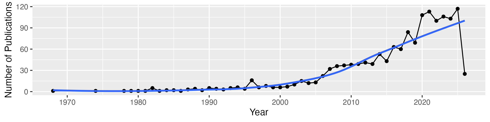

# Publications

Cowman PF, Bridge TCL, Ainsworth TD, Benzoni F, Bonito V et al. (2026). Modern Coral Taxonomy Requires Reproducible Data Alongside Field Observations—Comments on Veron et al. (2025). Diversity. [https://doi.org/10.3390/d18020060](https://doi.org/https://doi.org/10.3390/d18020060) (article)

Eakin CM, Scott HE, Connolly SR, Devotta D, Liu G et al. (2026). Severe and widespread coral reef damage during the 2014-2017 Global Coral Bleaching Event. Nature Communications. [https://doi.org/10.1038/s41467-025-67506-w](https://doi.org/https://doi.org/10.1038/s41467-025-67506-w) (article)

Hoʻopai‐Sylva H, Caruso C, Miller S, Hancock JR, Parry M et al. (2026). Proactive Coral Reef Restoration Using Thermally Tolerant Corals in Hawaiʻi. Conservation Letters. [https://doi.org/10.1111/con4.70004](https://doi.org/https://doi.org/10.1111/con4.70004) (article)

Innes-Gold AA, Houk P, Kindinger TL, Taylor BM, Humphries AT (2026). Evaluating rabbitfish restocking potential in support of Guam’s coastal fisheries. Ecological Modelling. [https://doi.org/10.1016/j.ecolmodel.2025.111460](https://doi.org/https://doi.org/10.1016/j.ecolmodel.2025.111460) (article)

Meyer CG (2026). ‘Sharktober’: tiger shark parturition drives seasonality in shark bite incidents in Hawaiian waters. Frontiers in Marine Science. [https://doi.org/10.3389/fmars.2025.1587902](https://doi.org/https://doi.org/10.3389/fmars.2025.1587902) (article)

Nemeth CL, Reidenberg JS, Bejder L, Fahlman A (2026). Nares Modulation in Breathing Cetaceans Reflects Respiratory Mechanics. Marine Mammal Science. [https://doi.org/10.1111/mms.70115](https://doi.org/https://doi.org/10.1111/mms.70115) (article)

Harmon K, Price MR, Winter KB (2026). The “regime shift extinctions” hypothesis and mass extinction of waterbirds in Hawaiʻi. Ecosphere. [https://doi.org/10.1002/ecs2.70445](https://doi.org/https://doi.org/10.1002/ecs2.70445) (article)

Madrigal BC, Gough WT, Currie JJ, Bejder L, Hollers A et al. (2026). Acoustic behaviour of endangered Hawaiian false killer whales. Royal Society Open Science. [https://doi.org/10.1098/rsos.250918](https://doi.org/https://doi.org/10.1098/rsos.250918) (article)

Ojo OF, Lynch K, Luis JM (2026). First Report of Anthracnose Caused by <i>Colletotrichum tropicale</i> on Ferns <i>Reholttumia hudsoniana, Ctenitis latifrons, Cibotium menziesii,</i> and <i>Cibotium chamissoi</i> in Hawaii. Plant Disease. [https://doi.org/10.1094/pdis-12-25-2464-pdn](https://doi.org/https://doi.org/10.1094/pdis-12-25-2464-pdn) (article)

Raposa KB, Cressman K, vanProosdij D, Goldstein JS, Stevens R et al. (2026). The Secret Life of Tidal Marshes and Mangroves: Camera Trapping as a Window Into Wildlife Using North American Coastal Wetlands. Ecology and Evolution. [https://doi.org/10.1002/ece3.72872](https://doi.org/https://doi.org/10.1002/ece3.72872) (article)

Altman-Kurosaki NT, Chen R, Caldwell IR, Pfennig MB, Franklin EC (2026). Estimating sea urchin bioerosion: global synthesis and a case study inside and outside of no-take MPAs around O‘ahu, Hawai‘i. Marine Biology. [https://doi.org/10.1007/s00227-025-04768-4](https://doi.org/https://doi.org/10.1007/s00227-025-04768-4) (article)

Rosset SL, Cline TJ, Shivaiah K, Ashley IA, Smith KD et al. (2026). From SCUBA to spectra: Broadly applicable methods for coral metabolomics research. Unknown Venue. [https://doi.org/10.64898/2026.01.19.700417](https://doi.org/https://doi.org/10.64898/2026.01.19.700417) (article)

Santos MEA, Kise H, Fourreau CJL, Kiriukhin BA, Kitahara MV et al. (2026). Global biogeography of zoantharians indicates a weak genetic differentiation between the Atlantic and Indo-Pacific oceans, and distinct communities in tropical and temperate provinces. Frontiers of Biogeography. [https://doi.org/10.21425/fob.19.174247](https://doi.org/https://doi.org/10.21425/fob.19.174247) (article)

Vicente J, Jury CP, Timmers MA, Webb MK, Bahr KD et al. (2026). Indo-Pacific coral reef sponge diversity declines under predicted future ocean conditions. Unknown Venue. [https://doi.org/10.21203/rs.3.rs-8664280/v1](https://doi.org/https://doi.org/10.21203/rs.3.rs-8664280/v1) (preprint)

Buckner JH, Meunier ZD, Arroyo‐Esquivel J, Fitzpatrick N, Greiner A et al. (2026). Recovering complex ecological dynamics from time series using state-space universal dynamic equations. Communications Earth & Environment. [https://doi.org/10.1038/s43247-025-03130-2](https://doi.org/https://doi.org/10.1038/s43247-025-03130-2) (article)

Reichert J, Jorissen H, Rottmueller ME, Nims AD, Rova LH et al. (2026). Cylindrical, pylon-like structures with helix recesses enhance coral larval recruitment. Ecological Engineering. [https://doi.org/10.1016/j.ecoleng.2026.107912](https://doi.org/https://doi.org/10.1016/j.ecoleng.2026.107912) (article)

Nerfa L, Fay JM, Earl A, Friedlander AM, Sala E et al. (2026). Influence of land-use history and ENSO on the flora of the Southern Line Islands. PLoS ONE. [https://doi.org/10.1371/journal.pone.0341582](https://doi.org/https://doi.org/10.1371/journal.pone.0341582) (article)

Satdichanh M, Ostertag R, Harrigan W, Belcaid M, Barton KE (2026). Plant Litter Trait Variation Between Native and Invasive Species Across Steep Climate Gradients in the Hawaiian Islands. Ecology and Evolution. [https://doi.org/10.1002/ece3.73030](https://doi.org/https://doi.org/10.1002/ece3.73030) (article)

Friedlander AM, Wedding LM, Antolini D, Brown EG, Stephenson C et al. (2026). Applying a seascape ecology approach enables biophysical and eco-cultural evaluation of marine protected areas. Landscape Ecology. [https://doi.org/10.1007/s10980-026-02310-5](https://doi.org/https://doi.org/10.1007/s10980-026-02310-5) (article)

Vicente J, Webb MK, Paulay G, Rakchai W, Timmers MA et al. (2026). Specimen vouchers of sponges collected in a study of hidden sponge biodiversity within the Hawaiian reef cryptofauna conducted on Oahu, Hawaii from 2016 to 2018. Unknown Venue. [https://doi.org/10.26008/1912/bco-dmo.986892.1](https://doi.org/https://doi.org/10.26008/1912/bco-dmo.986892.1) (dataset)

Halàsz A, McFadden CS, Aharonovich D, Toonen RJ, Benayahu Y (2026). A revision of the octocoral genus Ovabunda Alderslade, 2001 (Anthozoa, Octocorallia, Xeniidae). The Catalogue of Life. [https://doi.org/10.48580/d3hkz](https://doi.org/https://doi.org/10.48580/d3hkz) (dataset)

Sporck-Koehler MJ, Koehler TB, Marquez SN, Waite M, Williams AM (2026). A new species of Cyanea (Campanulaceae, Lobelioideae), from the Ko'olau Mountains of O'ahu, Hawaiian Islands. The Catalogue of Life. [https://doi.org/10.48580/d3g4x](https://doi.org/https://doi.org/10.48580/d3g4x) (dataset)

Esquivel‐Muelbert JR, Fontoura L, Zawada K, Erickson K, Figueira WF et al. (2026). The natural architecture of oyster reefs maximizes recruit survival. Nature. [https://doi.org/10.1038/s41586-026-10103-8](https://doi.org/https://doi.org/10.1038/s41586-026-10103-8) (article)

Kühl HS, Boesch C, Dieguez P, Stephens C, Bocksberger G et al. (2026). Collaborative surveying of intraspecific variation - new horizons for research and conservation. Unknown Venue. [https://doi.org/10.22541/au.177148833.37610113/v1](https://doi.org/https://doi.org/10.22541/au.177148833.37610113/v1) (article)

Fish FE, Sebo SP, Gough WT, Segre PS, Immekus R et al. (2026). Delta Wing‐Shaped Upper Jaw as a Control Surface to Stabilize Rorqual Whales During Lunge‐Feeding. Marine Mammal Science. [https://doi.org/10.1111/mms.70139](https://doi.org/https://doi.org/10.1111/mms.70139) (article)

Stack SH, Hammerstein Hv, Setter RO, Aswegen Mv, Currie JJ (2026). Why Warmer Oceans are a Problem for Humpback Whales. Frontiers for Young Minds. [https://doi.org/10.3389/frym.2026.1581310](https://doi.org/https://doi.org/10.3389/frym.2026.1581310) (article)

Biology HIoM, Museum. BPB, Hartl J, Yanez S, Freel KC et al. (2026). Hawai`i Cnidarian Reference Library 20260301. Zenodo (CERN European Organization for Nuclear Research). [https://doi.org/10.5281/zenodo.18749337](https://doi.org/https://doi.org/10.5281/zenodo.18749337) (dataset)

Biology HIoM, Museum. BPB, Hartl J, Yanez S, Freel KC et al. (2026). Hawai`i Cnidarian Reference Library 20260301. Zenodo (CERN European Organization for Nuclear Research). [https://doi.org/10.5281/zenodo.18749338](https://doi.org/https://doi.org/10.5281/zenodo.18749338) (dataset)

Meyer C (2026). Analysis of tiger and white shark bycatch in the Hawaii longline fishery. Fisheries Research. [https://doi.org/10.1016/j.fishres.2026.107687](https://doi.org/https://doi.org/10.1016/j.fishres.2026.107687) (article)

Fundakowski GJ, Brambilla V, Zawada KJA, Chow CFY, Croasdale EM et al. (2026). Tracking morphological development in stony corals. Coral Reefs. [https://doi.org/10.1007/s00338-026-02815-0](https://doi.org/https://doi.org/10.1007/s00338-026-02815-0) (article)

Bello Fd, Fischer FM, Puy J, Shipley B, Verdú M et al. (2025). Raunkiæran shortfalls: Challenges and perspectives in trait‐based ecology. Ecological Monographs. [https://doi.org/10.1002/ecm.70018](https://doi.org/https://doi.org/10.1002/ecm.70018) (article)

Carlot J, Galobart C, Gómez‐Gras D, Santamaría J, Golo R et al. (2025). Vulnerability of benthic trait diversity across the Mediterranean Sea following mass mortality events. Nature Communications. [https://doi.org/10.1038/s41467-025-55949-0](https://doi.org/https://doi.org/10.1038/s41467-025-55949-0) (article)

Ostridge HJ, Fontsere C, Lizano E, Soto DC, Schmidt JM et al. (2025). Local genetic adaptation to habitat in wild chimpanzees. Science. [https://doi.org/10.1126/science.adn7954](https://doi.org/https://doi.org/10.1126/science.adn7954) (article)

Schiettekatte NMD, Asbury M, Chen GK, Dornelas M, Reichert J et al. (2025). <i>habtools</i> : An R package to calculate <scp>3D</scp> metrics for surfaces and objects. Methods in Ecology and Evolution. [https://doi.org/10.1111/2041-210x.70027](https://doi.org/https://doi.org/10.1111/2041-210x.70027) (article)

Tortorelli G, Rosset SL, Sullivan C, Woo SL, Johnston EC et al. (2025). Heat-induced stress modulates cell surface glycans and membrane lipids of coral symbionts. The ISME Journal. [https://doi.org/10.1093/ismejo/wraf073](https://doi.org/https://doi.org/10.1093/ismejo/wraf073) (article)

Gómez‐Gras D, Linares C, Viladrich N, Zentner Y, Grinyó J et al. (2025). The Octocoral Trait Database: a global database of trait information for octocoral species. Scientific Data. [https://doi.org/10.1038/s41597-024-04307-8](https://doi.org/https://doi.org/10.1038/s41597-024-04307-8) (article)

Semmler RF, Martineau G, Schiettekatte NMD, Pratchett MS, Berumen ML et al. (2025). Marine heatwaves imperil emblematic reef fishes by altering the energetic landscape of coral reefs. Journal of Animal Ecology. [https://doi.org/10.1111/1365-2656.14238](https://doi.org/https://doi.org/10.1111/1365-2656.14238) (article)

Tiddy IC, Neill CM, Rosen AJ, Hasegawa Y, Domenici P et al. (2025). Effects of social environment and energy efficiency on preferred swim speed in a marine generalist fish, pile perch (<i>Phanerodon vacca</i>). Journal of Experimental Biology. [https://doi.org/10.1242/jeb.249546](https://doi.org/https://doi.org/10.1242/jeb.249546) (article)

Kratofil MA, Mahaffy SD, Martien KK, Archer FI, West KL et al. (2025). Deriving Probabilistic Age Estimates Using Common Photo‐Identification Catalog Information: An Application to Endangered Hawaiian False Killer Whales ( <scp> <i>Pseudorca crassidens</i> </scp> ). Marine Mammal Science. [https://doi.org/10.1111/mms.70080](https://doi.org/https://doi.org/10.1111/mms.70080) (article)

Freel KC, Tucker S, Freel EB, Stingl U, Giovannoni SJ et al. (2025). New SAR11 isolate genomes and global marine metagenomes resolve ecologically relevant units within the Pelagibacterales. Nature Communications. [https://doi.org/10.1038/s41467-025-67043-6](https://doi.org/https://doi.org/10.1038/s41467-025-67043-6) (article)

Grottoli AG, Dixon SL, Hulver AM, Bardin CE, Lewis C et al. (2025). Underwater Zooplankton Enhancement Light Array (UZELA): A technology solution to enhance zooplankton abundance and coral feeding in bleached and non‐bleached corals. Limnology and Oceanography Methods. [https://doi.org/10.1002/lom3.10669](https://doi.org/https://doi.org/10.1002/lom3.10669) (article)

Brandl SJ, Yan HF, Casey JM, Schiettekatte NMD, Renzi JJ et al. (2025). A seascape dichotomy in the role of small consumers for coral reef energy fluxes. Ecology. [https://doi.org/10.1002/ecy.70065](https://doi.org/https://doi.org/10.1002/ecy.70065) (article)

Barnas DM, Zeff M, Silbiger NJ (2025). Submarine groundwater discharge drives both direct and indirect effects on organismal and community metabolism on coral reefs. Proceedings of the Royal Society B Biological Sciences. [https://doi.org/10.1098/rspb.2024.1554](https://doi.org/https://doi.org/10.1098/rspb.2024.1554) (article)

Caruso C, Souza MRd, Kahkejian V, Davidson JM, Matsuda SB et al. (2025). Short-term stress testing predicts subsequent natural bleaching variation. Coral Reefs. [https://doi.org/10.1007/s00338-024-02608-3](https://doi.org/https://doi.org/10.1007/s00338-024-02608-3) (article)

Pereira BP, Cascalheira L, Rosa R, Paula JR (2025). Alteration of cleaner wrasse cognition and brain morphology under marine heatwaves. Functional Ecology. [https://doi.org/10.1111/1365-2435.70014](https://doi.org/https://doi.org/10.1111/1365-2435.70014) (article)

Dacks R, Yadav S, Mawyer A (2025). Emerging human dimensions research in coastal and nearshore Oceania. Conservation Biology. [https://doi.org/10.1111/cobi.14455](https://doi.org/https://doi.org/10.1111/cobi.14455) (review)

Tirpitz V, Hutter M, Hutter H, Prume J, Koch M et al. (2025). Increasing microplastic concentrations have nonlinear impacts on the physiology of reef-building corals. The Science of The Total Environment. [https://doi.org/10.1016/j.scitotenv.2024.178318](https://doi.org/https://doi.org/10.1016/j.scitotenv.2024.178318) (article)

López-Hernández M, Tirpitz V, Do M, Czermak M, Ferrier‐Pagès C et al. (2025). Heterotrophic feeding modulates the effects of microplastic on corals, but not when combined with heat stress. The Science of The Total Environment. [https://doi.org/10.1016/j.scitotenv.2025.179026](https://doi.org/https://doi.org/10.1016/j.scitotenv.2025.179026) (article)

Zentner Y, Garrabou J, Margarit N, Rovira G, Gómez‐Gras D et al. (2025). Active restoration of a long-lived octocoral drives rapid functional recovery in a temperate reef. Science Advances. [https://doi.org/10.1126/sciadv.ado5249](https://doi.org/https://doi.org/10.1126/sciadv.ado5249) (article)

Reis‐Filho JA, Cavole LM, Renck V, Eggertsen L, Loiola M et al. (2025). Fisherwomen’s activities are as complex, salient, and profitable as those performed by fishermen: A study from vulnerable traditional fishery communities. Fisheries Research. [https://doi.org/10.1016/j.fishres.2025.107380](https://doi.org/https://doi.org/10.1016/j.fishres.2025.107380) (article)

O’Connor MI, Anderson D, O’Connor MI, Knight NS, Slein MA et al. (2025). Scaling Temperature Effects on Metabolism from Individuals to Ecosystems. Annual Review of Ecology Evolution and Systematics. [https://doi.org/10.1146/annurev-ecolsys-102622-032335](https://doi.org/https://doi.org/10.1146/annurev-ecolsys-102622-032335) (article)

Delecambre Z, Morais RA, Siqueira AC, Costesec EP, Dubé C et al. (2025). Ecological Specialisation of Reef Fishes Peaks in Global Biodiversity Hotspots. Global Ecology and Biogeography. [https://doi.org/10.1111/geb.70050](https://doi.org/https://doi.org/10.1111/geb.70050) (article)

Vizon C, Lagourgue L, Jorissen H, Raviglione D, Payri C et al. (2025). The metabolome of crustose coralline algae is driven by phylogeny and environmental conditions. Algal Research. [https://doi.org/10.1016/j.algal.2025.104146](https://doi.org/https://doi.org/10.1016/j.algal.2025.104146) (article)

Reichert J, Jorissen H, Drury C, Hancock JR, Haynes C et al. (2025). Helix recesses boost coral larvae settlement and survival. Biological Conservation. [https://doi.org/10.1016/j.biocon.2025.111407](https://doi.org/https://doi.org/10.1016/j.biocon.2025.111407) (article)

Reichert J, Madin JS, Pierdomenico M, Schär D, Morgana S (2025). Colony complexity affects microplastic loads in Pocillopora corals. Environmental Pollution. [https://doi.org/10.1016/j.envpol.2025.126480](https://doi.org/https://doi.org/10.1016/j.envpol.2025.126480) (article)

Lacey C, Hill MC, Bradford AL, Oleson EM, Vivier F et al. (2025). Circum‐Island Line‐Transect Abundance Estimates of Spinner Dolphins Around Oʻahu, Hawaiʻi. Marine Mammal Science. [https://doi.org/10.1111/mms.70055](https://doi.org/https://doi.org/10.1111/mms.70055) (article)

Woo SL, Sherman M, Villablanca M, Luke H, Drury C et al. (2025). Building an Education Program to Support Positive Relationships Between Visitors, kamaʻāina, and the Environment in Hawaiʻi. The Journal of STEM Outreach. [https://doi.org/10.15695/jstem/v8i1.03](https://doi.org/https://doi.org/10.15695/jstem/v8i1.03) (article)

Speare KE, Burkepile DE, Adam TC, Lenihan HS, Winslow EM et al. (2025). Nitrogen enrichment determines coral mortality during a marine heatwave. Marine Pollution Bulletin. [https://doi.org/10.1016/j.marpolbul.2025.118758](https://doi.org/https://doi.org/10.1016/j.marpolbul.2025.118758) (article)

John C, Silbiger NJ, Adam TC, Barnas DM, Bistolas K et al. (2025). Terrigenous inputs link nutrient dynamics to microbial communities in a tropical lagoon. Limnology and Oceanography. [https://doi.org/10.1002/lno.70240](https://doi.org/https://doi.org/10.1002/lno.70240) (article)

Tucker S, Füssel J, Freel KC, Kiefl E, Freel EB et al. (2025). A high-resolution diel survey of surface ocean metagenomes, metatranscriptomes, and transfer RNA transcripts. Scientific Data. [https://doi.org/10.1038/s41597-025-06166-3](https://doi.org/https://doi.org/10.1038/s41597-025-06166-3) (article)

Vaughan GO, Ripley DM, Mitchell MD, McParland D, Johansen JL et al. (2025). Narrow Margins: Aerobic Performance and Temperature Tolerance of Coral Reef Fishes Facing Extreme Thermal Variability. Global Change Biology. [https://doi.org/10.1111/gcb.70100](https://doi.org/https://doi.org/10.1111/gcb.70100) (article)

Silbiger NJ, Donahue MJ, Hagedorn B, Barnas DM, Jorissen H et al. (2025). Terrestrial nutrient inputs restructure coral reef dissolved carbon fluxes via direct and indirect effects. Ecological Monographs. [https://doi.org/10.1002/ecm.70020](https://doi.org/https://doi.org/10.1002/ecm.70020) (article)

Bremer LL, McGuire G, Hastings Z, Kurashima N, Ticktin T et al. (2025). Carbon benefits through agroforestry transitions on unmanaged fallow agricultural land in Hawaiʻi. Scientific Reports. [https://doi.org/10.1038/s41598-025-87891-y](https://doi.org/https://doi.org/10.1038/s41598-025-87891-y) (article)

Karimi Z, Flores I, Kolle S, Kundu S, Walton E et al. (2025). Mitigating Algal Competition with Fouling-Prevention Coatings for Coral Restoration and Reef Engineering. ACS Sustainable Chemistry & Engineering. [https://doi.org/10.1021/acssuschemeng.4c07508](https://doi.org/https://doi.org/10.1021/acssuschemeng.4c07508) (article)

Meier A, Ochoa NR, Nordseth A, Copeland M, Foroughirad V et al. (2025). Network indicators of cultural resilience to anthropogenic removals in animal societies. Philosophical Transactions of the Royal Society B Biological Sciences. [https://doi.org/10.1098/rstb.2024.0144](https://doi.org/https://doi.org/10.1098/rstb.2024.0144) (article)

Tucker S, Rii YM, Freel KC, Kotubetey K, Kawelo AH et al. (2025). Seasonal and spatial transitions in phytoplankton assemblages spanning estuarine to open ocean waters of the tropical Pacific. Limnology and Oceanography. [https://doi.org/10.1002/lno.70075](https://doi.org/https://doi.org/10.1002/lno.70075) (article)

Yang W, Arsenault C, Fan VY, Leslie HH, Farooq F et al. (2025). Antenatal corticosteroids for pregnant women at risk of preterm labour in low- and middle-income countries: utilisation and facility readiness. Journal of Global Health. [https://doi.org/10.7189/jogh.15.04149](https://doi.org/https://doi.org/10.7189/jogh.15.04149) (article)

Lenz EA, Donahue MJ, Gates RD, Putnam HM, Steeg Evd et al. (2025). Parental effects provide an opportunity for coral resilience following major bleaching events. PLoS ONE. [https://doi.org/10.1371/journal.pone.0290479](https://doi.org/https://doi.org/10.1371/journal.pone.0290479) (article)

Patton PT, Pacifici K, Baird RW, Oleson EM, Allen JB et al. (2025). Optimizing automated photo identification for population assessments. Conservation Biology. [https://doi.org/10.1111/cobi.14436](https://doi.org/https://doi.org/10.1111/cobi.14436) (article)

Lavrov DV, Turner TL, Vicente J (2025). Pervasive Mitochondrial tRNA Gene Loss in Clade B of Haplosclerid Sponges (Porifera, Demospongiae). Genome Biology and Evolution. [https://doi.org/10.1093/gbe/evaf020](https://doi.org/https://doi.org/10.1093/gbe/evaf020) (article)

Deshpande K, Gysbers D, Yus J, Bendegom Dv, Nixon EN et al. (2025). Direct observation and quantitative characterization of chemotactic behaviors in Caribbean coral larvae exposed to organic and inorganic settlement cues. Scientific Reports. [https://doi.org/10.1038/s41598-025-93194-z](https://doi.org/https://doi.org/10.1038/s41598-025-93194-z) (article)

Németh C, Gough WT, Segre PS, Fish FE, Szabó A et al. (2025). The key to bubble-net feeding: how humpback whale morphology functionally differs from other baleen whales. Journal of Experimental Biology. [https://doi.org/10.1242/jeb.249607](https://doi.org/https://doi.org/10.1242/jeb.249607) (article)

Brijs J, Tran LL, Moore C, Souza T, Schakmann M et al. (2025). Outlasting the Heat: Collapse of Herbivorous Fish Control of Invasive Algae During Marine Heatwaves. Global Change Biology. [https://doi.org/10.1111/gcb.70438](https://doi.org/https://doi.org/10.1111/gcb.70438) (article)

Sawhney R, Ferrell BD, Dejean T, Schreiber ZD, Harrigan W et al. (2025). Fine-tuning protein language models unlocks the potential of underrepresented viral proteomes. PeerJ. [https://doi.org/10.7717/peerj.19919](https://doi.org/https://doi.org/10.7717/peerj.19919) (article)

Vicente J, Rutkowski EW, Lavrov DV, Martineau G, Timmers MA et al. (2025). Integrative taxonomy of introduced Haplosclerida and four new species from Hawaiʻi. Zootaxa. [https://doi.org/10.11646/zootaxa.5566.2.2](https://doi.org/https://doi.org/10.11646/zootaxa.5566.2.2) (article)

Souza T, Brijs J, Tran LL, Crowder LB, Johansen JL (2025). Herbivore functions in the hot-seat: Resilience of Acanthurus triostegus to marine heatwaves. PLoS ONE. [https://doi.org/10.1371/journal.pone.0318410](https://doi.org/https://doi.org/10.1371/journal.pone.0318410) (article)

Barnas DM, Zeff M, Silbiger NJ (2025). Submarine Groundwater Discharge Alters Benthic Community Composition and Functional Diversity on Coral Reefs. Diversity. [https://doi.org/10.3390/d17030161](https://doi.org/https://doi.org/10.3390/d17030161) (article)

Ong TW, McManus LC, Vasconcelos VV, Yang L, Su C (2025). Seeing Halos: Spatial and Consumer-Resource Constraints to Landscapes of Fear. The American Naturalist. [https://doi.org/10.1086/735688](https://doi.org/https://doi.org/10.1086/735688) (article)

Kazaba PK, Kulik L, Choumbou GBB, Tiémoko CBD, Oni FL et al. (2025). Chimpanzees (<i>Pan troglodytes</i>) Indicate Mammalian Abundance Across Broad Spatial Scales. Ecology and Evolution. [https://doi.org/10.1002/ece3.71000](https://doi.org/https://doi.org/10.1002/ece3.71000) (article)

Drexler JZ, Raine H, Harrington CL, Winter KB, Fraiola KMS et al. (2025). The Scientific Benefits of a Statewide, Standardized, Coastal Wetland Monitoring Program in Hawaiʻi. Ecology and Evolution. [https://doi.org/10.1002/ece3.71293](https://doi.org/https://doi.org/10.1002/ece3.71293) (article)

Innes‐Gold AA, Rahnke SA, McManus LC (2025). Land-sea interactions: Nutrient inputs, fishing effort, and predation shape estuarine fisheries harvest. Estuarine Coastal and Shelf Science. [https://doi.org/10.1016/j.ecss.2025.109377](https://doi.org/https://doi.org/10.1016/j.ecss.2025.109377) (article)

Gandra M, Fontes J, Macena BCL, Meyer CG, Afonso P (2025). Long-term multitracking reveals contrasting yet highly resident movement ecologies of two sympatric and endangered deep-sea sharks. Ocean & Coastal Management. [https://doi.org/10.1016/j.ocecoaman.2025.107782](https://doi.org/https://doi.org/10.1016/j.ocecoaman.2025.107782) (article)

Lee EA, McManus LC (2025). Rate of Temperature Increase and Genetic Diversity Drives Marine Metapopulation Persistence under Climate Change. The American Naturalist. [https://doi.org/10.1086/737022](https://doi.org/https://doi.org/10.1086/737022) (article)

Ferretti P, Martignoni MM, McManus LC, Sakal T, Liaghat A et al. (2025). Theory of host-microbe symbioses: Challenges and opportunities. Cell Host & Microbe. [https://doi.org/10.1016/j.chom.2025.05.001](https://doi.org/https://doi.org/10.1016/j.chom.2025.05.001) (article)

Lester E, Cuttler MVW, Langlois T, Madin EMP (2025). Deciphering the footprints of predator–prey interactions on coral reefs: seasonal dynamics and environmental drivers of reef halos. Coral Reefs. [https://doi.org/10.1007/s00338-025-02701-1](https://doi.org/https://doi.org/10.1007/s00338-025-02701-1) (article)

Hennessey SM, Gove JM, Donovan MK (2025). Utility of indicator thresholds across spatial gradients for applications to ecosystem‐based fisheries management. Ecosphere. [https://doi.org/10.1002/ecs2.70307](https://doi.org/https://doi.org/10.1002/ecs2.70307) (article)

Andrade JRd, Vidal TJ, Bianchini A, Costa PG, Lacerda CHF et al. (2025). Iron pollution has minor impacts on the behavioral ecology of the Brazilian endemic reef damselfish Stegastes fuscus. Marine Environmental Research. [https://doi.org/10.1016/j.marenvres.2025.107435](https://doi.org/https://doi.org/10.1016/j.marenvres.2025.107435) (article)

Emery KA, Rivera SG, Pettit A, Madden JR, Schooler NK et al. (2025). Spatial patterns of sandy beach habitat use by mobile invertebrates vary with wrack type and tide phase. Estuarine Coastal and Shelf Science. [https://doi.org/10.1016/j.ecss.2025.109510](https://doi.org/https://doi.org/10.1016/j.ecss.2025.109510) (article)

Innes‐Gold AA, Feloy K, Callan CK, Alegado RA, Ching C et al. (2025). Restoration and management of an Indigenous aquaculture system helps mitigate climate change impacts to estuarine fisheries. npj Ocean Sustainability. [https://doi.org/10.1038/s44183-025-00152-3](https://doi.org/https://doi.org/10.1038/s44183-025-00152-3) (article)

Tucker S, Freel KC, Eren AM, Rappé MS (2025). Habitat-specificity in SAR11 is associated with a few genes under high selection. The ISME Journal. [https://doi.org/10.1093/ismejo/wraf216](https://doi.org/https://doi.org/10.1093/ismejo/wraf216) (article)

Sawhney R, Ferrell BD, Dejean T, Schreiber ZD, Harrigan W et al. (2025). Fine-Tuning Protein Language Models Unlocks the Potential of Underrepresented Viral Proteomes. Unknown Venue. [https://doi.org/10.1101/2025.04.17.649224](https://doi.org/https://doi.org/10.1101/2025.04.17.649224) (preprint)

Millage KD, Mayorga J, Orofino S, Atwood TB, Friedlander AM et al. (2025). The value of bottom trawling in Europe. Unknown Venue. [https://doi.org/10.21203/rs.3.rs-6298588/v1](https://doi.org/https://doi.org/10.21203/rs.3.rs-6298588/v1) (preprint)

Ramfelt O, Tucker S, Freel KC, Eren AM, Rappé MS (2025). <i>Magnimaribacterales</i> marine bacteria genetically partition across the nearshore to open-ocean in the tropical Pacific Ocean. Unknown Venue. [https://doi.org/10.1101/2025.06.17.660167](https://doi.org/https://doi.org/10.1101/2025.06.17.660167) (preprint)

Tucker S, Fuessel J, Freel KC, Kiefl E, Freel EB et al. (2025). A high-resolution diel survey of surface ocean metagenomes, metatranscriptomes, and transfer RNA transcripts. Unknown Venue. [https://doi.org/10.1101/2025.09.15.676277](https://doi.org/https://doi.org/10.1101/2025.09.15.676277) (preprint)

Madin JS, Oliver TAA, McWilliam M, Asbury M, Baird AH et al. (2025). Demographic insights for coral restoration. Unknown Venue. [https://doi.org/10.1101/2025.10.21.683544](https://doi.org/https://doi.org/10.1101/2025.10.21.683544) (preprint)

Kerlin JR, Barnas DM, Silbiger NJ (2025). Conspecific interactions between corals mediate the effect of submarine groundwater discharge on coral physiology. Oecologia. [https://doi.org/10.1007/s00442-024-05660-6](https://doi.org/https://doi.org/10.1007/s00442-024-05660-6) (article)

Rubin RD, Kumli KR, Klimley AP, Stewart JD, Ketchum JT et al. (2025). Correction to: Insular and mainland interconnectivity in the movements of oceanic manta rays (Mobula birostris) off Mexico in the Eastern Tropical Pacific. Environmental Biology of Fishes. [https://doi.org/10.1007/s10641-025-01676-w](https://doi.org/https://doi.org/10.1007/s10641-025-01676-w) (article)

Marra‐Biggs P, Brown EK, Ochavilla D, Green A, Lawrence A et al. (2025). Status of Giant Clam Populations in American Samoa. Unknown Venue. [https://doi.org/10.22541/au.173991280.04359600/v1](https://doi.org/https://doi.org/10.22541/au.173991280.04359600/v1) (preprint)

Rose K, Holsman KK, Nye JA, Markowitz EH, Banha T et al. (2025). CORRECTION: Advancing bioenergetics-based modeling to improve climate change projections of marine ecosystems. Marine Ecology Progress Series. [https://doi.org/10.3354/meps14535_c](https://doi.org/https://doi.org/10.3354/meps14535_c) (article)

Satdichanh M, Harrigan W, Ostertag R, Barton KE (2025). Plant litter trait variation between native and nonnative species across steep climate gradient in Hawaiian Islands. Unknown Venue. [https://doi.org/10.5194/egusphere-egu25-14991](https://doi.org/https://doi.org/10.5194/egusphere-egu25-14991) (preprint)

Bryce L, Cobb KM, Conroy JL, Levin S, Xu M et al. (2025). Water Isotopologue Time Series across Tropical Sites during ENSO extremes. Unknown Venue. [https://doi.org/10.5194/egusphere-egu25-12738](https://doi.org/https://doi.org/10.5194/egusphere-egu25-12738) (preprint)

Viehl K, Khalid Z, Greiner‐Ferris K, Taub E, Amirthalingam P et al. (2025). An Optimized Probe‐Based <scp>qPCR</scp> Assay for the Detection and Monitoring of the Invasive Lionfish ( <i>Pterois volitans</i> ) in the Atlantic. Environmental DNA. [https://doi.org/10.1002/edn3.70078](https://doi.org/https://doi.org/10.1002/edn3.70078) (article)

Brijs J, Moore C, Schakmann M, Souza T, Grellman K et al. (2025). Eat more, often: The capacity of piscivores to meet increased energy demands in warming oceans. The Science of The Total Environment. [https://doi.org/10.1016/j.scitotenv.2025.179105](https://doi.org/https://doi.org/10.1016/j.scitotenv.2025.179105) (article)

Innes‐Gold AA, Feloy K, Callan CK, Ascunsion B, Ching C et al. (2025). Indigenous aquaculture system responses to climate change, nutrient enrichment, and hatchery-based restocking. Unknown Venue. [https://doi.org/10.5194/oos2025-143](https://doi.org/https://doi.org/10.5194/oos2025-143) (preprint)

Bos JT, Pinsky ML, McManus L (2025). Acropora tenuis shows complex population genetic structure across a reefscape in the Coral Triangel.. Unknown Venue. [https://doi.org/10.5194/oos2025-689](https://doi.org/https://doi.org/10.5194/oos2025-689) (preprint)

Dixon S, Jorissen H, Marie HA, Jacob W, Josh M et al. (2025). Coral recruit survivorship and growth increases with Underwater Zooplankton Light Enhancement Array (UZELA) enhanced feeding coupled with dome-shaped settlement modules. Unknown Venue. [https://doi.org/10.5194/oos2025-695](https://doi.org/https://doi.org/10.5194/oos2025-695) (preprint)

Snyder JT, Soerensen MS, Eggertsen L, Grellman K, Johansen JL et al. (2025). A Mechanistic Model to Predict Reef Outcomes Using Land-based Pollutant and Fish Herbivory Data. Unknown Venue. [https://doi.org/10.5194/oos2025-433](https://doi.org/https://doi.org/10.5194/oos2025-433) (preprint)

Asbury M, Schiettekatte NMD, Kindinger TL, Richardson L, Madin JS (2025). Fish community composition and functional diversity is determined by biophysical factors and habitat structure. . Unknown Venue. [https://doi.org/10.5194/oos2025-768](https://doi.org/https://doi.org/10.5194/oos2025-768) (preprint)

Kim KM, Lizano AMD, Toonen RJ, Ravago‐Gotanco R (2025). Genomic Divergence of Sympatric Lineages Within <i>Stichopus</i> cf. <i>horrens</i> (Echinodermata: Stichopodidae): Insights on Reproductive Isolation Inferred From <scp>SNP</scp> Markers. Ecology and Evolution. [https://doi.org/10.1002/ece3.71283](https://doi.org/https://doi.org/10.1002/ece3.71283) (article)

Armstrong DA, McNicholl C, Bahr KD (2025). Species-specific proton and oxygen flux in Hawaiian corals under ocean acidification—a microsensor analysis of the concentration boundary layer. Unknown Venue. [https://doi.org/10.21203/rs.3.rs-6149474/v1](https://doi.org/https://doi.org/10.21203/rs.3.rs-6149474/v1) (preprint)

DeMartini EE, Anderson TW, Carr MH, Larson RJ (2025). Leveraging positive interactions in nature to enhance the shared goals and success of One Health. BioScience. [https://doi.org/10.1093/biosci/biaf067](https://doi.org/https://doi.org/10.1093/biosci/biaf067) (article)

Kamikawa K, Peyton KA, Oleson KL (2025). Angler Motivations and Preferences When Targeting Bonefishes in Hawai‘i. Pacific Science. [https://doi.org/10.2984/78.3.2](https://doi.org/https://doi.org/10.2984/78.3.2) (article)

Scott M, Miller O, Stapleton DC, Grant K (2025). Novel observations of an oceanic whitetip (Carcharhinus longimanus) and tiger shark (Galeocerdo cuvier) scavenging event. Frontiers in Fish Science. [https://doi.org/10.3389/frish.2025.1520995](https://doi.org/https://doi.org/10.3389/frish.2025.1520995) (article)

Wishingrad V, Shizuru LEK, Takata K, Montgomery AD, Wagner D et al. (2025). Hawaiian black coral (Antipatharia) complete mitochondrial genomes have limited phylogenetic signal for taxonomic resolution of species. PeerJ. [https://doi.org/10.7717/peerj.18731](https://doi.org/https://doi.org/10.7717/peerj.18731) (article)

Toonen RJ, Iacchei M, Bowen BW (2025). Marine Biogeography. Elsevier eBooks. [https://doi.org/10.1016/b978-0-443-15750-9.00120-8](https://doi.org/https://doi.org/10.1016/b978-0-443-15750-9.00120-8) (book-chapter)

Schoepf V, Grottoli AG, McLachlan RH, Price J, Jury CP et al. (2025). Coral calcification mechanisms across a natural environmental mosaic in Hawai'i. Limnology and Oceanography. [https://doi.org/10.1002/lno.70118](https://doi.org/https://doi.org/10.1002/lno.70118) (article)

Reichert J, Tepavčević J (2025). Growing Apart: Global Warming Severely Impacts the Symbiosis of the Hawaiian Bobtail Squid and Bioluminescent Bacteria. Global Change Biology. [https://doi.org/10.1111/gcb.70308](https://doi.org/https://doi.org/10.1111/gcb.70308) (article)

Asigbee FM, Ranck L, Pruitt A, Pines R, Silva CGLd et al. (2025). Qualitative Study Examining the Effects of the COVID-19 Pandemic on the Homelessness Community Using PhotoVoice: Methodology and Lessons Learned. International Journal of Qualitative Methods. [https://doi.org/10.1177/16094069251353434](https://doi.org/https://doi.org/10.1177/16094069251353434) (article)

Madrigal B, Gough WT, Bejder L, Currie JJ, Mooney TA et al. (2025). Acoustic behavior of endangered false killer whales (<i>Pseudorca crassidens</i>) using biologging devices in Hawaiʻi. The Journal of the Acoustical Society of America. [https://doi.org/10.1121/10.0038276](https://doi.org/https://doi.org/10.1121/10.0038276) (article)

Boulais O, Thode AM, Levy N, Wangpraseurt D, Levy J et al. (2025). Field demonstration of enhanced coral larvae settlement using acoustic enrichment, mesoscale artificial structures, and engineered biofilms. The Journal of the Acoustical Society of America. [https://doi.org/10.1121/10.0037991](https://doi.org/https://doi.org/10.1121/10.0037991) (article)

Rangel M, Bell S, Pacini A, Forsman ZH, Knapp IS et al. (2025). Impact of anthropogenic sounds on coral reef health and sessile invertebrates. The Journal of the Acoustical Society of America. [https://doi.org/10.1121/10.0037352](https://doi.org/https://doi.org/10.1121/10.0037352) (article)

Majerová E, Steinle C, Drury C (2025). BAK knockdown delays bleaching and alleviates oxidative DNA damage in a reef-building coral. Communications Biology. [https://doi.org/10.1038/s42003-025-08671-y](https://doi.org/https://doi.org/10.1038/s42003-025-08671-y) (article)

Llabrés E, Innes‐Gold AA, DiFiore BP, Sintes T, Madin EMP (2025). A spatial numerical model for seagrass–herbivore interactions and the formation of reef halos. Coral Reefs. [https://doi.org/10.1007/s00338-025-02729-3](https://doi.org/https://doi.org/10.1007/s00338-025-02729-3) (article)

Madin EMP, Suan A, Severino SJL, Tsang AO, Madin JS et al. (2025). COVID-19 anthropause affects coral reef ecosystems through biophysical changes. npj Ocean Sustainability. [https://doi.org/10.1038/s44183-025-00144-3](https://doi.org/https://doi.org/10.1038/s44183-025-00144-3) (article)

Evans L, Aswegen Mv, Feinberg S, Currie JJ, Stack SH et al. (2025). Elevating Photo‐Identification: Aerial‐Identification Improves Re‐Sight Rates and Supports Long‐Term Monitoring of Humpback Whales. Marine Mammal Science. [https://doi.org/10.1111/mms.70078](https://doi.org/https://doi.org/10.1111/mms.70078) (article)

Vetter J, Reichert J, Dietzmann A, Hahn L, Lang AS et al. (2025). Species identity and composition affect the productivity of stony corals. Coral Reefs. [https://doi.org/10.1007/s00338-025-02748-0](https://doi.org/https://doi.org/10.1007/s00338-025-02748-0) (article)

Redelinghuys S, Emami‐Khoyi A, Matcher GF, Teske PR, Heltai M et al. (2025). Gut Microbial Diversity and Genome‐Wide Variation of the Cape Sea Urchin ( <i>Parechinus angulosus</i> ) Across a Thermal Gradient. Austral Ecology. [https://doi.org/10.1111/aec.70118](https://doi.org/https://doi.org/10.1111/aec.70118) (article)

Reichert J, Jorissen H, Rottmueller ME, Nims AD, Rova LH et al. (2025). Cylindrical, pylon-like structures with helix recesses enhance coral larval recruitment. Unknown Venue. [https://doi.org/10.1101/2025.10.06.680805](https://doi.org/https://doi.org/10.1101/2025.10.06.680805) (preprint)

Baer J, Kajihara K, Vilonen L, Hall AD, Young CM et al. (2025). Microbiome spatial scaling varies among members, hosts, and environments across model island ecosystems. The ISME Journal. [https://doi.org/10.1093/ismejo/wraf228](https://doi.org/https://doi.org/10.1093/ismejo/wraf228) (article)

Titze VM, Reichert J, Schubert M, Gather MC (2025). Monitoring microplastics in live reef-building corals with microscopic laser particles. arXiv (Cornell University). [https://doi.org/10.48550/arxiv.2502.20014](https://doi.org/https://doi.org/10.48550/arxiv.2502.20014) (preprint)

Wishingrad V, Hoban M, Walsh C, Angulo C, Timmers MA et al. (2025). Metabarcoding Primers for Indo‐Pacific Fishes. Environmental DNA. [https://doi.org/10.1002/edn3.70205](https://doi.org/https://doi.org/10.1002/edn3.70205) (article)

Castro‐Díez P, Lázaro‐Lobo A, Fernández R, Alonso Á, cruces p et al. (2025). How does the enhancement of carbon sequestration by non-native forests affect other ecosystem services?. New Forests. [https://doi.org/10.1007/s11056-025-10138-1](https://doi.org/https://doi.org/10.1007/s11056-025-10138-1) (article)

Sullivan MK, Jasperse‐Sjolander L, Lewis M, Masseloux J, Poulsen JR et al. (2025). Context‐dependent forest elephant seed dispersal: implications for pathways of elephant‐driven patterns of biodiversity and carbon storage. Oikos. [https://doi.org/10.1002/oik.11507](https://doi.org/https://doi.org/10.1002/oik.11507) (article)

Ducret H, Suchocki CR, Bardin CE, Lewis C, Permentier T et al. (2025). Shading does not lower thermal tolerance in the coral Montipora capitata. Coral Reefs. [https://doi.org/10.1007/s00338-025-02753-3](https://doi.org/https://doi.org/10.1007/s00338-025-02753-3) (article)

White C, Tett P, Kushner DJ, Beas R, Zacherl DC et al. (2025). Cohort tracking using size‐frequency population survey data to estimate individual growth. Ecosphere. [https://doi.org/10.1002/ecs2.70436](https://doi.org/https://doi.org/10.1002/ecs2.70436) (article)

Grillo JF, Tirpitz V, Reichert J, Canesi M, Reynaud S et al. (2025). Coral Skeletal Cores as Windows Into Past Symbiodiniaceae Community Dynamics. Global Change Biology. [https://doi.org/10.1111/gcb.70575](https://doi.org/https://doi.org/10.1111/gcb.70575) (article)

Parnell K, Smith C, Díaz AF, Fertitta K, Thompson PR et al. (2025). Underwater sound production of free-ranging Hawaiian monk seals. Royal Society Open Science. [https://doi.org/10.1098/rsos.250987](https://doi.org/https://doi.org/10.1098/rsos.250987) (article)

VanCompernolle M, Morris J, Calich HJ, Rodríguez J, Marley SA et al. (2025). Vulnerability of marine megafauna to global at‐sea anthropogenic threats. Conservation Biology. [https://doi.org/10.1111/cobi.70147](https://doi.org/https://doi.org/10.1111/cobi.70147) (article)

Marra‐Biggs P, Brown EK, Ochavillo D, Green AL, Lawrence A et al. (2025). Status and trends of giant clam populations demonstrate the effectiveness of village-based protection in American Sāmoa. PeerJ. [https://doi.org/10.7717/peerj.20290](https://doi.org/https://doi.org/10.7717/peerj.20290) (article)

Fundakowski GJ, Brambilla V, Zawada K, Chow CFY, Croasdale EM et al. (2025). Tracking morphological development in stony corals. Unknown Venue. [https://doi.org/10.1101/2025.11.20.689442](https://doi.org/https://doi.org/10.1101/2025.11.20.689442) (preprint)

Blandino CA, Papastamatiou YP, Dale JJ, Meyer CG (2025). Seabirds mediate intraguild and competitive interactions in a shark community. Ecosphere. [https://doi.org/10.1002/ecs2.70486](https://doi.org/https://doi.org/10.1002/ecs2.70486) (article)

Freel EB, Conklin E, Knapp IS, Kraft DW, Johnston EC et al. (2025). Population Genetics to Population Genomics: Revisiting Multispecies Connectivity of the Hawaiian Archipelago. Fishes. [https://doi.org/10.3390/fishes10120623](https://doi.org/https://doi.org/10.3390/fishes10120623) (article)

Arnold L, Dale JJ (2025). Improving accuracy of stingray size estimations in video surveys. Environmental Biology of Fishes. [https://doi.org/10.1007/s10641-025-01786-5](https://doi.org/https://doi.org/10.1007/s10641-025-01786-5) (article)

Permentier T, Ducret H, Timmins‐Schiffman E, Willard HF, Heidig S et al. (2025). Proteomic insights into the photobiology of the Hawaiian rice coral <i>Montipora capitata</i> in response to decreased light intensity. Unknown Venue. [https://doi.org/10.64898/2025.12.02.691798](https://doi.org/https://doi.org/10.64898/2025.12.02.691798) (article)

Rahnke SA, Winter KB, Tuttle LJ, McManus LC (2025). Interaction strength and harvest intensity mediate predator–prey dynamics on coral reefs. Ecosphere. [https://doi.org/10.1002/ecs2.70449](https://doi.org/https://doi.org/10.1002/ecs2.70449) (article)

Armstrong DA, McNicholl C, Bahr KD (2025). Ocean acidification modulates material flux linked with coral calcification and photosynthesis. Scientific Reports. [https://doi.org/10.1038/s41598-025-30818-4](https://doi.org/https://doi.org/10.1038/s41598-025-30818-4) (article)

Chow CFY, Brambilla V, Fundakowski GJ, Madin JS, Marques TA et al. (2025). Random encounter modelling as a viable method to estimate absolute abundance of reef fish. Methods in Ecology and Evolution. [https://doi.org/10.1111/2041-210x.70215](https://doi.org/https://doi.org/10.1111/2041-210x.70215) (article)

Wernli P, Royer M, Kügler A, Lammers MO, Holland KN et al. (2025). Telemetry reveals potential mating aggregation behavior of tiger sharks (Galeocerdo cuvier) in Hawaiʻi. Scientific Reports. [https://doi.org/10.1038/s41598-025-27742-y](https://doi.org/https://doi.org/10.1038/s41598-025-27742-y) (article)

Maya Z, Danielle B, Nyssa S (2025). Terrigenous nutrient pulses facilitate shifts in reef fish community structure and feeding through trophic plasticity. Zenodo (CERN European Organization for Nuclear Research). [https://doi.org/10.5281/zenodo.17611972](https://doi.org/https://doi.org/10.5281/zenodo.17611972) (other)

Maya Z, Danielle B, Nyssa S (2025). Terrigenous nutrient pulses facilitate shifts in reef fish community structure and feeding through trophic plasticity. Zenodo (CERN European Organization for Nuclear Research). [https://doi.org/10.5281/zenodo.17611973](https://doi.org/https://doi.org/10.5281/zenodo.17611973) (other)

Momin A, Jan V, Dennis L (2025). Metilla boricua Project. Zenodo (CERN European Organization for Nuclear Research). [https://doi.org/10.5281/zenodo.17715249](https://doi.org/https://doi.org/10.5281/zenodo.17715249) (dataset)

Momin A, Jan V, Dennis L (2025). Metilla boricua Project. Zenodo (CERN European Organization for Nuclear Research). [https://doi.org/10.5281/zenodo.17715250](https://doi.org/https://doi.org/10.5281/zenodo.17715250) (dataset)

Dixon SL, Hulver AM, Suchocki CR, Bardin CE, Lewis C et al. (2025). Effects of very short‐term formalin fixation on coral carbon and nitrogen stable isotopes, total lipids, and chlorophyll <scp> <i>a</i> </scp> and <scp> <i>c2</i> </scp> concentrations. Limnology and Oceanography Methods. [https://doi.org/10.1002/lom3.70027](https://doi.org/https://doi.org/10.1002/lom3.70027) (article)

Vicente J, Rutkowski EW, Lavrov DV, Martineau G, Timmers MA et al. (2025). Integrative taxonomy of introduced Haplosclerida and three new species of Haliclona sponges from Hawai'i based on samples collected from a variety of habitats on O'ahu from 2016 to 2022. Unknown Venue. [https://doi.org/10.26008/1912/bco-dmo.986889.1](https://doi.org/https://doi.org/10.26008/1912/bco-dmo.986889.1) (dataset)

Nunley RM, Rutkowski EW, Toonen RJ, Vicente J (2025). Morphological and genetic data of tetractinellid sponges from Kāne'ohe Bay, Hawai'i based on specimens collected between 2016 and 2023. Unknown Venue. [https://doi.org/10.26008/1912/bco-dmo.986886.1](https://doi.org/https://doi.org/10.26008/1912/bco-dmo.986886.1) (dataset)

Dedman S, Moxley J, Papastamatiou YP, Braccini M, Caselle JE et al. (2024). Ecological roles and importance of sharks in the Anthropocene Ocean. Science. [https://doi.org/10.1126/science.adl2362](https://doi.org/https://doi.org/10.1126/science.adl2362) (review)

Caldwell IR, Hobbs J, Bowen BW, Cowman PF, DiBattista JD et al. (2024). Global trends and biases in biodiversity conservation research. Cell Reports Sustainability. [https://doi.org/10.1016/j.crsus.2024.100082](https://doi.org/https://doi.org/10.1016/j.crsus.2024.100082) (article)

Cheeseman T, Barlow J, Acebes JM, Audley K, Bejder L et al. (2024). Bellwethers of change: population modelling of North Pacific humpback whales from 2002 through 2021 reveals shift from recovery to climate response. Royal Society Open Science. [https://doi.org/10.1098/rsos.231462](https://doi.org/https://doi.org/10.1098/rsos.231462) (article)

Chust G, Villarino E, McLean M, Mieszkowska N, Benedetti‐Cecchi L et al. (2024). Cross-basin and cross-taxa patterns of marine community tropicalization and deborealization in warming European seas. Nature Communications. [https://doi.org/10.1038/s41467-024-46526-y](https://doi.org/https://doi.org/10.1038/s41467-024-46526-y) (article)

Eggertsen L, Luza AL, Cordeiro CAMM, Dambros C, Ferreira CEL et al. (2024). Complexities of reef fisheries in Brazil: a retrospective and functional approach. Reviews in Fish Biology and Fisheries. [https://doi.org/10.1007/s11160-023-09826-y](https://doi.org/https://doi.org/10.1007/s11160-023-09826-y) (article)

Rose K, Holsman KK, Nye JA, Markowitz EH, Banha T et al. (2024). Advancing bioenergetics-based modeling to improve climate change projections of marine ecosystems. Marine Ecology Progress Series. [https://doi.org/10.3354/meps14535](https://doi.org/https://doi.org/10.3354/meps14535) (article)

Johansen JL, Mitchell MD, Vaughan GO, Ripley DM, Shiels HA et al. (2024). Impacts of ocean warming on fish size reductions on the world’s hottest coral reefs. Nature Communications. [https://doi.org/10.1038/s41467-024-49459-8](https://doi.org/https://doi.org/10.1038/s41467-024-49459-8) (article)

Wang X, Bocksberger G, Arandjelovic M, Agbor A, Angedakin S et al. (2024). Strontium isoscape of sub-Saharan Africa allows tracing origins of victims of the transatlantic slave trade. Nature Communications. [https://doi.org/10.1038/s41467-024-55256-0](https://doi.org/https://doi.org/10.1038/s41467-024-55256-0) (article)

Aswegen Mv, Szabó A, Currie JJ, Stack SH, West KL et al. (2024). Energetic cost of gestation and prenatal growth in humpback whales. The Journal of Physiology. [https://doi.org/10.1113/jp287304](https://doi.org/https://doi.org/10.1113/jp287304) (article)

Dupaix A, Ménard F, Filmalter JD, Baidai Y, Bodin N et al. (2024). The challenge of assessing the effects of drifting fish aggregating devices on the behaviour and biology of tropical tuna. Fish and Fisheries. [https://doi.org/10.1111/faf.12813](https://doi.org/https://doi.org/10.1111/faf.12813) (article)

Abbott E, Loockerman C, Matz MV (2024). Modifications to gene body methylation do not alter gene expression plasticity in a reef‐building coral. Evolutionary Applications. [https://doi.org/10.1111/eva.13662](https://doi.org/https://doi.org/10.1111/eva.13662) (article)

Aswegen Mv, Szabó A, Currie JJ, Stack SH, Evans L et al. (2024). Maternal investment, body condition and calf growth in humpback whales. The Journal of Physiology. [https://doi.org/10.1113/jp287379](https://doi.org/https://doi.org/10.1113/jp287379) (article)

Rades M, Poschet G, Gegner H, Wilke T, Reichert J (2024). Chronic effects of exposure to polyethylene microplastics may be mitigated at the expense of growth and photosynthesis in reef-building corals. Marine Pollution Bulletin. [https://doi.org/10.1016/j.marpolbul.2024.116631](https://doi.org/https://doi.org/10.1016/j.marpolbul.2024.116631) (article)

Llabrés E, Re E, Pluma N, Sintes T, Duarte CM (2024). A generalized numerical model for clonal growth in scleractinian coral colonies. Proceedings of the Royal Society B Biological Sciences. [https://doi.org/10.1098/rspb.2024.1327](https://doi.org/https://doi.org/10.1098/rspb.2024.1327) (article)

Baird RW, Mahaffy SD, Hancock‐Hanser BL, Cullins T, West KL et al. (2024). Long-term strategies for studying rare species: results and lessons from a multi-species study of odontocetes around the main Hawaiian Islands. Pacific Conservation Biology. [https://doi.org/10.1071/pc23027](https://doi.org/https://doi.org/10.1071/pc23027) (article)

Hiung DLCYLS, Schuster JM, Duncan MI, Payne NL, Helmuth B et al. (2024). Ocean weather, biological rates, and unexplained global ecological patterns. PNAS Nexus. [https://doi.org/10.1093/pnasnexus/pgae260](https://doi.org/https://doi.org/10.1093/pnasnexus/pgae260) (article)

Agiadi K, Caswell BA, Almeida R, Becheker A, Blanco A et al. (2024). Geohistorical insights into marine functional connectivity. ICES Journal of Marine Science. [https://doi.org/10.1093/icesjms/fsae117](https://doi.org/https://doi.org/10.1093/icesjms/fsae117) (article)

Luo Z, Zhang X, Fleig A, Romo D, Hull KG et al. (2024). TRPM7 in neurodevelopment and therapeutic prospects for neurodegenerative disease. Cell Calcium. [https://doi.org/10.1016/j.ceca.2024.102886](https://doi.org/https://doi.org/10.1016/j.ceca.2024.102886) (review)

Oliver RY, Chapman M, Emery N, Gillespie L, Gownaris N et al. (2024). Opening a conversation on responsible environmental data science in the age of large language models. Environmental Data Science. [https://doi.org/10.1017/eds.2024.12](https://doi.org/https://doi.org/10.1017/eds.2024.12) (article)

Jury CP, Bahr KD, Cros A, Dobson KL, Freel EB et al. (2024). Experimental coral reef communities transform yet persist under mitigated future ocean warming and acidification. Proceedings of the National Academy of Sciences. [https://doi.org/10.1073/pnas.2407112121](https://doi.org/https://doi.org/10.1073/pnas.2407112121) (article)

Franceschini S, Lynham J, Madin EMP (2024). A global test of MPA spillover benefits to recreational fisheries. Science Advances. [https://doi.org/10.1126/sciadv.ado9783](https://doi.org/https://doi.org/10.1126/sciadv.ado9783) (article)

McKenna MF, Rowell TJ, Margolina T, Baumann‐Pickering S, Solsona‐Berga A et al. (2024). Understanding vessel noise across a network of marine protected areas. Environmental Monitoring and Assessment. [https://doi.org/10.1007/s10661-024-12497-2](https://doi.org/https://doi.org/10.1007/s10661-024-12497-2) (article)

Ferter K, Pagniello C, Block BA, Bjelland O, Castleton M et al. (2024). Atlantic bluefin tuna tagged off Norway show extensive annual migrations, high site-fidelity and dynamic behaviour in the Atlantic Ocean and Mediterranean Sea. Proceedings of the Royal Society B Biological Sciences. [https://doi.org/10.1098/rspb.2024.1501](https://doi.org/https://doi.org/10.1098/rspb.2024.1501) (article)

Arostegui MC, Afonso P, Fauconnet L, Fontes J, Macena BCL et al. (2024). Advancing the frontier of fish geolocation into the ocean’s midwaters. Deep Sea Research Part I Oceanographic Research Papers. [https://doi.org/10.1016/j.dsr.2024.104386](https://doi.org/https://doi.org/10.1016/j.dsr.2024.104386) (article)

Lázaro‐Lobo A, Fernández R, Alonso Á, cruces p, Cruz‐Alonso V et al. (2024). Worldwide comparison of carbon stocks and fluxes between native and non‐native forests. Biological reviews/Biological reviews of the Cambridge Philosophical Society. [https://doi.org/10.1111/brv.13176](https://doi.org/https://doi.org/10.1111/brv.13176) (review)

Harrigan W, Ferrell BD, Wommack KE, Polson SW, Schreiber ZD et al. (2024). Improvements in viral gene annotation using large language models and soft alignments. BMC Bioinformatics. [https://doi.org/10.1186/s12859-024-05779-6](https://doi.org/https://doi.org/10.1186/s12859-024-05779-6) (article)

Jury CP, Toonen RJ (2024). Widespread scope for coral adaptation under combined ocean warming and acidification. Proceedings of the Royal Society B Biological Sciences. [https://doi.org/10.1098/rspb.2024.1161](https://doi.org/https://doi.org/10.1098/rspb.2024.1161) (article)

Innes‐Gold AA, Madin EMP, Stokes K, Ching C, Kawelo H et al. (2024). Restoration of an Indigenous aquaculture system can increase reef fish density and fisheries harvest in Hawai<b>‘</b>i. Ecosphere. [https://doi.org/10.1002/ecs2.4797](https://doi.org/https://doi.org/10.1002/ecs2.4797) (article)

Tilman AR, Krueger E, McManus LC, Watson JR (2024). Maintaining human wellbeing as socio-environmental systems undergo regime shifts. Ecological Economics. [https://doi.org/10.1016/j.ecolecon.2024.108194](https://doi.org/https://doi.org/10.1016/j.ecolecon.2024.108194) (article)

López C, Tuya F, Clemente S (2024). Understanding Balanophyllia regia Distribution in the Canary Islands: Effects of Environmental Factors and Methodologies for Future Monitoring. Diversity. [https://doi.org/10.3390/d16080475](https://doi.org/https://doi.org/10.3390/d16080475) (article)

Vivier F, Andrés-Hervías C, Gonzalvo J, Fertitta K, Aswegen Mv et al. (2024). Inferring dolphin population status: using unoccupied aerial systems to quantify age‐structure. Animal Conservation. [https://doi.org/10.1111/acv.12978](https://doi.org/https://doi.org/10.1111/acv.12978) (article)

Dobson KL, Jury CP, Toonen RJ, McLachlan RH, Williams JC et al. (2024). Ocean acidification does not prolong recovery of coral holobionts from natural thermal stress in two consecutive years. Communications Earth & Environment. [https://doi.org/10.1038/s43247-024-01672-5](https://doi.org/https://doi.org/10.1038/s43247-024-01672-5) (article)

Hagedorn B, Becker MW, Silbiger NJ, Maine B, Justis E et al. (2024). Refining submarine groundwater discharge analysis through nonlinear quantile regression of geochemical time series. Journal of Hydrology. [https://doi.org/10.1016/j.jhydrol.2024.132145](https://doi.org/https://doi.org/10.1016/j.jhydrol.2024.132145) (article)

Brandl SJ, Carlot J, Stuart‐Smith RD, Keith SA, Graham NAJ et al. (2024). Unifying Coral Reef States Through Space and Time Reveals a Changing Ecosystem. Global Ecology and Biogeography. [https://doi.org/10.1111/geb.13926](https://doi.org/https://doi.org/10.1111/geb.13926) (article)

Andrzejaczek S, DiGiacomo AE, Mikles CS, Pagniello C, Reimer TEJ et al. (2024). Lunar cycle effects on pelagic predators and fisheries: insights into tuna, billfish, sharks, and rays. Reviews in Fish Biology and Fisheries. [https://doi.org/10.1007/s11160-024-09914-7](https://doi.org/https://doi.org/10.1007/s11160-024-09914-7) (article)

McPherson L, Badger JJ, Fertitta K, Gordanier M, Németh C et al. (2024). Quantifying the abundance and survival rates of island-associated spinner dolphins using a multi-state open robust design model. Scientific Reports. [https://doi.org/10.1038/s41598-024-64220-3](https://doi.org/https://doi.org/10.1038/s41598-024-64220-3) (article)

Lentz ME, Freel EB, Forsman ZH, Schar DWH, Toonen RJ (2024). Flow rates alter the outcome of coral bleaching and growth experiments. Discover Oceans. [https://doi.org/10.1007/s44289-024-00034-5](https://doi.org/https://doi.org/10.1007/s44289-024-00034-5) (article)

Miller S, Caruso C, Drury C (2024). Validating the Precision and Accuracy of Coral Fragment Photogrammetry. Remote Sensing. [https://doi.org/10.3390/rs16224274](https://doi.org/https://doi.org/10.3390/rs16224274) (article)

Torres WI, Holstein DM, Putnam HM, Edmunds PJ, Puritz JB et al. (2024). Post-disturbance recovery dynamics of connected coral subpopulations. Theoretical Ecology. [https://doi.org/10.1007/s12080-024-00598-0](https://doi.org/https://doi.org/10.1007/s12080-024-00598-0) (article)

Frank L, Prescott LA, Scott M, Domenici P, Johansen JL et al. (2024). The effect of progressive hypoxia on swimming mode and oxygen consumption in the pile perch, Phanerodon vacca. Frontiers in Fish Science. [https://doi.org/10.3389/frish.2024.1289848](https://doi.org/https://doi.org/10.3389/frish.2024.1289848) (article)

Nalley EM, Heenan A, Toonen RJ, Donahue MJ (2024). Examining variations in functional homogeneity in herbivorous coral reef fishes in Pacific Islands experiencing a range of human impacts. Ecological Indicators. [https://doi.org/10.1016/j.ecolind.2024.111622](https://doi.org/https://doi.org/10.1016/j.ecolind.2024.111622) (article)

Ryan C, Martins MCI, Healy K, Bejder L, Cerchio S et al. (2024). Morphology of nares associated with stereo-olfaction in baleen whales. Biology Letters. [https://doi.org/10.1098/rsbl.2023.0479](https://doi.org/https://doi.org/10.1098/rsbl.2023.0479) (article)

Szabó A, Bejder L, Warick HA, Aswegen Mv, Friedlaender AS et al. (2024). Solitary humpback whales manufacture bubble-nets as tools to increase prey intake. Royal Society Open Science. [https://doi.org/10.1098/rsos.240328](https://doi.org/https://doi.org/10.1098/rsos.240328) (article)

Timmers MA, Viehl K, Angulo C, Hoban M, Toonen RJ et al. (2024). Proteinase K is not essential for marine <scp>eDNA</scp> metabarcoding. Environmental DNA. [https://doi.org/10.1002/edn3.523](https://doi.org/https://doi.org/10.1002/edn3.523) (article)

Hadj‐Hammou J, Cinner JE, Barneche DR, Caldwell IR, Mouillot D et al. (2024). Global patterns and drivers of fish reproductive potential on coral reefs. Nature Communications. [https://doi.org/10.1038/s41467-024-50367-0](https://doi.org/https://doi.org/10.1038/s41467-024-50367-0) (article)

Lee A, Daniels BN, Hemstrom W, López C, Kagaya Y et al. (2024). Genetic adaptation despite high gene flow in a range‐expanding population. Molecular Ecology. [https://doi.org/10.1111/mec.17511](https://doi.org/https://doi.org/10.1111/mec.17511) (article)

Zamora-Jordán N, Martínez PM, Hernández M, López C (2024). Responses of Palythoa caribaeorum and its associated endosymbionts to thermal stress. Coral Reefs. [https://doi.org/10.1007/s00338-024-02549-x](https://doi.org/https://doi.org/10.1007/s00338-024-02549-x) (article)

Ramfelt O, Freel KC, Tucker S, Nigro OD, Rappé MS (2024). Isolate-anchored comparisons reveal evolutionary and functional differentiation across SAR86 marine bacteria. The ISME Journal. [https://doi.org/10.1093/ismejo/wrae227](https://doi.org/https://doi.org/10.1093/ismejo/wrae227) (article)

Suan A, Franceschini S, Madin JS, Madin EMP (2024). Quantifying 3D coral reef structural complexity from 2D drone imagery using artificial intelligence. Ecological Informatics. [https://doi.org/10.1016/j.ecoinf.2024.102958](https://doi.org/https://doi.org/10.1016/j.ecoinf.2024.102958) (article)

Caldwell JM, Liu G, Geiger E, Heron SF, Eakin CM et al. (2024). Multi‐<scp>F</scp>actor <scp>C</scp>oral <scp>D</scp>isease <scp>R</scp>isk: A new product for early warning and management. Ecological Applications. [https://doi.org/10.1002/eap.2961](https://doi.org/https://doi.org/10.1002/eap.2961) (article)

Brito LB, Vicente J, Rutkowski EW, Mott T, Pinheiro. UdS et al. (2024). Intraoceanic and interoceanic dispersal of a marine invader: revealing an invasion in two ocean basins. Biological Invasions. [https://doi.org/10.1007/s10530-024-03385-4](https://doi.org/https://doi.org/10.1007/s10530-024-03385-4) (article)

Clua É, Meyer C, Séguigne C, Wirsing AJ (2024). Increase of coastal shark bite frequency linked to the COVID-19 lockdown reveals a territoriality-dominance behaviour toward humans. Behaviour. [https://doi.org/10.1163/1568539x-bja10279](https://doi.org/https://doi.org/10.1163/1568539x-bja10279) (article)

Schmid K, Keppeler FW, Silva FRMd, Santos JHdS, Franceschini S et al. (2024). Use of long-term underwater camera surveillance to assess the effects of the largest Amazonian hydroelectric dam on fish communities. Scientific Reports. [https://doi.org/10.1038/s41598-024-70636-8](https://doi.org/https://doi.org/10.1038/s41598-024-70636-8) (article)

Shizuru LEK, Montgomery AD, Wagner D, Freel EB, Toonen RJ (2024). The complete mitochondrial genome of a species of <i>Cirrhipathes</i> de Blainville, 1830 from Kauaʻi, Hawaiʻi (Hexacorallia: Antipatharia). Mitochondrial DNA Part B. [https://doi.org/10.1080/23802359.2024.2310130](https://doi.org/https://doi.org/10.1080/23802359.2024.2310130) (article)

Parnell K, Merkens K, Huetz C, Charrier I, Robinson S et al. (2024). Underwater soundscapes within critical habitats of the endangered Hawaiian monk seal: implications for conservation. Endangered Species Research. [https://doi.org/10.3354/esr01336](https://doi.org/https://doi.org/10.3354/esr01336) (article)

Asbury M, Innes‐Gold AA, Wulstein DM, Madin EMP, Madin JS et al. (2024). Recovery potential of fish and coral populations following ecological disturbance. Ecosphere. [https://doi.org/10.1002/ecs2.4915](https://doi.org/https://doi.org/10.1002/ecs2.4915) (article)

Edwards KF, Rii YM, Li Q, Peoples LM, Church MJ et al. (2024). Trophic strategies of picoeukaryotic phytoplankton vary over time and with depth in the North Pacific Subtropical Gyre. Environmental Microbiology. [https://doi.org/10.1111/1462-2920.16689](https://doi.org/https://doi.org/10.1111/1462-2920.16689) (article)

Couch CS, Huntington B, Charendoff JA, Amir C, Asbury M et al. (2024). Coral reef community recovery trajectories vary by depth following a moderate heat stress event at Swains Island, American Samoa. Marine Biology. [https://doi.org/10.1007/s00227-024-04533-z](https://doi.org/https://doi.org/10.1007/s00227-024-04533-z) (article)

Rubin RD, Kumli KR, Klimley AP, Stewart JD, Ketchum JT et al. (2024). Insular and mainland interconnectivity in the movements of oceanic manta rays (Mobula birostris) off Mexico in the Eastern Tropical Pacific. Environmental Biology of Fishes. [https://doi.org/10.1007/s10641-024-01622-2](https://doi.org/https://doi.org/10.1007/s10641-024-01622-2) (article)

Pagniello C, Castleton M, Carlisle AB, Chapple TK, Schallert RJ et al. (2024). Novel CTD tag establishes shark fins as ocean observing platforms. Scientific Reports. [https://doi.org/10.1038/s41598-024-63543-5](https://doi.org/https://doi.org/10.1038/s41598-024-63543-5) (article)

Madrigal BC, Kügler A, Zang E, Lammers MO, Hatch L et al. (2024). Comparing the underwater soundscape of the Hawaiian Islands Humpback Whale National Marine Sanctuary and potential influences of the COVID-19 pandemic. Frontiers in Marine Science. [https://doi.org/10.3389/fmars.2024.1342454](https://doi.org/https://doi.org/10.3389/fmars.2024.1342454) (article)

Ranucci M, Court M, Pereira BP, Romeo D, Paula JR (2024). Cleaner gobies can solve a biological market task when the correct cue is larger. Frontiers in Ecology and Evolution. [https://doi.org/10.3389/fevo.2024.1375835](https://doi.org/https://doi.org/10.3389/fevo.2024.1375835) (article)

Longenecker K, Langston R, Mamesah JAB, Natan Y, Pattinasarany MM et al. (2024). Errors in estimating reproductive parameters with macroscopic methods: a case study on the protogynous blacktip grouper <i>Epinephelus fasciatus</i> (Forsskål 1775). Journal of Fish Biology. [https://doi.org/10.1111/jfb.15893](https://doi.org/https://doi.org/10.1111/jfb.15893) (article)

Fernández-Martín S, Clemente S, Moreno-Borges S, Rodríguez A, López C (2024). Habitat characteristics shaping zoantharians’ distribution at intertidal habitats of the Canary Islands. Regional Studies in Marine Science. [https://doi.org/10.1016/j.rsma.2024.103755](https://doi.org/https://doi.org/10.1016/j.rsma.2024.103755) (article)

Innes‐Gold AA, Carvalho PG, McManus LC, Correa-Garcia S, Marcoux SD et al. (2024). Modeling the interactive effects of sea surface temperature, fishing effort, and spatial closures on reef fish populations. Theoretical Ecology. [https://doi.org/10.1007/s12080-024-00591-7](https://doi.org/https://doi.org/10.1007/s12080-024-00591-7) (article)

Lucena MB, Mendes TC, Cordeiro CAMM, Barbosa MC, Batista JAN et al. (2024). When the Light Goes Out: Distribution and Sleeping Habitat Use of Parrotfishes at Night. Fishes. [https://doi.org/10.3390/fishes9100370](https://doi.org/https://doi.org/10.3390/fishes9100370) (article)

Ambrosino CM, Gorospe KD, Limeri LB, Correa-Garcia S, Rivera MAJ (2024). Exploring Science Identity and Latent Factors of Student Gains in a Place-based Marine Science CURE Designed to Provide Access to Hawaiʻi Students from Historically Marginalized Ethnicities. CBE—Life Sciences Education. [https://doi.org/10.1187/cbe.24-02-0038](https://doi.org/https://doi.org/10.1187/cbe.24-02-0038) (article)

Gibson V, Dedloff A, Miller LJ, Smith CM (2024). Integrated physiological response by four species of Rhodophyta to submarine groundwater discharge reveals complex patterns among closely-related species. Scientific Reports. [https://doi.org/10.1038/s41598-024-74555-6](https://doi.org/https://doi.org/10.1038/s41598-024-74555-6) (article)

Gherardi DFM, Capel KCC, Cordeiro CAMM, Eggertsen L, Endo CAK et al. (2024). Genetic and Demographic Connectivity in Brazilian Reef Environments. Brazilian marine biodiversity. [https://doi.org/10.1007/978-3-031-59152-5_7](https://doi.org/https://doi.org/10.1007/978-3-031-59152-5_7) (book-chapter)

Huang L, McWilliam M, Liu C, Yu X, Jiang L et al. (2024). Loss of Coral Trait Diversity and Impacts on Reef Fish Assemblages on Recovering Reefs. Ecology and Evolution. [https://doi.org/10.1002/ece3.70510](https://doi.org/https://doi.org/10.1002/ece3.70510) (article)

Clua É, Meyer C, Freeman M, Baksay S, Bidenbach H et al. (2024). First Evidence of Individual Sharks Involved in Multiple Predatory Bites on People. Conservation Letters. [https://doi.org/10.1111/conl.13067](https://doi.org/https://doi.org/10.1111/conl.13067) (article)

Royer M, Garcia DC, Dickson KA, Weng KC, Meyer CG et al. (2024). Aerobic and anaerobic poise of white swimming muscles of the deep-diving scalloped hammerhead shark: comparison to sympatric coastal and deep-water species. Frontiers in Marine Science. [https://doi.org/10.3389/fmars.2024.1477553](https://doi.org/https://doi.org/10.3389/fmars.2024.1477553) (article)

López C, Daniels BN, Freel E, Lee AS, Davidson J et al. (2024). Climate-driven range expansion via long-distance larval dispersal. Marine Ecology Progress Series. [https://doi.org/10.3354/meps14776](https://doi.org/https://doi.org/10.3354/meps14776) (article)

Ruscher B, Parnell K, Sills JM, Reichmuth C (2024). Hawaiian monk seal terrestrial communication range estimates. The Journal of the Acoustical Society of America. [https://doi.org/10.1121/10.0035192](https://doi.org/https://doi.org/10.1121/10.0035192) (article)

Walker N, Isma LM, García N, True ABK, Walker T et al. (2024). The Young and the Resilient: Investigating Coral Thermal Resilience in Early Life Stages. Integrative and Comparative Biology. [https://doi.org/10.1093/icb/icae122](https://doi.org/https://doi.org/10.1093/icb/icae122) (review)

Freel KC, Tucker S, Freel EB, Giovannoni SJ, Eren AM et al. (2024). New SAR11 isolate genomes and global marine metagenomes resolve ecologically relevant units within the <i>Pelagibacterales</i>. Unknown Venue. [https://doi.org/10.1101/2024.12.24.630191](https://doi.org/https://doi.org/10.1101/2024.12.24.630191) (preprint)

Santos MEA, Reimer JD, Kiriukhin BA, Wee HB, Mizuyama M et al. (2024). Coral microbiomes from the Atlantic and Indo-Pacific oceans have the same alpha diversity but different composition. Unknown Venue. [https://doi.org/10.1101/2024.08.16.608269](https://doi.org/https://doi.org/10.1101/2024.08.16.608269) (preprint)

Schiettekatte NMD, Asbury M, Chen GM, Dornelas M, Reichert J et al. (2024). habtools: an R package to calculate 3D metrics for surfaces and objects. Unknown Venue. [https://doi.org/10.1101/2024.09.19.613985](https://doi.org/https://doi.org/10.1101/2024.09.19.613985) (preprint)

Reichert J, Jorissen H, Drury C, Hancock JR, Haynes C et al. (2024). Helix recesses boost coral larvae settlement and survival. Unknown Venue. [https://doi.org/10.1101/2024.11.14.623685](https://doi.org/https://doi.org/10.1101/2024.11.14.623685) (preprint)

Lavrov DV, Turner TL, Vicente J (2024). Pervasive mitochondrial tRNA gene loss in the clade B of haplosclerid sponges (Porifera, Demospongiae). Unknown Venue. [https://doi.org/10.1101/2024.03.04.583380](https://doi.org/https://doi.org/10.1101/2024.03.04.583380) (preprint)

López C, Daniels BN, Freel EB, Lee A, Davidson JM et al. (2024). Climate-driven range expansion via long-distance larval dispersal. Unknown Venue. [https://doi.org/10.21203/rs.3.rs-4670567/v1](https://doi.org/https://doi.org/10.21203/rs.3.rs-4670567/v1) (preprint)

Ostridge HJ, Fontsere C, Lizano E, Soto DC, Schmidt JM et al. (2024). Local genetic adaptation to habitat in wild chimpanzees. Unknown Venue. [https://doi.org/10.1101/2024.07.09.601734](https://doi.org/https://doi.org/10.1101/2024.07.09.601734) (preprint)

Otjacques E, Paula JR, Ruby EG, Xavier JC, McFall‐Ngai M et al. (2024). Developmental and transcriptomic responses of Hawaiian bobtail squid early stages to ocean warming and acidification. Unknown Venue. [https://doi.org/10.1101/2024.10.31.621237](https://doi.org/https://doi.org/10.1101/2024.10.31.621237) (preprint)

Ramfelt O, Freel KC, Tucker S, Nigro OD, Rappé MS (2024). Isolate-anchored comparisons reveal evolutionary and functional differentiation across SAR86 marine bacteria. Unknown Venue. [https://doi.org/10.1101/2024.03.17.584874](https://doi.org/https://doi.org/10.1101/2024.03.17.584874) (preprint)

Ong TW, McManus LC, Vasconcelos VV, Yang L, Su C (2024). Seeing halos: Spatial and consumer-resource constraints to landscape of fear patterns. Unknown Venue. [https://doi.org/10.1101/2024.04.15.587800](https://doi.org/https://doi.org/10.1101/2024.04.15.587800) (preprint)

Tucker S, Rii YM, Freel KC, Kotubetey K, Kawelo AH et al. (2024). Seasonal and spatial transitions in phytoplankton assemblages spanning estuarine to open ocean waters of the tropical Pacific. Unknown Venue. [https://doi.org/10.1101/2024.05.23.595464](https://doi.org/https://doi.org/10.1101/2024.05.23.595464) (preprint)

Yang W, Arsenault C, Fan VY, Leslie HH, Farooq F et al. (2024). Antenatal corticosteroids for pregnant women at risk of preterm labor in low- and middle-income countries: utilization and facility readiness. Unknown Venue. [https://doi.org/10.1101/2024.07.31.24310863](https://doi.org/https://doi.org/10.1101/2024.07.31.24310863) (preprint)

Forrest DL, McManus LC, Tekwa EW, Schindler DE, Colton MA et al. (2024). Marine spatial planning to enhance coral adaptive potential. Unknown Venue. [https://doi.org/10.1101/2024.08.27.609972](https://doi.org/https://doi.org/10.1101/2024.08.27.609972) (preprint)

Gibbs T, Dahlin KJ, Brennan J, Silveira CB, McManus LC (2024). Coexistence of bacteria with a competition-colonization tradeoff on a dynamic coral host. Unknown Venue. [https://doi.org/10.1101/2024.09.15.612558](https://doi.org/https://doi.org/10.1101/2024.09.15.612558) (preprint)

Freel EB, Conklin E, Kraft DW, Whitney J, Knapp IS et al. (2024). assessPool: a flexible pipeline for population genomic analyses of pooled sequencing data. Unknown Venue. [https://doi.org/10.1101/2024.10.09.617480](https://doi.org/https://doi.org/10.1101/2024.10.09.617480) (preprint)

Majerová E, Steinle C, Drury C (2024). BAK knockdown delays bleaching and alleviates oxidative DNA damage in a reef-building coral. Unknown Venue. [https://doi.org/10.1101/2024.03.14.585106](https://doi.org/https://doi.org/10.1101/2024.03.14.585106) (preprint)

Ranucci M, Court M, Pereira BP, Romeo D, Paula JR (2024). Cleaner gobies can solve a biological market task when the correct cue is larger. Unknown Venue. [https://doi.org/10.1101/2024.04.17.589842](https://doi.org/https://doi.org/10.1101/2024.04.17.589842) (preprint)

Marquês T, Pereira BP, Marques M, Repolho T, Paula JR (2024). Sickness behaviour within cleaning interactions. Unknown Venue. [https://doi.org/10.1101/2024.04.17.589989](https://doi.org/https://doi.org/10.1101/2024.04.17.589989) (preprint)

Moehlenkamp P, Franklin EC, McManus MA (2024). Nuʻupia Ponds' Water Circulation Characteristics: Exploring Water Exchange and Residence Time for Marine Ecosystem Management. Preprints.org. [https://doi.org/10.20944/preprints202406.0989.v1](https://doi.org/https://doi.org/10.20944/preprints202406.0989.v1) (preprint)

Layko R, Donovan M (2024). Anthropogenic and environmental drivers of Acanthurus achilles presence in Hawai‘i. Marine Ecology Progress Series. [https://doi.org/10.3354/meps14643](https://doi.org/https://doi.org/10.3354/meps14643) (article)

Vogt-Vincent N, Pringle JM, Cornwall CE, McManus LC (2024). Anthropogenic climate change will likely outpace coral range expansion. Unknown Venue. [https://doi.org/10.1101/2024.07.23.604846](https://doi.org/https://doi.org/10.1101/2024.07.23.604846) (preprint)

Möhlenkamp P, Franklin EC, McManus MA (2024). Nuʻupia Ponds’ Water Circulation Characteristics: Exploring Water Exchange and Residence Time for Marine Ecosystem Management. Sustainability. [https://doi.org/10.3390/su16167159](https://doi.org/https://doi.org/10.3390/su16167159) (article)

Martineau G, Toonen RJ, Timmers MA, Jury CP, Vicente J (2024). Introducing a novel 28S rRNA marker for improved assessment of coral reef biodiversity. Unknown Venue. [https://doi.org/10.22541/au.172529899.94609833/v1](https://doi.org/https://doi.org/10.22541/au.172529899.94609833/v1) (preprint)

Quinn RA, Roach TNF, Drury C, Caruso C, Hancock JR et al. (2024). Transgenerational metabolomic signatures of bleaching resistance in corals. Unknown Venue. [https://doi.org/10.21203/rs.3.rs-4926721/v1](https://doi.org/https://doi.org/10.21203/rs.3.rs-4926721/v1) (preprint)

Kamikawa K, Humphreys RL, Peyton KA, Kobayashi DR, Bowen BW (2024). Presence of bonefish leptocephali in estuarine habitats on Oʻahu. Environmental Biology of Fishes. [https://doi.org/10.1007/s10641-024-01601-7](https://doi.org/https://doi.org/10.1007/s10641-024-01601-7) (article)

He S, Rangel‐Huerta E, Hill EM, Ellington L, Chen S et al. (2024). An evolutionarily conserved Hox-Gbx segmentation code in the rice coral <i>Montipora capitata</i>. Unknown Venue. [https://doi.org/10.1101/2024.09.29.615694](https://doi.org/https://doi.org/10.1101/2024.09.29.615694) (preprint)

Zhou J, Rappé MS (2024). Editorial: Insights in aquatic microbiology: 2023. Frontiers in Microbiology. [https://doi.org/10.3389/fmicb.2024.1496983](https://doi.org/https://doi.org/10.3389/fmicb.2024.1496983) (editorial)

Verfuß UK, Darias-O’Hara A, Erbe C, Houser DS, Janik VM et al. (2024). Eliciting the magnitude of auditory threshold shift considered injury in Antarctic marine mammals. Marine Policy. [https://doi.org/10.1016/j.marpol.2023.105919](https://doi.org/https://doi.org/10.1016/j.marpol.2023.105919) (article)

Kim KM, Lizano AMD, Toonen RJ, Ravago‐Gotanco R (2024). Genomic divergence of sympatric lineages within <i>Stichopus</i> cf. <i>horrens</i> (Echinodermata: Stichopodidae): Insights on reproductive isolation inferred from SNP markers. Unknown Venue. [https://doi.org/10.1101/2024.10.29.620868](https://doi.org/https://doi.org/10.1101/2024.10.29.620868) (preprint)

Klinger‐Bowen R, Yamasaki LS, Iwai TY, Peppers D, Fowler C et al. (2024). <i>Francisella orientalis</i> DNA detected in feral tilapia populations in Hawai'i. Journal of Aquatic Animal Health. [https://doi.org/10.1002/aah.10233](https://doi.org/https://doi.org/10.1002/aah.10233) (article)

He S, Rangel‐Huerta E, Hill EM, Ellington L, Chen S et al. (2024). An evolutionarily conserved Hox-Gbx segmentation code in the rice coral Montipora capitata. Unknown Venue. [https://doi.org/10.7554/elife.104085.1](https://doi.org/https://doi.org/10.7554/elife.104085.1) (preprint)

He S, Rangel‐Huerta E, Hill EM, Ellington L, Chen S et al. (2024). An evolutionarily conserved Hox-Gbx segmentation code in the rice coral Montipora capitata. Unknown Venue. [https://doi.org/10.7554/elife.104085](https://doi.org/https://doi.org/10.7554/elife.104085) (preprint)

Ellis AA, Beck J, Howard E, Rabearisoa A, Alissa LM et al. (2024). Coalition-building for labor actions in life sciences departments: lessons from the largest academic strike in history. BioScience. [https://doi.org/10.1093/biosci/biae123](https://doi.org/https://doi.org/10.1093/biosci/biae123) (article)

Cant J, Schiettekatte NMD, Madin EMP, Madin JS, Dornelas M et al. (2024). Structural complexity shapes the global distribution of ecosystems and people. Unknown Venue. [https://doi.org/10.1101/2024.12.28.630608](https://doi.org/https://doi.org/10.1101/2024.12.28.630608) (preprint)

Madin JS, McWilliam M, Quigley KM, Bay LK, Bellwood DR et al. (2023). Selecting coral species for reef restoration. Journal of Applied Ecology. [https://doi.org/10.1111/1365-2664.14447](https://doi.org/https://doi.org/10.1111/1365-2664.14447) (article)

Crandall ED, Toczydlowski RH, Liggins L, Holmes AE, Ghoojaei M et al. (2023). Importance of timely metadata curation to the global surveillance of genetic diversity. Conservation Biology. [https://doi.org/10.1111/cobi.14061](https://doi.org/https://doi.org/10.1111/cobi.14061) (article)

Powell‐Palm MJ, Henley EM, Consiglio AN, Lager C, Chang B et al. (2023). Cryopreservation and revival of Hawaiian stony corals using isochoric vitrification. Nature Communications. [https://doi.org/10.1038/s41467-023-40500-w](https://doi.org/https://doi.org/10.1038/s41467-023-40500-w) (article)

McClanahan TR, Darling ES, Beger M, Fox H, Grantham HS et al. (2023). Diversification of refugia types needed to secure the future of coral reefs subject to climate change. Conservation Biology. [https://doi.org/10.1111/cobi.14108](https://doi.org/https://doi.org/10.1111/cobi.14108) (review)

Brown KT, Lenz EA, Glass BH, Kruse E, McClintock R et al. (2023). Divergent bleaching and recovery trajectories in reef-building corals following a decade of successive marine heatwaves. Proceedings of the National Academy of Sciences. [https://doi.org/10.1073/pnas.2312104120](https://doi.org/https://doi.org/10.1073/pnas.2312104120) (article)

Winter KB, Vaughan MB, Kurashima N, Wann L, Cadiz E et al. (2023). Indigenous stewardship through novel approaches to collaborative management in Hawaiʻi. Ecology and Society. [https://doi.org/10.5751/es-13662-280126](https://doi.org/https://doi.org/10.5751/es-13662-280126) (article)

Pegado T, Andrades R, Noleto-Filho EM, Franceschini S, Soares MdO et al. (2023). Meso- and microplastic composition, distribution patterns and drivers: A snapshot of plastic pollution on Brazilian beaches. The Science of The Total Environment. [https://doi.org/10.1016/j.scitotenv.2023.167769](https://doi.org/https://doi.org/10.1016/j.scitotenv.2023.167769) (article)

Yadav S, Roach TNF, McWilliam M, Caruso C, Souza MRd et al. (2023). Fine-scale variability in coral bleaching and mortality during a marine heatwave. Frontiers in Marine Science. [https://doi.org/10.3389/fmars.2023.1108365](https://doi.org/https://doi.org/10.3389/fmars.2023.1108365) (article)

Chaplin‐Kramer R, Neugarten R, Gonzalez-Jimenez D, Ahmadia GN, Baird TD et al. (2023). Transformation for inclusive conservation: evidence on values, decisions, and impacts in protected areas. Current Opinion in Environmental Sustainability. [https://doi.org/10.1016/j.cosust.2023.101347](https://doi.org/https://doi.org/10.1016/j.cosust.2023.101347) (article)

Beamer K, Elkington K, Souza P, Tuma A, Thorenz A et al. (2023). Island and Indigenous systems of circularity: how Hawaiʻi can inform the development of universal circular economy policy goals. Ecology and Society. [https://doi.org/10.5751/es-13656-280109](https://doi.org/https://doi.org/10.5751/es-13656-280109) (article)

Tran LL, Johansen JL (2023). Seasonal variability in resilience of a coral reef fish to marine heatwaves and hypoxia. Global Change Biology. [https://doi.org/10.1111/gcb.16624](https://doi.org/https://doi.org/10.1111/gcb.16624) (article)

Robinson JPW, Benkwitt CE, Maire E, Morais RA, Schiettekatte NMD et al. (2023). Quantifying energy and nutrient fluxes in coral reef food webs. Trends in Ecology & Evolution. [https://doi.org/10.1016/j.tree.2023.11.013](https://doi.org/https://doi.org/10.1016/j.tree.2023.11.013) (article)

Patton PT, Cheeseman T, Abe K, Yamaguchi T, Reade W et al. (2023). A deep learning approach to photo–identification demonstrates high performance on two dozen cetacean species. Methods in Ecology and Evolution. [https://doi.org/10.1111/2041-210x.14167](https://doi.org/https://doi.org/10.1111/2041-210x.14167) (article)

Kottillil S, Rao C, Bowen BW, Shanker K (2023). Phylogeography of sharks and rays: a global review based on life history traits and biogeographic partitions. PeerJ. [https://doi.org/10.7717/peerj.15396](https://doi.org/https://doi.org/10.7717/peerj.15396) (review)

Schiettekatte NMD, Casey JM, Brandl SJ, Mercière A, Degregori S et al. (2023). The role of fish feces for nutrient cycling on coral reefs. Oikos. [https://doi.org/10.1111/oik.09914](https://doi.org/https://doi.org/10.1111/oik.09914) (article)

Stein ED, Jerde CL, Allan EA, Sepulveda AJ, Abbott CL et al. (2023). Critical considerations for communicating environmental <scp>DNA</scp> science. Environmental DNA. [https://doi.org/10.1002/edn3.472](https://doi.org/https://doi.org/10.1002/edn3.472) (article)

Carmenta R, Zaehringer JG, Balvanera P, Betley E, Dawson N et al. (2023). Exploring the relationship between plural values of nature, human well‐being, and conservation and development intervention: Why it matters and how to do it?. People and Nature. [https://doi.org/10.1002/pan3.10562](https://doi.org/https://doi.org/10.1002/pan3.10562) (article)

Schakmann M, Korsmeyer KE (2023). Fish swimming mode and body morphology affect the energetics of swimming in a wave-surge water flow. Journal of Experimental Biology. [https://doi.org/10.1242/jeb.244739](https://doi.org/https://doi.org/10.1242/jeb.244739) (article)

Silveira CB, Luque A, Haas AF, Roach TNF, George EE et al. (2023). Viral predation pressure on coral reefs. BMC Biology. [https://doi.org/10.1186/s12915-023-01571-9](https://doi.org/https://doi.org/10.1186/s12915-023-01571-9) (article)

Séguigne C, Bègue M, Meyer CG, Mourier J, Clua É (2023). Provisioning ecotourism does not increase tiger shark site fidelity. Scientific Reports. [https://doi.org/10.1038/s41598-023-34446-8](https://doi.org/https://doi.org/10.1038/s41598-023-34446-8) (article)

Christiansen F, Sprogis KR, Nielsen MLK, Glarou M, Bejder L (2023). Energy expenditure of southern right whales varies with body size, reproductive state and activity level. Journal of Experimental Biology. [https://doi.org/10.1242/jeb.245137](https://doi.org/https://doi.org/10.1242/jeb.245137) (article)

Vivier F, Wells RS, Hill MC, Yano KM, Bradford AL et al. (2023). Quantifying the age structure of free‐ranging delphinid populations: Testing the accuracy of Unoccupied Aerial System photogrammetry. Ecology and Evolution. [https://doi.org/10.1002/ece3.10082](https://doi.org/https://doi.org/10.1002/ece3.10082) (article)

Bonacolta AM, Miravall J, Gómez‐Gras D, Ledoux J, López‐Sendino P et al. (2023). Differential apicomplexan presence predicts thermal stress mortality in the Mediterranean coral <i>Paramuricea clavata</i>. Environmental Microbiology. [https://doi.org/10.1111/1462-2920.16548](https://doi.org/https://doi.org/10.1111/1462-2920.16548) (article)

Winans WR, Chen Q, Qiang Y, Franklin EC (2023). Large-area automatic detection of shoreline stranded marine debris using deep learning. International Journal of Applied Earth Observation and Geoinformation. [https://doi.org/10.1016/j.jag.2023.103515](https://doi.org/https://doi.org/10.1016/j.jag.2023.103515) (article)

Matsuda SB, Opalek ML, Ritson‐Williams R, Gates RD, Cunning R (2023). Symbiont-mediated tradeoffs between growth and heat tolerance are modulated by light and temperature in the coral Montipora capitata. Coral Reefs. [https://doi.org/10.1007/s00338-023-02441-0](https://doi.org/https://doi.org/10.1007/s00338-023-02441-0) (article)

Waechter L, Luza AL, Eggertsen L, Quimbayo JP, Hanazaki N et al. (2023). The aesthetic value of Brazilian reefs: from species to seascape. Ocean & Coastal Management. [https://doi.org/10.1016/j.ocecoaman.2023.106882](https://doi.org/https://doi.org/10.1016/j.ocecoaman.2023.106882) (article)

Royer M, Meyer CG, Royer J, Maloney K, Cardona E et al. (2023). “Breath holding” as a thermoregulation strategy in the deep-diving scalloped hammerhead shark. Science. [https://doi.org/10.1126/science.add4445](https://doi.org/https://doi.org/10.1126/science.add4445) (article)

Franceschini S, Meier A, Suan A, Stokes K, Roy S et al. (2023). A deep learning model for measuring coral reef halos globally from multispectral satellite imagery. Remote Sensing of Environment. [https://doi.org/10.1016/j.rse.2023.113584](https://doi.org/https://doi.org/10.1016/j.rse.2023.113584) (article)

Cheeseman T, Southerland K, Acebes JM, Audley K, Barlow J et al. (2023). A collaborative and near-comprehensive North Pacific humpback whale photo-ID dataset. Scientific Reports. [https://doi.org/10.1038/s41598-023-36928-1](https://doi.org/https://doi.org/10.1038/s41598-023-36928-1) (article)

Reichert J, Tirpitz V, Plaza K, Wörner E, Bösser L et al. (2023). Common types of microdebris affect the physiology of reef-building corals. The Science of The Total Environment. [https://doi.org/10.1016/j.scitotenv.2023.169276](https://doi.org/https://doi.org/10.1016/j.scitotenv.2023.169276) (article)

Cau A, Sbrana A, Franceschini S, Fiorentino F, Follesa MC et al. (2023). What, where, and when: Spatial-temporal distribution of macro-litter on the seafloor of the western and central Mediterranean sea. Environmental Pollution. [https://doi.org/10.1016/j.envpol.2023.123028](https://doi.org/https://doi.org/10.1016/j.envpol.2023.123028) (article)

Giglio VJ, Aued AW, Cordeiro CAMM, Eggertsen L, Ferrari DS et al. (2023). A Global Systematic Literature Review of Ecosystem Services in Reef Environments. Environmental Management. [https://doi.org/10.1007/s00267-023-01912-y](https://doi.org/https://doi.org/10.1007/s00267-023-01912-y) (review)

Wert JCV, Ezzat L, Munsterman KS, Landfield K, Schiettekatte NMD et al. (2023). Fish feces reveal diverse nutrient sources for coral reefs. Ecology. [https://doi.org/10.1002/ecy.4119](https://doi.org/https://doi.org/10.1002/ecy.4119) (article)

Gushulak CAC, Bodmer P, Carvalho CR, Gladstone‐Gallagher RV, Lee YP et al. (2023). The Silent Mental Health and Well‐Being Crisis of Early Career Researchers in Aquatic Sciences. Limnology and Oceanography Bulletin. [https://doi.org/10.1002/lob.10539](https://doi.org/https://doi.org/10.1002/lob.10539) (article)

Madin JS, Asbury M, Schiettekatte NMD, Dornelas M, Pizarro O et al. (2023). A word on habitat complexity. Ecology Letters. [https://doi.org/10.1111/ele.14208](https://doi.org/https://doi.org/10.1111/ele.14208) (article)

Donovan MK, Counsell CWW, Donahue MJ, Lecky J, Gajdzik L et al. (2023). Evidence for managing herbivores for reef resilience. Proceedings of the Royal Society B Biological Sciences. [https://doi.org/10.1098/rspb.2023.2101](https://doi.org/https://doi.org/10.1098/rspb.2023.2101) (article)

Reichert J, Tirpitz V, Oponczewski M, Lin C, Franke N et al. (2023). Feeding responses of reef-building corals provide species- and concentration-dependent risk assessment of microplastic. The Science of The Total Environment. [https://doi.org/10.1016/j.scitotenv.2023.169485](https://doi.org/https://doi.org/10.1016/j.scitotenv.2023.169485) (article)

Souza MRd, Caruso C, Ruiz‐Jones L, Drury C, Gates RD et al. (2023). Importance of depth and temperature variability as drivers of coral symbiont composition despite a mass bleaching event. Scientific Reports. [https://doi.org/10.1038/s41598-023-35425-9](https://doi.org/https://doi.org/10.1038/s41598-023-35425-9) (article)

Friedlander AM, Ballesteros E, Caselle JE, Hüne M, Adler AM et al. (2023). Patterns and drivers of benthic macroinvertebrate assemblages in the kelp forests of southern Patagonia. PLoS ONE. [https://doi.org/10.1371/journal.pone.0279200](https://doi.org/https://doi.org/10.1371/journal.pone.0279200) (article)

Núñez‐Pons L, Cunning R, Nelson CE, Amend AS, Sogin E et al. (2023). Hawaiian coral holobionts reveal algal and prokaryotic host specificity, intraspecific variability in bleaching resistance, and common interspecific microbial consortia modulating thermal stress responses. The Science of The Total Environment. [https://doi.org/10.1016/j.scitotenv.2023.164040](https://doi.org/https://doi.org/10.1016/j.scitotenv.2023.164040) (article)

Khalil A, Shekh‐Ahmad T, Kovac S, Wykes RC, Horgen FD et al. (2023). Drugs acting at <scp>TRPM7</scp> channels inhibit seizure‐like activity. Epilepsia Open. [https://doi.org/10.1002/epi4.12773](https://doi.org/https://doi.org/10.1002/epi4.12773) (article)

Booker A, D’Angelo T, Adams-Beyea A, Brown JM, Nigro OD et al. (2023). Life strategies for <i>Aminicenantia</i> in subseafloor oceanic crust. The ISME Journal. [https://doi.org/10.1038/s41396-023-01454-5](https://doi.org/https://doi.org/10.1038/s41396-023-01454-5) (article)

Cabrol L, Capo É, Vliet DMv, Meijenfeldt FABv, Bertilsson S et al. (2023). Redox gradient shapes the abundance and diversity of mercury-methylating microorganisms along the water column of the Black Sea. mSystems. [https://doi.org/10.1128/msystems.00537-23](https://doi.org/https://doi.org/10.1128/msystems.00537-23) (article)

Navarro‐Barranco C, Ambroso S, Gerovasileiou V, Gómez‐Gras D, Grinyó J et al. (2023). Conservation of dark habitats. Elsevier eBooks. [https://doi.org/10.1016/b978-0-323-85613-3.00005-0](https://doi.org/https://doi.org/10.1016/b978-0-323-85613-3.00005-0) (book-chapter)

Anderson KD, Wayman CH, Stephenson S, Heron SF, Lough J et al. (2023). Branching coral growth and visual health during bleaching and recovery on the central Great Barrier Reef. Coral Reefs. [https://doi.org/10.1007/s00338-023-02403-6](https://doi.org/https://doi.org/10.1007/s00338-023-02403-6) (article)

Álvarez‐Noriega M, Madin JS, Baird AH, Dornelas M, Connolly SR (2023). Disturbance-Induced Changes in Population Size Structure Promote Coral Biodiversity. The American Naturalist. [https://doi.org/10.1086/726738](https://doi.org/https://doi.org/10.1086/726738) (article)

Roach TNF, Matsuda SB, Martin C, Huckeba G, Huckeba J et al. (2023). Single-polyp metabolomics reveals biochemical structuring of the coral holobiont at multiple scales. Communications Biology. [https://doi.org/10.1038/s42003-023-05342-8](https://doi.org/https://doi.org/10.1038/s42003-023-05342-8) (article)

Serrano Ó, Inostroza K, Hyndes GA, Friedlander AM, Serrano E et al. (2023). Seagrass <i>Posidonia</i> escarpments support high diversity and biomass of rocky reef fishes. Ecosphere. [https://doi.org/10.1002/ecs2.4599](https://doi.org/https://doi.org/10.1002/ecs2.4599) (article)

Greene A, Moriarty T, Leggatt W, Ainsworth TD, Donahue MJ et al. (2023). Spatial extent of dysbiosis in the branching coral Pocillopora damicornis during an acute disease outbreak. Scientific Reports. [https://doi.org/10.1038/s41598-023-43490-3](https://doi.org/https://doi.org/10.1038/s41598-023-43490-3) (article)

Coelho MAG, Pearson GA, Boavida J, Paulo D, Aurelle D et al. (2023). Not out of the Mediterranean: Atlantic populations of the gorgonian <i>Paramuricea clavata</i> are a separate sister species under further lineage diversification. Ecology and Evolution. [https://doi.org/10.1002/ece3.9740](https://doi.org/https://doi.org/10.1002/ece3.9740) (article)

Daniels BN, Nurge J, Sleeper O, Lee A, López C et al. (2023). Genomic DNA extraction optimization and validation for genome sequencing using the marine gastropod Kellet’s whelk. PeerJ. [https://doi.org/10.7717/peerj.16510](https://doi.org/https://doi.org/10.7717/peerj.16510) (article)

Gordon DM, Steiner E, Das B, Walker NS (2023). Harvester ant colonies differ in collective behavioural plasticity to regulate water loss. Royal Society Open Science. [https://doi.org/10.1098/rsos.230726](https://doi.org/https://doi.org/10.1098/rsos.230726) (article)

Cheng SH, Costedoat S, Sigouin A, Calistro GF, Chamberlain CJ et al. (2023). Assessing evidence on the impacts of nature-based interventions for climate change mitigation: a systematic map of primary and secondary research from subtropical and tropical terrestrial regions. Environmental Evidence. [https://doi.org/10.1186/s13750-023-00312-3](https://doi.org/https://doi.org/10.1186/s13750-023-00312-3) (article)

Madin JS, Baird AH, Connolly SR, Dornelas M, Álvarez‐Noriega M et al. (2023). Six years of demography data for 11 reef coral species. Ecology. [https://doi.org/10.1002/ecy.4017](https://doi.org/https://doi.org/10.1002/ecy.4017) (article)

Vignaud T, Meyer CG, Séguigne C, Bierwirth J, Clua É (2023). Examining individual behavioural variation in wild adult bull sharks (Carcharhinus leucas) suggests divergent personalities. Behaviour. [https://doi.org/10.1163/1568539x-bja10244](https://doi.org/https://doi.org/10.1163/1568539x-bja10244) (article)

Valle FFL, Jacobs JM, Thomas FIM, Nelson CE (2023). Nutrient-rich submarine groundwater discharge increases algal carbon uptake in a tropical reef ecosystem. Frontiers in Marine Science. [https://doi.org/10.3389/fmars.2023.1178550](https://doi.org/https://doi.org/10.3389/fmars.2023.1178550) (article)

Johnston DW, Robbins J, Chapla ME, Mattila DK, Andrews KR (2023). Diversity, habitat associations and stock structure of odontocete cetaceans in the waters of American Samoa, 2003-06. ˜The œjournal of cetacean research and management. Special issue. [https://doi.org/10.47536/jcrm.v10i1.660](https://doi.org/https://doi.org/10.47536/jcrm.v10i1.660) (article)

Purwanto P, Franklin EC, White AT, Mardiani SR (2023). Multiple-goal bioeconomic programming to address conflicting management objectives in Indonesian small pelagic fisheries. Marine Policy. [https://doi.org/10.1016/j.marpol.2023.105519](https://doi.org/https://doi.org/10.1016/j.marpol.2023.105519) (article)

Buonaiuto DM, Donahue MJ, Wolkovich EM (2023). Experimental designs for testing the interactive effects of temperature and light in ecology: The problem of periodicity. Functional Ecology. [https://doi.org/10.1111/1365-2435.14329](https://doi.org/https://doi.org/10.1111/1365-2435.14329) (article)

Séguigne C, Vignaud T, Meyer CG, Bierwirth J, Clua É (2023). Evidence of long-lasting memory of a free-ranging top marine predator, the bull shark Carcharhinus leucas. Behaviour. [https://doi.org/10.1163/1568539x-bja10240](https://doi.org/https://doi.org/10.1163/1568539x-bja10240) (article)

Asbury M, Schiettekatte NMD, Couch CS, Oliver TA, Burns JHR et al. (2023). Geological age and environments shape reef habitat structure. Global Ecology and Biogeography. [https://doi.org/10.1111/geb.13691](https://doi.org/https://doi.org/10.1111/geb.13691) (article)

Bižić M, Bodmer P, Carvalho CR, Gladstone‐Gallagher RV, Gushulak CAC et al. (2023). New Webinar Series: Voices in Mental Health and <scp>Well‐Being</scp> in Aquatic Sciences. Limnology and Oceanography Bulletin. [https://doi.org/10.1002/lob.10543](https://doi.org/https://doi.org/10.1002/lob.10543) (article)

Price J, McLachlan RH, Jury CP, Toonen RJ, Wilkins MJ et al. (2023). Long-term coral microbial community acclimatization is associated with coral survival in a changing climate. PLoS ONE. [https://doi.org/10.1371/journal.pone.0291503](https://doi.org/https://doi.org/10.1371/journal.pone.0291503) (article)

Leong JC, Evensen Ø, Woo PTK (2023). Infectious Diseases of Coldwater Fish in Marine and Brackish Waters. CABI eBooks. [https://doi.org/10.1079/9781800621640.0002](https://doi.org/https://doi.org/10.1079/9781800621640.0002) (book-chapter)

Nieder C, Rapson J, Holland KN, Meyer CG, Montgomery JC et al. (2023). Operant conditioning as a tool to assess hearing abilities in sharks. Journal of Fish Biology. [https://doi.org/10.1111/jfb.15432](https://doi.org/https://doi.org/10.1111/jfb.15432) (article)

Schakmann M, Christensen EAF, Steffensen JF, Svendsen MBS (2023). The Influence of Body Size on Behavioral Thermal Preference in Atlantic Cod (Gadus morhua): Larger Fish Favor Colder Waters. Fishes. [https://doi.org/10.3390/fishes8120596](https://doi.org/https://doi.org/10.3390/fishes8120596) (article)

Clifton CW, Silva‐Krott I, Marsik MG, West KL (2023). Targeted surveillance detected novel beaked whale circovirus in ten new host cetacean species across the Pacific basin. Frontiers in Marine Science. [https://doi.org/10.3389/fmars.2022.945289](https://doi.org/https://doi.org/10.3389/fmars.2022.945289) (article)

Clua É, Bègue M, Jam O, Lambillon R, Meyer CG (2023). First tiger shark <i>Galeocerdo cuvier</i> bite in 75 years in French Polynesia (Eastern Central Pacific). Clinical Case Reports. [https://doi.org/10.1002/ccr3.6830](https://doi.org/https://doi.org/10.1002/ccr3.6830) (article)

Clua É, Meyer CG (2023). The ‘Mistaken Identity Hypothesis’ for shark bites on humans is an anthropomorphic fallacy. Behaviour. [https://doi.org/10.1163/1568539x-bja10196](https://doi.org/https://doi.org/10.1163/1568539x-bja10196) (article)

Wishingrad V, Thomson RC (2023). Biogeographic inferences across spatial and evolutionary scales. Molecular Ecology. [https://doi.org/10.1111/mec.16861](https://doi.org/https://doi.org/10.1111/mec.16861) (article)

Meier A, Bourgeois S, Adams EM, Bikang HBA, Jasperse‐Sjolander L et al. (2023). Fruit availability and human disturbance influence forest elephant group size. Animal Behaviour. [https://doi.org/10.1016/j.anbehav.2023.07.002](https://doi.org/https://doi.org/10.1016/j.anbehav.2023.07.002) (article)

Chow CFY, Bolton C, Boutros N, Brambilla V, Fontoura L et al. (2023). Coral settlement and recruitment are negatively related to reef fish trait diversity. Coral Reefs. [https://doi.org/10.1007/s00338-023-02359-7](https://doi.org/https://doi.org/10.1007/s00338-023-02359-7) (article)

McCarter J, Cullman G, Betley E, Albert S, Albert J et al. (2023). Exploring Changes in Foodscapes in Western Province, Solomon Islands. Human Ecology. [https://doi.org/10.1007/s10745-023-00419-8](https://doi.org/https://doi.org/10.1007/s10745-023-00419-8) (article)

Kuo C, Pratchett MS, Madin JS, Baird AH (2023). A test of adaptive strategy theory using fifteen years of change in coral abundance. Coral Reefs. [https://doi.org/10.1007/s00338-023-02399-z](https://doi.org/https://doi.org/10.1007/s00338-023-02399-z) (article)

Klanten OS, Gall M, Barbosa SS, Hart MW, Keever CC et al. (2023). Population connectivity across east Australia's bioregions and larval duration of the range‐extending sea star<scp><i>Meridiastra calcar</i></scp>. Aquatic Conservation Marine and Freshwater Ecosystems. [https://doi.org/10.1002/aqc.3973](https://doi.org/https://doi.org/10.1002/aqc.3973) (article)

Gibson V, Donà AR, Smith CM (2023). Measuring tissue water potential in marine macroalgae via an updated Chardakov method. AoB Plants. [https://doi.org/10.1093/aobpla/plad055](https://doi.org/https://doi.org/10.1093/aobpla/plad055) (review)

West KL, Silva‐Krott I, Clifton CW, Humann C, Davis NL (2023). Detection of cetacean morbillivirus in dolphin feces and the potential application for live cetacean health monitoring. Marine Mammal Science. [https://doi.org/10.1111/mms.13064](https://doi.org/https://doi.org/10.1111/mms.13064) (article)

Shaw KR, Whitney J, Nalley EM, Schmidbauer MC, Donahue MJ et al. (2023). Microplastics absent from reef fish in the Marshall Islands: Multistage screening methods reduced false positives. Marine Pollution Bulletin. [https://doi.org/10.1016/j.marpolbul.2023.115820](https://doi.org/https://doi.org/10.1016/j.marpolbul.2023.115820) (article)

Daniels BN, Andrasz C, Zarate N, Lee A, López C et al. (2023). De novo genome and transcriptome assembly of Kelletia kelletii, a coastal gastropod and fisheries species exhibiting a northern range expansion. Frontiers in Marine Science. [https://doi.org/10.3389/fmars.2023.1278131](https://doi.org/https://doi.org/10.3389/fmars.2023.1278131) (article)

Vave R, Burnett K, Friedlander AM (2023). Balancing culture and survival: An urban-rural socioeconomic assessment of indigenous Fijian funerals in Fiji. World Development Sustainability. [https://doi.org/10.1016/j.wds.2023.100063](https://doi.org/https://doi.org/10.1016/j.wds.2023.100063) (article)

Coito PMd, Emami‐Khoyi A, Hedderson TA, Toonen RJ, Teske PR et al. (2023). A critically endangered estuarine limpet’s only two populations are genomically and morphologically distinct. Aquatic Conservation Marine and Freshwater Ecosystems. [https://doi.org/10.1002/aqc.3993](https://doi.org/https://doi.org/10.1002/aqc.3993) (article)

Brandl SJ, Weigt LA, Pitassy D, Coker DJ, Patrick CJ et al. (2023). Using standardized fish‐specific autonomous reef monitoring structures ( <scp>FARMS</scp> ) to quantify cryptobenthic fish communities. Methods in Ecology and Evolution. [https://doi.org/10.1111/2041-210x.14085](https://doi.org/https://doi.org/10.1111/2041-210x.14085) (article)

Phipps JE, Silva‐Krott I, Marchetti J, West KL (2023). Variation in blubber thickness and histology metrics across the body topography of a false killer whale (Pseudorca crassidens). Frontiers in Physiology. [https://doi.org/10.3389/fphys.2023.1001734](https://doi.org/https://doi.org/10.3389/fphys.2023.1001734) (article)

Daly J, Bouwmeester J, Perry R, Page C, Khosla K et al. (2023). The First Proof of Concept Demonstration of Nanowarming in Coral Tissues. Advanced Sustainable Systems. [https://doi.org/10.1002/adsu.202300303](https://doi.org/https://doi.org/10.1002/adsu.202300303) (article)

Scott M, Royer M, Hutchinson M (2023). Time of death: behavioral responses of an oceanic whitetip shark, Carcharhinus longimanus, to capture by a longline fishing vessel. Animal Biotelemetry. [https://doi.org/10.1186/s40317-023-00346-x](https://doi.org/https://doi.org/10.1186/s40317-023-00346-x) (article)

Friedlander AM, Ballesteros E, Adler AM, Goodell W, Jenkinson R et al. (2023). Shallow subtidal marine benthic communities of Nachvak Fjord, Nunatsiavut, Labrador: A glimpse into species composition and drivers of their distribution. PLoS ONE. [https://doi.org/10.1371/journal.pone.0293702](https://doi.org/https://doi.org/10.1371/journal.pone.0293702) (article)

Nalley EM (2023). Highlighting the impacts of ciguatera poisoning on fishers and fish consumers in Hawaiʻi to inform future management strategies. Marine Policy. [https://doi.org/10.1016/j.marpol.2023.105875](https://doi.org/https://doi.org/10.1016/j.marpol.2023.105875) (article)

Nachtigall PE (2023). High Frequency hearing in echolocating dolphins. The Journal of the Acoustical Society of America. [https://doi.org/10.1121/10.0017419](https://doi.org/https://doi.org/10.1121/10.0017419) (article)

Fontes J, Macena BCL, Solleliet-Ferreira S, Buyle F, Magalhães R et al. (2023). Correction: The advantages and challenges of non-invasive towed PILOT tags for free-ranging deep-diving megafauna. Animal Biotelemetry. [https://doi.org/10.1186/s40317-023-00321-6](https://doi.org/https://doi.org/10.1186/s40317-023-00321-6) (article)

Pereira BP, Neff S, Borges FO, Otjacques E, Barreto G et al. (2023). Transgenerational exposure to deoxygenation and warming disrupts mate detection in <i>Gammarus locusta</i>. Behavioral Ecology. [https://doi.org/10.1093/beheco/arad102](https://doi.org/https://doi.org/10.1093/beheco/arad102) (article)

Ambrosino CM, Rivera MAJ (2023). Relevance of Science, Conceptualization of Scientists, and Contextualized “Failure” as Mediators in the Development of Student Science Identity. CBE—Life Sciences Education. [https://doi.org/10.1187/cbe.22-04-0074](https://doi.org/https://doi.org/10.1187/cbe.22-04-0074) (article)

Iwashita M, Tran A, Garcia M, Cashon J, Burbano D et al. (2023). Metabolic shift toward ketosis in asocial cavefish increases social-like affinity. BMC Biology. [https://doi.org/10.1186/s12915-023-01725-9](https://doi.org/https://doi.org/10.1186/s12915-023-01725-9) (article)

Silbiger NJ, Donahue MJ, Hagedorn B, Barnas DM, Jorissen H et al. (2023). Nutrient subsidies restructure coral reef dissolved carbon fluxes via biogeochemical cascades. Research Square (Research Square). [https://doi.org/10.21203/rs.3.rs-3094340/v1](https://doi.org/https://doi.org/10.21203/rs.3.rs-3094340/v1) (preprint)

Cheeseman T, Southerland K, Acebes JM, Audley K, Barlow J et al. (2023). A collaborative and near-comprehensive North Pacific humpback whale photo-ID dataset. Unknown Venue. [https://doi.org/10.21203/rs.3.rs-2294878/v2](https://doi.org/https://doi.org/10.21203/rs.3.rs-2294878/v2) (preprint)

Greene A, Moriarty T, Leggatt W, Ainsworth TD, Donahue MJ et al. (2023). Spatial extent of dysbiosis in the branching coral Pocillopora damicornis during an acute disease outbreak. Research Square (Research Square). [https://doi.org/10.21203/rs.3.rs-3064933/v1](https://doi.org/https://doi.org/10.21203/rs.3.rs-3064933/v1) (preprint)

Martins IS, Schrodt F, Blowes SA, Bates AE, Bjorkman AD et al. (2023). Widespread reductions in body size are paired with stable assemblage biomass. Unknown Venue. [https://doi.org/10.1101/2023.02.03.526822](https://doi.org/https://doi.org/10.1101/2023.02.03.526822) (preprint)

Brown KT, Lenz EA, Glass BH, Kruse E, McClintock R et al. (2023). Divergent recovery trajectories in reef-building corals following a decade of successive marine heatwaves. Unknown Venue. [https://doi.org/10.1101/2023.07.16.549193](https://doi.org/https://doi.org/10.1101/2023.07.16.549193) (preprint)

Donovan MK, Counsell CWW, Donahue MJ, Lecky J, Gajdzik L et al. (2023). Evidence for managing herbivores for reef resilience. Unknown Venue. [https://doi.org/10.1101/2023.09.19.557828](https://doi.org/https://doi.org/10.1101/2023.09.19.557828) (preprint)

Caldwell JM, Liu G, Geiger E, Heron SF, Eakin CM et al. (2023). Multi-Factor Coral Disease Risk Forecasting for Early Warning and Management. Unknown Venue. [https://doi.org/10.1101/2023.10.23.563632](https://doi.org/https://doi.org/10.1101/2023.10.23.563632) (preprint)

Scott M, Cardona E, Scidmore‐Rossing K, Royer M, Stahl J et al. (2023). Corrigendum to “What’s the catch? Examining optimal longline fishing gear configurations to minimize negative impacts on non-target species” [Mar. Policy 143 (2022) 105186]. Marine Policy. [https://doi.org/10.1016/j.marpol.2022.105465](https://doi.org/https://doi.org/10.1016/j.marpol.2022.105465) (erratum)

Smith RM, Baquero GA (2023). Current Indications for Percutaneous Left Atrial Appendage Occlusion. Unknown Venue. [https://doi.org/10.1002/9781119807841.ch51](https://doi.org/https://doi.org/10.1002/9781119807841.ch51) (other)

Pereira BP, Neff S, Borges FO, Otjacques E, Barreto G et al. (2023). Transgenerational exposure to deoxygenation and warming disrupts mate-detection in <i>Gammarus locusta</i>. Unknown Venue. [https://doi.org/10.1101/2023.02.21.529266](https://doi.org/https://doi.org/10.1101/2023.02.21.529266) (preprint)

Daly J, Bouwmeester J, Perry R, Page C, Khosla K et al. (2023). The first proof of concept demonstration of nanowarming in coral tissue. Unknown Venue. [https://doi.org/10.1101/2023.03.16.533048](https://doi.org/https://doi.org/10.1101/2023.03.16.533048) (preprint)

Rodriguez-Cardona B, Bodmer P, Gladstone‐Gallagher RV, Ghosh A, Gushulak CAC et al. (2023). Early Career Committee to Host a Suite of Activities for Early Career Researchers at <scp>ASLO</scp> 2023 Aquatic Sciences Meeting in Palma de Mallorca!. Limnology and Oceanography Bulletin. [https://doi.org/10.1002/lob.10562](https://doi.org/https://doi.org/10.1002/lob.10562) (article)

Parnell K, Ruscher B, Sills JM, Reichmuth C (2023). The huaka‘i of Hawaiian monk seal <i>Kekoa</i>: Conservation through sound science. The Journal of the Acoustical Society of America. [https://doi.org/10.1121/10.0018962](https://doi.org/https://doi.org/10.1121/10.0018962) (article)

Paula JR, Wang X, Xu C, Moreira DC (2023). Editorial: The defense responses of aquatic animals to the environment. Frontiers in Physiology. [https://doi.org/10.3389/fphys.2023.1231014](https://doi.org/https://doi.org/10.3389/fphys.2023.1231014) (editorial)

Daniels BN, Nurge J, Sleeper O, Lee A, López C et al. (2023). Genomic DNA extraction optimization and validation for genome sequencing using the marine gastropod Kellet’s whelk. Unknown Venue. [https://doi.org/10.1101/2023.07.31.551321](https://doi.org/https://doi.org/10.1101/2023.07.31.551321) (preprint)

Lenz EA, Donahue MJ, Gates RD, Putnam HM, Steeg Evd et al. (2023). Parental effects provide an opportunity for coral resilience following major bleaching events. Unknown Venue. [https://doi.org/10.1101/2023.08.09.552721](https://doi.org/https://doi.org/10.1101/2023.08.09.552721) (preprint)

Silva R, Triay‐Portella R, López C, Monteiro JG, Canning‐Clode J (2023). Tropicalization alert: new species of mat-forming zoantharian (<i>Zoanthus pulchellus</i>) arrives on Madeira Island (NE Atlantic). Bulletin of Marine Science. [https://doi.org/10.5343/bms.2023.0048](https://doi.org/https://doi.org/10.5343/bms.2023.0048) (article)

Daly J, Bouwmeester J, Perry R, Page C, Khosla K et al. (2023). The First Proof of Concept Demonstration of Nanowarming in Coral Tissues (Adv. Sustainable Syst. 10/2023). Advanced Sustainable Systems. [https://doi.org/10.1002/adsu.202370030](https://doi.org/https://doi.org/10.1002/adsu.202370030) (article)

Crow GL, Holland BS, Yamamoto G, Ikeda S, Adachi A et al. (2023). Integrative Systematics and Biogeography of the Hydrozoans (Leptothecata: Eirenidae) <i>Eirene menoni</i> Kramp, 1953 and <i>Eirene lacteoides</i> Kubota and Horita, 1992 from Japan and China with Comments on Pacific Ocean Distributions.. PubMed. [https://doi.org/10.6620/zs.2023.62-49](https://doi.org/https://doi.org/10.6620/zs.2023.62-49) (article)

Madrigal B, McCullough JLK, Lammers MO, Oleson EM, Bejder L et al. (2023). An automated approach for detection and classification of toothed whales in Hawai'i marine protected areas. The Journal of the Acoustical Society of America. [https://doi.org/10.1121/10.0023742](https://doi.org/https://doi.org/10.1121/10.0023742) (article)

Reichert J, Tirpitz V, Plaza K, Wörner E, Bösser L et al. (2023). Common types of microdebris affect the physiology of reef-building corals. Unknown Venue. [https://doi.org/10.1101/2023.12.04.569976](https://doi.org/https://doi.org/10.1101/2023.12.04.569976) (preprint)

Henley EM, Powell‐Palm MJ, Consiglio AN, Lager C, Chang B et al. (2023). Cryopreservation of coral microfragments. Cryobiology. [https://doi.org/10.1016/j.cryobiol.2023.104671](https://doi.org/https://doi.org/10.1016/j.cryobiol.2023.104671) (article)

Franklin EC, Platt M, Andrade P (2023). Increased occurrence of the rare golden color morph of Pacific chub <i>Kyphosus sandwicensis</i> in a no‐take marine reserve. Journal of Fish Biology. [https://doi.org/10.1111/jfb.15644](https://doi.org/https://doi.org/10.1111/jfb.15644) (article)

Mora C, McKenzie T, Gaw IM, Dean JM, Hammerstein Hv et al. (2022). Over half of known human pathogenic diseases can be aggravated by climate change. Nature Climate Change. [https://doi.org/10.1038/s41558-022-01426-1](https://doi.org/https://doi.org/10.1038/s41558-022-01426-1) (article)

Woesik Rv, Shlesinger T, Grottoli AG, Toonen RJ, Thurber RV et al. (2022). Coral‐bleaching responses to climate change across biological scales. Global Change Biology. [https://doi.org/10.1111/gcb.16192](https://doi.org/https://doi.org/10.1111/gcb.16192) (review)

Fontoura L, D’Agata S, Gamoyo M, Barneche DR, Luiz OJ et al. (2022). Protecting connectivity promotes successful biodiversity and fisheries conservation. Science. [https://doi.org/10.1126/science.abg4351](https://doi.org/https://doi.org/10.1126/science.abg4351) (article)

Tuttle LJ, Donahue MJ (2022). Effects of sediment exposure on corals: a systematic review of experimental studies. Environmental Evidence. [https://doi.org/10.1186/s13750-022-00256-0](https://doi.org/https://doi.org/10.1186/s13750-022-00256-0) (review)

Appleton M, Courtiol A, Emerton L, Slade J, Tilker A et al. (2022). Protected area personnel and ranger numbers are insufficient to deliver global expectations. Nature Sustainability. [https://doi.org/10.1038/s41893-022-00970-0](https://doi.org/https://doi.org/10.1038/s41893-022-00970-0) (article)

Andrzejaczek S, Lucas T, Goodman MC, Hussey NE, Armstrong AJ et al. (2022). Diving into the vertical dimension of elasmobranch movement ecology. Science Advances. [https://doi.org/10.1126/sciadv.abo1754](https://doi.org/https://doi.org/10.1126/sciadv.abo1754) (article)

Herberstein ME, McLean DJ, Lowe E, Wolff JO, Khan MK et al. (2022). AnimalTraits - a curated animal trait database for body mass, metabolic rate and brain size. Scientific Data. [https://doi.org/10.1038/s41597-022-01364-9](https://doi.org/https://doi.org/10.1038/s41597-022-01364-9) (article)

Maiello G, Talarico L, Carpentieri P, Angelis FD, Franceschini S et al. (2022). Little samplers, big fleet: eDNA metabarcoding from commercial trawlers enhances ocean monitoring. Fisheries Research. [https://doi.org/10.1016/j.fishres.2022.106259](https://doi.org/https://doi.org/10.1016/j.fishres.2022.106259) (article)

Jaya I, Satria F, Wudianto , Nugroho D, Sadiyah L et al. (2022). "Are the working principles of fisheries management at work in Indonesia?". Marine Policy. [https://doi.org/10.1016/j.marpol.2022.105047](https://doi.org/https://doi.org/10.1016/j.marpol.2022.105047) (article)

Setter RO, Franklin EC, Mora C (2022). Co-occurring anthropogenic stressors reduce the timeframe of environmental viability for the world’s coral reefs. PLoS Biology. [https://doi.org/10.1371/journal.pbio.3001821](https://doi.org/https://doi.org/10.1371/journal.pbio.3001821) (article)

Torres LG, Bird CN, Rodríguez-González F, Christiansen F, Bejder L et al. (2022). Range-Wide Comparison of Gray Whale Body Condition Reveals Contrasting Sub-Population Health Characteristics and Vulnerability to Environmental Change. Frontiers in Marine Science. [https://doi.org/10.3389/fmars.2022.867258](https://doi.org/https://doi.org/10.3389/fmars.2022.867258) (article)

Hersh TA, Gero S, Rendell L, Cantor M, Weilgart L et al. (2022). Evidence from sperm whale clans of symbolic marking in non-human cultures. Proceedings of the National Academy of Sciences. [https://doi.org/10.1073/pnas.2201692119](https://doi.org/https://doi.org/10.1073/pnas.2201692119) (article)

Keller A, Ankenbrand MJ, Bruelheide H, Dekeyzer S, Enquist BJ et al. (2022). Ten (mostly) simple rules to future‐proof trait data in ecological and evolutionary sciences. Methods in Ecology and Evolution. [https://doi.org/10.1111/2041-210x.14033](https://doi.org/https://doi.org/10.1111/2041-210x.14033) (article)

Hoban M, Whitney J, Collins AG, Meyer C, Murphy KR et al. (2022). Skimming for barcodes: rapid production of mitochondrial genome and nuclear ribosomal repeat reference markers through shallow shotgun sequencing. PeerJ. [https://doi.org/10.7717/peerj.13790](https://doi.org/https://doi.org/10.7717/peerj.13790) (article)

Christiansen F, Uhart MM, Bejder L, Clapham P, Ivashchenko Y et al. (2022). Fetal growth, birth size and energetic cost of gestation in southern right whales. The Journal of Physiology. [https://doi.org/10.1113/jp282351](https://doi.org/https://doi.org/10.1113/jp282351) (article)

Christiansen F, Bejder L, Burnell S, Ward R, Charlton C (2022). Estimating the cost of growth in southern right whales from drone photogrammetry data and long-term sighting histories. Marine Ecology Progress Series. [https://doi.org/10.3354/meps14009](https://doi.org/https://doi.org/10.3354/meps14009) (article)

Nalley EM, Tuttle LJ, Conklin E, Barkman A, Wulstein DM et al. (2022). A systematic review and meta-analysis of the direct effects of nutrients on corals. The Science of The Total Environment. [https://doi.org/10.1016/j.scitotenv.2022.159093](https://doi.org/https://doi.org/10.1016/j.scitotenv.2022.159093) (review)

Winston M, Oliver TA, Couch CS, Donovan MK, Asner GP et al. (2022). Coral taxonomy and local stressors drive bleaching prevalence across the Hawaiian Archipelago in 2019. PLoS ONE. [https://doi.org/10.1371/journal.pone.0269068](https://doi.org/https://doi.org/10.1371/journal.pone.0269068) (article)

Souza MRd, Caruso C, Ruiz‐Jones L, Drury C, Gates RD et al. (2022). Community composition of coral-associated Symbiodiniaceae differs across fine-scale environmental gradients in Kāne‘ohe Bay. Royal Society Open Science. [https://doi.org/10.1098/rsos.212042](https://doi.org/https://doi.org/10.1098/rsos.212042) (article)

Colton MA, McManus LC, Schindler DE, Mumby PJ, Palumbi SR et al. (2022). Coral conservation in a warming world must harness evolutionary adaptation. Nature Ecology & Evolution. [https://doi.org/10.1038/s41559-022-01854-4](https://doi.org/https://doi.org/10.1038/s41559-022-01854-4) (article)

DeFilippo LB, McManus LC, Schindler DE, Pinsky ML, Colton MA et al. (2022). Assessing the potential for demographic restoration and assisted evolution to build climate resilience in coral reefs. Ecological Applications. [https://doi.org/10.1002/eap.2650](https://doi.org/https://doi.org/10.1002/eap.2650) (article)

Knapp IS, Forsman ZH, Greene A, Johnston EC, Bardin CE et al. (2022). Coral micro-fragmentation assays for optimizing active reef restoration efforts. PeerJ. [https://doi.org/10.7717/peerj.13653](https://doi.org/https://doi.org/10.7717/peerj.13653) (article)

Walker N, Nestor V, Golbuu Y, Palumbi SR (2022). Coral bleaching resistance variation is linked to differential mortality and skeletal growth during recovery. Evolutionary Applications. [https://doi.org/10.1111/eva.13500](https://doi.org/https://doi.org/10.1111/eva.13500) (article)

Glarou M, Gero S, Frantzis A, Brotons JM, Vivier F et al. (2022). Estimating body mass of sperm whales from aerial photographs. Marine Mammal Science. [https://doi.org/10.1111/mms.12982](https://doi.org/https://doi.org/10.1111/mms.12982) (article)

Hammerstein Hv, Setter RO, Aswegen Mv, Currie JJ, Stack SH (2022). High-Resolution Projections of Global Sea Surface Temperatures Reveal Critical Warming in Humpback Whale Breeding Grounds. Frontiers in Marine Science. [https://doi.org/10.3389/fmars.2022.837772](https://doi.org/https://doi.org/10.3389/fmars.2022.837772) (article)

Germanov ES, Pierce SJ, Marshall AD, Hendrawan IG, Kefi A et al. (2022). Residency, movement patterns, behavior and demographics of reef manta rays in Komodo National Park. PeerJ. [https://doi.org/10.7717/peerj.13302](https://doi.org/https://doi.org/10.7717/peerj.13302) (article)

Donovan MK, Alves C, Burns JHR, Drury C, Meier OW et al. (2022). From polyps to pixels: understanding coral reef resilience to local and global change across scales. Landscape Ecology. [https://doi.org/10.1007/s10980-022-01463-3](https://doi.org/https://doi.org/10.1007/s10980-022-01463-3) (article)

Fontes J, Macena BCL, Solleliet-Ferreira S, Buyle F, Magalhães R et al. (2022). The advantages and challenges of non-invasive towed PILOT tags for free-ranging deep-diving megafauna. Animal Biotelemetry. [https://doi.org/10.1186/s40317-022-00310-1](https://doi.org/https://doi.org/10.1186/s40317-022-00310-1) (article)

Scott M, Cardona E, Scidmore‐Rossing K, Royer M, Stahl J et al. (2022). What’s the catch? Examining optimal longline fishing gear configurations to minimize negative impacts on non-target species. Marine Policy. [https://doi.org/10.1016/j.marpol.2022.105186](https://doi.org/https://doi.org/10.1016/j.marpol.2022.105186) (article)

Bridge TCL, Baird AH, Pandolfi JM, McWilliam M, Zapalski MK (2022). Functional consequences of Palaeozoic reef collapse. Scientific Reports. [https://doi.org/10.1038/s41598-022-05154-6](https://doi.org/https://doi.org/10.1038/s41598-022-05154-6) (article)

McLachlan RH, Price J, Muñoz‐Garcia A, Weisleder N, Levas S et al. (2022). Physiological acclimatization in Hawaiian corals following a 22-month shift in baseline seawater temperature and pH. Scientific Reports. [https://doi.org/10.1038/s41598-022-06896-z](https://doi.org/https://doi.org/10.1038/s41598-022-06896-z) (article)

Segre PS, Gough WT, Roualdes EA, Cade DE, Czapanskiy MF et al. (2022). Scaling of maneuvering performance in baleen whales: larger whales outperform expectations. Journal of Experimental Biology. [https://doi.org/10.1242/jeb.243224](https://doi.org/https://doi.org/10.1242/jeb.243224) (article)

Henley EM, Bouwmeester J, Jury CP, Toonen RJ, Quinn M et al. (2022). Growth and survival among Hawaiian corals outplanted from tanks to an ocean nursery are driven by individual genotype and species differences rather than preconditioning to thermal stress. PeerJ. [https://doi.org/10.7717/peerj.13112](https://doi.org/https://doi.org/10.7717/peerj.13112) (article)

Hjelmstedt P, Sundell E, Brijs J, Berg C, Sandblom E et al. (2022). Assessing the effectiveness of percussive and electrical stunning in rainbow trout: Does an epileptic-like seizure imply brain failure?. Aquaculture. [https://doi.org/10.1016/j.aquaculture.2022.738012](https://doi.org/https://doi.org/10.1016/j.aquaculture.2022.738012) (article)

Drury C, Martin RE, Knapp D, Heckler J, Levy J et al. (2022). Ecosystem‐scale mapping of coral species and thermal tolerance. Frontiers in Ecology and the Environment. [https://doi.org/10.1002/fee.2483](https://doi.org/https://doi.org/10.1002/fee.2483) (review)

Caruso C, Souza MRd, Ruiz‐Jones L, Conetta D, Hancock JR et al. (2022). Genetic patterns in <i>Montipora capitata</i> across an environmental mosaic in Kāne'ohe Bay, O'ahu, Hawai'i. Molecular Ecology. [https://doi.org/10.1111/mec.16655](https://doi.org/https://doi.org/10.1111/mec.16655) (article)

Sandin SA, Alcantar E, Clark R, León Rd, Dilrosun F et al. (2022). Benthic assemblages are more predictable than fish assemblages at an island scale. Coral Reefs. [https://doi.org/10.1007/s00338-022-02272-5](https://doi.org/https://doi.org/10.1007/s00338-022-02272-5) (article)

Giddens J, Kobayashi DR, Mukai GNM, Asher J, Birkeland C et al. (2022). Assessing the vulnerability of marine life to climate change in the Pacific Islands region. PLoS ONE. [https://doi.org/10.1371/journal.pone.0270930](https://doi.org/https://doi.org/10.1371/journal.pone.0270930) (article)

Gough WT, Cade DE, Czapanskiy MF, Potvin J, Fish FE et al. (2022). Fast and Furious: Energetic Tradeoffs and Scaling of High-Speed Foraging in Rorqual Whales. Integrative Organismal Biology. [https://doi.org/10.1093/iob/obac038](https://doi.org/https://doi.org/10.1093/iob/obac038) (article)

Amend AS, Swift SOI, Darcy JL, Belcaid M, Nelson CE et al. (2022). A ridge-to-reef ecosystem microbial census reveals environmental reservoirs for animal and plant microbiomes. Proceedings of the National Academy of Sciences. [https://doi.org/10.1073/pnas.2204146119](https://doi.org/https://doi.org/10.1073/pnas.2204146119) (article)

Meng Z, Williams A, Liau P, Stephens TG, Drury C et al. (2022). Development of a portable toolkit to diagnose coral thermal stress. Scientific Reports. [https://doi.org/10.1038/s41598-022-18653-3](https://doi.org/https://doi.org/10.1038/s41598-022-18653-3) (article)

Baines M, Jackson JA, Fielding S, Warwick-Evans V, Reichelt M et al. (2022). Ecological interactions between Antarctic krill (Euphausia superba) and baleen whales in the South Sandwich Islands region – Exploring predator-prey biomass ratios. Deep Sea Research Part I Oceanographic Research Papers. [https://doi.org/10.1016/j.dsr.2022.103867](https://doi.org/https://doi.org/10.1016/j.dsr.2022.103867) (article)

Thurber RV, Schmeltzer ER, Grottoli AG, Woesik Rv, Toonen RJ et al. (2022). Unified methods in collecting, preserving, and archiving coral bleaching and restoration specimens to increase sample utility and interdisciplinary collaboration. PeerJ. [https://doi.org/10.7717/peerj.14176](https://doi.org/https://doi.org/10.7717/peerj.14176) (article)

Drury C, Caruso C, Quigley KM (2022). Selective Breeding to Enhance the Adaptive Potential of Corals. Coral reefs of the world. [https://doi.org/10.1007/978-3-031-07055-6_5](https://doi.org/https://doi.org/10.1007/978-3-031-07055-6_5) (book-chapter)

Monteiro RCP, Andrades R, Noleto-Filho EM, Pegado T, Morais LMS et al. (2022). GLOVE: The Global Plastic Ingestion Initiative for a cleaner world. Marine Pollution Bulletin. [https://doi.org/10.1016/j.marpolbul.2022.114244](https://doi.org/https://doi.org/10.1016/j.marpolbul.2022.114244) (article)

Elahi R, Edmunds PJ, Gates RD, Kuffner IB, Barnes BB et al. (2022). Scale dependence of coral reef oases and their environmental correlates. Ecological Applications. [https://doi.org/10.1002/eap.2651](https://doi.org/https://doi.org/10.1002/eap.2651) (article)

Majerová E, Drury C (2022). Thermal preconditioning in a reef-building coral alleviates oxidative damage through a BI-1-mediated antioxidant response. Frontiers in Marine Science. [https://doi.org/10.3389/fmars.2022.971332](https://doi.org/https://doi.org/10.3389/fmars.2022.971332) (article)

McWilliam M, Madin JS, Chase TJ, Hoogenboom MO, Bridge TCL (2022). Intraspecific variation reshapes coral assemblages under elevated temperature and acidity. Ecology Letters. [https://doi.org/10.1111/ele.14114](https://doi.org/https://doi.org/10.1111/ele.14114) (letter)

Rahnke S, Hancock JR, Munk N, Caruso C, Drury C (2022). Optimizing sexual reproduction of Montipora capitata for restoration: effects of abiotic conditions and light acclimation on juvenile survival and growth. Marine Ecology Progress Series. [https://doi.org/10.3354/meps14064](https://doi.org/https://doi.org/10.3354/meps14064) (article)

Vicente J, Timmers MA, Webb MK, Bahr KD, Jury CP et al. (2022). Ecological succession of the sponge cryptofauna in Hawaiian reefs add new insights to detritus production by pioneering species. Scientific Reports. [https://doi.org/10.1038/s41598-022-18856-8](https://doi.org/https://doi.org/10.1038/s41598-022-18856-8) (article)

Huffmyer AS, O’Neill T, Lemus JD (2022). Evidence for Professional Conceptualization in Science as an Important Component of Science Identity. CBE—Life Sciences Education. [https://doi.org/10.1187/cbe.20-12-0280](https://doi.org/https://doi.org/10.1187/cbe.20-12-0280) (article)

Ambrosino CM, Rivera MAJ (2022). A longitudinal analysis of developing marine science identity in a place-based, undergraduate research experience. International Journal of STEM Education. [https://doi.org/10.1186/s40594-022-00386-4](https://doi.org/https://doi.org/10.1186/s40594-022-00386-4) (article)

Green L, Faust EC, Hinchcliffe J, Brijs J, Holmes A et al. (2022). Invader at the edge — Genomic origins and physiological differences of round gobies across a steep urban salinity gradient. Evolutionary Applications. [https://doi.org/10.1111/eva.13437](https://doi.org/https://doi.org/10.1111/eva.13437) (article)

Cybulski JD, Skinner C, Wan Z, Wong C, Toonen RJ et al. (2022). Improving stable isotope assessments of inter‐ and intra‐species variation in coral reef fish trophic strategies. Ecology and Evolution. [https://doi.org/10.1002/ece3.9221](https://doi.org/https://doi.org/10.1002/ece3.9221) (article)

Chiles E, Huffmyer AS, Drury C, Putnam HM, Bhattacharya D et al. (2022). Stable isotope tracing reveals compartmentalized nitrogen assimilation in scleractinian corals. Frontiers in Marine Science. [https://doi.org/10.3389/fmars.2022.1035523](https://doi.org/https://doi.org/10.3389/fmars.2022.1035523) (article)

Carlson KM, Mora C, Xu J, Setter RO, Harangody M et al. (2022). Global rainbow distribution under current and future climates. Global Environmental Change. [https://doi.org/10.1016/j.gloenvcha.2022.102604](https://doi.org/https://doi.org/10.1016/j.gloenvcha.2022.102604) (article)

Madin EMP, Precoda K, Roelfsema C, Suan A (2022). Global Conservation Potential in Coral Reef Halos: Consistency over Space, Time, and Ecosystems Worldwide. The American Naturalist. [https://doi.org/10.1086/721436](https://doi.org/https://doi.org/10.1086/721436) (article)

Friedlander AM, Ballesteros E, Breedy O, Naranjo‐Elizondo B, Hernández N et al. (2022). Nearshore marine biodiversity of Osa Peninsula, Costa Rica: Where the ocean meets the rainforest. PLoS ONE. [https://doi.org/10.1371/journal.pone.0271731](https://doi.org/https://doi.org/10.1371/journal.pone.0271731) (article)

Turlova E, Ji D, Deurloo M, Wong R, Fleig A et al. (2022). Hypoxia-Induced Neurite Outgrowth Involves Regulation Through TRPM7. Molecular Neurobiology. [https://doi.org/10.1007/s12035-022-03114-9](https://doi.org/https://doi.org/10.1007/s12035-022-03114-9) (article)

Hanf D, Hodgson A, Kobryń H, Bejder L, Smith JN (2022). Dolphin Distribution and Habitat Suitability in North Western Australia: Applications and Implications of a Broad-Scale, Non-targeted Dataset. Frontiers in Marine Science. [https://doi.org/10.3389/fmars.2021.733841](https://doi.org/https://doi.org/10.3389/fmars.2021.733841) (article)

Onoufriou AB, Gaggiotti OE, Soto NAd, McCarthy ML, Morin PA et al. (2022). Biogeography in the deep: Hierarchical population genomic structure of two beaked whale species. Global Ecology and Conservation. [https://doi.org/10.1016/j.gecco.2022.e02308](https://doi.org/https://doi.org/10.1016/j.gecco.2022.e02308) (article)

Han JHJ, Stefanak MP, Rodgers KS (2022). Low-level nutrient enrichment during thermal stress delays bleaching and ameliorates calcification in three Hawaiian reef coral species. PeerJ. [https://doi.org/10.7717/peerj.13707](https://doi.org/https://doi.org/10.7717/peerj.13707) (article)

Schiettekatte NMD, Conte F, French BJ, Brandl SJ, Fulton CJ et al. (2022). Combining stereo‐video monitoring and physiological trials to estimate reef fish metabolic demands in the wild. Ecology and Evolution. [https://doi.org/10.1002/ece3.9084](https://doi.org/https://doi.org/10.1002/ece3.9084) (article)

McWilliam M, Dornelas M, Álvarez‐Noriega M, Baird AH, Connolly SR et al. (2022). Net effects of life‐history traits explain persistent differences in abundance among similar species. Ecology. [https://doi.org/10.1002/ecy.3863](https://doi.org/https://doi.org/10.1002/ecy.3863) (article)

Huckeba G, Andresen B, Roach TNF (2022). Multi-scale spatial ecology analyses: a Kullback information approach. Landscape Ecology. [https://doi.org/10.1007/s10980-022-01514-9](https://doi.org/https://doi.org/10.1007/s10980-022-01514-9) (article)

Nalley EM, Pirkle CM, Schmidbauer MC, Lewis C, Dacks R et al. (2022). Trophic and spatial patterns of contaminants in fishes from the Republic of the Marshall Islands in the equatorial Pacific. Chemosphere. [https://doi.org/10.1016/j.chemosphere.2022.137593](https://doi.org/https://doi.org/10.1016/j.chemosphere.2022.137593) (article)

Marra‐Biggs P, Fatherree J, Green A, Toonen RJ (2022). Range expansion and first observation of <i>Tridacna noae</i> (Cardiidae: Tridacninae) in American Sāmoa. Ecology and Evolution. [https://doi.org/10.1002/ece3.9635](https://doi.org/https://doi.org/10.1002/ece3.9635) (article)

Canfield SJ, Galván‐Magaña F, Bowen BW (2022). Little Sharks in a Big World: Mitochondrial DNA Reveals Small-scale Population Structure in the California Horn Shark (<i>Heterodontus francisci</i>). Journal of Heredity. [https://doi.org/10.1093/jhered/esac008](https://doi.org/https://doi.org/10.1093/jhered/esac008) (article)

Landrau‐Giovannetti N, Waltzek TB, López-Orozco N, Su C, Rotstein DS et al. (2022). Prevalence and genotype of Toxoplasma gondii in stranded Hawaiian cetaceans. Diseases of Aquatic Organisms. [https://doi.org/10.3354/dao03699](https://doi.org/https://doi.org/10.3354/dao03699) (article)

Henley EM, Quinn M, Bouwmeester J, Daly J, Lager C et al. (2022). Contrasting reproductive strategies of two Hawaiian Montipora corals. Scientific Reports. [https://doi.org/10.1038/s41598-022-16032-6](https://doi.org/https://doi.org/10.1038/s41598-022-16032-6) (article)

Huffmyer AS, Bean NK, Majerová E, Harris CI, Drury C (2022). Variable intraspecific genetic diversity effects impact thermal tolerance in a reef-building coral. Coral Reefs. [https://doi.org/10.1007/s00338-022-02320-0](https://doi.org/https://doi.org/10.1007/s00338-022-02320-0) (article)

Donà AR, Evertsen J, Johnsen G (2022). The role of parapodia and lack of photoacclimation in kleptoplasts of the sacoglossan sea slug Plakobranchus ocellatus. Coral Reefs. [https://doi.org/10.1007/s00338-022-02224-z](https://doi.org/https://doi.org/10.1007/s00338-022-02224-z) (article)

Yasuda N, Inoue J, Hall MR, Nair MR, Adjeroud M et al. (2022). Two Hidden mtDNA-Clades of Crown-of-Thorns Starfish in the Pacific Ocean. Frontiers in Marine Science. [https://doi.org/10.3389/fmars.2022.831240](https://doi.org/https://doi.org/10.3389/fmars.2022.831240) (article)

Alexander G, Hancock JR, Huffmyer AS, Matsuda SB (2022). Larval thermal conditioning does not improve post-settlement thermal tolerance in the dominant reef-building coral, Montipora capitata. Coral Reefs. [https://doi.org/10.1007/s00338-022-02234-x](https://doi.org/https://doi.org/10.1007/s00338-022-02234-x) (article)

Ward‐Paige CA, White ER, Madin E, Osgood GJ, Bailes L et al. (2022). A framework for mapping and monitoring human-ocean interactions in near real-time during COVID-19 and beyond. Marine Policy. [https://doi.org/10.1016/j.marpol.2022.105054](https://doi.org/https://doi.org/10.1016/j.marpol.2022.105054) (article)

Bejder L, Higham J, Lusseau D (2022). Tourism and Research Impacts on Marine Mammals: A Bold Future Informed by Research and Technology. Ethology and behavioral ecology of marine mammals. [https://doi.org/10.1007/978-3-030-98100-6_8](https://doi.org/https://doi.org/10.1007/978-3-030-98100-6_8) (book-chapter)

Holland KN, Meyer CG, Potemra JT, Holland M (2022). Ocean depth–temperature profiles for operational oceanography from a shark-borne transmitter. Animal Biotelemetry. [https://doi.org/10.1186/s40317-022-00306-x](https://doi.org/https://doi.org/10.1186/s40317-022-00306-x) (article)

Tribollet A, Chauvin A, Cuet P (2022). Natural photosynthetic microboring communities produce alkalinity in seawater whereas aragonite saturation state rises up to five. Frontiers in Earth Science. [https://doi.org/10.3389/feart.2022.894501](https://doi.org/https://doi.org/10.3389/feart.2022.894501) (article)

Brambilla V, Barbosa M, Dehnert I, Madin J, Maggioni D et al. (2022). Shaping coral traits: plasticity more than filtering. Marine Ecology Progress Series. [https://doi.org/10.3354/meps14080](https://doi.org/https://doi.org/10.3354/meps14080) (article)

Matthews JL, Cunning R, Witson-Williams R, Oakley CA, Lutz A et al. (2022). The metabolic significance of symbiont community composition in the coral-algal symbiosis. Elsevier eBooks. [https://doi.org/10.1016/b978-0-12-816460-0.00016-2](https://doi.org/https://doi.org/10.1016/b978-0-12-816460-0.00016-2) (book-chapter)

Barkley Y, Sakai T, Oleson EM, Franklin EC (2022). Examining distribution patterns of foraging and non-foraging sperm whales in Hawaiian waters using visual and passive acoustic data. Frontiers in Remote Sensing. [https://doi.org/10.3389/frsen.2022.940186](https://doi.org/https://doi.org/10.3389/frsen.2022.940186) (article)

Russo T, Catucci E, Franceschini S, Labanchi L, Libralato S et al. (2022). Defend as You Can, React Quickly: The Effects of the COVID-19 Shock on a Large Fishery of the Mediterranean Sea. Frontiers in Marine Science. [https://doi.org/10.3389/fmars.2022.824857](https://doi.org/https://doi.org/10.3389/fmars.2022.824857) (article)

Kimura H, Pfalzgraff T, Levet M, Kawabata Y, Steffensen JF et al. (2022). Escaping from multiple visual threats: modulation of escape responses in Pacific staghorn sculpin ( <i>Leptocottus armatus</i> ). Journal of Experimental Biology. [https://doi.org/10.1242/jeb.243328](https://doi.org/https://doi.org/10.1242/jeb.243328) (article)

Winter KB, Young RC, Lyver PO (2022). Cultural aspects of seabird conservation. Elsevier eBooks. [https://doi.org/10.1016/b978-0-323-88539-3.00008-x](https://doi.org/https://doi.org/10.1016/b978-0-323-88539-3.00008-x) (book-chapter)

Brijs J, Fahlman A, Føre M, Manteca X (2022). Editorial: Animal Welfare - Volume II: Using Bio-sensing Devices to Assess Farm Animal Welfare. Frontiers in Physiology. [https://doi.org/10.3389/fphys.2022.848955](https://doi.org/https://doi.org/10.3389/fphys.2022.848955) (editorial)

Harmon K, Opie E, Miner A, Paty-Miner I, Kukea-Shultz JK et al. (2022). Successful nesting by 2 endangered Hawaiian waterbird species in a restored Indigenous wetland agroecosystem. The Wilson Journal of Ornithology. [https://doi.org/10.1676/20-00064](https://doi.org/https://doi.org/10.1676/20-00064) (article)

Andrade P, Morishige K, Mau A, Kapono L, Franklin EC (2022). Re-imagining contemporary conservation to support ‘Āina Momona: Productive and thriving communities of people, place, and natural resources. Parks Stewardship Forum. [https://doi.org/10.5070/p538257511](https://doi.org/https://doi.org/10.5070/p538257511) (article)

Harris CI, Bean NK, Baker AC, Gates RD, Drury C (2022). Stable symbiont communities persist in parents, gametes, and larvae of Montipora capitata across historical bleaching phenotypes. Coral Reefs. [https://doi.org/10.1007/s00338-022-02305-z](https://doi.org/https://doi.org/10.1007/s00338-022-02305-z) (article)

Cleveland SB, Arisdakessian C, Nelson C, Belcaid M, Frank KL et al. (2022). The C-MĀIKI Gateway: A Modern Science Platform for Analyzing Microbiome Data. Practice and Experience in Advanced Research Computing. [https://doi.org/10.1145/3491418.3530291](https://doi.org/https://doi.org/10.1145/3491418.3530291) (article)

Webb MK, Kraft DW, Hampp MN, Meyer CG (2022). Kit-Based Sampling by Trained Fishers Yields Successful DNA Identification of Depredating Shark Species in the Marianas. Marine and Coastal Fisheries. [https://doi.org/10.1002/mcf2.10204](https://doi.org/https://doi.org/10.1002/mcf2.10204) (article)

Nicholson K, Aswegen Mv, Loneragan NR, Bejder L (2022). Demographics and viability of an estuarine community of <scp>Indo‐Pacific</scp> bottlenose dolphins. Marine Mammal Science. [https://doi.org/10.1111/mms.12961](https://doi.org/https://doi.org/10.1111/mms.12961) (article)

Keller A, Ankenbrand MJ, Bruelheide H, Dekeyzer S, Enquist BJ et al. (2022). Ten (mostly) simple rules to future-proof trait data in ecological and evolutionary sciences. Unknown Venue. [https://doi.org/10.22541/au.165854021.12539794/v1](https://doi.org/https://doi.org/10.22541/au.165854021.12539794/v1) (preprint)

Johannsen T, Franklin EC, Hunter C (2022). A Short-Term Winner? Dramatic Increases in the Population of Mushroom Coral Lobactis scutaria (Anthozoa: Fungiidae) in Kāne‘ohe Bay, Hawai‘i from 2000 to 2018. Pacific Science. [https://doi.org/10.2984/76.1.7](https://doi.org/https://doi.org/10.2984/76.1.7) (article)

Muir J, Barker R, Hutchinson M, Leroy B, Nicol S et al. (2022). Estimating post-release mortality of long-line caught tropical tunas in the Pacific Ocean. Fisheries Research. [https://doi.org/10.1016/j.fishres.2021.106194](https://doi.org/https://doi.org/10.1016/j.fishres.2021.106194) (article)

Harris CI, Bean NK, Baker AC, Gates RD, Drury C (2022). Stable symbiont communities persist in parents, gametes, and larvae of Montipora capitata across historical bleaching phenotypes. Zenodo (CERN European Organization for Nuclear Research). [https://doi.org/10.5281/zenodo.4734220](https://doi.org/https://doi.org/10.5281/zenodo.4734220) (article)

Kiszka JJ, Bejder L, Davis R, Harcourt R, Meekan MG et al. (2022). Editorial: Small cetacean conservation: Current challenges and opportunities. Frontiers in Marine Science. [https://doi.org/10.3389/fmars.2022.957002](https://doi.org/https://doi.org/10.3389/fmars.2022.957002) (editorial)

Akiona AK, Popp BN, Toonen RJ, Siple MC, Kotubetey K et al. (2022). Predatory fish diets shift towards an invasive mullet in a traditional Hawaiian aquaculture system. Aquaculture Fish and Fisheries. [https://doi.org/10.1002/aff2.68](https://doi.org/https://doi.org/10.1002/aff2.68) (article)

Eakin CM, Devotta D, Heron SF, Connolly SR, Liu G et al. (2022). The 2014-17 Global Coral Bleaching Event: The Most Severe and Widespread Coral Reef Destruction. Unknown Venue. [https://doi.org/10.21203/rs.3.rs-1555992/v1](https://doi.org/https://doi.org/10.21203/rs.3.rs-1555992/v1) (preprint)

Kiefl E, Esen ÖC, Miller S, Kroll KL, Willis AD et al. (2022). Structure-informed microbial population genetics elucidate selective pressures that shape protein evolution. Unknown Venue. [https://doi.org/10.1101/2022.03.02.482602](https://doi.org/https://doi.org/10.1101/2022.03.02.482602) (preprint)

Sbrana A, Cau A, Cicala D, Franceschini S, Giarrizzo T et al. (2022). Ask the shark: Blackmouth catshark (Galeus melastomus) as a sentinel of plastic waste on the seabed. Unknown Venue. [https://doi.org/10.21203/rs.3.rs-1458533/v1](https://doi.org/https://doi.org/10.21203/rs.3.rs-1458533/v1) (preprint)

Crandall ED, Toczydlowski RH, Liggins L, Holmes AE, Ghoojaei M et al. (2022). Metadata preservation and stewardship for genomic data is possible, but must happen now. Unknown Venue. [https://doi.org/10.1101/2022.09.12.507034](https://doi.org/https://doi.org/10.1101/2022.09.12.507034) (preprint)

Yadav S, Roach TNF, McWilliam M, Caruso C, Souza MRd et al. (2022). Fine-scale variability in coral bleaching and mortality during a marine heatwave. Unknown Venue. [https://doi.org/10.1101/2022.11.01.514760](https://doi.org/https://doi.org/10.1101/2022.11.01.514760) (preprint)

Naugle M, Oliver TA, Barshis DJ, Gates RD, Logan CA (2022). Corrigendum: Variation in Coral Thermotolerance Across a Pollution Gradient Erodes as Coral Symbionts Shift to More Heat-Tolerant Genera. Frontiers in Marine Science. [https://doi.org/10.3389/fmars.2021.833194](https://doi.org/https://doi.org/10.3389/fmars.2021.833194) (erratum)

Bridge TCL, Baird AH, Pandolfi JM, McWilliam M, Zapalski MK (2022). Author Correction: Functional consequences of Palaeozoic reef collapse. Scientific Reports. [https://doi.org/10.1038/s41598-022-08420-9](https://doi.org/https://doi.org/10.1038/s41598-022-08420-9) (erratum)

Lammers MO, Zang E, Kügler A, Martinez JO, Merkens K et al. (2022). Cetacean acoustic monitoring across the Hawaiian archipelago: Building on Whitlow Au’s legacy. The Journal of the Acoustical Society of America. [https://doi.org/10.1121/10.0010702](https://doi.org/https://doi.org/10.1121/10.0010702) (article)

Marra‐Biggs P, Fatherree J, Green A, Toonen R (2022). Range Expansion and First Observation of Tridacna noae in American Sāmoa. Unknown Venue. [https://doi.org/10.22541/au.165288103.34905114/v1](https://doi.org/https://doi.org/10.22541/au.165288103.34905114/v1) (preprint)

Germanov E, Pierce S, Marshall A, Hendrawan IG, Kefi A et al. (2022). Peer Review #2 of "Residency, movement patterns, behavior and demographics of reef manta rays in Komodo National Park (v0.1)". Unknown Venue. [https://doi.org/10.7287/peerj.13302v0.1/reviews/2](https://doi.org/https://doi.org/10.7287/peerj.13302v0.1/reviews/2) (peer-review)

Souza MRd, Caruso C, Ruiz‐Jones L, Drury C, Gates RD et al. (2022). Coral environmental history is primary driver of algal symbiont composition, despite a mass bleaching event. Unknown Venue. [https://doi.org/10.1101/2022.05.24.493152](https://doi.org/https://doi.org/10.1101/2022.05.24.493152) (preprint)

Hoon J, Han J, Stefanak M, Ku'ulei S, Ulei K et al. (2022). Peer Review #3 of "Low-level nutrient enrichment during thermal stress delays bleaching and ameliorates calcification in three Hawaiian reef coral species (v0.2)". Unknown Venue. [https://doi.org/10.7287/peerj.13707v0.2/reviews/3](https://doi.org/https://doi.org/10.7287/peerj.13707v0.2/reviews/3) (peer-review)

Fontes J, Macena BCL, Solleliet-Ferreira S, Buyle F, Magalhães R et al. (2022). PILOT tags, new non-invasive towed tags for free ranging deep-diving megafauna, advantages and challenges. Research Square (Research Square). [https://doi.org/10.21203/rs.3.rs-1875333/v1](https://doi.org/https://doi.org/10.21203/rs.3.rs-1875333/v1) (preprint)

Bonacolta AM, Miravall J, Gómez‐Gras D, Ledoux J, López‐Sendino P et al. (2022). Apicomplexans predict thermal stress mortality in the Mediterranean coral <i>Paramuricea clavata</i>. Unknown Venue. [https://doi.org/10.1101/2022.11.23.517658](https://doi.org/https://doi.org/10.1101/2022.11.23.517658) (preprint)

Marra‐Biggs P, Fatherree J, Green A, Toonen R (2022). Range Expansion and First Observation of Tridacna noae in American Sāmoa. Unknown Venue. [https://doi.org/10.22541/au.165288103.34905114/v2](https://doi.org/https://doi.org/10.22541/au.165288103.34905114/v2) (preprint)

Lechner EA, Rii YM, Ruttenberg KC, Kotubetey K, Sabine CL (2022). Assessment of CO2 and O2 spatial variability in an indigenous aquaculture system for restoration impacts. Frontiers in Marine Science. [https://doi.org/10.3389/fmars.2022.1049744](https://doi.org/https://doi.org/10.3389/fmars.2022.1049744) (article)

Parnell K, Merkens K, Pacini A, Bejder L (2022). Underwater soundscapes at critical habitats of the endangered Hawaiian monk seal. The Journal of the Acoustical Society of America. [https://doi.org/10.1121/10.0016317](https://doi.org/https://doi.org/10.1121/10.0016317) (article)

Madrigal B, McCullough JLK, Lammers MO, Oleson EM, Bejder L et al. (2022). Determining the spatial and temporal variability of false killer whales (<i>Pseudorca crassidens</i>) and short-finned pilot whales (<i>Globicephala macrorhynchus</i>) in the Hawaiian Islands from passive acoustic monitoring. The Journal of the Acoustical Society of America. [https://doi.org/10.1121/10.0015699](https://doi.org/https://doi.org/10.1121/10.0015699) (article)

Madin JS, Baird AH, Connolly SR, Dornelas M, Álvarez‐Noriega M et al. (2022). Six years of demography data for 11 reef coral species. Zenodo (CERN European Organization for Nuclear Research). [https://doi.org/10.5281/zenodo.6960330](https://doi.org/https://doi.org/10.5281/zenodo.6960330) (dataset)

Madin JS, Baird AH, Connolly SR, Dornelas M, Álvarez‐Noriega M et al. (2022). Six years of demography data for 11 reef coral species. Unknown Venue. [https://doi.org/10.5281/zenodo.7517462](https://doi.org/https://doi.org/10.5281/zenodo.7517462) (dataset)

Bauer RK, Capello M, Forget F, Fromentin J (2022). Pop-up satellite archival tagging data of Atlantic bluefin tuna in the Gulf of Lions, Northwestern Mediterranean Sea. Zenodo (CERN European Organization for Nuclear Research). [https://doi.org/10.5281/zenodo.6477701](https://doi.org/https://doi.org/10.5281/zenodo.6477701) (dataset)

Madin JS, Baird AH, Connolly SR, Dornelas M, Álvarez‐Noriega M et al. (2022). Six years of demography data for 11 reef coral species. Unknown Venue. [https://doi.org/10.5281/zenodo.6960331](https://doi.org/https://doi.org/10.5281/zenodo.6960331) (dataset)

Bauer RK, Capello M, Forget F, Fromentin J (2022). Pop-up satellite archival tagging data of Atlantic bluefin tuna in the Gulf of Lions, Northwestern Mediterranean Sea. Zenodo (CERN European Organization for Nuclear Research). [https://doi.org/10.5281/zenodo.6477700](https://doi.org/https://doi.org/10.5281/zenodo.6477700) (dataset)

Roach TNF, Dilworth J, Martin C, Jones AD, Quinn RA et al. (2021). Metabolomic signatures of coral bleaching history. Nature Ecology & Evolution. [https://doi.org/10.1038/s41559-020-01388-7](https://doi.org/https://doi.org/10.1038/s41559-020-01388-7) (article)

Grace MK, Akçakaya HR, Bennett EL, Brooks TM, Heath A et al. (2021). Testing a global standard for quantifying species recovery and assessing conservation impact. Conservation Biology. [https://doi.org/10.1111/cobi.13756](https://doi.org/https://doi.org/10.1111/cobi.13756) (article)

Gómez‐Gras D, Linares C, Dornelas M, Madin JS, Brambilla V et al. (2021). Climate change transforms the functional identity of Mediterranean coralligenous assemblages. Ecology Letters. [https://doi.org/10.1111/ele.13718](https://doi.org/https://doi.org/10.1111/ele.13718) (letter)

McManus LC, Forrest DL, Tekwa EW, Schindler DE, Colton MA et al. (2021). Evolution and connectivity influence the persistence and recovery of coral reefs under climate change in the Caribbean, Southwest Pacific, and Coral Triangle. Global Change Biology. [https://doi.org/10.1111/gcb.15725](https://doi.org/https://doi.org/10.1111/gcb.15725) (article)

Baird AH, Guest JR, Edwards AJ, Bauman AG, Bouwmeester J et al. (2021). An Indo-Pacific coral spawning database. Scientific Data. [https://doi.org/10.1038/s41597-020-00793-8](https://doi.org/https://doi.org/10.1038/s41597-020-00793-8) (article)

Caruso C, Hughes K, Drury C (2021). Selecting Heat-Tolerant Corals for Proactive Reef Restoration. Frontiers in Marine Science. [https://doi.org/10.3389/fmars.2021.632027](https://doi.org/https://doi.org/10.3389/fmars.2021.632027) (article)

Karl DM, Letelier RM, Bidigare RR, Björkman KM, Church MJ et al. (2021). Seasonal-to-decadal scale variability in primary production and particulate matter export at Station ALOHA. Progress In Oceanography. [https://doi.org/10.1016/j.pocean.2021.102563](https://doi.org/https://doi.org/10.1016/j.pocean.2021.102563) (article)

Sequeira AMM, O’Toole M, Keates TR, McDonnell LH, Braun CD et al. (2021). A standardisation framework for bio‐logging data to advance ecological research and conservation. Methods in Ecology and Evolution. [https://doi.org/10.1111/2041-210x.13593](https://doi.org/https://doi.org/10.1111/2041-210x.13593) (article)

McMahon CR, Roquet F, Baudel S, Belbéoch M, Bestley S et al. (2021). Animal Borne Ocean Sensors – AniBOS – An Essential Component of the Global Ocean Observing System. Frontiers in Marine Science. [https://doi.org/10.3389/fmars.2021.751840](https://doi.org/https://doi.org/10.3389/fmars.2021.751840) (article)

Barott KL, Huffmyer AS, Davidson J, Lenz EA, Matsuda SB et al. (2021). Coral bleaching response is unaltered following acclimatization to reefs with distinct environmental conditions. Proceedings of the National Academy of Sciences. [https://doi.org/10.1073/pnas.2025435118](https://doi.org/https://doi.org/10.1073/pnas.2025435118) (article)

Nalley EM, Tuttle LJ, Barkman A, Conklin E, Wulstein DM et al. (2021). Water quality thresholds for coastal contaminant impacts on corals: A systematic review and meta-analysis. The Science of The Total Environment. [https://doi.org/10.1016/j.scitotenv.2021.148632](https://doi.org/https://doi.org/10.1016/j.scitotenv.2021.148632) (review)

Toczydlowski RH, Liggins L, Gaither MR, Anderson TJ, Barton RL et al. (2021). Poor data stewardship will hinder global genetic diversity surveillance. Proceedings of the National Academy of Sciences. [https://doi.org/10.1073/pnas.2107934118](https://doi.org/https://doi.org/10.1073/pnas.2107934118) (article)

Price J, McLachlan RH, Jury CP, Toonen RJ, Grottoli AG (2021). Isotopic approaches to estimating the contribution of heterotrophic sources to Hawaiian corals. Limnology and Oceanography. [https://doi.org/10.1002/lno.11760](https://doi.org/https://doi.org/10.1002/lno.11760) (article)

Wall CB, Ricci CA, Wen AD, Ledbetter BE, Klinger DE et al. (2021). Shifting baselines: Physiological legacies contribute to the response of reef corals to frequent heatwaves. Functional Ecology. [https://doi.org/10.1111/1365-2435.13795](https://doi.org/https://doi.org/10.1111/1365-2435.13795) (article)

Timmers MA, Jury CP, Vicente J, Bahr KD, Webb MK et al. (2021). Biodiversity of coral reef cryptobiota shuffles but does not decline under the combined stressors of ocean warming and acidification. Proceedings of the National Academy of Sciences. [https://doi.org/10.1073/pnas.2103275118](https://doi.org/https://doi.org/10.1073/pnas.2103275118) (article)

Brijs J, Føre M, Gräns A, Clark TD, Axelsson M et al. (2021). Bio-sensing technologies in aquaculture: how remote monitoring can bring us closer to our farm animals. Philosophical Transactions of the Royal Society B Biological Sciences. [https://doi.org/10.1098/rstb.2020.0218](https://doi.org/https://doi.org/10.1098/rstb.2020.0218) (review)

Barton KE, Westerband AC, Ostertag R, Stacy EA, Winter KB et al. (2021). Hawai‘i forest review: Synthesizing the ecology, evolution, and conservation of a model system. Perspectives in Plant Ecology Evolution and Systematics. [https://doi.org/10.1016/j.ppees.2021.125631](https://doi.org/https://doi.org/10.1016/j.ppees.2021.125631) (article)

Majerová E, Carey FC, Drury C, Gates RD (2021). Preconditioning improves bleaching tolerance in the reef‐building coral <i>Pocillopora acuta</i> through modulations in the programmed cell death pathways. Molecular Ecology. [https://doi.org/10.1111/mec.15988](https://doi.org/https://doi.org/10.1111/mec.15988) (article)

Abrego D, Howells EJ, Smith S, Madin JS, Sommer B et al. (2021). Factors Limiting the Range Extension of Corals into High-Latitude Reef Regions. Diversity. [https://doi.org/10.3390/d13120632](https://doi.org/https://doi.org/10.3390/d13120632) (article)

Dimoff SA, Halliday WD, Pine MK, Tietjen KL, Juanes F et al. (2021). The utility of different acoustic indicators to describe biological sounds of a coral reef soundscape. Ecological Indicators. [https://doi.org/10.1016/j.ecolind.2021.107435](https://doi.org/https://doi.org/10.1016/j.ecolind.2021.107435) (article)

Wall CB, Wallsgrove NJ, Gates RD, Popp BN (2021). Amino acid <scp>δ13C</scp> and <scp>δ15N</scp> analyses reveal distinct species‐specific patterns of trophic plasticity in a marine symbiosis. Limnology and Oceanography. [https://doi.org/10.1002/lno.11742](https://doi.org/https://doi.org/10.1002/lno.11742) (article)

Matsuda SB, Chakravarti LJ, Cunning R, Huffmyer AS, Nelson CE et al. (2021). Temperature‐mediated acquisition of rare heterologous symbionts promotes survival of coral larvae under ocean warming. Global Change Biology. [https://doi.org/10.1111/gcb.16057](https://doi.org/https://doi.org/10.1111/gcb.16057) (article)

Remple K, Silbiger NJ, Quinlan ZA, Fox MD, Kelly LW et al. (2021). Coral reef biofilm bacterial diversity and successional trajectories are structured by reef benthic organisms and shift under chronic nutrient enrichment. npj Biofilms and Microbiomes. [https://doi.org/10.1038/s41522-021-00252-1](https://doi.org/https://doi.org/10.1038/s41522-021-00252-1) (article)

Huffmyer AS, Johnson C, Epps AM, Lemus JD, Gates RD (2021). Feeding and thermal conditioning enhance coral temperature tolerance in juvenile<i>Pocillopora acuta</i>. Royal Society Open Science. [https://doi.org/10.1098/rsos.210644](https://doi.org/https://doi.org/10.1098/rsos.210644) (article)

Inokuchi M, Yamaguchi Y, Moorman BP, Seale AP (2021). Age-Dependent Decline in Salinity Tolerance in a Euryhaline Fish. Frontiers in Aging. [https://doi.org/10.3389/fragi.2021.675395](https://doi.org/https://doi.org/10.3389/fragi.2021.675395) (article)

Liu SV, Green J, Briggs D, Hastings R, Jondelius Y et al. (2021). Dongsha Atoll is an important stepping-stone that promotes regional genetic connectivity in the South China Sea. PeerJ. [https://doi.org/10.7717/peerj.12063](https://doi.org/https://doi.org/10.7717/peerj.12063) (article)

Altman-Kurosaki NT, Smith CM, Franklin EC (2021). O‘ahu’s marine protected areas have limited success in protecting coral reef herbivores. Coral Reefs. [https://doi.org/10.1007/s00338-021-02054-5](https://doi.org/https://doi.org/10.1007/s00338-021-02054-5) (article)

Ahmadia GN, Cheng S, Andradi‐Brown DA, Baez SK, Barnes M et al. (2021). Limited Progress in Improving Gender and Geographic Representation in Coral Reef Science. Frontiers in Marine Science. [https://doi.org/10.3389/fmars.2021.731037](https://doi.org/https://doi.org/10.3389/fmars.2021.731037) (article)

McKenna MF, Baumann‐Pickering S, Kok ACM, Oestreich WK, Adams J et al. (2021). Advancing the Interpretation of Shallow Water Marine Soundscapes. Frontiers in Marine Science. [https://doi.org/10.3389/fmars.2021.719258](https://doi.org/https://doi.org/10.3389/fmars.2021.719258) (article)

Harris LA, Garza C, Hatch M, Parrish JK, Posselt JR et al. (2021). Equitable Exchange: A Framework for Diversity and Inclusion in the Geosciences. AGU Advances. [https://doi.org/10.1029/2020av000359](https://doi.org/https://doi.org/10.1029/2020av000359) (article)

Baines M, Kelly N, Reichelt M, Lacey C, Pinder SD et al. (2021). Population abundance of recovering humpback whales Megaptera novaeangliae and other baleen whales in the Scotia Arc, South Atlantic. Marine Ecology Progress Series. [https://doi.org/10.3354/meps13849](https://doi.org/https://doi.org/10.3354/meps13849) (article)

Ma C, Hoffmann FW, Marciel MP, Page KE, Williams-Aduja MA et al. (2021). Upregulated ethanolamine phospholipid synthesis via selenoprotein I is required for effective metabolic reprogramming during T cell activation. Molecular Metabolism. [https://doi.org/10.1016/j.molmet.2021.101170](https://doi.org/https://doi.org/10.1016/j.molmet.2021.101170) (article)

Reubens J, Aarestrup K, Meyer CG, Moore A, Økland F et al. (2021). Compatibility in acoustic telemetry. Animal Biotelemetry. [https://doi.org/10.1186/s40317-021-00253-z](https://doi.org/https://doi.org/10.1186/s40317-021-00253-z) (article)

Vicente J, Webb MK, Paulay G, Rakchai W, Timmers MA et al. (2021). Unveiling hidden sponge biodiversity within the Hawaiian reef cryptofauna. Coral Reefs. [https://doi.org/10.1007/s00338-021-02109-7](https://doi.org/https://doi.org/10.1007/s00338-021-02109-7) (article)

Winter KB, Vaughan MB, Kurashima N, Giardina CP, Quiocho K et al. (2021). Empowering Indigenous agency through community-driven collaborative management to achieve effective conservation: Hawai‘i as an example. Pacific Conservation Biology. [https://doi.org/10.1071/pc20009](https://doi.org/https://doi.org/10.1071/pc20009) (article)

Mizerek T, Madin JS, Benzoni F, Huang D, Luiz OJ et al. (2021). No evidence for tropicalization of coral assemblages in a subtropical climate change hot spot. Coral Reefs. [https://doi.org/10.1007/s00338-021-02167-x](https://doi.org/https://doi.org/10.1007/s00338-021-02167-x) (article)

Henley EM, Quinn M, Bouwmeester J, Daly J, Zuchowicz N et al. (2021). Reproductive plasticity of Hawaiian Montipora corals following thermal stress. Scientific Reports. [https://doi.org/10.1038/s41598-021-91030-8](https://doi.org/https://doi.org/10.1038/s41598-021-91030-8) (article)

McManus LC, Tekwa EW, Schindler DE, Walsworth TE, Colton MA et al. (2021). Evolution reverses the effect of network structure on metapopulation persistence. Ecology. [https://doi.org/10.1002/ecy.3381](https://doi.org/https://doi.org/10.1002/ecy.3381) (article)

Arisdakessian C, Nigro OD, Steward GF, Poisson G, Belcaid M (2021). CoCoNet: an efficient deep learning tool for viral metagenome binning. Bioinformatics. [https://doi.org/10.1093/bioinformatics/btab213](https://doi.org/https://doi.org/10.1093/bioinformatics/btab213) (article)

Azizeh T, Sprogis KR, Soley RWN, Nielsen M, Uhart M et al. (2021). Acute and chronic behavioral effects of kelp gull micropredation on southern right whale mother-calf pairs off Península Valdés, Argentina. Marine Ecology Progress Series. [https://doi.org/10.3354/meps13716](https://doi.org/https://doi.org/10.3354/meps13716) (article)

Nalley EM, Donahue MJ, Heenan A, Toonen RJ (2021). Quantifying the diet diversity of herbivorous coral reef fishes using systematic review and DNA metabarcoding. Environmental DNA. [https://doi.org/10.1002/edn3.247](https://doi.org/https://doi.org/10.1002/edn3.247) (article)

Fahlman A, Aoki K, Bale G, Brijs J, Chon KH et al. (2021). The New Era of Physio-Logging and Their Grand Challenges. Frontiers in Physiology. [https://doi.org/10.3389/fphys.2021.669158](https://doi.org/https://doi.org/10.3389/fphys.2021.669158) (editorial)

Raj KD, Aeby GS, Mathews G, Williams GJ, Caldwell JM et al. (2021). Coral reef resilience differs among islands within the Gulf of Mannar, southeast India, following successive coral bleaching events. Coral Reefs. [https://doi.org/10.1007/s00338-021-02102-0](https://doi.org/https://doi.org/10.1007/s00338-021-02102-0) (article)

Currie JJ, Aswegen Mv, Stack SH, West KL, Vivier F et al. (2021). Rapid weight loss in free ranging pygmy killer whales (Feresa attenuata) and the implications for anthropogenic disturbance of odontocetes. Scientific Reports. [https://doi.org/10.1038/s41598-021-87514-2](https://doi.org/https://doi.org/10.1038/s41598-021-87514-2) (article)

Harmon K, Winter KB, Kurashima N, Fletcher CH, Kane HH et al. (2021). The role of indigenous practices in expanding waterbird habitat in the face of rising seas. Anthropocene. [https://doi.org/10.1016/j.ancene.2021.100293](https://doi.org/https://doi.org/10.1016/j.ancene.2021.100293) (article)

Nadler LE, McCormick MI, Johansen JL, Domenici P (2021). Social familiarity improves fast-start escape performance in schooling fish. Communications Biology. [https://doi.org/10.1038/s42003-021-02407-4](https://doi.org/https://doi.org/10.1038/s42003-021-02407-4) (article)

Rii YM, Peoples LM, Karl DM, Church MJ (2021). Seasonality and episodic variation in picoeukaryote diversity and structure reveal community resilience to disturbances in the North Pacific Subtropical Gyre. Limnology and Oceanography. [https://doi.org/10.1002/lno.11916](https://doi.org/https://doi.org/10.1002/lno.11916) (article)

Ransome N, Bejder L, Jenner M, Penfold G, Brosig VJ et al. (2021). Observations of parturition in humpback whales (<scp><i>Megaptera novaeangliae</i></scp>) and occurrence of escorting and competitive behavior around birthing females. Marine Mammal Science. [https://doi.org/10.1111/mms.12864](https://doi.org/https://doi.org/10.1111/mms.12864) (article)

Cau A, Franceschini S, Moccia D, Gorule PA, Agus B et al. (2021). Scattered accumulation hotspots of macro-litter on the seafloor: Insights for mitigation actions. Environmental Pollution. [https://doi.org/10.1016/j.envpol.2021.118338](https://doi.org/https://doi.org/10.1016/j.envpol.2021.118338) (article)

Yuasa H, Kajitani R, Nakamura Y, Takahashi K, Okuno M et al. (2021). Elucidation of the speciation history of three sister species of crown-of-thorns starfish (<i>Acanthaster</i> spp.) based on genomic analysis. DNA Research. [https://doi.org/10.1093/dnares/dsab012](https://doi.org/https://doi.org/10.1093/dnares/dsab012) (article)

Tucker S, Freel KC, Monaghan EA, Sullivan C, Ramfelt O et al. (2021). Spatial and temporal dynamics of SAR11 marine bacteria across a nearshore to offshore transect in the tropical Pacific Ocean. PeerJ. [https://doi.org/10.7717/peerj.12274](https://doi.org/https://doi.org/10.7717/peerj.12274) (article)

Little M, George EE, Arts MGI, Shivak J, Benler S et al. (2021). Three-Dimensional Molecular Cartography of the Caribbean Reef-Building Coral Orbicella faveolata. Frontiers in Marine Science. [https://doi.org/10.3389/fmars.2021.627724](https://doi.org/https://doi.org/10.3389/fmars.2021.627724) (article)

Barkley Y, Nosal E, Oleson EM (2021). Model-based localization of deep-diving cetaceans using towed line array acoustic data. The Journal of the Acoustical Society of America. [https://doi.org/10.1121/10.0005847](https://doi.org/https://doi.org/10.1121/10.0005847) (article)

West KL, Silva‐Krott I, Landrau‐Giovannetti N, Rotstein DS, Saliki JT et al. (2021). Novel cetacean morbillivirus in a rare Fraser’s dolphin (Lagenodelphis hosei) stranding from Maui, Hawai‘i. Scientific Reports. [https://doi.org/10.1038/s41598-021-94460-6](https://doi.org/https://doi.org/10.1038/s41598-021-94460-6) (article)

Miller S, Yadav S, Madin JS (2021). The contribution of corals to reef structural complexity in Kāne‘ohe Bay. Coral Reefs. [https://doi.org/10.1007/s00338-021-02190-y](https://doi.org/https://doi.org/10.1007/s00338-021-02190-y) (article)

Lenz EA, Bartlett LA, Stathakopoulos A, Kuffner IB (2021). Physiological Differences in Bleaching Response of the Coral Porites astreoides Along the Florida Keys Reef Tract During High-Temperature Stress. Frontiers in Marine Science. [https://doi.org/10.3389/fmars.2021.615795](https://doi.org/https://doi.org/10.3389/fmars.2021.615795) (article)

Hüne M, Friedlander AM, Ballesteros E, Caselle JE, Sala E (2021). Assemblage structure and spatial diversity patterns of kelp forest-associated fishes in Southern Patagonia. PLoS ONE. [https://doi.org/10.1371/journal.pone.0257662](https://doi.org/https://doi.org/10.1371/journal.pone.0257662) (article)

Naugle M, Oliver TA, Barshis DJ, Gates RD, Logan CA (2021). Variation in Coral Thermotolerance Across a Pollution Gradient Erodes as Coral Symbionts Shift to More Heat-Tolerant Genera. Frontiers in Marine Science. [https://doi.org/10.3389/fmars.2021.760891](https://doi.org/https://doi.org/10.3389/fmars.2021.760891) (article)

Jacobs KP, Hunter C, Forsman ZH, Pollock A, Souza MRd et al. (2021). A phylogenomic examination of Palmyra Atoll’s corallimorpharian invader. Coral Reefs. [https://doi.org/10.1007/s00338-021-02143-5](https://doi.org/https://doi.org/10.1007/s00338-021-02143-5) (article)

McElligott MM, Lammers MO (2021). Investigating Spinner Dolphin (Stenella longirostris) Occurrence and Acoustic Activity in the Maui Nui Region. Frontiers in Marine Science. [https://doi.org/10.3389/fmars.2021.703818](https://doi.org/https://doi.org/10.3389/fmars.2021.703818) (article)

Dudoit ‘, Santos MEA, Reimer JD, Toonen RJ (2021). Phylogenomics of Palythoa (Hexacorallia: Zoantharia): probing species boundaries in a globally distributed genus. Coral Reefs. [https://doi.org/10.1007/s00338-021-02128-4](https://doi.org/https://doi.org/10.1007/s00338-021-02128-4) (article)

Stender YO, Foley M, Rodgers KS, Jokiel PL, Singh A (2021). Evaluating the feasibility and advantage of a multi-purpose submerged breakwater for harbor protection and benthic habitat enhancement at Kahului Commercial Harbor, Hawai‘i: case study. SN Applied Sciences. [https://doi.org/10.1007/s42452-020-04072-4](https://doi.org/https://doi.org/10.1007/s42452-020-04072-4) (article)

Emami‐Khoyi A, Knapp IS, Monsanto DM, Vuuren BJv, Toonen RJ et al. (2021). Genomic divergence and differential gene expression between crustacean ecotypes across a marine thermal gradient. Marine Genomics. [https://doi.org/10.1016/j.margen.2021.100847](https://doi.org/https://doi.org/10.1016/j.margen.2021.100847) (article)

Weible RM, Rodgers KS, Friedlander AM, Hunter C (2021). Assessing Assemblage Composition of Reproductively Mature Resource Fishes at a Community Based Subsistence Fishing Area (CBSFA). Diversity. [https://doi.org/10.3390/d13030114](https://doi.org/https://doi.org/10.3390/d13030114) (article)

Carlson B, Awai M, Saunders WB, Franklin EC (2021). Nautilus belauensis population demographics and trap yields in Palau were similar between surveys in 1982 and 2015. Marine Ecology Progress Series. [https://doi.org/10.3354/meps13773](https://doi.org/https://doi.org/10.3354/meps13773) (article)

Friedlander AM, Ballesteros E, Goodell W, Hüne M, Muñoz A et al. (2021). Marine communities of the newly created Kawésqar National Reserve, Chile: From glaciers to the Pacific Ocean. PLoS ONE. [https://doi.org/10.1371/journal.pone.0249413](https://doi.org/https://doi.org/10.1371/journal.pone.0249413) (article)

Khursigara AJ, Rowsey LE, Johansen JL, Esbaugh AJ (2021). Behavioral Changes in a Coastal Marine Fish Lead to Increased Predation Risk Following Oil Exposure. Environmental Science & Technology. [https://doi.org/10.1021/acs.est.0c07945](https://doi.org/https://doi.org/10.1021/acs.est.0c07945) (article)

Friedlander AM, Goodell W, Giddens J, Easton EE, Wagner D (2021). Deep-sea biodiversity at the extremes of the Salas y Gómez and Nazca ridges with implications for conservation. PLoS ONE. [https://doi.org/10.1371/journal.pone.0253213](https://doi.org/https://doi.org/10.1371/journal.pone.0253213) (article)

Narazaki T, Nakamura I, Aoki K, Iwata T, Shiomi K et al. (2021). Similar circling movements observed across marine megafauna taxa. iScience. [https://doi.org/10.1016/j.isci.2021.102221](https://doi.org/https://doi.org/10.1016/j.isci.2021.102221) (article)

Nalley EM, Donahue MJ, Toonen RJ (2021). Metabarcoding as a tool to examine cryptic algae in the diets of two common grazing surgeonfishes, <i>Acanthurus</i><i>triostegus</i> and <i>A</i>. <i>nigrofuscus</i>. Environmental DNA. [https://doi.org/10.1002/edn3.206](https://doi.org/https://doi.org/10.1002/edn3.206) (article)

McLachlan RH, Price J, Muñoz‐Garcia A, Weisleder N, Jury CP et al. (2021). Environmental gradients drive physiological variation in Hawaiian corals. Coral Reefs. [https://doi.org/10.1007/s00338-021-02140-8](https://doi.org/https://doi.org/10.1007/s00338-021-02140-8) (article)

George EE, Mullinix J, Meng F, Bailey B, Edwards CB et al. (2021). Space-filling and benthic competition on coral reefs. PeerJ. [https://doi.org/10.7717/peerj.11213](https://doi.org/https://doi.org/10.7717/peerj.11213) (article)

Savoie ER, Lanclos VC, Henson MW, Cheng C, Getz EW et al. (2021). Ecophysiology of the Cosmopolitan OM252 Bacterioplankton ( <i>Gammaproteobacteria</i> ). mSystems. [https://doi.org/10.1128/msystems.00276-21](https://doi.org/https://doi.org/10.1128/msystems.00276-21) (article)

Ji D, Fleig A, Horgen FD, Feng Z, Sun H (2021). Modulators of TRPM7 and its potential as a drug target for brain tumours. Cell Calcium. [https://doi.org/10.1016/j.ceca.2021.102521](https://doi.org/https://doi.org/10.1016/j.ceca.2021.102521) (review)

Kügler A, Lammers MO, Zang E, Pack AA (2021). Male Humpback Whale Chorusing in Hawai‘i and Its Relationship With Whale Abundance and Density. Frontiers in Marine Science. [https://doi.org/10.3389/fmars.2021.735664](https://doi.org/https://doi.org/10.3389/fmars.2021.735664) (article)

Geiger E, Heron SF, Hernández WJ, Caldwell JM, Falinski K et al. (2021). Optimal Spatiotemporal Scales to Aggregate Satellite Ocean Color Data for Nearshore Reefs and Tropical Coastal Waters: Two Case Studies. Frontiers in Marine Science. [https://doi.org/10.3389/fmars.2021.643302](https://doi.org/https://doi.org/10.3389/fmars.2021.643302) (article)

Yadav S, Abdulla F, Dacks R, Madin JS, Mawyer A (2021). Shifting fish consumption preferences can impact coral reef resilience in the Maldives: a case study. Marine Policy. [https://doi.org/10.1016/j.marpol.2021.104773](https://doi.org/https://doi.org/10.1016/j.marpol.2021.104773) (article)

Montgomery AD, Fenner D, Donahue MJ, Toonen RJ (2021). Community similarity and species overlap between habitats provide insight into the deep reef refuge hypothesis. Scientific Reports. [https://doi.org/10.1038/s41598-021-03128-8](https://doi.org/https://doi.org/10.1038/s41598-021-03128-8) (article)

Forget F, Muir J (2021). The critically endangered bowmouth guitarfish (Rhina ancylostoma) in the open ocean with an associated tuna school. Marine Biodiversity. [https://doi.org/10.1007/s12526-021-01195-8](https://doi.org/https://doi.org/10.1007/s12526-021-01195-8) (article)

Rodgers KS, Donà AR, Stender YO, Tsang AO, Han JHJ et al. (2021). Rebounds, regresses, and recovery: A 15-year study of the coral reef community at Pila‘a, Kaua‘i after decades of natural and anthropogenic stress events. Marine Pollution Bulletin. [https://doi.org/10.1016/j.marpolbul.2021.112306](https://doi.org/https://doi.org/10.1016/j.marpolbul.2021.112306) (article)

Böttjer-Wilson D, White A, Björkman K, Church MJ, Poulos S et al. (2021). Effects of nutrient enrichments on oligotrophic phytoplankton communities: a mesocosm experiment near Hawai‘i, USA. Aquatic Microbial Ecology. [https://doi.org/10.3354/ame01977](https://doi.org/https://doi.org/10.3354/ame01977) (article)

Roach TNF, Yadav S, Caruso C, Dilworth J, Foley CM et al. (2021). A Field Primer for Monitoring Benthic Ecosystems using Structure-from-Motion Photogrammetry. Journal of Visualized Experiments. [https://doi.org/10.3791/61815](https://doi.org/https://doi.org/10.3791/61815) (article)

Price MR, Hadfield MG, Knapp IS, Toonen RJ, Forsman ZH (2021). Evolutionary genomics of endangered Hawaiian tree snails (Achatinellidae: Achatinellinae) for conservation of adaptive capacity. PeerJ. [https://doi.org/10.7717/peerj.10993](https://doi.org/https://doi.org/10.7717/peerj.10993) (article)

Gallery DN, Green M, Kuffner IB, Lenz EA, Toth LT (2021). Genetic structure and diversity of the mustard hill coral Porites astreoides along the Florida Keys reef tract. Marine Biodiversity. [https://doi.org/10.1007/s12526-021-01196-7](https://doi.org/https://doi.org/10.1007/s12526-021-01196-7) (article)

Price J, McLachlan RH, Jury CP, Toonen RJ, Wilkins MJ et al. (2021). Effect of species, provenance, and coral physiology on the composition of Hawaiian coral-associated microbial communities. Coral Reefs. [https://doi.org/10.1007/s00338-021-02164-0](https://doi.org/https://doi.org/10.1007/s00338-021-02164-0) (article)

Counsell CWW, Coleman RR, Lal S, Bowen B, Franklin EC et al. (2021). Interdisciplinary analysis of larval dispersal for a coral reef fish: opening the black box. Marine Ecology Progress Series. [https://doi.org/10.3354/meps13971](https://doi.org/https://doi.org/10.3354/meps13971) (article)

Price MR, Winter KB, Jackson A (2021). Towards resilience in the Anthropocene: transforming conservation biology through Indigenous perspectives. Pacific Conservation Biology. [https://doi.org/10.1071/pcv27n4_fo](https://doi.org/https://doi.org/10.1071/pcv27n4_fo) (article)

Rodgers KS, Stefanak MP, Tsang AO, Han JJ, Graham AT et al. (2021). Impact to Coral Reef Populations at Hā‘ena and Pila‘a, Kaua‘i, Following a Record 2018 Freshwater Flood Event. Diversity. [https://doi.org/10.3390/d13020066](https://doi.org/https://doi.org/10.3390/d13020066) (article)

Melone A, Bremer LL, Crow SE, Hastings Z, Winter KB et al. (2021). Assessing Baseline Carbon Stocks for Forest Transitions: A Case Study of Agroforestry Restoration from Hawaiʻi. Agriculture. [https://doi.org/10.3390/agriculture11030189](https://doi.org/https://doi.org/10.3390/agriculture11030189) (article)

Nicholson K, Bejder L, Loneragan NR (2021). Niche partitioning among social clusters of a resident estuarine apex predator. Behavioral Ecology and Sociobiology. [https://doi.org/10.1007/s00265-021-03091-4](https://doi.org/https://doi.org/10.1007/s00265-021-03091-4) (article)

Clua É, Demarchi S, Meyer C (2021). Suspected predatory bites on a snorkeler by an oceanic whitetip shark <i>Carcharhinus longimanus</i> off Moorea island (French Polynesia). Journal of Forensic Sciences. [https://doi.org/10.1111/1556-4029.14865](https://doi.org/https://doi.org/10.1111/1556-4029.14865) (article)

Yamasaki LS, Iwai TY, Klinger‐Bowen R, Weese D, Fowler C et al. (2021). Identification of Nile tilapia (Oreochromis niloticus) and its hybrids in natural environments in Hawaii. Aquaculture. [https://doi.org/10.1016/j.aquaculture.2021.737805](https://doi.org/https://doi.org/10.1016/j.aquaculture.2021.737805) (article)

‘Ohukani‘ōhi‘a SM, Winter KB, Demotta M (2021). KUA–LAKO–MO‘O: a methodology for exploring Indigenous conceptualisations of nature and conservation in Hawai‘i. Pacific Conservation Biology. [https://doi.org/10.1071/pc20020](https://doi.org/https://doi.org/10.1071/pc20020) (article)

Mau A, Franklin EC, Nagashima K, Huss GR, Valdez AR et al. (2021). Near-daily reconstruction of tropical intertidal limpet life-history using secondary-ion mass spectrometry. Communications Earth & Environment. [https://doi.org/10.1038/s43247-021-00251-2](https://doi.org/https://doi.org/10.1038/s43247-021-00251-2) (article)

Tuttle LJ, Lamb RW, Stringer AL (2021). Differential learning by native versus invasive predators to avoid distasteful cleaning mutualists. Functional Ecology. [https://doi.org/10.1111/1365-2435.13806](https://doi.org/https://doi.org/10.1111/1365-2435.13806) (article)

Filmalter JD, Bauer RK, Forget F, Cowley PD, Dagorn L (2021). Movement behaviour and fishery interaction of silky sharks (<i>Carcharhinus falciformis</i>) in the tropical tuna purse seine fishery in the Western Indian Ocean. ICES Journal of Marine Science. [https://doi.org/10.1093/icesjms/fsab119](https://doi.org/https://doi.org/10.1093/icesjms/fsab119) (article)

Nakahara BA, Demopoulos AW, Rii YM, Alegado RA, Fraiola KMS et al. (2021). Introduced Mangroves along the Coast of Moloka‘i, Hawai‘i may Represent Novel Habitats for Megafaunal Communities. Pacific Science. [https://doi.org/10.2984/75.2.4](https://doi.org/https://doi.org/10.2984/75.2.4) (article)

Schakmann M, Becker V, Søgaard M, Johansen JL, Steffensen JF et al. (2021). Latency of mechanically stimulated escape responses in the Pacific spiny dogfish, <i>Squalus suckleyi</i>. Journal of Experimental Biology. [https://doi.org/10.1242/jeb.230698](https://doi.org/https://doi.org/10.1242/jeb.230698) (article)

Wepfer PH, Nakajima Y, Sutthacheep M, Radice VZ, Richards ZT et al. (2021). Inclusivity is key to progressing coral biodiversity research: Reply to comment by Bonito et al. (2021). Molecular Phylogenetics and Evolution. [https://doi.org/10.1016/j.ympev.2021.107135](https://doi.org/https://doi.org/10.1016/j.ympev.2021.107135) (letter)

Gill A, Franklin EC, Donaldson TJ (2021). Fore reef location influences spawning success and egg predation in lek-like mating territories of the bird wrasse, Gomphosus varius. Environmental Biology of Fishes. [https://doi.org/10.1007/s10641-021-01084-w](https://doi.org/https://doi.org/10.1007/s10641-021-01084-w) (article)

Lemus JD, Davies N, Claudet J, Leguen A, Mawyer A et al. (2021). The 4-Site Pacific Transect Collaborative (4-Site). Marine Technology Society Journal. [https://doi.org/10.4031/mtsj.55.3.47](https://doi.org/https://doi.org/10.4031/mtsj.55.3.47) (article)

Caruso C, Souza MRd, Ruiz‐Jones L, Conetta D, Hancock JR et al. (2021). Genetic patterns in <i>Montipora capitata</i> across an environmental mosaic in Kāne’ohe Bay. Unknown Venue. [https://doi.org/10.1101/2021.10.07.463582](https://doi.org/https://doi.org/10.1101/2021.10.07.463582) (preprint)

McManus LC, Forrest DL, Tekwa EW, Schindler DE, Colton MA et al. (2021). Evolution and connectivity influence the persistence and recovery of coral reefs under climate change in the Caribbean, Southwest Pacific, and Coral Triangle. Unknown Venue. [https://doi.org/10.1101/2021.02.04.429453](https://doi.org/https://doi.org/10.1101/2021.02.04.429453) (preprint)

Souza MRd, Caruso C, Ruiz‐Jones L, Dury C, Gates RD et al. (2021). Community composition of coral-associated Symbiodiniaceae is driven by fine-scale environmental gradients. Unknown Venue. [https://doi.org/10.1101/2021.11.10.468165](https://doi.org/https://doi.org/10.1101/2021.11.10.468165) (preprint)

Savoie ER, Lanclos VC, Henson MW, Cheng C, Getz EW et al. (2021). Ecophysiology of the cosmopolitan OM252 bacterioplankton (Gammaproteobacteria). Unknown Venue. [https://doi.org/10.1101/2021.03.09.434695](https://doi.org/https://doi.org/10.1101/2021.03.09.434695) (preprint)

Yasuda N, Inoue J, Hall MR, Nair MR, Adjeroud M et al. (2021). A root for massive crown-of-thorns starfish outbreaks in the Pacific Ocean. Unknown Venue. [https://doi.org/10.1101/2021.09.13.460188](https://doi.org/https://doi.org/10.1101/2021.09.13.460188) (preprint)

Jury CP, Bahr KD, Barba E, Brainard RE, Cros A et al. (2021). Experimental reef communities persist under future ocean acidification and warming. Research Square (Research Square). [https://doi.org/10.21203/rs.3.rs-640089/v1](https://doi.org/https://doi.org/10.21203/rs.3.rs-640089/v1) (preprint)

Brambilla V, Barbosa M, Dehnert I, Madin JS, Maggioni D et al. (2021). Shaping coral traits: plasticity more than filtering. Unknown Venue. [https://doi.org/10.1101/2021.08.19.456946](https://doi.org/https://doi.org/10.1101/2021.08.19.456946) (preprint)

Chow CFY, Bolton C, Boutros N, Brambilla V, Fontoura L et al. (2021). Coral settlement and recruitment are negatively related to reef fish trait diversity. Unknown Venue. [https://doi.org/10.1101/2021.10.19.464984](https://doi.org/https://doi.org/10.1101/2021.10.19.464984) (preprint)

Brambilla V, Baird AH, Barbosa M, Dehnert I, Madin JS et al. (2021). Coral niche construction: coral recruitment increases along a coral-built structural complexity gradient. Unknown Venue. [https://doi.org/10.1101/2021.10.14.464352](https://doi.org/https://doi.org/10.1101/2021.10.14.464352) (preprint)

Tucker S, Freel KC, Monaghan EA, Sullivan C, Ramfelt O et al. (2021). Spatial and temporal dynamics of SAR11 marine bacteria sampled across a nearshore to offshore transect in the tropical Pacific Ocean. Unknown Venue. [https://doi.org/10.1101/2020.12.31.424995](https://doi.org/https://doi.org/10.1101/2020.12.31.424995) (preprint)

Leong JC (2021). <i>Why Study Biology by the Sea? Convening Science: Discovery at the Marine Biological Laboratory</i>. Edited by Karl S. Matlin, Jane Maienschein, and Rachel A. Ankeny. Chicago (Illinois): University of Chicago Press. $135.00 (hardcover); $45.00 (paper). x + 355 p.; ill.; index. ISBN: 978-0-226-67276-2 (hc); 978-0-226-67293-9 (pb); 978-0-226-67309-7 (eb). 2020.. The Quarterly Review of Biology. [https://doi.org/10.1086/714455](https://doi.org/https://doi.org/10.1086/714455) (review)

Gallery DN, Green M, Kuffner IB, Lenz EA, Toth LT (2021). Correction to: Genetic structure and diversity of the mustard hill coral Porites astreoides along the Florida Keys reef tract. Marine Biodiversity. [https://doi.org/10.1007/s12526-021-01218-4](https://doi.org/https://doi.org/10.1007/s12526-021-01218-4) (article)

Kimura H, Pfalzgraff T, Levet M, Kawabata Y, Steffensen JF et al. (2021). Escaping from multiple visual threats: Modulation of escape responses in Pacific staghorn sculpin ( <i>Leptocottus armatus</i> ). Unknown Venue. [https://doi.org/10.1101/2021.08.12.456046](https://doi.org/https://doi.org/10.1101/2021.08.12.456046) (preprint)

Panelo J, Wiegner TN, Colbert SL, Goldberg S, Abaya LM et al. (2021). Spatial distribution and sources of nutrients at two coastal developments in South Kohala, Hawai'i. Marine Pollution Bulletin. [https://doi.org/10.1016/j.marpolbul.2021.113143](https://doi.org/https://doi.org/10.1016/j.marpolbul.2021.113143) (dissertation)

Rue CR, Selwyn JD, Cockett PM, Gillis B, Gurski L et al. (2021). Genetic diversity across the mitochondrial genome of eastern oysters (<i>Crassostrea virginica</i>) in the northern Gulf of Mexico. PeerJ. [https://doi.org/10.7717/peerj.12205](https://doi.org/https://doi.org/10.7717/peerj.12205) (article)

West KL, Silva‐Krott I, Landrau‐Giovannetti N, Rotstein DS, Saliki JT et al. (2021). Author Correction: Novel cetacean morbillivirus in a rare Fraser’s dolphin (Lagenodelphis hosei) stranding from Maui, Hawai‘i. Scientific Reports. [https://doi.org/10.1038/s41598-021-99650-w](https://doi.org/https://doi.org/10.1038/s41598-021-99650-w) (article)

Stingl U (2021). Peer Review #1 of "Spatial and temporal dynamics of SAR11 marine bacteria across a nearshore to offshore transect in the tropical Pacific Ocean (v0.1)". Unknown Venue. [https://doi.org/10.7287/peerj.12274v0.1/reviews/1](https://doi.org/https://doi.org/10.7287/peerj.12274v0.1/reviews/1) (peer-review)

Miller S, Yadav S, Madin JS (2021). Correction to: The contribution of corals to reef structural complexity in Kāne ‘ohe Bay. Coral Reefs. [https://doi.org/10.1007/s00338-021-02194-8](https://doi.org/https://doi.org/10.1007/s00338-021-02194-8) (article)

Tucker S, Freel KC, Monaghan EA, Sullivan C, Ramfelt O et al. (2021). Peer Review #2 of "Spatial and temporal dynamics of SAR11 marine bacteria across a nearshore to offshore transect in the tropical Pacific Ocean (v0.2)". Unknown Venue. [https://doi.org/10.7287/peerj.12274v0.2/reviews/2](https://doi.org/https://doi.org/10.7287/peerj.12274v0.2/reviews/2) (peer-review)

Yin S, Liu V, Green J, Briggs D, Hastings R et al. (2021). Peer Review #2 of "Dongsha Atoll is an important stepping-stone that promotes regional genetic connectivity in the South China Sea (v0.1)". Unknown Venue. [https://doi.org/10.7287/peerj.12063v0.1/reviews/2](https://doi.org/https://doi.org/10.7287/peerj.12063v0.1/reviews/2) (peer-review)

Smith AB, Pacini A, Nachtigall PE (2021). Correction to: Modulation rate transfer functions from four species of stranded odontocete (Stenella longirostris, Feresa attenuata, Globicephala melas, and Mesoplodon densirostris). Journal of Comparative Physiology A. [https://doi.org/10.1007/s00359-021-01488-0](https://doi.org/https://doi.org/10.1007/s00359-021-01488-0) (article)

Madrigal B, Crance JL, Berchok CL, Stimpert AK (2021). Call repertoire and inferred ecotype presence of killer whales (<i>Orcinus orca)</i> recorded in the southeastern Chukchi Sea. The Journal of the Acoustical Society of America. [https://doi.org/10.1121/10.0008307](https://doi.org/https://doi.org/10.1121/10.0008307) (article)

Roach TNF, Yadav S, Caruso C, Dilworth J, Foley CM et al. (2021). JoVE Video Dataset. Unknown Venue. [https://doi.org/10.3791/61815-v](https://doi.org/https://doi.org/10.3791/61815-v) (article)

Gallagher RV, Falster DS, Maitner B, Salguero‐Gómez R, Vandvik V et al. (2020). Open Science principles for accelerating trait-based science across the Tree of Life. Nature Ecology & Evolution. [https://doi.org/10.1038/s41559-020-1109-6](https://doi.org/https://doi.org/10.1038/s41559-020-1109-6) (review)

Drazen JC, Smith CR, Gjerde KM, Haddock SHD, Carter GS et al. (2020). Midwater ecosystems must be considered when evaluating environmental risks of deep-sea mining. Proceedings of the National Academy of Sciences. [https://doi.org/10.1073/pnas.2011914117](https://doi.org/https://doi.org/10.1073/pnas.2011914117) (article)

Canfield K, Menezes S, Matsuda SB, Moore A, Austin AM et al. (2020). Science Communication Demands a Critical Approach That Centers Inclusion, Equity, and Intersectionality. Frontiers in Communication. [https://doi.org/10.3389/fcomm.2020.00002](https://doi.org/https://doi.org/10.3389/fcomm.2020.00002) (article)

Madin JS, Nielsen DA, Brbić M, Corkrey R, Danko D et al. (2020). A synthesis of bacterial and archaeal phenotypic trait data. Scientific Data. [https://doi.org/10.1038/s41597-020-0497-4](https://doi.org/https://doi.org/10.1038/s41597-020-0497-4) (article)

Grottoli AG, Toonen RJ, Woesik Rv, Thurber RV, Warner ME et al. (2020). Increasing comparability among coral bleaching experiments. Ecological Applications. [https://doi.org/10.1002/eap.2262](https://doi.org/https://doi.org/10.1002/eap.2262) (article)

Iyer RK, Abecasis D, Adjeroud M, Alonso JC, Amano T et al. (2020). Quantifying and addressing the prevalence and bias of study designs in the environmental and social sciences. Nature Communications. [https://doi.org/10.1038/s41467-020-20142-y](https://doi.org/https://doi.org/10.1038/s41467-020-20142-y) (article)

Burt JA, Camp EF, Enochs IC, Johansen JL, Morgan KM et al. (2020). Insights from extreme coral reefs in a changing world. Coral Reefs. [https://doi.org/10.1007/s00338-020-01966-y](https://doi.org/https://doi.org/10.1007/s00338-020-01966-y) (article)

Christiansen F, Dawson S, Durban J, Fearnbach H, Miller CA et al. (2020). Population comparison of right whale body condition reveals poor state of the North Atlantic right whale. Marine Ecology Progress Series. [https://doi.org/10.3354/meps13299](https://doi.org/https://doi.org/10.3354/meps13299) (article)

Wall CB, Kaluhiokalani M, Popp BN, Donahue MJ, Gates RD (2020). Divergent symbiont communities determine the physiology and nutrition of a reef coral across a light-availability gradient. The ISME Journal. [https://doi.org/10.1038/s41396-019-0570-1](https://doi.org/https://doi.org/10.1038/s41396-019-0570-1) (article)

McWilliam M, Pratchett MS, Hoogenboom MO, Hughes TP (2020). Deficits in functional trait diversity following recovery on coral reefs. Proceedings of the Royal Society B Biological Sciences. [https://doi.org/10.1098/rspb.2019.2628](https://doi.org/https://doi.org/10.1098/rspb.2019.2628) (article)

Torres‐Pulliza D, Dornelas M, Pizarro O, Bewley M, Blowes SA et al. (2020). A geometric basis for surface habitat complexity and biodiversity. Nature Ecology & Evolution. [https://doi.org/10.1038/s41559-020-1281-8](https://doi.org/https://doi.org/10.1038/s41559-020-1281-8) (article)

Johnston EC, Counsell CWW, Sale TL, Burgess SC, Toonen RJ (2020). The legacy of stress: Coral bleaching impacts reproduction years later. Functional Ecology. [https://doi.org/10.1111/1365-2435.13653](https://doi.org/https://doi.org/10.1111/1365-2435.13653) (article)

Fincker M, Huber JA, Orphan VJ, Rappé MS, Teske A et al. (2020). Metabolic strategies of marine subseafloor Chloroflexi inferred from genome reconstructions. Environmental Microbiology. [https://doi.org/10.1111/1462-2920.15061](https://doi.org/https://doi.org/10.1111/1462-2920.15061) (article)

Roach TNF, Little M, Arts MGI, Huckeba J, Haas AF et al. (2020). A multiomic analysis of in situ coral–turf algal interactions. Proceedings of the National Academy of Sciences. [https://doi.org/10.1073/pnas.1915455117](https://doi.org/https://doi.org/10.1073/pnas.1915455117) (article)

Brandl SJ, Johansen JL, Casey JM, Tornabene L, Morais RA et al. (2020). Extreme environmental conditions reduce coral reef fish biodiversity and productivity. Nature Communications. [https://doi.org/10.1038/s41467-020-17731-2](https://doi.org/https://doi.org/10.1038/s41467-020-17731-2) (article)

Christiansen F, Rodríguez-González FJ, Martı́nez-Aguilar S, R. JU, Swartz SL et al. (2020). Poor body condition associated with an unusual mortality event in gray whales. Marine Ecology Progress Series. [https://doi.org/10.3354/meps13585](https://doi.org/https://doi.org/10.3354/meps13585) (article)

Dilworth J, Caruso C, Kahkejian V, Baker AC, Drury C (2020). Host genotype and stable differences in algal symbiont communities explain patterns of thermal stress response of Montipora capitata following thermal pre-exposure and across multiple bleaching events. Coral Reefs. [https://doi.org/10.1007/s00338-020-02024-3](https://doi.org/https://doi.org/10.1007/s00338-020-02024-3) (article)

Ritson‐Williams R, Gates RD (2020). Coral community resilience to successive years of bleaching in Kāne‘ohe Bay, Hawai‘i. Coral Reefs. [https://doi.org/10.1007/s00338-020-01944-4](https://doi.org/https://doi.org/10.1007/s00338-020-01944-4) (article)

Pratchett MS, McWilliam M, Riegl B (2020). Contrasting shifts in coral assemblages with increasing disturbances. Coral Reefs. [https://doi.org/10.1007/s00338-020-01936-4](https://doi.org/https://doi.org/10.1007/s00338-020-01936-4) (article)

Riginos C, Crandall ED, Liggins L, Gaither MR, Ewing R et al. (2020). Building a global genomics observatory: Using GEOME (the Genomic Observatories Metadatabase) to expedite and improve deposition and retrieval of genetic data and metadata for biodiversity research. Molecular Ecology Resources. [https://doi.org/10.1111/1755-0998.13269](https://doi.org/https://doi.org/10.1111/1755-0998.13269) (article)

Matsuda SB, Huffmyer AS, Lenz EA, Davidson J, Hancock JR et al. (2020). Coral Bleaching Susceptibility Is Predictive of Subsequent Mortality Within but Not Between Coral Species. Frontiers in Ecology and Evolution. [https://doi.org/10.3389/fevo.2020.00178](https://doi.org/https://doi.org/10.3389/fevo.2020.00178) (article)

Nicol CJ, Bejder L, Green L, Johnson C, Keeling L et al. (2020). Anthropogenic Threats to Wild Cetacean Welfare and a Tool to Inform Policy in This Area. Frontiers in Veterinary Science. [https://doi.org/10.3389/fvets.2020.00057](https://doi.org/https://doi.org/10.3389/fvets.2020.00057) (article)

Winter KB, Lincoln NK, Berkes F, Alegado RA, Kurashima N et al. (2020). Ecomimicry in Indigenous resource management: optimizing ecosystem services to achieve resource abundance, with examples from Hawai&amp;#699;i. Ecology and Society. [https://doi.org/10.5751/es-11539-250226](https://doi.org/https://doi.org/10.5751/es-11539-250226) (article)

Putnam HM, Ritson‐Williams R, Cruz JA, Davidson JM, Gates RD (2020). Environmentally-induced parental or developmental conditioning influences coral offspring ecological performance. Scientific Reports. [https://doi.org/10.1038/s41598-020-70605-x](https://doi.org/https://doi.org/10.1038/s41598-020-70605-x) (article)

Turlova E, Wong R, Xu B, Li F, Du L et al. (2020). TRPM7 Mediates Neuronal Cell Death Upstream of Calcium/Calmodulin-Dependent Protein Kinase II and Calcineurin Mechanism in Neonatal Hypoxic-Ischemic Brain Injury. Translational Stroke Research. [https://doi.org/10.1007/s12975-020-00810-3](https://doi.org/https://doi.org/10.1007/s12975-020-00810-3) (article)

Courtney TA, Barnes BB, Chollett I, Elahi R, Gross K et al. (2020). Disturbances drive changes in coral community assemblages and coral calcification capacity. Ecosphere. [https://doi.org/10.1002/ecs2.3066](https://doi.org/https://doi.org/10.1002/ecs2.3066) (article)

Nielsen ES, Henriques R, Beger M, Toonen RJ, Heyden Svd (2020). Multi-model seascape genomics identifies distinct environmental drivers of selection among sympatric marine species. BMC Evolutionary Biology. [https://doi.org/10.1186/s12862-020-01679-4](https://doi.org/https://doi.org/10.1186/s12862-020-01679-4) (article)

Silbiger NJ, Donahue MJ, Lubarsky K (2020). Submarine groundwater discharge alters coral reef ecosystem metabolism. Proceedings of the Royal Society B Biological Sciences. [https://doi.org/10.1098/rspb.2020.2743](https://doi.org/https://doi.org/10.1098/rspb.2020.2743) (article)

Matthews JL, Cunning R, Ritson‐Williams R, Oakley CA, Lutz A et al. (2020). Metabolite pools of the reef building coral Montipora capitata are unaffected by Symbiodiniaceae community composition. Coral Reefs. [https://doi.org/10.1007/s00338-020-01999-3](https://doi.org/https://doi.org/10.1007/s00338-020-01999-3) (article)

Pérez G, Dagorn L, Deneubourg J, Forget F, Filmalter JD et al. (2020). Effects of habitat modifications on the movement behavior of animals: the case study of Fish Aggregating Devices (FADs) and tropical tunas. Movement Ecology. [https://doi.org/10.1186/s40462-020-00230-w](https://doi.org/https://doi.org/10.1186/s40462-020-00230-w) (article)

Chase TJ, Pratchett MS, McWilliam M, Hein MY, Tebbett SB et al. (2020). Damselfishes alleviate the impacts of sediments on host corals. Royal Society Open Science. [https://doi.org/10.1098/rsos.192074](https://doi.org/https://doi.org/10.1098/rsos.192074) (article)

Zitterbart DP, Smith HR, Flau M, Richter S, Burkhardt E et al. (2020). Scaling the Laws of Thermal Imaging–Based Whale Detection. Journal of Atmospheric and Oceanic Technology. [https://doi.org/10.1175/jtech-d-19-0054.1](https://doi.org/https://doi.org/10.1175/jtech-d-19-0054.1) (article)

Monaghan EA, Freel KC, Rappé MS (2020). Isolation of SAR11 Marine Bacteria from Cryopreserved Seawater. mSystems. [https://doi.org/10.1128/msystems.00954-20](https://doi.org/https://doi.org/10.1128/msystems.00954-20) (article)

Wiener CS, Bejder L, Johnston DW, Fawcett L, Wilkinson P (2020). Cashing in on Spinners: Revenue Estimates of Wild Dolphin-Swim Tourism in the Hawaiian Islands. Frontiers in Marine Science. [https://doi.org/10.3389/fmars.2020.00660](https://doi.org/https://doi.org/10.3389/fmars.2020.00660) (article)

Papastamatiou YP, Bodey TW, Caselle JE, Bradley D, Freeman R et al. (2020). Multiyear social stability and social information use in reef sharks with diel fission–fusion dynamics. Proceedings of the Royal Society B Biological Sciences. [https://doi.org/10.1098/rspb.2020.1063](https://doi.org/https://doi.org/10.1098/rspb.2020.1063) (article)

Aeby GS, Howells EJ, Work TM, Abrego D, Williams GJ et al. (2020). Localized outbreaks of coral disease on Arabian reefs are linked to extreme temperatures and environmental stressors. Coral Reefs. [https://doi.org/10.1007/s00338-020-01928-4](https://doi.org/https://doi.org/10.1007/s00338-020-01928-4) (article)

Bahr KD, Tran T, Jury CP, Toonen RJ (2020). Abundance, size, and survival of recruits of the reef coral Pocillopora acuta under ocean warming and acidification. PLoS ONE. [https://doi.org/10.1371/journal.pone.0228168](https://doi.org/https://doi.org/10.1371/journal.pone.0228168) (article)

Hancock JR, Barrows A, Roome T, Huffmyer AS, Matsuda SB et al. (2020). Coral husbandry for ocean futures: leveraging abiotic factors to increase survivorship, growth, and resilience in juvenile Montipora capitata. Marine Ecology Progress Series. [https://doi.org/10.3354/meps13534](https://doi.org/https://doi.org/10.3354/meps13534) (article)

Bernard J, Wall CB, Costantini MS, Rollins RL, Atkins M et al. (2020). Plant part and a steep environmental gradient predict plant microbial composition in a tropical watershed. The ISME Journal. [https://doi.org/10.1038/s41396-020-00826-5](https://doi.org/https://doi.org/10.1038/s41396-020-00826-5) (article)

Roach TNF (2020). Use and Abuse of Entropy in Biology: A Case for Caliber. Entropy. [https://doi.org/10.3390/e22121335](https://doi.org/https://doi.org/10.3390/e22121335) (article)

Tisthammer KH, Forsman ZH, Toonen RJ, Richmond RH (2020). Genetic structure is stronger across human-impacted habitats than among islands in the coral <i>Porites lobata</i>. PeerJ. [https://doi.org/10.7717/peerj.8550](https://doi.org/https://doi.org/10.7717/peerj.8550) (article)

Winter KB, Rii YM, Reppun F, Hintzen K, Alegado RA et al. (2020). Collaborative research to inform adaptive comanagement: a framework for the He&amp;#699;eia National Estuarine Research Reserve. Ecology and Society. [https://doi.org/10.5751/es-11895-250415](https://doi.org/https://doi.org/10.5751/es-11895-250415) (article)

Coffey DM, Royer M, Meyer CG, Holland KN (2020). Diel patterns in swimming behavior of a vertically migrating deepwater shark, the bluntnose sixgill (Hexanchus griseus). PLoS ONE. [https://doi.org/10.1371/journal.pone.0228253](https://doi.org/https://doi.org/10.1371/journal.pone.0228253) (article)

Winter KB, Ticktin T, Quazi SA (2020). Biocultural restoration in Hawai&amp;#699;i also achieves core conservation goals. Ecology and Society. [https://doi.org/10.5751/es-11388-250126](https://doi.org/https://doi.org/10.5751/es-11388-250126) (article)

Hunt T, Allen SJ, Bejder L, Parra GJ (2020). Identifying priority habitat for conservation and management of Australian humpback dolphins within a marine protected area. Scientific Reports. [https://doi.org/10.1038/s41598-020-69863-6](https://doi.org/https://doi.org/10.1038/s41598-020-69863-6) (article)

Madin JS, Baird AH, Baskett ML, Connolly SR, Dornelas M (2020). Partitioning colony size variation into growth and partial mortality. Biology Letters. [https://doi.org/10.1098/rsbl.2019.0727](https://doi.org/https://doi.org/10.1098/rsbl.2019.0727) (article)

Tolotti MT, Forget F, Capello M, Filmalter JD, Hutchinson M et al. (2020). Association dynamics of tuna and purse seine bycatch species with drifting fish aggregating devices (FADs) in the tropical eastern Atlantic Ocean. Fisheries Research. [https://doi.org/10.1016/j.fishres.2020.105521](https://doi.org/https://doi.org/10.1016/j.fishres.2020.105521) (article)

Li AS, Iijima A, Huang J, Li QX, Chen Y (2020). Putative Mode of Action of the Monoterpenoids Linalool, Methyl Eugenol, Estragole, and Citronellal on Ligand-Gated Ion Channels. Engineering. [https://doi.org/10.1016/j.eng.2019.07.027](https://doi.org/https://doi.org/10.1016/j.eng.2019.07.027) (article)

Wepfer PH, Nakajima Y, Sutthacheep M, Radice VZ, Richards ZT et al. (2020). Evolutionary biogeography of the reef-building coral genus Galaxea across the Indo-Pacific ocean. Molecular Phylogenetics and Evolution. [https://doi.org/10.1016/j.ympev.2020.106905](https://doi.org/https://doi.org/10.1016/j.ympev.2020.106905) (article)

Siddagangaiah S, Chen C, Hu W, Akamatsu T, McElligott MM et al. (2020). Automatic detection of dolphin whistles and clicks based on entropy approach. Ecological Indicators. [https://doi.org/10.1016/j.ecolind.2020.106559](https://doi.org/https://doi.org/10.1016/j.ecolind.2020.106559) (article)

Lester SE, Rassweiler A, McCoy SJ, Dubel AK, Donovan MK et al. (2020). Caribbean reefs of the Anthropocene: Variance in ecosystem metrics indicates bright spots on coral depauperate reefs. Global Change Biology. [https://doi.org/10.1111/gcb.15253](https://doi.org/https://doi.org/10.1111/gcb.15253) (article)

Pisapia C, Edmunds PJ, Moeller HV, Riegl B, McWilliam M et al. (2020). Projected shifts in coral size structure in the Anthropocene. Advances in marine biology. [https://doi.org/10.1016/bs.amb.2020.07.003](https://doi.org/https://doi.org/10.1016/bs.amb.2020.07.003) (book-chapter)

Timmers MA, Vicente J, Webb MK, Jury CP, Toonen RJ (2020). Sponging up diversity: Evaluating metabarcoding performance for a taxonomically challenging phylum within a complex cryptobenthic community. Environmental DNA. [https://doi.org/10.1002/edn3.163](https://doi.org/https://doi.org/10.1002/edn3.163) (article)

Kügler A, Lammers M, Zang E, Mb K, Mooney T (2020). Fluctuations in Hawaii’s humpback whale Megaptera novaeangliae population inferred from male song chorusing off Maui. Endangered Species Research. [https://doi.org/10.3354/esr01080](https://doi.org/https://doi.org/10.3354/esr01080) (article)

Bahr KD, Severino SJL, Tsang AO, Han JJ, Donà AR et al. (2020). The Hawaiian Koʻa Card: coral health and bleaching assessment color reference card for Hawaiian corals. SN Applied Sciences. [https://doi.org/10.1007/s42452-020-03487-3](https://doi.org/https://doi.org/10.1007/s42452-020-03487-3) (article)

Petro-Sakuma CK, Celino‐Brady FT, Breves JP, Seale AP (2020). Growth hormone regulates intestinal gene expression of nutrient transporters in tilapia (Oreochromis mossambicus). General and Comparative Endocrinology. [https://doi.org/10.1016/j.ygcen.2020.113464](https://doi.org/https://doi.org/10.1016/j.ygcen.2020.113464) (article)

Kitchen R, Piscetta MM, Souza MRd, Lenz EA, Schar DWH et al. (2020). Symbiont transmission and reproductive mode influence responses of three Hawaiian coral larvae to elevated temperature and nutrients. Coral Reefs. [https://doi.org/10.1007/s00338-020-01905-x](https://doi.org/https://doi.org/10.1007/s00338-020-01905-x) (article)

Johansen JL, Akanyeti O, Liao JC (2020). Oxygen consumption of drift-feeding rainbow trout: the energetic tradeoff between locomotion and feeding in flow. Journal of Experimental Biology. [https://doi.org/10.1242/jeb.220962](https://doi.org/https://doi.org/10.1242/jeb.220962) (article)

Friedlander AM, Goodell W, Salinas‐de‐León P, Ballesteros E, Berkenpas E et al. (2020). Spatial patterns of continental shelf faunal community structure along the Western Antarctic Peninsula. PLoS ONE. [https://doi.org/10.1371/journal.pone.0239895](https://doi.org/https://doi.org/10.1371/journal.pone.0239895) (article)

Dacks R, Ticktin T, Jupiter SD, Friedlander AM (2020). Investigating the Role of Fish and Fishing in Sharing Networks to Build Resilience in Coral Reef Social-Ecological Systems. Coastal Management. [https://doi.org/10.1080/08920753.2020.1747911](https://doi.org/https://doi.org/10.1080/08920753.2020.1747911) (article)

Wong R, Gong H, Alanazi R, Bondoc A, Luck A et al. (2020). Inhibition of TRPM7 with waixenicin A reduces glioblastoma cellular functions. Cell Calcium. [https://doi.org/10.1016/j.ceca.2020.102307](https://doi.org/https://doi.org/10.1016/j.ceca.2020.102307) (article)

Cardeñosa D, Fields AT, Babcock EA, Shea SKH, Feldheim KA et al. (2020). Indo‐Pacific origins of silky shark fins in major shark fin markets highlights supply chains and management bodies key for conservation. Conservation Letters. [https://doi.org/10.1111/conl.12780](https://doi.org/https://doi.org/10.1111/conl.12780) (article)

Wada N, Yuasa H, Kajitani R, Gotoh Y, Ogura Y et al. (2020). A ubiquitous subcuticular bacterial symbiont of a coral predator, the crown-of-thorns starfish, in the Indo-Pacific. Microbiome. [https://doi.org/10.1186/s40168-020-00880-3](https://doi.org/https://doi.org/10.1186/s40168-020-00880-3) (article)

Sun H, Horgen FD, Romo D, Hull KG, Kiledal SA et al. (2020). Waixenicin A, a marine-derived TRPM7 inhibitor: a promising CNS drug lead. Acta Pharmacologica Sinica. [https://doi.org/10.1038/s41401-020-00512-4](https://doi.org/https://doi.org/10.1038/s41401-020-00512-4) (review)

Greene A, Leggat W, Donahue MJ, Raymundo LJ, Caldwell JM et al. (2020). Complementary sampling methods for coral histology, metabolomics and microbiome. Methods in Ecology and Evolution. [https://doi.org/10.1111/2041-210x.13431](https://doi.org/https://doi.org/10.1111/2041-210x.13431) (article)

Ardestani G, Mehregan A, Fleig A, Horgen FD, Carvacho I et al. (2020). Divalent cation influx and calcium homeostasis in germinal vesicle mouse oocytes. Cell Calcium. [https://doi.org/10.1016/j.ceca.2020.102181](https://doi.org/https://doi.org/10.1016/j.ceca.2020.102181) (article)

Greene A, Donahue MJ, Caldwell JM, Heron SF, Geiger E et al. (2020). Coral Disease Time Series Highlight Size-Dependent Risk and Other Drivers of White Syndrome in a Multi-Species Model. Frontiers in Marine Science. [https://doi.org/10.3389/fmars.2020.601469](https://doi.org/https://doi.org/10.3389/fmars.2020.601469) (article)

Lord KS, Lesneski KC, Bengtsson Z, Kuhn KM, Madin JS et al. (2020). Multi-Year Viability of a Reef Coral Population Living on Mangrove Roots Suggests an Important Role for Mangroves in the Broader Habitat Mosaic of Corals. Frontiers in Marine Science. [https://doi.org/10.3389/fmars.2020.00377](https://doi.org/https://doi.org/10.3389/fmars.2020.00377) (article)

Caldwell JM, Aeby GS, Heron SF, Donahue MJ (2020). Case-control design identifies ecological drivers of endemic coral diseases. Scientific Reports. [https://doi.org/10.1038/s41598-020-59688-8](https://doi.org/https://doi.org/10.1038/s41598-020-59688-8) (article)

Seale AP, Malintha GHT, Celino‐Brady FT, Head T, Belcaid M et al. (2020). Transcriptional regulation of<i>prolactin</i>in a euryhaline teleost: Characterisation of gene promoters through in silico and transcriptome analyses. Journal of Neuroendocrinology. [https://doi.org/10.1111/jne.12905](https://doi.org/https://doi.org/10.1111/jne.12905) (review)

Mason RAB, Wall CB, Cunning R, Dove S, Gates RD (2020). High light alongside elevated <i>P</i>CO2 alleviates thermal depression of photosynthesis in a hard coral (<i>Pocillopora acuta</i>). Journal of Experimental Biology. [https://doi.org/10.1242/jeb.223198](https://doi.org/https://doi.org/10.1242/jeb.223198) (article)

Morales N, Heidemeyer M, Bauer RK, Hernández S, Acuña E et al. (2020). Residential movements of top predators in Chile’s most isolated marine protected area: Implications for the conservation of the Galapagos shark, <scp><i>Carcharhinus galapagensis</i></scp>, and the yellowtail amberjack, <scp><i>Seriola lalandi</i></scp>. Aquatic Conservation Marine and Freshwater Ecosystems. [https://doi.org/10.1002/aqc.3472](https://doi.org/https://doi.org/10.1002/aqc.3472) (article)

Huffmyer AS, Matsuda SB, Eggers AR, Lemus JD, Gates RD (2020). Evaluation of laser scanning confocal microscopy as a method for characterizing reef-building coral tissue thickness and Symbiodiniaceae fluorescence. Journal of Experimental Biology. [https://doi.org/10.1242/jeb.220335](https://doi.org/https://doi.org/10.1242/jeb.220335) (article)

Royer M, Maloney K, Meyer CG, Cardona E, Payne NL et al. (2020). Scalloped hammerhead sharks swim on their side with diel shifts in roll magnitude and periodicity. Animal Biotelemetry. [https://doi.org/10.1186/s40317-020-00196-x](https://doi.org/https://doi.org/10.1186/s40317-020-00196-x) (article)

Capel KCC, López C, Molto-Martin I, Zilberberg C, Creed JC et al. (2020). <i>Atlantia</i>, a new genus of Dendrophylliidae (Cnidaria, Anthozoa, Scleractinia) from the eastern Atlantic. PeerJ. [https://doi.org/10.7717/peerj.8633](https://doi.org/https://doi.org/10.7717/peerj.8633) (article)

Hoban M, Williams JT (2020). <i>Cirripectes matatakaro</i> , a new species of combtooth blenny from the Central Pacific, illuminates the origins of the Hawaiian fish fauna. PeerJ. [https://doi.org/10.7717/peerj.8852](https://doi.org/https://doi.org/10.7717/peerj.8852) (article)

Khursigara AJ, Johansen JL, Esbaugh AJ (2020). The effects of acute crude oil exposure on growth and competition in red drum, Sciaenops ocellatus. The Science of The Total Environment. [https://doi.org/10.1016/j.scitotenv.2020.141804](https://doi.org/https://doi.org/10.1016/j.scitotenv.2020.141804) (article)

Oleson KL, Bagstad KJ, Fezzi C, Barnes M, Donovan MK et al. (2020). Linking Land and Sea Through an Ecological-Economic Model of Coral Reef Recreation. Ecological Economics. [https://doi.org/10.1016/j.ecolecon.2020.106788](https://doi.org/https://doi.org/10.1016/j.ecolecon.2020.106788) (article)

Torres AF, Forsman ZH, Ravago‐Gotanco R (2020). Shifts in coral clonality along a gradient of disturbance: insights on reproduction and dispersal of Pocillopora acuta. Marine Biology. [https://doi.org/10.1007/s00227-020-03777-9](https://doi.org/https://doi.org/10.1007/s00227-020-03777-9) (article)

Brown NP, Forsman ZH, Tisthammer KH, Richmond RH (2020). A resilient brooding coral in the broadcast spawning Porites lobata species complex: a new endemic, introduced species, mutant, or new adaptive potential?. Coral Reefs. [https://doi.org/10.1007/s00338-020-01922-w](https://doi.org/https://doi.org/10.1007/s00338-020-01922-w) (article)

Gruby RL, Gray NJ, Fairbanks L, Havice E, Campbell LM et al. (2020). Policy interactions in large‐scale marine protected areas. Conservation Letters. [https://doi.org/10.1111/conl.12753](https://doi.org/https://doi.org/10.1111/conl.12753) (article)

McCluskey SM, Sprogis KR, London JM, Bejder L, Loneragan NR (2020). Foraging preferences of an apex marine predator revealed through stomach content and stable isotope analyses. Global Ecology and Conservation. [https://doi.org/10.1016/j.gecco.2020.e01396](https://doi.org/https://doi.org/10.1016/j.gecco.2020.e01396) (article)

Alkhouri NB, Mutka MC, Stefanak MP, Bearer CF (2020). The impact of COVID-19 on manuscript submissions to Pediatric Research. Pediatric Research. [https://doi.org/10.1038/s41390-020-01220-9](https://doi.org/https://doi.org/10.1038/s41390-020-01220-9) (letter)

Andrews AH, Brodziak J, DeMartini EE, Cruz E (2020). Long-lived life history for onaga Etelis coruscans in the Hawaiian Islands. Marine and Freshwater Research. [https://doi.org/10.1071/mf20243](https://doi.org/https://doi.org/10.1071/mf20243) (article)

Bridge TCL, Luiz OJ, Kuo C, Precoda K, Madin EMP et al. (2020). Incongruence between life-history traits and conservation status in reef corals. Coral Reefs. [https://doi.org/10.1007/s00338-019-01885-7](https://doi.org/https://doi.org/10.1007/s00338-019-01885-7) (article)

Clua É, Linnell JDC, Planes S, Meyer CG (2020). Selective removal of problem individuals as an environmentally responsible approach for managing shark bites on humans. Ocean & Coastal Management. [https://doi.org/10.1016/j.ocecoaman.2020.105266](https://doi.org/https://doi.org/10.1016/j.ocecoaman.2020.105266) (article)

Foley CM, Fagan WF, Lynch HJ (2020). Correcting for within-season demographic turnover to estimate the island-wide population of King Penguins (Aptenodytes patagonicus) on South Georgia. Polar Biology. [https://doi.org/10.1007/s00300-020-02627-0](https://doi.org/https://doi.org/10.1007/s00300-020-02627-0) (article)

Wainwright BJ, Arlyza IS, Karl SA (2020). Population genetics of the banded coral shrimp, Stenopus hispidus ( ), in the Indonesian archipelago. Journal of Experimental Marine Biology and Ecology. [https://doi.org/10.1016/j.jembe.2020.151325](https://doi.org/https://doi.org/10.1016/j.jembe.2020.151325) (article)

Reinicke J, Kitatani R, Masoud SS, Galbraith KK, Yoshida WY et al. (2020). Isolation, Structure Determination, and Synthesis of Cyclic Tetraglutamic Acids from Box Jellyfish Species Alatina alata and Chironex yamaguchii. Molecules. [https://doi.org/10.3390/molecules25040883](https://doi.org/https://doi.org/10.3390/molecules25040883) (article)

Ambrosino CM, Rivera MAJ (2020). Using ethological techniques and place-based pedagogy to develop science literacy in Hawaiʻi’s high school students. Journal of Biological Education. [https://doi.org/10.1080/00219266.2020.1739118](https://doi.org/https://doi.org/10.1080/00219266.2020.1739118) (article)

Wainwright BJ, Arlyza IS, Karl SA (2020). Population genetic structure in the coral reef associated ascidian, Polycarpa aurata, throughout Wallacea, Indonesia. Regional Studies in Marine Science. [https://doi.org/10.1016/j.rsma.2020.101430](https://doi.org/https://doi.org/10.1016/j.rsma.2020.101430) (article)

Vicente J, Osberg A, Marty M, Rice K, Toonen RJ (2020). Influence of palatability on the feeding preferences of the endemic Hawaiian tiger cowrie for indigenous and introduced sponges. Marine Ecology Progress Series. [https://doi.org/10.3354/meps13418](https://doi.org/https://doi.org/10.3354/meps13418) (article)

Götz T, Pacini A, Nachtigall PE, Janik VM (2020). The startle reflex in echolocating odontocetes: basic physiology and practical implications. Journal of Experimental Biology. [https://doi.org/10.1242/jeb.208470](https://doi.org/https://doi.org/10.1242/jeb.208470) (article)

Cros A, Toonen RJ, Karl SA (2020). Is post-bleaching recovery of Acropora hyacinthus on Palau via spread of local kin groups?. Coral Reefs. [https://doi.org/10.1007/s00338-020-01961-3](https://doi.org/https://doi.org/10.1007/s00338-020-01961-3) (article)

Canfield SJ, Bowen BW (2020). A rapid PCR-RFLP method for species identification of the eastern Pacific horn sharks (genus Heterodontus). Conservation Genetics Resources. [https://doi.org/10.1007/s12686-020-01172-6](https://doi.org/https://doi.org/10.1007/s12686-020-01172-6) (article)

Arora K, Belcaid M, Lantz MJ, Taketa R, Nichols RA (2020). Transcriptome Profile of Nicotinic Receptor-Linked Sensitization of Beta Amyloid Neurotoxicity. Scientific Reports. [https://doi.org/10.1038/s41598-020-62726-0](https://doi.org/https://doi.org/10.1038/s41598-020-62726-0) (article)

Antaky C, Conklin E, Toonen RJ, Knapp IS, Price MR (2020). Unexpectedly high genetic diversity in a rare and endangered seabird in the Hawaiian Archipelago. PeerJ. [https://doi.org/10.7717/peerj.8463](https://doi.org/https://doi.org/10.7717/peerj.8463) (article)

Luongo SM, Ruth A, Gervais CR, Korsmeyer KE, Johansen JL et al. (2020). Bidirectional cyclical flows increase energetic costs of station holding for a labriform swimming fish, Cymatogaster aggregata. Conservation Physiology. [https://doi.org/10.1093/conphys/coaa077](https://doi.org/https://doi.org/10.1093/conphys/coaa077) (article)

Freel KC, Fouteau S, Roche D, Farasin J, Huber A et al. (2020). Effect of arsenite and growth in biofilm conditions on the evolution of Thiomonas sp. CB2. Microbial Genomics. [https://doi.org/10.1099/mgen.0.000447](https://doi.org/https://doi.org/10.1099/mgen.0.000447) (article)

Reppun F, Syvertsen JL, Martin JF, Deenik JL, Hoy CW (2020). Soil management practices of farmers in the Kāneʻohe Bay watershed and potential for implementing algae-based soil amendments. Agroecology and Sustainable Food Systems. [https://doi.org/10.1080/21683565.2020.1813233](https://doi.org/https://doi.org/10.1080/21683565.2020.1813233) (article)

Gallagher RV, Falster DS, Maitner B, Salguero‐Gómez R, Vandvik V et al. (2020). Publisher Correction: Open Science principles for accelerating trait-based science across the Tree of Life. Nature Ecology & Evolution. [https://doi.org/10.1038/s41559-020-1167-9](https://doi.org/https://doi.org/10.1038/s41559-020-1167-9) (erratum)

Bridge TCL, Luiz OJ, Kuo C, Precoda K, Madin EMP et al. (2020). Correction to: Incongruence between life-history traits and conservation status in reef corals. Coral Reefs. [https://doi.org/10.1007/s00338-020-01897-8](https://doi.org/https://doi.org/10.1007/s00338-020-01897-8) (article)

Souza MRd, Matsuda SB, Dilworth J, Drury C, Cunning R (2020). Gates lab qPCR protocol for Cladocopium and DurusdiniumSymbiodiniaceae detection v1. Unknown Venue. [https://doi.org/10.17504/protocols.io.be4wjgxe](https://doi.org/https://doi.org/10.17504/protocols.io.be4wjgxe) (preprint)

Roach TNF, Dilworth J, Martin HC, Jones AD, Quinn RA et al. (2020). Metabolomic signatures of coral bleaching history. Unknown Venue. [https://doi.org/10.1101/2020.05.10.087072](https://doi.org/https://doi.org/10.1101/2020.05.10.087072) (preprint)

Bernard J, Wall CB, Costantini MS, Rollins RL, Atkins M et al. (2020). Multiscale interactions between plant part and a steep environmental gradient determine plant microbial composition in a tropical watershed. Unknown Venue. [https://doi.org/10.1101/2020.07.20.212811](https://doi.org/https://doi.org/10.1101/2020.07.20.212811) (preprint)

Barott KL, Huffmyer AS, Davidson J, Lenz EA, Matsuda SB et al. (2020). Bleaching resistant corals retain heat tolerance following acclimatization to environmentally distinct reefs. Unknown Venue. [https://doi.org/10.1101/2020.09.25.314203](https://doi.org/https://doi.org/10.1101/2020.09.25.314203) (preprint)

Álvarez‐Noriega M, Madin JS, Baird AH, Dornelas M, Connolly SR (2020). Disturbance-induced changes in size-structure promote coral biodiversity. Unknown Venue. [https://doi.org/10.1101/2020.05.21.094797](https://doi.org/https://doi.org/10.1101/2020.05.21.094797) (preprint)

Monaghan EA, Freel KC, Rappé MS (2020). Isolation of SAR11 marine bacteria from cryopreserved seawater. Unknown Venue. [https://doi.org/10.1101/2020.09.22.309336](https://doi.org/https://doi.org/10.1101/2020.09.22.309336) (preprint)

Wall CB, Ricci CA, Wen AD, Ledbetter BE, Klinger DE et al. (2020). Shifting Baselines: Physiological legacies contribute to the response of reef coral to frequent heat waves. Unknown Venue. [https://doi.org/10.1101/2020.04.23.056457](https://doi.org/https://doi.org/10.1101/2020.04.23.056457) (preprint)

Majerová E, Carey FC, Gates RD (2020). Preconditioning improves bleaching susceptibility in the reef-building coral Pocillopora acuta through modulations in autophagy pathway. Authorea. [https://doi.org/10.22541/au.158274769.98869554](https://doi.org/https://doi.org/10.22541/au.158274769.98869554) (dataset)

Calhoun SK, Haas AF, Takeshita Y, Johnson M, Fox M et al. (2020). Evidence for a biological source of widespread, reproducible nighttime oxygen spikes in tropical reef ecosystems has implications for coral health. Unknown Venue. [https://doi.org/10.1101/2020.03.08.982645](https://doi.org/https://doi.org/10.1101/2020.03.08.982645) (preprint)

Dilworth J, Caruso C, Kahkejian V, Baker AC, Drury C (2020). Host genotype and stable differences in algal symbiont communities explain patterns of thermal stress response of <i>Montipora capitata</i> following thermal pre-exposure and across multiple bleaching events. Unknown Venue. [https://doi.org/10.1101/2020.07.24.219766](https://doi.org/https://doi.org/10.1101/2020.07.24.219766) (preprint)

Emami‐Khoyi A, Knapp IS, Monsanto DM, Vuuren BJv, Toonen RJ et al. (2020). Genomic divergence and differential gene expression between crustacean ecotypes across a marine thermal gradient. Unknown Venue. [https://doi.org/10.1101/2020.09.04.282517](https://doi.org/https://doi.org/10.1101/2020.09.04.282517) (preprint)

Wada N, Yuasa H, Kajitani R, Gotoh Y, Ogura Y et al. (2020). A universal subcuticular bacterial symbiont of a coral predator, the crown-of-thorns starfish, in the Indo-Pacific. Unknown Venue. [https://doi.org/10.1101/2020.02.13.947093](https://doi.org/https://doi.org/10.1101/2020.02.13.947093) (preprint)

Rocha LA (2020). Peer Review #3 of "Cirripectes matatakaro, a new species of combtooth blenny from the Central Pacific, illuminates the origins of the Hawaiian fish fauna (v0.2)". Unknown Venue. [https://doi.org/10.7287/peerj.8852v0.2/reviews/3](https://doi.org/https://doi.org/10.7287/peerj.8852v0.2/reviews/3) (peer-review)

Rocha LA (2020). Peer Review #3 of "Cirripectes matatakaro, a new species of combtooth blenny from the Central Pacific, illuminates the origins of the Hawaiian fish fauna (v0.1)". Unknown Venue. [https://doi.org/10.7287/peerj.8852v0.1/reviews/3](https://doi.org/https://doi.org/10.7287/peerj.8852v0.1/reviews/3) (peer-review)

Senigaglia V, Christiansen F, Sprogis KR, Symons JR, Bejder L (2020). Author Correction: Food-provisioning negatively affects calf survival and female reproductive success in bottlenose dolphins. Scientific Reports. [https://doi.org/10.1038/s41598-020-75955-0](https://doi.org/https://doi.org/10.1038/s41598-020-75955-0) (erratum)

Almojil D (2020). Peer Review #2 of "Genomics versus mtDNA for resolving stock structure in the silky shark (Carcharhinus falciformis) (v0.2)". Unknown Venue. [https://doi.org/10.7287/peerj.10186v0.2/reviews/2](https://doi.org/https://doi.org/10.7287/peerj.10186v0.2/reviews/2) (peer-review)

Amaral C (2020). Peer Review #1 of "Genomics versus mtDNA for resolving stock structure in the silky shark (Carcharhinus falciformis) (v0.2)". Unknown Venue. [https://doi.org/10.7287/peerj.10186v0.2/reviews/1](https://doi.org/https://doi.org/10.7287/peerj.10186v0.2/reviews/1) (peer-review)

Almojil D (2020). Peer Review #2 of "Genomics versus mtDNA for resolving stock structure in the silky shark (Carcharhinus falciformis) (v0.1)". Unknown Venue. [https://doi.org/10.7287/peerj.10186v0.1/reviews/2](https://doi.org/https://doi.org/10.7287/peerj.10186v0.1/reviews/2) (peer-review)

Amaral C (2020). Peer Review #1 of "Genomics versus mtDNA for resolving stock structure in the silky shark (Carcharhinus falciformis) (v0.1)". Unknown Venue. [https://doi.org/10.7287/peerj.10186v0.1/reviews/1](https://doi.org/https://doi.org/10.7287/peerj.10186v0.1/reviews/1) (peer-review)

Spotkaeff C, Rappé MS, Jungbluth SP, Steward GF, Nigro OD (2020). Phylogenomic Analysis of Viral Genomes Assembled from Juan de Fuca Ridge Flank Basalt-Hosted Crustal Fluids. Goldschmidt Abstracts. [https://doi.org/10.46427/gold2020.2448](https://doi.org/https://doi.org/10.46427/gold2020.2448) (article)

Foley CM (2020). <i>Model-Based Clustering and Classification for Data Science: With Applications in R. Cambridge Series in Statistical and Probabilistic Mathematics</i>. By Charles Bouveyron, Gilles Celeux, T. Brendan Murphy, and Adrian E. Raftery. Cambridge and New York: Cambridge University Press. $79.99. xvii + 427 p.; ill.; author and subject indexes. ISBN: 978-1-108-49420-5. 2019.. The Quarterly Review of Biology. [https://doi.org/10.1086/710399](https://doi.org/https://doi.org/10.1086/710399) (review)

Va C, Hagedorn M, Rodgers KS, Jokiel PL, Lager C et al. (2020). Peer Review #1 of "The impact of short-term exposure to near shore stressors on the early life stages of the reef building coral Montipora capitata (v0.2)". Unknown Venue. [https://doi.org/10.7287/peerj.9415v0.2/reviews/1](https://doi.org/https://doi.org/10.7287/peerj.9415v0.2/reviews/1) (peer-review)

Dilworth J, Caruso C, Kahkejian V, Baker AC, Drury C (2020). Host genotype and stable differences in algal symbiont communities explain patterns of thermal stress response of Montipora capitata following thermal pre-exposure and across multiple bleaching events. Zenodo (CERN European Organization for Nuclear Research). [https://doi.org/10.5281/zenodo.3946512](https://doi.org/https://doi.org/10.5281/zenodo.3946512) (dataset)

Dilworth J, Caruso C, Kahkejian V, Baker AC, Drury C (2020). Host genotype and stable differences in algal symbiont communities explain patterns of thermal stress response of Montipora capitata following thermal pre-exposure and across multiple bleaching events. Zenodo (CERN European Organization for Nuclear Research). [https://doi.org/10.5281/zenodo.3946511](https://doi.org/https://doi.org/10.5281/zenodo.3946511) (dataset)

Darling ES, McClanahan TR, Maina J, Gurney GG, Graham NAJ et al. (2019). Social–environmental drivers inform strategic management of coral reefs in the Anthropocene. Nature Ecology & Evolution. [https://doi.org/10.1038/s41559-019-0953-8](https://doi.org/https://doi.org/10.1038/s41559-019-0953-8) (article)

Delmont TO, Kiefl E, Kilinc O, Esen ÖC, Uysal I et al. (2019). Single-amino acid variants reveal evolutionary processes that shape the biogeography of a global SAR11 subclade. eLife. [https://doi.org/10.7554/elife.46497](https://doi.org/https://doi.org/10.7554/elife.46497) (article)

Jouffray J, Wedding LM, Norström AV, Donovan MK, Williams GJ et al. (2019). Parsing human and biophysical drivers of coral reef regimes. Proceedings of the Royal Society B Biological Sciences. [https://doi.org/10.1098/rspb.2018.2544](https://doi.org/https://doi.org/10.1098/rspb.2018.2544) (article)

Zawada K, Madin JS, Baird AH, Bridge TCL, Dornelas M (2019). Morphological traits can track coral reef responses to the Anthropocene. Functional Ecology. [https://doi.org/10.1111/1365-2435.13358](https://doi.org/https://doi.org/10.1111/1365-2435.13358) (article)

Magel JM, Burns JHR, Gates RD, Baum JK (2019). Effects of bleaching-associated mass coral mortality on reef structural complexity across a gradient of local disturbance. Scientific Reports. [https://doi.org/10.1038/s41598-018-37713-1](https://doi.org/https://doi.org/10.1038/s41598-018-37713-1) (article)

Crandall ED, Riginos C, Bird C, Liggins L, Treml EA et al. (2019). The molecular biogeography of the Indo‐Pacific: Testing hypotheses with multispecies genetic patterns. Global Ecology and Biogeography. [https://doi.org/10.1111/geb.12905](https://doi.org/https://doi.org/10.1111/geb.12905) (article)

Zawada K, Dornelas M, Madin JS (2019). Quantifying coral morphology. Coral Reefs. [https://doi.org/10.1007/s00338-019-01842-4](https://doi.org/https://doi.org/10.1007/s00338-019-01842-4) (article)

Boyd JA, Jungbluth SP, Leu AO, Evans PN, Woodcroft BJ et al. (2019). Divergent methyl-coenzyme M reductase genes in a deep-subseafloor Archaeoglobi. The ISME Journal. [https://doi.org/10.1038/s41396-018-0343-2](https://doi.org/https://doi.org/10.1038/s41396-018-0343-2) (article)

Jury CP, Toonen RJ (2019). Adaptive responses and local stressor mitigation drive coral resilience in warmer, more acidic oceans. Proceedings of the Royal Society B Biological Sciences. [https://doi.org/10.1098/rspb.2019.0614](https://doi.org/https://doi.org/10.1098/rspb.2019.0614) (article)

Wall CB, Ritson‐Williams R, Popp BN, Gates RD (2019). Spatial variation in the biochemical and isotopic composition of corals during bleaching and recovery. Limnology and Oceanography. [https://doi.org/10.1002/lno.11166](https://doi.org/https://doi.org/10.1002/lno.11166) (article)

Germanov ES, Bejder L, Chabanne D, Dharmadi D, Hendrawan IG et al. (2019). Contrasting Habitat Use and Population Dynamics of Reef Manta Rays Within the Nusa Penida Marine Protected Area, Indonesia. Frontiers in Marine Science. [https://doi.org/10.3389/fmars.2019.00215](https://doi.org/https://doi.org/10.3389/fmars.2019.00215) (article)

Silveira CB, Luque A, Roach TNF, Villela H, Barno AR et al. (2019). Biophysical and physiological processes causing oxygen loss from coral reefs. eLife. [https://doi.org/10.7554/elife.49114](https://doi.org/https://doi.org/10.7554/elife.49114) (article)

Quinlan ZA, Ritson‐Williams R, Carroll BJ, Carlson CA, Nelson CE (2019). Species-Specific Differences in the Microbiomes and Organic Exudates of Crustose Coralline Algae Influence Bacterioplankton Communities. Frontiers in Microbiology. [https://doi.org/10.3389/fmicb.2019.02397](https://doi.org/https://doi.org/10.3389/fmicb.2019.02397) (article)

Montgomery AD, Fenner D, Kosaki RK, Pyle RL, Wagner D et al. (2019). American Samoa. Coral reefs of the world. [https://doi.org/10.1007/978-3-319-92735-0_22](https://doi.org/https://doi.org/10.1007/978-3-319-92735-0_22) (book-chapter)

Dutton PH, Komoroske LM, Bejder L, Meekan MG (2019). Editorial: Integrating Emerging Technologies Into Marine Megafauna Conservation Management. Frontiers in Marine Science. [https://doi.org/10.3389/fmars.2019.00693](https://doi.org/https://doi.org/10.3389/fmars.2019.00693) (editorial)

Shore A, Caldwell JM (2019). Modes of coral disease transmission: how do diseases spread between individuals and among populations?. Marine Biology. [https://doi.org/10.1007/s00227-019-3490-8](https://doi.org/https://doi.org/10.1007/s00227-019-3490-8) (article)

Sprogis KR, Bejder L, Hanf D, Christiansen F (2019). Behavioural responses of migrating humpback whales to swim-with-whale activities in the Ningaloo Marine Park, Western Australia. Journal of Experimental Marine Biology and Ecology. [https://doi.org/10.1016/j.jembe.2019.151254](https://doi.org/https://doi.org/10.1016/j.jembe.2019.151254) (article)

Amend AS, Cobián GM, Láruson ÁJ, Remple K, Tucker S et al. (2019). Phytobiomes are compositionally nested from the ground up. PeerJ. [https://doi.org/10.7717/peerj.6609](https://doi.org/https://doi.org/10.7717/peerj.6609) (article)

Phair NL, Toonen RJ, Knapp IS, Heyden Svd (2019). Shared genomic outliers across two divergent population clusters of a highly threatened seagrass. PeerJ. [https://doi.org/10.7717/peerj.6806](https://doi.org/https://doi.org/10.7717/peerj.6806) (article)

Pinheiro HT, Shepherd B, Castillo C, Abesamis RA, Copus JM et al. (2019). Deep reef fishes in the world’s epicenter of marine biodiversity. Coral Reefs. [https://doi.org/10.1007/s00338-019-01825-5](https://doi.org/https://doi.org/10.1007/s00338-019-01825-5) (article)

Carr S, Jungbluth SP, Eloe‐Fadrosh EA, Stepanauskas R, Woyke T et al. (2019). Carboxydotrophy potential of uncultivated Hydrothermarchaeota from the subseafloor crustal biosphere. The ISME Journal. [https://doi.org/10.1038/s41396-019-0352-9](https://doi.org/https://doi.org/10.1038/s41396-019-0352-9) (article)

Jury CP, Delano M, Toonen RJ (2019). High heritability of coral calcification rates and evolutionary potential under ocean acidification. Scientific Reports. [https://doi.org/10.1038/s41598-019-56313-1](https://doi.org/https://doi.org/10.1038/s41598-019-56313-1) (article)

Senigaglia V, Christiansen F, Sprogis KR, Symons JR, Bejder L (2019). Food-provisioning negatively affects calf survival and female reproductive success in bottlenose dolphins. Scientific Reports. [https://doi.org/10.1038/s41598-019-45395-6](https://doi.org/https://doi.org/10.1038/s41598-019-45395-6) (article)

Bo M, Montgomery AD, Opresko DM, Wagner D, Bavestrello G (2019). Antipatharians of the Mesophotic Zone: Four Case Studies. Coral reefs of the world. [https://doi.org/10.1007/978-3-319-92735-0_37](https://doi.org/https://doi.org/10.1007/978-3-319-92735-0_37) (book-chapter)

Manlik O, Krützen M, Kopps AM, Mann J, Bejder L et al. (2019). Is MHC diversity a better marker for conservation than neutral genetic diversity? A case study of two contrasting dolphin populations. Ecology and Evolution. [https://doi.org/10.1002/ece3.5265](https://doi.org/https://doi.org/10.1002/ece3.5265) (article)

Aswegen Mv, Christiansen F, Symons JR, Mann J, Nicholson K et al. (2019). Morphological differences between coastal bottlenose dolphin (Tursiops aduncus) populations identified using non-invasive stereo-laser photogrammetry. Scientific Reports. [https://doi.org/10.1038/s41598-019-48419-3](https://doi.org/https://doi.org/10.1038/s41598-019-48419-3) (article)

Phair NL, Toonen RJ, Knapp IS, Heyden Svd (2019). Anthropogenic pressures negatively impact genomic diversity of the vulnerable seagrass Zostera capensis. Journal of Environmental Management. [https://doi.org/10.1016/j.jenvman.2019.109831](https://doi.org/https://doi.org/10.1016/j.jenvman.2019.109831) (article)

Chang KK, Winter KB, Lincoln NK (2019). Hawai‘i in Focus: Navigating Pathways in Global Biocultural Leadership. Sustainability. [https://doi.org/10.3390/su11010283](https://doi.org/https://doi.org/10.3390/su11010283) (article)

Hunt T, Allen SJ, Bejder L, Parra GJ (2019). Assortative interactions revealed in a fission–fusion society of Australian humpback dolphins. Behavioral Ecology. [https://doi.org/10.1093/beheco/arz029](https://doi.org/https://doi.org/10.1093/beheco/arz029) (article)

Roberts TE, Bridge TCL, Caley MJ, Madin JS, Baird AH (2019). Resolving the depth zonation paradox in reef‐building corals. Ecology. [https://doi.org/10.1002/ecy.2761](https://doi.org/https://doi.org/10.1002/ecy.2761) (article)

Dornelas M, Madin EMP, Bunce M, DiBattista JD, Johnson M et al. (2019). Towards a macroscope: Leveraging technology to transform the breadth, scale and resolution of macroecological data. Global Ecology and Biogeography. [https://doi.org/10.1111/geb.13025](https://doi.org/https://doi.org/10.1111/geb.13025) (article)

Holland KN, Anderson JM, Coffey DM, Holmes BJ, Meyer CG et al. (2019). A Perspective on Future Tiger Shark Research. Frontiers in Marine Science. [https://doi.org/10.3389/fmars.2019.00037](https://doi.org/https://doi.org/10.3389/fmars.2019.00037) (article)

Shih JL, Selph KE, Wall CB, Wallsgrove NJ, Lesser MP et al. (2019). Trophic Ecology of the Tropical Pacific Sponge Mycale grandis Inferred from Amino Acid Compound-Specific Isotopic Analyses. Microbial Ecology. [https://doi.org/10.1007/s00248-019-01410-x](https://doi.org/https://doi.org/10.1007/s00248-019-01410-x) (article)

Delevaux J, Stamoulis KA, Whittier R, Jupiter SD, Bremer LL et al. (2019). Place‐based management can reduce human impacts on coral reefs in a changing climate. Ecological Applications. [https://doi.org/10.1002/eap.1891](https://doi.org/https://doi.org/10.1002/eap.1891) (article)

Lin H, Repeta DJ, Xu L, Rappé MS (2019). Dissolved organic carbon in basalt-hosted deep subseafloor fluids of the Juan de Fuca Ridge flank. Earth and Planetary Science Letters. [https://doi.org/10.1016/j.epsl.2019.02.008](https://doi.org/https://doi.org/10.1016/j.epsl.2019.02.008) (article)

Cunha RL, Forsman ZH, Belderok R, Knapp IS, Castilho R et al. (2019). Rare coral under the genomic microscope: timing and relationships among Hawaiian Montipora. BMC Evolutionary Biology. [https://doi.org/10.1186/s12862-019-1476-2](https://doi.org/https://doi.org/10.1186/s12862-019-1476-2) (article)

Bègue M, Clua É, Siu G, Meyer CG (2019). Prevalence, persistence and impacts of residual fishing hooks on tiger sharks. Fisheries Research. [https://doi.org/10.1016/j.fishres.2019.105462](https://doi.org/https://doi.org/10.1016/j.fishres.2019.105462) (article)

Huffmyer AS, Lemus JD (2019). Graduate TA Teaching Behaviors Impact Student Achievement in a Research-Based Undergraduate Science Course. Journal of College Science Teaching. [https://doi.org/10.2505/4/jcst19_048_03_56](https://doi.org/https://doi.org/10.2505/4/jcst19_048_03_56) (article)

Madin EMP, Harborne AR, Harmer AMT, Luiz OJ, Atwood TB et al. (2019). Marine reserves shape seascapes on scales visible from space. Proceedings of the Royal Society B Biological Sciences. [https://doi.org/10.1098/rspb.2019.0053](https://doi.org/https://doi.org/10.1098/rspb.2019.0053) (article)

Seale AP, Pavlosky KK, Celino‐Brady FT, Yamaguchi Y, Breves JP et al. (2019). Systemic versus tissue-level prolactin signaling in a teleost during a tidal cycle. Journal of Comparative Physiology B. [https://doi.org/10.1007/s00360-019-01233-9](https://doi.org/https://doi.org/10.1007/s00360-019-01233-9) (article)

Grant S, Church MJ, Ferrón S, Laws EA, Rappé MS (2019). Elemental Composition, Phosphorous Uptake, and Characteristics of Growth of a SAR11 Strain in Batch and Continuous Culture. mSystems. [https://doi.org/10.1128/msystems.00218-18](https://doi.org/https://doi.org/10.1128/msystems.00218-18) (article)

Landrau‐Giovannetti N, Subramaniam K, Brown MA, Ng TFF, Rotstein DS et al. (2019). Genomic characterization of a novel circovirus from a stranded Longman’s beaked whale (Indopacetus pacificus). Virus Research. [https://doi.org/10.1016/j.virusres.2019.197826](https://doi.org/https://doi.org/10.1016/j.virusres.2019.197826) (article)

Foley CM, Lynch HJ (2019). A method to estimate pre‐exploitation population size. Conservation Biology. [https://doi.org/10.1111/cobi.13416](https://doi.org/https://doi.org/10.1111/cobi.13416) (article)

Barkley Y, Oleson EM, Oswald JN, Franklin EC (2019). Whistle Classification of Sympatric False Killer Whale Populations in Hawaiian Waters Yields Low Accuracy Rates. Frontiers in Marine Science. [https://doi.org/10.3389/fmars.2019.00645](https://doi.org/https://doi.org/10.3389/fmars.2019.00645) (article)

Chung AE, Wedding LM, Meadows A, Moritsch MM, Donovan MK et al. (2019). Prioritizing reef resilience through spatial planning following a mass coral bleaching event. Coral Reefs. [https://doi.org/10.1007/s00338-019-01812-w](https://doi.org/https://doi.org/10.1007/s00338-019-01812-w) (article)

Bowen BW, Forsman ZH, Whitney J, Faucci A, Hoban M et al. (2019). Species Radiations in the Sea: What the Flock?. Journal of Heredity. [https://doi.org/10.1093/jhered/esz075](https://doi.org/https://doi.org/10.1093/jhered/esz075) (review)

Kersten O, Vetter EW, Jungbluth MJ, Smith CR, Goetze E (2019). Larval assemblages over the abyssal plain in the Pacific are highly diverse and spatially patchy. PeerJ. [https://doi.org/10.7717/peerj.7691](https://doi.org/https://doi.org/10.7717/peerj.7691) (article)

Rowley SJ, Roberts TE, Coleman RR, Spalding HL, Joseph E et al. (2019). Pohnpei, Federated States of Micronesia. Coral reefs of the world. [https://doi.org/10.1007/978-3-319-92735-0_17](https://doi.org/https://doi.org/10.1007/978-3-319-92735-0_17) (book-chapter)

Spalding HL, Copus JM, Bowen BW, Kosaki RK, Longenecker K et al. (2019). The Hawaiian Archipelago. Coral reefs of the world. [https://doi.org/10.1007/978-3-319-92735-0_25](https://doi.org/https://doi.org/10.1007/978-3-319-92735-0_25) (book-chapter)

Valle FFL, Thomas FIM, Nelson CE (2019). Macroalgal biomass, growth rates, and diversity are influenced by submarine groundwater discharge and local hydrodynamics in tropical reefs. Marine Ecology Progress Series. [https://doi.org/10.3354/meps12992](https://doi.org/https://doi.org/10.3354/meps12992) (article)

Arango BG, Pinheiro HT, Rocha CR, Greene BD, Pyle RL et al. (2019). Three new species of Chromis (Teleostei, Pomacentridae) from mesophotic coral ecosystems of the Philippines. ZooKeys. [https://doi.org/10.3897/zookeys.835.27528](https://doi.org/https://doi.org/10.3897/zookeys.835.27528) (article)

Kealoha AK, Shamberger KEF, Reid E, Davis KA, Lentz SJ et al. (2019). Heterotrophy of Oceanic Particulate Organic Matter Elevates Net Ecosystem Calcification. Geophysical Research Letters. [https://doi.org/10.1029/2019gl083726](https://doi.org/https://doi.org/10.1029/2019gl083726) (article)

Liu M, Bejder L, Lin M, Zhang P, Dong L et al. (2019). Determining spatial use of the world's second largest humpback dolphin population: Implications for place‐based conservation and management. Aquatic Conservation Marine and Freshwater Ecosystems. [https://doi.org/10.1002/aqc.3253](https://doi.org/https://doi.org/10.1002/aqc.3253) (article)

Seale AP, Pavlosky KK, Celino‐Brady FT, Lerner DT (2019). Sex, salinity and sampling period dependent patterns of growth hormone mRNA expression in Mozambique tilapia. Aquaculture. [https://doi.org/10.1016/j.aquaculture.2019.734766](https://doi.org/https://doi.org/10.1016/j.aquaculture.2019.734766) (article)

Moody KN, Wren JLK, Kobayashi DR, Blum MJ, Ptacek MB et al. (2019). Evidence of local adaptation in a waterfall-climbing Hawaiian goby fish derived from coupled biophysical modeling of larval dispersal and post-settlement selection. BMC Evolutionary Biology. [https://doi.org/10.1186/s12862-019-1413-4](https://doi.org/https://doi.org/10.1186/s12862-019-1413-4) (article)

Veazey L, Williams OR, Wade RM, Toonen RJ, Spalding HL (2019). Present-Day Distribution and Potential Spread of the Invasive Green Alga Avrainvillea amadelpha Around the Main Hawaiian Islands. Frontiers in Marine Science. [https://doi.org/10.3389/fmars.2019.00402](https://doi.org/https://doi.org/10.3389/fmars.2019.00402) (article)

Counsell CWW, Johnston EC, Sale TL (2019). Colony size and depth affect wound repair in a branching coral. Marine Biology. [https://doi.org/10.1007/s00227-019-3601-6](https://doi.org/https://doi.org/10.1007/s00227-019-3601-6) (article)

Greene A, Forsman ZH, Toonen RJ, Donahue MJ (2019). CoralCam: A flexible, low-cost ecological monitoring platform. HardwareX. [https://doi.org/10.1016/j.ohx.2019.e00089](https://doi.org/https://doi.org/10.1016/j.ohx.2019.e00089) (article)

Phair NL, Toonen RJ, Knapp IS, Heyden Svd (2019). Shared genomic outliers across two divergent population clusters of a highly threatened seagrass. Unknown Venue. [https://doi.org/10.7287/peerj.preprints.27517](https://doi.org/https://doi.org/10.7287/peerj.preprints.27517) (preprint)

Smith AB, Pacini A, Nachtigall PE, Laule G, Aragones LV et al. (2019). Transmission beam pattern and dynamics of a spinner dolphin (<i>Stenella longirostris</i>). The Journal of the Acoustical Society of America. [https://doi.org/10.1121/1.5111347](https://doi.org/https://doi.org/10.1121/1.5111347) (article)

Sauvage T, Ballantine DL, Peyton KA, Wade RM, Sherwood AR et al. (2019). Molecular confirmation and morphological reassessment of <i>Udotea geppiorum</i> (Bryopsidales, Chlorophyta) with ecological observations of mesophotic meadows in the Main Hawaiian Islands. European Journal of Phycology. [https://doi.org/10.1080/09670262.2019.1668061](https://doi.org/https://doi.org/10.1080/09670262.2019.1668061) (article)

Vicente J, Ríos JA, Zea S, Toonen RJ (2019). Molecular and morphological congruence of three new cryptic <i>Neopetrosia</i> spp. in the Caribbean. PeerJ. [https://doi.org/10.7717/peerj.6371](https://doi.org/https://doi.org/10.7717/peerj.6371) (article)

Montgomery AD, Fenner D, Toonen RJ (2019). Annotated checklist for stony corals of American Sāmoa with reference to mesophotic depth records. ZooKeys. [https://doi.org/10.3897/zookeys.849.34763](https://doi.org/https://doi.org/10.3897/zookeys.849.34763) (article)

Ylitalo H, Oliver TA, Fernández-Silva I, Wood JB, Toonen RJ (2019). A behavioral and genetic study of multiple paternity in a polygamous marine invertebrate, <i>Octopus oliveri</i>. PeerJ. [https://doi.org/10.7717/peerj.6927](https://doi.org/https://doi.org/10.7717/peerj.6927) (article)

Oyafuso ZS, Leung P, Franklin EC (2019). Understanding biological and socioeconomic tradeoffs of marine reserve planning via a flexible integer linear programming approach. Biological Conservation. [https://doi.org/10.1016/j.biocon.2019.108319](https://doi.org/https://doi.org/10.1016/j.biocon.2019.108319) (article)

O’Malley JM, Wakefield CB, Oyafuso ZS, Nichols RS, Taylor BM et al. (2019). Effects of exploitation evident in age-based demography of 2 deepwater snappers, the goldeneye jobfish (Pristipomoides flavipinnis) in the Samoa Archipelago and the goldflag jobfish (P. auricilla) in the Mariana Archipelago. Fishery Bulletin. [https://doi.org/10.7755/fb.117.4.5](https://doi.org/https://doi.org/10.7755/fb.117.4.5) (article)

Antaky C, Kitamura PK, Knapp IS, Toonen RJ, Price MR (2019). The complete mitochondrial genome of the Band-rumped Storm Petrel ( <i>Oceanodroma castro</i> ). Mitochondrial DNA Part B. [https://doi.org/10.1080/23802359.2019.1591199](https://doi.org/https://doi.org/10.1080/23802359.2019.1591199) (article)

Mora C, Rollins RL, Taladay K, Kantar MB, Chock MK et al. (2019). Mora et al. reply. Nature Climate Change. [https://doi.org/10.1038/s41558-019-0538-1](https://doi.org/https://doi.org/10.1038/s41558-019-0538-1) (article)

Vicente J, Toonen RJ, Bowen BW (2019). Hawaiian green turtles graze on bioeroding sponges at Maunalua Bay, O‘ahu, Hawai‘i. Galaxea Journal of Coral Reef Studies. [https://doi.org/10.3755/galaxea.21.1_3](https://doi.org/https://doi.org/10.3755/galaxea.21.1_3) (article)

Phair NL, Toonen RJ, Knapp IS, Heyden Svd (2019). Shared genomic outliers across two divergent population clusters of a highly threatened seagrass. Unknown Venue. [https://doi.org/10.7287/peerj.preprints.27517v1](https://doi.org/https://doi.org/10.7287/peerj.preprints.27517v1) (preprint)

Zawada K, Dornelas M, Madin JS (2019). QUANTIFYING CORAL MORPHOLOGY. Unknown Venue. [https://doi.org/10.1101/553453](https://doi.org/https://doi.org/10.1101/553453) (preprint)

Delmont TO, Kiefl E, Kilinc O, Esen ÖC, Uysal I et al. (2019). Author response: Single-amino acid variants reveal evolutionary processes that shape the biogeography of a global SAR11 subclade. Unknown Venue. [https://doi.org/10.7554/elife.46497.041](https://doi.org/https://doi.org/10.7554/elife.46497.041) (peer-review)

Tisthammer KH, Forsman ZH, Toonen RJ, Richmond RH (2019). Genetic structure is stronger across human-impacted habitats than among islands in the coral <i>Porites lobata</i>. Unknown Venue. [https://doi.org/10.1101/574665](https://doi.org/https://doi.org/10.1101/574665) (preprint)

Caldwell JM, Aeby GS, Heron SF, Donahue MJ (2019). Case-control design identifies ecological drivers of endemic coral diseases. Unknown Venue. [https://doi.org/10.1101/662320](https://doi.org/https://doi.org/10.1101/662320) (preprint)

Silveira CB, Luque A, Roach TNF, Villela H, Barno AR et al. (2019). Author response: Biophysical and physiological processes causing oxygen loss from coral reefs. Unknown Venue. [https://doi.org/10.7554/elife.49114.sa2](https://doi.org/https://doi.org/10.7554/elife.49114.sa2) (peer-review)

Hajdu E (2019). Peer Review #2 of "Molecular and morphological congruence of three new cryptic Neopetrosia spp. in the Caribbean (v0.1)". Unknown Venue. [https://doi.org/10.7287/peerj.6371v0.1/reviews/2](https://doi.org/https://doi.org/10.7287/peerj.6371v0.1/reviews/2) (peer-review)

Kendrick GA (2019). Peer Review #2 of "Shared genomic outliers across two divergent population clusters of a highly threatened seagrass (v0.1)". Unknown Venue. [https://doi.org/10.7287/peerj.6806v0.1/reviews/2](https://doi.org/https://doi.org/10.7287/peerj.6806v0.1/reviews/2) (peer-review)

Johansen JL, Akanyeti O, Liao JC (2019). Oxygen consumption of drift-feeding rainbow trout: the energetic tradeoff between locomotion and feeding in flow. Unknown Venue. [https://doi.org/10.1101/2019.12.26.889055](https://doi.org/https://doi.org/10.1101/2019.12.26.889055) (preprint)

Corresp J, Andrés JR, Zea S, Toonen RJ, Vicente J et al. (2019). Peer Review #1 of "Molecular and morphological congruence of three new cryptic Neopetrosia spp. in the Caribbean (v0.1)". Unknown Venue. [https://doi.org/10.7287/peerj.6371v0.1/reviews/1](https://doi.org/https://doi.org/10.7287/peerj.6371v0.1/reviews/1) (peer-review)

Phair NL, Toonen RJ, Knapp IS, Heyden Svd, Heyden Svd et al. (2019). Peer Review #1 of "Shared genomic outliers across two divergent population clusters of a highly threatened seagrass (v0.1)". Unknown Venue. [https://doi.org/10.7287/peerj.6806v0.1/reviews/1](https://doi.org/https://doi.org/10.7287/peerj.6806v0.1/reviews/1) (peer-review)

Ylitalo H, Oliver TA, Fernández-Silva I, Wood JB, Toonen RJ et al. (2019). Peer Review #3 of "A behavioral and genetic study of multiple paternity in a polygamous marine invertebrate, Octopus oliveri (v0.1)". Unknown Venue. [https://doi.org/10.7287/peerj.6927v0.1/reviews/3](https://doi.org/https://doi.org/10.7287/peerj.6927v0.1/reviews/3) (peer-review)

Phair NL, Toonen RJ, Knapp I, Heyden Svd (2019). . Unknown Venue. [https://doi.org/10.7287/peerj.preprints.27517/supp-1](https://doi.org/https://doi.org/10.7287/peerj.preprints.27517/supp-1) (dataset)

Love MS, Holland KN (2019). BOOK REVIEWS. Copeia. [https://doi.org/10.1643/ot-19-295](https://doi.org/https://doi.org/10.1643/ot-19-295) (article)

Phair NL, Toonen RJ, Knapp I, Heyden Svd (2019). . Unknown Venue. [https://doi.org/10.7287/peerj.preprints.27517v1/supp-1](https://doi.org/https://doi.org/10.7287/peerj.preprints.27517v1/supp-1) (dataset)

Amend AS, Cobián GM, Láruson ÁJ, Remple K, Tucker S et al. (2019). Peer Review #2 of "Phytobiomes are compositionally nested from the ground up (v0.1)". Unknown Venue. [https://doi.org/10.7287/peerj.6609v0.1/reviews/2](https://doi.org/https://doi.org/10.7287/peerj.6609v0.1/reviews/2) (peer-review)

Jung MR, Horgen FD, Orski SV, C. VR, Beers KL et al. (2018). Validation of ATR FT-IR to identify polymers of plastic marine debris, including those ingested by marine organisms. Marine Pollution Bulletin. [https://doi.org/10.1016/j.marpolbul.2017.12.061](https://doi.org/https://doi.org/10.1016/j.marpolbul.2017.12.061) (article)

Mora C, Spirandelli D, Franklin EC, Lynham J, Kantar MB et al. (2018). Broad threat to humanity from cumulative climate hazards intensified by greenhouse gas emissions. Nature Climate Change. [https://doi.org/10.1038/s41558-018-0315-6](https://doi.org/https://doi.org/10.1038/s41558-018-0315-6) (article)

Delmont TO, Quince C, Shaiber A, Esen ÖC, Lee STM et al. (2018). Nitrogen-fixing populations of Planctomycetes and Proteobacteria are abundant in surface ocean metagenomes. Nature Microbiology. [https://doi.org/10.1038/s41564-018-0176-9](https://doi.org/https://doi.org/10.1038/s41564-018-0176-9) (article)

Anantharaman K, Hausmann B, Jungbluth SP, Kantor RS, Lavy A et al. (2018). Expanded diversity of microbial groups that shape the dissimilatory sulfur cycle. The ISME Journal. [https://doi.org/10.1038/s41396-018-0078-0](https://doi.org/https://doi.org/10.1038/s41396-018-0078-0) (article)

Gattuso J, Magnan A, Bopp L, Cheung WWL, Duarte CM et al. (2018). Ocean Solutions to Address Climate Change and Its Effects on Marine Ecosystems. Frontiers in Marine Science. [https://doi.org/10.3389/fmars.2018.00337](https://doi.org/https://doi.org/10.3389/fmars.2018.00337) (article)

Mora C, Rollins RL, Taladay K, Kantar MB, Chock MK et al. (2018). Bitcoin emissions alone could push global warming above 2°C. Nature Climate Change. [https://doi.org/10.1038/s41558-018-0321-8](https://doi.org/https://doi.org/10.1038/s41558-018-0321-8) (article)

Thomson S, Pyle RL, Ahyong ST, Alonso-Zarazaga MA, Ammirati J et al. (2018). Taxonomy based on science is necessary for global conservation. PLoS Biology. [https://doi.org/10.1371/journal.pbio.2005075](https://doi.org/https://doi.org/10.1371/journal.pbio.2005075) (letter)

Beyer HL, Kennedy E, Beger M, Chen CA, Cinner JE et al. (2018). Risk‐sensitive planning for conserving coral reefs under rapid climate change. Conservation Letters. [https://doi.org/10.1111/conl.12587](https://doi.org/https://doi.org/10.1111/conl.12587) (article)

Nielsen DA, Petrou K, Gates RD (2018). Coral bleaching from a single cell perspective. The ISME Journal. [https://doi.org/10.1038/s41396-018-0080-6](https://doi.org/https://doi.org/10.1038/s41396-018-0080-6) (article)

McWilliam M, Hoogenboom MO, Baird AH, Kuo C, Madin JS et al. (2018). Biogeographical disparity in the functional diversity and redundancy of corals. Proceedings of the National Academy of Sciences. [https://doi.org/10.1073/pnas.1716643115](https://doi.org/https://doi.org/10.1073/pnas.1716643115) (article)

Silbiger NJ, Nelson CE, Remple K, Sevilla JK, Quinlan ZA et al. (2018). Nutrient pollution disrupts key ecosystem functions on coral reefs. Proceedings of the Royal Society B Biological Sciences. [https://doi.org/10.1098/rspb.2017.2718](https://doi.org/https://doi.org/10.1098/rspb.2017.2718) (article)

Gaggiotti OE, Chao A, Peres‐Neto PR, Chiu C, Edwards CE et al. (2018). Diversity from genes to ecosystems: A unifying framework to study variation across biological metrics and scales. Evolutionary Applications. [https://doi.org/10.1111/eva.12593](https://doi.org/https://doi.org/10.1111/eva.12593) (article)

Chuvochina M, Rinke C, Parks DH, Rappé MS, Tyson GW et al. (2018). The importance of designating type material for uncultured taxa. Systematic and Applied Microbiology. [https://doi.org/10.1016/j.syapm.2018.07.003](https://doi.org/https://doi.org/10.1016/j.syapm.2018.07.003) (article)

Baird A, Madin JS, Álvarez‐Noriega M, Fontoura L, Kerry J et al. (2018). A decline in bleaching suggests that depth can provide a refuge from global warming in most coral taxa. Marine Ecology Progress Series. [https://doi.org/10.3354/meps12732](https://doi.org/https://doi.org/10.3354/meps12732) (article)

Coles SL, Bahr KD, Rodgers KS, May SL, McGowan A et al. (2018). Evidence of acclimatization or adaptation in Hawaiian corals to higher ocean temperatures. PeerJ. [https://doi.org/10.7717/peerj.5347](https://doi.org/https://doi.org/10.7717/peerj.5347) (article)

House JE, Brambilla V, Bidaut L, Iyer RK, Pizarro O et al. (2018). Moving to 3D: relationships between coral planar area, surface area and volume. PeerJ. [https://doi.org/10.7717/peerj.4280](https://doi.org/https://doi.org/10.7717/peerj.4280) (article)

Winter KB, Beamer K, Vaughan MB, Friedlander AM, Kido MH et al. (2018). The Moku System: Managing Biocultural Resources for Abundance within Social-Ecological Regions in Hawaiʻi. Sustainability. [https://doi.org/10.3390/su10103554](https://doi.org/https://doi.org/10.3390/su10103554) (article)

Abecasis D, Steckenreuter A, Reubens J, Aarestrup K, Alós J et al. (2018). A review of acoustic telemetry in Europe and the need for a regional aquatic telemetry network. Animal Biotelemetry. [https://doi.org/10.1186/s40317-018-0156-0](https://doi.org/https://doi.org/10.1186/s40317-018-0156-0) (review)

Delevaux J, Whittier R, Stamoulis KA, Bremer LL, Jupiter SD et al. (2018). A linked land-sea modeling framework to inform ridge-to-reef management in high oceanic islands. PLoS ONE. [https://doi.org/10.1371/journal.pone.0193230](https://doi.org/https://doi.org/10.1371/journal.pone.0193230) (article)

Innis T, Cunning R, Ritson‐Williams R, Wall CB, Gates RD (2018). Coral color and depth drive symbiosis ecology of Montipora capitata in Kāne‘ohe Bay, O‘ahu, Hawai‘i. Coral Reefs. [https://doi.org/10.1007/s00338-018-1667-0](https://doi.org/https://doi.org/10.1007/s00338-018-1667-0) (article)

Wedding LM, Lecky J, Gove JM, Walecka H, Donovan MK et al. (2018). Advancing the integration of spatial data to map human and natural drivers on coral reefs. PLoS ONE. [https://doi.org/10.1371/journal.pone.0189792](https://doi.org/https://doi.org/10.1371/journal.pone.0189792) (article)

Neilson BJ, Wall CB, Mancini FT, Gewecke CA (2018). Herbivore biocontrol and manual removal successfully reduce invasive macroalgae on coral reefs. PeerJ. [https://doi.org/10.7717/peerj.5332](https://doi.org/https://doi.org/10.7717/peerj.5332) (article)

Geronimo RC, Franklin EC, Brainard RE, Elvidge CD, Santos MD et al. (2018). Mapping Fishing Activities and Suitable Fishing Grounds Using Nighttime Satellite Images and Maximum Entropy Modelling. Remote Sensing. [https://doi.org/10.3390/rs10101604](https://doi.org/https://doi.org/10.3390/rs10101604) (article)

Madin JS, Baird A, Bridge TCL, Connolly SR, Zawada K et al. (2018). Cumulative effects of cyclones and bleaching on coral cover and species richness at Lizard Island. Marine Ecology Progress Series. [https://doi.org/10.3354/meps12735](https://doi.org/https://doi.org/10.3354/meps12735) (article)

Meyer CG, Anderson JM, Coffey DM, Hutchinson M, Royer M et al. (2018). Habitat geography around Hawaii’s oceanic islands influences tiger shark (Galeocerdo cuvier) spatial behaviour and shark bite risk at ocean recreation sites. Scientific Reports. [https://doi.org/10.1038/s41598-018-23006-0](https://doi.org/https://doi.org/10.1038/s41598-018-23006-0) (article)

Barshis DJ, Birkeland C, Toonen RJ, Gates RD, Stillman JH (2018). High-frequency temperature variability mirrors fixed differences in thermal limits of the massive coral <i>Porites lobata</i> (Dana, 1846). Journal of Experimental Biology. [https://doi.org/10.1242/jeb.188581](https://doi.org/https://doi.org/10.1242/jeb.188581) (article)

Shore A, Callahan SM, Aeby GS (2018). Trade-offs in disease and bleaching susceptibility among two color morphs of the Hawaiian reef coral, Montipora capitata. Coral Reefs. [https://doi.org/10.1007/s00338-018-1675-0](https://doi.org/https://doi.org/10.1007/s00338-018-1675-0) (article)

Quinlan ZA, Remple K, Fox MD, Silbiger NJ, Oliver TA et al. (2018). Fluorescent organic exudates of corals and algae in tropical reefs are compositionally distinct and increase with nutrient enrichment. Limnology and Oceanography Letters. [https://doi.org/10.1002/lol2.10074](https://doi.org/https://doi.org/10.1002/lol2.10074) (article)

Counsell CWW, Donahue MJ, Edwards KF, Franklin EC, Hixon MA (2018). Variation in coral-associated cryptofaunal communities across spatial scales and environmental gradients. Coral Reefs. [https://doi.org/10.1007/s00338-018-1709-7](https://doi.org/https://doi.org/10.1007/s00338-018-1709-7) (article)

Payne NL, Meyer CG, Smith JA, Houghton JDR, Barnett A et al. (2018). Combining abundance and performance data reveals how temperature regulates coastal occurrences and activity of a roaming apex predator. Global Change Biology. [https://doi.org/10.1111/gcb.14088](https://doi.org/https://doi.org/10.1111/gcb.14088) (article)

Johnston EC, Forsman ZH, Toonen RJ (2018). A simple molecular technique for distinguishing species reveals frequent misidentification of Hawaiian corals in the genus <i>Pocillopora</i>. PeerJ. [https://doi.org/10.7717/peerj.4355](https://doi.org/https://doi.org/10.7717/peerj.4355) (article)

Winter KB, Lincoln NK, Berkes F (2018). The Social-Ecological Keystone Concept: A Quantifiable Metaphor for Understanding the Structure, Function, and Resilience of a Biocultural System. Sustainability. [https://doi.org/10.3390/su10093294](https://doi.org/https://doi.org/10.3390/su10093294) (article)

Levy J, Hunter C, Lukacazyk T, Franklin EC (2018). Assessing the spatial distribution of coral bleaching using small unmanned aerial systems. Coral Reefs. [https://doi.org/10.1007/s00338-018-1662-5](https://doi.org/https://doi.org/10.1007/s00338-018-1662-5) (article)

Donovan MK, Friedlander AM, Lecky J, Jouffray J, Williams GJ et al. (2018). Combining fish and benthic communities into multiple regimes reveals complex reef dynamics. Scientific Reports. [https://doi.org/10.1038/s41598-018-35057-4](https://doi.org/https://doi.org/10.1038/s41598-018-35057-4) (article)

Pazmiño DA, Maes GE, Green M, Simpfendorfer CA, Hoyos‐Padilla M et al. (2018). Strong trans-Pacific break and local conservation units in the Galapagos shark (Carcharhinus galapagensis) revealed by genome-wide cytonuclear markers. Heredity. [https://doi.org/10.1038/s41437-017-0025-2](https://doi.org/https://doi.org/10.1038/s41437-017-0025-2) (article)

Jung MR, Balazs GH, Work TM, Jones TT, Orski SV et al. (2018). Polymer Identification of Plastic Debris Ingested by Pelagic-Phase Sea Turtles in the Central Pacific. Environmental Science & Technology. [https://doi.org/10.1021/acs.est.8b03118](https://doi.org/https://doi.org/10.1021/acs.est.8b03118) (article)

Burnett K, Ticktin T, Bremer LL, Quazi SA, Geslani C et al. (2018). Restoring to the future: Environmental, cultural, and management trade‐offs in historical versus hybrid restoration of a highly modified ecosystem. Conservation Letters. [https://doi.org/10.1111/conl.12606](https://doi.org/https://doi.org/10.1111/conl.12606) (article)

Huang Y, Leng T, Inoue K, Yang T, Liu M et al. (2018). TRPM7 channels play a role in high glucose–induced endoplasmic reticulum stress and neuronal cell apoptosis. Journal of Biological Chemistry. [https://doi.org/10.1074/jbc.ra117.001032](https://doi.org/https://doi.org/10.1074/jbc.ra117.001032) (article)

Lubarsky K, Silbiger NJ, Donahue MJ (2018). Effects of submarine groundwater discharge on coral accretion and bioerosion on two shallow reef flats. Limnology and Oceanography. [https://doi.org/10.1002/lno.10799](https://doi.org/https://doi.org/10.1002/lno.10799) (article)

Douros JD, Baltzegar DA, Reading BJ, Seale AP, Lerner DT et al. (2018). Leptin Stimulates Cellular Glycolysis Through a STAT3 Dependent Mechanism in Tilapia. Frontiers in Endocrinology. [https://doi.org/10.3389/fendo.2018.00465](https://doi.org/https://doi.org/10.3389/fendo.2018.00465) (article)

Hagedorn M, Daly J, Carter VL, Cole KS, Jaafar Z et al. (2018). Cryopreservation of Fish Spermatogonial Cells: The Future of Natural History Collections. Scientific Reports. [https://doi.org/10.1038/s41598-018-24269-3](https://doi.org/https://doi.org/10.1038/s41598-018-24269-3) (article)

Wall CB, Ricci CA, Foulds GE, Mydlarz LD, Gates RD et al. (2018). The effects of environmental history and thermal stress on coral physiology and immunity. Marine Biology. [https://doi.org/10.1007/s00227-018-3317-z](https://doi.org/https://doi.org/10.1007/s00227-018-3317-z) (article)

Coleman RR, Copus JM, Coffey DM, Whitton RK, Bowen BW (2018). Shifting reef fish assemblages along a depth gradient in Pohnpei, Micronesia. PeerJ. [https://doi.org/10.7717/peerj.4650](https://doi.org/https://doi.org/10.7717/peerj.4650) (article)

Edmunds PJ, McIlroy SE, Adjeroud M, Ang PO, Bergman JL et al. (2018). Critical Information Gaps Impeding Understanding of the Role of Larval Connectivity Among Coral Reef Islands in an Era of Global Change. Frontiers in Marine Science. [https://doi.org/10.3389/fmars.2018.00290](https://doi.org/https://doi.org/10.3389/fmars.2018.00290) (article)

Nielsen ES, Henriques R, Toonen RJ, Knapp IS, Guo B et al. (2018). Complex signatures of genomic variation of two non-model marine species in a homogeneous environment. BMC Genomics. [https://doi.org/10.1186/s12864-018-4721-y](https://doi.org/https://doi.org/10.1186/s12864-018-4721-y) (article)

Delevaux J, Winter KB, Jupiter SD, Blaich‐Vaughan M, Stamoulis KA et al. (2018). Linking Land and Sea through Collaborative Research to Inform Contemporary applications of Traditional Resource Management in Hawai‘i. Sustainability. [https://doi.org/10.3390/su10093147](https://doi.org/https://doi.org/10.3390/su10093147) (article)

Rii YM, Bidigare RR, Church MJ (2018). Differential Responses of Eukaryotic Phytoplankton to Nitrogenous Nutrients in the North Pacific Subtropical Gyre. Frontiers in Marine Science. [https://doi.org/10.3389/fmars.2018.00092](https://doi.org/https://doi.org/10.3389/fmars.2018.00092) (article)

Crandall ED, Toonen RJ, Selkoe KA (2018). A coalescent sampler successfully detects biologically meaningful population structure overlooked by <i>F</i>‐statistics. Evolutionary Applications. [https://doi.org/10.1111/eva.12712](https://doi.org/https://doi.org/10.1111/eva.12712) (article)

Gorospe KD, Donahue MJ, Heenan A, Gove JM, Williams ID et al. (2018). Local Biomass Baselines and the Recovery Potential for Hawaiian Coral Reef Fish Communities. Frontiers in Marine Science. [https://doi.org/10.3389/fmars.2018.00162](https://doi.org/https://doi.org/10.3389/fmars.2018.00162) (article)

Mizerek T, Baird AH, Madin JS (2018). Species traits as indicators of coral bleaching. Coral Reefs. [https://doi.org/10.1007/s00338-018-1702-1](https://doi.org/https://doi.org/10.1007/s00338-018-1702-1) (article)

Symons JR, Sprogis KR, Bejder L (2018). Implications of survey effort on estimating demographic parameters of a long‐lived marine top predator. Ecology and Evolution. [https://doi.org/10.1002/ece3.4512](https://doi.org/https://doi.org/10.1002/ece3.4512) (article)

Wainwright BJ, Arlyza IS, Karl SA (2018). Population genetics of the collector urchin, <i>Tripneustes gratilla</i>, in the Indonesian archipelago. Marine Ecology. [https://doi.org/10.1111/maec.12530](https://doi.org/https://doi.org/10.1111/maec.12530) (article)

Beurmann S, Ushijima B, Videau P, Svoboda CM, Chatterjee A et al. (2018). Dynamics of acute Montipora white syndrome: bacterial communities of healthy and diseased M. capitata colonies during and after a disease outbreak. Microbiology. [https://doi.org/10.1099/mic.0.000699](https://doi.org/https://doi.org/10.1099/mic.0.000699) (article)

Forsman ZH, Maurin P, Parry M, Chung AE, Sartor C et al. (2018). The first Hawai‘i workshop for coral restoration &amp; nurseries. Marine Policy. [https://doi.org/10.1016/j.marpol.2018.08.009](https://doi.org/https://doi.org/10.1016/j.marpol.2018.08.009) (article)

Evans N, Zill J, Paulay G (2018). Sixty-seven years on the lam: new records of a non-native swimming crab, Charybdis hellerii (A. Milne-Edwards, 1867) (Decapoda: Brachyura: Portunidae), in the Hawaiian Islands. Journal of Crustacean Biology. [https://doi.org/10.1093/jcbiol/ruy059](https://doi.org/https://doi.org/10.1093/jcbiol/ruy059) (article)

Whitney J, Donahue MJ, Karl SA (2018). Niche divergence along a fine‐scale ecological gradient in sympatric color morphs of a coral reef fish. Ecosphere. [https://doi.org/10.1002/ecs2.2015](https://doi.org/https://doi.org/10.1002/ecs2.2015) (article)

Whitney J, Bowen BW, Karl SA (2018). Flickers of speciation: Sympatric colour morphs of the arc‐eye hawkfish,<i>Paracirrhites arcatus</i>, reveal key elements of divergence with gene flow. Molecular Ecology. [https://doi.org/10.1111/mec.14527](https://doi.org/https://doi.org/10.1111/mec.14527) (article)

Álvarez‐Noriega M, Baird AH, Dornelas M, Madin JS, Connolly SR (2018). Negligible effect of competition on coral colony growth. Ecology. [https://doi.org/10.1002/ecy.2222](https://doi.org/https://doi.org/10.1002/ecy.2222) (article)

Caldwell JM, Donahue MJ, Harvell CD (2018). Host size and proximity to diseased neighbours drive the spread of a coral disease outbreak in Hawai‘i. Proceedings of the Royal Society B Biological Sciences. [https://doi.org/10.1098/rspb.2017.2265](https://doi.org/https://doi.org/10.1098/rspb.2017.2265) (article)

Weijerman M, Veazey L, Yee SH, Vaché KB, Delevaux J et al. (2018). Managing Local Stressors for Coral Reef Condition and Ecosystem Services Delivery Under Climate Scenarios. Frontiers in Marine Science. [https://doi.org/10.3389/fmars.2018.00425](https://doi.org/https://doi.org/10.3389/fmars.2018.00425) (article)

Pavlosky KK, Yamaguchi Y, Lerner DT, Seale AP (2018). The effects of transfer from steady-state to tidally-changing salinities on plasma and branchial osmoregulatory variables in adult Mozambique tilapia. Comparative Biochemistry and Physiology Part A Molecular & Integrative Physiology. [https://doi.org/10.1016/j.cbpa.2018.10.005](https://doi.org/https://doi.org/10.1016/j.cbpa.2018.10.005) (article)

Smith AB, Pacini A, Nachtigall PE (2018). Modulation rate transfer functions from four species of stranded odontocete (Stenella longirostris, Feresa attenuata, Globicephala melas, and Mesoplodon densirostris). Journal of Comparative Physiology A. [https://doi.org/10.1007/s00359-018-1246-4](https://doi.org/https://doi.org/10.1007/s00359-018-1246-4) (article)

Price MR, Forsman ZH, Knapp IS, Toonen RJ, Hadfield MG (2018). A comparison of mitochondrial genomes from five species in three genera suggests polyphyly in the subfamily Achatinellinae (Gastropoda: Pulmonata: Stylommatophora: Achatinellidae). Mitochondrial DNA Part B. [https://doi.org/10.1080/23802359.2018.1473737](https://doi.org/https://doi.org/10.1080/23802359.2018.1473737) (article)

Dudoit ‘, Iacchei M, Coleman RR, Gaither MR, Browne WE et al. (2018). The little shrimp that could: phylogeography of the circumtropical <i>Stenopus hispidus</i> (Crustacea: Decapoda), reveals divergent Atlantic and Pacific lineages. PeerJ. [https://doi.org/10.7717/peerj.4409](https://doi.org/https://doi.org/10.7717/peerj.4409) (article)

Wainwright BJ, Arlyza IS, Karl SA (2018). Population genetic subdivision of seagrasses, Syringodium isoetifolium and Thalassia hemprichii, in the Indonesian Archipelago. Botanica Marina. [https://doi.org/10.1515/bot-2017-0058](https://doi.org/https://doi.org/10.1515/bot-2017-0058) (article)

Currie JJ, Stack SH, Brignac KC, Lynch JM (2018). Nearshore sea surface macro marine debris in Maui County, Hawaii: Distribution, drivers, and polymer composition. Marine Pollution Bulletin. [https://doi.org/10.1016/j.marpolbul.2018.11.026](https://doi.org/https://doi.org/10.1016/j.marpolbul.2018.11.026) (article)

Delmont TO, Quince C, Shaiber A, Esen ÖC, Lee STM et al. (2018). Author Correction: Nitrogen-fixing populations of Planctomycetes and Proteobacteria are abundant in surface ocean metagenomes. Nature Microbiology. [https://doi.org/10.1038/s41564-018-0209-4](https://doi.org/https://doi.org/10.1038/s41564-018-0209-4) (erratum)

Copus JM, Montgomery WL, Forsman ZH, Bowen BW, Toonen RJ (2018). Geopolitical species revisited: genomic and morphological data indicate that the roundtail chub <i>Gila robusta</i> species complex (Teleostei, Cyprinidae) is a single species. PeerJ. [https://doi.org/10.7717/peerj.5605](https://doi.org/https://doi.org/10.7717/peerj.5605) (article)

Oyafuso ZS, Leung P, Franklin EC (2018). Evaluating bioeconomic tradeoffs of fishing reserves via spatial optimization. Marine Policy. [https://doi.org/10.1016/j.marpol.2018.11.016](https://doi.org/https://doi.org/10.1016/j.marpol.2018.11.016) (article)

Mora C, Rollins RL, Taladay K, Kantar MB, Chock MK et al. (2018). Publisher Correction: Bitcoin emissions alone could push global warming above 2 °C. Nature Climate Change. [https://doi.org/10.1038/s41558-018-0353-0](https://doi.org/https://doi.org/10.1038/s41558-018-0353-0) (article)

Conklin E, Neuheimer AB, Toonen RJ (2018). Modeled larval connectivity of a multi-species reef fish and invertebrate assemblage off the coast of Moloka‘i, Hawai‘i. PeerJ. [https://doi.org/10.7717/peerj.5688](https://doi.org/https://doi.org/10.7717/peerj.5688) (article)

Kleeck MJV, Smith TA, Holland BS (2018). Paedophagic cannibalism, resource partitioning, and ontogenetic habitat use in an invasive lizard. Ethology Ecology & Evolution. [https://doi.org/10.1080/03949370.2018.1441190](https://doi.org/https://doi.org/10.1080/03949370.2018.1441190) (article)

Neilson BJ, Wall CB, Mancini FT, Gewecke CA (2018). Herbivore biocontrol and manual removal successfully reduce invasive macroalgae on coral reefs. Unknown Venue. [https://doi.org/10.7287/peerj.preprints.26796](https://doi.org/https://doi.org/10.7287/peerj.preprints.26796) (preprint)

Amend AS, Cobián GM, Láruson ÁJ, Remple K, Tucker S et al. (2018). Phytobiomes are compositionally nested from the ground up. Unknown Venue. [https://doi.org/10.7287/peerj.preprints.27393v1](https://doi.org/https://doi.org/10.7287/peerj.preprints.27393v1) (preprint)

Au WWL (2018). History of bioacoustics research on aquatic and marine organisms in Hawaii. The Journal of the Acoustical Society of America. [https://doi.org/10.1121/1.5035791](https://doi.org/https://doi.org/10.1121/1.5035791) (article)

Ylitalo H, Oliver TA, Fernández-Silva I, Wood JB, Toonen RJ (2018). Who’s your daddy? A behavioral and genetic study of multiple paternity in a polygamous marine invertebrate, <i>Octopus oliveri</i>. Unknown Venue. [https://doi.org/10.7287/peerj.preprints.27309v1](https://doi.org/https://doi.org/10.7287/peerj.preprints.27309v1) (preprint)

Putnam HM, Ritson‐Williams R, Cruz JA, Davidson JM, Gates RD (2018). Nurtured by nature: Considering the role of environmental and parental legacies in coral ecological performance. Unknown Venue. [https://doi.org/10.1101/317453](https://doi.org/https://doi.org/10.1101/317453) (preprint)

Wall CB, Ritson‐Williams R, Popp BN, Gates RD (2018). Spatial variation in the biochemical and isotopic composition of corals during bleaching and recovery. Unknown Venue. [https://doi.org/10.1101/414086](https://doi.org/https://doi.org/10.1101/414086) (preprint)

Boyd JA, Jungbluth SP, Leu AO, Evans PN, Woodcroft BJ et al. (2018). Divergent methyl-coenzyme M reductase genes in a deep-subseafloor Archaeoglobi. Unknown Venue. [https://doi.org/10.1101/390617](https://doi.org/https://doi.org/10.1101/390617) (preprint)

Barshis D, Birkeland C, Toonen RJ, Gates RD, Stillman JH (2018). High-frequency temperature variability mirrors fixed differences in thermal limits of the massive coral <i>Porites lobata</i> (Dana, 1846). Unknown Venue. [https://doi.org/10.1101/367763](https://doi.org/https://doi.org/10.1101/367763) (preprint)

Grant S, Church MJ, Ferrón S, Laws EA, Rappé MS (2018). Characteristics of a SAR11 strain grown in batch and continuous culture. Unknown Venue. [https://doi.org/10.1101/421644](https://doi.org/https://doi.org/10.1101/421644) (preprint)

Silbiger NJ, Guadayol Ò, Thomas FI, Donahue MJ (2018). . Unknown Venue. [https://doi.org/10.7287/peerj.preprints.1190v1/supp-1](https://doi.org/https://doi.org/10.7287/peerj.preprints.1190v1/supp-1) (dataset)

Silbiger NJ, Guadayol Ò, Thomas FI, Donahue MJ (2018). . Unknown Venue. [https://doi.org/10.7287/peerj.preprints.1190/supp-1](https://doi.org/https://doi.org/10.7287/peerj.preprints.1190/supp-1) (dataset)

Quinlan ZA, Remple K, Fox MD, Silbiger NJ, Oliver TA et al. (2018). . Unknown Venue. [https://doi.org/10.7287/peerj.preprints.3372v1/supp-1](https://doi.org/https://doi.org/10.7287/peerj.preprints.3372v1/supp-1) (dataset)

Caldwell JM, Ushijima B, Couch CS, Gates RD (2018). Publisher Correction: Intra-colony disease progression induces fragmentation of coral fluorescent pigments. Scientific Reports. [https://doi.org/10.1038/s41598-018-22375-w](https://doi.org/https://doi.org/10.1038/s41598-018-22375-w) (erratum)

Lemus JD (2018). Impacts of a Holistic Place-Based Community Internship on Participant Interest in Science and Conservation Pathways. The Journal of STEM Outreach. [https://doi.org/10.15695/jstem/v1i1.3](https://doi.org/https://doi.org/10.15695/jstem/v1i1.3) (article)

Nachtigall PE (2018). Encyclopedia of Marine Mammals. 3rd edition. B.Würsig, J. G. M.Thewissen and K. M.Kovacs, eds. ISBN 13: 978‐0‐12‐804327‐1. Academic Press, London, U.K. 2018. 1,157 pp. Cloth US$170.00.. Marine Mammal Science. [https://doi.org/10.1111/mms.12499](https://doi.org/https://doi.org/10.1111/mms.12499) (article)

Kenkel CD (2018). Peer Review #1 of "Evidence of acclimatization or adaptation in Hawaiian corals to higher ocean temperatures (v0.1)". Unknown Venue. [https://doi.org/10.7287/peerj.5347v0.1/reviews/1](https://doi.org/https://doi.org/10.7287/peerj.5347v0.1/reviews/1) (peer-review)

Barshis DJ (2018). Peer Review #2 of "Evidence of acclimatization or adaptation in Hawaiian corals to higher ocean temperatures (v0.1)". Unknown Venue. [https://doi.org/10.7287/peerj.5347v0.1/reviews/2](https://doi.org/https://doi.org/10.7287/peerj.5347v0.1/reviews/2) (peer-review)

Barshis DJ (2018). Peer Review #2 of "Evidence of acclimatization or adaptation in Hawaiian corals to higher ocean temperatures (v0.2)". Unknown Venue. [https://doi.org/10.7287/peerj.5347v0.2/reviews/2](https://doi.org/https://doi.org/10.7287/peerj.5347v0.2/reviews/2) (peer-review)

Nelson C (2018). Concentrations of colored dissolved organic matter, dissolved organic carbon, and total phosphorous from experiments conducted at the University of Hawaii, Manoa in 2015 (Coral DOM2). Biological and Chemical Oceanography Data Management Office. [https://doi.org/10.1575/1912/bco-dmo.723868.1](https://doi.org/https://doi.org/10.1575/1912/bco-dmo.723868.1) (dataset)

Selwyn JD, Johnson JE, Downey-Wall AM, Bynum AM, Hamner RM et al. (2018). . Unknown Venue. [https://doi.org/10.7287/peerj.preprints.3033v1/supp-3](https://doi.org/https://doi.org/10.7287/peerj.preprints.3033v1/supp-3) (dataset)

Jungbluth SP, Rio TGd, Tringe SG, Stepanauskas R, Rappé MS (2018). . Unknown Venue. [https://doi.org/10.7287/peerj.preprints.2592v1/supp-10](https://doi.org/https://doi.org/10.7287/peerj.preprints.2592v1/supp-10) (dataset)

Jungbluth SP, Rio TGd, Tringe SG, Stepanauskas R, Rappé MS (2018). . Unknown Venue. [https://doi.org/10.7287/peerj.preprints.2592/supp-8](https://doi.org/https://doi.org/10.7287/peerj.preprints.2592/supp-8) (dataset)

Neilson BJ, Wall CB, Mancini FT, Gewecke CA (2018). . Supplemental Information 1: Raw data. [https://doi.org/10.7287/peerj.preprints.26796/supp-1](https://doi.org/https://doi.org/10.7287/peerj.preprints.26796/supp-1) (dataset)

Pochon X, Putnam HM, Gates RD (2018). . Unknown Venue. [https://doi.org/10.7287/peerj.preprints.267v1/supp-6](https://doi.org/https://doi.org/10.7287/peerj.preprints.267v1/supp-6) (dataset)

Amend AS, Cobian GM, Laruson AJ, Remple K, Tucker SJ et al. (2018). . Unknown Venue. [https://doi.org/10.7287/peerj.preprints.27393v1/supp-2](https://doi.org/https://doi.org/10.7287/peerj.preprints.27393v1/supp-2) (dataset)

Jungbluth SP, Rio TGd, Tringe SG, Stepanauskas R, Rappé MS (2018). . Unknown Venue. [https://doi.org/10.7287/peerj.preprints.2592v1/supp-9](https://doi.org/https://doi.org/10.7287/peerj.preprints.2592v1/supp-9) (dataset)

Ylitalo H, Oliver TA, Fernandez-Silva I, Wood JB, Toonen RJ (2018). . Unknown Venue. [https://doi.org/10.7287/peerj.preprints.27309v1/supp-4](https://doi.org/https://doi.org/10.7287/peerj.preprints.27309v1/supp-4) (dataset)

Amend AS, Cobian GM, Laruson AJ, Remple K, Tucker SJ et al. (2018). . Unknown Venue. [https://doi.org/10.7287/peerj.preprints.27393/supp-4](https://doi.org/https://doi.org/10.7287/peerj.preprints.27393/supp-4) (dataset)

Neilson BJ, Wall CB, Mancini FT, Gewecke CA (2018). . Unknown Venue. [https://doi.org/10.7287/peerj.preprints.26796/supp-2](https://doi.org/https://doi.org/10.7287/peerj.preprints.26796/supp-2) (dataset)

Pochon X, Putnam HM, Gates RD (2018). . Unknown Venue. [https://doi.org/10.7287/peerj.preprints.267v1/supp-5](https://doi.org/https://doi.org/10.7287/peerj.preprints.267v1/supp-5) (dataset)

Neilson BJ, Wall CB, Mancini FT, Gewecke CA (2018). Herbivore biocontrol and manual removal successfully reduce invasive macroalgae on coral reefs. Unknown Venue. [https://doi.org/10.7287/peerj.preprints.26796v1](https://doi.org/https://doi.org/10.7287/peerj.preprints.26796v1) (preprint)

Jungbluth SP, Rio TGd, Tringe SG, Stepanauskas R, Rappé MS (2018). . Unknown Venue. [https://doi.org/10.7287/peerj.preprints.2592v1/supp-8](https://doi.org/https://doi.org/10.7287/peerj.preprints.2592v1/supp-8) (dataset)

Usseglio P, Friedlander AM, DeMartini EE, Schuhbauer A, Léon PSd (2018). . Unknown Venue. [https://doi.org/10.7287/peerj.preprints.1173v1/supp-3](https://doi.org/https://doi.org/10.7287/peerj.preprints.1173v1/supp-3) (dataset)

Jungbluth SP, Rio TGd, Tringe SG, Stepanauskas R, Rappé MS (2018). . Unknown Venue. [https://doi.org/10.7287/peerj.preprints.2592/supp-5](https://doi.org/https://doi.org/10.7287/peerj.preprints.2592/supp-5) (dataset)

Pochon X, Putnam HM, Gates RD (2018). . Unknown Venue. [https://doi.org/10.7287/peerj.preprints.267/supp-3](https://doi.org/https://doi.org/10.7287/peerj.preprints.267/supp-3) (dataset)

Ylitalo H, Oliver TA, Fernandez-Silva I, Wood JB, Toonen RJ (2018). . Unknown Venue. [https://doi.org/10.7287/peerj.preprints.27309/supp-5](https://doi.org/https://doi.org/10.7287/peerj.preprints.27309/supp-5) (dataset)

Jungbluth SP, Rio TGd, Tringe SG, Stepanauskas R, Rappé MS (2018). . Unknown Venue. [https://doi.org/10.7287/peerj.preprints.2592/supp-6](https://doi.org/https://doi.org/10.7287/peerj.preprints.2592/supp-6) (dataset)

Jungbluth SP, Rio TGd, Tringe SG, Stepanauskas R, Rappé MS (2018). . Unknown Venue. [https://doi.org/10.7287/peerj.preprints.2592v1/supp-3](https://doi.org/https://doi.org/10.7287/peerj.preprints.2592v1/supp-3) (dataset)

Amend AS, Cobian GM, Laruson AJ, Remple K, Tucker SJ et al. (2018). . Unknown Venue. [https://doi.org/10.7287/peerj.preprints.27393/supp-2](https://doi.org/https://doi.org/10.7287/peerj.preprints.27393/supp-2) (dataset)

Jungbluth SP, Rio TGd, Tringe SG, Stepanauskas R, Rappé MS (2018). . Unknown Venue. [https://doi.org/10.7287/peerj.preprints.2592/supp-7](https://doi.org/https://doi.org/10.7287/peerj.preprints.2592/supp-7) (dataset)

Ylitalo H, Oliver TA, Fernandez-Silva I, Wood JB, Toonen RJ (2018). . Unknown Venue. [https://doi.org/10.7287/peerj.preprints.27309/supp-2](https://doi.org/https://doi.org/10.7287/peerj.preprints.27309/supp-2) (dataset)

Neilson BJ, Wall CB, Mancini FT, Gewecke CA, Fetanderson L et al. (2018). Peer Review #1 of "Herbivore biocontrol and manual removal successfully reduce invasive macroalgae on coral reefs (v0.2)". Unknown Venue. [https://doi.org/10.7287/peerj.5332v0.2/reviews/1](https://doi.org/https://doi.org/10.7287/peerj.5332v0.2/reviews/1) (peer-review)

Amend AS, Cobián GM, Láruson ÁJ, Remple K, Tucker S et al. (2018). Phytobiomes are compositionally nested from the ground up. Unknown Venue. [https://doi.org/10.7287/peerj.preprints.27393](https://doi.org/https://doi.org/10.7287/peerj.preprints.27393) (preprint)

Selwyn JD, Johnson JE, Downey-Wall AM, Bynum AM, Hamner RM et al. (2018). . Unknown Venue. [https://doi.org/10.7287/peerj.preprints.3033v1/supp-1](https://doi.org/https://doi.org/10.7287/peerj.preprints.3033v1/supp-1) (dataset)

Usseglio P, Friedlander AM, DeMartini EE, Schuhbauer A, Léon PSd (2018). . Unknown Venue. [https://doi.org/10.7287/peerj.preprints.1173/supp-3](https://doi.org/https://doi.org/10.7287/peerj.preprints.1173/supp-3) (dataset)

Conklin E, Neuheimer AB, Toonen RJ, Aeby G, Arkema K et al. (2018). Peer Review #3 of "Modeled larval connectivity of a multi-species reef fish and invertebrate assemblage off the coast of Moloka‘i, Hawai‘i (v0.1)". Unknown Venue. [https://doi.org/10.7287/peerj.5688v0.1/reviews/3](https://doi.org/https://doi.org/10.7287/peerj.5688v0.1/reviews/3) (peer-review)

Silbiger NJ, Guadayol Ò, Thomas FI, Donahue MJ (2018). . Unknown Venue. [https://doi.org/10.7287/peerj.preprints.1190v1/supp-3](https://doi.org/https://doi.org/10.7287/peerj.preprints.1190v1/supp-3) (dataset)

Pochon X, Putnam HM, Gates RD (2018). . Unknown Venue. [https://doi.org/10.7287/peerj.preprints.267v1/supp-4](https://doi.org/https://doi.org/10.7287/peerj.preprints.267v1/supp-4) (dataset)

Jungbluth SP, Amend JP, Rappé MS (2018). . Unknown Venue. [https://doi.org/10.7287/peerj.preprints.2613v1/supp-1](https://doi.org/https://doi.org/10.7287/peerj.preprints.2613v1/supp-1) (dataset)

Jungbluth SP, Rio TGd, Tringe SG, Stepanauskas R, Rappé MS (2018). . Unknown Venue. [https://doi.org/10.7287/peerj.preprints.2592/supp-1](https://doi.org/https://doi.org/10.7287/peerj.preprints.2592/supp-1) (dataset)

Ylitalo H, Oliver TA, Fernandez-Silva I, Wood JB, Toonen RJ (2018). . Unknown Venue. [https://doi.org/10.7287/peerj.preprints.27309v1/supp-2](https://doi.org/https://doi.org/10.7287/peerj.preprints.27309v1/supp-2) (dataset)

Usseglio P, Friedlander AM, DeMartini EE, Schuhbauer A, Léon PSd (2018). . Unknown Venue. [https://doi.org/10.7287/peerj.preprints.1173/supp-2](https://doi.org/https://doi.org/10.7287/peerj.preprints.1173/supp-2) (dataset)

Jungbluth SP, Rio TGd, Tringe SG, Stepanauskas R, Rappé MS (2018). . Unknown Venue. [https://doi.org/10.7287/peerj.preprints.2592v1/supp-5](https://doi.org/https://doi.org/10.7287/peerj.preprints.2592v1/supp-5) (dataset)

Usseglio P, Friedlander AM, DeMartini EE, Schuhbauer A, Léon PSd (2018). . Unknown Venue. [https://doi.org/10.7287/peerj.preprints.1173v1/supp-1](https://doi.org/https://doi.org/10.7287/peerj.preprints.1173v1/supp-1) (dataset)

Ylitalo H, Oliver TA, Fernández-Silva I, Wood JB, Toonen RJ (2018). Who’s your daddy? A behavioral and genetic study of multiple paternity in a polygamous marine invertebrate, <i>Octopus oliveri</i>. Unknown Venue. [https://doi.org/10.7287/peerj.preprints.27309](https://doi.org/https://doi.org/10.7287/peerj.preprints.27309) (preprint)

Amend AS, Cobian GM, Laruson AJ, Remple K, Tucker SJ et al. (2018). . Unknown Venue. [https://doi.org/10.7287/peerj.preprints.27393v1/supp-3](https://doi.org/https://doi.org/10.7287/peerj.preprints.27393v1/supp-3) (dataset)

Usseglio P, Friedlander AM, DeMartini EE, Schuhbauer A, Léon PSd (2018). . Unknown Venue. [https://doi.org/10.7287/peerj.preprints.1173/supp-1](https://doi.org/https://doi.org/10.7287/peerj.preprints.1173/supp-1) (dataset)

Jungbluth SP, Amend JP, Rappé MS (2018). . Unknown Venue. [https://doi.org/10.7287/peerj.preprints.2613v1/supp-2](https://doi.org/https://doi.org/10.7287/peerj.preprints.2613v1/supp-2) (dataset)

Jungbluth SP, Rio TGd, Tringe SG, Stepanauskas R, Rappé MS (2018). . Unknown Venue. [https://doi.org/10.7287/peerj.preprints.2592v1/supp-7](https://doi.org/https://doi.org/10.7287/peerj.preprints.2592v1/supp-7) (dataset)

Ylitalo H, Oliver TA, Fernandez-Silva I, Wood JB, Toonen RJ (2018). . Unknown Venue. [https://doi.org/10.7287/peerj.preprints.27309v1/supp-3](https://doi.org/https://doi.org/10.7287/peerj.preprints.27309v1/supp-3) (dataset)

Jungbluth SP, Rio TGd, Tringe SG, Stepanauskas R, Rappé MS (2018). . Unknown Venue. [https://doi.org/10.7287/peerj.preprints.2592v1/supp-4](https://doi.org/https://doi.org/10.7287/peerj.preprints.2592v1/supp-4) (dataset)

Neilson BJ, Wall CB, Mancini FT, Gewecke CA (2018). . Unknown Venue. [https://doi.org/10.7287/peerj.preprints.26796/supp-3](https://doi.org/https://doi.org/10.7287/peerj.preprints.26796/supp-3) (dataset)

Usseglio P, Friedlander AM, DeMartini EE, Schuhbauer A, Léon PSd (2018). . Unknown Venue. [https://doi.org/10.7287/peerj.preprints.1173v1/supp-2](https://doi.org/https://doi.org/10.7287/peerj.preprints.1173v1/supp-2) (dataset)

Jungbluth SP, Rio TGd, Tringe SG, Stepanauskas R, Rappé MS (2018). . Unknown Venue. [https://doi.org/10.7287/peerj.preprints.2592/supp-4](https://doi.org/https://doi.org/10.7287/peerj.preprints.2592/supp-4) (dataset)

Jungbluth SP, Rio TGd, Tringe SG, Stepanauskas R, Rappé MS (2018). . Unknown Venue. [https://doi.org/10.7287/peerj.preprints.2592v1/supp-2](https://doi.org/https://doi.org/10.7287/peerj.preprints.2592v1/supp-2) (dataset)

Caldwell JM, Ushijima B, Couch CS, Gates RD (2018). Publisher Correction: Intra-colony disease progression induces fragmentation of coral fluorescent pigments. Scientific Reports. [https://doi.org/10.1038/s41598-017-17987-7](https://doi.org/https://doi.org/10.1038/s41598-017-17987-7) (erratum)

Selwyn JD, Johnson JE, Downey-Wall AM, Bynum AM, Hamner RM et al. (2018). . Unknown Venue. [https://doi.org/10.7287/peerj.preprints.3033/supp-1](https://doi.org/https://doi.org/10.7287/peerj.preprints.3033/supp-1) (dataset)

Silbiger NJ, Guadayol Ò, Thomas FI, Donahue MJ (2018). . Unknown Venue. [https://doi.org/10.7287/peerj.preprints.1190/supp-2](https://doi.org/https://doi.org/10.7287/peerj.preprints.1190/supp-2) (dataset)

Pochon X, Putnam HM, Gates RD (2018). . Unknown Venue. [https://doi.org/10.7287/peerj.preprints.267/supp-5](https://doi.org/https://doi.org/10.7287/peerj.preprints.267/supp-5) (dataset)

Pochon X, Putnam HM, Gates RD (2018). . Unknown Venue. [https://doi.org/10.7287/peerj.preprints.267/supp-4](https://doi.org/https://doi.org/10.7287/peerj.preprints.267/supp-4) (dataset)

Neilson BJ, Wall CB, Mancini FT, Gewecke CA (2018). . Unknown Venue. [https://doi.org/10.7287/peerj.preprints.26796v1/supp-2](https://doi.org/https://doi.org/10.7287/peerj.preprints.26796v1/supp-2) (dataset)

Ylitalo H, Oliver TA, Fernandez-Silva I, Wood JB, Toonen RJ (2018). . Unknown Venue. [https://doi.org/10.7287/peerj.preprints.27309/supp-3](https://doi.org/https://doi.org/10.7287/peerj.preprints.27309/supp-3) (dataset)

Pochon X, Putnam HM, Gates RD (2018). . Unknown Venue. [https://doi.org/10.7287/peerj.preprints.267/supp-2](https://doi.org/https://doi.org/10.7287/peerj.preprints.267/supp-2) (dataset)

Jungbluth SP, Rio TGd, Tringe SG, Stepanauskas R, Rappé MS (2018). . Unknown Venue. [https://doi.org/10.7287/peerj.preprints.2592/supp-10](https://doi.org/https://doi.org/10.7287/peerj.preprints.2592/supp-10) (dataset)

Jungbluth SP, Rio TGd, Tringe SG, Stepanauskas R, Rappé MS (2018). . Unknown Venue. [https://doi.org/10.7287/peerj.preprints.2592/supp-9](https://doi.org/https://doi.org/10.7287/peerj.preprints.2592/supp-9) (dataset)

Pochon X, Putnam HM, Gates RD (2018). . Unknown Venue. [https://doi.org/10.7287/peerj.preprints.267v1/supp-1](https://doi.org/https://doi.org/10.7287/peerj.preprints.267v1/supp-1) (dataset)

Selwyn JD, Johnson JE, Downey-Wall AM, Bynum AM, Hamner RM et al. (2018). . Unknown Venue. [https://doi.org/10.7287/peerj.preprints.3033/supp-2](https://doi.org/https://doi.org/10.7287/peerj.preprints.3033/supp-2) (dataset)

Jungbluth SP, Rio TGd, Tringe SG, Stepanauskas R, Rappé MS (2018). . Unknown Venue. [https://doi.org/10.7287/peerj.preprints.2592v1/supp-6](https://doi.org/https://doi.org/10.7287/peerj.preprints.2592v1/supp-6) (dataset)

Jungbluth SP, Amend JP, Rappé MS (2018). . Unknown Venue. [https://doi.org/10.7287/peerj.preprints.2613/supp-1](https://doi.org/https://doi.org/10.7287/peerj.preprints.2613/supp-1) (dataset)

Selwyn JD, Johnson JE, Downey-Wall AM, Bynum AM, Hamner RM et al. (2018). . Unknown Venue. [https://doi.org/10.7287/peerj.preprints.3033v1/supp-2](https://doi.org/https://doi.org/10.7287/peerj.preprints.3033v1/supp-2) (dataset)

Jungbluth SP, Rio TGd, Tringe SG, Stepanauskas R, Rappé MS (2018). . Unknown Venue. [https://doi.org/10.7287/peerj.preprints.2592/supp-3](https://doi.org/https://doi.org/10.7287/peerj.preprints.2592/supp-3) (dataset)

Quinlan ZA, Remple K, Fox MD, Silbiger NJ, Oliver TA et al. (2018). . Unknown Venue. [https://doi.org/10.7287/peerj.preprints.3372/supp-1](https://doi.org/https://doi.org/10.7287/peerj.preprints.3372/supp-1) (dataset)

Ylitalo H, Oliver TA, Fernandez-Silva I, Wood JB, Toonen RJ (2018). . Unknown Venue. [https://doi.org/10.7287/peerj.preprints.27309/supp-1](https://doi.org/https://doi.org/10.7287/peerj.preprints.27309/supp-1) (dataset)

Ylitalo H, Oliver TA, Fernandez-Silva I, Wood JB, Toonen RJ (2018). . Unknown Venue. [https://doi.org/10.7287/peerj.preprints.27309/supp-4](https://doi.org/https://doi.org/10.7287/peerj.preprints.27309/supp-4) (dataset)

Pochon X, Putnam HM, Gates RD (2018). . Unknown Venue. [https://doi.org/10.7287/peerj.preprints.267/supp-1](https://doi.org/https://doi.org/10.7287/peerj.preprints.267/supp-1) (dataset)

Selwyn JD, Johnson JE, Downey-Wall AM, Bynum AM, Hamner RM et al. (2018). . Unknown Venue. [https://doi.org/10.7287/peerj.preprints.3033/supp-3](https://doi.org/https://doi.org/10.7287/peerj.preprints.3033/supp-3) (dataset)

Pochon X, Putnam HM, Gates RD (2018). . Unknown Venue. [https://doi.org/10.7287/peerj.preprints.267/supp-6](https://doi.org/https://doi.org/10.7287/peerj.preprints.267/supp-6) (dataset)

Jungbluth SP, Rio TGd, Tringe SG, Stepanauskas R, Rappé MS (2018). . Unknown Venue. [https://doi.org/10.7287/peerj.preprints.2592v1/supp-1](https://doi.org/https://doi.org/10.7287/peerj.preprints.2592v1/supp-1) (dataset)

Pochon X, Putnam HM, Gates RD (2018). . Unknown Venue. [https://doi.org/10.7287/peerj.preprints.267v1/supp-3](https://doi.org/https://doi.org/10.7287/peerj.preprints.267v1/supp-3) (dataset)

Neilson BJ, Wall CB, Mancini FT, Gewecke CA (2018). . Unknown Venue. [https://doi.org/10.7287/peerj.preprints.26796v1/supp-3](https://doi.org/https://doi.org/10.7287/peerj.preprints.26796v1/supp-3) (dataset)

Neilson BJ, Wall CB, Mancini FT, Gewecke CA (2018). . Supplemental Information 1: Raw data. [https://doi.org/10.7287/peerj.preprints.26796v1/supp-1](https://doi.org/https://doi.org/10.7287/peerj.preprints.26796v1/supp-1) (dataset)

Amend AS, Cobian GM, Laruson AJ, Remple K, Tucker SJ et al. (2018). . Unknown Venue. [https://doi.org/10.7287/peerj.preprints.27393v1/supp-1](https://doi.org/https://doi.org/10.7287/peerj.preprints.27393v1/supp-1) (dataset)

Jungbluth SP, Rio TGd, Tringe SG, Stepanauskas R, Rappé MS (2018). . Unknown Venue. [https://doi.org/10.7287/peerj.preprints.2592/supp-2](https://doi.org/https://doi.org/10.7287/peerj.preprints.2592/supp-2) (dataset)

Silbiger NJ, Guadayol Ò, Thomas FI, Donahue MJ (2018). . Unknown Venue. [https://doi.org/10.7287/peerj.preprints.1190v1/supp-2](https://doi.org/https://doi.org/10.7287/peerj.preprints.1190v1/supp-2) (dataset)

Jungbluth SP, Amend JP, Rappé MS (2018). . Unknown Venue. [https://doi.org/10.7287/peerj.preprints.2613/supp-2](https://doi.org/https://doi.org/10.7287/peerj.preprints.2613/supp-2) (dataset)

Pochon X, Putnam HM, Gates RD (2018). . Unknown Venue. [https://doi.org/10.7287/peerj.preprints.267v1/supp-2](https://doi.org/https://doi.org/10.7287/peerj.preprints.267v1/supp-2) (dataset)

Copus JM, Montgomery W, Forsman ZH, Bowen BW, Toonen RJ et al. (2018). Peer Review #2 of "Geopolitical species revisited: genomic and morphological data indicate that the roundtail chub Gila robusta species complex (Teleostei, Cyprinidae) is a single species (v0.2)". Unknown Venue. [https://doi.org/10.7287/peerj.5605v0.2/reviews/2](https://doi.org/https://doi.org/10.7287/peerj.5605v0.2/reviews/2) (peer-review)

Ylitalo H, Oliver TA, Fernandez-Silva I, Wood JB, Toonen RJ (2018). . Unknown Venue. [https://doi.org/10.7287/peerj.preprints.27309v1/supp-5](https://doi.org/https://doi.org/10.7287/peerj.preprints.27309v1/supp-5) (dataset)

Amend AS, Cobian GM, Laruson AJ, Remple K, Tucker SJ et al. (2018). . Unknown Venue. [https://doi.org/10.7287/peerj.preprints.27393/supp-3](https://doi.org/https://doi.org/10.7287/peerj.preprints.27393/supp-3) (dataset)

Amend AS, Cobian GM, Laruson AJ, Remple K, Tucker SJ et al. (2018). . Unknown Venue. [https://doi.org/10.7287/peerj.preprints.27393v1/supp-4](https://doi.org/https://doi.org/10.7287/peerj.preprints.27393v1/supp-4) (dataset)

Ylitalo H, Oliver TA, Fernandez-Silva I, Wood JB, Toonen RJ (2018). . Unknown Venue. [https://doi.org/10.7287/peerj.preprints.27309v1/supp-1](https://doi.org/https://doi.org/10.7287/peerj.preprints.27309v1/supp-1) (dataset)

Silbiger NJ, Guadayol Ò, Thomas FI, Donahue MJ (2018). . Unknown Venue. [https://doi.org/10.7287/peerj.preprints.1190/supp-3](https://doi.org/https://doi.org/10.7287/peerj.preprints.1190/supp-3) (dataset)

Neilson BJ, Wall CB, Mancini FT, Gewecke C (2018). Herbivore Biocontrol And Manual Removal Successfully Reduce Invasive Macroalgae On Coral Reefs. Zenodo (CERN European Organization for Nuclear Research). [https://doi.org/10.5281/zenodo.1285551](https://doi.org/https://doi.org/10.5281/zenodo.1285551) (article)

Mora C, Dousset B, Caldwell IR, Powell FE, Geronimo RC et al. (2017). Global risk of deadly heat. Nature Climate Change. [https://doi.org/10.1038/nclimate3322](https://doi.org/https://doi.org/10.1038/nclimate3322) (article)

Gill D, Mascia MB, Ahmadia GN, Glew L, Lester SE et al. (2017). Capacity shortfalls hinder the performance of marine protected areas globally. Nature. [https://doi.org/10.1038/nature21708](https://doi.org/https://doi.org/10.1038/nature21708) (article)

Mora C, Counsell CWW, Bielecki CR, Louis LV (2017). Twenty-Seven Ways a Heat Wave Can Kill You:. Circulation Cardiovascular Quality and Outcomes. [https://doi.org/10.1161/circoutcomes.117.004233](https://doi.org/https://doi.org/10.1161/circoutcomes.117.004233) (review)

Johnston EC, Forsman ZH, Flot J, Schmidt‐Roach S, Pinzón JH et al. (2017). A genomic glance through the fog of plasticity and diversification in Pocillopora. Scientific Reports. [https://doi.org/10.1038/s41598-017-06085-3](https://doi.org/https://doi.org/10.1038/s41598-017-06085-3) (article)

Clukey KE, Lepczyk CA, Balazs GH, Work TM, Lynch JM (2017). Investigation of plastic debris ingestion by four species of sea turtles collected as bycatch in pelagic Pacific longline fisheries. Marine Pollution Bulletin. [https://doi.org/10.1016/j.marpolbul.2017.04.064](https://doi.org/https://doi.org/10.1016/j.marpolbul.2017.04.064) (article)

Faouzi M, Kilch T, Horgen FD, Fleig A, Penner R (2017). The TRPM7 channel kinase regulates store‐operated calcium entry. The Journal of Physiology. [https://doi.org/10.1113/jp274006](https://doi.org/https://doi.org/10.1113/jp274006) (article)

Cunning R, Müller E, Gates RD, Nisbet RM (2017). A dynamic bioenergetic model for coral- Symbiodinium symbioses and coral bleaching as an alternate stable state. Journal of Theoretical Biology. [https://doi.org/10.1016/j.jtbi.2017.08.003](https://doi.org/https://doi.org/10.1016/j.jtbi.2017.08.003) (article)

Schoepf V, Jury CP, Toonen RJ, McCulloch MT (2017). Coral calcification mechanisms facilitate adaptive responses to ocean acidification. Proceedings of the Royal Society B Biological Sciences. [https://doi.org/10.1098/rspb.2017.2117](https://doi.org/https://doi.org/10.1098/rspb.2017.2117) (article)

Sisquella X, Nebl T, Thompson JK, Whitehead L, Malpede BM et al. (2017). Plasmodium falciparum ligand binding to erythrocytes induce alterations in deformability essential for invasion. eLife. [https://doi.org/10.7554/elife.21083](https://doi.org/https://doi.org/10.7554/elife.21083) (article)

Cunning R, Gates RD, Edmunds PJ (2017). Using high-throughput sequencing of ITS2 to describe <i>Symbiodinium</i> metacommunities in St. John, US Virgin Islands. PeerJ. [https://doi.org/10.7717/peerj.3472](https://doi.org/https://doi.org/10.7717/peerj.3472) (article)

Clukey KE, Lepczyk CA, Balazs GH, Work TM, Li Q et al. (2017). Persistent organic pollutants in fat of three species of Pacific pelagic longline caught sea turtles: Accumulation in relation to ingested plastic marine debris. The Science of The Total Environment. [https://doi.org/10.1016/j.scitotenv.2017.07.242](https://doi.org/https://doi.org/10.1016/j.scitotenv.2017.07.242) (article)

Nigro OD, Jungbluth SP, Lin H, Hsieh C, Miranda JA et al. (2017). Viruses in the Oceanic Basement. mBio. [https://doi.org/10.1128/mbio.02129-16](https://doi.org/https://doi.org/10.1128/mbio.02129-16) (article)

Anderson JM, Clegg TM, Véras LVMVQ, Holland KN (2017). Insight into shark magnetic field perception from empirical observations. Scientific Reports. [https://doi.org/10.1038/s41598-017-11459-8](https://doi.org/https://doi.org/10.1038/s41598-017-11459-8) (article)

Wilcox C, Motomura H, Matsunuma M, Bowen BW (2017). Phylogeography of Lionfishes (Pterois) Indicate Taxonomic Over Splitting and Hybrid Origin of the Invasive Pterois volitans. Journal of Heredity. [https://doi.org/10.1093/jhered/esx056](https://doi.org/https://doi.org/10.1093/jhered/esx056) (article)

Friedlander AM, Donovan MK, Stamoulis KA, Williams ID, Brown EK et al. (2017). Human‐induced gradients of reef fish declines in the Hawaiian Archipelago viewed through the lens of traditional management boundaries. Aquatic Conservation Marine and Freshwater Ecosystems. [https://doi.org/10.1002/aqc.2832](https://doi.org/https://doi.org/10.1002/aqc.2832) (article)

Burns JHR, Delparte D (2017). COMPARISON OF COMMERCIAL STRUCTURE-FROM-MOTIONPHOTOGRAMMETY SOFTWARE USED FOR UNDERWATER THREE-DIMENSIONALMODELING OF CORAL REEF ENVIRONMENTS. ˜The œinternational archives of the photogrammetry, remote sensing and spatial information sciences/International archives of the photogrammetry, remote sensing and spatial information sciences. [https://doi.org/10.5194/isprs-archives-xlii-2-w3-127-2017](https://doi.org/https://doi.org/10.5194/isprs-archives-xlii-2-w3-127-2017) (article)

McFadden CS, Haverkort-Yeh RD, Reynolds AM, Halàsz A, Quattrini AM et al. (2017). Species boundaries in the absence of morphological, ecological or geographical differentiation in the Red Sea octocoral genus Ovabunda (Alcyonacea: Xeniidae). Molecular Phylogenetics and Evolution. [https://doi.org/10.1016/j.ympev.2017.04.025](https://doi.org/https://doi.org/10.1016/j.ympev.2017.04.025) (article)

Sogin E, Putnam HM, Nelson CE, Anderson PE, Gates RD (2017). Correspondence of coral holobiont metabolome with symbiotic bacteria, archaea and <i>Symbiodinium</i> communities. Environmental Microbiology Reports. [https://doi.org/10.1111/1758-2229.12541](https://doi.org/https://doi.org/10.1111/1758-2229.12541) (article)

Capel KCC, Toonen RJ, Rachid CTCdC, Creed JC, Kitahara MV et al. (2017). Clone wars: asexual reproduction dominates in the invasive range of <i>Tubastraea</i> spp. (Anthozoa: Scleractinia) in the South-Atlantic Ocean. PeerJ. [https://doi.org/10.7717/peerj.3873](https://doi.org/https://doi.org/10.7717/peerj.3873) (article)

Beurmann S, Ushijima B, Videau P, Svoboda CM, Smith AM et al. (2017). Pseudoalteromonas piratica strain OCN003 is a coral pathogen that causes a switch from chronic to acute Montipora white syndrome in Montipora capitata. PLoS ONE. [https://doi.org/10.1371/journal.pone.0188319](https://doi.org/https://doi.org/10.1371/journal.pone.0188319) (article)

Kahng S, Copus JM, Wagner D (2017). Mesophotic Coral Ecosystems. Unknown Venue. [https://doi.org/10.1007/978-3-319-21012-4_4](https://doi.org/https://doi.org/10.1007/978-3-319-21012-4_4) (book-chapter)

Yamaguchi Y, Breves JP, Haws M, Lerner DT, Grau EG et al. (2017). Acute salinity tolerance and the control of two prolactins and their receptors in the Nile tilapia (Oreochromis niloticus) and Mozambique tilapia (O. mossambicus): A comparative study. General and Comparative Endocrinology. [https://doi.org/10.1016/j.ygcen.2017.06.018](https://doi.org/https://doi.org/10.1016/j.ygcen.2017.06.018) (article)

Huang J, Furuya H, Faouzi M, Zhang Z, Monteilh‐Zoller MK et al. (2017). Inhibition of TRPM7 suppresses cell proliferation of colon adenocarcinoma in vitro and induces hypomagnesemia in vivo without affecting azoxymethane-induced early colon cancer in mice. Cell Communication and Signaling. [https://doi.org/10.1186/s12964-017-0187-9](https://doi.org/https://doi.org/10.1186/s12964-017-0187-9) (article)

Hammerschlag N, Meyer C, Grace M, Kessel S, Sutton T et al. (2017). Shining a light on fish at night: an overview of fish and fisheries in the dark of night, and in deep and polar seas. Bulletin of Marine Science. [https://doi.org/10.5343/bms.2016.1082](https://doi.org/https://doi.org/10.5343/bms.2016.1082) (article)

Jungbluth SP, Rio TGD, Tringe SG, Stepanauskas R, Rappé MS (2017). Genomic comparisons of a bacterial lineage that inhabits both marine and terrestrial deep subsurface systems. PeerJ. [https://doi.org/10.7717/peerj.3134](https://doi.org/https://doi.org/10.7717/peerj.3134) (article)

Courtney TA, Carlo EHD, Page HN, Bahr KD, Barro A et al. (2017). Recovery of reef‐scale calcification following a bleaching event in Kāne'ohe Bay, Hawai'i. Limnology and Oceanography Letters. [https://doi.org/10.1002/lol2.10056](https://doi.org/https://doi.org/10.1002/lol2.10056) (article)

Oyafuso ZS, Drazen JC, Moore C, Franklin EC (2017). Habitat-based species distribution modelling of the Hawaiian deepwater snapper-grouper complex. Fisheries Research. [https://doi.org/10.1016/j.fishres.2017.06.011](https://doi.org/https://doi.org/10.1016/j.fishres.2017.06.011) (article)

Núñez‐Pons L, Calcinai B, Gates RD (2017). Who’s there? – First morphological and DNA barcoding catalogue of the shallow Hawai’ian sponge fauna. PLoS ONE. [https://doi.org/10.1371/journal.pone.0189357](https://doi.org/https://doi.org/10.1371/journal.pone.0189357) (article)

Christie MR, Meirmans PG, Gaggiotti OE, Toonen RJ, White C (2017). Disentangling the relative merits and disadvantages of parentage analysis and assignment tests for inferring population connectivity. ICES Journal of Marine Science. [https://doi.org/10.1093/icesjms/fsx044](https://doi.org/https://doi.org/10.1093/icesjms/fsx044) (article)

Silbiger NJ, Donahue MJ, Brainard RE (2017). Environmental drivers of coral reef carbonate production and bioerosion: a multi‐scale analysis. Ecology. [https://doi.org/10.1002/ecy.1946](https://doi.org/https://doi.org/10.1002/ecy.1946) (article)

Williams L, Karl SA, Rice SA, Simon CA (2017). Molecular identification of polydorid polychaetes (Annelida: Spionidae): is there a quick way to identify pest and alien species?. African Zoology. [https://doi.org/10.1080/15627020.2017.1313131](https://doi.org/https://doi.org/10.1080/15627020.2017.1313131) (article)

Stamoulis KA, Friedlander AM, Meyer CG, Fernández-Silva I, Toonen RJ (2017). Coral reef grazer-benthos dynamics complicated by invasive algae in a small marine reserve. Scientific Reports. [https://doi.org/10.1038/srep43819](https://doi.org/https://doi.org/10.1038/srep43819) (article)

Starkus JG, Poerzgen P, Layugan K, Galbraith KK, Goto J et al. (2017). Scalaradial Is a Potent Inhibitor of Transient Receptor Potential Melastatin 2 (TRPM2) Ion Channels. Journal of Natural Products. [https://doi.org/10.1021/acs.jnatprod.7b00515](https://doi.org/https://doi.org/10.1021/acs.jnatprod.7b00515) (article)

Kersten O, Smith CR, Vetter EW (2017). Abyssal near-bottom dispersal stages of benthic invertebrates in the Clarion-Clipperton polymetallic nodule province. Deep Sea Research Part I Oceanographic Research Papers. [https://doi.org/10.1016/j.dsr.2017.07.001](https://doi.org/https://doi.org/10.1016/j.dsr.2017.07.001) (article)

Cros A, Toonen RJ, Donahue MJ, Karl SA (2017). Connecting Palau’s marine protected areas: a population genetic approach to conservation. Coral Reefs. [https://doi.org/10.1007/s00338-017-1565-x](https://doi.org/https://doi.org/10.1007/s00338-017-1565-x) (article)

Breves JP, Keith PL, Hunt BL, Pavlosky KK, Inokuchi M et al. (2017). clc-2c is regulated by salinity, prolactin and extracellular osmolality in tilapia gill. Journal of Molecular Endocrinology. [https://doi.org/10.1530/jme-17-0144](https://doi.org/https://doi.org/10.1530/jme-17-0144) (article)

Wall CB, Mason RAB, Ellis W, Cunning R, Gates RD (2017). Elevated <i>p</i> CO 2 affects tissue biomass composition, but not calcification, in a reef coral under two light regimes. Royal Society Open Science. [https://doi.org/10.1098/rsos.170683](https://doi.org/https://doi.org/10.1098/rsos.170683) (article)

Newman SJ, Wakefield CB, Williams AJ, O’Malley JM, Taylor BM et al. (2017). International workshop on advancing methods to overcome challenges associated with life history and stock assessments of data-poor deep-water snappers and groupers. Marine Policy. [https://doi.org/10.1016/j.marpol.2017.02.009](https://doi.org/https://doi.org/10.1016/j.marpol.2017.02.009) (article)

Beurmann S, Ushijima B, Svoboda CM, Videau P, Smith AM et al. (2017). Pseudoalteromonas piratica sp. nov., a budding, prosthecate bacterium from diseased Montipora capitata, and emended description of the genus Pseudoalteromonas. INTERNATIONAL JOURNAL OF SYSTEMATIC AND EVOLUTIONARY MICROBIOLOGY. [https://doi.org/10.1099/ijsem.0.001995](https://doi.org/https://doi.org/10.1099/ijsem.0.001995) (article)

Cunning R, Gates RD, Edmunds PJ (2017). Using high-throughput sequencing of ITS2 to describe <i>Symbiodinium</i> metacommunities in St. John, U.S. Virgin Islands. Unknown Venue. [https://doi.org/10.7287/peerj.preprints.2925](https://doi.org/https://doi.org/10.7287/peerj.preprints.2925) (preprint)

Puritz JB, Keever CC, Addison JA, Barbosa SS, Byrne M et al. (2017). Life‐history predicts past and present population connectivity in two sympatric sea stars. Ecology and Evolution. [https://doi.org/10.1002/ece3.2938](https://doi.org/https://doi.org/10.1002/ece3.2938) (article)

Núñez‐Pons L, Bertocci I, Baghdasarian G (2017). Symbiont dynamics during thermal acclimation using cnidarian-dinoflagellate model holobionts. Marine Environmental Research. [https://doi.org/10.1016/j.marenvres.2017.08.005](https://doi.org/https://doi.org/10.1016/j.marenvres.2017.08.005) (article)

Hayashi K, Busse H, Golke J, Anderson JM, Wan X et al. (2017). Rheinheimera salexigens sp. nov., isolated from a fishing hook, and emended description of the genus Rheinheimera. INTERNATIONAL JOURNAL OF SYSTEMATIC AND EVOLUTIONARY MICROBIOLOGY. [https://doi.org/10.1099/ijsem.0.002412](https://doi.org/https://doi.org/10.1099/ijsem.0.002412) (article)

Filous A, Friedlander AM, Koike H, Lammers MO, Wong A et al. (2017). Displacement effects of heavy human use on coral reef predators within the Molokini Marine Life Conservation District. Marine Pollution Bulletin. [https://doi.org/10.1016/j.marpolbul.2017.06.032](https://doi.org/https://doi.org/10.1016/j.marpolbul.2017.06.032) (article)

Caldwell JM, Ushijima B, Couch CS, Gates RD (2017). Intra-colony disease progression induces fragmentation of coral fluorescent pigments. Scientific Reports. [https://doi.org/10.1038/s41598-017-15084-3](https://doi.org/https://doi.org/10.1038/s41598-017-15084-3) (article)

Price MR, Toonen RJ (2017). Scaling Up Restoration Efforts in the Pacific Islands: A Call for Clear Management Objectives, Targeted Research to Minimize Uncertainty, and Innovative Solutions to a Wicked Problem. Pacific Science. [https://doi.org/10.2984/71.4.1](https://doi.org/https://doi.org/10.2984/71.4.1) (article)

Selwyn JD, Johnson JE, Downey‐Wall AM, Bynum AM, Hamner RM et al. (2017). Simulations indicate that scores of lionfish ( <i>Pterois volitans</i> ) colonized the Atlantic Ocean. PeerJ. [https://doi.org/10.7717/peerj.3996](https://doi.org/https://doi.org/10.7717/peerj.3996) (article)

Cunning R, Gates RD, Edmunds PJ (2017). Using high-throughput sequencing of ITS2 to describe <i>Symbiodinium</i> metacommunities in St. John, U.S. Virgin Islands. Unknown Venue. [https://doi.org/10.7287/peerj.preprints.2925v1](https://doi.org/https://doi.org/10.7287/peerj.preprints.2925v1) (preprint)

Kapur MR, Franklin EC (2017). Simulating future climate impacts on tropical fisheries: are contemporary spatial fishery management strategies sufficient?. Canadian Journal of Fisheries and Aquatic Sciences. [https://doi.org/10.1139/cjfas-2016-0200](https://doi.org/https://doi.org/10.1139/cjfas-2016-0200) (article)

Huang J, Furuya H, Faouzi M, Zhang Z, Monteilh‐Zoller MK et al. (2017). Erratum to: Inhibition of TRPM7 suppresses cell proliferation of colon adenocarcinoma in vitro and induces hypomagnesemia in vivo without affecting azoxymethane-induced early colon cancer in mice. Cell Communication and Signaling. [https://doi.org/10.1186/s12964-017-0188-8](https://doi.org/https://doi.org/10.1186/s12964-017-0188-8) (erratum)

Mooney TA, Lillis A, Kaplan MB, Suca JJ, Lammers MO (2017). Variability in coral reef soundscapes, spatiotemporal differences, biophysical and behavioral drivers, and associations with local biota. The Journal of the Acoustical Society of America. [https://doi.org/10.1121/1.4988920](https://doi.org/https://doi.org/10.1121/1.4988920) (article)

Leong JA, Kurath G (2017). Infectious haematopoietic necrosis virus.. CABI eBooks. [https://doi.org/10.1079/9781780647784.0013](https://doi.org/https://doi.org/10.1079/9781780647784.0013) (book-chapter)

Kleeck MV, Holland BS (2017). Chemical control of the invasive Jackson's chameleon (<i>Trioceros jacksonii xantholophus</i>) in Hawaii. International Journal of Pest Management. [https://doi.org/10.1080/09670874.2017.1386334](https://doi.org/https://doi.org/10.1080/09670874.2017.1386334) (article)

Ricci C, Meier AJ, Meier OW, Philips TK (2017). Effects of Exyra ridingsii (Lepidoptera: Noctuidae) on Sarracenia flava (Nepenthales: Sarraceniaceae). Environmental Entomology. [https://doi.org/10.1093/ee/nvx171](https://doi.org/https://doi.org/10.1093/ee/nvx171) (article)

Quinlan ZA, Remple K, Fox MD, Silbiger NJ, Oliver TA et al. (2017). Fluorescent organic exudates of corals and algae in tropical reefs are compositionally distinct and increase with nutrient enrichment. Unknown Venue. [https://doi.org/10.7287/peerj.preprints.3372](https://doi.org/https://doi.org/10.7287/peerj.preprints.3372) (preprint)

Franklin EC (2017). Vagrancy in paradise: documentation of the chevron butterflyfish Chaetodon trifascialis in Kaneohe Bay, Oahu, Hawaiian islands. Marine Biodiversity Records. [https://doi.org/10.1186/s41200-017-0124-z](https://doi.org/https://doi.org/10.1186/s41200-017-0124-z) (article)

Johnston EC, Forsman ZH, Toonen RJ (2017). Plasticity or chimerism? Color polymorphism in &lt;i&gt;Montipora verrilli /&lt;/i&gt; &lt;i&gt;M. patula&lt;/i&gt;. Galaxea Journal of Coral Reef Studies. [https://doi.org/10.3755/galaxea.19.1_33](https://doi.org/https://doi.org/10.3755/galaxea.19.1_33) (article)

Selwyn JD, Johnson JE, Downey‐Wall AM, Bynum AM, Hamner RM et al. (2017). Estimating the number of lionfish ( <i>Pterois volitans</i> ) that colonized the Atlantic Ocean. Unknown Venue. [https://doi.org/10.7287/peerj.preprints.3033v1](https://doi.org/https://doi.org/10.7287/peerj.preprints.3033v1) (preprint)

Anantharaman K, Jungbluth SP, Kantor RS, Lavy A, Warren LA et al. (2017). Dramatic expansion of microbial groups that shape the global sulfur cycle. Unknown Venue. [https://doi.org/10.1101/166447](https://doi.org/https://doi.org/10.1101/166447) (preprint)

Cunning R, Müller E, Gates RD, Nisbet RM (2017). A dynamic bioenergetic model for coral- <i>Symbiodinium</i> symbioses and coral bleaching as an alternate stable state. Unknown Venue. [https://doi.org/10.1101/120733](https://doi.org/https://doi.org/10.1101/120733) (preprint)

Kügler A, Lammers MO (2017). Micro-scale habitat use of humpback whales around Maui Nui, Hawaii. The Journal of the Acoustical Society of America. [https://doi.org/10.1121/1.4987956](https://doi.org/https://doi.org/10.1121/1.4987956) (article)

Quinlan ZA, Remple K, Fox MD, Silbiger NJ, Oliver TA et al. (2017). Fluorescent organic exudates of corals and algae in tropical reefs are compositionally distinct and increase with nutrient enrichment. Unknown Venue. [https://doi.org/10.7287/peerj.preprints.3372v1](https://doi.org/https://doi.org/10.7287/peerj.preprints.3372v1) (preprint)

Selwyn JD, Johnson JE, Downey‐Wall AM, Bynum AM, Hamner RM et al. (2017). Estimating the number of lionfish (<i>Pterois volitans</i>) that colonized the Atlantic Ocean. Unknown Venue. [https://doi.org/10.7287/peerj.preprints.3033](https://doi.org/https://doi.org/10.7287/peerj.preprints.3033) (preprint)

McCoy FW (2017). Impact of Tectonic Activity on Ancient Civilizations: Recurrent Shakeups, Tenacity, Resilience, and Change. Journal of Eastern Mediterranean Archaeology & Heritage Studies. [https://doi.org/10.5325/jeasmedarcherstu.5.3-4.0456](https://doi.org/https://doi.org/10.5325/jeasmedarcherstu.5.3-4.0456) (article)

Ku'ulei S, Bahr KD, Jokiel PL, Richards A, Corresp D et al. (2017). Peer Review #2 of "Patterns of bleaching and mortality following widespread warming events in 2014 and 2015 at the Hanauma Bay Nature Preserve, Hawai‘i (v0.1)". Unknown Venue. [https://doi.org/10.7287/peerj.3355v0.1/reviews/2](https://doi.org/https://doi.org/10.7287/peerj.3355v0.1/reviews/2) (peer-review)

Thornhill D (2017). Peer Review #1 of "Using high-throughput sequencing of ITS2 to describe Symbiodinium metacommunities in St. John, US Virgin Islands (v0.1)". Unknown Venue. [https://doi.org/10.7287/peerj.3472v0.1/reviews/1](https://doi.org/https://doi.org/10.7287/peerj.3472v0.1/reviews/1) (peer-review)

Wilkinson S (2017). Peer Review #3 of "Using high-throughput sequencing of ITS2 to describe Symbiodinium metacommunities in St. John, US Virgin Islands (v0.1)". Unknown Venue. [https://doi.org/10.7287/peerj.3472v0.1/reviews/3](https://doi.org/https://doi.org/10.7287/peerj.3472v0.1/reviews/3) (peer-review)

Knowles B, Silveira CB, Bailey B, Barott KL, Cantu A et al. (2016). Lytic to temperate switching of viral communities. Nature. [https://doi.org/10.1038/nature17193](https://doi.org/https://doi.org/10.1038/nature17193) (article)

Hays GC, Ferreira LC, Sequeira AMM, Meekan MG, Duarte CM et al. (2016). Key Questions in Marine Megafauna Movement Ecology. Trends in Ecology & Evolution. [https://doi.org/10.1016/j.tree.2016.02.015](https://doi.org/https://doi.org/10.1016/j.tree.2016.02.015) (article)

Hernández‐Agreda A, Gates RD, Ainsworth TD (2016). Defining the Core Microbiome in Corals’ Microbial Soup. Trends in Microbiology. [https://doi.org/10.1016/j.tim.2016.11.003](https://doi.org/https://doi.org/10.1016/j.tim.2016.11.003) (review)

Selkoe K, D’Aloia C, Crandall ED, Iacchei M, Liggins L et al. (2016). A decade of seascape genetics: contributions to basic and applied marine connectivity. Marine Ecology Progress Series. [https://doi.org/10.3354/meps11792](https://doi.org/https://doi.org/10.3354/meps11792) (article)

Bowen BW, Gaither MR, DiBattista JD, Iacchei M, Andrews KR et al. (2016). Comparative phylogeography of the ocean planet. Proceedings of the National Academy of Sciences. [https://doi.org/10.1073/pnas.1602404113](https://doi.org/https://doi.org/10.1073/pnas.1602404113) (article)

Bhattacharya D, Agrawal S, Aranda M, Baumgarten S, Belcaid M et al. (2016). Comparative genomics explains the evolutionary success of reef-forming corals. eLife. [https://doi.org/10.7554/elife.13288](https://doi.org/https://doi.org/10.7554/elife.13288) (article)

Hunsicker ME, Kappel CV, Selkoe KA, Halpern BS, Scarborough C et al. (2016). Characterizing driver–response relationships in marine pelagic ecosystems for improved ocean management. Ecological Applications. [https://doi.org/10.1890/14-2200](https://doi.org/https://doi.org/10.1890/14-2200) (article)

Pyle RL, Boland RC, Bolick H, Bowen BW, Bradley CJ et al. (2016). A comprehensive investigation of mesophotic coral ecosystems in the Hawaiian Archipelago. PeerJ. [https://doi.org/10.7717/peerj.2475](https://doi.org/https://doi.org/10.7717/peerj.2475) (article)

Sogin E, Putnam HM, Anderson PE, Gates RD (2016). Metabolomic signatures of increases in temperature and ocean acidification from the reef-building coral, Pocillopora damicornis. Metabolomics. [https://doi.org/10.1007/s11306-016-0987-8](https://doi.org/https://doi.org/10.1007/s11306-016-0987-8) (article)

Burns JHR, Delparte D, Kapono CA, Belt Mvd, Gates RD et al. (2016). Assessing the impact of acute disturbances on the structure and composition of a coral community using innovative 3D reconstruction techniques. Methods in Oceanography. [https://doi.org/10.1016/j.mio.2016.04.001](https://doi.org/https://doi.org/10.1016/j.mio.2016.04.001) (article)

Ainsworth TD, Gates RD (2016). Corals' microbial sentinels. Science. [https://doi.org/10.1126/science.aad9957](https://doi.org/https://doi.org/10.1126/science.aad9957) (article)

Ulvrová M, Paris R, Nomikou P, Kelfoun K, Leibrandt S et al. (2016). Source of the tsunami generated by the 1650 AD eruption of Kolumbo submarine volcano (Aegean Sea, Greece). Journal of Volcanology and Geothermal Research. [https://doi.org/10.1016/j.jvolgeores.2016.04.034](https://doi.org/https://doi.org/10.1016/j.jvolgeores.2016.04.034) (article)

Selkoe KA, Gaggiotti OE, Treml EA, Wren JLK, Donovan MK et al. (2016). The DNA of coral reef biodiversity: predicting and protecting genetic diversity of reef assemblages. Proceedings of the Royal Society B Biological Sciences. [https://doi.org/10.1098/rspb.2016.0354](https://doi.org/https://doi.org/10.1098/rspb.2016.0354) (article)

Gil MA, Zill J, Ponciano JM (2016). Context‐dependent landscape of fear: algal density elicits risky herbivory in a coral reef. Ecology. [https://doi.org/10.1002/ecy.1668](https://doi.org/https://doi.org/10.1002/ecy.1668) (article)

Wren JLK, Kobayashi DR, Jia Y, Toonen RJ (2016). Modeled Population Connectivity across the Hawaiian Archipelago. PLoS ONE. [https://doi.org/10.1371/journal.pone.0167626](https://doi.org/https://doi.org/10.1371/journal.pone.0167626) (article)

Rii YM, Duhamel S, Bidigare RR, Karl DM, Repeta DJ et al. (2016). Diversity and productivity of photosynthetic picoeukaryotes in biogeochemically distinct regions of the <scp>S</scp> outh <scp>E</scp> ast <scp>P</scp> acific <scp>O</scp> cean. Limnology and Oceanography. [https://doi.org/10.1002/lno.10255](https://doi.org/https://doi.org/10.1002/lno.10255) (article)

Bridge TCL, Luiz OJ, Coleman RR, Kane C, Kosaki RK (2016). Ecological and morphological traits predict depth-generalist fishes on coral reefs. Proceedings of the Royal Society B Biological Sciences. [https://doi.org/10.1098/rspb.2015.2332](https://doi.org/https://doi.org/10.1098/rspb.2015.2332) (article)

Jungbluth SP, Bowers RM, Lin H, Cowen JP, Rappé MS (2016). Novel microbial assemblages inhabiting crustal fluids within mid-ocean ridge flank subsurface basalt. The ISME Journal. [https://doi.org/10.1038/ismej.2015.248](https://doi.org/https://doi.org/10.1038/ismej.2015.248) (article)

Ushijima B, Videau P, Poscablo D, Stengel JW, Beurmann S et al. (2016). Mutation of the <i>toxR</i> or <i>mshA</i> genes from <i>Vibrio coralliilyticus</i> strain OCN014 reduces infection of the coral <i>Acropora cytherea</i>. Environmental Microbiology. [https://doi.org/10.1111/1462-2920.13428](https://doi.org/https://doi.org/10.1111/1462-2920.13428) (article)

Lauricella M, Valdez JK, Okamoto SK, Helm S, Zaremba C (2016). Culturally Grounded Prevention for Minority Youth Populations: A Systematic Review of the Literature. The Journal of Primary Prevention. [https://doi.org/10.1007/s10935-015-0414-3](https://doi.org/https://doi.org/10.1007/s10935-015-0414-3) (review)

Douros JD, Baltzegar DA, Mankiewicz JL, Taylor J, Yamaguchi Y et al. (2016). Control of leptin by metabolic state and its regulatory interactions with pituitary growth hormone and hepatic growth hormone receptors and insulin like growth factors in the tilapia ( Oreochromis mossambicus ). General and Comparative Endocrinology. [https://doi.org/10.1016/j.ygcen.2016.07.017](https://doi.org/https://doi.org/10.1016/j.ygcen.2016.07.017) (article)

Mora C, Caldwell IR, Birkeland C, McManus J (2016). Dredging in the Spratly Islands: Gaining Land but Losing Reefs. PLoS Biology. [https://doi.org/10.1371/journal.pbio.1002422](https://doi.org/https://doi.org/10.1371/journal.pbio.1002422) (article)

Iacchei M, Gaither MR, Bowen BW, Toonen RJ (2016). Testing dispersal limits in the sea: range‐wide phylogeography of the pronghorn spiny lobster <i>Panulirus penicillatus</i>. Journal of Biogeography. [https://doi.org/10.1111/jbi.12689](https://doi.org/https://doi.org/10.1111/jbi.12689) (article)

Breves JP, Inokuchi M, Yamaguchi Y, Seale AP, Hunt BL et al. (2016). Hormonal regulation of aquaporin 3: opposing actions of prolactin and cortisol in tilapia gill. Journal of Endocrinology. [https://doi.org/10.1530/joe-16-0162](https://doi.org/https://doi.org/10.1530/joe-16-0162) (article)

Edmunds PJ, Leichter JJ, Johnston EC, Tong E, Toonen RJ (2016). Ecological and genetic variation in reef-building corals on four Society Islands. Limnology and Oceanography. [https://doi.org/10.1002/lno.10231](https://doi.org/https://doi.org/10.1002/lno.10231) (article)

Kahng S, Copus JM, Wagner D (2016). Mesophotic Coral Ecosystems. Unknown Venue. [https://doi.org/10.1007/978-3-319-17001-5_4-1](https://doi.org/https://doi.org/10.1007/978-3-319-17001-5_4-1) (book-chapter)

Moorman BP, Yamaguchi Y, Lerner DT, Grau EG, Seale AP (2016). Rearing Mozambique tilapia in tidally-changing salinities: Effects on growth and the growth hormone/insulin-like growth factor I axis. Comparative Biochemistry and Physiology Part A Molecular & Integrative Physiology. [https://doi.org/10.1016/j.cbpa.2016.03.014](https://doi.org/https://doi.org/10.1016/j.cbpa.2016.03.014) (article)

Coleman RR, Eble JA, DiBattista JD, Rocha LA, Randall JE et al. (2016). Regal phylogeography: Range-wide survey of the marine angelfish Pygoplites diacanthus reveals evolutionary partitions between the Red Sea, Indian Ocean, and Pacific Ocean. Molecular Phylogenetics and Evolution. [https://doi.org/10.1016/j.ympev.2016.04.005](https://doi.org/https://doi.org/10.1016/j.ympev.2016.04.005) (article)

Silbiger NJ, Guadayol Ò, Thomas FIM, Donahue MJ (2016). A Novel μCT Analysis Reveals Different Responses of Bioerosion and Secondary Accretion to Environmental Variability. PLoS ONE. [https://doi.org/10.1371/journal.pone.0153058](https://doi.org/https://doi.org/10.1371/journal.pone.0153058) (article)

Lynham J, Halpern BS, Blenckner T, Essington TE, Estes JA et al. (2016). Costly stakeholder participation creates inertia in marine ecosystems. Marine Policy. [https://doi.org/10.1016/j.marpol.2016.11.011](https://doi.org/https://doi.org/10.1016/j.marpol.2016.11.011) (article)

Robador A, LaRowe DE, Jungbluth SP, Lin H, Rappé MS et al. (2016). Nanocalorimetric Characterization of Microbial Activity in Deep Subsurface Oceanic Crustal Fluids. Frontiers in Microbiology. [https://doi.org/10.3389/fmicb.2016.00454](https://doi.org/https://doi.org/10.3389/fmicb.2016.00454) (article)

Jansen C, Sahni J, Suzuki S, Horgen FD, Penner R et al. (2016). The coiled-coil domain of zebrafish TRPM7 regulates Mg·nucleotide sensitivity. Scientific Reports. [https://doi.org/10.1038/srep33459](https://doi.org/https://doi.org/10.1038/srep33459) (article)

Yamaguchi Y, Moriyama S, Lerner DT, Grau EG, Seale AP (2016). Autocrine Positive Feedback Regulation of Prolactin Release From Tilapia Prolactin Cells and Its Modulation by Extracellular Osmolality. Endocrinology. [https://doi.org/10.1210/en.2015-1969](https://doi.org/https://doi.org/10.1210/en.2015-1969) (article)

Cros A, Toonen RJ, Davies SW, Karl SA (2016). Population genetic structure between Yap and Palau for the coral<i>Acropora hyacinthus</i>. PeerJ. [https://doi.org/10.7717/peerj.2330](https://doi.org/https://doi.org/10.7717/peerj.2330) (article)

Price MR, Forsman ZH, Knapp IS, Hadfield MG, Toonen RJ (2016). The complete mitochondrial genome of<i>Achatinella mustelina</i>(Gastropoda: Pulmonata: Stylommatophora). Mitochondrial DNA Part B. [https://doi.org/10.1080/23802359.2016.1149787](https://doi.org/https://doi.org/10.1080/23802359.2016.1149787) (article)

Tisthammer KH, Forsman ZH, Sindorf V, Massey TL, Bielecki CR et al. (2016). The complete mitochondrial genome of the lobe coral <i>Porites lobata</i> (Anthozoa: Scleractinia) sequenced using ezRAD. Mitochondrial DNA Part B. [https://doi.org/10.1080/23802359.2016.1157770](https://doi.org/https://doi.org/10.1080/23802359.2016.1157770) (article)

Caldwell JM, Burns JHR, Couch CS, Ross MV, Runyon CM et al. (2016). Hawaiʻi Coral Disease database (HICORDIS): species-specific coral health data from across the Hawaiian archipelago. Data in Brief. [https://doi.org/10.1016/j.dib.2016.07.025](https://doi.org/https://doi.org/10.1016/j.dib.2016.07.025) (article)

Davies N, Field D, Gavaghan DJ, Holbrook SJ, Planes S et al. (2016). Simulating social-ecological systems: the Island Digital Ecosystem Avatars (IDEA) consortium. GigaScience. [https://doi.org/10.1186/s13742-016-0118-5](https://doi.org/https://doi.org/10.1186/s13742-016-0118-5) (article)

Capello M, Deneubourg J, Robert M, Holland KN, Schaefer KM et al. (2016). Population assessment of tropical tuna based on their associative behavior around floating objects. Scientific Reports. [https://doi.org/10.1038/srep36415](https://doi.org/https://doi.org/10.1038/srep36415) (article)

Tipsmark CK, Breves JP, Rabeneck DB, Trubitt RT, Lerner DT et al. (2016). Regulation of gill claudin paralogs by salinity, cortisol and prolactin in Mozambique tilapia (Oreochromis mossambicus). Comparative Biochemistry and Physiology Part A Molecular & Integrative Physiology. [https://doi.org/10.1016/j.cbpa.2016.05.014](https://doi.org/https://doi.org/10.1016/j.cbpa.2016.05.014) (article)

Whitney NM, Taquet M, Brill RW, Girard C, Schwieterman GD et al. (2016). Swimming depth of dolphinfish (Coryphaena hippurus) associated and unassociated with fish aggregating devices. Fishery Bulletin. [https://doi.org/10.7755/fb.114.4.5](https://doi.org/https://doi.org/10.7755/fb.114.4.5) (article)

Veazey L, Franklin EC, Kelley C, Rooney J, Frazer LN et al. (2016). The implementation of rare events logistic regression to predict the distribution of mesophotic hard corals across the main Hawaiian Islands. PeerJ. [https://doi.org/10.7717/peerj.2189](https://doi.org/https://doi.org/10.7717/peerj.2189) (article)

Pacini A, Nachtigall PE, Smith AB, Suarez LJA, Magno C et al. (2016). Evidence of hearing loss due to dynamite fishing in two species of odontocetes. Proceedings of meetings on acoustics. [https://doi.org/10.1121/2.0000393](https://doi.org/https://doi.org/10.1121/2.0000393) (article)

Price MR, Forsman ZH, Knapp IS, Toonen RJ, Hadfield MG (2016). The complete mitochondrial genome of<i>Achatinella sowerbyana</i>(Gastropoda: Pulmonata: Stylommatophora: Achatinellidae). Mitochondrial DNA Part B. [https://doi.org/10.1080/23802359.2016.1219631](https://doi.org/https://doi.org/10.1080/23802359.2016.1219631) (article)

Donovan MK, Friedlander AM, Usseglio P, Goodell W, Iglesias I et al. (2016). Effects of Gear Restriction on the Abundance of Juvenile Fishes along Sandy Beaches in Hawai‘i. PLoS ONE. [https://doi.org/10.1371/journal.pone.0155221](https://doi.org/https://doi.org/10.1371/journal.pone.0155221) (article)

Smith AB, Kloepper LN, Yang W, Huang W, Jen I et al. (2016). Transmission beam characteristics of a Risso's dolphin (<i>Grampus griseus</i>). The Journal of the Acoustical Society of America. [https://doi.org/10.1121/1.4937752](https://doi.org/https://doi.org/10.1121/1.4937752) (article)

Salerno JL, Bowen BW, Rappé MS (2016). Biogeography of planktonic and coral-associated microorganisms across the Hawaiian Archipelago. FEMS Microbiology Ecology. [https://doi.org/10.1093/femsec/fiw109](https://doi.org/https://doi.org/10.1093/femsec/fiw109) (article)

Takabe S, Inokuchi M, Yamaguchi Y, Hyodo S (2016). Distribution and dynamics of branchial ionocytes in houndshark reared in full-strength and diluted seawater environments. Comparative Biochemistry and Physiology Part A Molecular & Integrative Physiology. [https://doi.org/10.1016/j.cbpa.2016.03.019](https://doi.org/https://doi.org/10.1016/j.cbpa.2016.03.019) (article)

Okimoto G, Zeinalzadeh A, Wenska T, Loomis M, Nation JB et al. (2016). Joint analysis of multiple high-dimensional data types using sparse matrix approximations of rank-1 with applications to ovarian and liver cancer. BioData Mining. [https://doi.org/10.1186/s13040-016-0103-7](https://doi.org/https://doi.org/10.1186/s13040-016-0103-7) (article)

Jungbluth SP, Amend JP, Rappé MS (2016). Metagenome sequencing and 98 microbial genomes from Juan de Fuca Ridge flank subsurface fluids. Unknown Venue. [https://doi.org/10.7287/peerj.preprints.2613v1](https://doi.org/https://doi.org/10.7287/peerj.preprints.2613v1) (preprint)

Meguro Y, Takahashi H, Machida Y, Shirakawa H, Gaither MR et al. (2016). Assortative mating and divergent male courtship behaviours between two cryptic species of nine-spined sticklebacks (genus Pungitius). Behaviour. [https://doi.org/10.1163/1568539x-00003396](https://doi.org/https://doi.org/10.1163/1568539x-00003396) (article)

Burns JHR, Alexandrov T, Ovchinnikova E, Gates RD, Takabayashi M (2016). Investigating the spatial distribution of growth anomalies affecting Montipora capitata corals in a 3-dimensional framework. Journal of Invertebrate Pathology. [https://doi.org/10.1016/j.jip.2016.08.007](https://doi.org/https://doi.org/10.1016/j.jip.2016.08.007) (article)

Bierwagen SL, Price DK, Pack AA, Meyer CG (2016). Bluespine unicornfish (Naso unicornis) are both natural control agents and mobile vectors for invasive algae in a Hawaiian Marine Reserve. Marine Biology. [https://doi.org/10.1007/s00227-016-3049-x](https://doi.org/https://doi.org/10.1007/s00227-016-3049-x) (article)

Concepcion G, Kenyon JC, Baums IB, Toonen RJ (2016). Genetic evidence for possible coral larval dispersal from the Northern Line Islands to the Hawaiian Archipelago. Galaxea Journal of Coral Reef Studies. [https://doi.org/10.3755/galaxea.18.1_9](https://doi.org/https://doi.org/10.3755/galaxea.18.1_9) (article)

Chen J, Pack AA, Au WWL, Stimpert AK (2016). Measurements of humpback whale song sound levels received by a calf in association with a singer. The Journal of the Acoustical Society of America. [https://doi.org/10.1121/1.4967444](https://doi.org/https://doi.org/10.1121/1.4967444) (article)

Duennebier FK, Alicata D, Guerrero APS (2016). Mood Disorders and Suicide. Unknown Venue. [https://doi.org/10.1007/978-3-319-23669-8_21](https://doi.org/https://doi.org/10.1007/978-3-319-23669-8_21) (book-chapter)

Ricci C, Meier AJ, Meier OW, Philips TK (2016). The Effects of Fire and Other Habitat Characteristics on Habitat Selection of<i>Exyra ridingsii</i>(Riley), the Riding's Pitcherplant Looper Moth. Castanea. [https://doi.org/10.2179/15-065](https://doi.org/https://doi.org/10.2179/15-065) (article)

Au WWL, Lammers MO, Jung JH (2016). Biosonar detection range of mesopelagic patches by spinner dolphins in Hawaii. The Journal of the Acoustical Society of America. [https://doi.org/10.1121/1.4969800](https://doi.org/https://doi.org/10.1121/1.4969800) (article)

Wan X, Hou S, Hayashi K, Anderson JM, Donachie SP (2016). Genome Sequence of <i>Rheinheimera salexigens</i> sp. nov. Isolated from a Fishing Hook off O‘ahu, Hawai‘i. Genome Announcements. [https://doi.org/10.1128/genomea.01390-16](https://doi.org/https://doi.org/10.1128/genomea.01390-16) (article)

Bhattacharya D, Agrawal S, Aranda M, Baumgarten S, Belcaid M et al. (2016). Author response: Comparative genomics explains the evolutionary success of reef-forming corals. Unknown Venue. [https://doi.org/10.7554/elife.13288.066](https://doi.org/https://doi.org/10.7554/elife.13288.066) (peer-review)

McElligott MM, Lammers MO, Fisher-Pool P (2016). Investigating the occurrence of spinner dolphins around Maui Nui, Hawaii. The Journal of the Acoustical Society of America. [https://doi.org/10.1121/1.4970502](https://doi.org/https://doi.org/10.1121/1.4970502) (article)

Kügler A, Lammers MO, Zang E, Kaplan MB, Mooney TA (2016). Did humpback whales go missing off Maui, Hawaii? A comparison of song activity between the 2014/15 and 2015/16 breeding seasons. The Journal of the Acoustical Society of America. [https://doi.org/10.1121/1.4970716](https://doi.org/https://doi.org/10.1121/1.4970716) (article)

Giorli G, Au WWL (2016). Studying deep diving odontocetes potential prey fields' densities and size structure in Hawaii using a DIDSON imaging sonar. The Journal of the Acoustical Society of America. [https://doi.org/10.1121/1.4970726](https://doi.org/https://doi.org/10.1121/1.4970726) (article)

Durán CB, Reyes PAA, Au WWL (2016). Snapping shrimp: Changes in environmental noise in Laguna de Términos, Campeche, México, after hurricanes. The Journal of the Acoustical Society of America. [https://doi.org/10.1121/1.4970727](https://doi.org/https://doi.org/10.1121/1.4970727) (article)

Chen J, Pack AA, Stimpert AK, Au WWL (2016). Acoustic characteristics of humpback whale (<i>Megaptera novaeangliae</i>) mother and calf vocalizations in the Hawaiian wintering grounds. The Journal of the Acoustical Society of America. [https://doi.org/10.1121/1.4970985](https://doi.org/https://doi.org/10.1121/1.4970985) (article)

Jungbluth SP, Amend JP, Rappé MS (2016). Metagenome sequencing and 98 microbial genomes from Juan de Fuca Ridge flank subsurface fluids. Unknown Venue. [https://doi.org/10.7287/peerj.preprints.2613](https://doi.org/https://doi.org/10.7287/peerj.preprints.2613) (preprint)

Jungbluth SP, Rio TGD, Tringe SG, Stepanauskas R, Rappé MS (2016). Genomic comparisons of a bacterial lineage that inhabits both marine and terrestrial deep subsurface systems. Unknown Venue. [https://doi.org/10.7287/peerj.preprints.2592](https://doi.org/https://doi.org/10.7287/peerj.preprints.2592) (preprint)

Veazey L, Franklin EC, Kelley C, Rooney J, Frazer LN et al. (2016). Peer Review #2 of "The implementation of rare events logistic regression to predict the distribution of mesophotic hard corals across the main Hawaiian Islands (v0.1)". Unknown Venue. [https://doi.org/10.7287/peerj.2189v0.1/reviews/2](https://doi.org/https://doi.org/10.7287/peerj.2189v0.1/reviews/2) (peer-review)

Jungbluth SP, Rio TGD, Tringe SG, Stepanauskas R, Rappé MS (2016). Genomic comparisons of a bacterial lineage that inhabits both marine and terrestrial deep subsurface systems. Unknown Venue. [https://doi.org/10.7287/peerj.preprints.2592v1](https://doi.org/https://doi.org/10.7287/peerj.preprints.2592v1) (preprint)

Smith T (2016). Peer Review #3 of "The implementation of rare events logistic regression to predict the distribution of mesophotic hard corals across the main Hawaiian Islands (v0.1)". Unknown Venue. [https://doi.org/10.7287/peerj.2189v0.1/reviews/3](https://doi.org/https://doi.org/10.7287/peerj.2189v0.1/reviews/3) (peer-review)

Burns J, Delparte D, Gates R, Takabayashi M (2015). Integrating structure-from-motion photogrammetry with geospatial software as a novel technique for quantifying 3D ecological characteristics of coral reefs. PeerJ. [https://doi.org/10.7717/peerj.1077](https://doi.org/https://doi.org/10.7717/peerj.1077) (article)

Selkoe KA, Blenckner T, Caldwell MR, Crowder LB, Erickson AL et al. (2015). Principles for managing marine ecosystems prone to tipping points. Ecosystem Health and Sustainability. [https://doi.org/10.1890/ehs14-0024.1](https://doi.org/https://doi.org/10.1890/ehs14-0024.1) (article)

Mora C, Caldwell IR, Caldwell JM, Fisher MR, Genco BM et al. (2015). Suitable Days for Plant Growth Disappear under Projected Climate Change: Potential Human and Biotic Vulnerability. PLoS Biology. [https://doi.org/10.1371/journal.pbio.1002167](https://doi.org/https://doi.org/10.1371/journal.pbio.1002167) (article)

Gaither MR, Bernal MA, Coleman RR, Bowen BW, Jones SA et al. (2015). Genomic signatures of geographic isolation and natural selection in coral reef fishes. Molecular Ecology. [https://doi.org/10.1111/mec.13129](https://doi.org/https://doi.org/10.1111/mec.13129) (article)

Nelson CE, Donahue MJ, Dulai H, Goldberg SJ, Valle FFL et al. (2015). Fluorescent dissolved organic matter as a multivariate biogeochemical tracer of submarine groundwater discharge in coral reef ecosystems. Marine Chemistry. [https://doi.org/10.1016/j.marchem.2015.06.026](https://doi.org/https://doi.org/10.1016/j.marchem.2015.06.026) (article)

Clarke CR, Karl SA, Horn RL, Bernard AM, Lea JSE et al. (2015). Global mitochondrial DNA phylogeography and population structure of the silky shark, Carcharhinus falciformis. Marine Biology. [https://doi.org/10.1007/s00227-015-2636-6](https://doi.org/https://doi.org/10.1007/s00227-015-2636-6) (article)

Moorman BP, Lerner DT, Grau EG, Seale AP (2015). The effects of acute salinity challenges on osmoregulation in Mozambique tilapia reared in a tidally changing salinity. Journal of Experimental Biology. [https://doi.org/10.1242/jeb.112664](https://doi.org/https://doi.org/10.1242/jeb.112664) (article)

Silbiger NJ, Donahue MJ (2015). Secondary calcification and dissolution respond differently to future ocean conditions. Biogeosciences. [https://doi.org/10.5194/bg-12-567-2015](https://doi.org/https://doi.org/10.5194/bg-12-567-2015) (article)

Shore A, Runyon CM, Ushijima B, Aeby GS, Callahan SM (2015). Differences in Bacterial Community Structure in Two Color Morphs of the Hawaiian Reef Coral Montipora capitata. Applied and Environmental Microbiology. [https://doi.org/10.1128/aem.01935-15](https://doi.org/https://doi.org/10.1128/aem.01935-15) (article)

LaJeunesse TC, Forsman ZH, Wham DC (2015). An Indo-West Pacific ‘zooxanthella’ invasive to the western Atlantic finds its way to the Eastern Pacific via an introduced Caribbean coral. Coral Reefs. [https://doi.org/10.1007/s00338-015-1388-6](https://doi.org/https://doi.org/10.1007/s00338-015-1388-6) (article)

Pochon X, Forsman ZH, Spalding HL, Padilla‐Gamiño JL, Smith CM et al. (2015). Depth specialization in mesophotic corals ( <i>Leptoseris</i> spp.) and associated algal symbionts in Hawai'i. Royal Society Open Science. [https://doi.org/10.1098/rsos.140351](https://doi.org/https://doi.org/10.1098/rsos.140351) (article)

Burns JHR, Delparte D, Gates RD, Takabayashi M (2015). UTILIZING UNDERWATER THREE-DIMENSIONAL MODELING TO ENHANCE ECOLOGICAL AND BIOLOGICAL STUDIES OF CORAL REEFS. ˜The œinternational archives of the photogrammetry, remote sensing and spatial information sciences/International archives of the photogrammetry, remote sensing and spatial information sciences. [https://doi.org/10.5194/isprsarchives-xl-5-w5-61-2015](https://doi.org/https://doi.org/10.5194/isprsarchives-xl-5-w5-61-2015) (article)

Abécassis M, Polovina JJ, Baird RW, Copeland A, Drazen JC et al. (2015). Characterizing a Foraging Hotspot for Short-Finned Pilot Whales and Blainville’s Beaked Whales Located off the West Side of Hawai‘i Island by Using Tagging and Oceanographic Data. PLoS ONE. [https://doi.org/10.1371/journal.pone.0142628](https://doi.org/https://doi.org/10.1371/journal.pone.0142628) (article)

Hurley K, Timmers MA, Godwin LS, Copus JM, Skillings D et al. (2015). An assessment of shallow and mesophotic reef brachyuran crab assemblages on the south shore of O‘ahu, Hawai‘i. Coral Reefs. [https://doi.org/10.1007/s00338-015-1382-z](https://doi.org/https://doi.org/10.1007/s00338-015-1382-z) (article)

Robador A, Jungbluth SP, LaRowe DE, Bowers RM, Rappé MS et al. (2015). Activity and phylogenetic diversity of sulfate-reducing microorganisms in low-temperature subsurface fluids within the upper oceanic crust. Frontiers in Microbiology. [https://doi.org/10.3389/fmicb.2014.00748](https://doi.org/https://doi.org/10.3389/fmicb.2014.00748) (article)

Donahue MJ, Karnauskas M, Toews C, Paris CB (2015). Location Isn’t Everything: Timing of Spawning Aggregations Optimizes Larval Replenishment. PLoS ONE. [https://doi.org/10.1371/journal.pone.0130694](https://doi.org/https://doi.org/10.1371/journal.pone.0130694) (article)

Weitzman J, Zeller RB, Thomas FIM, Koseff JR (2015). The attenuation of current‐ and wave‐driven flow within submerged multispecific vegetative canopies. Limnology and Oceanography. [https://doi.org/10.1002/lno.10121](https://doi.org/https://doi.org/10.1002/lno.10121) (article)

Vicente J, Silbiger NJ, Beckley BA, Raczkowski JW, Hill RT (2015). Impact of high pCO2 and warmer temperatures on the process of silica biomineralization in the sponge Mycale grandis. ICES Journal of Marine Science. [https://doi.org/10.1093/icesjms/fsv235](https://doi.org/https://doi.org/10.1093/icesjms/fsv235) (article)

Westbrook CE, Ringang R, Cantero SMA, Toonen RJ, Toonen RJ (2015). Survivorship and feeding preferences among size classes of outplanted sea urchins, <i>Tripneustes gratilla</i> , and possible use as biocontrol for invasive alien algae. PeerJ. [https://doi.org/10.7717/peerj.1235](https://doi.org/https://doi.org/10.7717/peerj.1235) (article)

Inokuchi M, Breves JP, Moriyama S, Watanabe S, Kaneko T et al. (2015). Prolactin 177, prolactin 188, and extracellular osmolality independently regulate the gene expression of ion transport effectors in gill of Mozambique tilapia. American Journal of Physiology-Regulatory, Integrative and Comparative Physiology. [https://doi.org/10.1152/ajpregu.00168.2015](https://doi.org/https://doi.org/10.1152/ajpregu.00168.2015) (article)

Capello M, Robert M, Soria M, Potin G, Itano D et al. (2015). A Methodological Framework to Estimate the Site Fidelity of Tagged Animals Using Passive Acoustic Telemetry. PLoS ONE. [https://doi.org/10.1371/journal.pone.0134002](https://doi.org/https://doi.org/10.1371/journal.pone.0134002) (article)

Nakamura I, Meyer CG, Sato K (2015). Unexpected Positive Buoyancy in Deep Sea Sharks, Hexanchus griseus, and a Echinorhinus cookei. PLoS ONE. [https://doi.org/10.1371/journal.pone.0127667](https://doi.org/https://doi.org/10.1371/journal.pone.0127667) (article)

Coffey DM, Holland KN (2015). First autonomous recording of in situ dissolved oxygen from free-ranging fish. Animal Biotelemetry. [https://doi.org/10.1186/s40317-015-0088-x](https://doi.org/https://doi.org/10.1186/s40317-015-0088-x) (article)

Gorospe KD, Donahue MJ, Karl SA (2015). The importance of sampling design: spatial patterns and clonality in estimating the genetic diversity of coral reefs. Marine Biology. [https://doi.org/10.1007/s00227-015-2634-8](https://doi.org/https://doi.org/10.1007/s00227-015-2634-8) (article)

Wiener CS, Manset G, Lemus JD (2015). Ocean use in Hawaii as a predictor of marine conservation interests, beliefs, and willingness to participate: an exploratory study. Journal of Environmental Studies and Sciences. [https://doi.org/10.1007/s13412-015-0272-6](https://doi.org/https://doi.org/10.1007/s13412-015-0272-6) (article)

Wilson ST, Barone B, Ascani F, Bidigare RR, Church MJ et al. (2015). Short‐term variability in euphotic zone biogeochemistry and primary productivity at Station ALOHA: A case study of summer 2012. Global Biogeochemical Cycles. [https://doi.org/10.1002/2015gb005141](https://doi.org/https://doi.org/10.1002/2015gb005141) (article)

Baeza JA, Hemphill CA, Ritson‐Williams R (2015). The Sexual and Mating System of the Shrimp Odontonia katoi (Palaemonidae, Pontoniinae), a Symbiotic Guest of the Ascidian Polycarpa aurata in the Coral Triangle. PLoS ONE. [https://doi.org/10.1371/journal.pone.0121120](https://doi.org/https://doi.org/10.1371/journal.pone.0121120) (article)

Gorospe KD, Karl SA (2015). Depth as an Organizing Force in Pocillopora damicornis: Intra-Reef Genetic Architecture. PLoS ONE. [https://doi.org/10.1371/journal.pone.0122127](https://doi.org/https://doi.org/10.1371/journal.pone.0122127) (article)

Knapp IS, Forsman ZH, Williams GJ, Toonen RJ, Bell JJ (2015). Cryptic species obscure introduction pathway of the blue Caribbean sponge (<i>Haliclona</i>(<i>Soestella</i>)<i>caerulea</i>), (order: Haplosclerida) to Palmyra Atoll, Central Pacific. PeerJ. [https://doi.org/10.7717/peerj.1170](https://doi.org/https://doi.org/10.7717/peerj.1170) (article)

Copus JM, Ka'apu‐Lyons C, Pyle RL (2015). Luzonichthys seaver, a new species of Anthiinae (Perciformes, Serranidae) from Pohnpei, Micronesia. Biodiversity Data Journal. [https://doi.org/10.3897/bdj.3.e4902](https://doi.org/https://doi.org/10.3897/bdj.3.e4902) (article)

Usseglio P, Friedlander AM, DeMartini EE, Schuhbauer A, Schemmel E et al. (2015). Improved estimates of age, growth and reproduction for the regionally endemic Galapagos sailfin grouper <i>Mycteroperca olfax</i> (Jenyns, 1840). PeerJ. [https://doi.org/10.7717/peerj.1270](https://doi.org/https://doi.org/10.7717/peerj.1270) (article)

Yamaguchi Y, Takagi W, Kuraku S, Moriyama S, Bell JD et al. (2015). Discovery of conventional prolactin from the holocephalan elephant fish, Callorhinchus milii. General and Comparative Endocrinology. [https://doi.org/10.1016/j.ygcen.2015.08.020](https://doi.org/https://doi.org/10.1016/j.ygcen.2015.08.020) (article)

Hoffmann PR, Panigada M, Soprana E, Terry F, Bandar IS et al. (2015). Preclinical development of HIvax: Human survivin highly immunogenic vaccines. Human Vaccines & Immunotherapeutics. [https://doi.org/10.1080/21645515.2015.1050572](https://doi.org/https://doi.org/10.1080/21645515.2015.1050572) (article)

Kishimori JM, Takemura A, Leong JC (2015). <i>Neobenedenia melleni</i>-Specific Antibodies Are Associated with Protection after Continuous Exposure in Mozambique Tilapia. Journal of Immunology Research. [https://doi.org/10.1155/2015/635387](https://doi.org/https://doi.org/10.1155/2015/635387) (article)

Tricas TC, Webb JF (2015). Acoustic Communication in Butterflyfishes: Anatomical Novelties, Physiology, Evolution, and Behavioral Ecology. Advances in experimental medicine and biology. [https://doi.org/10.1007/978-3-319-21059-9_5](https://doi.org/https://doi.org/10.1007/978-3-319-21059-9_5) (article)

Venegas‐Li R, Cros A, White AT, Mora C (2015). Measuring conservation success with missing Marine Protected Area boundaries: A case study in the Coral Triangle. Ecological Indicators. [https://doi.org/10.1016/j.ecolind.2015.06.027](https://doi.org/https://doi.org/10.1016/j.ecolind.2015.06.027) (article)

Oyafuso ZS, Baxter AE, Hall JE, Naman SM, Greene CM et al. (2015). Widespread detection of human- and ruminant-origin Bacteroidales markers in subtidal waters of the Salish Sea in Washington State. Journal of Water and Health. [https://doi.org/10.2166/wh.2015.253](https://doi.org/https://doi.org/10.2166/wh.2015.253) (article)

Rudd AB (2015). The broader impact of practicing communication through social media: From Twitter to the National Science Foundation. The Journal of the Acoustical Society of America. [https://doi.org/10.1121/1.4920601](https://doi.org/https://doi.org/10.1121/1.4920601) (article)

Silbiger NJ, Guadayol Ò, Thomas FIM, Donahue MJ (2015). Impacts of multiple environmental stressors on coral reef erosion and secondary accretion. Unknown Venue. [https://doi.org/10.7287/peerj.preprints.1190](https://doi.org/https://doi.org/10.7287/peerj.preprints.1190) (preprint)

Usseglio P, Friedlander AM, DeMartini EE, Schuhbauer A, León PSd (2015). Age, growth and reproduction of the Galapagos sailfin grouper <i>Mycteroperca olfax</i> (Jenyns, 1840): an overdue and needed comprehensive baseline. Unknown Venue. [https://doi.org/10.7287/peerj.preprints.1173v1](https://doi.org/https://doi.org/10.7287/peerj.preprints.1173v1) (preprint)

Breves JP, Tipsmark CK, Stough BA, Seale AP, Flack BR et al. (2015). Corrigendum to “Nutritional status and growth hormone regulate insulin-like growth factor binding protein (igfbp) transcripts in Mozambique tilapia” [Gen. Comp. Endocrinol. 207 (2014) 66–73]. General and Comparative Endocrinology. [https://doi.org/10.1016/j.ygcen.2015.11.013](https://doi.org/https://doi.org/10.1016/j.ygcen.2015.11.013) (erratum)

Coffey DM, Holland KN (2015). First autonomous recording of in situ dissolved oxygen from free-ranging fish. American Geophysical Union eBooks. [https://doi.org/10.6084/m9.figshare.c.3629588](https://doi.org/https://doi.org/10.6084/m9.figshare.c.3629588) (book-chapter)

Westbrook CE, Ringang R, Michael S, Cantero ÁLP, Team U et al. (2015). Peer Review #1 of "Survivorship and feeding preferences among size classes of outplanted sea urchins, Tripneustes gratilla, and possible use as biocontrol for invasive alien algae (v0.1)". Unknown Venue. [https://doi.org/10.7287/peerj.1235v0.1/reviews/1](https://doi.org/https://doi.org/10.7287/peerj.1235v0.1/reviews/1) (peer-review)

Usseglio P, Friedlander AM, DeMartini EE, Schuhbauer A, León PSd et al. (2015). Peer Review #2 of "Improved estimates of age, growth and reproduction for the regionally endemic Galapagos sailfin grouper Mycteroperca olfax (Jenyns, 1840) (v0.1)". Unknown Venue. [https://doi.org/10.7287/peerj.1270v0.1/reviews/2](https://doi.org/https://doi.org/10.7287/peerj.1270v0.1/reviews/2) (peer-review)

Usseglio P, Friedlander AM, DeMartini EE, Schuhbauer A, León PSd (2015). Age, growth and reproduction of the Galapagos sailfin grouper <i>Mycteroperca olfax</i> (Jenyns, 1840): an overdue and needed comprehensive baseline. Unknown Venue. [https://doi.org/10.7287/peerj.preprints.1173](https://doi.org/https://doi.org/10.7287/peerj.preprints.1173) (preprint)

Silbiger NJ, Guadayol Ò, Thomas FIM, Donahue MJ (2015). Impacts of multiple environmental stressors on coral reef erosion and secondary accretion. Unknown Venue. [https://doi.org/10.7287/peerj.preprints.1190v1](https://doi.org/https://doi.org/10.7287/peerj.preprints.1190v1) (preprint)

Lavoie-Mongrain P, Belcaid M, Ouangraoua A, Bergeron A, Poisson G (2015). Reconstructing the history of a WD40 beta-propeller tandem repeat using a phylogenetically informed algorithm. PeerJ Computer Science. [https://doi.org/10.7717/peerj-cs.6](https://doi.org/https://doi.org/10.7717/peerj-cs.6) (article)

Puritz JB, Matz MV, Toonen RJ, Weber JN, Bolnick DI et al. (2014). Demystifying the <scp>RAD</scp> fad. Molecular Ecology. [https://doi.org/10.1111/mec.12965](https://doi.org/https://doi.org/10.1111/mec.12965) (article)

Lee H, Lee HE, Choi J, Kim JH, Han HL et al. (2014). Social Media Use, Body Image, and Psychological Well-Being: A Cross-Cultural Comparison of Korea and the United States. Journal of Health Communication. [https://doi.org/10.1080/10810730.2014.904022](https://doi.org/https://doi.org/10.1080/10810730.2014.904022) (article)

Tricas T, Boyle KS (2014). Acoustic behaviors in Hawaiian coral reef fish communities. Marine Ecology Progress Series. [https://doi.org/10.3354/meps10930](https://doi.org/https://doi.org/10.3354/meps10930) (article)

Papastamatiou Y, Meyer C, Kosaki RK, Wallsgrove N, Popp BN (2014). Movements and foraging of predators associated with mesophotic coral reefs and their potential for linking ecological habitats. Marine Ecology Progress Series. [https://doi.org/10.3354/meps11110](https://doi.org/https://doi.org/10.3354/meps11110) (article)

Guadayol Ò, Silbiger NJ, Donahue MJ, Thomas FIM (2014). Patterns in Temporal Variability of Temperature, Oxygen and pH along an Environmental Gradient in a Coral Reef. PLoS ONE. [https://doi.org/10.1371/journal.pone.0085213](https://doi.org/https://doi.org/10.1371/journal.pone.0085213) (article)

Silbiger NJ, Guadayol Ò, Thomas FIM, Donahue MJ (2014). Reefs shift from net accretion to net erosion along a natural environmental gradient. Marine Ecology Progress Series. [https://doi.org/10.3354/meps10999](https://doi.org/https://doi.org/10.3354/meps10999) (article)

Williams GJ, Price NN, Ushijima B, Aeby GS, Callahan SM et al. (2014). Ocean warming and acidification have complex interactive effects on the dynamics of a marine fungal disease. Proceedings of the Royal Society B Biological Sciences. [https://doi.org/10.1098/rspb.2013.3069](https://doi.org/https://doi.org/10.1098/rspb.2013.3069) (article)

Moorman BP, Inokuchi M, Yamaguchi Y, Lerner DT, Grau EG et al. (2014). The osmoregulatory effects of rearing Mozambique tilapia in a tidally changing salinity. General and Comparative Endocrinology. [https://doi.org/10.1016/j.ygcen.2014.03.013](https://doi.org/https://doi.org/10.1016/j.ygcen.2014.03.013) (article)

Meyer CG, O’Malley JM, Papastamatiou YP, Dale JJ, Hutchinson M et al. (2014). Growth and Maximum Size of Tiger Sharks (Galeocerdo cuvier) in Hawaii. PLoS ONE. [https://doi.org/10.1371/journal.pone.0084799](https://doi.org/https://doi.org/10.1371/journal.pone.0084799) (article)

Chan YL, Schanzenbach D, Hickerson MJ (2014). Detecting Concerted Demographic Response across Community Assemblages Using Hierarchical Approximate Bayesian Computation. Molecular Biology and Evolution. [https://doi.org/10.1093/molbev/msu187](https://doi.org/https://doi.org/10.1093/molbev/msu187) (article)

Turlova E, Bae CY, Deurloo M, Chen W, Barszczyk A et al. (2014). TRPM7 Regulates Axonal Outgrowth and Maturation of Primary Hippocampal Neurons. Molecular Neurobiology. [https://doi.org/10.1007/s12035-014-9032-y](https://doi.org/https://doi.org/10.1007/s12035-014-9032-y) (article)

Andrews KR, Norton E, Fernández-Silva I, Portner EJ, Goetze E (2014). Multilocus evidence for globally distributed cryptic species and distinct populations across ocean gyres in a mesopelagic copepod. Molecular Ecology. [https://doi.org/10.1111/mec.12950](https://doi.org/https://doi.org/10.1111/mec.12950) (article)

Coleman RR, Gaither MR, Kimokeo BK, Stanton FG, Bowen BW et al. (2014). Large‐scale introduction of the <scp>I</scp>ndo‐<scp>P</scp>acific damselfish <i>Abudefduf vaigiensis</i> into <scp>H</scp>awai'i promotes genetic swamping of the endemic congener <i>A. abdominalis</i>. Molecular Ecology. [https://doi.org/10.1111/mec.12952](https://doi.org/https://doi.org/10.1111/mec.12952) (article)

Apple JK, Lemus J, Semken S (2014). Teaching Geoscience in the Context of Culture and Place. Journal of Geoscience Education. [https://doi.org/10.5408/1089-9995-62.1.1](https://doi.org/https://doi.org/10.5408/1089-9995-62.1.1) (article)

GOs-COS , Davies N, Field D, Amaral-Zettler L, Clark MS et al. (2014). The founding charter of the Genomic Observatories Network. GigaScience. [https://doi.org/10.1186/2047-217x-3-2](https://doi.org/https://doi.org/10.1186/2047-217x-3-2) (article)

Breves JP, Tipsmark CK, Stough BA, Seale AP, Flack BR et al. (2014). Nutritional status and growth hormone regulate insulin-like growth factor binding protein (igfbp) transcripts in Mozambique tilapia. General and Comparative Endocrinology. [https://doi.org/10.1016/j.ygcen.2014.04.034](https://doi.org/https://doi.org/10.1016/j.ygcen.2014.04.034) (article)

Couch CS, Garriques J, Barnett C, Preskitt LB, Cotton S et al. (2014). Spatial and temporal patterns of coral health and disease along leeward Hawai’i Island. Coral Reefs. [https://doi.org/10.1007/s00338-014-1174-x](https://doi.org/https://doi.org/10.1007/s00338-014-1174-x) (article)

Sogin E, Anderson PE, Williams PG, Chen C, Gates RD (2014). Application of 1H-NMR Metabolomic Profiling for Reef-Building Corals. PLoS ONE. [https://doi.org/10.1371/journal.pone.0111274](https://doi.org/https://doi.org/10.1371/journal.pone.0111274) (article)

Seale AP, Stagg JJ, Yamaguchi Y, Breves JP, Soma S et al. (2014). Effects of salinity and prolactin on gene transcript levels of ion transporters, ion pumps and prolactin receptors in Mozambique tilapia intestine. General and Comparative Endocrinology. [https://doi.org/10.1016/j.ygcen.2014.07.020](https://doi.org/https://doi.org/10.1016/j.ygcen.2014.07.020) (article)

Andrews KR, Moriwake VN, Wilcox C, Grau EG, Kelley C et al. (2014). Phylogeographic Analyses of Submesophotic Snappers Etelis coruscans and Etelis “marshi” (Family Lutjanidae) Reveal Concordant Genetic Structure across the Hawaiian Archipelago. PLoS ONE. [https://doi.org/10.1371/journal.pone.0091665](https://doi.org/https://doi.org/10.1371/journal.pone.0091665) (article)

Breves JP, Seale AP, Moorman BP, Lerner DT, Moriyama S et al. (2014). Pituitary control of branchial NCC, NKCC and Na+, K+-ATPase α-subunit gene expression in Nile tilapia, Oreochromis niloticus. Journal of Comparative Physiology B. [https://doi.org/10.1007/s00360-014-0817-0](https://doi.org/https://doi.org/10.1007/s00360-014-0817-0) (article)

Downs E, Popp BN, Holl C (2014). Nitrogen isotope fractionation and amino acid turnover rates in the Pacific white shrimp Litopenaeus vannamei. Marine Ecology Progress Series. [https://doi.org/10.3354/meps11030](https://doi.org/https://doi.org/10.3354/meps11030) (article)

Halàsz A, McFadden CS, Aharonivich D, Toonen RJ, Benayahu Y (2014). A revision of the octocoral genus Ovabunda (Alderslade, 2001) (Anthozoa, Octocorallia, Xeniidae). ZooKeys. [https://doi.org/10.3897/zookeys.373.6511](https://doi.org/https://doi.org/10.3897/zookeys.373.6511) (article)

Foster JS, Lemus JD (2014). Developing the Critical Thinking Skills of Astrobiology Students through Creative and Scientific Inquiry. Astrobiology. [https://doi.org/10.1089/ast.2014.1219](https://doi.org/https://doi.org/10.1089/ast.2014.1219) (article)

Edmunds PJ, Wall CB (2014). Evidence That High <i>p</i>CO2 Affects Protein Metabolism in Tropical Reef Corals. Biological Bulletin. [https://doi.org/10.1086/bblv227n1p68](https://doi.org/https://doi.org/10.1086/bblv227n1p68) (article)

Ault JS, Smith SG, Browder JA, Nuttle WK, Franklin EC et al. (2014). Indicators for assessing the ecological dynamics and sustainability of southern Florida's coral reef and coastal fisheries. Ecological Indicators. [https://doi.org/10.1016/j.ecolind.2014.04.013](https://doi.org/https://doi.org/10.1016/j.ecolind.2014.04.013) (article)

Stender YO, Jokiel PL, Rodgers KS (2014). Thirty years of coral reef change in relation to coastal construction and increased sedimentation at Pelekane Bay, Hawaiʻi. PeerJ. [https://doi.org/10.7717/peerj.300](https://doi.org/https://doi.org/10.7717/peerj.300) (article)

Jungbluth SP, Lin H, Cowen JP, Glazer BT, Rappé MS (2014). Phylogenetic diversity of microorganisms in subseafloor crustal fluids from Holes 1025C and 1026B along the Juan de Fuca Ridge flank. Frontiers in Microbiology. [https://doi.org/10.3389/fmicb.2014.00119](https://doi.org/https://doi.org/10.3389/fmicb.2014.00119) (article)

Lemus JD, Seraphin KD, Coopersmith A, Correa CKV (2014). Infusing Traditional Knowledge and Ways of Knowing Into Science Communication Courses at the University of Hawai‘i. Journal of Geoscience Education. [https://doi.org/10.5408/12-416.1](https://doi.org/https://doi.org/10.5408/12-416.1) (article)

Wiener CS, Matsumoto K (2014). Ecosystem Pen Pals: Using Place-Based Marine Science and Culture to Connect Students. Journal of Geoscience Education. [https://doi.org/10.5408/12-401.1](https://doi.org/https://doi.org/10.5408/12-401.1) (article)

Kregting L, Thomas FIM, Bass AL, Yund PO (2014). Relative Effects of Gamete Compatibility and Hydrodynamics on Fertilization in the Green Sea Urchin <i>Strongylocentrotus droebachiensis</i>. Biological Bulletin. [https://doi.org/10.1086/bblv227n1p33](https://doi.org/https://doi.org/10.1086/bblv227n1p33) (article)

Fukunaga A, Peyton KA, Thomas FIM (2014). Epifaunal community structure and ammonium uptake compared for the invasive algae, Gracilaria salicornia and Acanthophora specifera, and the native alga, Padina thivyi. Journal of Experimental Marine Biology and Ecology. [https://doi.org/10.1016/j.jembe.2014.03.013](https://doi.org/https://doi.org/10.1016/j.jembe.2014.03.013) (article)

Halàsz A, Reynolds AM, McFadden CS, Toonen RJ, Benayahu Y (2014). Could polyp pulsation be the key to species boundaries in the genus Ovabunda (Octocorallia: Alcyonacea: Xeniidae)?. Hydrobiologia. [https://doi.org/10.1007/s10750-014-2106-z](https://doi.org/https://doi.org/10.1007/s10750-014-2106-z) (article)

Seale LA, Gilman CL, Moorman BP, Berry MJ, Grau EG et al. (2014). Effects of acclimation salinity on the expression of selenoproteins in the tilapia, Oreochromis mossambicus. Journal of Trace Elements in Medicine and Biology. [https://doi.org/10.1016/j.jtemb.2014.04.003](https://doi.org/https://doi.org/10.1016/j.jtemb.2014.04.003) (article)

Apple JK, Lemus J, Semken S (2014). Teaching Geoscience in the Context of Culture and Place: Theme Issue Continued. Journal of Geoscience Education. [https://doi.org/10.5408/1089-9995-62.2.157](https://doi.org/https://doi.org/10.5408/1089-9995-62.2.157) (article)

Dewan A, Tricas TC (2014). Cytoarchitecture of the Telencephalon in the Coral Reef Multiband Butterflyfish (&lt;b&gt;&lt;i&gt;Chaetodon multicinctus&lt;/i&gt;&lt;/b&gt;: Perciformes). Brain Behavior and Evolution. [https://doi.org/10.1159/000363124](https://doi.org/https://doi.org/10.1159/000363124) (article)

Longenecker K, Chan YL, Toonen RJ, Carlon DB, Hunt TL et al. (2014). Archaeological Evidence of Validity of Fish Populations on Unexploited Reefs as Proxy Targets for Modern Populations. Conservation Biology. [https://doi.org/10.1111/cobi.12287](https://doi.org/https://doi.org/10.1111/cobi.12287) (article)

Wilcox C, Hixon MA (2014). False positive tests for ciguatera may derail efforts to control invasive lionfish. Environmental Biology of Fishes. [https://doi.org/10.1007/s10641-014-0313-0](https://doi.org/https://doi.org/10.1007/s10641-014-0313-0) (article)

Mora C, Frazier AG, Longman RJ, Dacks R, Walton MM et al. (2014). Mora et al. reply. Nature. [https://doi.org/10.1038/nature13524](https://doi.org/https://doi.org/10.1038/nature13524) (letter)

Foley M, Stender YO, Singh A, Jokiel PL, Rodgers KS (2014). ECOLOGICAL ENGINEERING CONSIDERATIONS FOR CORAL REEFS IN THE DESIGN OF MULTIFUNCTIONAL COASTAL STRUCTURES. Coastal Engineering Proceedings. [https://doi.org/10.9753/icce.v34.management.30](https://doi.org/https://doi.org/10.9753/icce.v34.management.30) (article)

Ylitalo H, Watling L, Toonen RJ (2014). First description of hatchlings and eggs of<i>Octopus oliveri</i>(Berry, 1914) (Cephalopoda: Octopodidae). Molluscan Research. [https://doi.org/10.1080/13235818.2013.860871](https://doi.org/https://doi.org/10.1080/13235818.2013.860871) (article)

Pochon X, Putnam HM, Gates RD (2014). Multi-gene analysis of the symbiotic and free-living dinoflagellate genus <i>Symbiodinium</i>. Unknown Venue. [https://doi.org/10.7287/peerj.preprints.267v1](https://doi.org/https://doi.org/10.7287/peerj.preprints.267v1) (preprint)

López J, Hyrenbach KD, Littnan C, Ylitalo G (2014). Geographic variation of persistent organic pollutants in Hawaiian monk seals Monachus schauinslandi in the main Hawaiian Islands. Endangered Species Research. [https://doi.org/10.3354/esr00602](https://doi.org/https://doi.org/10.3354/esr00602) (article)

Caldwell IR, Hart E (2014). Using Encyclopedia of Life’s TraitBank to identify plant traits associated with vulnerability. Unknown Venue. [https://doi.org/10.7287/peerj.preprints.491v1](https://doi.org/https://doi.org/10.7287/peerj.preprints.491v1) (preprint)

Silbiger NJ, Donahue MJ (2014). Secondary calcification and dissolution respond differently to future ocean conditions. Unknown Venue. [https://doi.org/10.5194/bgd-11-12799-2014](https://doi.org/https://doi.org/10.5194/bgd-11-12799-2014) (preprint)

Peyton KA, Valentino L, Maruska KP (2014). Dual Roles of an Algal Farming Damselfish as a Cultivator and Opportunistic Browser of an Invasive Seaweed. PLoS ONE. [https://doi.org/10.1371/journal.pone.0109007](https://doi.org/https://doi.org/10.1371/journal.pone.0109007) (article)

Tyree L, McCoy FW, Frey JM, Stamos A (2014). 3D imaging of Skoteino Cave, Crete, Greece: Successes and difficulties. Journal of Field Archaeology. [https://doi.org/10.1179/0093469014z.00000000081](https://doi.org/https://doi.org/10.1179/0093469014z.00000000081) (article)

Giorli G, Copeland A, Au WWL, Polovina J (2014). Deep sea organisms density estimation using a Dual Frequency Identification Sonar (DIDSON). The Journal of the Acoustical Society of America. [https://doi.org/10.1121/1.4876986](https://doi.org/https://doi.org/10.1121/1.4876986) (article)

Chen J, Au WWL, Pack AA (2014). First measurements of humpback whale song received sound levels recorded from a tagged calf. The Journal of the Acoustical Society of America. [https://doi.org/10.1121/1.4899786](https://doi.org/https://doi.org/10.1121/1.4899786) (article)

Lerner DT, Levavi‐Sivan B (2014). Editorial for Perspectives in Cichlid Endocrinology. General and Comparative Endocrinology. [https://doi.org/10.1016/j.ygcen.2014.04.023](https://doi.org/https://doi.org/10.1016/j.ygcen.2014.04.023) (editorial)

Wei C, Au WWL, Song Z, Zhang Y (2014). Enhance beam formation by airsacs and skull in Chinese river dolphin (<i>Lipotes vexillifer</i>). The Journal of the Acoustical Society of America. [https://doi.org/10.1121/1.4877427](https://doi.org/https://doi.org/10.1121/1.4877427) (article)

Wei C, Wang Z, Song Z, Au WWL, Wang D et al. (2014). Numerical study of biosonar beam forming in finless porpoise (<i>Neophocaena asiaeorientalis</i>). The Journal of the Acoustical Society of America. [https://doi.org/10.1121/1.4899449](https://doi.org/https://doi.org/10.1121/1.4899449) (article)

Mason RAB (2014). Biological Oceanography, 2nd Edition by Charles B.Miller and Patricia A.Wheeler. Wiley‐Blackwell, Chichester, UK, 2012. ix + 464 pp. Price A$87.95. ISBN 978‐1‐4443‐3302‐2 (paperback, also available in hardback).. Austral Ecology. [https://doi.org/10.1111/aec.12172](https://doi.org/https://doi.org/10.1111/aec.12172) (article)

Pochon X, Putnam HM, Gates RD (2014). Multi-gene analysis of the symbiotic and free-living dinoflagellate genus <i>Symbiodinium</i>. Unknown Venue. [https://doi.org/10.7287/peerj.preprints.267](https://doi.org/https://doi.org/10.7287/peerj.preprints.267) (preprint)

Caldwell IR, Hart E (2014). Using Encyclopedia of Life’s TraitBank to identify plant traits associated with vulnerability. Unknown Venue. [https://doi.org/10.7287/peerj.preprints.491](https://doi.org/https://doi.org/10.7287/peerj.preprints.491) (preprint)

Mora C, Frazier AG, Longman RJ, Dacks R, Walton MM et al. (2013). The projected timing of climate departure from recent variability. Nature. [https://doi.org/10.1038/nature12540](https://doi.org/https://doi.org/10.1038/nature12540) (article)

Toonen RJ, Puritz JB, Forsman ZH, Whitney J, Fernández-Silva I et al. (2013). ezRAD: a simplified method for genomic genotyping in non-model organisms. PeerJ. [https://doi.org/10.7717/peerj.203](https://doi.org/https://doi.org/10.7717/peerj.203) (article)

Papastamatiou YP, Meyer CG, Carvalho F, Dale JJ, Hutchinson M et al. (2013). Telemetry and random‐walk models reveal complex patterns of partial migration in a large marine predator. Ecology. [https://doi.org/10.1890/12-2014.1](https://doi.org/https://doi.org/10.1890/12-2014.1) (article)

Toonen RJ, Wilhelm T, Maxwell SM, Wagner D, Bowen BW et al. (2013). One size does not fit all: The emerging frontier in large-scale marine conservation. Marine Pollution Bulletin. [https://doi.org/10.1016/j.marpolbul.2013.10.039](https://doi.org/https://doi.org/10.1016/j.marpolbul.2013.10.039) (article)

Iacchei M, Ben‐Horin T, Selkoe KA, Bird CE, García‐Rodríguez FJ et al. (2013). Combined analyses of kinship and <i>F</i>ST suggest potential drivers of chaotic genetic patchiness in high gene‐flow populations. Molecular Ecology. [https://doi.org/10.1111/mec.12341](https://doi.org/https://doi.org/10.1111/mec.12341) (article)

Evensen Ø, Leong JC (2013). DNA vaccines against viral diseases of farmed fish. Fish & Shellfish Immunology. [https://doi.org/10.1016/j.fsi.2013.10.021](https://doi.org/https://doi.org/10.1016/j.fsi.2013.10.021) (review)

Léo FCD, Vetter EW, Smith CR, Rowden AA, McGranaghan M (2013). Spatial scale-dependent habitat heterogeneity influences submarine canyon macrofaunal abundance and diversity off the Main and Northwest Hawaiian Islands. Deep Sea Research Part II Topical Studies in Oceanography. [https://doi.org/10.1016/j.dsr2.2013.06.015](https://doi.org/https://doi.org/10.1016/j.dsr2.2013.06.015) (article)

Fernández-Silva I, Whitney J, Wainwright BJ, Andrews KR, Ylitalo-Ward H et al. (2013). Microsatellites for Next-Generation Ecologists: A Post-Sequencing Bioinformatics Pipeline. PLoS ONE. [https://doi.org/10.1371/journal.pone.0055990](https://doi.org/https://doi.org/10.1371/journal.pone.0055990) (article)

Gorospe KD, Karl SA (2013). Genetic relatedness does not retain spatial pattern across multiple spatial scales: dispersal and colonization in the coral, <i><scp>P</scp>ocillopora damicornis</i>. Molecular Ecology. [https://doi.org/10.1111/mec.12335](https://doi.org/https://doi.org/10.1111/mec.12335) (article)

Jury CP, Thomas FIM, Atkinson MJ, Toonen RJ (2013). Buffer Capacity, Ecosystem Feedbacks, and Seawater Chemistry under Global Change. Water. [https://doi.org/10.3390/w5031303](https://doi.org/https://doi.org/10.3390/w5031303) (article)

Nosal A, Caillat A, Kisfaludy E, Royer M, Wegner NC (2013). Aggregation behavior and seasonal philopatry in male and female leopard sharks Triakis semifasciata along the open coast of southern California, USA. Marine Ecology Progress Series. [https://doi.org/10.3354/meps10632](https://doi.org/https://doi.org/10.3354/meps10632) (article)

DeMartini EE, Jokiel PL, Beets JP, Stender YO, Storlazzi CD et al. (2013). Terrigenous sediment impact on coral recruitment and growth affects the use of coral habitat by recruit parrotfishes (F. Scaridae). Journal of Coastal Conservation. [https://doi.org/10.1007/s11852-013-0247-2](https://doi.org/https://doi.org/10.1007/s11852-013-0247-2) (article)

Lantz CA, Atkinson MJ, Winn CW, Kahng SE (2013). Dissolved inorganic carbon and total alkalinity of a Hawaiian fringing reef: chemical techniques for monitoring the effects of ocean acidification on coral reefs. Coral Reefs. [https://doi.org/10.1007/s00338-013-1082-5](https://doi.org/https://doi.org/10.1007/s00338-013-1082-5) (article)

Gaither MR, Aeby GS, Vignon M, Meguro Y, Rigby MC et al. (2013). An Invasive Fish and the Time-Lagged Spread of Its Parasite across the Hawaiian Archipelago. PLoS ONE. [https://doi.org/10.1371/journal.pone.0056940](https://doi.org/https://doi.org/10.1371/journal.pone.0056940) (article)

Gaither MR, Bowen BW, Toonen RJ (2013). Population structure in the native range predicts the spread of introduced marine species. Proceedings of the Royal Society B Biological Sciences. [https://doi.org/10.1098/rspb.2013.0409](https://doi.org/https://doi.org/10.1098/rspb.2013.0409) (review)

Barbosa SS, Klanten OS, Puritz JB, Toonen RJ, Byrne M (2013). Very fine-scale population genetic structure of sympatric asterinid sea stars with benthic and pelagic larvae: influence of mating system and dispersal potential. Biological Journal of the Linnean Society. [https://doi.org/10.1111/bij.12006](https://doi.org/https://doi.org/10.1111/bij.12006) (article)

Person MJ, Dunham EW, Bosh AS, Levine SE, Gulbis AAS et al. (2013). THE 2011 JUNE 23 STELLAR OCCULTATION BY PLUTO: AIRBORNE AND GROUND OBSERVATIONS. The Astronomical Journal. [https://doi.org/10.1088/0004-6256/146/4/83](https://doi.org/https://doi.org/10.1088/0004-6256/146/4/83) (article)

Robert M, Dagorn L, Filmalter JD, Deneubourg J, Itano D et al. (2013). Intra-individual behavioral variability displayed by tuna at fish aggregating devices (FADs). Marine Ecology Progress Series. [https://doi.org/10.3354/meps10303](https://doi.org/https://doi.org/10.3354/meps10303) (article)

Seale AP, Yamaguchi Y, Johnstone WM, Borski RJ, Lerner DT et al. (2013). Endocrine regulation of prolactin cell function and modulation of osmoreception in the Mozambique tilapia. General and Comparative Endocrinology. [https://doi.org/10.1016/j.ygcen.2013.05.011](https://doi.org/https://doi.org/10.1016/j.ygcen.2013.05.011) (review)

Thys TM, Whitney J, Hearn A, Weng KC, Peñaherrera C et al. (2013). First record of the southern ocean sunfish, Mola ramsayi, in the Galápagos Marine Reserve. Marine Biodiversity Records. [https://doi.org/10.1017/s1755267213000377](https://doi.org/https://doi.org/10.1017/s1755267213000377) (article)

Fernández-Silva I, Snelgrove B, Bowen BW (2013). Twelve microsatellite DNA markers to resolve population structure of the Yellow-Striped Goatfish Mulloidichthys flavolineatus (family Mullidae). Conservation Genetics Resources. [https://doi.org/10.1007/s12686-012-9853-9](https://doi.org/https://doi.org/10.1007/s12686-012-9853-9) (article)

Haverkort-Yeh RD, McFadden CS, Benayahu Y, Berumen ML, Halàsz A et al. (2013). A taxonomic survey of Saudi Arabian Red Sea octocorals (Cnidaria: Alcyonacea). Marine Biodiversity. [https://doi.org/10.1007/s12526-013-0157-4](https://doi.org/https://doi.org/10.1007/s12526-013-0157-4) (article)

Farmer NA, Ault JS, Smith SG, Franklin EC (2013). Methods for assessment of short-term coral reef fish movements within an acoustic array. Movement Ecology. [https://doi.org/10.1186/2051-3933-1-7](https://doi.org/https://doi.org/10.1186/2051-3933-1-7) (article)

Siple MC, Donahue MJ (2013). Invasive mangrove removal and recovery: Food web effects across a chronosequence. Journal of Experimental Marine Biology and Ecology. [https://doi.org/10.1016/j.jembe.2013.06.008](https://doi.org/https://doi.org/10.1016/j.jembe.2013.06.008) (article)

Garcia‐Vedrenne AE, Groner ML, Page‐Karjian A, Siegmund G, Singhal S et al. (2013). Development of Genomic Resources for a thraustochytrid Pathogen and Investigation of Temperature Influences on Gene Expression. PLoS ONE. [https://doi.org/10.1371/journal.pone.0074196](https://doi.org/https://doi.org/10.1371/journal.pone.0074196) (article)

Rappé MS (2013). Stabilizing the foundation of the house that ‘omics builds: the evolving value of cultured isolates to marine microbiology. Current Opinion in Microbiology. [https://doi.org/10.1016/j.mib.2013.09.009](https://doi.org/https://doi.org/10.1016/j.mib.2013.09.009) (review)

Wainwright BJ, Arlyza IS, Karl SA (2013). Isolation and characterization of twenty-four polymorphic microsatellite loci for the topical seagrass, Thalassia hemprichii. Conservation Genetics Resources. [https://doi.org/10.1007/s12686-013-9937-1](https://doi.org/https://doi.org/10.1007/s12686-013-9937-1) (article)

Wainwright BJ, Arlyza IS, Karl SA (2013). Isolation and characterization of eighteen polymorphic microsatellite loci for the topical seagrass, Syringodium isoetifolium. Conservation Genetics Resources. [https://doi.org/10.1007/s12686-013-9938-0](https://doi.org/https://doi.org/10.1007/s12686-013-9938-0) (article)

Kregting L, Bass AL, Guadayol Ò, Yund PO, Thomas FIM (2013). Effects of Oscillatory Flow on Fertilization in the Green Sea Urchin Strongylocentrotus droebachiensis. PLoS ONE. [https://doi.org/10.1371/journal.pone.0076082](https://doi.org/https://doi.org/10.1371/journal.pone.0076082) (article)

Sugimoto-Matsuda J, Hishinuma ES, Chang JY (2013). Prevalence of Youth Violence in the U.S., 1999–2009: Ethnic Comparisons and Disaggregating Asian Americans and Pacific Islanders. Maternal and Child Health Journal. [https://doi.org/10.1007/s10995-012-1200-y](https://doi.org/https://doi.org/10.1007/s10995-012-1200-y) (article)

Baums IB, Godwin LS, Franklin EC, Carlon DB, Toonen RJ (2013). Discordant population expansions in four species of coral‐associated Pacific hermit crabs (Anomura: Diogenidae) linked to habitat availability resulting from sea‐level change. Journal of Biogeography. [https://doi.org/10.1111/jbi.12181](https://doi.org/https://doi.org/10.1111/jbi.12181) (article)

Melzer MJ, Ayin C, Sugano J, Uchida JY, Kawate MK et al. (2013). Differentiation and Distribution of Cordyline Viruses 1–4 in Hawaiian ti Plants (Cordyline fruticosa L.). Viruses. [https://doi.org/10.3390/v5071655](https://doi.org/https://doi.org/10.3390/v5071655) (article)

Fox BK, Gorospe KD, Haverkort-Yeh RD, Rivera MAJ (2013). It’s a Snap! An Inquiry-Based, Snapping Shrimp Bioacoustics Activity. The American Biology Teacher. [https://doi.org/10.1525/abt.2013.75.7.5](https://doi.org/https://doi.org/10.1525/abt.2013.75.7.5) (article)

Tamaru CS, Haverkort-Yeh RD, Gorospe KD, Rivera MAJ (2013). Exploring larval development and applications in marine fish aquaculture using pink snapper embryos. Journal of Biological Education. [https://doi.org/10.1080/00219266.2013.837403](https://doi.org/https://doi.org/10.1080/00219266.2013.837403) (article)

Wu L, Chen M, Chen Y, Li Q (2013). Determination and evaluation of gas holdup time with the quadratic equation model and comparison with nonlinear models for isothermal gas chromatography. Journal of Chromatography A. [https://doi.org/10.1016/j.chroma.2013.04.078](https://doi.org/https://doi.org/10.1016/j.chroma.2013.04.078) (article)

Wainwright BJ, Arlyza IS, Karl SA (2013). Isolation and characterization of twenty-one polymorphic microsatellite loci for Polycarpa aurata using third generation sequencing. Conservation Genetics Resources. [https://doi.org/10.1007/s12686-013-9879-7](https://doi.org/https://doi.org/10.1007/s12686-013-9879-7) (article)

Johnson K, Key RM, Millero F, Sabine C, Wallace D et al. (2013). Partial pressure (or fugacity) of carbon dioxide, dissolved inorganic carbon, pH, alkalinity, temperature, salinity and other variables collected from discrete sample and profile observations using CTD, bottle and other instruments from the KNORR in the Caribbean Sea and North Atlantic Ocean from 1996-11-02 to 1997-09-03 (NCEI Accession 0115005). National Oceanic and Atmospheric Administration (NOAA) National Centers for Environmental Information (NCEI). [https://doi.org/10.3334/cdiac/otg.ndp082](https://doi.org/https://doi.org/10.3334/cdiac/otg.ndp082) (dataset)

White IP, Fay MF, Porter BW, Chinen K (2013). Sem and phylogenetic analysis of naturalized and cultivated &lt;i&gt;Epidendrum&lt;/i&gt; in Hawaii. Lankesteriana. [https://doi.org/10.15517/lank.v0i0.11548](https://doi.org/https://doi.org/10.15517/lank.v0i0.11548) (article)

Titmus AJ, Rudd AB, Brindock KM, Lammers MO, Au WWL (2013). Temporal patterns in echolocation and cave use by Guam Swiftlets (<i>Aerodramus bartschi</i>) in native and introduced habitat. The Journal of the Acoustical Society of America. [https://doi.org/10.1121/1.4831457](https://doi.org/https://doi.org/10.1121/1.4831457) (article)

Dye ST (2013). Geo-neutrino: status and prospect. Nuclear Physics B - Proceedings Supplements. [https://doi.org/10.1016/j.nuclphysbps.2013.03.013](https://doi.org/https://doi.org/10.1016/j.nuclphysbps.2013.03.013) (article)

Giorli G, Au WWL (2013). Long term passive acoustics monitoring reveals differences in deep diving Odontocetes foraging strategies. The Journal of the Acoustical Society of America. [https://doi.org/10.1121/1.4830470](https://doi.org/https://doi.org/10.1121/1.4830470) (article)

Au WWL, Richlen M, Ou H, Howe BM (2013). Seasonal and diurnal pattern of baleen whales detected on the Station Aloha Cabled Observatory off Oahu, Hawaii. The Journal of the Acoustical Society of America. [https://doi.org/10.1121/1.4830479](https://doi.org/https://doi.org/10.1121/1.4830479) (article)

Dunham EW, Bosh AS, Levine SE, Gulbis AAS, Zangari AM et al. (2013). THE 2011 JUNE 23 STELLAR OCCULTATION BY PLUTO: AIRBORNE AND GROUND OBSERVATIONS. Unknown Venue.  (article)

Falter JL, Hochberg EJ, Schär D, Leong JC (2013). MARLIN J. ATKINSON, 1951‐2013. Limnology and Oceanography Bulletin. [https://doi.org/10.1002/lob.201322256](https://doi.org/https://doi.org/10.1002/lob.201322256) (article)

Lantz CA, Atkinson MJ, Winn CW, Kahng SE (2013). Erratum to: Dissolved inorganic carbon and total alkalinity of a Hawaiian fringing reef: chemical techniques for monitoring the effects of ocean acidification on coral reefs. Coral Reefs. [https://doi.org/10.1007/s00338-013-1099-9](https://doi.org/https://doi.org/10.1007/s00338-013-1099-9) (erratum)

Grote J, Thrash JC, Huggett MJ, Landry Z, Carini P et al. (2012). Streamlining and Core Genome Conservation among Highly Divergent Members of the SAR11 Clade. mBio. [https://doi.org/10.1128/mbio.00252-12](https://doi.org/https://doi.org/10.1128/mbio.00252-12) (article)

Daly‐Engel TS, Seraphin KD, Holland KN, Coffey J, Nance HA et al. (2012). Global Phylogeography with Mixed-Marker Analysis Reveals Male-Mediated Dispersal in the Endangered Scalloped Hammerhead Shark (Sphyrna lewini). PLoS ONE. [https://doi.org/10.1371/journal.pone.0029986](https://doi.org/https://doi.org/10.1371/journal.pone.0029986) (article)

Karl SA, Toonen RJ, Grant WS, Bowen BW (2012). Common misconceptions in molecular ecology: echoes of the modern synthesis. Molecular Ecology. [https://doi.org/10.1111/j.1365-294x.2012.05576.x](https://doi.org/https://doi.org/10.1111/j.1365-294x.2012.05576.x) (review)

Padilla‐Gamiño JL, Pochon X, Bird CE, Concepcion GT, Gates RD (2012). From Parent to Gamete: Vertical Transmission of Symbiodinium (Dinophyceae) ITS2 Sequence Assemblages in the Reef Building Coral Montipora capitata. PLoS ONE. [https://doi.org/10.1371/journal.pone.0038440](https://doi.org/https://doi.org/10.1371/journal.pone.0038440) (article)

Amend AS, Oliver TA, Amaral‐Zettler L, Boëtius A, Fuhrman JA et al. (2012). Macroecological patterns of marine bacteria on a global scale. Journal of Biogeography. [https://doi.org/10.1111/jbi.12034](https://doi.org/https://doi.org/10.1111/jbi.12034) (article)

Scott M, Chivers SJ, Olson R, Fiedler P, Holland KN (2012). Pelagic predator associations: tuna and dolphins in the eastern tropical Pacific Ocean. Marine Ecology Progress Series. [https://doi.org/10.3354/meps09740](https://doi.org/https://doi.org/10.3354/meps09740) (article)

Puritz JB, Addison JA, Toonen RJ (2012). Next-Generation Phylogeography: A Targeted Approach for Multilocus Sequencing of Non-Model Organisms. PLoS ONE. [https://doi.org/10.1371/journal.pone.0034241](https://doi.org/https://doi.org/10.1371/journal.pone.0034241) (article)

Seale AP, Moorman BP, Stagg JJ, Breves JP, Lerner DT et al. (2012). Prolactin177, prolactin188 and prolactin receptor 2 in the pituitary of the euryhaline tilapia, Oreochromis mossambicus, are differentially osmosensitive. Journal of Endocrinology. [https://doi.org/10.1530/joe-11-0384](https://doi.org/https://doi.org/10.1530/joe-11-0384) (article)

Ackermann M, Koriabine M, Hartmann-Fritsch F, Jong PJd, Lewis TD et al. (2012). The Genome of Chelonid Herpesvirus 5 Harbors Atypical Genes. PLoS ONE. [https://doi.org/10.1371/journal.pone.0046623](https://doi.org/https://doi.org/10.1371/journal.pone.0046623) (article)

Apprill A, Marlow H, Martindale MQ, Rappé MS (2012). Specificity of Associations between Bacteria and the Coral Pocillopora meandrina during Early Development. Applied and Environmental Microbiology. [https://doi.org/10.1128/aem.01232-12](https://doi.org/https://doi.org/10.1128/aem.01232-12) (article)

Hagedorn M, Carter V, Martorana K, Paresa MK, Acker JP et al. (2012). Preserving and Using Germplasm and Dissociated Embryonic Cells for Conserving Caribbean and Pacific Coral. PLoS ONE. [https://doi.org/10.1371/journal.pone.0033354](https://doi.org/https://doi.org/10.1371/journal.pone.0033354) (article)

Léo FCD, Drazen JC, Vetter EW, Rowden AA, Smith CR (2012). The effects of submarine canyons and the oxygen minimum zone on deep-sea fish assemblages off Hawai'i. Deep Sea Research Part I Oceanographic Research Papers. [https://doi.org/10.1016/j.dsr.2012.01.014](https://doi.org/https://doi.org/10.1016/j.dsr.2012.01.014) (article)

Hagedorn M, Oppen MJHv, Carter V, Henley M, Abrego D et al. (2012). First frozen repository for the Great Barrier Reef coral created. Cryobiology. [https://doi.org/10.1016/j.cryobiol.2012.05.008](https://doi.org/https://doi.org/10.1016/j.cryobiol.2012.05.008) (article)

Kuffner IB, Jokiel PL, Rodgers KS, Andersson AJ, Mackenzie FT (2012). An apparent “vital effect” of calcification rate on the Sr/Ca temperature proxy in the reef coral <i>Montipora capitata</i>. Geochemistry Geophysics Geosystems. [https://doi.org/10.1029/2012gc004128](https://doi.org/https://doi.org/10.1029/2012gc004128) (article)

Gaither MR, Toonen RJ, Bowen BW (2012). Coming out of the starting blocks: extended lag time rearranges genetic diversity in introduced marine fishes of Hawai‘i. Proceedings of the Royal Society B Biological Sciences. [https://doi.org/10.1098/rspb.2012.1481](https://doi.org/https://doi.org/10.1098/rspb.2012.1481) (article)

Dale JJ, Holland KN (2012). Age, growth and maturity of the brown stingray (Dasyatis lata) around Oahu, Hawai’i. Marine and Freshwater Research. [https://doi.org/10.1071/mf11231](https://doi.org/https://doi.org/10.1071/mf11231) (article)

Munguia P, Levinton JS, Silbiger NJ (2012). Latitudinal differences in thermoregulatory color change in Uca pugilator. Journal of Experimental Marine Biology and Ecology. [https://doi.org/10.1016/j.jembe.2012.11.010](https://doi.org/https://doi.org/10.1016/j.jembe.2012.11.010) (article)

Stimpert AK, Mattila DK, Nosal E, Au W (2012). Tagging young humpback whale calves: methodology and diving behavior. Endangered Species Research. [https://doi.org/10.3354/esr00456](https://doi.org/https://doi.org/10.3354/esr00456) (article)

Robert M, Dagorn L, Deneubourg JL, Itano D, Holland KN (2012). Size-dependent behavior of tuna in an array of fish aggregating devices (FADs). Marine Biology. [https://doi.org/10.1007/s00227-011-1868-3](https://doi.org/https://doi.org/10.1007/s00227-011-1868-3) (article)

Huggett MJ, Rappé MS (2012). Genome Sequence of Strain HIMB30, a Novel Member of the Marine Gammaproteobacteria. Journal of Bacteriology. [https://doi.org/10.1128/jb.06506-11](https://doi.org/https://doi.org/10.1128/jb.06506-11) (article)

Boyle KS, Dewan A, Tricas TC (2012). Fast drum strokes: Novel and convergent features of sonic muscle ultrastructure, innervation, and motor neuron organization in the pyramid butterflyfish (<i>hemitaurichthys polylepis</i>). Journal of Morphology. [https://doi.org/10.1002/jmor.20096](https://doi.org/https://doi.org/10.1002/jmor.20096) (article)

Daly‐Engel TS, Randall JE, Bowen BW (2012). Is the Great Barracuda (Sphyraena barracuda) a reef fish or a pelagic fish? The phylogeographic perspective. Marine Biology. [https://doi.org/10.1007/s00227-012-1878-9](https://doi.org/https://doi.org/10.1007/s00227-012-1878-9) (article)

Donovan MK, Friedlander AM, DeMartini EE, Donahue MJ, Williams ID (2012). Demographic patterns in the peacock grouper (Cephalopholis argus), an introduced Hawaiian reef fish. Environmental Biology of Fishes. [https://doi.org/10.1007/s10641-012-0095-1](https://doi.org/https://doi.org/10.1007/s10641-012-0095-1) (article)

Wagner D, Waller RG, Montgomery AD, Kelley C, Toonen RJ (2012). Sexual reproduction of the Hawaiian black coral Antipathes griggi (Cnidaria: Antipatharia). Coral Reefs. [https://doi.org/10.1007/s00338-012-0882-3](https://doi.org/https://doi.org/10.1007/s00338-012-0882-3) (article)

Munger LM, Lammers MO, Fisher-Pool P, Wong K (2012). Humpback whale (<i>Megaptera novaeangliae</i>) song occurrence at American Samoa in long-term passive acoustic recordings, 2008–2009. The Journal of the Acoustical Society of America. [https://doi.org/10.1121/1.4747014](https://doi.org/https://doi.org/10.1121/1.4747014) (article)

Huggett MJ, Rappé MS (2012). Genome Sequence of Strain HIMB55, a Novel Marine Gammaproteobacterium of the OM60/NOR5 Clade. Journal of Bacteriology. [https://doi.org/10.1128/jb.00171-12](https://doi.org/https://doi.org/10.1128/jb.00171-12) (article)

Whitney J, Karl SA (2012). Development of 38 microsatellite loci from the Arceye hawkfish, Paracirrhites arcatus, using next-generation sequencing and cross-amplification in other Cirrhitid species. Conservation Genetics Resources. [https://doi.org/10.1007/s12686-011-9589-y](https://doi.org/https://doi.org/10.1007/s12686-011-9589-y) (article)

Randall JE, DiBattista JD (2012). <i>Etrumeus makiawa</i>, a New Species of Round Herring (Clupeidae: Dussumierinae) from the Hawaiian Islands. Pacific Science. [https://doi.org/10.2984/66.1.6](https://doi.org/https://doi.org/10.2984/66.1.6) (article)

Wainwright BJ, Arlyza IS, Karl SA (2012). Isolation and characterization of nineteen microsatellite loci for the collector sea urchin, Tripneustes gratilla. Conservation Genetics Resources. [https://doi.org/10.1007/s12686-012-9683-9](https://doi.org/https://doi.org/10.1007/s12686-012-9683-9) (article)

Sugimoto-Matsuda J, Hishinuma ES, Momohara CK, Rehuher D, Soli FM et al. (2012). Monitoring the Multi-Faceted Problem of Youth Violence: The Asian/Pacific Islander Youth Violence Prevention Center’s Surveillance System. Journal of Community Health. [https://doi.org/10.1007/s10900-011-9525-9](https://doi.org/https://doi.org/10.1007/s10900-011-9525-9) (article)

Wainwright BJ, Arlyza IS, Karl SA (2012). Eighteen microsatellite loci for the crown-of-thorns starfish, Acanthaster planci. Conservation Genetics Resources. [https://doi.org/10.1007/s12686-012-9659-9](https://doi.org/https://doi.org/10.1007/s12686-012-9659-9) (article)

Hishinuma ES, Umemoto K, Nguyen TG, Chang JY, Bautista RPM (2012). Epidemiology of Mixed Martial Arts and Youth Violence in an Ethnically Diverse Sample. Violence and Victims. [https://doi.org/10.1891/0886-6708.27.1.43](https://doi.org/https://doi.org/10.1891/0886-6708.27.1.43) (article)

Fuchinoue Y, Katayama T, Obata M, Murata A, Kinzie RA et al. (2012). Growth, biochemical properties, and chlorophyll fluorescence of symbiotic and free-living dinoflagellates in response to ammonium enrichment. Journal of Experimental Marine Biology and Ecology. [https://doi.org/10.1016/j.jembe.2012.10.001](https://doi.org/https://doi.org/10.1016/j.jembe.2012.10.001) (article)

Karl SA, Hayes KA (2012). Extreme Population Subdivision in the Crown Conch (Melongena corona): Historical and Contemporary Influences. Journal of Heredity. [https://doi.org/10.1093/jhered/ess028](https://doi.org/https://doi.org/10.1093/jhered/ess028) (article)

Wu L, Chen Y, Caccamise SA, Li QX (2012). Difference equation model for isothermal gas chromatography expresses retention behavior of homologues of n-alkanes excluding the influence of holdup time. Journal of Chromatography A. [https://doi.org/10.1016/j.chroma.2012.07.077](https://doi.org/https://doi.org/10.1016/j.chroma.2012.07.077) (article)

Wainwright BJ, Arlyza IS, Karl SA (2012). Development of 15 microsatellite loci for Protoreaster nodosus (Echinodermata; Asteroidea). Conservation Genetics Resources. [https://doi.org/10.1007/s12686-012-9662-1](https://doi.org/https://doi.org/10.1007/s12686-012-9662-1) (article)

Wu L, Chen M, Chen Y, Li Q (2012). A new accurate quadratic equation model for isothermal gas chromatography and its comparison with the linear model. Journal of Chromatography A. [https://doi.org/10.1016/j.chroma.2012.08.071](https://doi.org/https://doi.org/10.1016/j.chroma.2012.08.071) (article)

Wainwright BJ, Arlyza IS, Karl SA (2012). Development of eighteen polymorphic microsatellite loci for the banded coral shrimp, Stenopus hispidus. Conservation Genetics Resources. [https://doi.org/10.1007/s12686-012-9680-z](https://doi.org/https://doi.org/10.1007/s12686-012-9680-z) (article)

Wainwright BJ, Arlyza IS, Karl SA (2012). Isolation and characterization of twenty-three polymorphic microsatellite loci for Linckia laevigata. Conservation Genetics Resources. [https://doi.org/10.1007/s12686-012-9757-8](https://doi.org/https://doi.org/10.1007/s12686-012-9757-8) (article)

Wainwright BJ, Arlyza IS, Karl SA (2012). Isolation and characterization of seventeen polymorphic microsatellite loci for the tropical sea star, Linckia multifora. Conservation Genetics Resources. [https://doi.org/10.1007/s12686-012-9838-8](https://doi.org/https://doi.org/10.1007/s12686-012-9838-8) (article)

Grau EG, Nishioka RS, Bern A, Hirano T, Borski RJ et al. (2012). In memory of Professor Howard A. Bern. General and Comparative Endocrinology. [https://doi.org/10.1016/j.ygcen.2012.02.004](https://doi.org/https://doi.org/10.1016/j.ygcen.2012.02.004) (article)

Wainwright BJ, Arlyza IS, Karl SA (2012). Isolation and characterization of twenty-six, polymorphic microsatellite loci for the tropical sea urchin, Colobocentrotus atratus. Conservation Genetics Resources. [https://doi.org/10.1007/s12686-012-9808-1](https://doi.org/https://doi.org/10.1007/s12686-012-9808-1) (article)

Selkoe K, Toonen RJ (2011). Marine connectivity: a new look at pelagic larval duration and genetic metrics of dispersal. Marine Ecology Progress Series. [https://doi.org/10.3354/meps09238](https://doi.org/https://doi.org/10.3354/meps09238) (article)

Toonen RJ, Andrews KR, Baums IB, Bird CE, Concepcion GT et al. (2011). Defining Boundaries for Ecosystem-Based Management: A Multispecies Case Study of Marine Connectivity across the Hawaiian Archipelago. Journal of Marine Biology. [https://doi.org/10.1155/2011/460173](https://doi.org/https://doi.org/10.1155/2011/460173) (article)

Thrash JC, Boyd A, Huggett MJ, Grote J, Carini P et al. (2011). Phylogenomic evidence for a common ancestor of mitochondria and the SAR11 clade. Scientific Reports. [https://doi.org/10.1038/srep00013](https://doi.org/https://doi.org/10.1038/srep00013) (article)

Dale J, Wallsgrove N, Popp BN, Holland K (2011). Nursery habitat use and foraging ecology of the brown stingray Dasyatis lata determined from stomach contents, bulk and amino acid stable isotopes. Marine Ecology Progress Series. [https://doi.org/10.3354/meps09171](https://doi.org/https://doi.org/10.3354/meps09171) (article)

Franklin EC, Stat M, Pochon X, Putnam HM, Gates RD (2011). GeoSymbio: a hybrid, cloud‐based web application of global geospatial bioinformatics and ecoinformatics for <i>Symbiodinium</i>–host symbioses. Molecular Ecology Resources. [https://doi.org/10.1111/j.1755-0998.2011.03081.x](https://doi.org/https://doi.org/10.1111/j.1755-0998.2011.03081.x) (article)

Zierler S, Yao G, Zhang Z, Kuo W, Pörzgen P et al. (2011). Waixenicin A Inhibits Cell Proliferation through Magnesium-dependent Block of Transient Receptor Potential Melastatin 7 (TRPM7) Channels. Journal of Biological Chemistry. [https://doi.org/10.1074/jbc.m111.264341](https://doi.org/https://doi.org/10.1074/jbc.m111.264341) (article)

Strasser TF, Runnels C, Wegmann KW, Panagopoulou E, McCoy FW et al. (2011). Dating Palaeolithic sites in southwestern Crete, Greece. Journal of Quaternary Science. [https://doi.org/10.1002/jqs.1482](https://doi.org/https://doi.org/10.1002/jqs.1482) (article)

Papastamatiou YP, Cartamil DP, Lowe CG, Meyer CG, Wetherbee BM et al. (2011). Scales of orientation, directed walks and movement path structure in sharks. Journal of Animal Ecology. [https://doi.org/10.1111/j.1365-2656.2011.01815.x](https://doi.org/https://doi.org/10.1111/j.1365-2656.2011.01815.x) (article)

Bird CE, Holland BS, Bowen BW, Toonen RJ (2011). Diversification of sympatric broadcast-spawning limpets (Cellana spp.) within the Hawaiian archipelago. Molecular Ecology. [https://doi.org/10.1111/j.1365-294x.2011.05081.x](https://doi.org/https://doi.org/10.1111/j.1365-294x.2011.05081.x) (article)

Aeby GS, Williams GJ, Franklin EC, Kenyon JC, Cox EF et al. (2011). Patterns of Coral Disease across the Hawaiian Archipelago: Relating Disease to Environment. PLoS ONE. [https://doi.org/10.1371/journal.pone.0020370](https://doi.org/https://doi.org/10.1371/journal.pone.0020370) (article)

Takabayashi M, Adams LM, Pochon X, Gates RD (2011). Genetic diversity of free-living Symbiodinium in surface water and sediment of Hawai‘i and Florida. Coral Reefs. [https://doi.org/10.1007/s00338-011-0832-5](https://doi.org/https://doi.org/10.1007/s00338-011-0832-5) (article)

Gaither MR, Jones SA, Kelley C, Newman SJ, Sorenson L et al. (2011). High Connectivity in the Deepwater Snapper Pristipomoides filamentosus (Lutjanidae) across the Indo-Pacific with Isolation of the Hawaiian Archipelago. PLoS ONE. [https://doi.org/10.1371/journal.pone.0028913](https://doi.org/https://doi.org/10.1371/journal.pone.0028913) (article)

Kittinger JN, Pandolfi JM, Blodgett JH, Hunt TL, Jiang H et al. (2011). Historical Reconstruction Reveals Recovery in Hawaiian Coral Reefs. PLoS ONE. [https://doi.org/10.1371/journal.pone.0025460](https://doi.org/https://doi.org/10.1371/journal.pone.0025460) (article)

Puritz JB, Toonen RJ (2011). Coastal pollution limits pelagic larval dispersal. Nature Communications. [https://doi.org/10.1038/ncomms1238](https://doi.org/https://doi.org/10.1038/ncomms1238) (article)

Whitney NM, Pyle RL, Holland KN, Barcz JT (2011). Movements, reproductive seasonality, and fisheries interactions in the whitetip reef shark (Triaenodon obesus) from community-contributed photographs. Environmental Biology of Fishes. [https://doi.org/10.1007/s10641-011-9897-9](https://doi.org/https://doi.org/10.1007/s10641-011-9897-9) (article)

Whitney NM, Robbins WD, Schultz JK, Bowen BW, Holland KN (2011). Oceanic dispersal in a sedentary reef shark (<i>Triaenodon obesus</i>): genetic evidence for extensive connectivity without a pelagic larval stage. Journal of Biogeography. [https://doi.org/10.1111/j.1365-2699.2011.02660.x](https://doi.org/https://doi.org/10.1111/j.1365-2699.2011.02660.x) (article)

Dawson MN, Barber PH, González‐Guzmán LI, Toonen RJ, Dugan JE et al. (2011). Phylogeography of Emerita analoga (Crustacea, Decapoda, Hippidae), an eastern Pacific Ocean sand crab with long-lived pelagic larvae. Journal of Biogeography. [https://doi.org/10.1111/j.1365-2699.2011.02499.x](https://doi.org/https://doi.org/10.1111/j.1365-2699.2011.02499.x) (article)

Dewan A, Tricas TC (2011). Arginine vasotocin neuronal phenotypes and their relationship to aggressive behavior in the territorial monogamous multiband butterflyfish, Chaetodon multicinctus. Brain Research. [https://doi.org/10.1016/j.brainres.2011.05.029](https://doi.org/https://doi.org/10.1016/j.brainres.2011.05.029) (article)

Maruska KP, Tricas TC (2011). Gonadotropin-releasing hormone (GnRH) modulates auditory processing in the fish brain. Hormones and Behavior. [https://doi.org/10.1016/j.yhbeh.2011.01.003](https://doi.org/https://doi.org/10.1016/j.yhbeh.2011.01.003) (article)

Parmentier É, Boyle KS, Berten L, Brié C, Lecchini D (2011). Sound production and mechanism in <i>Heniochus chrysostomus</i> (Chaetodontidae). Journal of Experimental Biology. [https://doi.org/10.1242/jeb.056903](https://doi.org/https://doi.org/10.1242/jeb.056903) (article)

Rivera-Vicente AC, Sewell J, Tricas TC (2011). Electrosensitive Spatial Vectors in Elasmobranch Fishes: Implications for Source Localization. PLoS ONE. [https://doi.org/10.1371/journal.pone.0016008](https://doi.org/https://doi.org/10.1371/journal.pone.0016008) (article)

Toonen RJ, Nakayama T, Ogawa T, Rossiter A, Delbeek JC (2011). Growth of cultured giant clams (<i>Tridacna</i>spp.) in low pH, high-nutrient seawater: species-specific effects of substrate and supplemental feeding under acidification. Journal of the Marine Biological Association of the United Kingdom. [https://doi.org/10.1017/s0025315411000762](https://doi.org/https://doi.org/10.1017/s0025315411000762) (article)

Cleary MA, Sadowski KA, Lee SY, Miller GL, Nichols AW (2011). Exertional Rhabdomyolysis in an Adolescent Athlete during Preseason Conditioning: A Perfect Storm. The Journal of Strength and Conditioning Research. [https://doi.org/10.1519/jsc.0b013e318216302f](https://doi.org/https://doi.org/10.1519/jsc.0b013e318216302f) (article)

Dale JJ, Stankus AM, Burns MS, Meyer CG (2011). The Shark Assemblage at French Frigate Shoals Atoll, Hawai‘i: Species Composition, Abundance and Habitat Use. PLoS ONE. [https://doi.org/10.1371/journal.pone.0016962](https://doi.org/https://doi.org/10.1371/journal.pone.0016962) (article)

Bird CE (2011). Morphological and Behavioral Evidence for Adaptive Diversification of Sympatric Hawaiian Limpets (Cellana spp.). Integrative and Comparative Biology. [https://doi.org/10.1093/icb/icr050](https://doi.org/https://doi.org/10.1093/icb/icr050) (article)

Boyle KS, Tricas TC (2011). Sound production in the longnose butterflyfishes (genus<i>Forcipiger</i>): cranial kinematics, muscle activity and honest signals. Journal of Experimental Biology. [https://doi.org/10.1242/jeb.062554](https://doi.org/https://doi.org/10.1242/jeb.062554) (article)

Wagner D, Waller RG, Toonen RJ (2011). Sexual reproduction of Hawaiian black corals, with a review of the reproduction of antipatharians (Cnidaria: Anthozoa: Hexacorallia). Invertebrate Biology. [https://doi.org/10.1111/j.1744-7410.2011.00233.x](https://doi.org/https://doi.org/10.1111/j.1744-7410.2011.00233.x) (review)

O'Malley JM, Drazen JC, Popp BN, Gier E, Toonen RJ (2011). Spatial variability in growth and prey availability of lobsters in the northwestern Hawaiian Islands. Marine Ecology Progress Series. [https://doi.org/10.3354/meps09533](https://doi.org/https://doi.org/10.3354/meps09533) (article)

Schultz JK, Becker BL, Johanos TC, Lopez JU, Kashinsky L (2011). Dizygotic twinning in the Hawaiian monk seal. Journal of Mammalogy. [https://doi.org/10.1644/10-mamm-a-275.1](https://doi.org/https://doi.org/10.1644/10-mamm-a-275.1) (article)

O’Malley JM (2011). Spatiotemporal variation in the population ecology of scaly slipper lobsters Scyllarides squammosus in the Northwestern Hawaiian Islands. Marine Biology. [https://doi.org/10.1007/s00227-011-1701-z](https://doi.org/https://doi.org/10.1007/s00227-011-1701-z) (article)

McCormick SD, Lerner DT, Regish AM, O’Dea MF, Monette MY (2011). Thresholds for short-term acid and aluminum impacts on Atlantic salmon smolts. Aquaculture. [https://doi.org/10.1016/j.aquaculture.2011.07.001](https://doi.org/https://doi.org/10.1016/j.aquaculture.2011.07.001) (article)

Baranets V, Forsman ZH, Karl SA (2011). Microsatellite loci for the plate-and-pillar coral, Porities rus.. Conservation Genetics Resources. [https://doi.org/10.1007/s12686-011-9393-8](https://doi.org/https://doi.org/10.1007/s12686-011-9393-8) (article)

Leong JC, Kurath G (2011). Novirhabdovirus. Unknown Venue. [https://doi.org/10.1007/978-0-387-95919-1_280](https://doi.org/https://doi.org/10.1007/978-0-387-95919-1_280) (book-chapter)

Munger LM, Fisher-Pool P, McCoy K, Lammers MO, Tricas TC et al. (2011). Long-term passive acoustic monitoring of parrotfishes (Scaridae) in the <i>Hawaiian Archipelago</i>. The Journal of the Acoustical Society of America. [https://doi.org/10.1121/1.3654292](https://doi.org/https://doi.org/10.1121/1.3654292) (article)

Rivera MAJ, Lawton BE, Chyrssostomidis C (2011). Reef Missions: Engaging students in science and the marine environment using an autonomous underwater vehicle. Unknown Venue. [https://doi.org/10.23919/oceans.2011.6106933](https://doi.org/https://doi.org/10.23919/oceans.2011.6106933) (article)

Li S, Nachtigall PE, Breese M (2011). Auditory Brain Stem Responses Associated with Echolocation in an Atlantic Bottlenose Dolphin (Tursiops truncatus). Advances in experimental medicine and biology. [https://doi.org/10.1007/978-1-4419-7311-5_9](https://doi.org/https://doi.org/10.1007/978-1-4419-7311-5_9) (article)

Sagario MLQ, Ooi PSK (2011). Assessing the Compactability of Recycled Concrete Aggregate. Transportation Research Record Journal of the Transportation Research Board. [https://doi.org/10.3141/2253-02](https://doi.org/https://doi.org/10.3141/2253-02) (article)

Fisher-Pool P, Lammers MO, Munger LM (2011). Effects of Vessel Engine Noise on the Acoustic Signaling Behavior of Dascyllus albisella (Hawaiian Damselfish). Advances in experimental medicine and biology. [https://doi.org/10.1007/978-1-4419-7311-5_91](https://doi.org/https://doi.org/10.1007/978-1-4419-7311-5_91) (article)

Giorli G, Au WWL, Morrissey R (2011). Passive acoustic monitoring of cetacean at Josephine Seamount, Portugal.. The Journal of the Acoustical Society of America. [https://doi.org/10.1121/1.3588780](https://doi.org/https://doi.org/10.1121/1.3588780) (article)

Lammers MO, Munger LM, Pool PF, Wong K, Au WWL et al. (2011). Long-term passive acoustic monitoring of nearshore ecosystems in the Northwestern Hawaiian Islands. The Journal of the Acoustical Society of America. [https://doi.org/10.1121/1.3655132](https://doi.org/https://doi.org/10.1121/1.3655132) (article)

Fisher-Pool P, Lammers MO, Munger LM, Wong K, Brainard RE (2011). Passive acoustic monitoring of vessel presence at Rose Atoll and the National Park of American Samoa. The Journal of the Acoustical Society of America. [https://doi.org/10.1121/1.3655244](https://doi.org/https://doi.org/10.1121/1.3655244) (article)

Toonen RJ (2011). <i>Molecular Approaches in Natural Resource Conservation and Management</i>. Edited by J. Andrew DeWoody, John W. Bickham, Charles H. Michler, Krista M. Nichols, Olin E. RhodesJr., and Keith E. Woeste. Cambridge and New York: Cambridge University Press. $130.00 (hardcover); $55.00 (paper). xviii + 374 p. + 11 pl.; ill.; index. ISBN: 978‐0‐521‐51564‐1 (hc); 978‐0‐521‐73134‐8 (pb). 2011.. The Quarterly Review of Biology. [https://doi.org/10.1086/659904](https://doi.org/https://doi.org/10.1086/659904) (review)

Kahng SE, García-Sais JR, Spalding HL, Brokovich E, Wagner D et al. (2010). Community ecology of mesophotic coral reef ecosystems. Coral Reefs. [https://doi.org/10.1007/s00338-010-0593-6](https://doi.org/https://doi.org/10.1007/s00338-010-0593-6) (article)

Stat M, Gates RD (2010). Clade D<i>Symbiodinium</i>in Scleractinian Corals: A “Nugget” of Hope, a Selfish Opportunist, an Ominous Sign, or All of the Above?. Journal of Marine Biology. [https://doi.org/10.1155/2011/730715](https://doi.org/https://doi.org/10.1155/2011/730715) (article)

Barshis DJ, Stillman JH, Gates RD, Toonen RJ, Smith LW et al. (2010). Protein expression and genetic structure of the coral<i>Porites lobata</i>in an environmentally extreme Samoan back reef: does host genotype limit phenotypic plasticity?. Molecular Ecology. [https://doi.org/10.1111/j.1365-294x.2010.04574.x](https://doi.org/https://doi.org/10.1111/j.1365-294x.2010.04574.x) (article)

Meyer CG, Papastamatiou YP, Holland KN (2010). A multiple instrument approach to quantifying the movement patterns and habitat use of tiger (Galeocerdo cuvier) and Galapagos sharks (Carcharhinus galapagensis) at French Frigate Shoals, Hawaii. Marine Biology. [https://doi.org/10.1007/s00227-010-1457-x](https://doi.org/https://doi.org/10.1007/s00227-010-1457-x) (article)

Papastamatiou YP, Friedlander AM, Caselle JE, Lowe CG (2010). Long-term movement patterns and trophic ecology of blacktip reef sharks (Carcharhinus melanopterus) at Palmyra Atoll. Journal of Experimental Marine Biology and Ecology. [https://doi.org/10.1016/j.jembe.2010.02.009](https://doi.org/https://doi.org/10.1016/j.jembe.2010.02.009) (article)

Gleiss AC, Dale JJ, Holland KN, Wilson RP (2010). Accelerating estimates of activity-specific metabolic rate in fishes: Testing the applicability of acceleration data-loggers. Journal of Experimental Marine Biology and Ecology. [https://doi.org/10.1016/j.jembe.2010.01.012](https://doi.org/https://doi.org/10.1016/j.jembe.2010.01.012) (article)

Fautin DG, Dalton PD, Incze LS, Leong JC, Pautzke C et al. (2010). An Overview of Marine Biodiversity in United States Waters. PLoS ONE. [https://doi.org/10.1371/journal.pone.0011914](https://doi.org/https://doi.org/10.1371/journal.pone.0011914) (review)

Pochon X, Stat M, Takabayashi M, Chasqui L, Chauka LJ et al. (2010). COMPARISON OF ENDOSYMBIOTIC AND FREE-LIVING SYMBIODINIUM (DINOPHYCEAE) DIVERSITY IN A HAWAIIAN REEF ENVIRONMENT1. Journal of Phycology. [https://doi.org/10.1111/j.1529-8817.2009.00797.x](https://doi.org/https://doi.org/10.1111/j.1529-8817.2009.00797.x) (article)

Landry MR, Selph KE, Taylor AG, Décima M, Balch WM et al. (2010). Phytoplankton growth, grazing and production balances in the HNLC equatorial Pacific. Deep Sea Research Part II Topical Studies in Oceanography. [https://doi.org/10.1016/j.dsr2.2010.08.011](https://doi.org/https://doi.org/10.1016/j.dsr2.2010.08.011) (article)

Nakamura I, Watanabe Y, Papastamatiou Y, Sato K, Meyer C (2010). Yo-yo vertical movements suggest a foraging strategy for tiger sharks Galeocerdo cuvier. Marine Ecology Progress Series. [https://doi.org/10.3354/meps08980](https://doi.org/https://doi.org/10.3354/meps08980) (article)

Siepielski AM, DiBattista JD, Evans JA, Carlson SM (2010). Differences in the temporal dynamics of phenotypic selection among fitness components in the wild. Proceedings of the Royal Society B Biological Sciences. [https://doi.org/10.1098/rspb.2010.1973](https://doi.org/https://doi.org/10.1098/rspb.2010.1973) (article)

Meyer CG, Papastamatiou YP, Clark T (2010). Differential movement patterns and site fidelity among trophic groups of reef fishes in a Hawaiian marine protected area. Marine Biology. [https://doi.org/10.1007/s00227-010-1424-6](https://doi.org/https://doi.org/10.1007/s00227-010-1424-6) (article)

Andrews KR, Karczmarski L, Au WWL, Rickards SH, Vanderlip C et al. (2010). Rolling stones and stable homes: social structure, habitat diversity and population genetics of the Hawaiian spinner dolphin (<i>Stenella longirostris</i>). Molecular Ecology. [https://doi.org/10.1111/j.1365-294x.2010.04521.x](https://doi.org/https://doi.org/10.1111/j.1365-294x.2010.04521.x) (article)

Breves JP, Hasegawa S, Yoshioka M, Fox BK, Davis LK et al. (2010). Acute salinity challenges in Mozambique and Nile tilapia: Differential responses of plasma prolactin, growth hormone and branchial expression of ion transporters. General and Comparative Endocrinology. [https://doi.org/10.1016/j.ygcen.2010.01.022](https://doi.org/https://doi.org/10.1016/j.ygcen.2010.01.022) (article)

Breves JP, Watanabe S, Kaneko T, Hirano T, Grau EG (2010). Prolactin restores branchial mitochondrion-rich cells expressing Na+/Cl−cotransporter in hypophysectomized Mozambique tilapia. American Journal of Physiology-Regulatory, Integrative and Comparative Physiology. [https://doi.org/10.1152/ajpregu.00213.2010](https://doi.org/https://doi.org/10.1152/ajpregu.00213.2010) (article)

Selph KE, Landry MR, Taylor AG, Yang EJ, Measures CI et al. (2010). Spatially-resolved taxon-specific phytoplankton production and grazing dynamics in relation to iron distributions in the Equatorial Pacific between 110 and 140°W. Deep Sea Research Part II Topical Studies in Oceanography. [https://doi.org/10.1016/j.dsr2.2010.08.014](https://doi.org/https://doi.org/10.1016/j.dsr2.2010.08.014) (article)

Skillings D, Bird CE, Toonen RJ (2010). Gateways to Hawai‘i: Genetic Population Structure of the Tropical Sea Cucumber<i>Holothuria atra</i>. Journal of Marine Biology. [https://doi.org/10.1155/2011/783030](https://doi.org/https://doi.org/10.1155/2011/783030) (article)

Papastamatiou YP, Wetherbee BM, O’Sullivan JB, Goodman-Lowe GD, Lowe CG (2010). Foraging ecology of Cookiecutter Sharks (Isistius brasiliensis) on pelagic fishes in Hawaii, inferred from prey bite wounds. Environmental Biology of Fishes. [https://doi.org/10.1007/s10641-010-9649-2](https://doi.org/https://doi.org/10.1007/s10641-010-9649-2) (article)

Eble JA, Rocha LA, Craig MT, Bowen BW (2010). Not All Larvae Stay Close to Home: Insights into Marine Population Connectivity with a Focus on the Brown Surgeonfish (<i>Acanthurus nigrofuscus</i>). Journal of Marine Biology. [https://doi.org/10.1155/2011/518516](https://doi.org/https://doi.org/10.1155/2011/518516) (article)

Dewar H, Thys TM, Teo SLH, Farwell C, O’Sullivan JB et al. (2010). Satellite tracking the world's largest jelly predator, the ocean sunfish, Mola mola, in the Western Pacific. Journal of Experimental Marine Biology and Ecology. [https://doi.org/10.1016/j.jembe.2010.06.023](https://doi.org/https://doi.org/10.1016/j.jembe.2010.06.023) (article)

Papastamatiou YP, Itano D, Dale JJ, Meyer CG, Holland KN (2010). Site fidelity and movements of sharks associated with ocean-farming cages in Hawaii. Marine and Freshwater Research. [https://doi.org/10.1071/mf10056](https://doi.org/https://doi.org/10.1071/mf10056) (article)

Breves JP, Fox BK, Pierce AL, Hirano T, Grau EG (2010). Gene expression of growth hormone family and glucocorticoid receptors, osmosensors, and ion transporters in the gill during seawater acclimation of Mozambique tilapia, <i>Oreochromis mossambicus</i>. Journal of Experimental Zoology Part A Ecological Genetics and Physiology. [https://doi.org/10.1002/jez.613](https://doi.org/https://doi.org/10.1002/jez.613) (article)

Short FT, Moore GE, Peyton KA (2010). Halophila ovalis in the Tropical Atlantic Ocean. Aquatic Botany. [https://doi.org/10.1016/j.aquabot.2010.05.001](https://doi.org/https://doi.org/10.1016/j.aquabot.2010.05.001) (article)

Wagner D, Pochon X, Irwin LW, Toonen RJ, Gates RD (2010). Azooxanthellate? Most Hawaiian black corals contain <i>Symbiodinium</i>. Proceedings of the Royal Society B Biological Sciences. [https://doi.org/10.1098/rspb.2010.1681](https://doi.org/https://doi.org/10.1098/rspb.2010.1681) (article)

Mayfield AB, Hsiao Y, Fan T, Chen C, Gates RD (2010). Evaluating the temporal stability of stress-activated protein kinase and cytoskeleton gene expression in the Pacific reef corals Pocillopora damicornis and Seriatopora hystrix. Journal of Experimental Marine Biology and Ecology. [https://doi.org/10.1016/j.jembe.2010.09.007](https://doi.org/https://doi.org/10.1016/j.jembe.2010.09.007) (article)

Rivera MAJ, Andrews KR, Kobayashi DR, Wren JLK, Kelley C et al. (2010). Genetic Analyses and Simulations of Larval Dispersal Reveal Distinct Populations and Directional Connectivity across the Range of the Hawaiian Grouper (<i>Epinephelus quernus</i>). Journal of Marine Biology. [https://doi.org/10.1155/2011/765353](https://doi.org/https://doi.org/10.1155/2011/765353) (article)

Gorospe KD, Karl SA (2010). Small-Scale Spatial Analysis of<i>In Situ</i>Sea Temperature throughout a Single Coral Patch Reef. Journal of Marine Biology. [https://doi.org/10.1155/2011/719580](https://doi.org/https://doi.org/10.1155/2011/719580) (article)

Dye S (2010). Geo-neutrinos and silicate earth enrichment of U and Th. Earth and Planetary Science Letters. [https://doi.org/10.1016/j.epsl.2010.06.012](https://doi.org/https://doi.org/10.1016/j.epsl.2010.06.012) (article)

Boyle KS, Tricas TC (2010). Pulse sound generation, anterior swim bladder buckling and associated muscle activity in the pyramid butterflyfish, <i>Hemitaurichthys polylepis</i>. Journal of Experimental Biology. [https://doi.org/10.1242/jeb.048710](https://doi.org/https://doi.org/10.1242/jeb.048710) (article)

Davis LK, Fox BK, Lim C, Lerner DT, Hirano T et al. (2010). Effects of 11-ketotestosterone and fishmeal in the feed on growth of juvenile tilapia (Oreochromis mossambicus). Aquaculture. [https://doi.org/10.1016/j.aquaculture.2010.04.006](https://doi.org/https://doi.org/10.1016/j.aquaculture.2010.04.006) (article)

Dale JJ, Meyer CG, Clark CE (2010). The Ecology of Coral Reef Top Predators in the Papahānaumokuākea Marine National Monument. Journal of Marine Biology. [https://doi.org/10.1155/2011/725602](https://doi.org/https://doi.org/10.1155/2011/725602) (article)

Salerno JL, Reineman DR, Gates RD, Rappé MS (2010). The Effect of a Sublethal Temperature Elevation on the Structure of Bacterial Communities Associated with the Coral<i>Porites compressa</i>. Journal of Marine Biology. [https://doi.org/10.1155/2011/969173](https://doi.org/https://doi.org/10.1155/2011/969173) (article)

Schultz JK, Marshall A, Pfunder M (2010). Genome-Wide Loss of Diversity in the Critically Endangered Hawaiian Monk Seal. Diversity. [https://doi.org/10.3390/d2060863](https://doi.org/https://doi.org/10.3390/d2060863) (article)

Schultz JK, O’Malley JM, Kehn EE, Polovina JJ, Parrish FA et al. (2010). Tempering Expectations of Recovery for Previously Exploited Populations in a Fully Protected Marine Reserve. Journal of Marine Biology. [https://doi.org/10.1155/2011/749131](https://doi.org/https://doi.org/10.1155/2011/749131) (article)

Campora CE, Hokama Y, Tamaru CS, Anderson BC, Vincent D (2010). Evaluating the Risk of Ciguatera Fish Poisoning from Reef Fish Grown at Marine Aquaculture Facilities in Hawai'i. Journal of the World Aquaculture Society. [https://doi.org/10.1111/j.1749-7345.2009.00313.x](https://doi.org/https://doi.org/10.1111/j.1749-7345.2009.00313.x) (article)

Wiener CS, Rivera MAJ, Toonen RJ, Leong JC, Kosaki RK et al. (2010). Creating Effective Partnerships in Ecosystem-Based Management: A Culture of Science and Management. Journal of Marine Biology. [https://doi.org/10.1155/2011/241610](https://doi.org/https://doi.org/10.1155/2011/241610) (article)

Hayakawa DH, Huggett MJ, Rappé MS (2010). Ecology and Cultivation of Marine Oligotrophic Bacteria. Unknown Venue. [https://doi.org/10.1007/978-4-431-53898-1_56](https://doi.org/https://doi.org/10.1007/978-4-431-53898-1_56) (book-chapter)

Rivera MAJ, Gillespie RG (2010). New Species of Endemic Kleptoparasitic Spiders of the Genus<i>Argyrodes</i>(Araneae: Theridiidae) in the Hawaiian Islands. Pacific Science. [https://doi.org/10.2984/64.2.221](https://doi.org/https://doi.org/10.2984/64.2.221) (article)

Meyer CG, Dale JJ, Clark CE (2010). Unusual surface schooling behavior by bullethead parrotfish (Chlorurus sordidus). Coral Reefs. [https://doi.org/10.1007/s00338-010-0657-7](https://doi.org/https://doi.org/10.1007/s00338-010-0657-7) (article)

Dye S (2010). Geo-neutrino flux calculation. Journal of Physics Conference Series. [https://doi.org/10.1088/1742-6596/203/1/012087](https://doi.org/https://doi.org/10.1088/1742-6596/203/1/012087) (article)

Weersing K, Toonen RJ (2009). Population genetics, larval dispersal, and connectivity in marine systems. Marine Ecology Progress Series. [https://doi.org/10.3354/meps08287](https://doi.org/https://doi.org/10.3354/meps08287) (article)

Forsman ZH, Barshis DJ, Hunter C, Toonen RJ (2009). Shape-shifting corals: Molecular markers show morphology is evolutionarily plastic in Porites. BMC Evolutionary Biology. [https://doi.org/10.1186/1471-2148-9-45](https://doi.org/https://doi.org/10.1186/1471-2148-9-45) (article)

Papastamatiou YP, Lowe CG, Caselle JE, Friedlander AM (2009). Scale‐dependent effects of habitat on movements and path structure of reef sharks at a predator‐dominated atoll. Ecology. [https://doi.org/10.1890/08-0491.1](https://doi.org/https://doi.org/10.1890/08-0491.1) (article)

Apprill A, Marlow H, Martindale MQ, Rappé MS (2009). The onset of microbial associations in the coral <i>Pocillopora meandrina</i>. The ISME Journal. [https://doi.org/10.1038/ismej.2009.3](https://doi.org/https://doi.org/10.1038/ismej.2009.3) (article)

Tacon AGJ, Métian M, Turchini GM, Silva SSD (2009). Responsible Aquaculture and Trophic Level Implications to Global Fish Supply. Reviews in Fisheries Science. [https://doi.org/10.1080/10641260903325680](https://doi.org/https://doi.org/10.1080/10641260903325680) (article)

Daly‐Engel TS, Grubbs RD, Feldheim K, Bowen B, Toonen RJ (2009). Is multiple mating beneficial or unavoidable? Low multiple paternity and genetic diversity in the shortspine spurdog Squalus mitsukurii. Marine Ecology Progress Series. [https://doi.org/10.3354/meps08417](https://doi.org/https://doi.org/10.3354/meps08417) (article)

Meyer CG, Dale JJ, Papastamatiou YP, Whitney NM, Holland KN (2009). Seasonal cycles and long-term trends in abundance and species composition of sharks associated with cage diving ecotourism activities in Hawaii. Environmental Conservation. [https://doi.org/10.1017/s0376892909990038](https://doi.org/https://doi.org/10.1017/s0376892909990038) (article)

Papastamatiou YP, Caselle JE, Friedlander AM, Lowe CG (2009). Distribution, size frequency, and sex ratios of blacktip reef sharks <i>Carcharhinus melanopterus</i> at Palmyra Atoll: a predator‐dominated ecosystem. Journal of Fish Biology. [https://doi.org/10.1111/j.1095-8649.2009.02329.x](https://doi.org/https://doi.org/10.1111/j.1095-8649.2009.02329.x) (article)

Meyer C, Clark T, Papastamatiou Y, Whitney NM, Holland K (2009). Long-term movement patterns of tiger sharks Galeocerdo cuvier in Hawaii. Marine Ecology Progress Series. [https://doi.org/10.3354/meps07951](https://doi.org/https://doi.org/10.3354/meps07951) (article)

Concepcion G, Kahng S, Crepeau M, Franklin EC, Coles S et al. (2009). Resolving natural ranges and marine invasions in a globally distributed octocoral (genus Carijoa). Marine Ecology Progress Series. [https://doi.org/10.3354/meps08364](https://doi.org/https://doi.org/10.3354/meps08364) (article)

Jayewardene D, Donahue MJ, Birkeland C (2009). Effects of frequent fish predation on corals in Hawaii. Coral Reefs. [https://doi.org/10.1007/s00338-009-0475-y](https://doi.org/https://doi.org/10.1007/s00338-009-0475-y) (article)

McComb DM, Tricas TC, Kajiura SM (2009). Enhanced visual fields in hammerhead sharks. Journal of Experimental Biology. [https://doi.org/10.1242/jeb.032615](https://doi.org/https://doi.org/10.1242/jeb.032615) (article)

Mooney TA, Nachtigall PE, Vlachos S (2009). Sonar-induced temporary hearing loss in dolphins. Biology Letters. [https://doi.org/10.1098/rsbl.2009.0099](https://doi.org/https://doi.org/10.1098/rsbl.2009.0099) (article)

Fox BK, Breves JP, Hirano T, Grau EG (2009). Effects of short- and long-term fasting on plasma and stomach ghrelin, and the growth hormone/insulin-like growth factor I axis in the tilapia, Oreochromis mossambicus. Domestic Animal Endocrinology. [https://doi.org/10.1016/j.domaniend.2009.01.001](https://doi.org/https://doi.org/10.1016/j.domaniend.2009.01.001) (article)

Palmer CV, Roth M, Gates RD (2009). Red Fluorescent Protein Responsible for Pigmentation in Trematode-Infected <i>Porites compressa</i> Tissues. Biological Bulletin. [https://doi.org/10.1086/bblv216n1p68](https://doi.org/https://doi.org/10.1086/bblv216n1p68) (article)

Donahue MJ, Nichols A, Shulman MJ, Santamaria CA, Krediet CJ et al. (2009). Predation Risk, Prey Abundance, and the Vertical Distribution of Three Brachyuran Crabs on Gulf of Maine Shores. Journal of Crustacean Biology. [https://doi.org/10.1651/08-3061.1](https://doi.org/https://doi.org/10.1651/08-3061.1) (article)

Tricas TC, Kajiura SM, Summers AP (2009). Response of the hammerhead shark olfactory epithelium to amino acid stimuli. Journal of Comparative Physiology A. [https://doi.org/10.1007/s00359-009-0470-3](https://doi.org/https://doi.org/10.1007/s00359-009-0470-3) (article)

Work TM, Dagenais J, Balazs GH, Schumacher J, Lewis TD et al. (2009). In vitro biology of fibropapilloma-associated turtle herpesvirus and host cells in Hawaiian green turtles (Chelonia mydas). Journal of General Virology. [https://doi.org/10.1099/vir.0.011650-0](https://doi.org/https://doi.org/10.1099/vir.0.011650-0) (article)

Peddu SC, Breves JP, Kaiya H, Grau EG, Riley LG (2009). Pre- and postprandial effects on ghrelin signaling in the brain and on the GH/IGF-I axis in the Mozambique tilapia (Oreochromis mossambicus). General and Comparative Endocrinology. [https://doi.org/10.1016/j.ygcen.2009.02.008](https://doi.org/https://doi.org/10.1016/j.ygcen.2009.02.008) (article)

Wagner D, Kahng SE, Toonen RJ (2009). Observations on the life history and feeding ecology of a specialized nudibranch predator (Phyllodesmium poindimiei), with implications for biocontrol of an invasive octocoral (Carijoa riisei) in Hawaii. Journal of Experimental Marine Biology and Ecology. [https://doi.org/10.1016/j.jembe.2009.02.007](https://doi.org/https://doi.org/10.1016/j.jembe.2009.02.007) (article)

Curtis C, Stewart BS, Karl SA (2009). Pleistocene population expansions of Antarctic seals. Molecular Ecology. [https://doi.org/10.1111/j.1365-294x.2009.04166.x](https://doi.org/https://doi.org/10.1111/j.1365-294x.2009.04166.x) (article)

Cornelisen C, Thomas FIM (2009). Prediction and validation of flow-dependent uptake of ammonium over a seagrass-hardbottom community in Florida Bay. Marine Ecology Progress Series. [https://doi.org/10.3354/meps08065](https://doi.org/https://doi.org/10.3354/meps08065) (article)

Breves JP, Hirano T, Grau EG (2009). Ionoregulatory and endocrine responses to disturbed salt and water balance in Mozambique tilapia exposed to confinement and handling stress. Comparative Biochemistry and Physiology Part A Molecular & Integrative Physiology. [https://doi.org/10.1016/j.cbpa.2009.10.033](https://doi.org/https://doi.org/10.1016/j.cbpa.2009.10.033) (article)

Jiménez JI, Vansach T, Yoshida WY, Sakamoto B, Pörzgen P et al. (2009). Halogenated Fatty Acid Amides and Cyclic Depsipeptides from an Eastern Caribbean Collection of the Cyanobacterium <i>Lyngbya majuscula</i>. Journal of Natural Products. [https://doi.org/10.1021/np900173d](https://doi.org/https://doi.org/10.1021/np900173d) (article)

Mayfield AB, Hirst MB, Gates RD (2009). Gene expression normalization in a dual‐compartment system: a real‐time quantitative polymerase chain reaction protocol for symbiotic anthozoans. Molecular Ecology Resources. [https://doi.org/10.1111/j.1755-0998.2008.02349.x](https://doi.org/https://doi.org/10.1111/j.1755-0998.2008.02349.x) (article)

Maruska KP, Tricas TC (2009). Encoding properties of auditory neurons in the brain of a soniferous damselfish: response to simple tones and complex conspecific signals. Journal of Comparative Physiology A. [https://doi.org/10.1007/s00359-009-0480-1](https://doi.org/https://doi.org/10.1007/s00359-009-0480-1) (article)

Rodgers KS, Jokiel PL, Bird CE, Brown EK (2009). Quantifying the condition of Hawaiian coral reefs. Aquatic Conservation Marine and Freshwater Ecosystems. [https://doi.org/10.1002/aqc.1048](https://doi.org/https://doi.org/10.1002/aqc.1048) (article)

Afonso P, Fontes J, Guedes R, Tempera F, Holland KN et al. (2009). A Multi-Scale Study of Red Porgy Movements and Habitat Use, and Its Application to the Design of Marine Reserve Networks. Reviews: methods and technologies in fish biology and fisheries. [https://doi.org/10.1007/978-1-4020-9640-2_25](https://doi.org/https://doi.org/10.1007/978-1-4020-9640-2_25) (book-chapter)

Ben‐Horin T, Iacchei M, Selkoe K, Thien T, Toonen RJ (2009). Characterization of eight polymorphic microsatellite loci for the California spiny lobster, Panulirus interruptus and cross-amplification in other achelate lobsters. Conservation Genetics Resources. [https://doi.org/10.1007/s12686-009-9047-2](https://doi.org/https://doi.org/10.1007/s12686-009-9047-2) (article)

Eiler A, Beier S, Säwström C, Karlsson J, Bertilsson S (2009). High Ratio of Bacteriochlorophyll Biosynthesis Genes to Chlorophyll Biosynthesis Genes in Bacteria of Humic Lakes. Applied and Environmental Microbiology. [https://doi.org/10.1128/aem.00960-09](https://doi.org/https://doi.org/10.1128/aem.00960-09) (article)

Santos SR, Toyoshima J, Kinzie RA (2009). Spatial and temporal dynamics of symbiotic dinoflagellates (Symbiodinium: Dinophyta) in the perforate coral Montipora capitata. Galaxea Journal of Coral Reef Studies. [https://doi.org/10.3755/galaxea.11.139](https://doi.org/https://doi.org/10.3755/galaxea.11.139) (article)

Forsman ZH, Birkeland C (2009). Porites randalli: a new coral species (Scleractinia, Poritidae) from American Samoa. Zootaxa. [https://doi.org/10.11646/zootaxa.2244.1.2](https://doi.org/https://doi.org/10.11646/zootaxa.2244.1.2) (article)

Dye ST (2009). Neutrino mixing discriminates geo-reactor models. Physics Letters B. [https://doi.org/10.1016/j.physletb.2009.07.010](https://doi.org/https://doi.org/10.1016/j.physletb.2009.07.010) (article)

Boyle KS, Cox TE (2009). Courtship and spawning sounds in bird wrasse <i>Gomphosus varius</i> and saddle wrasse <i>Thalassoma duperrey</i>. Journal of Fish Biology. [https://doi.org/10.1111/j.1095-8649.2009.02459.x](https://doi.org/https://doi.org/10.1111/j.1095-8649.2009.02459.x) (article)

Hagedorn M, Ricker J, McCarthy M, Meyers SA, Tiersch TR et al. (2009). Biophysics of Zebrafish (Danio rerio) Sperm. PMC.  (article)

Dye ST, Alderman M, Batygov M, Learned JG, Matsuno S et al. (2009). Geo-neutrino Observation. AIP conference proceedings. [https://doi.org/10.1063/1.3293852](https://doi.org/https://doi.org/10.1063/1.3293852) (article)

Oliveira C, Gonçalves JM, Cruz MJ, Silva MA, Prieto R et al. (2009). Acoustic characterization of whale watching boats in the Azores.. The Journal of the Acoustical Society of America. [https://doi.org/10.1121/1.4783473](https://doi.org/https://doi.org/10.1121/1.4783473) (article)

Dye ST (2009). Geo-Neutrinos. Nuclear Physics B - Proceedings Supplements. [https://doi.org/10.1016/j.nuclphysbps.2009.02.032](https://doi.org/https://doi.org/10.1016/j.nuclphysbps.2009.02.032) (article)

Tacon AGJ, Métian M (2008). Global overview on the use of fish meal and fish oil in industrially compounded aquafeeds: Trends and future prospects. Aquaculture. [https://doi.org/10.1016/j.aquaculture.2008.08.015](https://doi.org/https://doi.org/10.1016/j.aquaculture.2008.08.015) (article)

Selkoe KA, Henzler C, Gaines SD (2008). Seascape genetics and the spatial ecology of marine populations. Fish and Fisheries. [https://doi.org/10.1111/j.1467-2979.2008.00300.x](https://doi.org/https://doi.org/10.1111/j.1467-2979.2008.00300.x) (article)

Lammers MO, Brainard RE, Au WWL, Mooney TA, Wong KB (2008). An ecological acoustic recorder (EAR) for long-term monitoring of biological and anthropogenic sounds on coral reefs and other marine habitats. The Journal of the Acoustical Society of America. [https://doi.org/10.1121/1.2836780](https://doi.org/https://doi.org/10.1121/1.2836780) (article)

Schultz JK, Feldheim KA, Gruber SH, Ashley MV, McGovern TM et al. (2008). Global phylogeography and seascape genetics of the lemon sharks (genus <i>Negaprion</i>). Molecular Ecology. [https://doi.org/10.1111/j.1365-294x.2008.04000.x](https://doi.org/https://doi.org/10.1111/j.1365-294x.2008.04000.x) (article)

Landry MR, Brown SL, Rii YM, Selph KE, Bidigare RR et al. (2008). Depth-stratified phytoplankton dynamics in Cyclone Opal, a subtropical mesoscale eddy. Deep Sea Research Part II Topical Studies in Oceanography. [https://doi.org/10.1016/j.dsr2.2008.02.001](https://doi.org/https://doi.org/10.1016/j.dsr2.2008.02.001) (article)

Brown SL, Landry MR, Selph KE, Yang EJ, Rii YM et al. (2008). Diatoms in the desert: Plankton community response to a mesoscale eddy in the subtropical North Pacific. Deep Sea Research Part II Topical Studies in Oceanography. [https://doi.org/10.1016/j.dsr2.2008.02.012](https://doi.org/https://doi.org/10.1016/j.dsr2.2008.02.012) (article)

Learned JG, Dye ST, Pakvasa S, Svoboda R (2008). Determination of neutrino mass hierarchy and<mml:math xmlns:mml="http://www.w3.org/1998/Math/MathML" display="inline"><mml:msub><mml:mi>θ</mml:mi><mml:mn>13</mml:mn></mml:msub></mml:math>with a remote detector of reactor antineutrinos. Physical review. D. Particles, fields, gravitation, and cosmology/Physical review. D, Particles, fields, gravitation, and cosmology. [https://doi.org/10.1103/physrevd.78.071302](https://doi.org/https://doi.org/10.1103/physrevd.78.071302) (article)

Motta P, Hueter RE, Tricas TC, Summers AP, Huber DR et al. (2008). Functional morphology of the feeding apparatus, feeding constraints, and suction performance in the nurse shark <i>Ginglymostoma cirratum</i>. Journal of Morphology. [https://doi.org/10.1002/jmor.10626](https://doi.org/https://doi.org/10.1002/jmor.10626) (article)

Craig MT, Graham RT, Torres RA, Hyde JR, Freitas M et al. (2008). How many species of goliath grouper are there? Cryptic genetic divergence in a threatened marine fish and the resurrection of a geopolitical species. Endangered Species Research. [https://doi.org/10.3354/esr00117](https://doi.org/https://doi.org/10.3354/esr00117) (article)

Calil PHR, Richards KJ, Jia Y, Bidigare RR (2008). Eddy activity in the lee of the Hawaiian Islands. Deep Sea Research Part II Topical Studies in Oceanography. [https://doi.org/10.1016/j.dsr2.2008.01.008](https://doi.org/https://doi.org/10.1016/j.dsr2.2008.01.008) (article)

Tacon AGJ, Métian M (2008). Aquaculture Feed and Food Safety. Annals of the New York Academy of Sciences. [https://doi.org/10.1196/annals.1454.003](https://doi.org/https://doi.org/10.1196/annals.1454.003) (article)

Hebshi A, Duffy DC, Hyrenbach KD (2008). Associations between seabirds and subsurface predators around Oahu, Hawaii. Aquatic Biology. [https://doi.org/10.3354/ab00098](https://doi.org/https://doi.org/10.3354/ab00098) (article)

Dewan A, Maruska KP, Tricas TC (2008). Arginine Vasotocin Neuronal Phenotypes among Congeneric Territorial and Shoaling Reef Butterflyfishes: Species, Sex and Reproductive Season Comparisons. Journal of Neuroendocrinology. [https://doi.org/10.1111/j.1365-2826.2008.01798.x](https://doi.org/https://doi.org/10.1111/j.1365-2826.2008.01798.x) (article)

Craft JD, Russ AD, Yamamoto MN, Iwai TY, Hau S et al. (2008). Islands under islands: The phylogeography and evolution of Halocaridina rubra Holthuis, 1963 (Crustacean: Decapoda: Atyidae) in the Hawaiian archipelago. Limnology and Oceanography. [https://doi.org/10.4319/lo.2008.53.2.0675](https://doi.org/https://doi.org/10.4319/lo.2008.53.2.0675) (article)

Selkoe KA, Halpern BS, Toonen RJ (2008). Evaluating anthropogenic threats to the Northwestern Hawaiian Islands. Aquatic Conservation Marine and Freshwater Ecosystems. [https://doi.org/10.1002/aqc.961](https://doi.org/https://doi.org/10.1002/aqc.961) (article)

Hagedorn M, Ricker J, McCarthy M, Meyers SA, Tiersch TR et al. (2008). Biophysics of zebrafish ( Danio rerio ) sperm. Cryobiology. [https://doi.org/10.1016/j.cryobiol.2008.09.013](https://doi.org/https://doi.org/10.1016/j.cryobiol.2008.09.013) (article)

Uchida K, Moriyama S, Breves JP, Fox BK, Pierce AL et al. (2008). cDNA cloning and isolation of somatolactin in Mozambique tilapia and effects of seawater acclimation, confinement stress, and fasting on its pituitary expression. General and Comparative Endocrinology. [https://doi.org/10.1016/j.ygcen.2008.11.031](https://doi.org/https://doi.org/10.1016/j.ygcen.2008.11.031) (article)

Riley LG, Fox BK, Breves JP, Kaiya H, Dorough CP et al. (2008). Absence of Effects of Short-Term Fasting on Plasma Ghrelin and Brain Expression of Ghrelin Receptors in the Tilapia, Oreochromis mossambicus. ZOOLOGICAL SCIENCE. [https://doi.org/10.2108/zsj.25.821](https://doi.org/https://doi.org/10.2108/zsj.25.821) (article)

Rahman MM, Hossain MY, Jo Q, Kim S, Ohtomi J et al. (2008). Ontogenetic shift in dietary preference and low dietary overlap in rohu (Labeo rohita) and common carp (Cyprinus carpio) in semi-intensive polyculture ponds. Ichthyological Research. [https://doi.org/10.1007/s10228-008-0062-1](https://doi.org/https://doi.org/10.1007/s10228-008-0062-1) (article)

Maruska KP (2008). Sex and temporal variations of the vasotocin neuronal system in the damselfish brain. General and Comparative Endocrinology. [https://doi.org/10.1016/j.ygcen.2008.11.018](https://doi.org/https://doi.org/10.1016/j.ygcen.2008.11.018) (article)

Adams BO, Pörzgen P, Pittman E, Yoshida WY, Westenburg HE et al. (2008). Isolation and Structure Determination of Malevamide E, a Dolastatin 14 Analogue, from the Marine Cyanobacterium <i>Symploca laete-viridis</i>. Journal of Natural Products. [https://doi.org/10.1021/np070346o](https://doi.org/https://doi.org/10.1021/np070346o) (article)

Meyer CG, Holland KN (2008). Spatial dynamics and substrate impacts of recreational snorkelers and SCUBA divers in Hawaiian Marine Protected Areas. Journal of Coastal Conservation. [https://doi.org/10.1007/s11852-009-0043-1](https://doi.org/https://doi.org/10.1007/s11852-009-0043-1) (article)

Afonso P, Fontes J, Morato T, Holland KN, Santos RS (2008). Reproduction and spawning habitat of white trevally, Pseudocaranx dentex, in the Azores, central north Atlantic. Scientia Marina. [https://doi.org/10.3989/scimar.2008.72n2373](https://doi.org/https://doi.org/10.3989/scimar.2008.72n2373) (article)

Maruska KP, Tricas TC (2008). Central projections of octavolateralis nerves in the brain of a soniferous damselfish (<i>Abudefduf abdominalis</i>). The Journal of Comparative Neurology. [https://doi.org/10.1002/cne.21923](https://doi.org/https://doi.org/10.1002/cne.21923) (article)

Bienfang PK, Oben BO, DeFelice S, Möeller P, Huncik K et al. (2008). Ciguatera: the detection of neurotoxins in carnivorous reef fish from the coast of Cameroon, West Africa. African Journal of Marine Science. [https://doi.org/10.2989/ajms.2008.30.3.8.642](https://doi.org/https://doi.org/10.2989/ajms.2008.30.3.8.642) (article)

Kuwahara VS, Nencioli F, Dickey TD, Rii YM, Bidigare RR (2008). Physical dynamics and biological implications of Cyclone Noah in the lee of Hawai’i during E-Flux I. Deep Sea Research Part II Topical Studies in Oceanography. [https://doi.org/10.1016/j.dsr2.2008.01.007](https://doi.org/https://doi.org/10.1016/j.dsr2.2008.01.007) (article)

Schwartz TS, Karl SA (2008). Population Genetic Assignment of Confiscated Gopher Tortoises. Journal of Wildlife Management. [https://doi.org/10.2193/2006-243](https://doi.org/https://doi.org/10.2193/2006-243) (article)

Pruett CL, Arcese P, Chan YL, Wilson A, Patten MA et al. (2008). CONCORDANT AND DISCORDANT SIGNALS BETWEEN GENETIC DATA AND DESCRIBED SUBSPECIES OF PACIFIC COAST SONG SPARROWS. Ornithological Applications. [https://doi.org/10.1525/cond.2008.8475](https://doi.org/https://doi.org/10.1525/cond.2008.8475) (article)

White C, Toonen RJ (2008). Isolation and characterization of polymorphic microsatellite and COI loci from the whelk <i>Kelletia kelletii</i>. Molecular Ecology Resources. [https://doi.org/10.1111/j.1755-0998.2008.02097.x](https://doi.org/https://doi.org/10.1111/j.1755-0998.2008.02097.x) (article)

Muller MW, Allen JS, Au WWL, Nachtigall PE (2008). Time-frequency analysis and modeling of the backscatter of categorized dolphin echolocation clicks for target discrimination. The Journal of the Acoustical Society of America. [https://doi.org/10.1121/1.2932060](https://doi.org/https://doi.org/10.1121/1.2932060) (article)

Dye ST, Guillian E (2008). Estimating terrestrial uranium and thorium by antineutrino flux measurements. Proceedings of the National Academy of Sciences. [https://doi.org/10.1073/pnas.0706541105](https://doi.org/https://doi.org/10.1073/pnas.0706541105) (article)

Hayes KA, Karl SA (2008). Phylogenetic relationships of crown conchs (<i>Melongena</i>spp.): the<i>corona</i>complex simplified. Journal of Biogeography. [https://doi.org/10.1111/j.1365-2699.2008.01966.x](https://doi.org/https://doi.org/10.1111/j.1365-2699.2008.01966.x) (article)

Dye ST, McDonough WF, Mahoney JM (2008). Geoneutrino Measurements and Models Investigate Deep Earth. Eos. [https://doi.org/10.1029/2008eo440002](https://doi.org/https://doi.org/10.1029/2008eo440002) (article)

Oswald JN, Norris T, Au WWL, Duennebier FK (2008). Temporal and geographic patterns in the occurrence and distribution of minke whale (<i>Balaenoptera acutorostrata</i>) boings in the central and western North Pacific.. The Journal of the Acoustical Society of America. [https://doi.org/10.1121/1.4782749](https://doi.org/https://doi.org/10.1121/1.4782749) (article)

Heist EJ, Sipiorski JT, Tricas TC (2008). Development of DNA microsatellite markers in the multiband butterflyfish (<i>Chaetodon multicinctus</i>). Molecular Ecology Resources. [https://doi.org/10.1111/j.1755-0998.2008.02181.x](https://doi.org/https://doi.org/10.1111/j.1755-0998.2008.02181.x) (article)

Stimpert AK, Au WWL (2008). HUMPBACK WHALE (<i>MEGAPTERA NOVEANGLIAE</i>) SOCIAL SOUNDS IN HAWAI'I. Bioacoustics. [https://doi.org/10.1080/09524622.2008.9753760](https://doi.org/https://doi.org/10.1080/09524622.2008.9753760) (article)

Castro ALF, Stewart BS, Wilson SG, Hueter RE, Meekan MG et al. (2007). Population genetic structure of Earth's largest fish, the whale shark (<i>Rhincodon typus</i>). Molecular Ecology. [https://doi.org/10.1111/j.1365-294x.2007.03597.x](https://doi.org/https://doi.org/10.1111/j.1365-294x.2007.03597.x) (article)

Meyer C, Holland K, Papastamatiou Y (2007). Seasonal and diel movements of giant trevally Caranx ignobilis at remote Hawaiian atolls: implications for the design of Marine Protected Areas. Marine Ecology Progress Series. [https://doi.org/10.3354/meps333013](https://doi.org/https://doi.org/10.3354/meps333013) (article)

Afonso P, Fontes J, Holland K, Santos RS (2007). Social status determines behaviour and habitat usage in a temperate parrotfish: implications for marine reserve design. Marine Ecology Progress Series. [https://doi.org/10.3354/meps07272](https://doi.org/https://doi.org/10.3354/meps07272) (article)

Au WWL, Simmons JA (2007). Echolocation in dolphins and bats. Physics Today. [https://doi.org/10.1063/1.2784683](https://doi.org/https://doi.org/10.1063/1.2784683) (article)

Whitney NM, Papastamatiou YP, Holland KN, Lowe CG (2007). Use of an acceleration data logger to measure diel activity patterns in captive whitetip reef sharks,<i>Triaenodon obesus</i>. Aquatic Living Resources. [https://doi.org/10.1051/alr:2008006](https://doi.org/https://doi.org/10.1051/alr:2008006) (article)

West KL, Oftedal OT, Carpenter JR, Krames BJ, Campbell M et al. (2007). Effect of lactation stage and concurrent pregnancy on milk composition in the bottlenose dolphin. Journal of Zoology. [https://doi.org/10.1111/j.1469-7998.2007.00309.x](https://doi.org/https://doi.org/10.1111/j.1469-7998.2007.00309.x) (article)

Afonso P, Morato T, Santos RS (2007). Spatial patterns in reproductive traits of the temperate parrotfish Sparisoma cretense. Fisheries Research. [https://doi.org/10.1016/j.fishres.2007.09.029](https://doi.org/https://doi.org/10.1016/j.fishres.2007.09.029) (article)

Mann D, Casper B, Boyle KS, Tricas T (2007). On the attraction of larval fishes to reef sounds. Marine Ecology Progress Series. [https://doi.org/10.3354/meps338307](https://doi.org/https://doi.org/10.3354/meps338307) (article)

Meyer CG, Papastamatiou YP, Holland KN (2007). Seasonal, diel, and tidal movements of green jobfish (Aprion virescens, Lutjanidae) at remote Hawaiian atolls: implications for marine protected area design. Marine Biology. [https://doi.org/10.1007/s00227-007-0647-7](https://doi.org/https://doi.org/10.1007/s00227-007-0647-7) (article)

Maruska KP, Boyle KS, Dewan LR, Tricas TC (2007). Sound production and spectral hearing sensitivity in the Hawaiian sergeant damselfish, <i>Abudefduf abdominalis</i>. Journal of Experimental Biology. [https://doi.org/10.1242/jeb.004390](https://doi.org/https://doi.org/10.1242/jeb.004390) (article)

Concepcion GT, Crepeau M, Wagner D, Kahng SE, Toonen RJ (2007). An alternative to ITS, a hypervariable, single-copy nuclear intron in corals, and its use in detecting cryptic species within the octocoral genus Carijoa. Coral Reefs. [https://doi.org/10.1007/s00338-007-0323-x](https://doi.org/https://doi.org/10.1007/s00338-007-0323-x) (article)

Gutrich JJ, VanGelder E, Loope LL (2007). Potential economic impact of introduction and spread of the red imported fire ant, Solenopsis invicta, in Hawaii. Environmental Science & Policy. [https://doi.org/10.1016/j.envsci.2007.03.007](https://doi.org/https://doi.org/10.1016/j.envsci.2007.03.007) (article)

Rice SA, Karl SA, Rice KA (2007). The <i>Polydora cornuta</i> complex (Annelida: Polychaeta) contains populations that are reproductively isolated and genetically distinct. Invertebrate Biology. [https://doi.org/10.1111/j.1744-7410.2007.00104.x](https://doi.org/https://doi.org/10.1111/j.1744-7410.2007.00104.x) (article)

Papastamatiou YP, Purkis SJ, Holland KN (2007). The response of gastric pH and motility to fasting and feeding in free swimming blacktip reef sharks, Carcharhinus melanopterus. Journal of Experimental Marine Biology and Ecology. [https://doi.org/10.1016/j.jembe.2007.02.006](https://doi.org/https://doi.org/10.1016/j.jembe.2007.02.006) (article)

Denevi BW, Lucey PG, Hochberg EJ, Steutel D (2007). Near‐infrared optical constants of pyroxene as a function of iron and calcium content. Journal of Geophysical Research Atmospheres. [https://doi.org/10.1029/2006je002802](https://doi.org/https://doi.org/10.1029/2006je002802) (article)

Diehl JM, Toonen RJ, Botsford L (2007). Spatial variability of recruitment in the sand crab Emerita analoga throughout California in relation to wind-driven currents. Marine Ecology Progress Series. [https://doi.org/10.3354/meps07208](https://doi.org/https://doi.org/10.3354/meps07208) (article)

Jansen KP, Mushinsky HR, Karl SA (2007). Population genetics of the mangrove salt marsh snake, Nerodia clarkii compressicauda, in a linear, fragmented habitat. Conservation Genetics. [https://doi.org/10.1007/s10592-007-9352-9](https://doi.org/https://doi.org/10.1007/s10592-007-9352-9) (article)

Curtis C, Stewart BS, Karl SA (2007). Sexing Pinnipeds with ZFX and ZFY Loci. Journal of Heredity. [https://doi.org/10.1093/jhered/esm023](https://doi.org/https://doi.org/10.1093/jhered/esm023) (article)

Camperi M, Tricas TC, Brown BR (2007). From Morphology to Neural Information: The Electric Sense of the Skate. PLoS Computational Biology. [https://doi.org/10.1371/journal.pcbi.0030113](https://doi.org/https://doi.org/10.1371/journal.pcbi.0030113) (article)

Wirtz P, Ferreira CEL, Floeter SR, Fricke R, Gasparini JLR et al. (2007). Coastal Fishes of São Tomé and Príncipe islands, Gulf of Guinea (Eastern Atlantic Ocean)—an update. Zootaxa. [https://doi.org/10.11646/zootaxa.1523.1.1](https://doi.org/https://doi.org/10.11646/zootaxa.1523.1.1) (article)

Papastamatiou YP, Meyer CG, Holland KN (2007). A new acoustic pH transmitter for studying the feeding habits of free-ranging sharks. Aquatic Living Resources. [https://doi.org/10.1051/alr:2008003](https://doi.org/https://doi.org/10.1051/alr:2008003) (article)

Papastamatiou YP, Meyer CG, Maragos JE (2007). Sharks as cleaners for reef fish. Coral Reefs. [https://doi.org/10.1007/s00338-007-0197-y](https://doi.org/https://doi.org/10.1007/s00338-007-0197-y) (article)

Inamdar MV, Kim T, Chung Y, Was A, Xiang X et al. (2007). Assessment of sperm chemokinesis with exposure to jelly coats of sea urchin eggs and resact: a microfluidic experiment and numerical study. Journal of Experimental Biology. [https://doi.org/10.1242/jeb.005439](https://doi.org/https://doi.org/10.1242/jeb.005439) (article)

Toonen RJ, Tyre A (2007). If larvae were smart: a simple model for optimal settlement behavior of competent larvae. Marine Ecology Progress Series. [https://doi.org/10.3354/meps06963](https://doi.org/https://doi.org/10.3354/meps06963) (article)

Steward GF, Rappé MS (2007). What's the ‘meta’ with metagenomics?. The ISME Journal. [https://doi.org/10.1038/ismej.2007.25](https://doi.org/https://doi.org/10.1038/ismej.2007.25) (article)

Westphal J (2007). How Well are We Helping Problem Gamblers? An Update to the Evidence Base Supporting Problem Gambling Treatment. International Journal of Mental Health and Addiction. [https://doi.org/10.1007/s11469-007-9072-x](https://doi.org/https://doi.org/10.1007/s11469-007-9072-x) (article)

Clark T, Papastamatiou YP, Meyer CG (2007). Intestinal eversion in a free-ranging manta ray (Manta birostris). Coral Reefs. [https://doi.org/10.1007/s00338-007-0305-z](https://doi.org/https://doi.org/10.1007/s00338-007-0305-z) (article)

Meyer CG, Burgess WC, Papastamatiou YP, Holland KN (2007). Use of an implanted sound recording device (Bioacoustic Probe) to document the acoustic environment of a blacktip reef shark (<i>Carcharhinus melanopterus</i>). Aquatic Living Resources. [https://doi.org/10.1051/alr:2008002](https://doi.org/https://doi.org/10.1051/alr:2008002) (article)

Muller MW, Au WWL, Nachtigall PE, Allen JS, Breese M (2007). Phantom echo highlight amplitude and temporal difference resolutions of an echolocating dolphin, <i>Tursiops truncatus</i>. The Journal of the Acoustical Society of America. [https://doi.org/10.1121/1.2769973](https://doi.org/https://doi.org/10.1121/1.2769973) (article)

Wares JP, Toonen RJ, Wetzer R, Daley S (2007). An Evaluation of Cryptic Lineages of Idotea Balthica (Isopoda: Idoteidae): Morphology and Microsatellites. Journal of Crustacean Biology. [https://doi.org/10.1651/s-2825r.1](https://doi.org/https://doi.org/10.1651/s-2825r.1) (article)

Wagner D, Kahng SE, Toonen RJ (2007). New report of nudibranch predators of the invasive octocoral Carijoa riisei in the Main Hawaiian Islands. Coral Reefs. [https://doi.org/10.1007/s00338-007-0232-z](https://doi.org/https://doi.org/10.1007/s00338-007-0232-z) (article)

Franklin EC (2007). An assessment of vessel traffic patterns in the Northwestern Hawaiian Islands between 1994 and 2004. Marine Pollution Bulletin. [https://doi.org/10.1016/j.marpolbul.2007.09.029](https://doi.org/https://doi.org/10.1016/j.marpolbul.2007.09.029) (article)

Selkoe KA, Toonen RJ (2006). Microsatellites for ecologists: a practical guide to using and evaluating microsatellite markers. Ecology Letters. [https://doi.org/10.1111/j.1461-0248.2006.00889.x](https://doi.org/https://doi.org/10.1111/j.1461-0248.2006.00889.x) (article)

Papastamatiou Y, Wetherbee B, Lowe C, Crow G (2006). Distribution and diet of four species of carcharhinid shark in the Hawaiian Islands: evidence for resource partitioning and competitive exclusion. Marine Ecology Progress Series. [https://doi.org/10.3354/meps320239](https://doi.org/https://doi.org/10.3354/meps320239) (article)

Duncan K, Holland K (2006). Habitat use, growth rates and dispersal patterns of juvenile scalloped hammerhead sharks Sphyrna lewini in a nursery habitat. Marine Ecology Progress Series. [https://doi.org/10.3354/meps312211](https://doi.org/https://doi.org/10.3354/meps312211) (article)

Cox E, Ribes M, Kinzie I (2006). Temporal and spatial scaling of planktonic responses to nutrient inputs into a subtropical embayment. Marine Ecology Progress Series. [https://doi.org/10.3354/meps324019](https://doi.org/https://doi.org/10.3354/meps324019) (article)

Domart‐Coulon I, Traylor‐Knowles N, Peters EC, Elbert DC, Downs CA et al. (2006). Comprehensive characterization of skeletal tissue growth anomalies of the finger coral Porites compressa. Coral Reefs. [https://doi.org/10.1007/s00338-006-0133-6](https://doi.org/https://doi.org/10.1007/s00338-006-0133-6) (article)

Faucci A, Toonen RJ, Hadfield MG (2006). Host shift and speciation in a coral-feeding nudibranch. Proceedings of the Royal Society B Biological Sciences. [https://doi.org/10.1098/rspb.2006.3685](https://doi.org/https://doi.org/10.1098/rspb.2006.3685) (article)

Daly‐Engel TS, Grubbs RD, Holland KN, Toonen RJ, Bowen BW (2006). Assessment of multiple paternity in single litters from three species of carcharhinid sharks in Hawaii. Environmental Biology of Fishes. [https://doi.org/10.1007/s10641-006-9008-5](https://doi.org/https://doi.org/10.1007/s10641-006-9008-5) (article)

Maruska KP, Mizobe M, Tricas TC (2006). Sex and seasonal co-variation of arginine vasotocin (AVT) and gonadotropin-releasing hormone (GnRH) neurons in the brain of the halfspotted goby. Comparative Biochemistry and Physiology Part A Molecular & Integrative Physiology. [https://doi.org/10.1016/j.cbpa.2006.12.019](https://doi.org/https://doi.org/10.1016/j.cbpa.2006.12.019) (article)

Tricas TC, Kajiura SM, Kosaki RK (2006). Acoustic communication in territorial butterflyfish: test of the sound production hypothesis. Journal of Experimental Biology. [https://doi.org/10.1242/jeb.02609](https://doi.org/https://doi.org/10.1242/jeb.02609) (article)

Meyer CG (2006). The impacts of spear and other recreational fishers on a small permanent Marine Protected Area and adjacent pulse fished area. Fisheries Research. [https://doi.org/10.1016/j.fishres.2006.11.004](https://doi.org/https://doi.org/10.1016/j.fishres.2006.11.004) (article)

Concepcion GT, Medina M, Toonen RJ (2006). Noncoding mitochondrial loci for corals. Molecular Ecology Notes. [https://doi.org/10.1111/j.1471-8286.2006.01493.x](https://doi.org/https://doi.org/10.1111/j.1471-8286.2006.01493.x) (article)

Blomquist CH, Lima PHO, Tarrant AM, Atkinson MJ, Atkinson S (2006). 17β-Hydroxysteroid dehydrogenase (17β-HSD) in scleractinian corals and zooxanthellae. Comparative Biochemistry and Physiology Part B Biochemistry and Molecular Biology. [https://doi.org/10.1016/j.cbpb.2005.12.017](https://doi.org/https://doi.org/10.1016/j.cbpb.2005.12.017) (article)

Westphal J (2006). Are the Effects of Gambling Treatment Overestimated?. International Journal of Mental Health and Addiction. [https://doi.org/10.1007/s11469-006-9038-4](https://doi.org/https://doi.org/10.1007/s11469-006-9038-4) (article)

Benoit‐Bird KJ, Au WWL, Kastelein RA (2006). Testing the odontocete acoustic prey debilitation hypothesis: No stunning results. The Journal of the Acoustical Society of America. [https://doi.org/10.1121/1.2211508](https://doi.org/https://doi.org/10.1121/1.2211508) (article)

Papastamatiou YP (2006). The potential influence of gastric acid secretion during fasting on digestion time in leopard sharks (Triakis semifasciata). Comparative Biochemistry and Physiology Part A Molecular & Integrative Physiology. [https://doi.org/10.1016/j.cbpa.2006.11.012](https://doi.org/https://doi.org/10.1016/j.cbpa.2006.11.012) (article)

Bass AL, Karl SA (2006). Molecular phylogenetic analysis of genera in the family Plakobranchidae (Mollusca: Opisthobranchia: Sacoglossa). Records of the Western Australian Museum Supplement. [https://doi.org/10.18195/issn.0313-122x.69.2006.061-068](https://doi.org/https://doi.org/10.18195/issn.0313-122x.69.2006.061-068) (article)

Westphal J, Johnson LJ (2006). Gambling Behavior of Juvenile Offenders in Louisiana. International Journal of Mental Health and Addiction. [https://doi.org/10.1007/s11469-006-9033-9](https://doi.org/https://doi.org/10.1007/s11469-006-9033-9) (article)

Westphal J (2006). The Evidence Base Supporting the Subtyping of Gamblers in Treatment. International Journal of Mental Health and Addiction. [https://doi.org/10.1007/s11469-006-9040-x](https://doi.org/https://doi.org/10.1007/s11469-006-9040-x) (article)

Mooney TA, Nachtigall PE, Au WWL, Breese M, Vlachos S (2006). Temporary threshold shifts in the bottlenose dolphin (<i>Tursiops</i> <i>truncatus</i>), varying noise duration and intensity. The Journal of the Acoustical Society of America. [https://doi.org/10.1121/1.4788211](https://doi.org/https://doi.org/10.1121/1.4788211) (article)

Bellinger FP, Fox BK, Chan WY, Davis LK, Andres MA et al. (2006). Ionotropic glutamate receptor activation increases intracellular calcium in prolactin-releasing cells of the adenohypophysis. American Journal of Physiology-Endocrinology and Metabolism. [https://doi.org/10.1152/ajpendo.00207.2005](https://doi.org/https://doi.org/10.1152/ajpendo.00207.2005) (article)

Muller MW, Au WWL, Allen JS, Wezensky EM, Barkley MR (2006). Naval sonar, marine mammal strandings, and the bubble hypothesis. The Journal of the Acoustical Society of America. [https://doi.org/10.1121/1.4808925](https://doi.org/https://doi.org/10.1121/1.4808925) (article)

Muller MW, Au WWL, Nachtigall PE, Breese M, Allen JS (2006). Echo highlight amplitude and temporal difference resolutions of an echolocating <i>Tursiops</i> <i>truncatus</i>. The Journal of the Acoustical Society of America. [https://doi.org/10.1121/1.4788214](https://doi.org/https://doi.org/10.1121/1.4788214) (article)

Morris RM, Vergin KL, Cho J, Rappé MS, Carlson CA et al. (2005). Temporal and spatial response of bacterioplankton lineages to annual convective overturn at the Bermuda Atlantic Time-series Study site. Limnology and Oceanography. [https://doi.org/10.4319/lo.2005.50.5.1687](https://doi.org/https://doi.org/10.4319/lo.2005.50.5.1687) (article)

Meyer CG, Holland KN (2005). Movement patterns, home range size and habitat utilization of the bluespine unicornfish, Naso unicornis (Acanthuridae) in a Hawaiian marine reserve. Environmental Biology of Fishes. [https://doi.org/10.1007/s10641-005-0559-7](https://doi.org/https://doi.org/10.1007/s10641-005-0559-7) (article)

Smith J, Runcie J, Smith C (2005). Characterization of a large-scale ephemeral bloom of the green alga Cladophora sericea on the coral reefs of West Maui, Hawaii. Marine Ecology Progress Series. [https://doi.org/10.3354/meps302077](https://doi.org/https://doi.org/10.3354/meps302077) (article)

Qin G, Liu CC, Richman N, Moncur JE (2005). Aquaculture wastewater treatment and reuse by wind-driven reverse osmosis membrane technology: a pilot study on Coconut Island, Hawaii. Aquacultural Engineering. [https://doi.org/10.1016/j.aquaeng.2004.09.002](https://doi.org/https://doi.org/10.1016/j.aquaeng.2004.09.002) (article)

Falter JL, Atkinson MJ, Coimbra CF (2005). Effects of surface roughness and oscillatory flow on the dissolution of plaster forms: Evidence for nutrient mass transfer to coral reef communities. Limnology and Oceanography. [https://doi.org/10.4319/lo.2005.50.1.0246](https://doi.org/https://doi.org/10.4319/lo.2005.50.1.0246) (article)

Papastamatiou YP, Lowe CG (2005). Variations in gastric acid secretion during periods of fasting between two species of shark. Comparative Biochemistry and Physiology Part A Molecular & Integrative Physiology. [https://doi.org/10.1016/j.cbpb.2005.05.041](https://doi.org/https://doi.org/10.1016/j.cbpb.2005.05.041) (article)

Bass AL, Dewar H, Thys TM, Streelman JT, Karl SA (2005). Evolutionary divergence among lineages of the ocean sunfish family, Molidae (Tetraodontiformes). Marine Biology. [https://doi.org/10.1007/s00227-005-0089-z](https://doi.org/https://doi.org/10.1007/s00227-005-0089-z) (article)

Edmunds PJ, Gates RD, Leggat W, Hoegh‐Guldberg O, Allen‐Requa L (2005). The effect of temperature on the size and population density of dinoflagellates in larvae of the reef coral <i>Porites astreoides</i>. Invertebrate Biology. [https://doi.org/10.1111/j.1744-7410.2005.00018.x](https://doi.org/https://doi.org/10.1111/j.1744-7410.2005.00018.x) (article)

Sata N, Abinsay H, Yoshida WY, Horgen FD, Sitachitta N et al. (2005). Lehualides A−D, Metabolites from a Hawaiian Sponge of the Genus <i>Plakortis</i>. Journal of Natural Products. [https://doi.org/10.1021/np0500528](https://doi.org/https://doi.org/10.1021/np0500528) (article)

Vetter EW, Smith CR (2005). Insights into the ecological effects of deep ocean CO2 enrichment: The impacts of natural CO2 venting at Loihi seamount on deep sea scavengers. Journal of Geophysical Research Atmospheres. [https://doi.org/10.1029/2004jc002617](https://doi.org/https://doi.org/10.1029/2004jc002617) (article)

Meyer CG, Honebrink R (2005). Transintestinal Expulsion of Surgically Implanted Dummy Transmitters by Bluefin Trevally—Implications for Long‐Term Movement Studies. Transactions of the American Fisheries Society. [https://doi.org/10.1577/t04-082.1](https://doi.org/https://doi.org/10.1577/t04-082.1) (article)

Asoh K (2005). Gonadal development and diandric protogyny in two populations of <i>Dascyllus reticulatus</i> from Madang, Papua New Guinea. Journal of Fish Biology. [https://doi.org/10.1111/j.0022-1112.2005.00669.x](https://doi.org/https://doi.org/10.1111/j.0022-1112.2005.00669.x) (article)

Toonen RJ, Wee C (2005). An experimental comparison of sediment-based biological filtration designs for recirculating aquarium systems. Aquaculture. [https://doi.org/10.1016/j.aquaculture.2005.04.063](https://doi.org/https://doi.org/10.1016/j.aquaculture.2005.04.063) (article)

Falter JL, Atkinson MJ, Merrifield MA (2004). Mass‐transfer limitation of nutrient uptake by a wave‐dominated reef flat community. Limnology and Oceanography. [https://doi.org/10.4319/lo.2004.49.5.1820](https://doi.org/https://doi.org/10.4319/lo.2004.49.5.1820) (article)

Morris RM, Rappé MS, Urbach E, Connon SA, Giovannoni SJ (2004). Prevalence of the <i>Chloroflexi</i> -Related SAR202 Bacterioplankton Cluster throughout the Mesopelagic Zone and Deep Ocean. Applied and Environmental Microbiology. [https://doi.org/10.1128/aem.70.5.2836-2842.2004](https://doi.org/https://doi.org/10.1128/aem.70.5.2836-2842.2004) (article)

Meyer CG, Holland KN, Papastamatiou YP (2004). Sharks can detect changes in the geomagnetic field. Journal of The Royal Society Interface. [https://doi.org/10.1098/rsif.2004.0021](https://doi.org/https://doi.org/10.1098/rsif.2004.0021) (article)

Storlazzi CD, Brown EK, Field ME, Rodgers KS, Jokiel PL (2004). A model for wave control on coral breakage and species distribution in the Hawaiian Islands. Coral Reefs. [https://doi.org/10.1007/s00338-004-0430-x](https://doi.org/https://doi.org/10.1007/s00338-004-0430-x) (article)

Tarrant AM, Atkinson M, Atkinson S (2004). Effects of steroidal estrogens on coral growth and reproduction. Marine Ecology Progress Series. [https://doi.org/10.3354/meps269121](https://doi.org/https://doi.org/10.3354/meps269121) (article)

Toonen RJ (2004). Genetic evidence of multiple paternity of broods in the intertidal crab Petrolisthes cinctipes. Marine Ecology Progress Series. [https://doi.org/10.3354/meps270259](https://doi.org/https://doi.org/10.3354/meps270259) (article)

Zamzow JP (2004). Effects of diet, ultraviolet exposure, and gender on the ultraviolet absorbance of fish mucus and ocular structures. Marine Biology. [https://doi.org/10.1007/s00227-003-1286-2](https://doi.org/https://doi.org/10.1007/s00227-003-1286-2) (article)

Maruska KP, Tricas TC (2004). Test of the mechanotactile hypothesis: neuromast morphology and response dynamics of mechanosensory lateral line primary afferents in the stingray. Journal of Experimental Biology. [https://doi.org/10.1242/jeb.01140](https://doi.org/https://doi.org/10.1242/jeb.01140) (article)

Fujii D, Ahmed IIK, Hishinuma ES (2004). A Neuropsychological Comparison of Psychotic Disorder Following Traumatic Brain Injury, Traumatic Brain Injury Without Psychotic Disorder, and Schizophrenia. Journal of Neuropsychiatry. [https://doi.org/10.1176/jnp.16.3.306](https://doi.org/https://doi.org/10.1176/jnp.16.3.306) (article)

Edmunds PJ, Gates RD (2004). Size-Dependent Differences in the Photophysiology of the Reef Coral <i>Porites astreoides</i>. Biological Bulletin. [https://doi.org/10.2307/1543536](https://doi.org/https://doi.org/10.2307/1543536) (article)

Asoh K (2004). Gonadal development in the coral reef damselfish Dascyllus flavicaudus from Moorea, French Polynesia. Marine Biology. [https://doi.org/10.1007/s00227-004-1414-7](https://doi.org/https://doi.org/10.1007/s00227-004-1414-7) (article)

Fujii D, Ahmed IIK (2004). Is Psychosis a Neurobiological Syndrome?. The Canadian Journal of Psychiatry. [https://doi.org/10.1177/070674370404901101](https://doi.org/https://doi.org/10.1177/070674370404901101) (review)

Supin AY, Nachtigall PE, Au WWL, Breese M (2004). Evoked-potential study of automatic gain control in the sonar of a false killer whale. The Journal of the Acoustical Society of America. [https://doi.org/10.1121/1.4785197](https://doi.org/https://doi.org/10.1121/1.4785197) (article)

Friedlander AM, Brown EK, Jokiel PL, Smith WR, Rodgers KS (2003). Effects of habitat, wave exposure, and marine protected area status on coral reef fish assemblages in the Hawaiian archipelago. Coral Reefs. [https://doi.org/10.1007/s00338-003-0317-2](https://doi.org/https://doi.org/10.1007/s00338-003-0317-2) (article)

Lammers MO, Au WWL (2003). DIRECTIONALITY IN THE WHISTLES OF HAWAIIAN SPINNER DOLPHINS (<i>STENELLA LONGIROSTRIS</i>): A SIGNAL FEATURE TO CUE DIRECTION OF MOVEMENT?. Marine Mammal Science. [https://doi.org/10.1111/j.1748-7692.2003.tb01107.x](https://doi.org/https://doi.org/10.1111/j.1748-7692.2003.tb01107.x) (article)

Tarrant AM, Blomquist CH, Lima PHO, Atkinson MJ, Atkinson S (2003). Metabolism of estrogens and androgens by scleractinian corals. Comparative Biochemistry and Physiology Part B Biochemistry and Molecular Biology. [https://doi.org/10.1016/s1096-4959(03)00253-7](https://doi.org/https://doi.org/10.1016/s1096-4959(03)00253-7) (article)

Kajiura SM (2003). Electroreception in neonatal bonnethead sharks, Sphyrna tiburo. Marine Biology. [https://doi.org/10.1007/s00227-003-1099-3](https://doi.org/https://doi.org/10.1007/s00227-003-1099-3) (article)

Edmunds PJ, Gates RD (2003). Has Coral Bleaching Delayed Our Understanding of Fundamental Aspects of Coral–Dinoflagellate Symbioses?. BioScience. [https://doi.org/10.1641/0006-3568(2003)053[0976:hcbdou]2.0.co;2](https://doi.org/https://doi.org/10.1641/0006-3568(2003)053[0976:hcbdou]2.0.co;2) (article)

Losey GS (2003). Crypsis and communication functions of UV-visible coloration in two coral reef damselfish, Dascyllus aruanus and D.reticulatus *. Animal Behaviour. [https://doi.org/10.1006/anbe.2003.2214](https://doi.org/https://doi.org/10.1006/anbe.2003.2214) (article)

Asoh K (2003). Gonadal development and infrequent sex change in a population of the humbug damselfish, Dascyllus aruanus, in continuous coral-cover habitat. Marine Biology. [https://doi.org/10.1007/s00227-003-1051-6](https://doi.org/https://doi.org/10.1007/s00227-003-1051-6) (article)

Asoh K, Yoshikawa T (2003). Gonadal development and an indication of functional protogyny in the Indian damselfish (<i>Dascyllus carneus</i>). Journal of Zoology. [https://doi.org/10.1017/s0952836903003418](https://doi.org/https://doi.org/10.1017/s0952836903003418) (article)

Asoh K (2003). Reproductive parameters of female Hawaiian damselfish Dascyllus albisella with comparison to other tropical and subtropical damselfishes. Marine Biology. [https://doi.org/10.1007/s00227-003-1108-6](https://doi.org/https://doi.org/10.1007/s00227-003-1108-6) (article)

Benoit‐Bird KJ, Au WWL, Kelley C, Taylor C (2003). Acoustic backscattering by deepwater fish measured in situ from a manned submersible. Deep Sea Research Part I Oceanographic Research Papers. [https://doi.org/10.1016/s0967-0637(02)00160-7](https://doi.org/https://doi.org/10.1016/s0967-0637(02)00160-7) (article)

Toonen RJ, Locke M, Grosberg R (2003). Isolation and characterization of polymorphic microsatellite loci from the Dungeness crab <i>Cancer magister</i>. Molecular Ecology Notes. [https://doi.org/10.1046/j.1471-8286.2003.00562.x](https://doi.org/https://doi.org/10.1046/j.1471-8286.2003.00562.x) (article)

Nelson PA, Zamzow JP, Erdmann S, Losey GS (2003). Ontogenetic changes and environmental effects on ocular transmission in four species of coral reef fishes. Journal of Comparative Physiology A. [https://doi.org/10.1007/s00359-003-0418-y](https://doi.org/https://doi.org/10.1007/s00359-003-0418-y) (article)

Katz AR, Effler PV, Ansdell V (2003). Short communication: Comparison of serology and isolates for the identification of infecting leptospiral serogroups in Hawaii, 1979–1998. Tropical Medicine & International Health. [https://doi.org/10.1046/j.1365-3156.2003.01071.x](https://doi.org/https://doi.org/10.1046/j.1365-3156.2003.01071.x) (article)

Fast AW, Leung P (2003). Rise and Fall of Freshwater Prawn (Macrobrachium rosenbergii) Culture in Hawaii: 1965–1999. Reviews in Fisheries Science. [https://doi.org/10.1080/10641260390244431](https://doi.org/https://doi.org/10.1080/10641260390244431) (article)

Runcie JW, Smith JE (2003). Special issue: nutrient dynamics in coastal ecosystems—linking physical and biological processes. Journal of Marine Systems. [https://doi.org/10.1016/s0924-7963(03)00067-8](https://doi.org/https://doi.org/10.1016/s0924-7963(03)00067-8) (article)

Bush A, Holland KN (2002). Food limitation in a nursery area: estimates of daily ration in juvenile scalloped hammerheads, Sphyrna lewini (Griffith and Smith, 1834) in Kāne'ohe Bay, Ō'ahu, Hawai'i. Journal of Experimental Marine Biology and Ecology. [https://doi.org/10.1016/s0022-0981(02)00332-5](https://doi.org/https://doi.org/10.1016/s0022-0981(02)00332-5) (article)

Kajiura SM, Holland KN (2002). Electroreception in juvenile scalloped hammerhead and sandbar sharks. Journal of Experimental Biology. [https://doi.org/10.1242/jeb.205.23.3609](https://doi.org/https://doi.org/10.1242/jeb.205.23.3609) (article)

Atkinson S, Atkinson MJ, Tarrant AM (2002). Estrogens from sewage in coastal marine environments.. Environmental Health Perspectives. [https://doi.org/10.1289/ehp.5233](https://doi.org/https://doi.org/10.1289/ehp.5233) (article)

Horgen FD, Kazmierski EB, Westenburg HE, Yoshida WY, Scheuer PJ (2002). Malevamide D:  Isolation and Structure Determination of an Isodolastatin H Analogue from the Marine Cyanobacterium<i>Symploca</i><i>h</i><i>ydnoides</i>. Journal of Natural Products. [https://doi.org/10.1021/np010560r](https://doi.org/https://doi.org/10.1021/np010560r) (article)

Asoh K, Yoshikawa T (2002). The Role of Temperature and Embryo Development Time in the Diel Timing of Spawning in a Coral-reef Damselfish with High-frequency Spawning Synchrony. Environmental Biology of Fishes. [https://doi.org/10.1023/a:1016177512353](https://doi.org/https://doi.org/10.1023/a:1016177512353) (article)

Sisneros JA, Tricas TC (2002). Neuroethology and life history adaptations of the elasmobranch electric sense. Journal of Physiology-Paris. [https://doi.org/10.1016/s0928-4257(03)00016-0](https://doi.org/https://doi.org/10.1016/s0928-4257(03)00016-0) (review)

Asoh K, Kasuya M (2002). Gonadal development and mode of sexuality in a coral‐reef damselfish, <i>Dascyllus trimaculatus</i>. Journal of Zoology. [https://doi.org/10.1017/s0952836902000341](https://doi.org/https://doi.org/10.1017/s0952836902000341) (article)

Storlazzi CD, Field ME, Dykes JD, Jokiel PL, Brown EK (2002). Wave Control on Reef Morphology and Coral Distribution: Molokai, Hawaii. Unknown Venue. [https://doi.org/10.1061/40604(273)80](https://doi.org/https://doi.org/10.1061/40604(273)80) (article)

Johnson ZI, Bidigare RR, Goericke R, Marra J, Trees CC et al. (2002). Photosynthetic physiology and physicochemical forcing in the Arabian Sea, 1995. Deep Sea Research Part I Oceanographic Research Papers. [https://doi.org/10.1016/s0967-0637(01)00068-1](https://doi.org/https://doi.org/10.1016/s0967-0637(01)00068-1) (article)

Derrickson JP, Brown AC (2002). Food Security Stakeholders in Hawai`i: Perceptions of Food Security Monitoring. Journal of Nutrition Education and Behavior. [https://doi.org/10.1016/s1499-4046(06)60072-9](https://doi.org/https://doi.org/10.1016/s1499-4046(06)60072-9) (article)

Young FA, Kajiura SM, VISSER GJ, Correia JP, Smith MF (2002). Notes on the long‐term transport of the scalloped hammerhead shark (<i>Sphyrna lewini</i>). Zoo Biology. [https://doi.org/10.1002/zoo.10019](https://doi.org/https://doi.org/10.1002/zoo.10019) (article)

Kajiura SM (2001). Head Morphology and Electrosensory Pore Distribution of Carcharhinid and Sphyrnid Sharks. Environmental Biology of Fishes. [https://doi.org/10.1023/a:1011028312787](https://doi.org/https://doi.org/10.1023/a:1011028312787) (article)

Falter JL, Atkinson MJ, Langdon C (2001). Production‐respiration relationships at different timescales within the Biosphere 2 coral reef biome. Limnology and Oceanography. [https://doi.org/10.4319/lo.2001.46.7.1653](https://doi.org/https://doi.org/10.4319/lo.2001.46.7.1653) (article)

Kuffner IB (2001). Effects of ultraviolet (UV) radiation on larval settlement of the reef coral Pocillopora damicornis. Marine Ecology Progress Series. [https://doi.org/10.3354/meps217251](https://doi.org/https://doi.org/10.3354/meps217251) (article)

Meyer CG, Holland KN, Wetherbee BM, Lowe CG (2001). Diet, resource partitioning and gear vulnerability of Hawaiian jacks captured in fishing tournaments. Fisheries Research. [https://doi.org/10.1016/s0165-7836(00)00285-x](https://doi.org/https://doi.org/10.1016/s0165-7836(00)00285-x) (article)

Derrickson JP, Fisher AG, Anderson J, Brown AC (2001). An Assessment of Various Household Food Security Measures in Hawaiì Has Implications for National Food Security Research and Monitoring. Journal of Nutrition. [https://doi.org/10.1093/jn/131.3.749](https://doi.org/https://doi.org/10.1093/jn/131.3.749) (article)

Tarrant AM, Atkinson MJ, Atkinson S (2001). Uptake of estrone from the water column by a coral community. Marine Biology. [https://doi.org/10.1007/s002270100556](https://doi.org/https://doi.org/10.1007/s002270100556) (article)

Meyer CG, Holland KN (2001). A Kayak Method for Tracking Fish in Very Shallow Habitats. Reviews: methods and technologies in fish biology and fisheries. [https://doi.org/10.1007/978-94-017-1402-0_15](https://doi.org/https://doi.org/10.1007/978-94-017-1402-0_15) (book-chapter)

Asoh K, Yoshikawa T, Kasuya M (2001). Gonadal development and non‐functional protogyny in a coral‐reef damselfish, <i>Dascyllus albisella</i> Gill. Journal of Fish Biology. [https://doi.org/10.1111/j.1095-8649.2001.tb02315.x](https://doi.org/https://doi.org/10.1111/j.1095-8649.2001.tb02315.x) (article)

Meyer CG, Holland KN, Wetherbee BM, Lowe CG (2000). Movement Patterns, Habitat Utilization, Home Range Size and Site Fidelity of Whitesaddle Goatfish, Parupeneus Porphyreus, In a Marine Reserve. Environmental Biology of Fishes. [https://doi.org/10.1023/a:1007664813814](https://doi.org/https://doi.org/10.1023/a:1007664813814) (article)

Landry M, Constantinou J, Latasa M, Brown S, Bidigare R et al. (2000). Biological response to iron fertilization in the eastern equatorial Pacific (IronEx II). III. Dynamics of phytoplankton growth and microzooplankton grazing. Marine Ecology Progress Series. [https://doi.org/10.3354/meps201057](https://doi.org/https://doi.org/10.3354/meps201057) (article)

Landry MR, Ondrusek M, Tanner SJ, Brown S, Constantinou J et al. (2000). Biological response to iron fertilization in the eastern equatorial Pacific (IronEx II). I. Microplankton community abundances and biomass. Marine Ecology Progress Series. [https://doi.org/10.3354/meps201027](https://doi.org/https://doi.org/10.3354/meps201027) (article)

Fast AW, Menasveta P (2000). Some Recent Issues and Innovations in Marine Shrimp Pond Culture. Reviews in Fisheries Science. [https://doi.org/10.1080/10641260091129215](https://doi.org/https://doi.org/10.1080/10641260091129215) (article)

Mabini R, Wergowske GL, Baker FM (2000). Psychopharmacology: Galactorrhea and Gynecomastia in a Hypothyroid Male Being Treated With Risperidone. Psychiatric Services. [https://doi.org/10.1176/appi.ps.51.8.983](https://doi.org/https://doi.org/10.1176/appi.ps.51.8.983) (article)

Baker FM (2000). Further Reflections on Race, Psychiatric Diagnosis, and Mental Health Care Utilization in Older Persons. American Journal of Geriatric Psychiatry. [https://doi.org/10.1097/00019442-200011000-00005](https://doi.org/https://doi.org/10.1097/00019442-200011000-00005) (editorial)

Baker FM (2000). Further Reflections on Race, Psychiatric Diagnosis, and Mental Health Care Utilization in Older Persons. American Journal of Geriatric Psychiatry. [https://doi.org/10.1176/appi.ajgp.8.4.297](https://doi.org/https://doi.org/10.1176/appi.ajgp.8.4.297) (article)

Holland KN, Wetherbee BM, Lowe CG, Meyer CG (1999). Movements of tiger sharks ( Galeocerdo cuvier ) in coastal Hawaiian waters. Marine Biology. [https://doi.org/10.1007/s002270050582](https://doi.org/https://doi.org/10.1007/s002270050582) (article)

Baker FM, Bell CC (1999). Issues in the Psychiatric Treatment of African Americans. Psychiatric Services. [https://doi.org/10.1176/ps.50.3.362](https://doi.org/https://doi.org/10.1176/ps.50.3.362) (review)

Shepherd B, Sakamoto T, Hyodo S, Nishioka R, Ball C et al. (1999). Is the primitive regulation of pituitary prolactin (tPRL177 and tPRL188) secretion and gene expression in the euryhaline tilapia (Oreochromis mossambicus) hypothalamic or environmental?. Journal of Endocrinology. [https://doi.org/10.1677/joe.0.1610121](https://doi.org/https://doi.org/10.1677/joe.0.1610121) (article)

Fast AW, Tan EC, Stevens DF, Olson JC, Qin JG et al. (1999). Paddlewheel aerator oxygen transfer efficiencies at three salinities. Aquacultural Engineering. [https://doi.org/10.1016/s0144-8609(98)00044-2](https://doi.org/https://doi.org/10.1016/s0144-8609(98)00044-2) (article)

Tarrant AM, Atkinson S, Atkinson MJ (1999). Estrone and estradiol-17β concentration in tissue of the scleractinian coral, Montipora verrucosa. Comparative Biochemistry and Physiology Part A Molecular & Integrative Physiology. [https://doi.org/10.1016/s1095-6433(98)10155-1](https://doi.org/https://doi.org/10.1016/s1095-6433(98)10155-1) (article)

Lindström D (1999). Molecular Species Identification of Newly Hatched Hawaiian Amphidromous Gobioid Larvae. Marine Biotechnology. [https://doi.org/10.1007/pl00011764](https://doi.org/https://doi.org/10.1007/pl00011764) (article)

Baker FM (1999). Some reflections on racial profiling.. PubMed.  (article)

Qin JG, Fast AW, Ako H (1998). Growout performance of diploid and triploid Chinese catfish Clarias fuscus. Aquaculture. [https://doi.org/10.1016/s0044-8486(98)00287-7](https://doi.org/https://doi.org/10.1016/s0044-8486(98)00287-7) (article)

Koenig HG, Larson DB, Weaver AJ (1998). Research on religion and serious mental illness. New Directions for Mental Health Services. [https://doi.org/10.1002/yd.23319988010](https://doi.org/https://doi.org/10.1002/yd.23319988010) (review)

Weaver AJ, Samford JA, Larson DB, Lucas LA, Koenig HG et al. (1998). A Systematic Review of Research on Religion in Four Major Psychiatric Journals: 1991-1995. The Journal of Nervous and Mental Disease. [https://doi.org/10.1097/00005053-199803000-00008](https://doi.org/https://doi.org/10.1097/00005053-199803000-00008) (review)

Qin JG, Fast A (1998). Effects of temperature, size and density on culture performance of snakehead, Channa striatus (Bloch), fed formulated feed. Aquaculture Research. [https://doi.org/10.1046/j.1365-2109.1998.00202.x](https://doi.org/https://doi.org/10.1046/j.1365-2109.1998.00202.x) (article)

Andrew J, Laura W, Kevin F, Harold K, David L (1998). AN ANALYSIS OF RESEARCH ON RELIGIOUS AND SPIRITUAL VARIABLES IN THREE MAJOR MENTAL HEALTH NURSING JOURNALS, 1991-1995. Issues in Mental Health Nursing. [https://doi.org/10.1080/016128498249060](https://doi.org/https://doi.org/10.1080/016128498249060) (article)

Morrey CE, Nakamura M, Kobayashi T, Grau EG, Nagahama Y (1998). P450scc-like immunoreactivity throughout gonadal restructuring in the protogynous hermaphrodite Thalassoma duperrey. The International Journal of Developmental Biology. [https://doi.org/10.1387/ijdb.9727837](https://doi.org/https://doi.org/10.1387/ijdb.9727837) (article)

DiStefano JJ, Ron B, Nguyen TT, Weber GM, Grau EG (1998). 3,5,3′-Triiodothyronine (T3) Clearance and T3-Glucuronide (T3G) Appearance Kinetics in Plasma of Freshwater-Reared Male Tilapia,Oreochromis mossambicus. General and Comparative Endocrinology. [https://doi.org/10.1006/gcen.1998.7084](https://doi.org/https://doi.org/10.1006/gcen.1998.7084) (article)

Palmer JF, Atkinson S, Yoshida WY, Stalcup AM, Landers JP (1998). Charged chelate—capillary electrophoresis of endogenous corticosteroids. Electrophoresis. [https://doi.org/10.1002/elps.1150191642](https://doi.org/https://doi.org/10.1002/elps.1150191642) (article)

Weaver AJ (1998). Mental health professionals working with religious leaders. Elsevier eBooks. [https://doi.org/10.1016/b978-012417645-4/50091-2](https://doi.org/https://doi.org/10.1016/b978-012417645-4/50091-2) (book-chapter)

Schultz-Ross RA, JENKINS L (1998). Culture, law and psychiatry in Hawaii. Psychiatry and Clinical Neurosciences. [https://doi.org/10.1111/j.1440-1819.1998.tb03273.x](https://doi.org/https://doi.org/10.1111/j.1440-1819.1998.tb03273.x) (article)

Weaver AJ, Dykstra RC, Miller‐McLemore BJ (1998). Book Reviews. Pastoral Psychology. [https://doi.org/10.1023/a:1023032503927](https://doi.org/https://doi.org/10.1023/a:1023032503927) (article)

Qin JG, Fast AW, DeAnda D, Weidenbach RP (1997). Growth and survival of larval snakehead (Channa striatus) fed different diets. Aquaculture. [https://doi.org/10.1016/s0044-8486(96)01378-6](https://doi.org/https://doi.org/10.1016/s0044-8486(96)01378-6) (article)

Qin JG, Fast AW, Kai AT (1997). Tolerance of Snakehead <i>Channa striatus</i> to Ammonia at Different pH. Journal of the World Aquaculture Society. [https://doi.org/10.1111/j.1749-7345.1997.tb00965.x](https://doi.org/https://doi.org/10.1111/j.1749-7345.1997.tb00965.x) (article)

Fast AW, Qin T, Szyper JP (1997). A new method for assessing fish feeding rhythms using demand feeders and automated data acquisition. Aquacultural Engineering. [https://doi.org/10.1016/s0144-8609(97)00003-4](https://doi.org/https://doi.org/10.1016/s0144-8609(97)00003-4) (article)

Geller JL, Austria AS (1997). The Psychiatric Team and the Social Definition of Schizophrenia An Anthropological Study of Person and Illness. Psychiatric Services. [https://doi.org/10.1176/ps.48.4.546](https://doi.org/https://doi.org/10.1176/ps.48.4.546) (article)

Qin JG, He X, Fast AW (1997). A bioenergetics model for an air-breathing fish, Channa striatus. Environmental Biology of Fishes. [https://doi.org/10.1023/a:1007345203542](https://doi.org/https://doi.org/10.1023/a:1007345203542) (article)

Shizumura RH, Au WWL, Moons GC, Nachtigall PE, Roitblat HL et al. (1997). Real-time sonar classification of proud and buried targets using dolphinlike echolocation signals. The Journal of the Acoustical Society of America. [https://doi.org/10.1121/1.420713](https://doi.org/https://doi.org/10.1121/1.420713) (article)

Lowe CG, Wetherbee BM, Crow GL, Tester AL (1996). Ontogenetic dietary shifts and feeding behavior of the tiger shark, Galeocerdo cuvier, in Hawaiian waters. Environmental Biology of Fishes. [https://doi.org/10.1007/bf00005044](https://doi.org/https://doi.org/10.1007/bf00005044) (article)

Shick JM, Lesser MP, Jokiel PL (1996). Effects of ultraviolet radiation on corals and other coral reef organisms. Global Change Biology. [https://doi.org/10.1111/j.1365-2486.1996.tb00065.x](https://doi.org/https://doi.org/10.1111/j.1365-2486.1996.tb00065.x) (article)

Shashar N, Kinane S, Jokiel PL, Patterson MR (1996). Hydromechanical boundary layers over a coral reef. Journal of Experimental Marine Biology and Ecology. [https://doi.org/10.1016/0022-0981(95)00156-5](https://doi.org/https://doi.org/10.1016/0022-0981(95)00156-5) (article)

Holland KN, Lowe CG, Wetherbee BM (1996). Movements and dispersal patterns of blue trevally (Caranx melampygus) in a fisheries conservation zone. Fisheries Research. [https://doi.org/10.1016/0165-7836(95)00442-4](https://doi.org/https://doi.org/10.1016/0165-7836(95)00442-4) (article)

Qin JG, Fast AW (1996). Size and feed dependent cannibalism with juvenile snakehead Channa striatus. Aquaculture. [https://doi.org/10.1016/0044-8486(96)01299-9](https://doi.org/https://doi.org/10.1016/0044-8486(96)01299-9) (article)

Qin JG, Fast AW (1996). Effects of Feed Application Rates on Growth, Survival, and Feed Conversion of Juvenile Snakehead <i>Channa striatus</i>. Journal of the World Aquaculture Society. [https://doi.org/10.1111/j.1749-7345.1996.tb00593.x](https://doi.org/https://doi.org/10.1111/j.1749-7345.1996.tb00593.x) (article)

Kempler D, Mart Y, Herut B, McCoy FW (1996). Diapiric features in the southeastern Mediterranean Sea: possible indication of extension in a zone of incipient continental collision. Marine Geology. [https://doi.org/10.1016/0025-3227(96)00032-1](https://doi.org/https://doi.org/10.1016/0025-3227(96)00032-1) (article)

Kinzie RA, Buddemeier RW (1996). Reefs happen. Global Change Biology. [https://doi.org/10.1111/j.1365-2486.1996.tb00062.x](https://doi.org/https://doi.org/10.1111/j.1365-2486.1996.tb00062.x) (article)

Helweg DA, Au WWL, Roitblat HL, Nachtigall PE (1996). Acoustic basis for recognition of aspect-dependent three-dimensional targets by an echolocating bottlenose dolphin. The Journal of the Acoustical Society of America. [https://doi.org/10.1121/1.415429](https://doi.org/https://doi.org/10.1121/1.415429) (article)

Makini GK, Yates A (1996). Culture and Attachment: Perception of the Child in Context. Journal of the American Academy of Child & Adolescent Psychiatry. [https://doi.org/10.1097/00004583-199611000-00029](https://doi.org/https://doi.org/10.1097/00004583-199611000-00029) (article)

Dores RM, Hoffman N, Chilcutt-Ruth T, Lancha A, Brown CL et al. (1996). A Comparative Analysis of Somatolactin-Related Immunoreactivity in the Pituitaries of Four Neopterygian Fishes and One Chondrostean Fish: An Immunohistochemical Study. General and Comparative Endocrinology. [https://doi.org/10.1006/gcen.1996.0049](https://doi.org/https://doi.org/10.1006/gcen.1996.0049) (article)

Thititananukiji S, Vejaratpimol R, Pewnim T, Fast AW (1996). Ethidium Bromide Nuclear Staining and Fluorescence Microscopy: An Alternative Method for Triploidy Detection in Fish. Journal of the World Aquaculture Society. [https://doi.org/10.1111/j.1749-7345.1996.tb00272.x](https://doi.org/https://doi.org/10.1111/j.1749-7345.1996.tb00272.x) (article)

Atkinson MJ, Thomas FIM, Larson N (1996). Effects of Pressure on Oxygen Sensors. Journal of Atmospheric and Oceanic Technology. [https://doi.org/10.1175/1520-0426(1996)013<1267:eopoos>2.0.co;2](https://doi.org/https://doi.org/10.1175/1520-0426(1996)013<1267:eopoos>2.0.co;2) (article)

Ahmed IIK, Takeshita J (1996). Clonidine. CNS Drugs. [https://doi.org/10.2165/00023210-199606010-00005](https://doi.org/https://doi.org/10.2165/00023210-199606010-00005) (article)

Cravener PA (1996). Principles of Adult Health Education. Gastroenterology Nursing. [https://doi.org/10.1097/00001610-199607000-00005](https://doi.org/https://doi.org/10.1097/00001610-199607000-00005) (review)

Szyper JP (1996). Observations and model predictions of daily areal primary production in a eutrophic brackish water culture pond. Ecological Modelling. [https://doi.org/10.1016/0304-3800(95)00071-2](https://doi.org/https://doi.org/10.1016/0304-3800(95)00071-2) (article)

Gunderson GR, Dearment DC, Hobbs J, Kuhlhorst N, Weaver AJ et al. (1996). Book reviews. Pastoral Psychology. [https://doi.org/10.1007/bf02260020](https://doi.org/https://doi.org/10.1007/bf02260020) (article)

Weaver AJ (1995). Has there been a Failure to Prepare and Support Parish-Based Clergy in their Role as Frontline Community Mental Health Workers: A Review. Journal of Pastoral Care. [https://doi.org/10.1177/002234099504900203](https://doi.org/https://doi.org/10.1177/002234099504900203) (review)

Fast AW, Pewnim T, Keawtabtim R, Saijit R, Te FT et al. (1995). Comparative Growth of Diploid and Triploid Asian Catfish <i>Clarias macrocephalus</i> in Thailand. Journal of the World Aquaculture Society. [https://doi.org/10.1111/j.1749-7345.1995.tb00834.x](https://doi.org/https://doi.org/10.1111/j.1749-7345.1995.tb00834.x) (article)

Atkinson MJ, Thomas FIM, Larson N, Terrill E, Morita K et al. (1995). A micro-hole potentiostatic oxygen sensor for oceanic CTDs. Deep Sea Research Part I Oceanographic Research Papers. [https://doi.org/10.1016/0967-0637(95)00019-3](https://doi.org/https://doi.org/10.1016/0967-0637(95)00019-3) (article)

Yoshikawa‐Ebesu JSM, Borski RJ, Richman N, Grau EG (1995). Effects of acclimation salinity and in vitro medium osmotic pressure on the incorporation of3H‐leucine into the two prolactins of the tilapia, <i>Oreochromis mossambicus</i>. Journal of Experimental Zoology. [https://doi.org/10.1002/jez.1402710502](https://doi.org/https://doi.org/10.1002/jez.1402710502) (article)

Zhang S, Barnard BJ (1995). An Experimental Schooling Skills Class in Hawaii. NASSP Bulletin. [https://doi.org/10.1177/019263659507956914](https://doi.org/https://doi.org/10.1177/019263659507956914) (article)

Godwin J (1994). Historical aspects of protandrous sex change in the anemonefish <i>Amphiprion melanopus</i> (Pomacentridae, Teleostei). Journal of Zoology. [https://doi.org/10.1111/j.1469-7998.1994.tb01569.x](https://doi.org/https://doi.org/10.1111/j.1469-7998.1994.tb01569.x) (article)

Holland KN, Sibert J (1994). Physiological thermoregulation in bigeye tuna,Thunnus obesus. Environmental Biology of Fishes. [https://doi.org/10.1007/bf00002520](https://doi.org/https://doi.org/10.1007/bf00002520) (article)

Godwin J (1994). Behavioural aspects of protandrous sex change in the anemonefish, Amphiprion melanopus, and endocrine correlates. Animal Behaviour. [https://doi.org/10.1006/anbe.1994.1275](https://doi.org/https://doi.org/10.1006/anbe.1994.1275) (article)

Randall JE, Shimizu T (1994). Plectranthias pelicieri, a New Anthiine Fish(Perciformes: Serranidae) from Mauritius, with Notes on P. gardineri.. Japanese Journal of Ichthyology. [https://doi.org/10.11369/jji1950.41.109](https://doi.org/https://doi.org/10.11369/jji1950.41.109) (article)

Fast AW (1994). Winterkill prevention in lakes and ponds using artificial aeration. Reviews in Fisheries Science. [https://doi.org/10.1080/10641269409388552](https://doi.org/https://doi.org/10.1080/10641269409388552) (article)

Hahn KO, Brown CL, Pruder GD (1994). Standard agricultural practices for the culture of specific pathogen‐free organisms, and their application to aquaculture. Reviews in Fisheries Science. [https://doi.org/10.1080/10641269409388561](https://doi.org/https://doi.org/10.1080/10641269409388561) (article)

Godwin J, Thomas P (1993). Sex Change and Steroid Profiles in the Protandrous Anemonefish Amphiprion melanopus (Pomacentridae, Teleostei). General and Comparative Endocrinology. [https://doi.org/10.1006/gcen.1993.1114](https://doi.org/https://doi.org/10.1006/gcen.1993.1114) (article)

Ahmed IIK, Dagincourt PG, Miller LG, Shader RI (1993). Possible Interaction between Fluoxetine and Pimozide Causing Sinus Bradycardia. The Canadian Journal of Psychiatry. [https://doi.org/10.1177/070674379303800116](https://doi.org/https://doi.org/10.1177/070674379303800116) (article)

Holland KN, Borski RJ (1993). A palatability bioassay for determining ingestive stimuli in the marine shrimp Penaeus wannamei. Aquaculture. [https://doi.org/10.1016/0044-8486(93)90212-h](https://doi.org/https://doi.org/10.1016/0044-8486(93)90212-h) (article)

Szyper J, Ebeling J (1993). Photosynthesis and community respiration at three depths during a period of stable phytoplankton stock in a eutrophic brackish water culture pond. Marine Ecology Progress Series. [https://doi.org/10.3354/meps094229](https://doi.org/https://doi.org/10.3354/meps094229) (article)

Kumasaka L, Dungan JM (1993). Nursing strategy for initial emotional response to cancer diagnosis. Cancer Nursing. [https://doi.org/10.1097/00002820-199308000-00006](https://doi.org/https://doi.org/10.1097/00002820-199308000-00006) (article)

BARRY TP, Fast AW (1992). Biology of the Spotted Scat (Scatophagus argus) in the Philippines. Asian Fisheries Science. [https://doi.org/10.33997/j.afs.1992.5.2.003](https://doi.org/https://doi.org/10.33997/j.afs.1992.5.2.003) (article)

Szyper JP, Rosenfeld JZ, Piedrahita RH, Giovannini P (1992). Diel cycles of planktonic respiration rates in briefly incubated water samples from a fertile earthen pond. Limnology and Oceanography. [https://doi.org/10.4319/lo.1992.37.6.1193](https://doi.org/https://doi.org/10.4319/lo.1992.37.6.1193) (article)

Williams JD, Holland KN, Jameson DM, Bruening RC (1992). Amino acid profiles and liposomes: Their role as chemosensory information carriers in the marine environment. Journal of Chemical Ecology. [https://doi.org/10.1007/bf00981931](https://doi.org/https://doi.org/10.1007/bf00981931) (article)

Anderson MJ, Fast A (1991). Temperature and feed rate effects on Chinese catfish, Clarias fuscus (Lacepède), growth. Aquaculture Research. [https://doi.org/10.1111/j.1365-2109.1991.tb00756.x](https://doi.org/https://doi.org/10.1111/j.1365-2109.1991.tb00756.x) (article)

Szyper JP, Hopkins K, KWEILIN C (1991). Production of Oreochromis niloticus (L.) and ecosystem dynamics in manured ponds of three depths. Aquaculture Research. [https://doi.org/10.1111/j.1365-2109.1991.tb00752.x](https://doi.org/https://doi.org/10.1111/j.1365-2109.1991.tb00752.x) (article)

Lutnesky MMF, Szyyper JP (1991). The influence of spatial food distribution on agonistic behavior in juvenile mahimahi, Coryphaena hippurus. Journal of Applied Ichthyology. [https://doi.org/10.1111/j.1439-0426.1991.tb00605.x](https://doi.org/https://doi.org/10.1111/j.1439-0426.1991.tb00605.x) (article)

Fast AW, Katase SA, Grau EG, Barclay DK (1991). Seawater Maturation and Spawning of Rainbow Trout in Hawaii. The Progressive Fish-Culturist. [https://doi.org/10.1577/1548-8640(1991)053<0047:smasor>2.3.co;2](https://doi.org/https://doi.org/10.1577/1548-8640(1991)053<0047:smasor>2.3.co;2) (article)

Sansone FJ, Tribble GW, Andrews CC, Chanton JP (1990). Anaerobic diagenesis within Recent, Pleistocene, and Eocene marine carbonate frameworks. Sedimentology. [https://doi.org/10.1111/j.1365-3091.1990.tb01841.x](https://doi.org/https://doi.org/10.1111/j.1365-3091.1990.tb01841.x) (article)

Tribble GW, Sansone FJ, Smith SV (1990). Stoichiometric modeling of carbon diagenesis within a coral reef framework. Geochimica et Cosmochimica Acta. [https://doi.org/10.1016/0016-7037(90)90231-9](https://doi.org/https://doi.org/10.1016/0016-7037(90)90231-9) (article)

Jokiel PL (1990). Transport of reef corals into the Great Barrier Reef. Nature. [https://doi.org/10.1038/347665a0](https://doi.org/https://doi.org/10.1038/347665a0) (article)

Weisburd RS, Laws EA (1990). Free water productivity measurements in leaky mariculture ponds. Aquacultural Engineering. [https://doi.org/10.1016/0144-8609(90)90028-x](https://doi.org/https://doi.org/10.1016/0144-8609(90)90028-x) (article)

Fast AW, D’Itri FM, Barclay DK, Katase SA, Madenjian CP (1990). Heavy Metal Content of Coho <i>Oncorhynchus kisutch</i> and Chinook Salmon <i>O. tschawytscha</i> Reared in Deep Upwelled Ocean Waters in Hawaii1. Journal of the World Aquaculture Society. [https://doi.org/10.1111/j.1749-7345.1990.tb00539.x](https://doi.org/https://doi.org/10.1111/j.1749-7345.1990.tb00539.x) (article)

Kobayashi DR (1989). Fine-scale distribution of larval fishes: patterns and processes adjacent to coral reefs in Kaneohe Bay, Hawaii. Marine Biology. [https://doi.org/10.1007/bf00391141](https://doi.org/https://doi.org/10.1007/bf00391141) (article)

Drakenberg K, Sara VR, Lindahl K, Kewish B (1989). The study of insulin-like growth factors in Tilapia, Oreochromus mossambicus. General and Comparative Endocrinology. [https://doi.org/10.1016/0016-6480(89)90210-4](https://doi.org/https://doi.org/10.1016/0016-6480(89)90210-4) (article)

Taguchi S, Laws EA (1988). On the microparticles which pass through glass fiber filter type GF/F in coastal and open waters. Journal of Plankton Research. [https://doi.org/10.1093/plankt/10.5.999](https://doi.org/https://doi.org/10.1093/plankt/10.5.999) (article)

Taguchi S, DiTullio GR, Laws EA (1988). Physiological characteristics and production of mixed layer and chlorophyll maximum phytoplankton populations in the Caribbean Sea and western Atlantic Ocean. Deep Sea Research Part A Oceanographic Research Papers. [https://doi.org/10.1016/0198-0149(88)90088-x](https://doi.org/https://doi.org/10.1016/0198-0149(88)90088-x) (article)

Fast AW, Carpenter KE, Estilo VJ, Gonzales HJ (1988). Effects of water depth and artificial mixing on dynamics of Philippines brackishwater shrimp ponds. Aquacultural Engineering. [https://doi.org/10.1016/0144-8609(88)90015-5](https://doi.org/https://doi.org/10.1016/0144-8609(88)90015-5) (article)

Rogers GL, Fast AW (1988). Potential benefits of low energy water circulation in Hawaiian prawn ponds. Aquacultural Engineering. [https://doi.org/10.1016/0144-8609(88)90018-0](https://doi.org/https://doi.org/10.1016/0144-8609(88)90018-0) (article)

Taguchi S, Hirata J, Laws EA (1987). SILICATE DEFICIENCY AND LIPID SYNTHESIS OF MARINE DIATOMS1,2. Journal of Phycology. [https://doi.org/10.1111/j.1529-8817.1987.tb04133.x](https://doi.org/https://doi.org/10.1111/j.1529-8817.1987.tb04133.x) (article)

Taguchi S, Laws EA (1987). Patterns and causes of temporal variability in the physiological condition of the phytoplankton community in Kaneohe Bay, Hawaii. Journal of Plankton Research. [https://doi.org/10.1093/plankt/9.6.1143](https://doi.org/https://doi.org/10.1093/plankt/9.6.1143) (article)

Moksness E, Butler JL, Radtke RL (1987). Estimation of age and growth rate in Norwegian spring spawning herring (<i>Clupea harengus</i>) larvae and juveniles. Sarsia. [https://doi.org/10.1080/00364827.1987.10419732](https://doi.org/https://doi.org/10.1080/00364827.1987.10419732) (article)

Brewerton TD (1986). Lithium counteracts carbamazepine-induced leukopenia while increasing its therapeutic effect. Biological Psychiatry. [https://doi.org/10.1016/0006-3223(86)90130-7](https://doi.org/https://doi.org/10.1016/0006-3223(86)90130-7) (article)

Taguchi S, Laws E (1985). Application of a single-cell isolation technique to studies of carbon assimilation by the subtropical silicoflagellate Dictyocha perlae vis. Marine Ecology Progress Series. [https://doi.org/10.3354/meps023251](https://doi.org/https://doi.org/10.3354/meps023251) (article)

Grau EG (1985). Fish physiology, vol. 9A,B, reproduction. General and Comparative Endocrinology. [https://doi.org/10.1016/0016-6480(85)90282-5](https://doi.org/https://doi.org/10.1016/0016-6480(85)90282-5) (article)

Atkinson MJ, Grigg RW (1984). Model of a coral reef ecosystem. Coral Reefs. [https://doi.org/10.1007/bf00306136](https://doi.org/https://doi.org/10.1007/bf00306136) (article)

Grigg RW, Polovina JJ, Atkinson MJ (1984). Model of a coral reef ecosystem. Coral Reefs. [https://doi.org/10.1007/bf00306137](https://doi.org/https://doi.org/10.1007/bf00306137) (article)

Sawyer PR, Jollow DJ, Scheuer PJ, York R, McMillan JP et al. (1984). Effect of Ciguatera-Associated Toxins on Body Temperature in Mice. ACS symposium series. [https://doi.org/10.1021/bk-1984-0262.ch027](https://doi.org/https://doi.org/10.1021/bk-1984-0262.ch027) (book-chapter)

Withers NW (1983). Dinoflagellate Sterols. Elsevier eBooks. [https://doi.org/10.1016/b978-0-12-624005-4.50010-0](https://doi.org/https://doi.org/10.1016/b978-0-12-624005-4.50010-0) (book-chapter)

Krupp DA (1983). Sexual reproduction and early development of the solitary coral Fungia scutaria (Anthozoa: Scleractinia). Coral Reefs. [https://doi.org/10.1007/bf00336722](https://doi.org/https://doi.org/10.1007/bf00336722) (article)

Withers NW, Kokke WCMC, Fenical W, Djerassi C (1982). Sterol patterns of cultured zooxanthellae isolated from marine invertebrates: Synthesis of gorgosterol and 23-desmethylgorgosterol by aposymbiotic algae. Proceedings of the National Academy of Sciences. [https://doi.org/10.1073/pnas.79.12.3764](https://doi.org/https://doi.org/10.1073/pnas.79.12.3764) (article)

Taguchi S (1982). Seasonal study of fecal pellets and discarded houses of Appendicularia in a subtropical inlet, Kaneohe Bay, Hawaii. Estuarine Coastal and Shelf Science. [https://doi.org/10.1016/s0302-3524(82)80076-5](https://doi.org/https://doi.org/10.1016/s0302-3524(82)80076-5) (article)

Taguchi S (1982). Sedimentation of newly produced particulate organic matter in a subtropical inlet, Kaneohe Bay, Hawaii. Estuarine Coastal and Shelf Science. [https://doi.org/10.1016/s0302-3524(82)80075-3](https://doi.org/https://doi.org/10.1016/s0302-3524(82)80075-3) (article)

Patterson GML, Withers NW (1982). Laboratory Cultivation of <i>Prochloron</i> , a Tryptophan Auxotroph. Science. [https://doi.org/10.1126/science.217.4564.1034](https://doi.org/https://doi.org/10.1126/science.217.4564.1034) (article)

Dollar SJ (1982). Sand Island, Oahu: Assimilation Capacity at a Tropical Ocean Outfall. Unknown Venue. [https://doi.org/10.1109/oceans.1982.1151835](https://doi.org/https://doi.org/10.1109/oceans.1982.1151835) (article)

Taguchi S (1981). Seasonal studies of the dinoflagellate Ceratium longipes (Bailey) Gran in the Bedford Basin, Canada. Journal of Experimental Marine Biology and Ecology. [https://doi.org/10.1016/0022-0981(81)90106-4](https://doi.org/https://doi.org/10.1016/0022-0981(81)90106-4) (article)

Taguchi S (1980). Phytoplankton photosynthesis in the subsurface chlorophyll-maximum layer of the tropical North Pacific Ocean. Journal of Experimental Marine Biology and Ecology. [https://doi.org/10.1016/0022-0981(80)90148-3](https://doi.org/https://doi.org/10.1016/0022-0981(80)90148-3) (article)

Caperon J, Schell DM, Hirota J, Laws EA (1979). Ammonium excretion rates in Kaneohe Bay, Hawaii, measured by a 15N isotope dilution technique. Marine Biology. [https://doi.org/10.1007/bf00387049](https://doi.org/https://doi.org/10.1007/bf00387049) (article)

El‐Sayed SZ, Taguchi S (1979). Phytoplankton Standing Crop and Primary Productivity in the Tropical Pacific. Unknown Venue. [https://doi.org/10.1007/978-1-4684-3518-4_7](https://doi.org/https://doi.org/10.1007/978-1-4684-3518-4_7) (book-chapter)

Fryxell GA, Taguchi S, El‐Sayed SZ (1979). Vertical Distribution of Diverse Phytoplankton Communities in the Central Pacific. Unknown Venue. [https://doi.org/10.1007/978-1-4684-3518-4_6](https://doi.org/https://doi.org/10.1007/978-1-4684-3518-4_6) (book-chapter)

Caperon J, Smith DF (1978). Photosynthetic rates of marine algae as a function of inorganic carbon concentration. Limnology and Oceanography. [https://doi.org/10.4319/lo.1978.23.4.0704](https://doi.org/https://doi.org/10.4319/lo.1978.23.4.0704) (article)

Ahearn GA (1974). Kinetic Characteristics of Glycine Transport by the Isolated Midgut of the Marine Shrimp, <i>Penaeus Marginatus</i>. Journal of Experimental Biology. [https://doi.org/10.1242/jeb.61.3.677](https://doi.org/https://doi.org/10.1242/jeb.61.3.677) (article)

Johannes RE, Alberts J, BETZER SB, Pilson MEQ, Crabtree DM et al. (1972). Eniwetok Marine Biological Laboratory Annual Report, 1971-1972. Unknown Venue. [https://doi.org/10.2172/5501623](https://doi.org/https://doi.org/10.2172/5501623) (report)

Mariscal RN, Lenhoff HM (1968). The Chemical Control of Feeding Behaviour in <i>Cyphastrea Ocellina</i> and in Some Other Hawaiian Corals*. Journal of Experimental Biology. [https://doi.org/10.1242/jeb.49.3.689](https://doi.org/https://doi.org/10.1242/jeb.49.3.689) (article)
